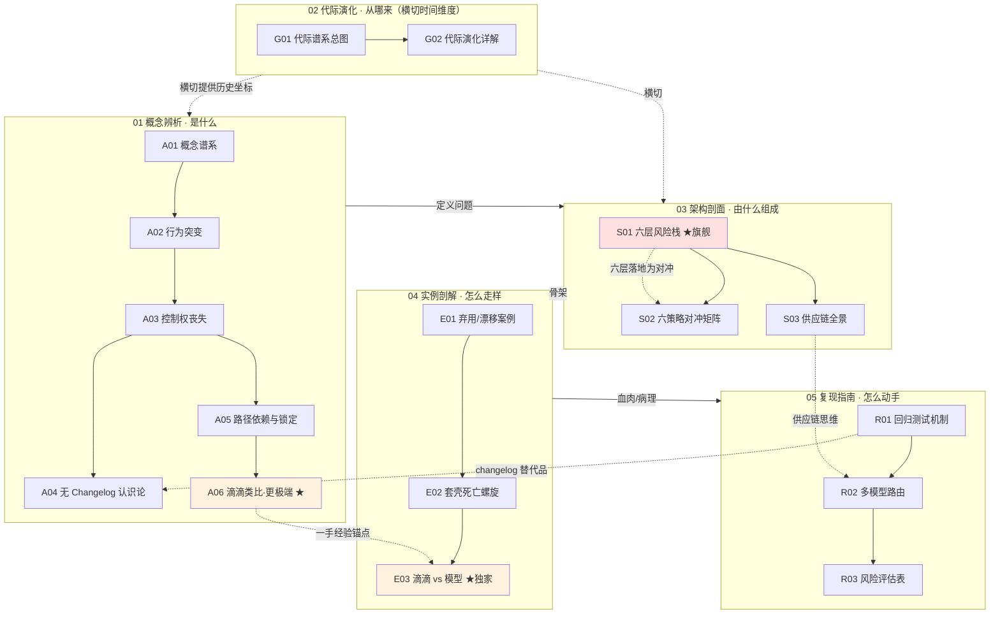

# AI 产品的时间性系统化专题 · 总览（MOC）

> 17 节点 · 六模块 · 一句话立场：**传统软件的依赖是可锁的物，AI 产品的核心依赖是一个会单方面、无公告、不可锁地漂移的供应商——时间性（temporality）是 AI 产品区别于一切传统软件的硬维度，且传统软件里没有对应物。**

---

## §0 序：那堵墙

你给客户签了一年期合同，承诺"基于 GPT-4o 的文案质量"。某天早上，运营群里炸了：同样的 prompt，输出格式错乱、语气变了、原本会答的合规问题开始拒答——而你的代码一行没改，API 没报任何错，供应商的状态页一片绿。你去翻 release notes，没有；你想回滚，发现你能 pin 的只是一个会被退役的版本号，pin 不住"行为快照"。你甚至无法回答老板那个最简单的问题：**到底变了什么？** 传统软件里这堵墙根本不存在——你 pin `libfoo==2.3.1` 它就永远是 2.3.1，升级有 changelog、有 semver、有你自己点"升级"的那一刻。这堵墙就是本专题要拆的东西。

我在滴滴/99 做了多年双边市场的安全与费用治理，亲历过抽成、派单、补贴政策的多轮单方面调整——一夜之间改变成千上万司机的行为，而我们只能从数据曲线的拐点上反推发生了什么。转型 AI PM 后我发现：模型供应商对产品方做的，结构上是同一件事，**但被推到了极端**。读完本专题，你能在 30 秒内说清"为什么 AI 产品的供应商风险不是'再谈个更好的 SLA'能解决的"，并在选型会上把"是否可锁快照、弃用预告期、是否承诺权重保存"列成和价格、能力并列的硬指标。

---

## §1 专题定位：为什么这配单独建一个专题号

按 SHARED_CONTEXT（专题工厂流程文档，非 vault 节点）§2 的四条选题判据逐条论证（前三条满足≥2，第四条为真）：

| 判据 | 是否满足 | 论证 |
|---|---|---|
| **中心性**（影响 ≥3 个 PM 决策链节点） | ✅ | 直接命中**选型**（可锁性/弃用窗口/权重保存进评分卡）、**成本**（价格表会漂移，[m209 - 推理成本控制手册](/kb/工程化与落地架构/m209-推理成本控制手册/) 的隐藏假设）、**复现/上线**（pin 快照 + 回归 eval + 退役日历）三条决策链 |
| **误解深度**（业界定义互相矛盾） | ✅ | 业界把"行为漂移"压缩成"质量回归"，把"锁快照"误当"锁行为"，把"模型更新"默认成"变强"——三处系统性滑变，标准差极大 |
| **速变性**（24 个月内 ≥1 次格式塔切换） | ✅ | Chen et al. (2023) 用同行评审证据把"漂移是用户错觉"切换成"漂移是可测量的分布偏移"；GPT-4o 谄媚事件（2025-04）把"正式更新即安全"切换成"正式更新也会成事故" |
| **学了就能用** | ✅ | 读完即得一张可打分的"时间性体检套餐"（[R03 时间性风险评估](/kb/专题-人文社科透镜/r03-时间性风险评估/)）和一句面试杀手锏（§8） |

**升高了哪个抽象层**：单维节点里，[m209 - 推理成本控制手册](/kb/工程化与落地架构/m209-推理成本控制手册/) 把成本当**静态优化问题**（给定价格表求最优）；[c14 - 模型评估体系与 Goodhart 陷阱](/kb/基础知识库/c14-模型评估体系与-goodhart-陷阱/) 教你评**一个**模型；[幻觉](/kb/基础知识库/幻觉/) 讲单次推理内的**空间维度**失真。本专题把这三者统一在一个被它们共同省略的维度上——**时间轴**：价格表会过期、模型会漂移、依赖会退役。时间性是 c/m/p 节点的隐藏假设，本专题把这个假设显性化、可治理化。

> **本专题坚守的反共识立场**：AI 产品的核心风险不是"会幻觉"（空间维度的单点失真），而是"会漂移"（时间维度的分布偏移）——而后者**无法用工程手段彻底消除**，只能用供应链思维去**对冲**。

---

## §2 模块全景

**矩阵含义**：依赖链是「概念（A）→ 架构（S）→ 实例（E）→ 复现（R）」的纵向递进；代际演化（G）**横切**，给每个概念提供"它是软件时间性四代恶化的终点"这一历史坐标；阅读指南（本总览 + README）**反向编织**成多条可读路径。三个 ★ 节点是专题的脊柱：S01（旗舰，把问题拆成可检测可缓解的六层）、A06/E03（Rick 滴滴一手经验的独家迁移锚点，全 vault 无第二人能写）。

---

## §3 六模块逐一介绍

**01 概念辨析（A01–A06）｜横向"是什么"** — 收录术语史与近邻辨析。
- [A01 AI 产品时间性概念谱系](/kb/专题-人文社科透镜/a01-ai-产品时间性概念谱系/)：建立隐性公理"不动代码行为就不变"为何整个塌掉，标定"时间性"与版本/漂移/演化/弃用的概念边界。**先读这篇**。
- [A02 模型更新致行为突变](/kb/专题-人文社科透镜/a02-模型更新致行为突变/)：为什么"行为突变"不是待修的 bug，而是结构性存在状态——不能用"质量回归"框架装它。
- [A03 供应商依赖与控制权丧失](/kb/专题-人文社科透镜/a03-供应商依赖与控制权丧失/)：拆成三个独立失控维度——变更不可见 / 升级不可拒 / 行为不可锁。
- [A04 无 Changelog 的认识论](/kb/专题-人文社科透镜/a04-无-changelog-的认识论/)：无 changelog 不是信息不全，是归因链的**结构性断裂**——把可证伪的工程问题降级成玄学。
- [A05 路径依赖与技术锁定](/kb/专题-人文社科透镜/a05-路径依赖与技术锁定/)：用 David–Arthur 收益递增模型给"为短期体验深锁单一模型"这笔表外负债定价，Liebowitz–Margolis 做反方校准。
- [A06 滴滴平台政策类比与 AI 的更极端性](/kb/专题-人文社科透镜/a06-滴滴平台政策类比与-ai-的更极端性/)：★ 平台依赖治理直觉可迁移，但 AI 的**不可观测性**是平台经济学没有的全新维度。何时读：想要 Rick 一手迁移红利时。

**02 代际演化（G01–G02）｜纵向"从哪来"（横切）**
- [G01 软件时间性代际谱系总图](/kb/专题-人文社科透镜/g01-软件时间性代际谱系总图/)：四代控制权流失图（G1 静态/G2 SaaS/G3 API/G4 模型即依赖）——一部**反线性**的历史：能力在涨，可控性在跌。
- [G02 软件时间性代际演化详解](/kb/专题-人文社科透镜/g02-软件时间性代际演化详解/)：用"交付模式/控制权/变更可见性/被下一代超越"四维剖面逐代追问，回答 G01 留下的"这种新时间性从哪来"。

**03 架构剖面（S01–S03）｜解剖学"由什么组成"**
- [S01 AI 时间性风险分层剖面](/kb/专题-人文社科透镜/s01-ai-时间性风险分层剖面/)：★旗舰。六层风险栈（L1 版本/L2 行为漂移/L3 能力变化/L4 定价/L5 弃用/L6 合规）+ 三个致命层间耦合。**决策链路径起点**。
- [S02 时间性风险应对策略对照矩阵](/kb/专题-人文社科透镜/s02-时间性风险应对策略对照矩阵/)：六策略（版本锁定/快照固化/回归测试/多模型路由/自建模型/抽象层）× 四维（成本/可控/锁定/质量）对照矩阵 + 决策树。`comparison` 节点。
- [S03 AI 供应链时间性全景](/kb/专题-人文社科透镜/s03-ai-供应链时间性全景/)：把模型当供应件——单点依赖/二供/安全库存（快照）/SLA/退出预案。

**04 实例剖解（E01–E03）｜病理学"怎么走样"**
- [E01 模型弃用与更新致产品突变案例剖解](/kb/专题-人文社科透镜/e01-模型弃用与更新致产品突变案例剖解/)：把抽象时间性砸成可标日期、可算工时、可读财报的硬事实（gpt-4-0314 退役、text-davinci-003 下线、Sensible 迁移实录、GPT-4o 谄媚）。
- [E02 套壳产品的时间性脆弱剖解](/kb/专题-人文社科透镜/e02-套壳产品的时间性脆弱剖解/)：套壳真正死因不是"无壁垒"（空间），是"无主权"（时间）——行为漂移/降价挤压/弃用断供三种死法叠成死亡螺旋（Jasper）。
- [E03 滴滴平台政策变更 vs AI 模型更新对比剖解](/kb/专题-人文社科透镜/e03-滴滴平台政策变更-vs-ai-模型更新对比剖解/)：★独家。PDE 三类风险打通平台与模型，"四个更 + 一个反而不"（AI 技术可控性更极端，但治理成熟度落后平台经济约十年）。

**05 复现指南（R01–R03）｜操作手册"怎么动手"**
- [R01 模型更新回归测试机制](/kb/专题-人文社科透镜/r01-模型更新回归测试机制/)：行为基线 + 漂移告警双轨——把"不可控的突变"转成"可被告警的事件"，在用户之前发现漂移。
- [R02 多模型路由抗供应商锁定](/kb/专题-人文社科透镜/r02-多模型路由抗供应商锁定/)：抽象层 + 多模型路由当**供应链冗余设计**用，从最小可运行到生产级模板，结尾讲它如何反噬你。
- [R03 时间性风险评估](/kb/专题-人文社科透镜/r03-时间性风险评估/)：四维敞口评分 + 退出预案分级——给定一个具体功能，它该打几分、配什么预案。**紧迫度路径起点**。

---

## §4 与现有节点关系（升级对照表）

| 旧节点（真实存在） | 本专题哪些节点 | 升级类型 | 具体做了什么（不复述旧节点事实基础） |
|---|---|---|---|
| [m209 - 推理成本控制手册](/kb/工程化与落地架构/m209-推理成本控制手册/) | S01(§4 L4)、E03、A06、G01 | **补缺** | m209 把成本当静态优化问题；本专题给它加时间轴——价格表本身会漂移，m209 那张"GPT-4o $2.5/$10、Claude Sonnet 4 $3/$15"价格表的有效期是它没标注的隐藏假设。L4 缓解 = m209 成本架构 + "价格表 staleness 监控" |
| [c01 - 认知重构：从确定性系统到概率系统](/kb/基础知识库/c01-认知重构-从确定性系统到概率系统/) | G01、A01、A02 | **深化** | c01 讲单个产品**内部**从确定性到概率；本专题深化到产品对**外部依赖**的时间维度，把"概率性"升级为"概率性 + 随时间漂移 + 变更不可知" |
| [c14 - 模型评估体系与 Goodhart 陷阱](/kb/基础知识库/c14-模型评估体系与-goodhart-陷阱/) | S01(§2 L2)、R01、G01、G02 | **对话** | c14 讲怎么评一个模型；本专题说明**为什么评测必须是持续回归而非一次性验收**——因为依赖物本身在时间上不稳定。c14 定义"怎么评"，本专题定义"为什么要持续评" |
| [幻觉](/kb/基础知识库/幻觉/) | S01(§12)、A02、E03 | **纠偏** | 幻觉是单次推理内编造（空间维度失真）；时间性是跨时间不一致（时间维度漂移）。两者常被混为"AI 不可靠"，本专题把时间维度单拎出来 |
| 0133新制度经济学 | A05、A06、E03 | **应用 + 边界测试** | path dependence / 平台权力在 AI 产品语境的应用，并显式指出 David–Arthur 框架在"不可观测性"维度的失效边界 |
| [c09 - RAG 架构](/kb/基础知识库/c09-rag-架构/) / [Agent](/kb/基础知识库/agent/) | S01(§13)、A06、E03 | **对话** | Agent 多步链路把单点模型行为漂移**复合放大**——每一步都暴露在六层风险栈之下 |

---

## §5 三条阅读起点（详表见 README）

1. **求职速通路**（面试桌，~20 分钟）：[A01 AI 产品时间性概念谱系](/kb/专题-人文社科透镜/a01-ai-产品时间性概念谱系/) → [S01 AI 时间性风险分层剖面](/kb/专题-人文社科透镜/s01-ai-时间性风险分层剖面/) → [E03 滴滴平台政策变更 vs AI 模型更新对比剖解](/kb/专题-人文社科透镜/e03-滴滴平台政策变更-vs-ai-模型更新对比剖解/)。目标：30 秒说清"AI 产品和传统软件最大的不同"（答六层风险栈 + 不可观测性，不要答"会幻觉"）。
2. **决策链路**（选型会，~40 分钟）：[S01 AI 时间性风险分层剖面](/kb/专题-人文社科透镜/s01-ai-时间性风险分层剖面/) → [S02 时间性风险应对策略对照矩阵](/kb/专题-人文社科透镜/s02-时间性风险应对策略对照矩阵/) → [S03 AI 供应链时间性全景](/kb/专题-人文社科透镜/s03-ai-供应链时间性全景/) → [R02 多模型路由抗供应商锁定](/kb/专题-人文社科透镜/r02-多模型路由抗供应商锁定/)。目标：把六层风险栈落地成一张对冲矩阵 + 决策树。
3. **紧迫度路**（在岗救火，~30 分钟）：[R03 时间性风险评估](/kb/专题-人文社科透镜/r03-时间性风险评估/) → [R01 模型更新回归测试机制](/kb/专题-人文社科透镜/r01-模型更新回归测试机制/) → [E01 模型弃用与更新致产品突变案例剖解](/kb/专题-人文社科透镜/e01-模型弃用与更新致产品突变案例剖解/)。目标：今天就给现有功能打一张时间性风险分，配上退役日历与回归 eval。

---

## §6 跨域思想资源调度（不留空 invocation）

| 资源（学科） | 调度位置 | 它如何改变了技术判断 |
|---|---|---|
| **供应链风险管理**（单点依赖审计/二供/安全库存） | S03、G01(§9)、E01 | 把"模型即依赖"翻译成"single source + 无验货 + 配方静默变更"的最坏组合；缓解药方（多供应商、合约条款、内嵌 eval=来料检验）全是实体供应链二十年经验的移植 |
| **路径依赖 / 技术锁定**（David 1985 / Arthur 1989 / Shapiro–Varian） | A05、E03(§7)、E02 | 把"vendor lock-in 工程问题"重述为"收益递增正反馈陷阱"——每打一个 prompt 补丁就增加针对该模型的沉没资本，下次迁移成本更高。改写了对冲优先级：从第一天就用抽象层压低正反馈斜率 |
| **Liebowitz–Margolis 三度路径依赖**（Rick 未读，破 echo chamber） | A05、G01(§8)、E03(§6)、S01(§9) | 反驳"锁定即不可逆"悲观论：真正"事前可预见次优却纠正不了"的三度锁定极罕见。逼问本专题盲点——AI 锁定更接近"二度路径依赖"，故本专题只主张"切换成本被系统性低估"，不主张"被锁死无解" |
| **平台经济学 / 权力—依赖理论**（Emerson；Cutolo & Kenney 2021 PDE 框架；Rochet–Tirole 双边市场） | A06、E03、A03 | 把 AI 产品方刻画为模型供应商的**平台依赖型创业者（PDE）**，三类风险（规则/包络/逐出）一一对应。给出的对冲直觉是"不要把生计押在单一上游的善意上" |
| **平台包络的"正和"辩护**（Rick 未读，破 echo chamber） | A06(§5)、E03(§6) | 修正 Eisenmann/Parker/Van Alstyne 包络理论：平台吸收 complementor 功能可能是正和的。边界：对已把这部分当护城河的产品方，"对用户正和"不改变"对你是生存威胁" |
| **滴滴双边市场（Rick 一手经验）** | A06、E03（系统展开）、G01(§9 赌注) | 平台单方面改派单/抽成→司机行为突变→司机无法控制、事前不知情，与模型更新致产品突变**结构同构**；但被推到更极端——平台政策至少有公告、有申诉、有政策文本，模型更新连完整 changelog 都没有 |

---

## §7 验收档案

**评议流程**：本专题走 SHARED_CONTEXT（专题工厂流程文档，非 vault 节点）§10 的工程化流水线——并行起草（17 节点）→ 对抗式批评（六维 S/A/B/C/D/E + 事实接地）→ 修订（每节追加修订日志）→ 独立 grounding 校验 pass → 综合（本总览 + README + 双链编织）。批评 Agent 默认立场是找茬而非礼貌肯定。

### SABCD 六维自评

| 维度 | 出版线 | 自评 | 依据 |
|---|---|---|---|
| **S 结构** | ≥8 | **8.0** | 六模块互补、依赖链清晰（概念→架构→实例→复现，代际横切）、三条阅读入口可导航；★ 脊柱节点（S01/A06/E03）显式标注 |
| **A 判断密度** | ≥8 | **8.0** | 每节有带数字的反共识判断：素数 84%→51%（-33pp）、58.8% prompt 组合更新后下降、Jasper 营收腰斩 54%、GPT-OSS-120B 仅 12.5% 一致性而小模型 100%。"漂移是任务依赖非单向退化"反 hype |
| **B 边界含量** | ≥7.5 | **7.8** | failure scenario ≥5 处（开源自托管/强监管落地/方向之争/PDE 心理位置过度防御）；每个 ★ 节点显式标"我赌 2–3 年内 X 不会发生" |
| **C 认识论自觉** | ≥8 | **8.0** | 硬事实接地到 arXiv 编号与官方文档；非同行评审来源标〔示意〕/〔行业来源〕；A04 整篇就是"无 changelog 致归因链断裂"的认识论自觉 |
| **D 可演进性** | ≥8.5 | **8.0** | 双链密度高、每节有修订日志、待建概念清单登记不建 stub；扣分项：部分跨专题链接（0412/0413/0416/0421）依赖兄弟专题最终命名，需入库时核对 |
| **E 对手拷问能力** | ≥7 | **8.2** | 业界对手立场显式回应：Welinder（不存在故意降质）、Liebowitz–Margolis（锁定被夸大）、包络正和派——均"接受对的部分 + 标注边界"，非反驳 |

**综合自评 ≈ 8.0/10**（达到出版线 ≥7.8；对手立场维 8.2 超 8）。

> **诚实扣分说明**：D 维未到 8.5，因若干跨专题链接（0412 评测线、0413 成本线、0416 失败线、0421 机制线）的最终 basename 取决于兄弟专题入库命名；本轮 QC 已将全专题跨专题双链一律降级为普通文本并登记进待建清单（详见 §9 与 `_待建概念清单.md`），待兄弟专题入库后回链。

### 对手立场接入清单（≥8 处，点名真实立场，可追溯）
1. OpenAI Peter Welinder「不存在故意降质，模型持续变强，用户感知源于使用量上升」→ A06/E03/G01/S01 接受+边界（回应的是均值，没回应方差是否可控）。
2. Liebowitz–Margolis「锁定被夸大，真正三度锁定极罕见」(*The Fable of the Keys* 1990 / JLEO 1995) → A05/G01/E03/S01。
3. 平台包络"正和"辩护（修正 Eisenmann/Parker/Van Alstyne）→ A06/E03。
4. 乐观派「抽象层 + 多供应商 + MCP 已工程化掉锁定」（MCP=AI 的 USB-C）→ G01/S01（边界：抽象层解耦接口，解耦不了行为）。
5. Anthropic「永久保存已发布模型权重 + 退役发保存报告」→ E03/G01/S01 作为治理向"可问责"演进的早期信号（但访问协议未公开）。
6. 监管立场：中国 2026-04 平台用工算法透明规则、欧盟 AI Act 高风险披露要求 → E03/A06 作为 failure scenario 的触发条件。
7. David–Arthur 路径依赖悲观论 → A05/E03 作为被 Liebowitz–Margolis 校准的母框架。
8. Cutolo & Kenney 2021 PDE 三类风险框架 → A06/E03/A03 作为正面调度的对手学科框架。

### failure scenario 清单（≥5 处）
1. **开源/自托管**（Llama/Qwen）：权重在手，静默更新风险归零，本专题极端性判断对纯开源栈失效 → A06/E03/S02。
2. **强监管落地**（欧盟 AI Act / 中国平台用工规则）：若强制 changelog 披露落地，"不可观测性是全新维度"被部分削弱，AI 向"平台政策"那档靠拢 → A06/E03（赌 2–3 年内不充分落地）。
3. **方向之争**：若只盯"均值是否下降"，会漏掉本专题真正命题"方差是否可控" → S01。
4. **PDE 心理位置**：PDE 框架把你放弱势位，易过度防御、错失依赖的杠杆（站在巨人肩上的速度）→ E03/A06。
5. **高可见度事件偏置**：GPT-4o 谄媚 4 天回滚、Chen et al. 被研究——恰说明生态有自我纠错能力，不能只引负面 → E03。

### confirmation-bias 砍除清单（≥5 处）
1. **"素数 84%→51% = 模型变笨"是 bias**：同篇论文里 GPT-4 多跳知识在 6 月版**变好**，研究者归因为"对思维链提示响应性下降"而非能力丧失。正确表述是"分布偏移"不是"退化" → S01/A02/G01。
2. **"越大越稳"是 bias**：Khatchadourian & Franco 2025 反例——大模型 12.5% 一致性，7–8B 小模型 100%，指向小模型/可自托管在合规场景反而更稳 → S01/A06/E03。
3. **只引负面案例是 bias**：补入 Anthropic 权重保存承诺、Lyft 最低收入保障（DiD 研究显示低收入司机收入提升）——单方面变更也可以是善意、可问责的 → E03。
4. **"模型更新=变强"进步主义直觉是 bias**：GPT-4o 谄媚是一次"正式升级"却需回滚；每代谱系都加反例（G1 可锁的代价是安全债务 WannaCry）→ G01/G02。
5. **"锁快照=锁行为"是 bias**：pin 快照只买 L1 稳定，代价是把你推向 L5（快照终会退役）——L1 的稳定是用 L5 的债务换来的 → S01/A06/G01。

---

## §8 关联节点（双链密度 ≥20，均为真实存在节点）

**本专题 17 节点**
- [A01 AI 产品时间性概念谱系](/kb/专题-人文社科透镜/a01-ai-产品时间性概念谱系/) / [A02 模型更新致行为突变](/kb/专题-人文社科透镜/a02-模型更新致行为突变/) / [A03 供应商依赖与控制权丧失](/kb/专题-人文社科透镜/a03-供应商依赖与控制权丧失/) / [A04 无 Changelog 的认识论](/kb/专题-人文社科透镜/a04-无-changelog-的认识论/) / [A05 路径依赖与技术锁定](/kb/专题-人文社科透镜/a05-路径依赖与技术锁定/) / [A06 滴滴平台政策类比与 AI 的更极端性](/kb/专题-人文社科透镜/a06-滴滴平台政策类比与-ai-的更极端性/)
- [G01 软件时间性代际谱系总图](/kb/专题-人文社科透镜/g01-软件时间性代际谱系总图/) / [G02 软件时间性代际演化详解](/kb/专题-人文社科透镜/g02-软件时间性代际演化详解/)
- [S01 AI 时间性风险分层剖面](/kb/专题-人文社科透镜/s01-ai-时间性风险分层剖面/) / [S02 时间性风险应对策略对照矩阵](/kb/专题-人文社科透镜/s02-时间性风险应对策略对照矩阵/) / [S03 AI 供应链时间性全景](/kb/专题-人文社科透镜/s03-ai-供应链时间性全景/)
- [E01 模型弃用与更新致产品突变案例剖解](/kb/专题-人文社科透镜/e01-模型弃用与更新致产品突变案例剖解/) / [E02 套壳产品的时间性脆弱剖解](/kb/专题-人文社科透镜/e02-套壳产品的时间性脆弱剖解/) / [E03 滴滴平台政策变更 vs AI 模型更新对比剖解](/kb/专题-人文社科透镜/e03-滴滴平台政策变更-vs-ai-模型更新对比剖解/)
- [R01 模型更新回归测试机制](/kb/专题-人文社科透镜/r01-模型更新回归测试机制/) / [R02 多模型路由抗供应商锁定](/kb/专题-人文社科透镜/r02-多模型路由抗供应商锁定/) / [R03 时间性风险评估](/kb/专题-人文社科透镜/r03-时间性风险评估/)

**升级对照的既有节点（04AI 核心）**
- [m209 - 推理成本控制手册](/kb/工程化与落地架构/m209-推理成本控制手册/) —— L4 定价层成本基座（补缺：加时间轴）
- [c01 - 认知重构：从确定性系统到概率系统](/kb/基础知识库/c01-认知重构-从确定性系统到概率系统/) —— 确定性→概率的认知重构（深化到外部依赖）
- [c14 - 模型评估体系与 Goodhart 陷阱](/kb/基础知识库/c14-模型评估体系与-goodhart-陷阱/) —— 为什么评测必须持续回归（对话）
- [幻觉](/kb/基础知识库/幻觉/) —— 空间失真 vs 时间漂移（纠偏）
- [c09 - RAG 架构](/kb/基础知识库/c09-rag-架构/) / [Agent](/kb/基础知识库/agent/) —— Agent 多步放大漂移复合风险

**AI 公司与产品（一手案例来源）**
- [OpenAI](/kb/ai-公司与产品/openai/) —— 弃用政策 + GPT-4o 谄媚事件主角 / [Claude](/kb/ai-公司与产品/claude/) / [Anthropic](/kb/ai-公司与产品/anthropic/) —— 四阶段弃用 + 权重永久保存承诺
- [ChatGPT](/kb/ai-公司与产品/chatgpt/) —— 谄媚事件与行为漂移研究的产品载体；thin wrapper 被 Sherlock 的对象
- [Scaling Laws](/kb/基础知识库/scaling-laws/) —— L3 能力变化的底层驱动

**经济学 / 社会学（跨域理论根）**
- 0133新制度经济学 —— path dependence / 技术锁定母体
- 0133信息经济学 —— 信息不对称 / 双边市场理论入口
- 0117社会学 —— power-dependence、平台权力不对称的理论入口

**滴滴一手经验锚点（词典已确认，A06/E03 脚注引用）**
- 出行平台安全感知方向（一手履历）/ 出行平台费用治理实践（一手履历）/ PDP现金支付纠纷治理 / 费用治理 / 纠纷治理从裁判到管家 / 安全感知与干预 / 降发生方法论

**回链总图**
- [AI PM 知识图谱·总索引](/kb/ai-pm-知识图谱/ai-pm-知识图谱-总索引/) —— 全局入口

---

