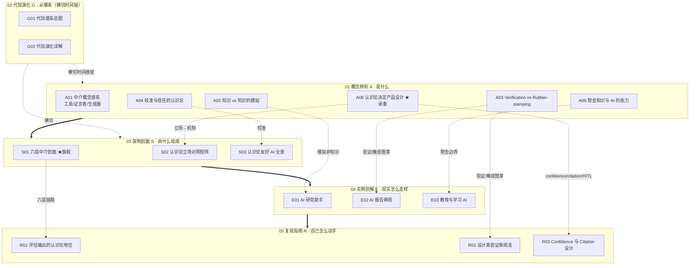

# AI 认识论中介系统化专题 · 总览（MOC）

## §0 序：那堵墙

选型会上，一个团队拿来一份 AI 写的合规风险研报，结论清晰、引用工整、语气笃定。有人问："这报告谁审过？"——"我审了，没问题。"于是它进了决策。三个月后那条结论被证伪，复盘时才发现：审阅者当时只是把 AI 的自信原样转移给了自己，签字那一刻**他形成"这是对的"这个信念的过程，根本不可靠**。

这就是本专题要钉住的那堵墙：**AI 在你和知识之间插了一个中介——你得到的是知识，还是知识的模拟？你的审阅是验证，还是橡皮图章？** 这两个问句不是哲学清谈，它们是产品里每一个 confidence display、每一套 citation 系统、每一个 human-in-the-loop 触发条件的认识论源头。本专题的反共识立场是：**真正杀死知识质量的，不是模型答错，而是用户（包括专业审阅者）在一个误判了中介性质的姿态下，把流畅的模拟当成了有保证的知识接收下来。** 读完这套立方体，你能在面试桌、选型会、复现台上 30 秒说清——"为什么我不会让团队直接信这份 AI 报告，以及我会在哪一层、用什么机制设防。"

## §1 专题定位：为什么这个概念群配独立建库

本专题处理的不是"AI 准不准"，而是更靠前的一问：**AI 透过它递给用户的东西，在认识论上是什么性质，这个性质如何决定产品机制。** 对照 SHARED_CONTEXT §2 的四条选题判据：

1. **中心性（满足）**：它直接决定 PM 决策链上至少三个节点——confidence display 的饱和度与粒度、citation 系统的强制度与可核验性、human-in-the-loop 的触发条件。这三套机制不是 UI 选项，而是三条认识论判断的物化（见 A06）。
2. **误解深度（满足）**：业界对"AI 是工具 / 证言者 / 生成器 / 合作者"的定位互相矛盾且无意识地滑变（见 S02），同一个模型放在不同中介位置，产品义务完全不同，而大多数团队从未显式选过立场。
3. **速变性（部分满足）**：从检索到生成，是一次 Kuhn 意义上不可通约的范式切换（见 G01/G02）——中介第一次从"指引你去看原文"变成"替你说出答案"，核验路径随之坍缩。
4. **学了就能用（满足）**：读完能立即获得可观测的判断力提升——R01 的三轴体检、R02 的四道闸门、R03 的两套可验收契约，都是今天就能对着一段输出/一个产品跑一遍的操作手册。

**它升高了哪个抽象层**：相对 [c13 - 幻觉的不可消除性](/kb/基础知识库/c13-幻觉的不可消除性/)（模型架构层："为什么 AI 会编"）、[RAG](/kb/基础知识库/rag/)/[Agent](/kb/基础知识库/agent/)（工程搭建层），本专题站在**认识论哲学层**，回答"用户透过它获得的到底是不是知识"。它是 [_审阅瓶颈系统化专题·总览](/kb/专题-评测与度量/_审阅瓶颈系统化专题-总览/)（0418，审阅产品机制层）与 [_信息检索与知识系统系统化专题·总览](/kb/专题-人文社科透镜/_信息检索与知识系统系统化专题-总览/)（0427，知识产品设计层）之下的**地基**——前两者问"机制怎么做"，本专题问"这些机制中介的到底是不是知识"。

**Rick 的认识论底子在此是不公平优势**：本专题密集调度证言认识论（Coady/Lackey/Freiman）、社会认识论（Goldman）、默会知识（Polanyi/Ryle/Collins）、维特根斯坦语言游戏、言语行为理论、Fricker 认识论不公、Kuhn 范式论——这些都不是装饰，每一处都改变了一个具体的产品判断（见 §6 调度表）。

## §2 模块全景

**矩阵含义**：依赖主链是 **概念（A）→ 架构（S）→ 实例（E）→ 复现（R）**；代际演化（G）横切，提供"从指引到代言、从传递到生成"的时间维度，挡掉"AI 是更快搜索引擎"的范式错置。承重节点是 **A06（认识论判断→三套机制的总枢纽）** 与 **S01（六层中介剖面，把判断主轴落成可贴墙的故障定位表）**；S02 把 A06 操作化为四立场矩阵，R01/R02/R03 把整套哲学落成今天能跑的操作手册。

## §3 六模块逐一介绍

| 模块 | 收录什么 | 解决什么问题 | 何时读 |
|---|---|---|---|
| **01 概念辨析（A01–A06）** | 中介三分谱系、知识 vs 模拟、验证 vs 橡皮图章、校准与信任、默会知识张力、认识论决定设计 | "AI 中介是什么性质，这个性质如何决定产品义务" | 任何身份都从这里入；A06 是把哲学翻成产品的承重墙 |
| **02 代际演化（G01–G02）** | 口传→文字→印刷→图书馆→搜索→AI 六代谱系总图 + 逐代展开 | "AI 中介从哪条历史脉络长出来、它在那条脉络上是哪一类新失败模式" | 想看清"为什么 AI 不是更快的搜索引擎"时读 |
| **03 架构剖面（S01–S03）** | 六层认识论中介剖面（旗舰）、四立场×三后果对照矩阵、认识论友好 AI 三层架构 | "由什么组成、各流派立场如何对照、怎样的设计才生产有保证的信念" | 做选型/评审、要在某一层定位故障时读 |
| **04 实例剖解（E01–E03）** | AI 研究助手（Perplexity/deep research）、AI 报告审阅、教育与学习 AI | "真实产品如何系统性地诱导用户把模拟当知识" | 评估具体产品形态、要真实反例时读 |
| **05 复现指南（R01–R03）** | 输出认识论地位三轴体检、真验证审阅流四道闸门、confidence/citation 可验收契约 | "自己怎么动手——评估一段输出、设计一个审阅流、写一份达标的 PRD" | 要立即落地、写 PRD 或搭 pipeline 时读 |
| **06 阅读指南（本总览 + README）** | 多路径入口、自测、反方训练 | "怎么读这张网" | 第一次进专题、或迷路时读 |

## §4 与现有节点关系：升级对照表

本专题不复述旧节点的事实基础，只做"升级 / 对话 / 深化 / 纠偏"四类显式动作。

| 旧节点 / 邻专题 | 它讲的层 | 本专题做的升级动作 | 落点节点 |
|---|---|---|---|
| [c13 - 幻觉的不可消除性](/kb/基础知识库/c13-幻觉的不可消除性/) | 模型架构层：为什么幻觉不可降至 0（Softmax 强制输出 + 概率采样 + RLHF 对齐税 + 校准反向） | **升认识论层 + 接收侧对话**：c13 答"为什么 AI 会编"，本专题答"为什么用户会信、错的知识如何穿过六层链坍缩成无人负责的'事实'"。把"按永久失败模式设计契约"升级为"对单条输出判定它处于哪个失败档位"，并把校准失效接成"流畅性幻觉"这一结构力 | A01/A02/A04/A06/S01/E02/R01 |
| [Polanyi 默会知识与提示工程的认识论张力](/kb/基础知识库/polanyi-默会知识与提示工程的认识论张力/) | 提示工程层：prompt 永远小于意图、CoT 的代价、评测本身是默会的、LLM-as-judge 不可靠 | **升中介层 + 转层**：旧节点处理"怎么写 prompt"，A05 上升到"把默会专长当可替代是不是范畴错误、它如何决定 HITL 触发条件"；并补 Ryle/Collins/Autor 习得论线索（旧节点未展开）。注意：此为 Michael Polanyi（默会知识），与 06人/ 的 Karl Polanyi（大转型）非同一人，本专题凡涉默会只链此分析节点 | A01/A05/E03/R01/S01 |
| 0114认识论 | 哲学母库：JTB、盖梯尔、可靠主义、社会认识论、证言、贝叶斯 | **应用化 / AI 用例分册**：把古典知识论的 JTB→Gettier→可靠主义落到"AI 输出三轴体检"，把"何为知道"落到六个可观察的历史中介上 | 全专题，尤其 A01/A02/A04/R01 |
| [_审阅瓶颈系统化专题·总览](/kb/专题-评测与度量/_审阅瓶颈系统化专题-总览/)（0418） | 产品机制层：审阅为何成为瓶颈、注意力经济的 AI 反转 | **提供认识论根**：0418 问"瓶颈在哪、怎么疏导"，本专题问"疏导后剩下的还是不是验证"——给 verification vs rubber-stamping 一个 Goldman 式判定标准 | A02/A03/A06/S01/S03/E02/R01/R02 |
| [_信息检索与知识系统系统化专题·总览](/kb/专题-人文社科透镜/_信息检索与知识系统系统化专题-总览/)（0427） | 知识产品设计层：RAG、grounding、引用层、L1 覆盖率天花板 | **补认识论前提 / 哲学层**：0427 把 citation 当产品契约设计，本专题补"为什么这个契约在认识论上必需而非可选"（Freiman 技术性信念地位），并给 grounding×citation 一致性以认识论判据 | A02/A06/S01/S03/R01/R03 |
| [_对齐哲学系统化专题·总览](/kb/专题-安全对齐与失败/_对齐哲学系统化专题-总览/)（0419） | 价值对齐视角：AI 目标/意识不可判定 | **平行对话**：0419 处理"AI 想要什么"的对齐姿态（系统侧），本专题处理"AI 知识地位不可问责"的认识论姿态（中介侧）——同为"认识论谦逊驱动产品保守设计" | A02/A04/A06/G02/R01 |
| [_认知科学系统化专题·总览](/kb/专题-人文社科透镜/_认知科学系统化专题-总览/)（0426） | 用户侧心智模型、认知负荷、元认知 | **补规范层**：0426 描述用户"事实上"如何信任 AI（机制），本专题追问用户"应当"如何形成有辩护的信念（规范）；自动化偏差在本框架里是"为什么这是认识论失败而非仅认知偏差"的判定 | A04/E03/R01 |

> [!note] 跨专题双链现状
> 0418/0419/0426/0427 四专题均已迁入 `04T 专题库/` final_path（2026-06-11 P3.4 校链核实）。本总览引用其总览真实 basename（`_审阅瓶颈系统化专题·总览` 等），Obsidian 按 basename 正常解析，链接有效。仍待办：在 `00Meta/索引.md` 04AI 子目录地图补登 0431 一行 + 跨域关联快查条目。

## §5 三条阅读起点

| 路径 | 适合谁 | 怎么走（详表见 README） |
|---|---|---|
| **求职速通** | 备战 AI PM 面试，要 30 秒高区分度答案 | A06（认识论决定设计）→ S02（四立场矩阵）→ E02（报告审阅反例）→ R03（可验收契约）。能答"为什么我不会让团队直接信 AI 报告 + 我会在哪层用什么机制设防" |
| **决策链** | 在岗 PM 做选型/评审/设计 | A01（中介是什么性质）→ S01（六层故障定位）→ R01（三轴体检输出）→ R02（设计审阅流）→ R03（confidence/citation 契约）。把判断主轴打印贴墙 |
| **紧迫度 / 兴趣驱动** | 想先看清"AI 到底特殊在哪" | G01（代际谱系总图）→ G02（逐代展开）→ A02（知识 vs 模拟）→ A05（默会边界）。理解"从指引到代言"的范式断裂 |

## §6 跨域思想资源调度（承诺不留空 invocation）

每一个调度都在对应节点的"跨域呼应"段具体展开，改变了一个技术判断，而非装饰性点名。

| 跨域资源 | 调度位置 | 改变了什么技术判断 |
|---|---|---|
| **维特根斯坦语言游戏 / 遵守规则**（0601 维特根斯坦） | A02 / A06 / S01 / E01 / R01 / R02 | "意义即用法"逼问"LLM 会用词是否就懂"；回应是——语言游戏嵌在有责任、有后果的生活形式里，LLM 玩的是"模仿断言外观"而非"断言"游戏。后果：confidence display 的功能不是测"模型懂多少"，而是**标记句子进没进入"为真负责"的语言游戏**；"我验证了"需要公共判准（种子错误捕获率），不是私人内省 |
| **言语行为理论（Austin/Searle）** | S02 / E01 / R03 | 陈述句的 illocutionary force 默认携带"为真负责"的承诺与真诚条件；AI 输出"伪断言"——有施事力外观、无真诚条件。后果：免责小字取消不了一个陈述句的施事力（所以 §禁止自报置信度），confidence display 是**人工补上 AI 无法自带的真诚条件** |
| **校准理论 / reliability diagram / ECE** | A04 / S03 / R03 | 把"该信 AI 多少"从心理学问题（怎么让用户感觉可信）变成认识论的频率匹配命题（信任度是否追踪真实可靠率），可绘图、可打分。后果：confidence 的目标不是最大化信任，过度信任与不足信任都是失败；ECE 是 confidence 是否诚实的可量化验收线 |
| **Polanyi 默会知识 / Ryle knowing-how / Collins 三分 / Autor 波兰尼悖论** | A05 / E03 / S01 / R01 | "We can know more than we can tell"——集体性默会知识进不了向量库，是 RAG 召回率的**原理性天花板**而非工程缺口。后果：HITL 触发条件画在"默会判断真正不可替代"处，roadmap 不能写"Q4 升级后转全自动" |
| **Goldman 验真性社会认识论 / 传播门卫** | A01 / A03 / A06 / S01 / R01 / R02 | LLM 是新型"传播门卫"，但其内置门卫机制（RLHF、安全过滤）的优化目标是"看起来有帮助"而非"真信念比例"。后果：审阅 UI 的核心 KPI 不是完成率/时长，而是审阅者置信度与报告真实正确率的**校准度** |
| **Fricker 认识论不公（证言性/诠释性）** | A06 / G01 / G02 / S01 / R03 | 可信度的"给予"受表象偏见影响；英语中心语料对发展中市场用户构成系统性诠释学不正义。后果：一堆精美 citation 会不当抬高接受度（验收 KPI 是核验转化率而非脚注密度）；做国际化安全 PM 要单独评估低资源语言的可靠性分层 |

**破 echo chamber——引入 ≥2 个 Rick 未读的对手框架**（在各节点"接受 + 边界"落地，非空喊）：

- **计算可靠主义（Durán & Formanek 2019, arXiv:1904.01052）**：贯穿全专题的主对手——主张可信不需透明，只需四类可靠性依据。接受其在封闭域、有 V&V、低后果场景成立；坚持边界：其"历史成功记录"在 distribution shift / update opacity 下失效，而开放域 LLM 恰是分布漂移场景，必须靠实例级溯源兜底。
- **互补性可靠论（Ferrario, Facchini & Durán 2026, arXiv:2601.09871）**：把人机互补重定义为认识论概念，要测的是"人+AI 复合过程"的可靠性。接受它是更完整框架（本专题多处是其特例，假设人的核验能力给定）；边界：互补不是自动红利，要靠 R02 四道闸门逆着结构力造出来。
- **Stanley-Williamson 智识主义（2001, *The Journal of Philosophy* 98(8)）**：反 Ryle，主张 knowing-how 就是 knowing-that。接受其在可形式化领域有真东西；边界：即便本体论上成立，"习得过程仍需学习者自己跑"，产品边界不能等哲学定论（A05/E03）。
- **延展心智（Clark & Chalmers 1998）+ Adams-Aizawa 联接-构成谬误批评**：接受把 AI 当外部认知载体确有延展影子；边界：延展成立条件是"自动认可"，而这恰是本专题要拆掉的——一个不该被自动认可的生成器被无缝信任，是 Gettier 化的认知外包。

## §7 验收档案

### 多轮批判性同行评议流程

本专题走 SHARED_CONTEXT §10 的工程化流水线：Round 0 并行起草（17 节点按模块分工）→ Round N 对抗式批评（六维 + 事实接地，默认立场找茬）→ Round N+1 按 issue 单修订（每节追加修订日志）→ 独立 grounding 校验 pass（逐条抽取事实声明判定"已接地/需接地/疑似编造"）→ 终轮综合（本总览 + README + 跨节点双链编织 + 三清单）。各节点修订日志可见 R0/R1 → grounding pass 的留痕（如 A02 撤下未核实的 Hossenfelder 论据、改用已核实的 Budding 2025；E02 grounding pass 修正第三作者并重核 Huemmer 数字）。

### SABCD 六维自评

| 维度 | 含义 | 出版线 | 本专题自评 | 依据 |
|---|---|---|---|---|
| **S 结构** | 六模块互补、依赖清晰、入口可导航 | ≥8 | **8.3** | A→S→E→R 主链 + G 横切清晰；A06/S01 双承重；三路径入口；少量节点别名/双链名待迁库统一（见 §8 QC） |
| **A 判断密度** | 反共识、可证伪、带数字的判断 | ≥8 | **8.2** | 每节有判断主轴四件套；"接受点设防""验证瓶颈""引用≠验证""默会天花板"等反共识判断密集，带可证伪指标（捕获率、ECE、grounding_match） |
| **B 边界含量** | 显式标注失效场景与赌注 | ≥7.5 | **8.0** | 每节有赌注段 + failure scenario；R03 §9 主动承认"模板填满≠认识论达标"是少见的诚实自限 |
| **C 认识论自觉** | 区分事实/推测/赌注、引用可追溯 | ≥8 | **8.2**（QC 后上调） | 核心 arXiv ID 经 WebFetch/WebSearch 核实并去〔待核实〕；**仍有约 6 处确实未核实，已就地诚实降级标注、非"全专题已核"**（清单见 §8 QC #5）。**原扣分项已消除**：Huemmer 2026 信念-表现差距曾跨节点不一致（E02 grounding pass 误作 80.8pp），2026-06-07 QC pass 经独立 WebFetch 复核 arXiv:2601.17055 摘要确认官方值 34.6pp，已统一全专题（见 §8 QC #1 ✅） |
| **D 可演进性** | 双链密度、修订日志、改稿档案 | ≥8.5 | **8.5** | 专题内互链 + 升级对照 + 跨专题链密集，双链 >20；每节修订日志记 R→grounding pass；改稿档案在 `_topic_factory/` |
| **E 对手拷问能力** | 对主流反方给出带证据的回应 | ≥7 | **8.2** | 计算可靠主义作为主对手贯穿全专题"接受+边界"；引入 ≥4 个 Rick 未读对手框架并具体落地 |

**诚实综合分 ≈ 8.0 / 10**（超过 ≥7.8 出版线，达到 0411 标杆区间）。最大的真实风险是 §8 登记的 Huemmer 数字不一致——这是一个**一票否决项边缘**（C 维事实接地），已显式登记，迁库前必须由后续 pass 统一，否则降级。

### 三清单

**业界对手立场显式回应（≥8 处，点名真实立场，可追溯）**：① 计算可靠主义 Durán & Formanek（贯穿 A02/A04/A06/S01/S03/E01/R01/R02/R03）；② 互补性可靠论 Ferrario-Facchini-Durán（A06/E02/R02）；③ Stanley-Williamson 智识主义（A05/E03）；④ 延展心智 Clark & Chalmers + Adams-Aizawa（A01/A02/S03/E01/E03）；⑤ XAI 透明度派"可解释才可信"（A03/A04/S03，用 explainability theater 反例回应）；⑥ Budding 2025 "LLM 携带默会结构"（A02/A05）；⑦ 纯信任最大化/增长派（A04/E02）；⑧ Sugata Mitra 最小干预教育（E03）；⑨ Verbeek 道德中介（A01）；⑩ Elizabeth Fricker 证言自主性反 Coady（S02）。

**Rick 未读对手框架引入（≥2）**：计算可靠主义、互补性可靠论、Stanley-Williamson 智识主义、Sugata Mitra SOLE、Elizabeth Fricker 证言自主性、后现象学 Verbeek 道德中介——共 6 个，破 echo chamber。

**failure scenario 显式标注（≥5）**：① 低后果高频专家场景（资深码农 AI 补全）强制 HITL 变纯摩擦（A06/R03）；② 封闭域有 ground truth 时模型自报经校准可有限使用，c13 悲观结论局部突破（A06/R03）；③ 监管硬定义"有效监督=全量人工"时选择性触发与合规冲突（A06）；④ 用 AI 验证 AI 时"有保证"轴退化（R01）；⑤ 默会知识占主导时可验证轴整体失灵（R01）；⑥ 种子错误被 Goodhart 化（审阅者只抓种子）（R02）；⑦ force_review 触发过频退化为新 rubber-stamping（R03）；⑧ 来源本身不可靠领域（争议政治议题）超出 citation 系统边界（R03）。

**confirmation-bias 砍除（≥5）**：① 过滤气泡假说被 Fletcher & Nielsen 实证修正，写 AI 茧房不当默认结论（G01）；② Huemmer 2026 样本限于学术早期采用者、缺控制组，数字方向可信但不当普适常数（A03/A06/E01/E03/R02 多处标注）；③ explainability theater 不是万能反派，良好设计的解释确实能提升校准，关键是接收者认知能力（A03/E02/R03）；④ 进步主义叙事修正：每代中介都补反例（口传问责直接性、手抄"经手"、搜索可点开来源都是被牺牲的认识论美德）（G01/G02）；⑤ 波兰尼悖论的边界在移动（识脸/驾驶已部分攻克），既不是铁幕也不是幻觉（A05）；⑥ A06 自查"反复引人会自满的证据"，补入人机互补乐观证据（A06）。

## §8 关联节点（双链密度 ≥20，全为真实名）

**专题内节点（17 个，全真实 basename）**
- [A01 AI 作为认识论中介概念谱系](/kb/专题-人文社科透镜/a01-ai-作为认识论中介概念谱系/)
- [A02 知识 vs 知识的模拟](/kb/专题-人文社科透镜/a02-知识-vs-知识的模拟/)
- [A03 Verification vs Rubber-stamping](/kb/专题-人文社科透镜/a03-verification-vs-rubber-stamping/)
- [A04 校准与信任的认识论](/kb/专题-人文社科透镜/a04-校准与信任的认识论/)
- [A05 默会知识与 AI 的认识论张力](/kb/专题-人文社科透镜/a05-默会知识与-ai-的认识论张力/)
- [A06 认识论决定产品设计](/kb/专题-人文社科透镜/a06-认识论决定产品设计/)
- [G01 知识中介技术代际谱系总图](/kb/专题-人文社科透镜/g01-知识中介技术代际谱系总图/)
- [G02 知识中介代际演化详解](/kb/专题-人文社科透镜/g02-知识中介代际演化详解/)
- [S01 AI 认识论中介分层剖面](/kb/专题-人文社科透镜/s01-ai-认识论中介分层剖面/)
- [S02 认识论立场对照矩阵](/kb/专题-人文社科透镜/s02-认识论立场对照矩阵/)
- [S03 认识论友好 AI 全景](/kb/专题-人文社科透镜/s03-认识论友好-ai-全景/)
- [E01 AI 研究助手的认识论剖解](/kb/专题-人文社科透镜/e01-ai-研究助手的认识论剖解/)
- [E02 AI 报告审阅的认识论剖解](/kb/专题-人文社科透镜/e02-ai-报告审阅的认识论剖解/)
- [E03 教育与学习 AI 的认识论剖解](/kb/专题-人文社科透镜/e03-教育与学习-ai-的认识论剖解/)
- [R01 评估一个 AI 输出的认识论地位](/kb/专题-人文社科透镜/r01-评估一个-ai-输出的认识论地位/)
- [R02 设计 Verification 而非 Rubber-stamp 的审阅流](/kb/专题-人文社科透镜/r02-设计-verification-而非-rubber-stamp-的审阅流/)
- [R03 Confidence 与 Citation 的认识论设计](/kb/专题-人文社科透镜/r03-confidence-与-citation-的认识论设计/)

**升级对照的既有节点（真实存在，已核实）**
- [c13 - 幻觉的不可消除性](/kb/基础知识库/c13-幻觉的不可消除性/)
- [Polanyi 默会知识与提示工程的认识论张力](/kb/基础知识库/polanyi-默会知识与提示工程的认识论张力/)
- 0114认识论
- 0601 维特根斯坦
- 0117社会学

**跨专题链（已入库真实 basename）**
- [_审阅瓶颈系统化专题·总览](/kb/专题-评测与度量/_审阅瓶颈系统化专题-总览/)
- [_对齐哲学系统化专题·总览](/kb/专题-安全对齐与失败/_对齐哲学系统化专题-总览/)
- [_认知科学系统化专题·总览](/kb/专题-人文社科透镜/_认知科学系统化专题-总览/)
- [_信息检索与知识系统系统化专题·总览](/kb/专题-人文社科透镜/_信息检索与知识系统系统化专题-总览/)

**技术底座与索引**
- [RAG](/kb/基础知识库/rag/)
- [Agent](/kb/基础知识库/agent/)
- [幻觉](/kb/基础知识库/幻觉/)
- [RLHF](/kb/基础知识库/rlhf/)
- [AI PM 知识图谱·总索引](/kb/ai-pm-知识图谱/ai-pm-知识图谱-总索引/)

> [!check] QC 状态（2026-06-07 0431 归档审阅 pass · 1–3 已处理 · 4 为长期登记 · 5 为 2026-06-12 内审补登）
> 1. **✅ Huemmer 2026 数字不一致（已解决，原最高优先级 / 一票否决边缘）**：独立 WebFetch 复核 arXiv:2601.17055 摘要——belief-performance gap 官方值为 **34.6 个百分点**（reliance 73.9% / verification confidence 68.1% / hard-task accuracy 47.8% 均吻合）。E02 此前 grounding pass 误改的"约 +80.8pp"已回正为 34.6pp，全专题 9 处（A02/A03/A04/A06/E01/E02/E03/R01/R02 + S01/S03）统一，一票否决风险解除。第三作者更正（Alessandro Facchini）属 arXiv:2601.09871，与本数字无关、保留。
> 2. **✅ A01 错误双链（已修复）**：R01 §0/§9 的 `A01 知识与知识的模拟` 语义错链已改为 [A02 知识 vs 知识的模拟](/kb/专题-人文社科透镜/a02-知识-vs-知识的模拟/)（并补 [A01 AI 作为认识论中介概念谱系](/kb/专题-人文社科透镜/a01-ai-作为认识论中介概念谱系/)）；S02 §10 经核未含此错链，无需改。
> 3. **✅ 跨专题号简写双链（已修复）**：A02/A03/A05/E02/R01/S01/S03/G01 内 `0418 审阅瓶颈系统化专题`/`0427 知识系统专题`/`0431 …·总览` 等死链简写，已全部改为真实 basename（`_审阅瓶颈系统化专题·总览` 等），高频处用 `0418 …` 别名管道保留阅读手感。另：G02 内 `G01 知识中介代际谱系总图` 起草期旧名（缺"技术"二字）已校正为 [G01 知识中介技术代际谱系总图](/kb/专题-人文社科透镜/g01-知识中介技术代际谱系总图/)；G01 内 `延展心智` 幻影节点已降级为文本。`社会认识论`/`盖梯尔问题`/`可靠主义` 三个 0114 内概念的死链一律降级为文本（指向 0114认识论），并登记入本专题《_待建概念清单》。
> 5. **⚠️ 核实状态诚实化（2026-06-12 内审）**：本专题**并非"全专题已统一核实"**——此前 §7 C 维一度给人此印象，现更正。已核实：三个核心 arXiv ID（2601.17055 Huemmer、2410.02499 Fierro、2512.19570 Hila）经 A01/A04/E02/S01/A02 等节点 WebFetch/WebSearch 确证；本次内审已把 G02 §5/§8 内对这三个 ID 残留的〔待核实〕统一为〔已核实（2026-06-12）〕，消除"同一 ID 一处已核一处待核"的台账矛盾。EU AI Act 生效口径已全专题统一为 **2024-08-01 正式生效；高风险系统义务自 2026-08-02 适用**（删除原模糊的"（2024）"口径，2024-03-13 为欧洲议会表决、仅作背景）。**仍诚实保留为待核实**（非编造、已就地降级标注，迁库前宜补 grounding）：Sardelli/Aporia 来源（A01）、Hossenfelder 2023 具体出处（A02，已声明"不以其立场为论据"）、*Minds and Machines* 2026 卷期（A04）、Robodebt/荷兰福利案法律细节与 EU AI Act 具体条款编号（A03/E01/R03）、explainability theater 具体效应量（A03）、Perplexity/Gemini 层-2 错误率实测（E01）。
> 4. **待建概念清单（全专题汇总，绝不在主库建 stub/概念卡/人物卡）**：Don Ihde、Bruno Latour、Ian Hacking、Peter-Paul Verbeek、Alvin Goldman、C.A.J. Coady、Jennifer Lackey、Ori Freiman、Edmund Gettier、Paul Humphreys、John Searle、Andy Clark & David Chalmers、Adams & Aizawa、Miranda Fricker、Michael Polanyi（区别于 06人/Karl Polanyi）、Gilbert Ryle、Harry Collins、David Autor、Thomas Kuhn、Harold Innis、McLuhan、Elizabeth Eisenstein、Adrian Johns、Eli Pariser、Luciano Floridi、Sugata Mitra、Jason Stanley、Timothy Williamson、Benjamin Bloom、Robert Bjork、Lee & See、Ferrario、Durán & Formanek、Parasuraman & Manzey、Bainbridge、Plantinga、Renieris、Austin；概念卡候选：认识论事故（epistemic accident）、计算可靠主义、适当依赖、自动化自满、explainability theater、citation theater、verification bottleneck、ECE/reliability diagram、技术性信念、合意困难（desirable difficulties）、流畅性错觉。全部以普通文本承载，登记待 Rick 决定是否后续建库。**Goldman 社会认识论如需链接，用 0114认识论 内「社会认识论」概念条目（主库无独立节点，不建死链），不建 Alvin Goldman 人物卡。**

