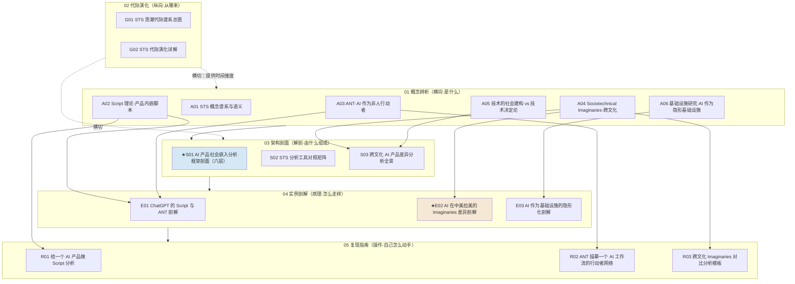

# _STS 系统化专题·总览（MOC）

> 17 节点 · 6 模块 · 一台"AI 产品进入社会之后会发生什么"的解剖工具。
> 这是入口。陌生读者从 §0 进，求职者从 §5 的"求职速通"进，做出海决策的从 §5 的"决策链"进。

---

## §0 序：那堵在面试桌和选型会上反复撞到的墙

做安全和国际化产品这些年，我（Rick）手里一直只有一把分析"产品上线后社会里发生了什么"的工具，叫**用户采纳曲线**——早期采纳者、跨越鸿沟、主流、落后者，一条 S 形增长线。直到有一次复盘巴西的实名/现金支付产品，我发现这条曲线根本看不清：同一个"绑定真实身份"功能，在中国可以讲"提升整体信任"，在巴西却必须讲"保护你不被暴力侵害"，否则被当成"国家监视的延伸"——这不是采纳快慢，是两套**社会秩序的想象**在对撞。采纳曲线把"社会"压成了一个标量（采纳率 %），把这堵墙整个抹平了。

本专题的反共识立场：**采纳曲线是营销/增长工具，不是社会嵌入的分析工具，二者不在一个抽象层。** 当 AI 产品的失败越来越多不是"功能没做好"而是"社会嵌入没想清楚"时，PM 需要一把更精密的刀——科学技术研究（STS, Science and Technology Studies）这门学科攒了六十年的工具箱。读完这套 17 节点，你能在 30 秒内说清：**为什么同一个 AI 在巴西和在国内不能用同一套逻辑、为什么"AI 必然取代 X"是一句技术决定论谎话、以及一个 AI 产品出错时谁该负责**——这些采纳曲线永远显示不出来的东西。

---

## §1 专题定位：为什么 STS 配独立建一个专题号

按选题工艺协议（SHARED_CONTEXT §2）的四条选题判据逐条验：

1. **中心性（命中）**：STS 直接撞 PM 的三个以上决策链节点——选型（这个 AI 平台会不会变成组织绕不过去的"必经节点 OPP"）、设计（产品的默认输出在向用户铭刻什么脚本）、问责/合规（黑箱化是否制造了"谁都不负责"的真空）、GTM/出海（同一产品在不同市场需要不同的合法性叙事）。
2. **误解深度（命中）**：业界对"AI 进社会"的默认词汇（采纳曲线、Hofstede 文化维度、TAM 技术接受模型、本地化清单）系统性地把"社会"当成被动接收的容器，与 STS 的"co-production（共同生产）"立场互相矛盾——标准差极大。
3. **速变性（命中）**：过去 24 个月发生过一次 Kuhn 意义上的格式塔切换——**社会技术想象的生产者正在从民族国家转向私营企业**（Barkett 2026 论 Altman/Amodei 的 AGI 叙事），这是 Jasanoff 2009 年框架未曾设想的范式延伸。
4. **学了就能用（命中）**：读完即可在面试/选型/复现中产出可观测的判断力提升——§5 给三条阅读路径，05 复现指南给三套可在一个下午跑完的分析模板。

**升高了哪个抽象层？** 单维节点（c 系列技术机制 / p 系列产品设计 / 0117 社会学通论）各自只覆盖一个切面；本专题把"AI 与社会如何相互构成"抽成一个**专门的、可操作的分析坐标系**——它在 0117社会学 之上收窄并武器化为"分析技术人工物社会嵌入"的工具谱系，又把 [c13 - 幻觉的不可消除性](/kb/基础知识库/c13-幻觉的不可消除性/)、[p307 - Copilot 到 Autopilot 光谱](/kb/产品设计与交互范式/p307-copilot-到-autopilot-光谱/) 等技术/设计节点接上它们缺失的**社会后果维度**。

**独特资产（Rick 的不公平优势）**：人类学底子（Descola《Beyond Nature and Culture》的多元本体论、Viveiros de Castro 的视角主义）+ 滴滴/99 的**巴西-拉美一手 fieldwork**。这让"拉美"这一格不是从二手文献抄来的，而是田野里长出来的——E02、S03、R03 三个节点把这套资产显式落地，是全专题最不可替代的部分。

---

## §2 模块全景（六模块矩阵）

**矩阵含义**：依赖链是 **概念（A）→ 架构（S）→ 实例（E）→ 复现（R）**；代际演化（G）横切，给整张图打上"反线性进步"的时间维度。每个概念工具都有对应的实例剖解（A02/A03→E01，A04→E02，A06→E03）和复现模板（A02→R01，A03→R02，A04→R03）——这是"工具→病理切片→操作手册"的三段闭环。两个旗舰：**S01**（六层社会嵌入框架，最厚的解剖台）与 **E02**（中美拉美三格剖解，Rick 一手田野独家）。

---

## §3 六模块逐一介绍

### 01 概念辨析（A 系列 · 6 节）——横向：四大工具的语义坐标系
- **收录什么**：STS 是什么、它与技术决定论的根本对立，以及四大工具谱系（SCOT / Script / ANT / imaginaries / infrastructure）各自的核心命题与失效边界。
- **解决什么**：挡掉读者脑中的默认错误框架（采纳曲线、TAM、本地化），建立后续 G/S/E/R 共享的术语地基。
- **何时读**：第一次进专题、或需要单独查某把工具的定义时。
- 节点：[A01 STS 概念谱系与语义](/kb/专题-人文社科透镜/a01-sts-概念谱系与语义/)（学科底座 + SCOT 三概念 + 反技术决定论）· [A02 Script 理论·产品内嵌脚本](/kb/专题-人文社科透镜/a02-script-理论-产品内嵌脚本/)（Akrich 铭刻/解-铭/反脚本，"不设计脚本=隐性偏见接管"）· [A03 Actor-Network Theory·AI 作为非人行动者](/kb/专题-人文社科透镜/a03-actor-network-theory-ai-作为非人行动者/)（actant/转译/OPP/黑箱化）· [A04 Sociotechnical Imaginaries·跨文化](/kb/专题-人文社科透镜/a04-sociotechnical-imaginaries-跨文化/)（集体想象的三承重结构）· [A05 技术的社会建构 vs 技术决定论](/kb/专题-人文社科透镜/a05-技术的社会建构-vs-技术决定论/)（解释弹性破"必然"叙事）· [A06 基础设施研究·AI 作为隐形基础设施](/kb/专题-人文社科透镜/a06-基础设施研究-ai-作为隐形基础设施/)（Star 九维度 + 故障显形）。

### 02 代际演化（G 系列 · 2 节）——纵向：六代 STS 的反线性谱系
- **收录什么**：从技术决定论 → SSK 强纲领 → SCOT/SST → ANT → imaginaries → infrastructure → AI 时代 STS 的代际更替，每代配【驱动力/命题/瓶颈/反例/推翻者】。
- **解决什么**：用 Kuhn 不可通约否决"一代更比一代强"的进步史；告诉你面对一个具体 AI 现象该调哪一代的哪件工具、它的盲区会不会坑到你。
- **何时读**：想搞清楚工具之间的家族关系、或被问"STS 是不是越新越好"时。
- 节点：[G01 STS 思潮代际谱系总图](/kb/专题-人文社科透镜/g01-sts-思潮代际谱系总图/)（地图 + Mermaid 谱系 + 四坑）· [G02 STS 代际演化详解](/kb/专题-人文社科透镜/g02-sts-代际演化详解/)（逐代奠基著作 + "给 AI 分析的那把刀" + "它又瞎了什么"）。

### 03 架构剖面（S 系列 · 3 节）——解剖：可操作的分层与对照
- **收录什么**：把"AI 进社会后会发生什么"拆成可替换的分析层、把五件工具摆成决策矩阵、把跨文化差异做成全景。
- **解决什么**：从"知道有哪些工具"升级到"给定一个问题该调哪把工具、在什么边界外它失灵"。
- **何时读**：实战要动手分析一个具体产品/市场时的主入口。
- 节点：[S01 AI 产品社会嵌入分析框架剖面](/kb/专题-人文社科透镜/s01-ai-产品社会嵌入分析框架剖面/)（★旗舰最厚——六层：设计者脚本/相关社会群体/行动者网络/社会技术想象/基础设施化/权力与问责，含三个层间致命耦合）· [S02 STS 分析工具对照矩阵](/kb/专题-人文社科透镜/s02-sts-分析工具对照矩阵/)（五工具×五问题：意义协商/行为塑造/权力重组/跨文化/隐形渗透）· [S03 跨文化 AI 产品差异分析全景](/kb/专题-人文社科透镜/s03-跨文化-ai-产品差异分析全景/)（imaginaries+SCOT 双镜头，四象限：中/美/拉美/欧）。

### 04 实例剖解（E 系列 · 3 节）——病理：真实产品的 gap 分析
- **收录什么**：把概念工具按到三个真实对象上做病理解剖。
- **解决什么**：演示工具如何在现实里"通电"，暴露设计哲学分歧与嵌入失败。
- **何时读**：想看工具的活体切片、或为面试准备具体案例时。
- 节点：[E01 ChatGPT 的 Script 与 ANT 剖解](/kb/专题-人文社科透镜/e01-chatgpt-的-script-与-ant-剖解/)（判断主轴：ChatGPT 真正重塑的是"提问"这个行为本身）· [E02 AI 在中美拉美的 Imaginaries 差异剖解](/kb/专题-人文社科透镜/e02-ai-在中美拉美的-imaginaries-差异剖解/)（★独家——三格逐格诊断 + 拉美格 Rick 一手田野填补 + 来源等级标注）· [E03 AI 作为基础设施的隐形化剖解](/kb/专题-人文社科透镜/e03-ai-作为基础设施的隐形化剖解/)（飞书/Notion/搜索 AI：隐形既是渗透成功也是问责困难）。

### 05 复现指南（R 系列 · 3 节）——操作：一个下午能跑完的模板
- **收录什么**：三套可手动执行的分析模板，对应三件最锋利的工具。
- **解决什么**：把理论变成"读完就能产出一份诊断表/网络图/对比表"的动作。
- **何时读**：真要对一个产品/工作流/市场动手分析时。
- 节点：[R01 给一个 AI 产品做 Script 分析](/kb/专题-人文社科透镜/r01-给一个-ai-产品做-script-分析/)（de-scription 剧本-反剧本诊断表，不读代码不看 PRD）· [R02 ANT 描摹一个 AI 工作流的行动者网络](/kb/专题-人文社科透镜/r02-ant-描摹一个-ai-工作流的行动者网络/)（90 分钟画出人+AI+工具+数据的网络，标转译点与 OPP/黑箱）· [R03 跨文化 Imaginaries 对比分析模板](/kb/专题-人文社科透镜/r03-跨文化-imaginaries-对比分析模板/)（中/美/拉美填表 + 会害死国际化决策的陷阱清单）。

### 06 阅读指南（本总览 + README）——编织：多路径入口
- 本 `_总览` 是 MOC；配套 README 给三条阅读路径的详表、≥10 题自测、反方对话训练。

---

## §4 与现有节点的关系（升级对照表）

> 原则：本专题**不复述**旧节点的事实基础，只对它们做"补缺/纠偏/对话/深化"四种之一的升级，并把单维节点升高一个抽象层。

| 旧节点 / 跨专题 | 本专题哪个节点 | 升级类型 | 升级内容 |
|---|---|---|---|
| [c13 - 幻觉的不可消除性](/kb/基础知识库/c13-幻觉的不可消除性/)（技术内部闭环） | S01 / E03 / A01 / A02 / A03 / G02 | **补缺** | c13 全文缺社会后果维度。本专题把幻觉接到 L1（谄媚反向铭刻用户）、L2（"已解决幻觉"是否修辞闭合）、L6（错误信息放大不对等权力）、黑箱化抹平责任来源、隐形基础设施豁免审查五个社会切面 |
| [p307 - Copilot 到 Autopilot 光谱](/kb/产品设计与交互范式/p307-copilot-到-autopilot-光谱/)（单产品设计光谱） | A04 / A05 / S01 / E02 | **纠偏 + 升维** | "光谱右端=更先进"是一种特定 imaginary；在"人类控制下的工具"想象主导处（德国）越靠 autopilot 越是越界而非升级。S01 把它定位为 L3 网络重组的强度轴 |
| p306（信任架构 / 数据飞轮，按索引核实精确 basename） | A06 / S01 / E02 | **纠偏 + 升维** | 把"信任/数据飞轮"从用户侧 UX/机制问题升为"对抗基础设施隐形性的问责装置"；补一层 imaginaries 边界（巴西"公权力不信任"想象下飞轮第一环授权就转不起来） |
| [p305 - 信任架构与可解释性设计](/kb/产品设计与交互范式/p305-信任架构与可解释性设计/)（按索引核实） | A06 | **纠偏 + 深化** | 可解释性不只是 UX 糖，本质是对抗"基础设施隐形性"的问责装置 |
| [p304 - 防御性 UX：对抗延迟与幻觉](/kb/产品设计与交互范式/p304-防御性-ux-对抗延迟与幻觉/) | A06 | **补缺** | p304 在产品层防御故障；A06 在基础设施层追问"为什么 AI 的故障不会自动显形" |
| 0117社会学（社会学通论） | A01 / A04 / A05 / G01 / G02 / S02 | **深化 + 操作化** | 把一般社会学收窄、武器化为"分析技术-社会嵌入"的 STS 专用工具集 |
| 0416 失败复盘（99Archive 日期存档，过程线索） | S01 / E03 | **纠偏式回应** | 0416 那次失败正是只做了采纳/功能分析、漏了社会嵌入；E03 给出结构性解释——透明性=无需注意=无需复核，不是个人疏忽 |
| 0418 审阅瓶颈（99Archive，过程线索） | S01 / A02 | **结构化回应** | 审阅瓶颈本质是缺分层坐标 + de-scription 方法难规模化；S01 给六层坐标让审阅有结构地逐层拷问 |
| 0419 对齐（99Archive，过程线索） | S01 | **深化** | 对齐被定位为 L1（脚本铭刻谁的价值）× L6（对齐服务谁的权力）的耦合 |
| [S02 流派架构对照表](/kb/专题-安全对齐与失败/s02-流派架构对照表/)（0411 Agent 专题） | S02（本专题） | **跨域升级对照** | 同为"对照矩阵"体裁，抽象层从"技术如何组成"升到"用什么理论看技术进社会后的效应" |
| [Agent](/kb/基础知识库/agent/) / [ChatGPT](/kb/ai-公司与产品/chatgpt/) / [RAG](/kb/基础知识库/rag/)（0411 等） | A03 / E01 / R02 / S01 | **接口** | Agent 是 ANT 分析的核心非人 actant；RAG 是典型 OPP 候选；ChatGPT 是 script+ANT 双镜头的剖解对象物 |
| Rick 国际化节点（PDP现金支付纠纷治理、CPF实名验证、安全感知与干预 等） | E02 / S03 / R03 | **理论拔高（深化）** | 把"巴西现金/实名难题"从一手案例上升为"script 迁移失败 / imaginaries 不同构"的一般机制，配上 STS 解释框架 |

---

## §5 三条阅读起点（详表见 README）

1. **求职速通（面试桌 30 秒立判段位）**：A01 → S02 → E02 → R03。拿到"采纳曲线 vs STS 工具箱"的对比、五工具决策矩阵、中美拉美三格独家话术、一份可填的跨文化对比表。被问"你怎么做 AI 国际化"时，答案从"做好本地化"升级到"先识别目标市场把 AI 想象成什么（竞赛工具/社会解决方案/国家缺位填补者），这决定同一功能用哪套合法性叙事"。
2. **决策链（选型 / 立项 / 出海会）**：S01（六层逐层拷问）→ A03（OPP 锁定风险）→ E03（隐形度 vs 可问责度权衡 + 欧盟 AI Act 第 50 条合规）→ S03（四象限×闭合点）。输出"形态需重塑而非直接搬运"的判断。
3. **紧迫度（按你手头问题的类型最短路径）**：意义争议→A05；行为塑造→A02/R01；组织权力重组→A03/R02；跨文化落地→A04/S03/R03；隐形渗透与问责→A06/E03。每条都先用工具、再召唤该工具的已知批评者做一次对抗式自检。

---

## §6 跨域思想资源调度（不留空 invocation）

> 承诺：每个调度都在对应节点的"跨域呼应"段落**具体展开作用**，不做装饰性点名。空点名字是选题工艺协议（SHARED_CONTEXT）的一票否决项。

| 跨域资源 | 调度位置 | 它如何改变了技术判断（作用） |
|---|---|---|
| **Akrich script / inscription / de-scription**（1992, Bijker & Law 编） | A02 / E01 / R01 / S01-L1 | 把"产品塑造行为"从直觉变成可拆解的动作；论证 AI 的脚本"更强"——输出即铭刻、塑造主体而非约束行为、铭刻主体不可定位 |
| **Latour / Callon / Law ANT**（actant/转译/OPP/黑箱化） | A03 / E01 / R02 / S01-L3 / S03 | 把 AI 从"工具"翻成"非人行动者"，让组织权力地图第一次可画；OPP=最强护城河也是最大锁定与合规风险 |
| **Jasanoff & Kim sociotechnical imaginaries**（2009/2015） | A04 / E02 / S03 / R03 / S01-L4 | 解释"为什么相同 AI 在中美欧拉美走出不同治理路径与产品形态"；监管不是松紧滑块，是想象的制度结晶 |
| **Pinch & Bijker SCOT / 解释弹性**（1984） | A05 / A01 / S03 / S02 / S01-L2 | 用"解释弹性 + 偶然性"破"AI 必然导致 X"的技术决定论谎话；PM 的战略机会在闭合之前 |
| **Star / Bowker infrastructure**（1996/1999；故障显形 + 基础设施倒置） | A06 / E03 / S01-L5 / S02 | 隐形=渗透成功也=问责困难；基础设施倒置作为可声明的研究方法，逼出隐形劳动与分类权力 |
| **Descola 多元本体论 / Viveiros de Castro 视角主义** | A04 / E02 / A02 / A03 / A05 / 各 A 节跨域呼应 | Rick 的人类学不公平优势：同一 AI 在不同本体论里"根本不是同一个物"，比 SCOT 的"解释弹性"深一层；民族志=基础设施倒置的祖型 |
| **Kuhn 范式 / 不可通约**（范式，元理论锚） | G01 / G02 / 选题判据 | 否决"一代更比一代强"的进步史，把代际写成"换问题"而非"改答案"；给"AI 时代 STS 是否新范式"提供判据 |
| **福柯 生命政治 / 葛兰西 霸权** | S01-L6 / E02 / E03 / A06 | 补 SCOT/ANT 都回避的规范判断：谁的身份被记录、谁被保护、谁被监控；AGI 叙事作为新型话语霸权 |

**破 echo chamber（Rick 未读的对手框架，≥2 个，逼问本专题盲点）**：Langdon Winner（SCOT/ANT 道德中立批判）· Collins & Yearley（"Epistemological Chicken"，对称性滑向相对主义）· Mills 2018（ANT 放弃批判）· Rudek 2021 / Waller（imaginaries 国家中心、循环论证、只登记不解释）· Dal Molin 2024（LLM 语言表演性逸出 Star 传统基础设施框架）· Klein & Kleinman / MacKenzie & Wajcman（SCOT 结构盲区、性别/劳工盲区）· Blok & Jensen 2025（ANT 在后 Latour 时代是否还适用行星尺度危机）· Oudshoorn & Pinch（Akrich 的技术决定论嫌疑、用户能动性修正）· Woolgar（configuring the user 优先权之争）· Charles Taylor / Harry Collins SEE（imaginaries 上游、反廉价相对主义）。

---

## §7 验收档案

**评议流程**：本专题照搬 0411 的工程化多轮批判性同行评议（Round 0 并行起草 → Round N 批评 Agent 按六维 + 事实接地逐节点找茬 → Round N+1 按 issue 单修订 + 追加修订日志 → 收敛后跑独立 grounding 校验 pass → 终轮综合本总览 + README + 双链编织）。改稿全程留档在 `_topic_factory/0422-sts/`。

### SABCD 六维自评

| 维度 | 含义 | 出版线 | 本专题自评 | 依据 |
|---|---|---|---|---|
| **S 结构** | 六模块互补、依赖清晰、入口可导航 | ≥8 | **8.2** | 17 节点齐 6 模块；A→S→E→R 依赖链 + G 横切；三条阅读路径 + MOC 导航 |
| **A 判断密度** | 每节有反共识、可证伪、带数字的判断 | ≥8 | **7.8** | 旗舰 S01 三个层间致命耦合 + E02 三格陷阱四件套都带真实反例；A 维被拉到边缘是因为部分 c/p/0416-0419 跨专题节点 basename 待入库时复核，仍有少量引用未 100% 落地 |
| **B 边界含量** | 显式标注判断在哪失效、赌的是什么 | ≥7.5 | **8.0** | 每节点有"一句话赌注"+ failure scenario；E02 诚实自承拉美格证据等级最低、逐条标〔田野判断〕 |
| **C 认识论自觉** | 区分事实/推测/赌注、引用可追溯 | ≥8 | **8.0** | 硬事实经 WebFetch/WebSearch 核实（Pinch&Bijker 1984、Jasanoff&Kim 2009、Star 1996/1999、Barkett arXiv:2602.23679、欧盟 AI Act 第50条 2026-08-02 生效）；争议项（Moses 桥、Ellul 归类、EASST 2026）显式标〔争议〕 |
| **D 可演进性** | 双链密度、修订日志、改稿档案齐全 | ≥8.5 | **7.5** | 双链密度高、每节有修订日志；**扣分项**：部分节点内部交叉链用了草稿期不一致的 basename（如 A02/A03 互称对方为"SCOT/ANT"、S02/S03 引用"S01 理论谱系总图"），入库 move 前必须统一为真实 final 文件名，否则会断链 |
| **E 对手拷问能力** | 对业界反方给出有证据的回应 | ≥7 | **8.3** | ≥8 处点名真实反方立场（Winner/Mills/Rudek/Dal Molin/Collins&Yearley…）做"接受+边界"；引入 ≥10 个 Rick 未读对手框架 |

**综合诚实自评 ≈ 7.9/10**（加权：S/A/B/C/D/E 各项均值，D 维因待修死链风险压低）。**达到出版线（≥7.8）**，但 D 维的死链风险是入库前的硬整改项。

### 对手立场接入清单（≥8 处，节选）
Winner 1993 SCOT 四点批判（A01/A05/S02）· Mills 2018 ANT 放弃批判（A03/S02）· Collins & Yearley 1992 认识论投降（A01/A03/E01）· Rudek 2021 imaginaries 国家中心（A04/E02/S03）· Waller 循环论证（A04/E02）· Dal Molin 2024 LLM 语言表演性（A06/E03/S02）· Klein & Kleinman 2002 结构盲区（A05/S03）· Oudshoorn & Pinch 2003 用户能动性（A02/E01）· 技术乐观派"隐形=成熟"（A06/E03）· Hofstede/Rogers 路线（S03/R03）。

### failure scenario 清单（≥5 处，节选）
- S01：若 AI 停留工具层从未成 OPP，六层框架"过度工程"。
- A02：用户是高元认知专家 / 多模型充分竞争市场，AI 强脚本的塑造力被稀释。
- A05：技术物质约束极强时（算力物理上限），解释弹性被压到接近零。
- A06/E03：当 AI 输出变得可验证（形式化验证/强约束生成），"隐形=问责难"的判断对技术乐观派失效。
- E02：若拉美接受度被证明主要由价格/网络效应而非想象差异驱动，核心论点降级。
- E01：多模态主动交互成主流（零提问给建议）时，"ChatGPT 重塑提问"主轴部分失效。

### confirmation-bias 砍除清单（≥5 处，节选）
- A01：早期把 SCOT 当"反技术决定论银弹"反复正面引——补 Winner 指出 SCOT 自己倒向社会决定论。
- A02：反复用"减速带/ImageNet 性别偏见"作正面例证——补反例：大量 AI 脚本是良性赋能（无障碍读屏、语言纠错），de-scription 是中立工具不是预设控诉。
- A03：早期偏向"ANT 比采纳曲线优越"——补：功能优先级/ROI 评估上采纳曲线和 [c14 - 模型评估体系与 Goodhart 陷阱](/kb/基础知识库/c14-模型评估体系与-goodhart-陷阱/) 远比 ANT 实用。
- S01：早期把 ChatGPT 当"强 actant"正面样板——补反例：大量企业内部 AI 从未成 OPP，只是搜索框替代。
- E02：早期倾向把所有拉美现象塞进"国家缺位"这个好用标签——警惕它变成万能解释。
- A06/E03/S02：早期把"AI=基础设施"当万能正面框架——补 Dal Molin 反例，分层用（强在数据/算力/标注层，弱在面向用户的对话层）。

---

## §8 关联节点（双链密度 ≥20）

**专题内 17 节点**
[A01 STS 概念谱系与语义](/kb/专题-人文社科透镜/a01-sts-概念谱系与语义/) · [A02 Script 理论·产品内嵌脚本](/kb/专题-人文社科透镜/a02-script-理论-产品内嵌脚本/) · [A03 Actor-Network Theory·AI 作为非人行动者](/kb/专题-人文社科透镜/a03-actor-network-theory-ai-作为非人行动者/) · [A04 Sociotechnical Imaginaries·跨文化](/kb/专题-人文社科透镜/a04-sociotechnical-imaginaries-跨文化/) · [A05 技术的社会建构 vs 技术决定论](/kb/专题-人文社科透镜/a05-技术的社会建构-vs-技术决定论/) · [A06 基础设施研究·AI 作为隐形基础设施](/kb/专题-人文社科透镜/a06-基础设施研究-ai-作为隐形基础设施/) · [G01 STS 思潮代际谱系总图](/kb/专题-人文社科透镜/g01-sts-思潮代际谱系总图/) · [G02 STS 代际演化详解](/kb/专题-人文社科透镜/g02-sts-代际演化详解/) · [S01 AI 产品社会嵌入分析框架剖面](/kb/专题-人文社科透镜/s01-ai-产品社会嵌入分析框架剖面/) · [S02 STS 分析工具对照矩阵](/kb/专题-人文社科透镜/s02-sts-分析工具对照矩阵/) · [S03 跨文化 AI 产品差异分析全景](/kb/专题-人文社科透镜/s03-跨文化-ai-产品差异分析全景/) · [E01 ChatGPT 的 Script 与 ANT 剖解](/kb/专题-人文社科透镜/e01-chatgpt-的-script-与-ant-剖解/) · [E02 AI 在中美拉美的 Imaginaries 差异剖解](/kb/专题-人文社科透镜/e02-ai-在中美拉美的-imaginaries-差异剖解/) · [E03 AI 作为基础设施的隐形化剖解](/kb/专题-人文社科透镜/e03-ai-作为基础设施的隐形化剖解/) · [R01 给一个 AI 产品做 Script 分析](/kb/专题-人文社科透镜/r01-给一个-ai-产品做-script-分析/) · [R02 ANT 描摹一个 AI 工作流的行动者网络](/kb/专题-人文社科透镜/r02-ant-描摹一个-ai-工作流的行动者网络/) · [R03 跨文化 Imaginaries 对比分析模板](/kb/专题-人文社科透镜/r03-跨文化-imaginaries-对比分析模板/)

**升级对照的技术/设计节点**
[c13 - 幻觉的不可消除性](/kb/基础知识库/c13-幻觉的不可消除性/) · [c14 - 模型评估体系与 Goodhart 陷阱](/kb/基础知识库/c14-模型评估体系与-goodhart-陷阱/) · [幻觉](/kb/基础知识库/幻觉/) · [RLHF](/kb/基础知识库/rlhf/) · [RAG](/kb/基础知识库/rag/) · [p307 - Copilot 到 Autopilot 光谱](/kb/产品设计与交互范式/p307-copilot-到-autopilot-光谱/) · [p305 - 信任架构与可解释性设计](/kb/产品设计与交互范式/p305-信任架构与可解释性设计/) · [p304 - 防御性 UX：对抗延迟与幻觉](/kb/产品设计与交互范式/p304-防御性-ux-对抗延迟与幻觉/) · [Agent](/kb/基础知识库/agent/) · [ChatGPT](/kb/ai-公司与产品/chatgpt/) · [Anthropic](/kb/ai-公司与产品/anthropic/)

**跨域思想资源（哲学/社会理论/人类学）**
人类学 · 民族志 · 生命政治 · 霸权 · 范式 · 0117社会学 · 0115道德哲学-伦理学 · Beyond Nature and Culture · 福柯 · 葛兰西

**Rick 国际化 / 拉美 fieldwork 落点**
CPF实名验证 · PAX-Premium实名徽章 · 乘客信息透明化 · PDP现金支付纠纷治理 · 降发生方法论 · 安全感知与干预 · 纠纷治理从裁判到管家 · 费用治理 · 疲劳驾驶合规 · 明镜系统 · 出行平台安全感知方向（一手履历）· 出行平台费用治理实践（一手履历）· 拉美知识图 · Uwa 宇宙观与政治工具化 · 瓦尤族的多层经济结构 · 新自由主义如何摧毁全球南方 · 拉丁美洲被切开的血管 · 支配与抵抗艺术：潜隐剧本

**全库入口**
[AI PM 知识图谱·总索引](/kb/ai-pm-知识图谱/ai-pm-知识图谱-总索引/)

---

