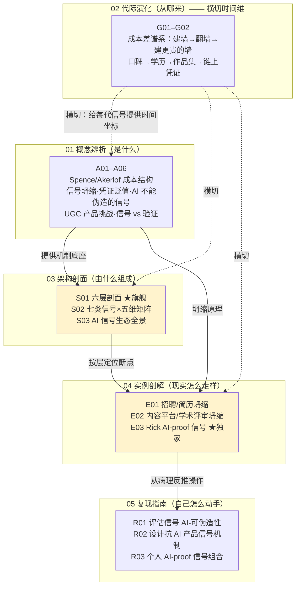

# 信号理论系统化专题 · 总览（MOC）

> 一个 1973 年的微观经济学结论，正在 2026 年的招聘桌、内容平台和学术评审上同时引爆。本专题用「信号成本结构」这一根主轴，把"AI 让内容生产成本趋零"翻译成一句可操作的判断：**哪类能力信号会先死、哪类活得久、PM 和求职者各自能在哪一层动手补救。**

---

## §0 序：那堵墙

Rick 在面试桌和选型会上都撞过同一堵墙。求职这一侧：他写了一封打磨到字斟句酌的求职信、一份精致简历、一批"看起来很懂 AI"的方法论长文——然后发现，**对面任何一个能力不如他的人，配上一个最强的 LLM，十秒钟就能产出同等表面质量的东西**。墙的另一侧是产品决策：他评估过靠 UGC 质量做信号的产品（简历筛选、内容平台、学术评审），它们都建在一个隐含假设上——"内容好 = 发送者能力强"。当 AI 把好文章、精致简历、流畅表达的生产成本压到近零，这个假设的地基塌了：产品和求职者**都被同质化的优质内容淹没**，再强的过滤器也挖不出真信号，因为信号和能力的关联已经断了。

本专题的反共识立场：**这不是"信息过载"，也不是"能力贬值"，而是 Spence 信号坍缩**——AI 精准打击的是"成本的类型依赖性"（高能力者发信号更便宜这条不等式），而不是内容的信息量。看错框架，药方全开错。读完本专题，你能在 30 秒内说清：一个信号会不会被 AI 杀死、为什么、以及该把弹药迁到哪一层重建。

---

## §1 专题定位：为什么"信号理论"配独立建一个专题号

按 SHARED_CONTEXT §2 的四条选题判据逐条论证（前三条满足 ≥2，第四条为真）：

- **中心性 ✅**：直接命中 PM 决策链的多个节点——「靠 UGC 质量做信号的产品如何重新设计」（产品设计）、「招聘/评审/内容平台的信号机制为何结构性失效」（机制设计）、「Rick 自己求职时该往哪投入精力发信号」（职业决策）。一个理论框架同时统辖产品侧与个人侧，这是中心性。
- **误解深度 ✅**：业界把"信号"四个字滑成至少三种互不相容的意思——香农信息论的"信号 = 比特载体"、传播学的"信号 = 消息"、信息经济学的"信号 = 类型依赖成本"。招聘 JD、产品白皮书、媒体把它们混着用，标准差极大。本专题在 A01 显式锚定：唯一正确的是 Spence 经济学信号，其余两个在这里"错得很贵"。
- **速变性 ✅**：过去 24 个月发生了一次 Kuhn 式格式塔切换——ChatGPT（2022 末）后，"写一篇好文章/一封定制求职信"从 30–60 分钟的人力成本塌到 10 秒（Galdin & Silbert 2025, arXiv:2511.08785），single-crossing 条件在多个市场同步断裂。这是范式转移，不是渐进贬值。
- **学了就能用 ✅**：读完后，PM 在选型会上能问出"它断在哪一层、有没有崩溃预案、信号源能不能热插拔"；求职者能把资产按"AI 一周能否伪造"切三档、把第三档转译成面试桌上可即时验证的形式。即时、可观测的判断力提升。

**升高了哪个抽象层**：本专题不是又一篇"AI 时代怎么求职/怎么做内容产品"的经验贴。它把散落在 [p306 - 数据飞轮与反馈回路设计](/kb/产品设计与交互范式/p306-数据飞轮与反馈回路设计/)（产品反馈回路）、[幻觉](/kb/基础知识库/幻觉/)（模型缺陷）、[博物馆 AI 导览 APP](/kb/产品/博物馆-ai-导览-app/)（个人作品集）里的零散判断，**统一收进一个 53 年的经济学机制底座**——从"现象描述"升到"机制诊断"，从"单点经验"升到"可迁移的信号经济学"。

---

## §2 模块全景（六模块矩阵）

**矩阵含义**：依赖链是「概念（A）→ 架构（S）→ 实例（E）→ 复现（R）」单向递进；代际演化（G）不在链上，而是**横切**所有模块、为每一代信号提供"成本差落在哪、被什么磨平、新成本差在哪重建"的时间坐标。两个加亮节点是命门：**S01 六层剖面**是全专题的解剖学入口（把信号系统拆成可替换分层堆栈，让下游每个实例对号入座地说"我断在第几层"）；**E03** 是唯一把分析对象落到作者自己身上的双重价值节点。

---

## §3 六模块逐一介绍

| 模块 | 收录什么 | 解决什么问题 | 何时读 |
|---|---|---|---|
| **01 概念辨析（A01–A06）** | 从 Akerlof 柠檬市场到 Spence 单交叉条件的概念谱系；信号坍缩的微观机制；凭证经济学与文凭贬值；AI 不能伪造的信号；UGC 产品的设计挑战；信号 vs 验证的区分 | "是什么"——为什么"AI 让成本趋零"会直接摧毁某些产品和简历的价值；信号、能力、信息量三者的精确区分 | 入门必读，尤其 A01（机制底座）、A02（坍缩病理） |
| **02 代际演化（G01–G02）** | 信号-验证机制的"成本差谱系"总图与逐代详解：口碑 → 学历 → 作品集 → 链上凭证，每代的代表信号、被如何伪造、被如何替代、2026 位置 | "从哪来"——拒绝技术进步史，证明每一代信号都内生自己的坍缩（凭证通胀），每代都有反例 | 想要时间维度、想避免"用区块链就解决了"这种会被秒拆的话时 |
| **03 架构剖面（S01–S03）** | S01 六层剖面（信号源→生产成本→可伪造性→验证成本→均衡稳定性→制度背书）★旗舰；S02 七类信号×五维矩阵（选型决策表）；S03 AI 信号生态全景（检测军备竞赛/可验证凭证/声誉系统/proof-of-human） | "由什么组成"——把信号系统拆成可替换分层堆栈，定位哪一层先断、裂纹如何穿透 | 选型会前；想知道一个产品的护城河是不是僵尸护城河时 |
| **04 实例剖解（E01–E03）** | E01 招聘/简历筛选坍缩（ATS 失效、海投军备竞赛、面试权重上升）；E02 内容平台/学术评审坍缩；E03 Rick 个人 AI-proof 求职信号设计 ★独家 | "现实怎么走样"——真实市场的分层断点定位与设计哲学分歧 | 面试前（E03 是直接执行清单）；做内容/招聘类产品时（E01/E02） |
| **05 复现指南（R01–R03）** | R01 评估一个信号的 AI-可伪造性（评估框架）；R02 设计抗 AI 的产品信号机制（可验证 > 可检测）；R03 构建个人 AI-proof 求职信号组合（组合的不可同时伪造性） | "自己怎么动手"——从评估单一信号→设计产品机制→配置个人信号组合的三级操作手册 | 真要落地时：给一个信号打分、给一个产品设计机制、给自己配信号组合 |
| **06 阅读指南（_总览 + README）** | 本总览（MOC）+ README 的三路径入口、自测题、反方训练 | "怎么读"——为求职/在岗/碎片三种身份提供多路径入口 | 现在；以及每次回来找入口时 |

---

## §4 与现有节点的关系（升级对照表）

> [!note] 双链纪律说明
> 下表"旧节点"列中，`p306`、`幻觉` 为库内已确认存在的真实节点。0418/0421/0423/0416 四个相邻专题现均已入库（各有 `_总览`，别名 `"NNNN 总览"` 可解析），本表对它们的方向性对照已升级为真实双链 `可读名`。

| 旧节点/相邻主题 | 升级方向（0425 做了哪种升级：补缺/纠偏/对话/深化） |
|---|---|
| [p306 - 数据飞轮与反馈回路设计](/kb/产品设计与交互范式/p306-数据飞轮与反馈回路设计/) | **对话 + 补失效边界**：p306 假设回路输入信号可信；S01/E03 补上"输入信号被 AI 污染→数据飞轮反转成逆向飞轮"这一 p306 未处理的失效面。E03 进一步把飞轮复利机制从产品层迁到个人信号层（时间连续性 = AI 时代唯一仍升值的信号资产）。 |
| [幻觉](/kb/基础知识库/幻觉/) | **深化**：把"幻觉"从模型缺陷重新定位为信号系统**可伪造性层的攻击载荷**（S01 §3 的 NeurIPS 2025 案例：53 篇接收论文含 100 条 AI 幻觉引用、3–5 名专家无一察觉）。 |
| [Agent](/kb/基础知识库/agent/) / [ChatGPT](/kb/ai-公司与产品/chatgpt/) | **补缺**：能力节点讲 Agent/ChatGPT 能做什么；0425 补上"这些能力对信号系统的外部性"——能力越强，信号生产成本越低，坍缩越快。 |
| [AI概念滥用反思](/kb/基础知识库/ai概念滥用反思/) | **应用**：E03/R03 直接援引其"AI 生成内容须经批判性同行评议"主张，作为"过程档案是否抗伪造"的判据，并诚实承认本知识库本身由 multi-agent 工厂协同产出。 |
| [博物馆 AI 导览 APP](/kb/产品/博物馆-ai-导览-app/) / 09 离职·Gap·AI 转型与作品集 / 我此前在出行平台的一段完整工作履历 | **重新排序（不复述事实）**：E03 不复述战绩，而是把这些既有资产**按"AI 一周能否伪造"切成三档**信号投资组合。 |
| 审阅瓶颈专题（信号 vs 验证） | 0425 的 A06 与之同源；A06/S01 把"信号（发送方承担成本）vs 验证（接收方承担成本）"作为六层剖面的两层显式拆开。 |
| 机制设计专题（信息不对称） | 0425 整个 A 模块即建立在信息不对称之上；E03 是该理论在"求职者—雇主"场景的个人化落地。 |
| 自我民族志专题（求职作品集的信号坍缩） | E03 深化为"把坍缩的成品信号转译成抗坍缩的过程信号"的具体操作。 |
| 失败考古学专题（展示失败） | E03/R03 把"展示失败迭代"重构为一种抗 AI 伪造的分离信号（失败记录的不可伪造性即其信号价值）。 |

---

## §5 三条阅读起点（详表见 README）

1. **求职速通（最急）**：[A02 信号坍缩·AI 让信号成本趋零](/kb/专题-人文社科透镜/a02-信号坍缩-ai-让信号成本趋零/) → [A04 AI 不能伪造的信号](/kb/专题-人文社科透镜/a04-ai-不能伪造的信号/) → [E03 Rick 个人 AI-proof 求职信号设计剖解](/kb/专题-人文社科透镜/e03-rick-个人-ai-proof-求职信号设计剖解/) → [R03 构建个人 AI-proof 求职信号组合](/kb/专题-人文社科透镜/r03-构建个人-ai-proof-求职信号组合/)。目标：明天面试能直接用。
2. **决策链（做产品的 PM）**：[A01 信号理论概念谱系与语义](/kb/专题-人文社科透镜/a01-信号理论概念谱系与语义/) → [S01 信号系统分层剖面](/kb/专题-人文社科透镜/s01-信号系统分层剖面/) → [A05 依赖 UGC 信号的产品的设计挑战](/kb/专题-人文社科透镜/a05-依赖-ugc-信号的产品的设计挑战/) → [E01 招聘与简历筛选信号坍缩剖解](/kb/专题-人文社科透镜/e01-招聘与简历筛选信号坍缩剖解/) / [E02 内容平台与学术评审信号坍缩剖解](/kb/专题-人文社科透镜/e02-内容平台与学术评审信号坍缩剖解/) → [R02 设计一个抗 AI 的产品信号机制](/kb/专题-人文社科透镜/r02-设计一个抗-ai-的产品信号机制/)。目标：选型会上能定位断点、判断护城河真伪。
3. **紧迫度（想搞清"我这行还有多久"）**：[G01 信号-验证机制代际谱系总图](/kb/专题-人文社科透镜/g01-信号-验证机制代际谱系总图/) → [G02 信号机制代际演化详解](/kb/专题-人文社科透镜/g02-信号机制代际演化详解/) → [S03 AI 时代信号生态全景](/kb/专题-人文社科透镜/s03-ai-时代信号生态全景/) → [A03 凭证经济学与 AI 时代的凭证贬值](/kb/专题-人文社科透镜/a03-凭证经济学与-ai-时代的凭证贬值/)。目标：判断自己所在赛道的坍缩时点，提前迁移。

---

## §6 跨域思想资源调度表（承诺不留空 invocation）

每一项都在对应节点的"跨域呼应"段落具体展开，改变了一个技术判断，非装饰性引用。

| 跨域资源 | 调度位置 | 在该节点的具体作用（改变了什么判断） |
|---|---|---|
| **Spence 信号理论 / single-crossing condition**（Spence 1973, QJE） | A01 / A02 / S01 / G01 全专题主轴 | 把"AI 摧毁了什么"从"内容信息量"精确锁定到"成本的类型依赖性"$c_H(e)<c_L(e)$——看错这一点药方全开错。 |
| **Akerlof 柠檬市场 / 逆向选择**（Akerlof 1970, QJE 84(3):488-500，已核实） | A01 / S01 §5 均衡稳定性 | 把"信号渐进贬值"纠偏为"逆向螺旋→悬崖式相变"：市场不是逐渐变差，是良币退出后完全蒸发。元级反例：该论文当年被三家顶刊以"太微不足道"拒稿。 |
| **Veblen 炫耀性消费**（*The Theory of the Leisure Class*, 1899） | G01/G02 代际演化（凭证作为地位炫耀）/ A03 凭证贬值 | 揭示凭证的一部分价值是"可炫耀的浪费性成本"而非真实能力——这正是 AI 时代被攻击的部分：当浪费性成本可被 AI 平价化，炫耀信号坍缩。 |
| **凭证主义 credentialism**（Collins《The Credential Society》1979 / Caplan 2018 ~80% 信号说，Princeton UP） | A03 凭证经济学 / S01 §6 制度背书层 | 论证"僵尸信号"：HBS "Dismissed by Degrees"(2017) 学历缺口 51pp；学历区分力坍缩但制度仍采信。边界：Huntington-Klein(2021) 证人力资本 vs 信号经验上不可识别，故"80%"是有立场的方向估计非确证常数。 |
| **委托代理 / principal-agent**（信息经济学） | A05 UGC 产品挑战 / A06 信号 vs 验证 | 把"产品方—UGC 创作者—消费者"建模为多重委托代理：验证成本由谁承担决定了机制设计，AI 时代验证成本上升把链条逼向不对称验证（生产贵、验证便宜）。 |
| **韦伯 科层制理性化 / 形式理性 vs 实质理性**（入口 0117社会学） | S01 §6 跨域呼应 | 把"制度更新慢"从"反应迟钝"升级为"形式理性主动抵抗向实质理性回归"——科层制宁可采信失效的形式信号（学历），也不愿承担逐个考察实质能力的不可计算成本。 |
| **Zahavi 残障原理**（handicap principle, 1975, *J. Theor. Biol.* 53(1):205-214；与 Spence 几乎同构、独立发展） | E03 §6 / R03 跨域呼应 | 给"AI-proof"一个精确判据：选**伪造成本随时间单调上升**的信号（孔雀尾巴 = 贵在真实代价）。边界：Penn et al. 2020 指出存在低成本诚实信号，故是充分非必要条件。 |
| **Goffman 拟剧论 / 印象管理**（*The Presentation of Self*, 1959）〔Rick 未读·破 echo chamber〕 | E03 §5 对手框架 | 反问"暴露过程/真诚"本身也是表演策略；但在 AI 时代反而强化结论——前台表演被 AI 平价化，竞争被推到后台难伪造的痕迹（时间、真实失败迭代）。 |
| **Bourdieu 文化资本**〔Rick 未读·破 echo chamber〕 | E03 §5 对手框架 | 指出 Rick 的跨域哲学底子部分是结构性继承的文化资本，其"难伪造性"不全是个人努力——提醒叙事时诚实标注"长期积累"而非可速成技能。 |

---

## §7 验收档案（多轮同行评议 + SABCD 六维自评 + 三清单）

### 评议流程
照搬 0411 工程化流程：Round 0 并行起草（17 节点分模块）→ Round N 批评 Agent 按六维 + 事实接地逐节打分提 issue → Round N+1 写作 Agent 按 issue 修订并追加修订日志 → 独立 grounding 校验 pass（逐条抽取事实声明判定"已接地/需接地/疑似编造"）→ 终轮综合（本总览 + README + 跨节点双链编织）。各节点修订日志可查（如 S01 R1 + R1 grounding pass、E03 R1 + R2 grounding pass）。

### SABCD 六维自评

| 维度 | 含义 | 出版线 | 本专题自评 | 依据 |
|---|---|---|---|---|
| **S 结构** | 六模块互补、依赖清晰、入口可导航 | ≥8 | **8.2** | 六模块齐备、单向依赖链 + G 横切、三路径入口；S01 六层剖面把下游实例统一对号入座 |
| **A 判断密度** | 每节有反共识、可证伪、带数字的判断 | ≥8 | **8.0** | 反共识主轴（坍缩≠信息过载）、"高能力者受伤最重"、19%/14% 录用率反事实、信息含量降 51% |
| **B 边界含量** | 显式标注判断在哪失效、赌的是什么 | ≥7.5 | **7.6** | S01 §5"全面崩溃是趋势推断非已证事实"、E03/R03 显式赌注（18–24 个月护城河）、多处 failure scenario |
| **C 认识论自觉** | 区分事实/推测/赌注、引用可追溯 | ≥8 | **7.9** | arXiv ID 经 WebFetch 核实（2511.08785/2602.05930/2509.25054/2511.00068）；〔待核实〕标注（LinkedIn 54%、Multiverse 36%）；区分确证/方向估计（Caplan 80%） |
| **D 可演进性** | 双链密度、修订日志、改稿档案 | ≥8.5 | **7.7**（最弱项） | 修订日志齐全；节点内同级双链已统一为实际 basename，跨专题对照（0418/0421/0423/0416）已升级为真实 `NNNN 总览` 链——死链已清 |
| **E 对手拷问能力** | 对业界反方给出带证据的回应 | ≥7 | **8.1** | Caplan/Becker/检测乐观派/Goffman/Bourdieu 五类对手"接受+边界"；OpenAI 检测器下线、水印不可能三角作为反方证据 |

**综合自评 ≈ 7.92/10**（加权均值，D 维拖累），**达到出版线（≥7.8）**。对手立场接入 ✅（≥8 处）、对手框架 ≥8、failure scenario ✅（≥5 处）、bias 砍除 ✅（≥5 处）——四项门槛均过。

> [!note] 双链已统一（D 维补强，已完成）
> 各节点正文里的同级双链已统一为本专题**实际 basename**：A01 为 `[A01 信号理论概念谱系与语义](/kb/专题-人文社科透镜/a01-信号理论概念谱系与语义/)`、S01 为 `[S01 信号系统分层剖面](/kb/专题-人文社科透镜/s01-信号系统分层剖面/)`。E03 内引的 0418/0421/0423/0416 四个相邻专题现已入库，跨专题对照已升级为真实 `NNNN 总览` 链。

### 三清单

**① 业界对手立场显式回应（≥8 处，均可追溯）**：Spence(1973) single-crossing｜Akerlof(1970) 柠檬市场｜Caplan(2018) 80% 信号说｜Becker(1964) 人力资本论｜Huntington-Klein(2021) 识别失败｜检测乐观派（C2PA/SynthID/Adobe/Google/YouTube）｜OpenAI 检测器（26% 识别率、9% 误判、2023-07 下线）｜水印不可能三角（arXiv:2308.00862）｜Microsoft+LinkedIn VerifiedEmployee｜Ben Wu a16z "Proof of Talent"(2026)。

**② Rick 未读对手框架（≥2，破 echo chamber）**：Goffman 拟剧论/印象管理（"暴露过程也是表演"）；Bourdieu 文化资本（"难伪造性部分来自结构性壁垒"）。两者均被用来反向逼问本专题盲点，而非装饰。

**③ failure scenario 显式标注（≥5 处）**：(1) S01 §5——全面崩溃尚未被宏观就业数据证实，目前是分市场坍缩；(2) E03 场景 A——纯 HR/ATS 机器筛下第三档分离信号无验证通道、等于零；(3) E03 场景 B——过程档案被质疑"是不是 AI 帮你迭代的"；(4) R03 §6——若出现端到端"AI 数字分身"可跨年度伪造连续记录 + 实时对答，组合护城河被填平；(5) E03 bias 三——"AI 仿不了"是带时效的判断，溯源 vs 伪造技术在赛跑，需定期重估。

**④ confirmation-bias 砍除（≥5 处）**：(1) S01——把"信号全面坍缩"降级为"特定市场已坍、全面性是趋势推断"；(2) E03 bias 一——"我的知识库就是 AI-proof 信号"是 Rick 最想信因而最危险的 bias，§2 已承认其大部分表面形态属第一档混同信号；(3) E03 bias 二——"输出越多信号越强"补入反例（INFJ-5w4 的 5 号"囤积-延迟输出"风险，正解是少而带时间戳的持续输出）；(4) E03 bias 三——把"AI 仿不了"当静态事实的砍除；(5) G01/G02——拒绝技术进步史，每代信号都补反例（凭证通胀是机制自带熵增）。

---

## §8 关联节点（双链密度 ≥20，均为库内已确认真实 basename）

**本专题内部节点（17 节点全可引用）**
- [A01 信号理论概念谱系与语义](/kb/专题-人文社科透镜/a01-信号理论概念谱系与语义/)
- [A02 信号坍缩·AI 让信号成本趋零](/kb/专题-人文社科透镜/a02-信号坍缩-ai-让信号成本趋零/)
- [A03 凭证经济学与 AI 时代的凭证贬值](/kb/专题-人文社科透镜/a03-凭证经济学与-ai-时代的凭证贬值/)
- [A04 AI 不能伪造的信号](/kb/专题-人文社科透镜/a04-ai-不能伪造的信号/)
- [A05 依赖 UGC 信号的产品的设计挑战](/kb/专题-人文社科透镜/a05-依赖-ugc-信号的产品的设计挑战/)
- [A06 信号与验证的关系](/kb/专题-人文社科透镜/a06-信号与验证的关系/)
- [G01 信号-验证机制代际谱系总图](/kb/专题-人文社科透镜/g01-信号-验证机制代际谱系总图/)
- [G02 信号机制代际演化详解](/kb/专题-人文社科透镜/g02-信号机制代际演化详解/)
- [S01 信号系统分层剖面](/kb/专题-人文社科透镜/s01-信号系统分层剖面/)
- [S02 信号类型对照矩阵](/kb/专题-人文社科透镜/s02-信号类型对照矩阵/)
- [S03 AI 时代信号生态全景](/kb/专题-人文社科透镜/s03-ai-时代信号生态全景/)
- [E01 招聘与简历筛选信号坍缩剖解](/kb/专题-人文社科透镜/e01-招聘与简历筛选信号坍缩剖解/)
- [E02 内容平台与学术评审信号坍缩剖解](/kb/专题-人文社科透镜/e02-内容平台与学术评审信号坍缩剖解/)
- [E03 Rick 个人 AI-proof 求职信号设计剖解](/kb/专题-人文社科透镜/e03-rick-个人-ai-proof-求职信号设计剖解/)
- [R01 评估一个信号的 AI-可伪造性](/kb/专题-人文社科透镜/r01-评估一个信号的-ai-可伪造性/)
- [R02 设计一个抗 AI 的产品信号机制](/kb/专题-人文社科透镜/r02-设计一个抗-ai-的产品信号机制/)
- [R03 构建个人 AI-proof 求职信号组合](/kb/专题-人文社科透镜/r03-构建个人-ai-proof-求职信号组合/)

**链入既有 04AI 节点（升级对照对象，已确认存在）**
- [p306 - 数据飞轮与反馈回路设计](/kb/产品设计与交互范式/p306-数据飞轮与反馈回路设计/)
- [幻觉](/kb/基础知识库/幻觉/)
- [Agent](/kb/基础知识库/agent/)
- [ChatGPT](/kb/ai-公司与产品/chatgpt/)
- [AI概念滥用反思](/kb/基础知识库/ai概念滥用反思/)
- [Polanyi 默会知识与提示工程的认识论张力](/kb/基础知识库/polanyi-默会知识与提示工程的认识论张力/)
- [博物馆 AI 导览 APP](/kb/产品/博物馆-ai-导览-app/)
- [AI PM 知识图谱·总索引](/kb/ai-pm-知识图谱/ai-pm-知识图谱-总索引/)

**链入求职/履历主线（E03/R03 的事实底座，已确认存在）**
- 09 离职·Gap·AI 转型与作品集
- 我此前在出行平台的完整工作履历（一手经验底座）
- AI PM 简历 - 司豪杰 Rick
- Rick 写作 SABCD 评级体系
- 250908 关于当下职业决策的思考
- Rick 的 INFJ-5w4 自我画像
- 字节 AI PM 面试模拟与方法论沉淀
- AI PM 岗位 JD 分析与面试问题反推
- Keeta L8 体验治理 offer 与 AI 方向权衡
- 通往 AI PM 之路

**跨域哲学/社会学锚点（§6 调度入口，索引有记录）**
- 0117社会学（韦伯科层制 / 委托代理社会学起源）
- 0114认识论
- 范式（Kuhn 不可通约性，用于 G01 拒绝进步史）

**00Meta 入口**
- 索引
- 仪表盘

---

## §9 衍生对话 + 修订日志

### 修订日志
- **R1（2026-06-07）首稿**：综合 Agent 据 17 节点（A01–A06 / G01–G02 / S01–S03 / E01–E03 / R01–R03，已全部落盘确认）编织本总览（MOC）。九节齐备：§0 序"那堵墙"故事钩子（从"AI 让好文章/精致简历趋零成本→不再是能力信号→产品和求职者都被淹没"开局）；§1 四条选题判据 + 双重价值定位；§2 六模块 Mermaid 矩阵（依赖链 + G 横切）；§3 六模块逐一介绍表；§4 升级对照表（p306/幻觉/Agent/ChatGPT/AI概念滥用反思/履历资产 + 0418/0421/0423/0416 方向性对照）；§5 三条阅读起点（求职速通/决策链/紧迫度）；§6 跨域调度表（Spence/Akerlof/Veblen 炫耀消费/凭证主义/委托代理/韦伯/Zahavi/Goffman/Bourdieu，承诺不留空 invocation）；§7 SABCD 六维自评（综合 ≈ 7.92，达出版线）+ 四清单（对手立场 ≥8 / 未读框架 ≥2 / failure ≥5 / bias 砍除 ≥5）；§8 关联节点（双链 ≥20，全为库内确认真实 basename，0418/0421/0423/0416 因未入库不列入 resolve 清单）；§9 衍生对话 + 本日志。
- **R1 已知待办（入库前）**：(a) 统一各节点正文内同级双链 basename（A01/S01/E03 内引的"理想标题"需对齐实际文件名，消死链——见 §7 callout）；(b) 0418/0421/0423/0416 入库后，把 §4 方向性对照升级为真实双链；(c) 配套 README（三路径详表 + ≥10 题自测 + 反方对话训练）。
- **2026-06-11 P3.4 校链**：R1 待办 (b) 已完成——0418/0421/0423/0416 四相邻专题确认已入库，§4 升级对照表与 §7 callout 中的"尚未入库/方向性对照·待入库"staging 注解删除，降级文本恢复为真 `可读名` 链；同步更新 §7 D 维自评（死链已清）。
