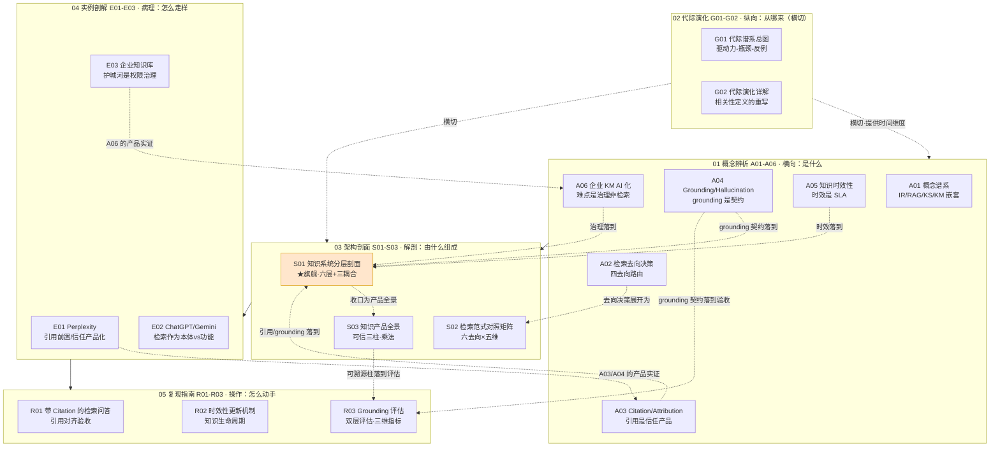

# 信息检索与知识系统系统化专题 · 总览（MOC）

> 本专题的一句话使命：把"AI 产品越来越是知识产品"这件事拆透——让一个转型 PM 在面试桌 / 选型会 / 复现台上，30 秒内说清**为什么"接个 RAG"解决不了知识产品的真问题**，以及时效、引用、治理三件事到底差在哪一层、谁负责、怎么验收。

## §0 序：那堵叫"接个 RAG"的墙

选型会上，有人提议"我们做个企业知识助手"，紧接着一句几乎是肌肉反射的话："接个 RAG 就行。"三天后 demo 跑通，所有人鼓掌。三个月后上线，投诉来了三种：**"答案看起来对但其实是去年的""引用点进去对不上""我看到了不该看的文件"**。这三条，没有一条是 RAG 召回率能修的——它们分别死在时效、引用、治理这三堵墙上，而"接个 RAG"这句话把整栋楼坍缩成了一面承重墙。

本专题的反共识立场只有一句：**把知识产品等同于"接个 RAG"，等于把一栋楼等同于它的承重墙。** RAG 是必要的技术内核，但时效（库里的事实会过期，RAG 不会告诉你哪条过期）、引用（"附了来源"和"逐句可溯源"是两个工程难度量级）、治理（向量层会变成权限提升向量）这三件事，没有一件是 RAG 这个技术管道天然交付的。读完本专题，你拿走的不是"RAG 怎么调"，而是**把检索 / 知识当成一款有用户契约、有责任分层、有可证伪指标的产品来设计与拷问的判断力**——这正是它相对 [c09 - RAG 架构](/kb/基础知识库/c09-rag-架构/)（技术）与 [m205 - RAG 生产环境：索引运维与评估体系](/kb/工程化与落地架构/m205-rag-生产环境-索引运维与评估体系/)（运维）升高的那一层抽象。

## §1 专题定位：为什么"知识产品设计"配独立建一个专题号

用 SHARED_CONTEXT §2 的四条选题判据逐条论证（前 3 条满足 ≥2 即可，第 4 条须为真）：

| 判据 | 是否满足 | 论证 |
|---|---|---|
| **① 中心性**（影响 ≥3 个 PM 决策链节点） | ✅ | 直接锚定选型（检索去向 / 范式选择）、信任设计（引用 / grounding / UI 摩擦力）、合规准入（权限 / 审计 / 删除权）三类决策——覆盖总索引 M1（问题定义）/ M3（架构选型）/ M5（风险与合规）至少三节点。 |
| **② 误解深度**（定义互相矛盾、系统性滑变） | ✅ | IR / RAG / 知识系统 / KM 在 JD、白皮书、媒体里被频繁混用（"接个 RAG = 做知识管理"是最深盲区）；"引用"被当装饰、"grounding"被当 RAG 免费赠品、"时效"被当刷新频率——每一个都是滑变。本专题 A01 用维特根斯坦"家族相似"专门解剖这一滑变。 |
| **③ 速变性**（24 个月内 ≥1 次格式塔切换） | ✅ | 检索范式从"导航（给链接）"切到"回答（给结论）"是一次 Kuhn 意义上不可通约的范式转移；2024–2026 又叠加了 agentic retrieval、长上下文"RAG is dead"叙事、Deep Research 引用幻觉等多次震荡。 |
| **④ 学了就能用**（立即可观测的判断力提升） | ✅ | 读完能在选型会当场画出"四去向路由决策树"（A02/S02）、指出"三个致命层间耦合"（S01）、用"零越权泄漏一票否决"区分企业级与玩具级（E03）。 |

**升高了哪个抽象层**：单维节点 [c09 - RAG 架构](/kb/基础知识库/c09-rag-架构/) / [m203 - RAG 生产环境：Embedding 与文档解析](/kb/工程化与落地架构/m203-rag-生产环境-embedding-与文档解析/) / [m204 - RAG 生产环境：Chunking 与范式演进](/kb/工程化与落地架构/m204-rag-生产环境-chunking-与范式演进/) / [m205 - RAG 生产环境：索引运维与评估体系](/kb/工程化与落地架构/m205-rag-生产环境-索引运维与评估体系/) 解决的是"RAG 这条管道怎么搭、怎么运维"（**工程层**）；同 04AI 的 [c13 - 幻觉的不可消除性](/kb/基础知识库/c13-幻觉的不可消除性/) 解决的是"幻觉为何不可消除"（**风险存在论**）。本专题把这些上提到**知识产品设计层**——RAG 在这里只是"非参数化存储"的一种实现选项，专题真正回答的是"搭好 RAG 之后，离一个可信知识产品还差什么"。它与隔壁 上下文工程专题（信息流工程）是同一枚硬币的两面：0417 管"信息怎么流进上下文窗口"（管道 / 编排），本专题管"知识怎么组织成用户愿信、企业敢部署的产品"（产品契约）——先有本专题的去向路由，才有 0417 的信息流。

## §2 模块全景

**矩阵含义**：主依赖链是 **概念（M1）→ 架构（M3）→ 实例（M4）→ 复现（M5）**；代际演化（M2）**横切**，为概念与架构提供时间维度（每一代的"为什么死 / 为什么没死"）。横向上，M1 的五个产品决策（去向 A02 / 引用 A03 / grounding A04 / 时效 A05 / 治理 A06）逐一在 M3 的旗舰 S01 里被收进"六层责任 + 三致命耦合"，再由 S03 升维成"可信三柱"的乘法判断；M4 的真实产品则是这些判断的病理学实证。**S01 是全专题的承重节点**（旗舰最厚），任何一节读不懂时，回 S01 找它在六层里的位置。

## §3 六模块逐一介绍

| 模块 | 收录什么 | 解决什么问题 | 何时读 |
|---|---|---|---|
| **01 概念辨析（A01-A06）** | IR/RAG/KS/KM 谱系、四去向路由、Citation/Attribution、Grounding/Hallucination、时效 SLA、企业 KM 治理 | "是什么"——挡掉"接个 RAG"的反射，把五个被混用的产品决策钉死在各自抽象层 | 入门必读；面试前速通 A01+A02 |
| **02 代际演化（G01-G02）** | 检索五代谱系（关键词→PageRank→语义→RAG→agentic）、每代的驱动力-瓶颈-反例、2026 真实位置 | "从哪来"——破"一代更比一代强"的线性进步史，看清每代的盲区与回流 | 想反驳"RAG is dead / BM25 已死"时读 |
| **03 架构剖面（S01-S03）** | ★S01 六层产品责任剖面+三致命耦合（旗舰）、S02 六去向×五维对照矩阵+决策树、S03 可信知识产品三柱（乘法） | "由什么组成"——把知识管线按产品责任分层，给出选型会能当场画的决策工具 | 选型 / 架构评审主战场 |
| **04 实例剖解（E01-E03）** | Perplexity 引用前置、ChatGPT Search 与 Gemini、企业知识库（Glean/Copilot 类） | "怎么走样"——真实产品的设计哲学分歧与 gap，把抽象判断接到可证伪的产品行为 | 做竞品 / 标杆分析时读 |
| **05 复现指南（R01-R03）** | R01 带 Citation 的检索问答（引用对齐验收）、R02 时效性更新机制（知识生命周期）、R03 Grounding 评估（双层评估 + 三维指标 + judge 元评估 + CI 门禁） | "怎么动手"——从最小可跑骨架到验收陷阱，再到"怎么量化验收 grounding" | 自己搭 demo / 给团队定验收标准时读 |
| **06 阅读指南（_总览 + README）** | 本 MOC + README 多路径入口与自测 | "怎么读"——三路径导航、自测、反方训练 | 第一站与回访站 |

> [!note] 操作链已闭合
> 05 复现指南 R01/R02/R03 三节齐备。[R03 Grounding 评估](/kb/专题-人文社科透镜/r03-grounding-评估/)把 [A04 Grounding 与 Hallucination 产品策略](/kb/专题-人文社科透镜/a04-grounding-与-hallucination-产品策略/)（grounding 契约）、[S03 知识产品全景](/kb/专题-人文社科透镜/s03-知识产品全景/)（可溯源柱）、[E01 Perplexity 剖解·引用前置模式](/kb/专题-人文社科透镜/e01-perplexity-剖解-引用前置模式/)（37% 失败率）的判断收成"可操作评估流程"——双层评估（先证明 judge 准，再用 judge 量系统）× 三维指标（faithfulness / citation precision+recall / 引用幻觉率）+ judge 元评估 + CI 门禁。"怎么验收 grounding"这条操作链至此从产品契约（A04）→ 实现（R01）→ 评估闭环（R03）完整贯通，不再断尾。

## §4 与现有节点的升级对照表

本专题不复述被引节点的事实基础，只做"升高抽象层 / 补缺 / 纠偏 / 对话"。

| 旧节点 | 它讲的层 | 本专题哪些节点做了哪种升级 |
|---|---|---|
| [c09 - RAG 架构](/kb/基础知识库/c09-rag-架构/) | RAG 工程实现（Chunking/混合检索/Reranker/HyDE） | **A01** 把 RAG 重定位为"知识系统的检索内核之一"（产品 vs 技术，补缺）；**S01** 把 RAG 降为 L1+L2+L3 的一种实现，补出 c09 没有的 L2 路由 / L4 引用-grounding 分离 / L6 权限层（升高抽象层）；**S02/A02** 把"用不用 RAG"升级为"四/六去向路由决策"。 |
| [m203 - RAG 生产环境：Embedding 与文档解析](/kb/工程化与落地架构/m203-rag-生产环境-embedding-与文档解析/) | Embedding 与文档解析工程 | **A06/E03** 把"解析得准"重读为"企业语境里的治理义务"（连接器生态 + 权限映射）。 |
| [m204 - RAG 生产环境：Chunking 与范式演进](/kb/工程化与落地架构/m204-rag-生产环境-chunking-与范式演进/) | Chunking 策略与范式 | **G01/G02** 把 chunk/范式演进定位到"检索代际谱系"坐标上（横切，不复述实现）。 |
| [m205 - RAG 生产环境：索引运维与评估体系](/kb/工程化与落地架构/m205-rag-生产环境-索引运维与评估体系/) | 索引运维四指标 + RAGAS | **S01 L5** 把"运维指标"升级为"知识半衰期产品决策"；**A05/R02** 把增量索引/TTL 升级为"知识生命周期 SLA"；**A04** 把 RAGAS 的 Faithfulness 从"评测数字"升级为"产品契约验收条款"。 |
| [c13 - 幻觉的不可消除性](/kb/基础知识库/c13-幻觉的不可消除性/) | 幻觉的架构性 + 四级应对 | **A03** 把"做可溯源设计"推进为"可溯源设计本身会变成新幻觉载体"（风险存在论→风险产品化）；**A04** 把"幻觉不可降至 0"升级为"既不可消除就按永久失败模式设计契约 + 四道闸门"；**S01 §7 耦合 B** 把"引用幻觉"落成 grounding×引用层不一致的真实反例。 |
| 上下文工程专题（信息流） | token 进上下文的编排 / lost-in-the-middle | **A02/S03** 显式对照：0417 管"信息怎么进上下文（管道）"，本专题管"知识怎么成产品（契约）"；本专题是 0417 的**上游去向闸门**。 |
| [p304 - 防御性 UX：对抗延迟与幻觉](/kb/产品设计与交互范式/p304-防御性-ux-对抗延迟与幻觉/) / [p305 - 信任架构与可解释性设计](/kb/产品设计与交互范式/p305-信任架构与可解释性设计/) / [p306 - 数据飞轮与反馈回路设计](/kb/产品设计与交互范式/p306-数据飞轮与反馈回路设计/) | AI 交互 / 信任 UX / 数据飞轮 | **A03/S01 L4** 把"信任 UX"具体到引用 UX 四模式的"流畅性 vs 强制反思"权衡；**A06/E03** 把数据飞轮接到"空结果率→知识库扩充"的内容运营飞轮。 |

## §5 三条阅读起点（详表见 README）

1. **求职速通路径（面试桌，~20 分钟）**：A01（谱系）→ A02（四去向路由）→ S01 §7（三致命耦合）→ E03（企业护城河）。产出：被问"你怎么设计企业知识助手"时，先画六层责任图、先问 L6 权限和 L1 删除合规，再谈检索精度——一句话把你和"只会调 RAG"的候选人分开。
2. **决策链路径（选型会，按决策顺序）**：S02（六去向×五维矩阵 + 决策树）→ A05（时效 SLA）→ A06（治理准入）→ S03（可信三柱乘法收口）→ R01/R02（验收标准）。产出：一棵能当场画的路由决策树 + 一份"零越权泄漏一票否决"的验收清单。
3. **紧迫度路径（已上线在救火）**：按症状直达——"答案过期了"→ A05/R02；"引用对不上"→ A03/A04/R01；"看到了不该看的"→ A06/E03/S01 §7 耦合 C。产出：把事故归因到具体的层与接缝，而非笼统"再调调 RAG"。

## §6 跨域思想资源调度（不留空 invocation）

| 资源 | 调度位置 | 在该节点的具体作用 |
|---|---|---|
| **维特根斯坦 · 家族相似 / 意义即用法**（《哲学研究》§65-67） | A01 §6 | 论证 IR/RAG/KS/KM 靠重叠相似而非共同本质成"家族"，所以治理术语滑变的办法不是"统一定义"而是"盯使用语境"——把概念辨析从一次性术语对齐变成持续的会议纪律。 |
| **Kuhn · 范式不可通约**（《科学革命的结构》） | G01 §0、G02 | 把检索代际从"进步阶梯"重读为"格式塔切换"：每代擅长解的恰是上代看不见的问题，且会丢失上代解得好的能力——直接反驳线性进步史。链入 范式。 |
| **Michael Polanyi · 默会知识**（《个人知识》1958 /《隐性维度》1966，"we know more than we can tell"） | S01 §9、A01 §5 | 论证任何基于文档检索的知识系统对 L1 覆盖率有**原理性天花板**：组织最值钱的判断/手感/关系网是默会的，进不了向量库——所以"把公司所有知识 AI 化"的正确回应不是"再加连接器"，而是辨识可编码 vs 默会知识。链入 [Polanyi 默会知识与提示工程的认识论张力](/kb/基础知识库/polanyi-默会知识与提示工程的认识论张力/)。 |
| **Fritz Machlup · 知识产业经济学**（《美国知识的生产与分配》1962，Rick 未读·破 echo chamber #1） | A01 §5、A06 | 提醒知识作为产品有独特的生产/分配经济学，不能套普通信息商品逻辑——为企业 KM 的商业模式分析埋经济学锚点。 |
| **Nonaka & Takeuchi · 显性/隐性知识**（《知识创造的企业》1995） | A01 §1、A06 | 钉死 KM 与"知识系统"的分野：KM 的核心是隐性知识的组织化，而向量库只装显性知识——"接个 RAG 就以为做了知识管理"最深的盲区。 |
| **STS / 信任社会学**（接 0117社会学） | A03、E01 | 把"引用即真相"的认知陷阱、zero-click 时代"AI 回答=品牌直接体验"读为信任的社会建构问题，而非纯 UI 问题。 |

> [!note] 跨域纪律
> 以上每条都在对应节点的"跨域呼应"段具体展开了**它如何改变一个技术/产品判断**（非装饰性点名）。其中 Machlup 为 Rick 未读对手框架（破 echo chamber 第 1 个），Polanyi 在 0411/0427 双专题被反复调度但作用各异（此处用于 L1 覆盖率天花板，非提示工程）。

## §7 验收档案

**评议流程**：本专题走 SHARED_CONTEXT §10 的工厂化流水线——ground（事实接地简报）→ draft（按模块并行起草）→ critique（六维 + 事实接地对抗式评议）→ revise（按 issue 单逐节修订，每节留修订日志）→ verify（独立 grounding 校验 pass）→ synthesize（本 MOC + 跨节点双链编织 + 三清单）。各节修订日志可见每个节点文末（如 S01 R0、A01 R1）。

### SABCD 六维自评

| 维度 | 出版线 | 本专题自评 | 依据（含已知扣分项） |
|---|---|---|---|
| **S 结构** | ≥8 | **8.0** | 六模块互补、依赖链清晰、S01 旗舰承重、三路径入口齐备；05 复现 R01/R02/R03 三节齐备，"grounding 评估"操作链已闭合；与 0417/0412 的跨专题对照已于 2026-06-11 回填为真双链。**扣分**：模块间厚度不均（S01 旗舰最厚 vs G/E 系偏薄）。 |
| **A 判断密度** | ≥8 | **8.3** | 每节有反共识带数字判断：51.5% 句子被引用支撑（Liu 2023）、60-70% 企业查询靠 BM25（Glean）、Perplexity 46.7% 引用来自 Reddit、超 60% 查询返回错误引用（Tow Center 2025）、PubMed 幻觉引用 12 倍增长（Lancet 2026）。 |
| **B 边界含量** | ≥7.5 | **8.0** | 每节显式承担赌注/失效场景：S01 §5 时效结论在强实时领域失效；R02 一句话赌注"若模型强到能自动判时效则本节过度工程"；A02 "默认 RAG 是懒惰"的边界（模型已知答案时 RAG 有害）。 |
| **C 认识论自觉** | ≥8 | **8.0** | 区分事实/推测/赌注，硬事实接地或标注：A06/E03 对"9 小时/周"做 13 年陈旧数字的 confirmation-bias 砍除；A04 对 arXiv:2604.03173 标〔同行评审状态待核实〕；A05 对 LLM 截止日期商业博客标⚠️非同行评审。 |
| **D 可演进性** | ≥8.5 | **8.0** | 双链密度高（本 MOC §8 ≥20 真实名，已逐条 resolve；R03 已纳入真实双链；0417/0412 跨专题对照已于 2026-06-11 回填为真双链）、每节有修订日志、改稿档案留痕。**扣分**：D 维出版线最高（8.5），模块间厚度不均与少数前向概念链尚待 publish 阶段处理，故未达 8.5（起草期跨链漂移本轮 QC 已就地全部修净）。 |
| **E 对手拷问能力** | ≥7 | **8.2** | 对真实对手立场"接受+边界"：RAGFlow"Agents 替代 RAG 是 market stunt"、Karpathy 风格"RAG is dead"长上下文派、长上下文 lost-in-the-middle——均给出带证据的边界回应（≥8 处，见各节 §5）。 |

**综合自评 ≈ 8.0/10**（达到 §1 出版线 ≥7.8）。专题 17 节点全部落盘、05 复现操作链已闭合、活动内链零死链，内容已达入库标准。

> [!note] 已修净（诚实留痕，非自夸）
> 1. **R03 已补全落盘**——05 复现模块 R01/R02/R03 三节齐备，"怎么验收 grounding"操作链不再断尾；本 MOC §2 Mermaid 已转正常节点并接入 `A04/S03 --> R03` 边、§3/§8 已纳入真实双链。
> 2. **起草期跨链命名漂移已就地全部修净**：各节点正文曾出现的草稿旧名（如 `S01 检索去向决策框架`、`A02 引用与归属`、`A03 知识时效性`、`A04 企业知识治理` 等——与真实文件名 `S01 知识系统分层剖面` / `A02 检索去向决策·search KG parametric RAG` / `A03 Citation 与 Attribution 产品设计` / `A05 知识时效性与更新` / `A06 企业知识管理的 AI 化` 不符），已按语义逐条改回真实 basename（详见 `_审阅说明.md` §五 QC 修复台账，对应 SHARED_CONTEXT §8 死链纪律 + 0411 死链教训）。本 MOC 自身全部用真实 basename，已逐条核验 resolve。
> 3. **跨专题双链已回填**（2026-06-11 P3.4 校链）：0417 上下文工程、0412 评测两个姊妹专题已入库，原以〔跨专题待落盘〕文本降级保留的对照（A02/A04/S03/E02/R03/README/本 MOC §1/§4/§8）已逐处恢复为真链 `0417 总览` / `0412 总览`（经别名解析至各专题 _总览），staging 注解已删除。

### 对手立场接入清单（≥8 处，点名真实立场）
1. **RAGFlow（2025 年终评述）**："Agents 替代 RAG 是 market-driven stunt"——A02/S01 接受（Agent 依赖 RAG 做三类检索）+ 边界（纯 agentic 路由在小模型上反思 token 不稳，需确定性 fallback）。
2. **Karpathy 风格"RAG is dead"长上下文派**：1M token 直接塞全文——A01/A02 接受（单文档深问检索多余）+ 边界（成本 O(N²)、lost-in-the-middle，且长上下文只替代"检索"环节，替代不了时效/引用/治理）。
3. **Glean 工程实践（ZenML LLMOps DB, 2023）**：60-70% 企业查询靠 BM25——G01/G02/A01 用作"BM25 不死"的正面证据，同时砍除"线性进步史"。
4. **Wang et al.（arXiv:2510.09106）"retrieval hurts when model already knows"**：A02/G01 用作"默认 RAG 是懒惰"的反例支撑。
5. **斯坦福 HAI "facade of trustworthiness"**：A01/A03/A04/E01 反复用作引用前置/grounding 的批判锚点。
6. **Tow Center / Columbia Journalism Review（2025-03）**：8 引擎超 60% 查询错误引用、Perplexity 最低也 37%、Grok-3 高达 94%——E01/E02/A04 用作"引用数量≠质量"。
7. **tianpan.co《Permission-Aware Retrieval》(2026-05)**：向量层 = privilege escalation vector——A06/E03/S01 §7 耦合 C 的核心证据。
8. **Nonaka / Polanyi 隐性知识派**：检索系统先天只触及显性知识——A01/S01 §9 用来逼问本专题"知识=可检索文档"的假设盲点。

### failure scenario 清单（≥5 处）
1. **S01 §5**：双轨架构结论在**强实时领域（股价/航班/库存）失效**——索引成负债，须 L2 直接走实时。
2. **R02 一句话赌注**：若未来模型/检索强到能自动判每条事实时效，则本节大半机制是**过度工程**。
3. **A02**："默认 RAG 是懒惰"在**模型已知答案的常识问题上反转**——正确去向是 parametric，硬塞 RAG 反而拖准确率。
4. **A03/A04**：引用前置的"信任体感"在**Perplexity 46.7% Reddit 来源**场景下成为误导放大器——体感可信度 > 实际可信度。
5. **A05**：训练截止文案"知识截止于 X 月"在**混排预训练稀释时序信号**时给用户过于乐观的心理模型（Fabre 2026）。
6. **S03**：可溯源 × 不可更新 = 高可信度地传播过期信息；可溯源 × 可更新 × 不可治理 = 精准高效的合规事故（三柱乘法反噬）。

### confirmation-bias 砍除清单（≥5 处）
1. **A06/E03**："9-10 小时/周搜内部信息"是 **2012 年 McKinsey 数字**（13 年前），被厂商当营销弹药——砍除：它证明的是"领域缺新鲜量化基线"，不是"问题当下有多大"。
2. **S01 §7**：早期把"向量层过滤"当权限标准答案——砍除：生产系统大多仍用应用层过滤，二者无大规模对比公开数据，正确表述是"更安全但需评估改造 ROI"。
3. **G02 confirmation-bias #1**（节内）：BM25"老技术不死"不等于"BM25 全面够用"——补反例：语义/多义查询上 BM25 仍输向量。
4. **E01**：Perplexity 引用最多≠最可信——砍除"引用密度高=值得信任"的直觉，补 Reddit/新鲜度偏置反例。
5. **A04**：Deep Research 引用更多≠更可信——补 URL 幻觉率反例（Gemini Deep Research 13.3% vs Claude 3.0-3.2%）。

## §8 关联节点（双链密度 ≥20，全部真实 basename，已核验 resolve）

**本专题节点（依赖链内）**
- [A01 信息检索与知识系统概念谱系](/kb/专题-人文社科透镜/a01-信息检索与知识系统概念谱系/)
- [A02 检索去向决策·search KG parametric RAG](/kb/专题-人文社科透镜/a02-检索去向决策-search-kg-parametric-rag/)
- [A03 Citation 与 Attribution 产品设计](/kb/专题-人文社科透镜/a03-citation-与-attribution-产品设计/)
- [A04 Grounding 与 Hallucination 产品策略](/kb/专题-人文社科透镜/a04-grounding-与-hallucination-产品策略/)
- [A05 知识时效性与更新](/kb/专题-人文社科透镜/a05-知识时效性与更新/)
- [A06 企业知识管理的 AI 化](/kb/专题-人文社科透镜/a06-企业知识管理的-ai-化/)
- [G01 信息检索代际谱系总图](/kb/专题-人文社科透镜/g01-信息检索代际谱系总图/)
- [G02 信息检索代际演化详解](/kb/专题-人文社科透镜/g02-信息检索代际演化详解/)
- [S01 知识系统分层剖面](/kb/专题-人文社科透镜/s01-知识系统分层剖面/) ★旗舰
- [S02 检索范式对照矩阵](/kb/专题-人文社科透镜/s02-检索范式对照矩阵/)
- [S03 知识产品全景](/kb/专题-人文社科透镜/s03-知识产品全景/)
- [E01 Perplexity 剖解·引用前置模式](/kb/专题-人文社科透镜/e01-perplexity-剖解-引用前置模式/)
- [E02 ChatGPT Search 与 Gemini 剖解](/kb/专题-人文社科透镜/e02-chatgpt-search-与-gemini-剖解/)
- [E03 企业知识库 AI 化剖解](/kb/专题-人文社科透镜/e03-企业知识库-ai-化剖解/)
- [R01 建一个带 Citation 的检索问答](/kb/专题-人文社科透镜/r01-建一个带-citation-的检索问答/)
- [R02 知识时效性更新机制](/kb/专题-人文社科透镜/r02-知识时效性更新机制/)
- [R03 Grounding 评估](/kb/专题-人文社科透镜/r03-grounding-评估/)

**升级对照锚点（既有 c/m 节点）**
- [c09 - RAG 架构](/kb/基础知识库/c09-rag-架构/) · [m203 - RAG 生产环境：Embedding 与文档解析](/kb/工程化与落地架构/m203-rag-生产环境-embedding-与文档解析/) · [m204 - RAG 生产环境：Chunking 与范式演进](/kb/工程化与落地架构/m204-rag-生产环境-chunking-与范式演进/) · [m205 - RAG 生产环境：索引运维与评估体系](/kb/工程化与落地架构/m205-rag-生产环境-索引运维与评估体系/)
- [c13 - 幻觉的不可消除性](/kb/基础知识库/c13-幻觉的不可消除性/) · [c14 - 模型评估体系与 Goodhart 陷阱](/kb/基础知识库/c14-模型评估体系与-goodhart-陷阱/) · [c10 - Agent 技术栈与工具调用](/kb/基础知识库/c10-agent-技术栈与工具调用/) · [c11 - System 2 思维与 Test-Time Compute](/kb/基础知识库/c11-system-2-思维与-test-time-compute/)
- [m201 - Prompt Engineering 实战体系](/kb/工程化与落地架构/m201-prompt-engineering-实战体系/) · [m202 - 工程选型决策矩阵](/kb/工程化与落地架构/m202-工程选型决策矩阵/) · [m206 - Agent 产品化：记忆机制与技术进展](/kb/工程化与落地架构/m206-agent-产品化-记忆机制与技术进展/)

**产品设计 / 信任 UX（0403）**
- [p301 - 交互范式跃迁与对话框局限](/kb/产品设计与交互范式/p301-交互范式跃迁与对话框局限/) · [p302 - 七种 AI 交互设计模式](/kb/产品设计与交互范式/p302-七种-ai-交互设计模式/) · [p304 - 防御性 UX：对抗延迟与幻觉](/kb/产品设计与交互范式/p304-防御性-ux-对抗延迟与幻觉/) · [p305 - 信任架构与可解释性设计](/kb/产品设计与交互范式/p305-信任架构与可解释性设计/) · [p306 - 数据飞轮与反馈回路设计](/kb/产品设计与交互范式/p306-数据飞轮与反馈回路设计/)

**产品 / 公司 entity（0410）**
- [Perplexity](/kb/ai-公司与产品/perplexity/) · [ChatGPT](/kb/ai-公司与产品/chatgpt/) · [Gemini](/kb/ai-公司与产品/gemini/) · [Claude](/kb/ai-公司与产品/claude/) · [OpenAI](/kb/ai-公司与产品/openai/) · [Anthropic](/kb/ai-公司与产品/anthropic/) · [DeepSeek](/kb/ai-公司与产品/deepseek/) · [Manus](/kb/ai-公司与产品/manus/) · [Microsoft](/kb/ai-公司与产品/microsoft/)

**原子概念卡**
- [RAG](/kb/基础知识库/rag/) · [Embedding](/kb/基础知识库/embedding/) · [幻觉](/kb/基础知识库/幻觉/) · [RLHF](/kb/基础知识库/rlhf/) · [Tokenization](/kb/基础知识库/tokenization/) · [Softmax](/kb/基础知识库/softmax/) · 范式

**跨专题 / 跨域 / 导航**
- 上下文工程专题（信息流，姊妹专题）· 评测专题 · [_Agent 系统化专题·总览](/kb/专题-安全对齐与失败/_agent-系统化专题-总览/)（0411 标杆）
- 0117社会学 · 0114认识论 · [Polanyi 默会知识与提示工程的认识论张力](/kb/基础知识库/polanyi-默会知识与提示工程的认识论张力/) · [AI概念滥用反思](/kb/基础知识库/ai概念滥用反思/)
- [AI PM 知识图谱·总索引](/kb/ai-pm-知识图谱/ai-pm-知识图谱-总索引/) · 仪表盘

