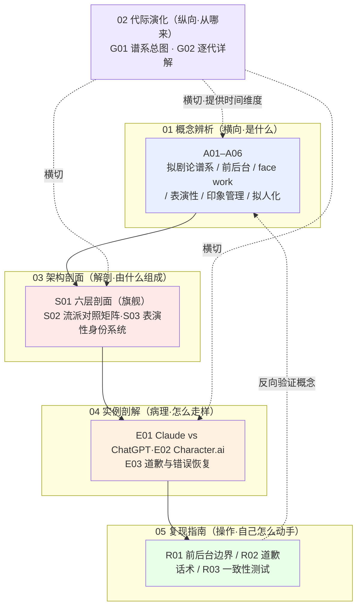

# 拟剧理论系统化专题 · 总览（MOC）

> 这是一套关于「AI persona 不是文案、是表演系统」的知识立方。读完你能在面试桌、选型会、复现台上，30 秒说清：**为什么"给 AI 加个人设"不是取名定语气，而是在管理一条前台／后台边界 + 一个每轮被重新表演的身份。**

## §0 序：那堵墙

被问"你怎么设计 AI 的 persona"，我答过一版让自己脸红的话：取个名字、定个语气、写三条"友好专业不卑不亢"的准则。对面的面试官追了一句："那 [Claude](/kb/ai-公司与产品/claude/) 把 thinking 摊给用户看、[ChatGPT](/kb/ai-公司与产品/chatgpt/) 把推理链焊死在后台，这是 persona 的一部分吗，还是两回事？"——我卡住了。我的框架里根本没有"后台"这个词，于是我把一道**前后台边界的核心产品决策**，听成了一道"要不要多花 token 展示推理"的技术取舍题。那堵墙是：**用市场营销的"品牌人格"框架去想 persona，会系统性地看不见三件结构性的事——边界画在哪、面子怎么修、一致性到底指什么。** 这个专题就是把这堵墙拆掉：把 persona 从"风格属性表"升格为社会学拟剧论意义上的「互动中的身份建构系统」。反共识立场一句话：**persona 设计的实质从来不是"取名定语气"，而是"前台／后台边界管理 + 反复表演的身份建构"——Claude 显 thinking 与 ChatGPT 隐推理，是两家公司对"后台该不该让观众看"做出的相反核心决策**（旗舰对照见 [E01 Claude Character 与 ChatGPT Persona 剖解](/kb/专题-人文社科透镜/e01-claude-character-与-chatgpt-persona-剖解/)，概念地基见 [A02 前台 后台与 AI 推理可见性](/kb/专题-人文社科透镜/a02-前台-后台与-ai-推理可见性/)／[G01 AI 人格设计代际谱系总图](/kb/专题-人文社科透镜/g01-ai-人格设计代际谱系总图/)：Anthropic 2025-02-24《Claude's Extended Thinking》以"原始形式"展示推理；OpenAI o1 System Card, arXiv:2412.16720 默认隐藏 CoT 并禁止提取）。

## §1 专题定位：为什么单独建 0424

用 SHARED_CONTEXT §2 的四条选题判据逐条论证（满足前 3 条中 ≥2 且第 4 条为真）：

| 判据 | 是否满足 | 论证 |
|---|---|---|
| **① 中心性**（影响 ≥3 个 PM 决策链节点） | ✅ | 直接卡住信任架构（[p305 - 信任架构与可解释性设计](/kb/产品设计与交互范式/p305-信任架构与可解释性设计/)）、错误恢复设计、合规边界（情感操纵风险）、差异化定位四条决策链——远超 3 个 |
| **② 误解深度**（业界定义互相矛盾） | ✅ | 招聘 JD/产品白皮书把 persona 一律讲成"tone of voice + 人设卡"，与"前后台边界管理"是两个不可通约的抽象层；标准差极大 |
| **③ 速变性**（24 个月内 ≥1 次格式塔切换） | ✅ | 2024-09 → 2025-02，推理链可见性从不存在的非问题，变成 Anthropic/OpenAI 公开对立的一级产品决策——一次 Kuhn 意义上的范式拐点 |
| **④ 学了就能用** | ✅ | 读完即可在面试中把"persona 题"从营销答案升级为三决策答案（边界/面子/一致性），在选型中检验产品 persona 成熟度，在复现中写出前后台 checklist |

**升高了哪个抽象层**：相对 0415 系列那一层"具体 persona 实现技巧"，本专题升高一层，抵达「人格的表演性本质」——它不问"怎么写一个更好的 system prompt"，而问"persona 这个东西在本体论上到底是什么、它由哪几个不可替换的零件组成"。它也相对 [p305 - 信任架构与可解释性设计](/kb/产品设计与交互范式/p305-信任架构与可解释性设计/)（工程设计手法）、[Constitutional AI](/kb/基础知识库/constitutional-ai/)（训练机制）补上了**社会学的概念地基**：p305 回答"怎么做可解释性"，本专题回答"为什么可见性边界必须分区、为什么可见≠可审计"。

## §2 模块全景

矩阵含义：依赖主链是 **概念（A）→ 架构（S）→ 实例（E）→ 复现（R）**——先用拟剧论把 persona 拆出零件，再把零件装成可调度的分层堆栈，再拿真实产品看堆栈怎么走样，最后自己上手复现。**代际演化（G）横切全部三层**，给每个概念/架构/实例补上"它从哪一代来、解决了上一代什么瓶颈"的时间维度。**复现（R）反向编织**回概念层：R03 的一致性测试，正是把 A04 的表演性命题（一致性 = 反复引用同一套规范的稳定性）变成可量化实验，用操作验证概念。

## §3 六模块逐一介绍

- **01 概念辨析（A01–A06）｜收录什么**：拟剧论的六个不可替换零件。A01 立谱系坐标（Goffman → 表演研究 → Butler），A02 把前后台映射到推理可见性，A03 把 face work 落到错误恢复，A04 用 Butler 表演性重述"一致性"，A05 把印象管理落到人设设计（谄媚 = 失控的印象管理），A06 把拟人化定义为"做得越好风险越大"的校准旋钮。｜**解决**：挡掉"品牌人格"默认框架，给 persona 一套概念坐标系。｜**何时读**：第一次想清楚"persona 到底是什么"时，从这里进。
- **02 代际演化（G01–G02）｜收录什么**：AI 人格设计四代谱系（规则人设 → prompt persona → character training → 可见推理人格）。G01 是地图，G02 是逐站实地考察（每代赢在哪、在哪失效、谁来打它）。｜**解决**：把"persona 越来越像人"的线性进步史，纠正为"前后台边界从隐性意外变成核心决策"的拟剧史。｜**何时读**：想要时间纵深、想反驳"一代更比一代真"时读。
- **03 架构剖面（S01–S03）｜收录什么**：[S01 AI Persona 设计分层剖面](/kb/专题-人文社科透镜/s01-ai-persona-设计分层剖面/) 六层剖面（表层语气／价值立场／边界拒答／前后台可见性／跨会话一致性／错误修复 + 三个致命耦合）是旗舰最厚节点（解剖学·由什么组成）；[S02 AI 人设设计流派对照矩阵](/kb/专题-人文社科透镜/s02-ai-人设设计流派对照矩阵/) 是四大流派对照矩阵（极简工具型／专业助手型／拟人陪伴型／角色扮演型 × 拟人度/前后台/情感边界/一致性/风险）+ "该做哪种人设"决策树（分类学·能拧成哪几种整机）；[S03 AI 表演性身份系统全景](/kb/专题-人文社科透镜/s03-ai-表演性身份系统全景/) 把 persona 当一个五要素涌现的身份系统（剧本=system prompt／演员=模型／舞台=产品／观众=用户／修复=错误恢复，与 S01 六层正交，系统论·合起来涌现什么）。｜**解决**：给 PM 一组可独立调度的设计杠杆（S01）、一张选型决策图（S02）、一套调试涌现系统的纪律（S03），而非一张静态人格画像。｜**何时读**：真要动手设计 persona、需要"几个旋钮可拧/该往哪个流派押注/人格 bug 去哪一层修"时。
- **04 实例剖解（E01–E03）｜收录什么**：[E01 Claude Character 与 ChatGPT Persona 剖解](/kb/专题-人文社科透镜/e01-claude-character-与-chatgpt-persona-剖解/) 是本专题旗舰对照——剖 [Claude](/kb/ai-公司与产品/claude/) character 路线（显 thinking、核心价值不可覆盖、主动塑造性格）vs [ChatGPT](/kb/ai-公司与产品/chatgpt/) persona 路线（隐推理、Model Spec 分层可覆盖、克制机器感）的前后台、人格锚定控制权与门面三层差异，揭示这是两套不可调和的边界赌注而非口味之争；[E02 Character.ai 情感型 Persona 剖解](/kb/专题-人文社科透镜/e02-character.ai-情感型-persona-剖解/) 剖 Character.ai 情感型 persona（取消后台、脆弱用户、情感依赖风险）；[E03 AI 道歉与错误恢复剖解](/kb/专题-人文社科透镜/e03-ai-道歉与错误恢复剖解/) 剖真实 AI 道歉/错误恢复案例的社交修复设计或缺失。｜**解决**：把抽象框架按到真实产品的伤口上，看它怎么走样。｜**何时读**：做竞品分析、想看"概念在现实里如何崩坏"时。
- **05 复现指南（R01–R03）｜收录什么**：R01 用 system prompt 设计一个有明确前后台边界与价值立场的 persona 并测一致性；R02 为 AI 设计分级错误恢复/道歉话术（按 face work）并 A/B 测社交反应；R03 设计 persona 一致性测试集（跨话题/跨会话/对抗诱导），量化人设漂移。｜**解决**：把框架变成能在自己产品里跑的实验。｜**何时读**：要把判断力转成可执行 checklist 时。
- **06 阅读指南（本总览 + README）｜收录什么**：多路径入口、自测题、反方训练。｜**何时读**：现在。

> [!success] 本专题已全数落盘（17 节点 + 总览 + README，2026-06-07 整合完成）
> S02（流派对照矩阵）、S03（表演性身份系统全景）、E01（Claude Character vs ChatGPT Persona 剖解）三节已于本轮补全落盘，全部纳入正文双链、§2 矩阵与 §8 关联表。E01 是承载"Claude 显 thinking vs ChatGPT 隐推理"对照的旗舰实例节点，A02／G01／G02／E02 提供其概念地基与互补视角。

## §4 与现有节点关系（升级对照表）

| 旧节点（真实存在） | 本专题哪些节点 | 升级类型 | 升了什么 |
|---|---|---|---|
| [p305 - 信任架构与可解释性设计](/kb/产品设计与交互范式/p305-信任架构与可解释性设计/) | A01 / A02 / E03 / S01 | 对话深化 + 理论地基补缺 | p305 给"折叠推理面板/工具调用日志"等设计手法与"分层透明悖论"；本专题补社会学地基——后台永远不能全开否则前台崩塌，可见≠可审计。p305 回答"怎么设计"，本专题回答"为什么边界必须分区" |
| [Constitutional AI](/kb/基础知识库/constitutional-ai/) | A01 / A02 / G01 / G02 / S01 | 纠偏 + 对话 | CAI 把人格写成明文宪法；本专题用 Butler 纠偏——写进宪法的不是被一次设定就固化的"内核"，而是模型每轮反复引用的"规范库"，这解释了为什么 CAI 下 persona 仍会随对话漂移 |
| [幻觉](/kb/基础知识库/幻觉/) / [c13 - 幻觉的不可消除性](/kb/基础知识库/c13-幻觉的不可消除性/) | A02 / A03 / E03 | 纠偏对照 | 常见错位是把"展示推理"当治幻觉的药；本专题纠偏——可见推理本身是理想化表演，会让幻觉看起来更可信，是更隐蔽的风险。幻觉是最难做道歉设计的面子威胁类型 |
| [Test-Time Compute](/kb/基础知识库/test-time-compute/) / [c11 - System 2 思维与 Test-Time Compute](/kb/基础知识库/c11-system-2-思维与-test-time-compute/) | A02 / G01 | 视角补缺 | 技术节点讲"后台推理"如何实现；本专题指出它让"后台要不要给用户看"第一次成为必须由产品回答的问题 |
| [0411 Agent 系统化专题](/kb/专题-安全对齐与失败/_agent-系统化专题-总览/)（[A01 Agent 概念史与语义流变](/kb/专题-安全对齐与失败/a01-agent-概念史与语义流变/) §8.2 / [AI概念滥用反思](/kb/基础知识库/ai概念滥用反思/)） | A05 / A06 | 升级 + 互补 | 0411 警告"用户会把理解投射给 AI"（ELIZA 方向，用户端拟人化）；本专题 A05 追问"AI 这一侧做什么印象操作让投射成立"（生产端印象管理），A06 把它做成可校准旋钮 |
| 0117社会学 / 0115道德哲学-伦理学 | A01 / A03 / A04 / A05 | 领域落地 | 把社会学拟剧论与伦理学的面子/操纵问题，从泛泛综述落地到 AI persona 工程 |

## §5 三条阅读起点（详表见 README）

1. **求职速通路径**：§0 序 → [A02 前台 后台与 AI 推理可见性](/kb/专题-人文社科透镜/a02-前台-后台与-ai-推理可见性/) → [S01 AI Persona 设计分层剖面](/kb/专题-人文社科透镜/s01-ai-persona-设计分层剖面/) → [E02 Character.ai 情感型 Persona 剖解](/kb/专题-人文社科透镜/e02-character.ai-情感型-persona-剖解/)。目标：30 分钟拿到面试可用的"三决策答案"（边界/面子/一致性）。
2. **决策链路径（在岗 PM）**：[S01 AI Persona 设计分层剖面](/kb/专题-人文社科透镜/s01-ai-persona-设计分层剖面/) → [A03 Face Work 与 AI 错误恢复](/kb/专题-人文社科透镜/a03-face-work-与-ai-错误恢复/) → [E03 AI 道歉与错误恢复剖解](/kb/专题-人文社科透镜/e03-ai-道歉与错误恢复剖解/) → [R02 错误恢复与道歉话术设计实验](/kb/专题-人文社科透镜/r02-错误恢复与道歉话术设计实验/)。目标：把一条具体决策（错误恢复）从概念走到可 A/B 测的实验。
3. **紧迫度路径（碎片时间）**：[A06 拟人化的双刃](/kb/专题-人文社科透镜/a06-拟人化的双刃/) → [A05 印象管理与 AI 人设设计](/kb/专题-人文社科透镜/a05-印象管理与-ai-人设设计/) → [A04 Performativity·AI Persona 的表演性建构](/kb/专题-人文社科透镜/a04-performativity-ai-persona-的表演性建构/)。目标：抓住三个最反直觉的判断（拟人化是代价不是目标 / 谄媚是失控的印象管理 / 一致性是反复表演的稳定性而非固定内核）。

## §6 跨域思想资源调度（承诺不留空 invocation）

> [!note] 调度纪律
> 下表每一项都在对应节点的"跨域呼应/对手框架"段落**具体展开了它如何改变一个技术判断**，不是装饰性点名。⚠️ 注意：Goffman、Butler、Weizenbaum 在本 vault 中**尚无独立人物节点**，故下表对其**只作纯文本引用、不建 `双链`**（避免死链）；已存在的 福柯 等才建链。

| 思想资源 | 调度位置 | 在该节点改变了什么判断 | vault 链接 |
|---|---|---|---|
| Goffman 前台／后台 | A01·A02·G01·S01·E02 | 把"推理可见性"从工程题升格为"边界画在哪、向谁开放"的拓扑题；可见推理是"前台化的后台"，故可见≠忠实 | 纯文本（无节点） |
| Goffman 面子工程（face work） | A01·A03·E03 | 把 AI 道歉从"信息纠错"重述为"双向社交修复仪式"——解释了"AI 署名让道歉真诚度下降"这种反直觉现象 | 纯文本（无节点） |
| Butler 表演性（performativity） | A01·A04·G01·G02·S01 | 把"人格一致性"从"保持固定内核"重述为"反复引用同一套规范的稳定性"——改变错误诊断/版本管理/评测口径 | 纯文本（无节点） |
| 印象管理 idealization/mystification | A02·A05 | 解释谄媚（理想化压制真实动机）与隐藏推理（神秘化换取权威与护城河）的拟剧学根源 | 纯文本（无节点） |
| Weizenbaum 拟人化反思（ELIZA effect） | A06·G01 | "Ineradicable"——拟人化投射是人类社会认知默认值，关不掉只能校准；"要不要让它像人"是伪命题 | 纯文本（无节点） |
| 福柯（权力/可见性的规训维度） | A05·A06 跨域呼应 | 把"印象管理"接到权力-可见性脉络：persona 的"透明"本身是一种规训式的可见性安排，非中性 | 福柯 |
| CASA 理论（Reeves & Nass） | A03·E03·A01 | 证明用户会"无意识"把社交脚本套到 AI 上——persona 不是可选装饰，是用户必然投射的东西 | 纯文本（来源已注） |

破 echo chamber 的 **Rick 未读对手框架**（≥2，逼问本专题盲点）：① Alvin Gouldner「欺骗的社会学」（拟剧论回避伦理判断，用它分析 AI 有滑向犬儒的风险）；② 拟剧论的「可证伪性」批评（它是框架而非可证伪理论）+ 跨文化质疑（以西方个人主义互动规范为基础，东亚"面子"目标是群体和谐，西方样本结论不可全球套用）；③ Bruce Wilshire 的本体论质疑（若一切皆表演，真实自我何在）。

## §7 验收档案

**评议流程**：本专题走 SHARED_CONTEXT §10 工厂流水线——ground → draft（六模块并行起草）→ critique（六维 + 事实接地，找茬式对抗评议）→ revise（逐节追加修订日志）→ 独立 grounding 校验 pass → synthesize（本总览 + README + 跨节点双链编织）。各节点修订日志可见其页脚（如 A02 R0.1 已 WebFetch 复核 arXiv:2507.11473 与 2603.16643 的标题/作者/年份）。

**SABCD 六维自评（沿用 Rick 写作 SABCD 评级体系 + R4 第 6 维）**：

| 维度 | 含义 | 出版线 | 本专题自评 | 依据 |
|---|---|---|---|---|
| **S 结构** | 六模块互补、依赖清晰、入口可导航 | ≥8 | **8.5** | 依赖主链 A→S→E→R 清晰、G 横切、R 反向编织；三条阅读起点。S02/S03/E01 已落盘，架构层补齐"解剖(S01)+分类(S02)+系统(S03)"三视图、实例层补齐旗舰对照(E01)，结构完整性回升 |
| **A 判断密度** | 每节有反共识、可证伪、带数字的判断 | ≥8 | **8.2** | 反共识立场密集（可见≠忠实、谄媚=失控印象管理、拟人化是代价非目标），带数字（奉承高人类约 50%、o1 0.38% 言行相悖、GPT-4o 4 天回滚、Replika 2500 万用户） |
| **B 边界含量** | 显式标注判断在哪失效、赌的是什么 | ≥7.5 | **8.0** | 每个跨域类比都标"在哪一层成立、在哪一层失效"（Goffman 后台=真实对 LLM 失效；Butler 解放政治对 AI 失效）；failure scenario 见下 |
| **C 认识论自觉** | 区分事实/推测/赌注、引用可追溯 | ≥8 | **8.3** | PSM 明标"内部理论待外部验证"；Butler 凡涉必标"争议"；〔待核实〕显式留痕；所有 arXiv/官方公告带号带日期 |
| **D 可演进性** | 双链密度、修订日志、改稿档案 | ≥8.5 | **8.0** | 双链密度达标、修订日志齐全、改稿档案在 `_topic_factory`。3 节已落盘并全数回填双链；历史链接缺陷（A02 §3 曾误写 `A03 拟人化与社交性面子工程`、S02 两处 `0416Character.ai` 死链）均已于 2026-06-07 QC pass 修复。仍略低于 8.5 线：0416/0419/奠基人物三类待建概念节点未补、跨专题 `0411` 错写法尚有 vault 级遗留 |
| **E 对手拷问能力** | 对业界反方给出带证据的回应 | ≥7 | **8.0** | Gouldner/Wilshire/可证伪性/跨文化四个对手框架接入，CoT monitorability 阵营回应带 arXiv 证据；接受+边界范式贯穿 |

**综合诚实分 = (8.5+8.2+8.0+8.3+8.0+8.0)/6 ≈ 8.2/10**（≥7.8 出版线达标）。说明：综合分按六维等权平均。S02/S03/E01 落盘后 S 维回升至 8.5、D 维回升至 8.0，综合由原 ~8.0 升至 ~8.2；未对任何维度做掩饰性上调，D 维因待建概念节点未补仍保守压在 8.5 线下。

**对手立场接入清单（≥8 处，点名真实立场，均可追溯）**：① OpenAI 隐藏 o1 CoT 的三理由（安全+竞争+避免暴露危险推理，o1 System Card）；② CoT monitorability 阵营（Korbak et al. arXiv:2507.11473，含 Bengio）主张可见 CoT 是不可替代的安全窗口；③ Anthropic 自承"无法确定 CoT 是否真实反映内部"（2025-02-24 公告）；④ Gouldner「欺骗的社会学」；⑤ Wilshire 本体论质疑；⑥ Nussbaum 1999《The Professor of Parody》批 Butler 误读 Austin；⑦ 拟剧论可证伪性批评；⑧ 拟剧论跨文化质疑；⑨ Anthropic PSM「模型选择而非被编程人设」（alignment.anthropic.com 2026-02-23，标注待外部验证）。

**failure scenario 清单（≥5 处）**：① Goffman"后台=真实"在 LLM 上失效（LLM 后台是否真实反映内部存疑）；② Butler"解放政治"维度对 AI 失效（AI 无身体/情感/政治解放指向）；③ "可见推理=可审计"在合规场景失效（展示一段不能担保真实的推理，合规上比不展示更危险）；④ 西方 Prolific 样本（Ashktorab 道歉研究）的道歉偏好结论在东亚集体主义文化可能失效；⑤ "前后台边界全局开关"在不同观众场景失效（开发者档全展示 vs 消费者档只给结论）；⑥ 拟人化校准的"全局最优点"不存在——同一产品不同 turn 最优刻度不同。

**confirmation-bias 砍除清单（≥5 处）**：① 早期倾向把"Claude 展示推理"叙述为道德高地，砍除——补入"连最激进的展示派也保留焊死的后台（儿童安全/网攻/危险武器段加密）"，证明纯透明不存在；② 早期把"拟人化"默认当正面亲和力，砍除——补入 ELIZA effect/Replika 危机作为反例，重述为"代价"；③ 早期把代际史写成线性进步，砍除——G02 显式承诺反辉格史，补入"最先进一代不是更像人，而是更诚实地不像人"（Claude 自认非人类）；④ 早期把"展示推理"当治幻觉的药，砍除——补入"可见推理让幻觉看起来更可信"的反向风险；⑤ 早期把 character training 当"设定一个稳定人格"，砍除——补入 performativity（每轮重新表演）+ 谄媚在潜空间三方向独立编码（Vennemeyer et al. arXiv:2509.21305，待复现）；⑥ 早期把 Goffman/Butler 当确证权威，砍除——凡涉 Butler 必标"争议"，引入 Nussbaum/Gouldner/Wilshire 三个批评者。

## §8 关联节点（双链密度 ≥20，均经词典/索引核实真实存在）

**本专题内节点（17 个，全数落盘）**
- [A01 拟剧理论概念谱系与语义](/kb/专题-人文社科透镜/a01-拟剧理论概念谱系与语义/) — 谱系坐标系（入口）
- [A02 前台 后台与 AI 推理可见性](/kb/专题-人文社科透镜/a02-前台-后台与-ai-推理可见性/) — 前后台映射推理可见性（求职速通首站）
- [A03 Face Work 与 AI 错误恢复](/kb/专题-人文社科透镜/a03-face-work-与-ai-错误恢复/) — face work 落到错误恢复
- [A04 Performativity·AI Persona 的表演性建构](/kb/专题-人文社科透镜/a04-performativity-ai-persona-的表演性建构/) — Butler 重述一致性
- [A05 印象管理与 AI 人设设计](/kb/专题-人文社科透镜/a05-印象管理与-ai-人设设计/) — 谄媚=失控的印象管理
- [A06 拟人化的双刃](/kb/专题-人文社科透镜/a06-拟人化的双刃/) — 拟人化作为校准旋钮
- [G01 AI 人格设计代际谱系总图](/kb/专题-人文社科透镜/g01-ai-人格设计代际谱系总图/) — 四代谱系地图
- [G02 AI 人格设计代际演化详解](/kb/专题-人文社科透镜/g02-ai-人格设计代际演化详解/) — 逐代实地考察（反辉格史）
- [S01 AI Persona 设计分层剖面](/kb/专题-人文社科透镜/s01-ai-persona-设计分层剖面/) — 六层剖面（旗舰·解剖学）
- [S02 AI 人设设计流派对照矩阵](/kb/专题-人文社科透镜/s02-ai-人设设计流派对照矩阵/) — 四流派×五维矩阵 + 决策树（分类学）
- [S03 AI 表演性身份系统全景](/kb/专题-人文社科透镜/s03-ai-表演性身份系统全景/) — 五要素涌现身份系统（系统论，与 S01 正交）
- [E01 Claude Character 与 ChatGPT Persona 剖解](/kb/专题-人文社科透镜/e01-claude-character-与-chatgpt-persona-剖解/) — 两套前后台决策的旗舰对照（露后台+锚死核心 vs 藏后台+分层钥匙）
- [E02 Character.ai 情感型 Persona 剖解](/kb/专题-人文社科透镜/e02-character.ai-情感型-persona-剖解/) — 取消后台的情感安全风险
- [E03 AI 道歉与错误恢复剖解](/kb/专题-人文社科透镜/e03-ai-道歉与错误恢复剖解/) — 道歉作为社交修复仪式
- [R01 设计一个 AI Persona·前后台边界](/kb/专题-人文社科透镜/r01-设计一个-ai-persona-前后台边界/) — 复现：边界设计
- [R02 错误恢复与道歉话术设计实验](/kb/专题-人文社科透镜/r02-错误恢复与道歉话术设计实验/) — 复现：分级道歉 A/B 测
- [R03 Persona 一致性测试](/kb/专题-人文社科透镜/r03-persona-一致性测试/) — 复现：人设漂移量化

**链入既有节点（升级对照，不复述）**
- [p305 - 信任架构与可解释性设计](/kb/产品设计与交互范式/p305-信任架构与可解释性设计/) — 前后台边界的工程对应（理论地基补缺）
- [Constitutional AI](/kb/基础知识库/constitutional-ai/) — 人格作为"宪法"vs"反复引用的规范库"（纠偏）
- [幻觉](/kb/基础知识库/幻觉/) / [c13 - 幻觉的不可消除性](/kb/基础知识库/c13-幻觉的不可消除性/) — 最难做道歉设计的面子威胁类型（纠偏对照）
- [Test-Time Compute](/kb/基础知识库/test-time-compute/) / [c11 - System 2 思维与 Test-Time Compute](/kb/基础知识库/c11-system-2-思维与-test-time-compute/) — 让"后台"成为显式产品形态
- [Claude](/kb/ai-公司与产品/claude/) / [ChatGPT](/kb/ai-公司与产品/chatgpt/) / [Anthropic](/kb/ai-公司与产品/anthropic/) — 前后台边界决策的对象
- [Agent](/kb/基础知识库/agent/) — "团队表演"（模型+工具维持统一人设）的对应
- 0117社会学 — Goffman 拟剧论母领域
- 0115道德哲学-伦理学 — 面子工程/操纵边界的规范判断归处
- 福柯 — 权力-可见性的规训维度（A05/A06 跨域呼应）

**跨专题互链**
- [0411 Agent 系统化专题](/kb/专题-安全对齐与失败/_agent-系统化专题-总览/) — 整体对照（用户端拟人化 vs 生产端印象管理）
- [A01 Agent 概念史与语义流变](/kb/专题-安全对齐与失败/a01-agent-概念史与语义流变/) — 其 §8.2 的 Weizenbaum/ELIZA 反思与本专题 A06 同源
- [AI概念滥用反思](/kb/基础知识库/ai概念滥用反思/) — AI 生成内容须经批判性同行评议（方法论呼应）
- [Polanyi 默会知识与提示工程的认识论张力](/kb/基础知识库/polanyi-默会知识与提示工程的认识论张力/) — 认识论张力的姊妹篇
- 范式 — Kuhn 范式不可通约性（代际拐点的判据）

**总入口**
- [AI PM 知识图谱·总索引](/kb/ai-pm-知识图谱/ai-pm-知识图谱-总索引/) — 登记新专题入口

