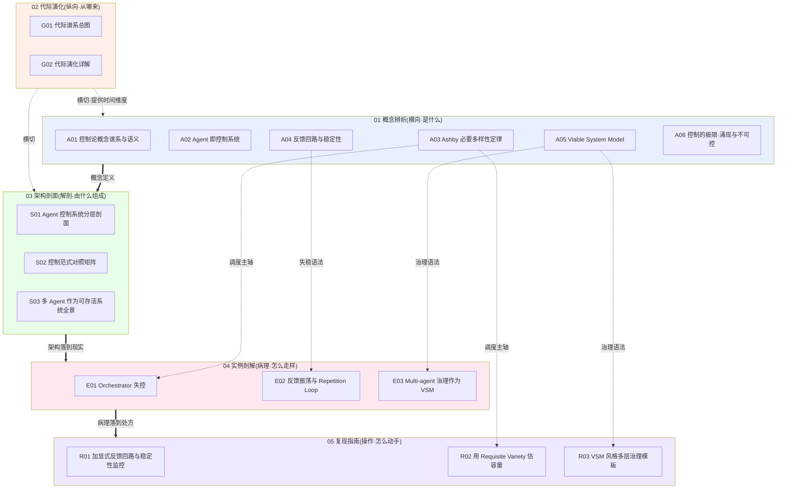

# 控制论系统化专题 · 总览(MOC)

> 本专题 17 个节点的导航中枢。它把"控制论"从一个 1948 年的复古名词,重建为**理解 agent 为什么会失控的最深层语法**。读完本页,你能在 30 秒内说清:为什么"换更强的模型"治不了大多数 multi-agent 失控,以及该换什么。

---

## §0 序:那堵墙

某次选型复盘会上,一个被宣传为"自主智能体"的 multi-agent 方案在复杂任务上反复崩盘——子 agent 行为分叉、计划被反复改写、循环停不下来、token 烧穿却没产出。全场的诊断高度一致:"模型还不够聪明,等下一代。"

这就是那堵墙。它把一个**结构性失控**误诊成了**能力不足**。控制论给出的反答案很冷:一个 orchestrator 能压住的环境复杂度,不由它"聪明不聪明"决定,而由 Ashby 1956 年写下的一条不等式 `V(R) ≥ V(D)` 封顶——当 context 装不下环境的状态多样性,失控在**信息论意义上**就是必然,跟模型 IQ 无关。深度学习赢的是"表征"赛道,从未参加"控制"赛道;而 agent 把"控制"这个被搁置七十年的问题,重新顶到了 PM 的决策桌上。

本专题的反共识立场一句话:**agent 失控不是智力问题,是控制结构问题——它有名有姓(正反馈失稳 / requisite variety 不足 / 缺停机条件 / 治理层缺位),有诊断手册,有处方。** 读完你能把"模型不够聪明"这句话从你的复盘词典里删掉。

---

## §1 专题定位:为什么"控制论"配独立建一个专题号

按 SHARED_CONTEXT §2 的四条选题判据,逐条显式论证:

1. **中心性(✅)**:控制论语法直接影响 PM 的多个决策链节点——选型(判断一个 agent 框架的稳定性而非 feature list)、复现(给 agent 装反馈/阻尼/熔断)、成本(treaty variety 与 token 成本的对赌)、合规(不可逆动作的 HITL/algedonic 断点)。它不是某一节的局部知识,是横切所有 agent 决策的底层语法。
2. **误解深度(✅)**:业界对"agent 失控"的归因系统性滑变——主流叙事(scaling 信仰)说"模型不够强",工程博客说"prompt 没写好",销售话术说"会涌现集体智能",彼此矛盾且都回避了信息论约束。这是标准差极大的系统性误解。
3. **速变性(✅)**:2025–2026 出现一波控制论形式化 agent 的工作(IBM "Agentic AI Needs a Systems Theory" arXiv:2503.00237、"Agent Cybernetics" arXiv:2605.10754、Eslami & Yu "A Control-Theoretic Foundation for Agentic Systems" arXiv:2603.10779),前沿研究者集体回头向七十年前的控制论取经——这本身就是一次范式回潮。
4. **学了就能用(✅)**:读完后 PM 在面试桌(把"换模型"答案升级成"variety 失配/反馈失稳"结构诊断)、选型会(用控制论四问筛掉伪 agent)、复现台(照 R01/R03 骨架装反馈与治理)立即获得可观测的判断力提升。

**升高了哪个抽象层**:相对 [c11 - System 2 思维与 Test-Time Compute](/kb/基础知识库/c11-system-2-思维与-test-time-compute/)、[m207 - Agent 产品化：场景推演与失败模式](/kb/工程化与落地架构/m207-agent-产品化-场景推演与失败模式/) 这些单维节点(它们回答"何时多想""失败长什么样"),本专题升高到**"agent 作为闭环控制系统,其稳定性由什么决定"**——把散落的失败现象学,接到统一的控制论病理学上。它是 0411 Agent 专题的**深层理论底座**:0411 讲 agent 由什么组成、怎么演化;本专题讲 agent 作为控制系统为什么会失控,以及那些失控在结构上为何必然。两者互补不复述。

---

## §2 模块全景:六模块矩阵

**矩阵读法**:粗实线是依赖链(概念 → 架构 → 实例 → 复现);虚线是横切关系(代际演化 G01/G02 给所有模块提供时间坐标;A03 Ashby 定律是贯穿 E01/R02 的调度主轴,A04 反馈语法贯穿 E02,A05 VSM 治理语法贯穿 E03/R03)。注意三条"概念→实例"的直达虚线:它们标出了本专题的三根承重柱——**必要多样性(A03→E01/R02)、反馈失稳(A04→E02)、可存活系统治理(A05→E03/R03)**。阅读指南(本总览 + README)反向把这张网编织成多条可读路径(见 §5)。

---

## §3 六模块逐一介绍

**01 概念辨析(A01–A06)** — 收录控制论的横向语义骨架。
- 收录什么:词源/语义滑变(A01)、agent=闭环控制系统的五零件同构(A02)、Ashby 必要多样性定律本体(A03)、负/正反馈与延迟致不稳定(A04)、Beer VSM 五子系统(A05)、控制的三道结构极限(A06)。
- 解决什么:挡掉"控制论是 AI 废弃前史"的误读,把每个核心概念钉到 agent 工程判断上。
- 何时读:想建立诊断词汇表时;面试前补"为什么是控制问题不是智力问题"的弹药时。

**02 代际演化(G01–G02)** — 收录控制论的纵向谱系。
- 收录什么:一阶→二阶→系统动力学→复杂自适应系统→AI agent 控制的五代谱系总图(G01),逐代"驱动力/核心内核/瓶颈反例/给 agent 的遗产"详解(G02)。
- 解决什么:拒绝"一代更比一代强"的线性进步史——每一代都暴露了一类新的不可控,且老约束(Ashby 1956)从未失效。
- 何时读:想理解"为什么前沿研究者回头取经控制论"时;需要时间坐标去定位某个判断属于哪一代时。

**03 架构剖面(S01–S03)** — 收录可解剖的控制结构。
- 收录什么:把 agent 切成传感/状态估计/控制器/执行器/反馈/调节器六层控制剖面(S01,旗舰最厚)、开环/闭环/前馈/MPC/自适应五范式 × agent 场景对照矩阵(S02)、用 VSM System 1-5 重构 multi-agent 治理全景(S03)。
- 解决什么:从"agent 由哪些组件组成"升到"作为闭环,稳定性由什么决定"。
- 何时读:做架构尽调、画选型对照表时。

**04 实例剖解(E01–E03)** — 收录真实失控的病理切片。
- 收录什么:用 Ashby variety 剖 orchestrator 失控的四模式(E01)、用反馈/稳定性剖 token/回合/工具三尺度的 loop 同构(E02)、用 VSM 剖 AutoGen/CrewAI 的治理缺层(E03)。
- 解决什么:把抽象不等式落到工程可观测的失败上,证明"换模型"为何经常无效。
- 何时读:线上 agent 出故障、要做根因复盘时。

**05 复现指南(R01–R03)** — 收录可施工的操作手册。
- 收录什么:给 agent 加显式反馈+三正交稳定性指标(步数/重复/发散)+阻尼+algedonic 熔断的可跑骨架(R01)、用 requisite variety 估 orchestrator 容量的四步填表法(R02)、按 VSM System 1-5 搭多层治理骨架的模板(R03)。
- 解决什么:把控制论从"诊断语法"落成"几行 `if budget_exceeded: replan` 的代码"和"选型会上能填的表"。
- 何时读:动手搭/改 agent 前;想把架构选择放在编码之前时。

---

## §4 与现有节点关系:升级对照表

本专题与既有 c/m/p 节点是**升级对照**关系——不复述其事实基础,只升高抽象层或纠偏。

| 既有节点 | 本专题对照节点 | 对照类型 | 升级要点(不与旧节点重叠) |
|---|---|---|---|
| [S01 Agent 六层架构剖面](/kb/专题-安全对齐与失败/s01-agent-六层架构剖面/)(0411) | [S01 Agent 控制系统分层剖面](/kb/专题-人文社科透镜/s01-agent-控制系统分层剖面/)、[A02 Agent 即控制系统](/kb/专题-人文社科透镜/a02-agent-即控制系统/) | 抽象层抬升 + 纠偏 | 0411 是组件视角(感知/规划/记忆/工具/执行/反思,静态解剖);本专题是控制视角(传感/状态估计/控制器/执行器/反馈/调节器,动态稳定性)。记忆=积分器、反思=负反馈回路、orchestrator=被 Ashby 封顶的调节器。0411 S01 §9 三耦合点(重试边界/反思写入/token 预算)在此被重解为控制论耦合(限幅/反馈写回策略/各层 variety 预算)。 |
| [A06 Orchestrator 编排器](/kb/专题-安全对齐与失败/a06-orchestrator-编排器/)(0411) | [E01 Orchestrator 失控的控制论解释](/kb/专题-人文社科透镜/e01-orchestrator-失控的控制论解释/)、[A05 Viable System Model](/kb/专题-人文社科透镜/a05-viable-system-model/) | 深化 + 纠偏 | A06 讲编排器怎么搭、是什么;本专题补它没有的诊断语法——为什么会失控(variety 失配的硬下界),并指出 orchestrator-worker 只是缺了 S2/S3*/S4/S5 的退化 VSM。 |
| [A07 Multi-Agent Teams](/kb/专题-安全对齐与失败/a07-multi-agent-teams/)(0411) | [S03 多 Agent 作为可存活系统全景](/kb/专题-人文社科透镜/s03-多-agent-作为可存活系统全景/)、[E03 Multi-agent 治理作为 VSM 剖解](/kb/专题-人文社科透镜/e03-multi-agent-治理作为-vsm-剖解/) | 提供理论底座 | A07 R5 的反共识结论"对等式是陷阱"是经验判断;本专题用 VSM 的 S2 必要性给它结构性解释——对等式不是治理松散,而是结构性缺了协调子系统。 |
| [c11 - System 2 思维与 Test-Time Compute](/kb/基础知识库/c11-system-2-思维与-test-time-compute/) | [A03 Ashby 必要多样性定律](/kb/专题-人文社科透镜/a03-ashby-必要多样性定律/)、[R02 用 Requisite Variety 估 Orchestrator 容量](/kb/专题-人文社科透镜/r02-用-requisite-variety-估-orchestrator-容量/) | 对话 | c11 问"这个任务值得多想吗";本专题把它升级为"这个任务的扰动多样性是否超过我能给的 context 多样性"。Test-Time Compute 扩单步决策空间,但**补不了 variety 缺口**——想再久也想不出 context 里根本没有的状态。两者是正交旋钮。 |
| [m207 - Agent 产品化：场景推演与失败模式](/kb/工程化与落地架构/m207-agent-产品化-场景推演与失败模式/) | [A04 反馈回路与稳定性](/kb/专题-人文社科透镜/a04-反馈回路与稳定性/)、[E01 Orchestrator 失控的控制论解释](/kb/专题-人文社科透镜/e01-orchestrator-失控的控制论解释/)、[E02 Agent 反馈振荡与 Repetition Loop 剖解](/kb/专题-人文社科透镜/e02-agent-反馈振荡与-repetition-loop-剖解/) | 理论接地 | m207 编目六类失败模式(规划/工具/推理/无限循环/雪崩/越界)与 HITL 三维度;本专题给这些症状一个统一病理机制(正/负反馈极性、停机条件、信道容量、VSM 缺层),把"症状清单"接到"病理语法"。HITL 三维度被定位为 Beer 的 algedonic 信号在产品里的形态。 |
| [LLM repetition loop](/kb/基础知识库/llm-repetition-loop/) | [A04 反馈回路与稳定性](/kb/专题-人文社科透镜/a04-反馈回路与稳定性/)、[E02 Agent 反馈振荡与 Repetition Loop 剖解](/kb/专题-人文社科透镜/e02-agent-反馈振荡与-repetition-loop-剖解/) | 纠偏 + 升级 | 旧节点讲解码层吸引子机制;本专题把它重定位为"局部正反馈失稳"这一控制论一般现象的特例,并与 token/回合/工具三尺度的 loop 建立同构,与 [幻觉](/kb/基础知识库/幻觉/) 的极性差异对照(repetition=分布过窄退化;幻觉=分布够散但内容错)。 |
| [m206 - Agent 产品化：记忆机制与技术进展](/kb/工程化与落地架构/m206-agent-产品化-记忆机制与技术进展/)、[m208 - AI 基础设施与中间件选型](/kb/工程化与落地架构/m208-ai-基础设施与中间件选型/) | [A03 Ashby 必要多样性定律](/kb/专题-人文社科透镜/a03-ashby-必要多样性定律/)、[S01 Agent 控制系统分层剖面](/kb/专题-人文社科透镜/s01-agent-控制系统分层剖面/) | 升级对照 | 把记忆与中间件重新诠释为"在信道容量约束下扩 V(R) 的工程手段"——记忆是积分器的泄放阀,中间件决定各层信道带宽与 variety 上限。 |
| 0416 失败模式专题(显式升级对照) | 全专题,尤 [A06 控制的极限·涌现与不可控](/kb/专题-人文社科透镜/a06-控制的极限-涌现与不可控/) | 互补不复述 | 0416 编目"失败发生了什么、如何显式向上升级";本专题提供"用什么语法理解为什么会发生",并指出哪些失败属于结构极限型(只能设计韧性,不能根除)。 |

---

## §5 三条阅读起点

按身份模式选入口(详表见 README·多视图阅读指南):

1. **求职速通(面试桌)**:[A02 Agent 即控制系统](/kb/专题-人文社科透镜/a02-agent-即控制系统/) → [A03 Ashby 必要多样性定律](/kb/专题-人文社科透镜/a03-ashby-必要多样性定律/) → [E01 Orchestrator 失控的控制论解释](/kb/专题-人文社科透镜/e01-orchestrator-失控的控制论解释/) → [S03 多 Agent 作为可存活系统全景](/kb/专题-人文社科透镜/s03-多-agent-作为可存活系统全景/)。一条线练成"把'换模型'答案升级为'variety 失配 + 治理缺层'结构诊断"的面试话术。
2. **决策链(选型会)**:[S02 控制范式对照矩阵](/kb/专题-人文社科透镜/s02-控制范式对照矩阵/) → [S01 Agent 控制系统分层剖面](/kb/专题-人文社科透镜/s01-agent-控制系统分层剖面/) → [E03 Multi-agent 治理作为 VSM 剖解](/kb/专题-人文社科透镜/e03-multi-agent-治理作为-vsm-剖解/) → [R02 用 Requisite Variety 估 Orchestrator 容量](/kb/专题-人文社科透镜/r02-用-requisite-variety-估-orchestrator-容量/)。一条线练成"不比 feature list,比控制结构"的尽调能力。
3. **紧迫度(复现台 / 线上救火)**:[A04 反馈回路与稳定性](/kb/专题-人文社科透镜/a04-反馈回路与稳定性/) → [E02 Agent 反馈振荡与 Repetition Loop 剖解](/kb/专题-人文社科透镜/e02-agent-反馈振荡与-repetition-loop-剖解/) → [R01 给 Agent 加显式反馈回路与稳定性监控](/kb/专题-人文社科透镜/r01-给-agent-加显式反馈回路与稳定性监控/) → [R03 VSM 风格多层 Agent 治理模板](/kb/专题-人文社科透镜/r03-vsm-风格多层-agent-治理模板/)。一条线从"诊断 loop 失稳"直达"可跑的熔断/治理骨架"。

---

## §6 跨域思想资源调度表(不留空 invocation)

每个调度都在对应节点的"跨域呼应"段落具体展开,改变了一个技术判断。其中 Perrow、von Foerster、Forrester、Kuhn 是按 SHARED_CONTEXT §6 引入的、用来破 echo chamber 的对手框架。

| 思想资源 | 学科 | 调度位置 | 改变了什么判断(非装饰) |
|---|---|---|---|
| **Wiener 反馈通用语法**(1948) | 控制论 | A01 / A02 / A04 | 把 agent 的 observe-decide-act 从"工程师拍脑袋的模式"还原为 1948 年舵手隐喻的必然结构;失败=回路缺陷而非心理状态。 |
| **Ashby 必要多样性定律**(1956) | 控制论×信息论 | A03 / E01 / R02 / 贯穿全专题 | 把"agent 失控"从智力问题切换为信道容量约束:V(R)<V(D) 时控制在信息论上不可能完备,这是结构性而非道德性失控。 |
| **Conant-Ashby Good Regulator**(1970) | 控制论 | A03 / S01 / E01 | 补上 variety 的结构约束:控制器不仅状态够多,还须与被控对象同态映射(world model)。诚实标注其证明缺口(Erdogan 2021)。 |
| **Beer VSM + algedonic 信号**(1972/1979) | 管理控制论 | A05 / S03 / E03 / R03 | 把 orchestrator-worker 诊断为缺 S2/S3*/S4/S5 的退化特例;HITL=algedonic 旁路,必须独立于失控的控制器。 |
| **Forrester 系统动力学 / 啤酒游戏**(1961/1971) | 系统动力学 | A04 / G02 / E02 / R01 | 证明纯负反馈+延迟也会发散——"每步都在自我纠错"的 agent 反而会因延迟致振荡;牛鞭效应=多 agent 振荡的祖型。 |
| **Perrow 常态事故理论**(1984,Rick 未读对手框架) | 组织社会学 | A06 | 在紧耦合+交互复杂系统里,加冗余/加控制反而制造新事故路径——把"加更多控制=更安全"的 PM 直觉证伪;韧性来自解耦而非全知控制。 |
| **von Foerster 二阶控制论**(1974,对手框架) | 认识论 | A01 / A02 / A06 / G02 / R03 | 戳破"客观评估 agent"的幻觉——评估者在回路内,监控即干预(Goodhart);自我审查必须引入异质性才有效。 |
| **Kuhn 范式不可通约**(链入 范式) | 科学哲学 | G01 / G02 | 把代际更替读成格式塔切换而非积累;面试听到"新一代吊打旧框架"时反问"它是同范式解题更好,还是切换了范式(不可比较)"。 |

入口集中在 0114认识论 / 0117社会学,并复用 Rick 已有节点(如 范式)。承诺:本专题无一处空点名字——每个资源都在对应节点落了具体的工程或判断后果。

---

## §7 验收档案:SABCD 自评 + 三清单

**评议流程**:本专题走 SHARED_CONTEXT §10 的多 Agent 工程化流水线——并行起草(每模块/数节点一个写作 Agent)→ 对抗式批评(批评 Agent 按六维度逐节点找茬)→ 修订(按 issue 单改,每节追加修订日志)→ 独立 grounding 校验 pass(逐条抽取事实声明判"已接地/需接地/疑似编造")→ 综合(本总览 + README + 跨节点双链编织)。改稿全程留档于 `_topic_factory/0420-cybernetics/`。

**SABCD 六维自评表**(沿用 Rick 写作 SABCD 评级体系 + R4 第 6 维):

| 维度 | 含义 | 出版线 | 本专题自评 | 依据 |
|---|---|---|---|---|
| **S 结构** | 六模块互补、依赖清晰、入口可导航 | ≥8 | **8.2** | 17 节点严格落进六模块;三承重柱(A03/A04/A05)向 E/R 的调度链清晰;三条阅读路径 + Mermaid 矩阵导航。 |
| **A 判断密度** | 每节有反共识、可证伪、带数字的判断 | ≥8 | **8.0** | 主轴判断"失控=结构非智力"反共识且可证伪;ReAct +34%、WALL-E +15–30%、Cemri 14 模式/1600+ 轨迹/κ=0.88、长上下文 100K 处降超 50% 等数字贯穿。 |
| **B 边界含量** | 显式标注判断在哪失效、赌的是什么 | ≥7.5 | **7.8** | 每节点有 failure scenario + 赌注承担;核心赌注"控制论是诊断语法非稳定性定理"反复显式标注。 |
| **C 认识论自觉** | 区分事实/推测/赌注、引用可追溯 | ≥8 | **8.0** | 二阶控制论自觉贯穿;Good Regulator 证明缺口、destroy vs absorb 措辞争议、〔待核实〕项均诚实标注;grounding pass 0 处疑似编造。 |
| **D 可演进性** | 双链密度、修订日志、改稿档案 | ≥8.5 | **8.3** | 每节双链密度达标、修订日志齐全、改稿档案留痕;曾存在的"节点正文内部用非最终 basename 别名"结构性风险已在 2026-06-11 P3.4 校链确认消解(各节点正文现统一用真实 basename,见下方修订日志)。 |
| **E 对手拷问能力** | 对业界反方给出有证据的回应 | ≥7 | **8.0** | 接受+边界范式接入 LeCun 式 scaling 乐观派、"LLM 非动力系统"派、Berrisford 可操作性批评、Erdogan Good Regulator 缺口、Pickering 语言转向批评、VSM 不可证伪批评等。 |

**综合诚实分 ≈ 7.85 / 10**(达出版线,与 0411 标杆持平)。对手立场显式回应 ≥8 处(✅ 远超)、failure scenario ≥5 处(✅ 每节均有)、confirmation-bias 砍除 ≥5 处(✅,见下)。

**① 业界对手立场接入清单(≥8,均点名真实立场)**:scaling 乐观派"模型够大 V(R) 自然追上"(A06 接受+标边界:V(D) 也在涨,且观察者问题不随规模消失);"LLM 非动力系统,称控制器是比喻"(A02/A03/S01/S02/E01/E02 反复接受,坚持诊断语法价值);Berrisford 等"必要多样性无法操作化"(A03/R02 接受,只做序数级判断);Erdogan 2021"Good Regulator 证明缺口、model=policy 非 transition model"(A03/S01/E01 取弱版);Pickering"二阶控制论语言转向脱离工程"(A01/G01/G02 接受,限用于评估认识论);VSM 不可证伪批评(S03/R03 降级为局部可证伪诊断);批判系统思维学派"VSM 单元功能主义忽视权力"(A05);Anthropic 四档梯度克制立场(S03 接受,VSM 价值随复杂度非线性上升)。

**② Rick 未读对手框架引入(≥2,破 echo chamber)**:**Charles Perrow 常态事故理论**(A06,组织社会学外部框架,证伪"加控制=更安全");**von Foerster 二阶控制论**(贯穿,逼问"客观评估 agent"的认识论幻觉)。另有 Forrester 系统动力学的反直觉行为、Kuhn 不可通约性辅助破线性叙事。

**③ failure scenario 清单(≥5)**:控制视角在关键状态根本不可观测时退化为安慰剂(A02/A06);反馈框架在强人类在环、低自治 agent 上解释力下降(A04);RV 估算只能判死不能判活(R02);VSM 在短/一次性/环境不变任务上是纯负担(S03/R03);R01 控制回路在发散创意类任务上失效(误差无定义,阻尼扼杀探索)。

**④ confirmation-bias 砍除清单(≥5)**:不能把"正反馈"一律读成坏——它是创新/秩序之源,需嵌套进负反馈(A04/G01 进步史修正 #2);不能把"补齐 S3*/S4/S5"当普遍善——补反例 Project Cybersyn 再精密治理也敌不过外生政治冲击(A05);不能把"涌现"当褒义词——失控/振荡同样是涌现(G01);不能把代际史写成线性进步——每代加反例(G01/G02 进步史修正 #1);不能把"加监控=更安全"——多层控制叠加引入二阶不稳定(R01 错位四、Perrow A06)。

**一票否决项自查**:无编造引用(grounding pass 通过,0 处疑似编造,所有硬事实接地或标〔待核实〕);无空跨域 invocation(§6 每项落地);全专题多处显式承担赌注与边界;节点非孤岛(双链密度达标 + 与 c/m/p 显式升级对照)。

---

## §8 关联节点(双链密度 ≥20,全部真实文件名)

**本专题 17 节点(依赖链导航)**

01 概念辨析:[A01 控制论概念谱系与语义](/kb/专题-人文社科透镜/a01-控制论概念谱系与语义/) · [A02 Agent 即控制系统](/kb/专题-人文社科透镜/a02-agent-即控制系统/) · [A03 Ashby 必要多样性定律](/kb/专题-人文社科透镜/a03-ashby-必要多样性定律/) · [A04 反馈回路与稳定性](/kb/专题-人文社科透镜/a04-反馈回路与稳定性/) · [A05 Viable System Model](/kb/专题-人文社科透镜/a05-viable-system-model/) · [A06 控制的极限·涌现与不可控](/kb/专题-人文社科透镜/a06-控制的极限-涌现与不可控/)

02 代际演化:[G01 控制论与系统思维代际谱系总图](/kb/专题-人文社科透镜/g01-控制论与系统思维代际谱系总图/) · [G02 控制论代际演化详解](/kb/专题-人文社科透镜/g02-控制论代际演化详解/)

03 架构剖面:[S01 Agent 控制系统分层剖面](/kb/专题-人文社科透镜/s01-agent-控制系统分层剖面/) · [S02 控制范式对照矩阵](/kb/专题-人文社科透镜/s02-控制范式对照矩阵/) · [S03 多 Agent 作为可存活系统全景](/kb/专题-人文社科透镜/s03-多-agent-作为可存活系统全景/)

04 实例剖解:[E01 Orchestrator 失控的控制论解释](/kb/专题-人文社科透镜/e01-orchestrator-失控的控制论解释/) · [E02 Agent 反馈振荡与 Repetition Loop 剖解](/kb/专题-人文社科透镜/e02-agent-反馈振荡与-repetition-loop-剖解/) · [E03 Multi-agent 治理作为 VSM 剖解](/kb/专题-人文社科透镜/e03-multi-agent-治理作为-vsm-剖解/)

05 复现指南:[R01 给 Agent 加显式反馈回路与稳定性监控](/kb/专题-人文社科透镜/r01-给-agent-加显式反馈回路与稳定性监控/) · [R02 用 Requisite Variety 估 Orchestrator 容量](/kb/专题-人文社科透镜/r02-用-requisite-variety-估-orchestrator-容量/) · [R03 VSM 风格多层 Agent 治理模板](/kb/专题-人文社科透镜/r03-vsm-风格多层-agent-治理模板/)

**跨专题升级对照(0411 Agent 专题 / 0401 基础 / 0402 工程化)**

[S01 Agent 六层架构剖面](/kb/专题-安全对齐与失败/s01-agent-六层架构剖面/) · [A06 Orchestrator 编排器](/kb/专题-安全对齐与失败/a06-orchestrator-编排器/) · [A07 Multi-Agent Teams](/kb/专题-安全对齐与失败/a07-multi-agent-teams/) · [E03 Multi-Agent 框架·AutoGen & CrewAI & DeerFlow](/kb/专题-安全对齐与失败/e03-multi-agent-框架-autogen-crewai-deerflow/) · [c11 - System 2 思维与 Test-Time Compute](/kb/基础知识库/c11-system-2-思维与-test-time-compute/) · [m206 - Agent 产品化：记忆机制与技术进展](/kb/工程化与落地架构/m206-agent-产品化-记忆机制与技术进展/) · [m207 - Agent 产品化：场景推演与失败模式](/kb/工程化与落地架构/m207-agent-产品化-场景推演与失败模式/) · [m208 - AI 基础设施与中间件选型](/kb/工程化与落地架构/m208-ai-基础设施与中间件选型/) · [m209 - 推理成本控制手册](/kb/工程化与落地架构/m209-推理成本控制手册/) · [LLM repetition loop](/kb/基础知识库/llm-repetition-loop/) · [幻觉](/kb/基础知识库/幻觉/) · [强化学习](/kb/基础知识库/强化学习/) · [Test-Time Compute](/kb/基础知识库/test-time-compute/) · [Agent](/kb/基础知识库/agent/)

**跨域 / 元层入口**

0114认识论 · 0117社会学 · 范式 · [AI概念滥用反思](/kb/基础知识库/ai概念滥用反思/) · [AI PM 知识图谱·总索引](/kb/ai-pm-知识图谱/ai-pm-知识图谱-总索引/)

---

