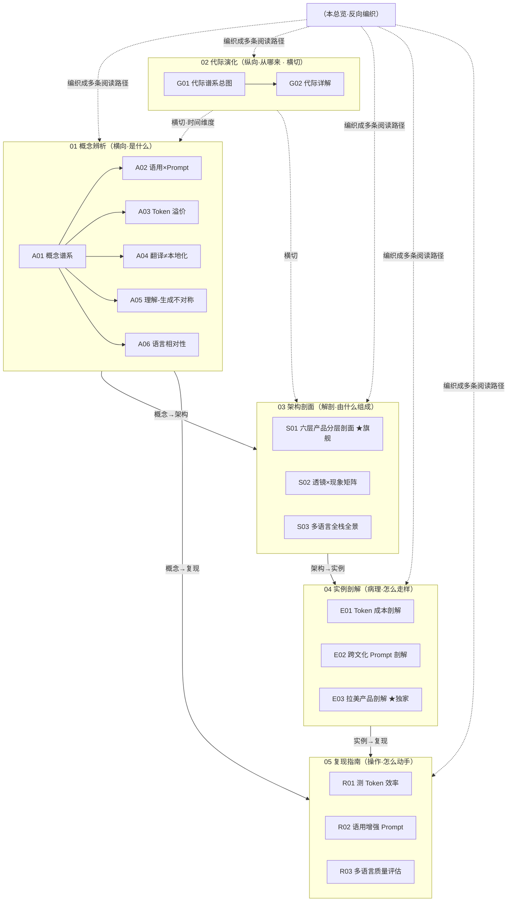

# 计算语言学系统化专题 · 总览（MOC）

> 一个从「计算语言学视角」重读 LLM 产品的知识立方：横向（是什么）＋纵向（从哪来）＋解剖（由什么组成）＋病理（现实怎么走样）＋操作（自己怎么动手）＋编织（怎么读）。17 个原子节点，靠双链织成一张网，读完能在面试桌 / 选型会 / 复现台 30 秒说清「为什么多语言不是『翻译一下』」。

---

## §0 序：撞过的那堵墙

工程视角进 AI 的人，脑子里的「语言」是一串被切碎的整数（token、loss、attention）。所以当产品要做多语言，第一反应几乎总是同一句：**"翻译一下不就行了"**——接个翻译 API，把界面字符串过一遍机翻，onboarding 加个语言切换。

Rick 在滴滴/99 拉美国际化的工作台上，反复撞见这堵墙的另一面：巴西 99 业务的 AI 功能单位成本"莫名"比国内高 1.5–2 倍，葡语客服文案"译得对、用户却不信任"，安全话术在西语上读着流畅却接不上当地人对"安全"的真实想象。三个看似无关的故障，源头是同一个被工程视角压扁的东西——语言不是一层皮，它有**形态、句法、语义、语用**四层结构，外加一根**英语中轴**的认知偏置，而 LLM 在每一层各踩了不同的坑。

本专题的反共识立场：**"把多语言当翻译"是国际化最体面、也最贵的一类幻觉。** token 溢价（最高 19×）发生在你的 prompt 进模型之前；理解-生成不对称让流利的错误最难被发现；文化适配的失败不在"译错了什么"，而在"假设了什么是普世的"。读完这套 9 节，你能 30 秒说清：多语言产品到底坏在哪一层、谁负责、怎么测——并把它从一个 roadmap 的 milestone，重新定义成一条贯穿成本/质量/合规的系统约束。

---

## §1 专题定位：为什么单独建这个专题号

按《系统化专题·出版级写作宪章（SHARED_CONTEXT v1）》§2 的四条选题判据，逐条论证：

| 判据 | 本专题是否满足 | 证据 |
|---|---|---|
| **① 中心性**（影响 ≥3 个 PM 决策链） | ✅ | 同时影响**成本**（token 溢价进 unit economics）、**选型**（fertility 成第三维）、**质量评估**（NLU/NLG 分层）、**合规**（多语言安全洼地）四个决策节点 |
| **② 误解深度**（业界定义互相矛盾） | ✅ | "多语言 = 翻译"是行业默认；"中文 prompt 省 40% token"是流传神话（Ren et al. 2026 实测反而更贵）；"支持 100+ 语言"≠"100+ 语言都划算/都安全" |
| **③ 速变性**（24 个月内格式塔切换） | ⚠️ 部分 | 词表从 32K（Llama-2）跳到 151,936（Qwen 2.5）/200K（GPT-4o），CJK 从"被惩罚"翻转为"被优待"（DeepSeek-V3 中文 0.65×）；但语言学根问题（形式≠意义）跨代未变 |
| **④ 学了就能用** | ✅ | R01/R02/R03 给出当天可跑的脚本与模板，直接产出选型/预算/评估三类落地物 |

满足①②④（≥2 条达标），第④条为真。**升高的抽象层**：单维节点 [c02 - Tokenization 与词表工程](/kb/基础知识库/c02-tokenization-与词表工程/) / [Tokenization](/kb/基础知识库/tokenization/) 讲的是"tokenization 这个零件是什么、怎么影响成本"；本专题升一层，把它放回**语言四层结构**（A 模块）、**代际谱系**（G 模块）、**六层产品栈**（S 模块），论证它如何向上穿透全栈、又如何是一个跨代未解的认识论裂缝的当代切片。它回答的不是"零件是什么"，而是"语言学坐标系如何成为诊断 LLM 产品的工具"。

---

## §2 模块全景

**矩阵含义**：依赖链是 `概念（A）→ 架构（S）→ 实例（E）→ 复现（R）`；代际演化（G）**横切**所有模块，提供"这不是线性进步史"的时间维度；本总览**反向编织**成 §5 的三条阅读路径。S 模块内部三剖面是同一架构的三视图——S01 是**分层剖面**（六层失效面 + 耦合拓扑，旗舰最厚）、S02 是**查表矩阵**（五透镜 × 四现象）、S03 是**全栈全景**（六层税如何相互放大 + owner 缺口）。

---

## §3 六模块逐一介绍

### 01 概念辨析（A01–A06）｜横向：语言有哪些层、LLM 在每层踩什么坑
收录语言四层结构与 LLM 产品的真实耦合。**何时读**：建立坐标系，想知道"这类问题归到哪一层"时。
- [A01 计算语言学与 LLM 概念谱系](/kb/专题-人文社科透镜/a01-计算语言学与-llm-概念谱系/) — 四层诊断坐标系 vs 工程技术栈；"翻译一下"思维的五个结构性陷阱。**入口节点。**
- [A02 语用学与 Prompt 设计](/kb/专题-人文社科透镜/a02-语用学与-prompt-设计/) — prompt 是言语行为不是命令；Grice 合作原则 + Austin-Searle 言语行为重构 prompt。
- [A03 多语言 Tokenization 效率差异](/kb/专题-人文社科透镜/a03-多语言-tokenization-效率差异/) — token 溢价 = 成本/质量隐性税；强接地数据（掸语 19×、HDI 负相关）。
- [A04 翻译≠本地化](/kb/专题-人文社科透镜/a04-翻译≠本地化/) — i18n/l10n 正交分解；翻译只是 l10n 最不重要的子任务。
- [A05 理解与生成的不对称](/kb/专题-人文社科透镜/a05-理解与生成的不对称/) — 形式能力 vs 功能能力；流利的生成≠深刻的理解，多语言上撕裂成产品风险。
- [A06 语言相对性与 LLM 跨语言偏差](/kb/专题-人文社科透镜/a06-语言相对性与-llm-跨语言偏差/) — Sapir-Whorf 弱版 × 英语中轴；非英语得到的是"英语智能的译制片"。

### 02 代际演化（G01–G02）｜纵向：从哪来、为何不是线性进步
**何时读**：被问"你怎么看 NLP 发展"，或要判断"当前范式哪些问题根本不在视野里"时。
- [G01 计算语言学与 NLP 代际谱系总图](/kb/专题-人文社科透镜/g01-计算语言学与-nlp-代际谱系总图/) — 四代范式（规则→统计→词向量→Transformer）的 Kuhn 不可通约 + 反线性回归主轴。
- [G02 NLP 代际演化详解](/kb/专题-人文社科透镜/g02-nlp-代际演化详解/) — 五代六栏病历卡，每代钉一个"皇帝新衣"反例（ELIZA 效应→BERT spurious cues→ELIZA 工业级重演）。

### 03 架构剖面（S01–S03）｜解剖：多语言产品由什么层组成、坏在层间耦合
**何时读**：要诊断"非英语体验差坏在哪一层"、做系统级选型时。
- [S01 多语言 LLM 产品分层剖面](/kb/专题-人文社科透镜/s01-多语言-llm-产品分层剖面/) ★**旗舰最厚** — 六层剖面（tokenization→语言检测→NLU→NLG→l10n→文化适配）+ 四个致命耦合。
- [S02 语言学视角 × LLM 现象对照矩阵](/kb/专题-人文社科透镜/s02-语言学视角-×-llm-现象对照矩阵/) — 五透镜 × 四现象查表，每格"重新描述 + 解锁动作"。
- [S03 多语言 AI 产品全景](/kb/专题-人文社科透镜/s03-多语言-ai-产品全景/) — 六层税如何相互放大（三条放大链）+ "没人端到端负责"的 owner 缺口。

### 04 实例剖解（E01–E03）｜病理：真实产品具体死在哪
**何时读**：想看抽象判断被压到可被拷问的真实病例上。
- [E01 多语言 Tokenization 成本剖解](/kb/专题-人文社科透镜/e01-多语言-tokenization-成本剖解/) — token 溢价怎么穿透到账单/窗口/训练/质量；CJK 逆溢价的反直觉案例。
- [E02 跨文化 Prompt 与本地化剖解](/kb/专题-人文社科透镜/e02-跨文化-prompt-与本地化剖解/) — 本地化是语用工程；敬语/语域/文化预设/token 溢价四道暗门。
- [E03 拉美多语言 AI 产品剖解](/kb/专题-人文社科透镜/e03-拉美多语言-ai-产品剖解/) ★**独家** — 以 Rick 拉美 fieldwork 为锚，剖英语中心设计在五层上误判真实复杂度。

### 05 复现指南（R01–R03）｜操作：当天就能跑
**何时读**：要把判断变成可证伪的脚本/模板，产出选型/预算/评估落地物时。
- [R01 测多语言 Tokenization 效率](/kb/专题-人文社科透镜/r01-测多语言-tokenization-效率/) — 三层脚本骨架（单句→平行批量+计费→双指标诊断），产出能进 BP 的 premium 矩阵。
- [R02 语用学增强 Prompt 设计](/kb/专题-人文社科透镜/r02-语用学增强-prompt-设计/) — Grice 四准则→四杠杆 + PRAGMA 六槽模板 + 改写实验（巴西 99 现金纠纷场景）。
- [R03 多语言质量评估](/kb/专题-人文社科透镜/r03-多语言质量评估/) — 不靠英语 benchmark 翻译的五层失效评估（tokenization/理解/生成/文化/安全）。

### 06 阅读指南（本总览 + README）｜编织：怎么读
本 `_总览` 给 MOC 全景与三清单自评；`README` 给三路径细表 + ≥10 题自测 + 反方对话训练。

---

## §4 与现有节点关系（升级对照表）

本专题与既有 c/m/p/概念卡节点的关系是**升级对照，不复述事实基础**。

| 旧节点 | 本专题哪些节点做了升级 | 升级类型 |
|---|---|---|
| [c02 - Tokenization 与词表工程](/kb/基础知识库/c02-tokenization-与词表工程/) | A01（从形态学侧解释"为什么非英语被切碎"）、A03（升为"语言间不平等定价分析"，补 19× 掸语/HDI 负相关）、S01（放回六层栈论证向上穿透）、E01（放进真实计费做病理切片）、R01（操作化为可跑脚本）、G01/G02（定位为"代际偷偷保留的语言学先验"） | 深化 / 升维 / 操作化 / 纠偏 |
| [Tokenization](/kb/基础知识库/tokenization/)（概念卡） | A03/E01/R01 把"AI PM 隐藏陷阱第 4 条·多语言成本核算"回填为葡语/西语/低资源语言实测数据 | 补缺 |
| [幻觉](/kb/基础知识库/幻觉/) | A02（重定位为 Grice Quality 准则违反）、A05（重归因为"功能能力赤字被流利度掩盖"）、G01/G02（重诊断为第四/五代结构性反常，接回 ELIZA 效应六十年谱系） | 纠偏 / 重定位 |
| [m209 - 推理成本控制手册](/kb/工程化与落地架构/m209-推理成本控制手册/) | A03/E01/S01/S03 补入"成本的语言维度"——总 token 量本身是语言相关的隐变量；R01 补语言敏感系数 | 对话 / 补缺 |
| [Embedding](/kb/基础知识库/embedding/) | G01/G02 定位为"第三代分布语义学的几何化产物"，给代际史坐标 | 深化 |
| 范式 | G01 以 Kuhn 范式更替为方法论根基 | 应用 |

> [!note] 跨专题升级对照接口
> 本专题多处预留了升级对照接口：A03/A04/E03/S01/S03 的 token 溢价 ↔ [STS 与 AI 社会嵌入](/kb/专题-人文社科透镜/_sts-系统化专题-总览/) 的「AI 在中美拉美 Imaginaries 差异」、A02/R02 的语用 ↔ [上下文工程](/kb/专题-工程与成本/_上下文工程系统化专题-总览/) 的上下文衰减、E01/A03 的多语言成本 ↔ [成本工程](/kb/专题-工程与成本/_成本工程系统化专题-总览/) 的 token 计费优化。三专题均已入库，可由总览直接进入对照阅读。

---

## §5 三条阅读起点

按身份模式给三条路径（详表见 `README`）：

1. **求职速通（面试桌，~40 分钟）**：[A01 计算语言学与 LLM 概念谱系](/kb/专题-人文社科透镜/a01-计算语言学与-llm-概念谱系/) → [S01 多语言 LLM 产品分层剖面](/kb/专题-人文社科透镜/s01-多语言-llm-产品分层剖面/) → [E03 拉美多语言 AI 产品剖解](/kb/专题-人文社科透镜/e03-拉美多语言-ai-产品剖解/)。拿到"四层坐标系 + 六层剖面 + 一手拉美案例"，足够在面试里把"翻译一下"派候选人甩开一个抽象层。
2. **决策链（选型/复现，~90 分钟）**：[A03 多语言 Tokenization 效率差异](/kb/专题-人文社科透镜/a03-多语言-tokenization-效率差异/) → [E01 多语言 Tokenization 成本剖解](/kb/专题-人文社科透镜/e01-多语言-tokenization-成本剖解/) → [R01 测多语言 Tokenization 效率](/kb/专题-人文社科透镜/r01-测多语言-tokenization-效率/) → [R03 多语言质量评估](/kb/专题-人文社科透镜/r03-多语言质量评估/)。从机制到病例到可跑脚本，产出 premium 矩阵 + 五层评估清单。
3. **紧迫度（上线前止血，~30 分钟）**：[S03 多语言 AI 产品全景](/kb/专题-人文社科透镜/s03-多语言-ai-产品全景/)（六层税 + owner 缺口）→ [R03 多语言质量评估](/kb/专题-人文社科透镜/r03-多语言质量评估/) §4 安全洼地 → [E03 拉美多语言 AI 产品剖解](/kb/专题-人文社科透镜/e03-拉美多语言-ai-产品剖解/) §5 合规/支付。先堵"安全 gap >10pp 阻断上线"和"文化事故"两个最大风险。

---

## §6 跨域思想资源调度

宪章 §6 硬约束：**不留空 invocation**——每个资源都在对应节点的"跨域呼应"段具体展开，改变了一个技术判断。

| 跨域资源 | 调度位置 | 在该节点的具体作用（非装饰） |
|---|---|---|
| **Grice 合作原则**（会话含义） | A02 / R02 / S02 / E02 / R03 | 把幻觉/啰嗦/跑题统一为"会话准则违规"；落成 PRAGMA 四杠杆 checklist；Kim et al. 2023 证明注入 CoT 可超人类均值 |
| **Austin–Searle 言语行为** | A02 / R02 / E03 | prompt = Directive/Representative，错配类型→质量断崖；E03 用 illocutionary force 解释拉美语域错位的取效失败 |
| **Sapir-Whorf 弱版**（语言相对性） | A06 / S01 / S02 | 预言英语中轴是认知层（非数据量）问题；颜色/空间证据硬、时间/性别复制争议——本专题只赌证据最硬的部分 |
| **翻译学**（Venuti 归化/异化、Vermeer Skopos） | A04 | LLM 默认极致归化抹平品牌棱角；Skopos 理论 = "翻译≠本地化"的理论根基（目的达成 > 忠实原文） |
| **Kuhn 范式 / 不可通约** | G01 | 把"该不该懂语言学"从"复古 vs 进步"站队，变成"用什么坐标系定位失效"的工具问题 |
| **维特根斯坦"意义即用法"** | G01 / R02 | 解释 LLM 能流利谈论从未"经验"过的东西；论证"不存在脱离语境的最优 prompt 模板" |
| **Polanyi 默会知识** | E03 | 语域选择是默会知识，无法穷举进 prompt——故拉美本地化关键投入是把在地母语者引入验收环路 |
| **STS / 技术不中立**（Winner "artifacts have politics"） | A03 / E01 / S03 / R01 | tokenizer 把语言不平等编码进基础设施定价；测量本身升格为"算法公平性审计" |
| **人类学 / 民族志**（emic/etic、Geertz 深描） | A01 / E03 / R03 多处 | 文化适配判分不能远程外包，必须在地母语者——和田野不能靠二手转述是同一认识论 |

**破 echo chamber·Rick 未读的对手框架**（宪章要求 ≥2 个，本专题覆盖多个）：
- **Sperber & Wilson 关联理论**（A02/E02/R02/S02/R03）— 逼问"四准则工程化"是否模仿了错误的认知模型。
- **Chomsky 普遍语法 / Fodor 心智语言**（A06）— 逼问"英语内部表示"是否只是 logit lens 探针的解码偏差。
- **Phillipson 语言帝国主义 / Pennycook 全球英语批判**（E03）— 逼问"优化拉美体验"是否默认了英语世界定义的"好产品"。
- **Peyrichou 形式语言生成-识别不对称**（A05/S01）— 从计算复杂度而非语用学解释 NLU/NLG 不对称。
- **Gary Marcus 神经-符号 / LeCun JEPA**（G01）、**多语言诅咒派 / 英语枢纽乐观派**（S03）、**Phil Agre 批判性技术实践**（R01）。

---

## §7 验收档案

### 评议流程
本专题走宪章 §10 工程化流水线：`并行起草（17 节点分模块）→ 批判性同行评议（六维 + 事实接地，逐节点 issue 单）→ 修订（每节追加修订日志）→ 独立 grounding 校验 pass → 综合（本总览 + README + 跨节点编织 + SABCD 自评）`。所有节点修订日志显示已完成 R0/R1 起草 + grounding pass，多个近知识边界的 2026 预印本（arXiv:2604.14210 Ren et al.、arXiv:2601.13328 Churchill & Skiena、arXiv:2603.10139 Peyrichou）经 WebSearch/WebFetch 复核确证。

### SABCD 六维自评（宪章 §1 验收线）

| 维度 | 含义 | 出版线 | 本专题自评 | 依据 |
|---|---|---|---|---|
| **S 结构** | 六模块互补、依赖清晰、入口可导航 | ≥8 | **8.2** | 17 节点严格落 6 模块；§2 矩阵 + §5 三路径 + 三剖面三视图；扣分项：S01/S02/S03 六层划分在不同节点略有出入（S01 含"语言检测层"，S03 含"嵌入层"），分辨率统一度可更高 |
| **A 判断密度** | 反共识、可证伪、带数字 | ≥8 | **8.0** | 每节有判断主轴 + 四件套；硬数字密集（19×掸语、92.65%英语、0.65×中文逆溢价、ASR gap）；扣分项：部分单源数据（TechFlow 2026 中文实测、DeepSeek 0.65×）依赖单一来源 |
| **B 边界含量** | 显式标注失效场景与赌注 | ≥7.5 | **8.0** | 每节均有 failure scenario + 显式赌注（如"关联理论解释更优但 Gricean 更可施工"）；多处标〔示意〕〔待核实〕 |
| **C 认识论自觉** | 区分事实/推测/赌注、引用可追溯 | ≥8 | **8.0** | 区分"行为表现"vs"真理解"（R03）；arXiv ID 普遍可追溯；2026-06-12 修复一处转引误植：arXiv:2510.10677 经 WebFetch 核实实为**防御**工作（非越狱攻击），攻击证据已统一改引 Yong et al. arXiv:2310.02446；残留扣分项：Phillipson/Pennycook 具体著作年份仍标〔待核实〕 |
| **D 可演进性** | 双链密度、修订日志、改稿档案 | ≥8.5 | **7.8** | 双链密度高、修订日志齐全；扣分项：**节点内部分前向引用用了变体名**（如 A04 引"A05 理解 vs 生成"、A05 引"A06 翻译≠本地化"、G01 自称"G01 NLP 代际谱系总图"），与真实 filename 不一致，入库前需统一校正为本总览所用 basename，否则部分专题内链会断 |
| **E 对手拷问能力** | 对业界反方给出带证据的回应 | ≥7 | **8.2** | 每节 2–3 个对手框架"接受+边界"；≥4 个 Rick 未读框架破 echo chamber；进步主义叙事在 G01/G02 每代加反例修正 |

**综合自评 ≈ 8.0 / 10**（诚实综合分 ≥7.8 达标）。一票否决项自查：①编造引用——0 处（grounding pass 已过，疑似项均降级标注）；②空跨域 invocation——0 处（§6 每个资源均在对应节点具体展开）；③无边界承担——不成立（每节有 failure scenario + 赌注）；④孤岛节点——不成立（与 c02/Tokenization/幻觉/m209 均有显式升级对照）。

### 对手立场接入清单（业界反方，点名真实立场，≥8 处）
1. Arnett et al.（NeurIPS 2025）"不公平来自词表设计非语言本身"（A03/E01/R01/S02）
2. Bender & Koller（ACL 2020）"纯形式训练原则上无法习得意义"（A01/A05/G02/S02）
3. LeCun "自回归 LLM 是死路，需世界模型 JEPA"（G01）
4. Gary Marcus "神经-符号混合才是出路"（G01）
5. Sperber & Wilson 关联理论"四准则冗余"（A02/E02/R02/S02/R03）
6. 涌现/scaling 派"理解就是足够好的预测"（A01/A05/G02/S03）
7. 增长团队"英语优先 MVP、快速复制"（E03/A04/S01/S03）
8. 技术乐观派"基础模型变好，溢价/语域问题自然消失"（E03/S03）
9. 翻译 benchmark 务实派"翻译+自动指标是务实工程权衡"（R03）
10. CJK 逻辑文字派"无空格边界天然增加分词难度"（A03/E01）

### Failure scenario 清单（≥5 处）
1. 六层剖面在**端到端纯生成式架构**下退化为思维工具而非架构组件（S01）
2. "全栈系统约束"论在**纯工具型/超早期 PMF 前/单一高资源语言**市场失效（S03/E03/A04）
3. token premium↔质量因果链有争议——省 token ≠ 省钱、≠ 质量好（A03/E01/R01）
4. 语言相对性若颜色/空间研究也被推翻，A06 类比力度需下调（A06）
5. "英语内部表示"可能是 logit lens 探针的解码伪影（A06）
6. 语用工程在**纯代码/数学 prompt、高资源近邻语言对**上收益趋零（E02/R02）

### Confirmation-bias 砍除清单（≥5 处）
1. "中文比英语省 token（DeepSeek 0.65×）"砍除——Ren et al. 2026 实测多模型反而更贵（A03/E01/R01/S03）
2. "统计范式是过渡期笨办法"砍除——next-token prediction 是 LLM 直系祖先（G01）
3. "LLM 直译一律翻车"砍除——高资源信息型文本上 WMT24/Lokalise 显示鸿沟已小（A04）
4. "用 Grice 就能解决语用"砍除——补入跨文化语用学反例（A01）
5. "拉美问题都归因于语言学复杂度"砍除——定价/网络效应/监管才是更多真因（E03）
6. "非英语全面吃亏"砍除——分词层是"语言相关"非"非英语必输"（S03）

---

## §8 关联节点（双链密度 ≥20）

### 本专题 17 节点（按模块）
**01 概念辨析**：[A01 计算语言学与 LLM 概念谱系](/kb/专题-人文社科透镜/a01-计算语言学与-llm-概念谱系/) · [A02 语用学与 Prompt 设计](/kb/专题-人文社科透镜/a02-语用学与-prompt-设计/) · [A03 多语言 Tokenization 效率差异](/kb/专题-人文社科透镜/a03-多语言-tokenization-效率差异/) · [A04 翻译≠本地化](/kb/专题-人文社科透镜/a04-翻译≠本地化/) · [A05 理解与生成的不对称](/kb/专题-人文社科透镜/a05-理解与生成的不对称/) · [A06 语言相对性与 LLM 跨语言偏差](/kb/专题-人文社科透镜/a06-语言相对性与-llm-跨语言偏差/)
**02 代际演化**：[G01 计算语言学与 NLP 代际谱系总图](/kb/专题-人文社科透镜/g01-计算语言学与-nlp-代际谱系总图/) · [G02 NLP 代际演化详解](/kb/专题-人文社科透镜/g02-nlp-代际演化详解/)
**03 架构剖面**：[S01 多语言 LLM 产品分层剖面](/kb/专题-人文社科透镜/s01-多语言-llm-产品分层剖面/) · [S02 语言学视角 × LLM 现象对照矩阵](/kb/专题-人文社科透镜/s02-语言学视角-×-llm-现象对照矩阵/) · [S03 多语言 AI 产品全景](/kb/专题-人文社科透镜/s03-多语言-ai-产品全景/)
**04 实例剖解**：[E01 多语言 Tokenization 成本剖解](/kb/专题-人文社科透镜/e01-多语言-tokenization-成本剖解/) · [E02 跨文化 Prompt 与本地化剖解](/kb/专题-人文社科透镜/e02-跨文化-prompt-与本地化剖解/) · [E03 拉美多语言 AI 产品剖解](/kb/专题-人文社科透镜/e03-拉美多语言-ai-产品剖解/)
**05 复现指南**：[R01 测多语言 Tokenization 效率](/kb/专题-人文社科透镜/r01-测多语言-tokenization-效率/) · [R02 语用学增强 Prompt 设计](/kb/专题-人文社科透镜/r02-语用学增强-prompt-设计/) · [R03 多语言质量评估](/kb/专题-人文社科透镜/r03-多语言质量评估/)

### 升级对照的既有 AI 节点
[c02 - Tokenization 与词表工程](/kb/基础知识库/c02-tokenization-与词表工程/) · [Tokenization](/kb/基础知识库/tokenization/) · [幻觉](/kb/基础知识库/幻觉/) · [m209 - 推理成本控制手册](/kb/工程化与落地架构/m209-推理成本控制手册/) · [Embedding](/kb/基础知识库/embedding/) · 范式 · [Constitutional AI](/kb/基础知识库/constitutional-ai/) · [Claude](/kb/ai-公司与产品/claude/) · [Gemini](/kb/ai-公司与产品/gemini/) · [ChatGPT](/kb/ai-公司与产品/chatgpt/)

### 跨域 / Rick 不公平资产节点
人类学 · 民族志 · 0117社会学 · 拉美知识图 · CPF实名验证 · PAX-Premium实名徽章 · PDP现金支付纠纷治理 · 纠纷治理从裁判到管家 · 乘客信息透明化 · 墨西哥 · 阿根廷 · 哥伦比亚 · 秘鲁 · 新自由主义如何摧毁全球南方 · 中等收入陷阱 · 如何做田野笔记

### 回链总图
[AI PM 知识图谱·总索引](/kb/ai-pm-知识图谱/ai-pm-知识图谱-总索引/)

---

