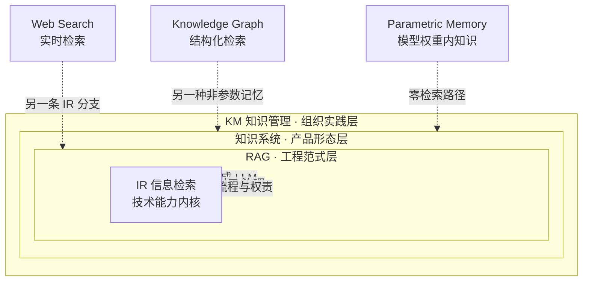

当一个 PM 把"做个知识产品"翻译成"接个 RAG"时，他到底漏掉了什么？这是本节要回答的问题。本节的视角是**概念谱系学**——把 IR（信息检索）、RAG（检索增强生成）、知识系统（Knowledge System）、KM（知识管理）四个被频繁混用的词放在同一张坐标系里，辨清它们各自的抽象层、各自要解决的问题、以及它们之间不是"新替代旧"而是"层层嵌套"的关系。判断主轴只有一句：**把知识产品等同于"接个 RAG"，等于把一栋楼等同于它的承重墙——技术是必要的，但时效、引用、治理这三件事，没有一件是 RAG 这个技术管道天然交付的。**

## §0 为什么用"概念谱系"而不是"技术栈分层"

读到这里，大多数 AI PM 脑里默认的框架是技术栈分层：底层 Embedding、中层向量库、上层 LLM 生成，RAG 把它们串起来。这个框架不是错，是**站错了抽象层**。技术栈分层回答的是"系统由什么零件组成"（这是本专题 `[S01 知识系统分层剖面](/kb/专题-人文社科透镜/s01-知识系统分层剖面/)` 的活），而本节要回答的是"这些词分别指向哪一类问题，PM 在哪一层做决策"。

谱系学框架的好处是它强制你做**层级辨析**而非平铺罗列。借维特根斯坦的"家族相似"（family resemblance）：IR、RAG、知识系统、KM 没有一个共同的本质特征把它们绑在一起，它们靠重叠的相似性串成一个家族——RAG 像 IR（都做检索）又不像（IR 不生成），知识系统像 KM（都管知识资产）又不像（KM 含大量人和流程，知识系统偏技术实现）。混用之所以危险，是因为说话人各自抓住了"家族里相似的那一面"，却以为在谈同一个东西。一个把 KM 说成 RAG 的高管和一个把 RAG 说成知识系统的工程师，开会时每句话都对，合起来却造出一个漏掉治理的产品。

所以本节不画技术栈，画的是**问题层级的同心圆**：IR 是最内核的技术能力，RAG 是 IR 接上生成的一种工程范式，知识系统是"以知识为核心交付物"的产品形态，KM 是把知识系统嵌进组织流程与权责的管理实践。越往外，技术含量越低，人/流程/治理含量越高，而 PM 的决策权重也越大。

## §1 四个词的精确定位

先把四个词钉死，避免后文滑变。

| 概念 | 抽象层 | 一句话定义 | 核心交付物 | 起源/标志 |
|---|---|---|---|---|
| **IR（信息检索）** | 技术能力 | 从文档集合中找出与查询相关的条目并排序 | 一个排序后的结果列表 | 1950s–60s；Salton 的 SMART 系统、向量空间模型；TF-IDF、BM25 |
| **RAG（检索增强生成）** | 工程范式 | 把检索到的文档喂给生成模型，让回答"接地"于外部知识 | 一段带（理应带）来源的生成文本 | Lewis et al., *Retrieval-Augmented Generation for Knowledge-Intensive NLP Tasks*, NeurIPS 2020（arXiv:2005.11401，已核实） |
| **知识系统** | 产品形态 | 以"提供可信、可溯源、可维护的知识"为核心价值的产品 | 一个持续可用、可治理的知识服务 | 谱系可追至 1970s–80s 专家系统（MYCIN/DENDRAL），当代形态是企业知识平台 |
| **KM（知识管理）** | 管理实践 | 组织层面对知识的创造、捕获、共享、复用的系统性治理 | 组织的知识资产 + 流程 + 权责 | 1990s 兴起；Nonaka & Takeuchi《知识创造的企业》（1995）、显性/隐性知识之辨 |

关键辨析点有三：

**第一，IR 不生成，RAG 才生成。** IR 的"输出"是给人看的链接列表（Google 的十个蓝链就是经典 IR 产品），相关性判断后由人来读、来综合。RAG 把"人来综合"这一步交给 LLM，于是引入了一个 IR 从未有过的失败模式——**生成层的幻觉**。这一点是本专题与 `[c13 - 幻觉的不可消除性](/kb/基础知识库/c13-幻觉的不可消除性/)` 的咬合处：IR 时代检索错了，用户至少看得见原文自己判断；RAG 时代检索对了但生成层仍可能编造来源或曲解原文（见本专题 `[引用与归属](/kb/专题-人文社科透镜/a03-citation-与-attribution-产品设计/)`）。检索接地不等于回答可信。

**第二，RAG 是技术，知识系统是产品。** 这是本节判断主轴的核心，也是与 `[c09 - RAG 架构](/kb/基础知识库/c09-rag-架构/)` 的分工线。c09 讲 RAG 作为非参数化记忆管线"怎么搭"——Chunking、Embedding、Reranker、混合检索；本节讲的是"搭好了 RAG，离一个知识产品还差什么"。差的是三件 RAG 管道不天然交付的事：知识**时效**（库里的事实会过期，RAG 不会自动告诉你哪条过期了——见本专题 `[知识时效性](/kb/专题-人文社科透镜/a05-知识时效性与更新/)`）、**引用**（生成文本的每句话能不能落到具体来源句子上——RAG 的"附来源"和"逐句可溯源"是两个工程难度量级）、**治理**（谁能看哪些知识、出错谁负责、合规怎么审计——见本专题 `[企业知识治理](/kb/专题-人文社科透镜/a06-企业知识管理的-ai-化/)`）。

**第三，知识系统是技术对象，KM 是组织实践。** 一个公司可以买一套知识系统（如 Glean），但如果没有人维护内容、没有权责界定、没有更新 SLA，这套系统三个月后就退化成又一个"自信地答错"的知识孤岛。KM 强调的恰恰是 Nonaka 意义上的隐性知识——大量组织知识活在人的脑子和非正式对话里，根本没被写成文档，因此 RAG 检索不到。**这是"接个 RAG 就以为做了知识管理"最深的盲区：你的向量库里只有显性知识，而组织里最值钱的往往是隐性的。**

## §2 谱系图：嵌套而非替代

这张图要传达的是：**RAG 不是 IR 的替代品，是 IR 的一个应用分支；知识系统不是 RAG 的升级版，是包含 RAG 的更大容器。** Web Search（实时检索）、Knowledge Graph（结构化检索）、Parametric Memory（参数记忆，知识压缩进权重直接调用）都是知识系统可选的"知识来源去向"，RAG 只是其中之一（这一选择问题正是 `[检索去向决策](/kb/专题-人文社科透镜/a02-检索去向决策-search-kg-parametric-rag/)` 的主题）。

值得点名一个常见的**进步主义误读**：业界叙事常把这条谱系写成"IR → RAG → Agentic → 知识系统"的线性进化，仿佛后者全面碾压前者。事实相反：Glean 自己的工程实践显示，**60–70% 的企业查询用传统词法检索（BM25 + 时效性排序）就够了**（来源：ZenML LLMOps Database 对 Glean 的案例分析，2023）。把每个查询都塞进 RAG 生成管线，不仅增加成本和延迟，还引入了本可避免的幻觉风险。最老的那层 IR，在很多场景里仍是最优解——这是后文 `[检索去向决策](/kb/专题-人文社科透镜/a02-检索去向决策-search-kg-parametric-rag/)` 的伏笔，也是对"RAG is all you need"叙事的第一记反例。

## §3 为什么"接个 RAG"漏掉的恰恰是产品的命门

把判断主轴展开成可操作的诊断。一个 PM 说"我们做个知识产品，接个 RAG 就行"，他默认 RAG 这个技术管道会顺带解决知识产品的所有问题。逐项拆开看漏在哪：

- **漏掉时效**：RAG 检索的是索引快照，索引是某个时间点的冻结切片。库里同时存着 2023 年的旧政策和 2026 年的新政策时，RAG 不保证返回新的——HoH 基准（Ouyang et al., arXiv:2503.04800，2025，经 WebFetch 核实）证明过时信息会**主动干扰**模型识别正确答案，即使正确答案就在库里。RAG 管道默认不带时间轴感知。
- **漏掉引用**：RAG 的标准输出是"答案 + 一串来源链接"，但"附了来源"和"每句话都落到具体来源句子"是两个量级的工程难度。Liu et al.（EMNLP 2023，arXiv:2304.09848）实测主流生成式搜索引擎**仅 51.5% 的生成句子被引用完全支撑**。"接个 RAG"默认你拿到了可信引用，实际上你拿到的可能是带着可信外观的不可信归属。
- **漏掉治理**：RAG 的天真假设是"所有检索内容对所有用户可见"，这在企业里直接成立不了——向量层会变成**权限提升向量**（privilege escalation vector），低权限用户可通过查询触发对无权访问文档的检索（来源：tianpan.co 企业 RAG 权限分析，2026-05）。治理不是 RAG 的可选插件，是企业知识产品的准入门槛。

四件套诊断如下：

> **症状**：知识产品上线后用户反馈"答案看起来对但其实过期了""引用点进去对不上""我看到了不该看的文件"。
> **为什么会错**：PM 把"知识产品"的问题边界等同于"RAG"的技术边界，误以为技术管道通了产品就成了。
> **正确做法**：在 RAG 之上显式设计时效层（更新 SLA + 时序排序）、引用层（逐句归属 + 来源核验）、治理层（查询时 ACL 过滤 + 审计日志）三个产品组件，把它们当一等公民而非 RAG 的副产品。
> **真实反例**：2026 年 Lancet 研究（StatNews 报道，2026-05-07）审计 250 万篇 PubMed 论文，发现 AI 生成的幻觉引用在 2026 年初已达每 277 篇含 1 篇（2023 年是 1/2828，12 倍增长）。学术出版这个"知识产品"的引用治理一旦缺位，污染的是整个知识基础设施——这正是"有 RAG/有生成、但无引用治理"的代价。

## §4 产品 PM 视角补盲

跳出工程视角，补三个容易看走眼的点。

**用户心理模型："答案"比"链接"承诺更重。** IR 给链接，用户知道还得自己判断；知识系统给答案，用户的默认信任度陡升。斯坦福 HAI 评价生成式搜索引擎具有"虚假可信度的表象（facade of trustworthiness）"。这意味着知识产品的引用/时效缺陷，伤害比搜索引擎大——用户更不设防。产品形态的"答案化"是一种隐性的信任承诺，PM 必须用引用与不确定性外显（见 `[c13 - 幻觉的不可消除性](/kb/基础知识库/c13-幻觉的不可消除性/)` 的置信度 UI 设计）来兑现这份承诺。

**商业模式：知识产品的单位经济与 IR 不同。** 传统搜索引擎的边际查询成本极低；RAG 知识产品每次查询都要跑 Embedding + 检索 + LLM 生成，成本结构截然不同。`[Perplexity](/kb/ai-公司与产品/perplexity/)` 的"产品形态领先 + 单位经济亏损"张力就是活样本。把知识产品当 RAG 做，还会顺带漏掉这条商业账。

**合规边界：知识产品自带数据治理义务。** EU AI Act（2024 年生效，义务分阶段延伸至 2026–2027）要求对 AI 用例做风险分类和技术文档备案。一个面向监管行业的知识产品，可审计性和数据可删除性不是加分项是准入项——这也是为什么生产部署普遍倾向非参数记忆（RAG/KG）而非纯参数记忆：不是技术性能，是**合规要求数据可审计、可删除**（来源：Wang et al., *Knowledge Mechanisms in Large Language Models: A Survey and Perspective*, EMNLP 2024 Findings，arXiv:2407.15017，已核实）。

## §5 对手框架回应

**对手立场一（RAGFlow 等工程派）："RAG 正从一个模式演变为 Context Engine，它本就在吸收时效、治理、多源管理。"** 接受——这个判断是对的，2025 年 RAG 的演化方向确实是从"知识库工具"长成"统一管理领域知识/工具描述/对话历史的上下文引擎"（来源：RAGFlow Blog, From RAG to Context: 2025 Year-End Review，经 WebFetch 核实）。**但坚持本节的边界**：RAG 在工程层吸收这些能力，恰恰证明了它们不是 RAG 原生自带的，而是被后加进去的产品需求。一个 PM 说"接个 RAG"时脑里的 RAG 是 Naive RAG（固定 chunk 检索→生成），不是这个还在演化中、尚未标准化的 Context Engine。概念辨析的价值正在于：当工程界自己都在把 RAG 重新定义成更大的东西时，PM 更需要分清自己说的是哪个 RAG。

**对手立场二（长上下文派 / Karpathy 风格的"RAG is dead"叙事）："1M token 上下文窗口直接塞入全量文档，绕过检索误差，知识产品不需要 RAG 这套管道。"** 接受——长上下文确实在某些场景（单文档深度问答）让检索显得多余。**但坚持边界**：全文塞入导致"信息洪水（information flooding）"效应和"迷失于中间（lost-in-the-middle）"问题，且成本随上下文长度二次增长，对高频查询是禁止性的（这一成本论证已在 `[c09 - RAG 架构](/kb/基础知识库/c09-rag-架构/)` 展开，本节不复述）。RAGFlow 2025 评述直接称其为"暴力策略"。更关键的是：**长上下文替代的只是 RAG 的"检索"环节，替代不了知识产品的时效、引用、治理三层——你把全公司文档塞进上下文，依然不知道哪条过期、哪句出自哪、谁有权看。** 这恰好反证了本节主轴：知识产品 ≠ RAG，所以"杀死 RAG"也杀不死知识产品的真问题。

**Rick 未读的对手框架引入（破 echo chamber）：Michael Polanyi 的隐性知识论 + Fritz Machlup 的知识产业经济学。** Polanyi（《个人知识》1958、《隐性维度》1966）的命题"我们知道的多于我们能说出的（we know more than we can tell）"对本节是致命一问：**任何基于文档检索的知识系统，先天只能触及被显性化的那部分知识**，而组织里最值钱的判断、手感、关系网络是隐性的，永远进不了向量库。这逼问本专题一个盲点：我们整个谱系（IR/RAG/KS/KM）都建立在"知识 = 可检索的显性文档"这个假设上，而 Polanyi 提醒这个假设系统性地低估了知识的体量。Machlup（《美国知识的生产与分配》1962，最早系统测量"知识产业"GDP 占比的经济学家）则从另一端提醒：知识作为产品有其独特的生产/分配经济学，不能套用普通信息商品的逻辑——这为本专题 `[企业知识治理](/kb/专题-人文社科透镜/a06-企业知识管理的-ai-化/)` 的商业模式分析埋下经济学锚点。

## §6 跨域呼应

> [!note] 维特根斯坦的"家族相似"与术语反治理
> 本节调度维特根斯坦《哲学研究》§65–67 的"家族相似（family resemblance）"概念，不是装饰。它具体改变了一个 PM 决策判断：**当四个词靠重叠相似性而非共同本质串成家族时，要求开会各方"统一定义"是徒劳的，正确做法是显式标注每次使用时站在哪个抽象层。** 这把"概念辨析"从一次性的术语对齐，变成一种持续的会议纪律——每当有人说"知识产品/RAG/知识库"，PM 的反射动作应是追问"你指的是技术能力、工程范式、产品形态还是组织实践？"。维特根斯坦的洞见是：意义在使用中（meaning is use），所以治理术语滑变的办法不是查字典，是盯使用语境。这与 范式（Kuhn）的不可通约性互补——Kuhn 解释为什么范式切换时旧词被赋予新义，维特根斯坦解释为什么同一时刻不同人用同一词指不同物。两者合起来，构成本专题对"知识产品"这个滑变最快的词的双重防线。

## §7 PM 决策启示

- **面试怎么用**：当面试官问"你怎么做一个企业知识助手"，不要张口就是 RAG 架构。先做谱系定位——"这是个知识系统级产品，RAG 是它的检索内核之一，但我会先界定时效、引用、治理三个产品组件，再谈用 RAG 还是 KG 还是混合"。30 秒展示你站在产品层而非管道层。
- **选型怎么用**：评估供应商（Glean / M365 Copilot / 自建）时，别只比"支持不支持 RAG"，比的是"时效更新机制、引用粒度、权限模型"三件 RAG 不天然交付的事。Glean 的差异化恰恰是查询时 ACL 过滤和每客户独立 Embedding，而非"有 RAG"。
- **复现怎么用**：自己搭 demo 时，在 RAG 管道（参照 `[c09 - RAG 架构](/kb/基础知识库/c09-rag-架构/)` 与 `[m205 - RAG 生产环境：索引运维与评估体系](/kb/工程化与落地架构/m205-rag-生产环境-索引运维与评估体系/)`）之上，显式加三个最小组件——一个时间戳过滤器、一个逐句来源标注、一个用户角色过滤——哪怕粗糙，也比"纯 RAG demo"更接近真实知识产品。

## §8 与已有节点的关系

- 对照 `[c09 - RAG 架构](/kb/基础知识库/c09-rag-架构/)`：**做的是"产品 vs 技术"的抽象层升高（升级对照）**。c09 把 RAG 讲透为非参数化记忆的工程管线，本节不复述 Chunking/Reranker/混合检索任何技术细节，而是把 RAG 重新定位为"知识系统这个产品形态的检索内核之一"，回答 c09 不回答的问题：搭好 RAG 之后，离知识产品还差时效、引用、治理三层。这是补缺，不是纠偏——c09 没错，只是站在工程层。
- 对照 `[c13 - 幻觉的不可消除性](/kb/基础知识库/c13-幻觉的不可消除性/)`：本节借用其"检索接地不消除幻觉"的结论，定位 IR 与 RAG 的失败模式分野（IR 错了用户看得见，RAG 错了带可信外观）。是对话与深化。
- 对照 `[m205 - RAG 生产环境：索引运维与评估体系](/kb/工程化与落地架构/m205-rag-生产环境-索引运维与评估体系/)`：m205 的"空结果率→知识库扩充优先级"运维逻辑，在本专题视角下被重读为"知识产品内容运营飞轮"。本节只埋链，不复述其评估指标。

## §9 关联节点

**核心（必读）**
- `[c09 - RAG 架构](/kb/基础知识库/c09-rag-架构/)` — RAG 作为技术内核的工程解构（本节的"技术 vs 产品"对照锚点）
- `[c13 - 幻觉的不可消除性](/kb/基础知识库/c13-幻觉的不可消除性/)` — 检索接地为何不消除幻觉
- `[A02 检索去向决策·search KG parametric RAG](/kb/专题-人文社科透镜/a02-检索去向决策-search-kg-parametric-rag/)` — Search/KG/Parametric/RAG 何时用哪个（本节谱系的决策落地）
- `[A03 Citation 与 Attribution 产品设计](/kb/专题-人文社科透镜/a03-citation-与-attribution-产品设计/)` — 引用层为何不是 RAG 副产品
- `[A05 知识时效性与更新](/kb/专题-人文社科透镜/a05-知识时效性与更新/)` — 时效层为何 RAG 不天然交付
- `[A06 企业知识管理的 AI 化](/kb/专题-人文社科透镜/a06-企业知识管理的-ai-化/)` — 治理层与 KM 的组织实践
- `[S01 知识系统分层剖面](/kb/专题-人文社科透镜/s01-知识系统分层剖面/)` — 谱系落到产品责任的六层剖面
- `[RAG](/kb/基础知识库/rag/)` · `[幻觉](/kb/基础知识库/幻觉/)`

**延伸（可选）**
- `[m203 - RAG 生产环境：Embedding 与文档解析](/kb/工程化与落地架构/m203-rag-生产环境-embedding-与文档解析/)`
- `[m204 - RAG 生产环境：Chunking 与范式演进](/kb/工程化与落地架构/m204-rag-生产环境-chunking-与范式演进/)`
- `[m205 - RAG 生产环境：索引运维与评估体系](/kb/工程化与落地架构/m205-rag-生产环境-索引运维与评估体系/)`
- `[Embedding](/kb/基础知识库/embedding/)` · `[Perplexity](/kb/ai-公司与产品/perplexity/)` · `[ChatGPT](/kb/ai-公司与产品/chatgpt/)` · `[Gemini](/kb/ai-公司与产品/gemini/)`
- `范式` · `0117社会学`
- `[AI PM 知识图谱·总索引](/kb/ai-pm-知识图谱/ai-pm-知识图谱-总索引/)`

## 修订日志

- **R1（2026-06-07）初稿**：建立 IR/RAG/知识系统/KM 四词同心圆谱系；判断主轴"知识产品 ≠ 接个 RAG，漏掉时效/引用/治理"；§0 用家族相似挡掉技术栈分层默认框架；§5 引入 Polanyi 隐性知识 + Machlup 知识产业经济学两个 Rick 未读对手框架；与 c09 显式做"产品 vs 技术"升级对照。grounding pass：已用 WebFetch 核实 Lewis et al. 2020（arXiv:2005.11401，NeurIPS 2020）与 Wang et al. 2024（arXiv:2407.15017，EMNLP 2024 Findings）两条 arXiv ID，去除〔待核实〕标记。
