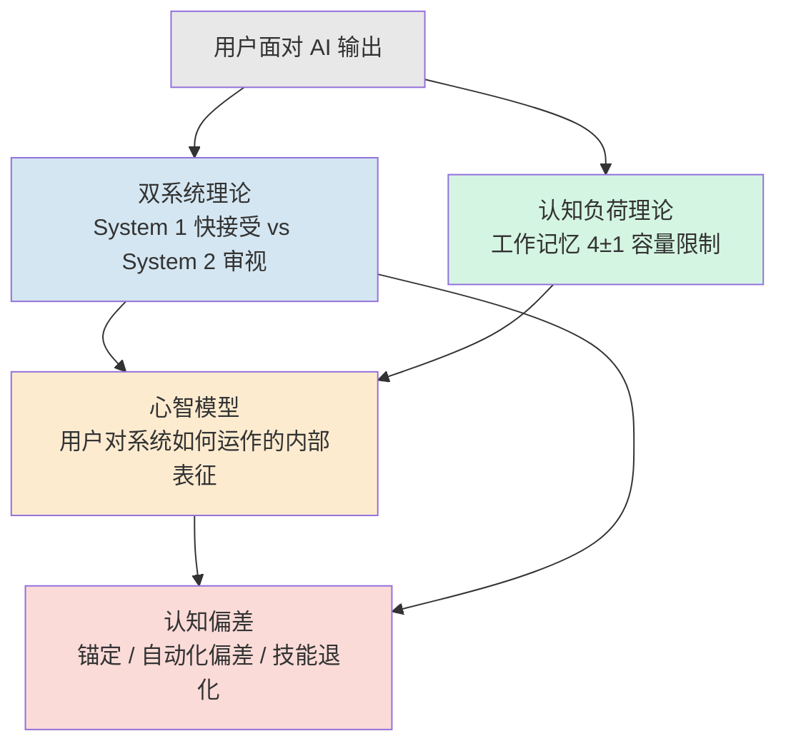

为 AI 交互设计选一套认知理论底座，本质是在回答一个被大多数 PM 跳过的前置问题：**用户的脑子在用 AI 时，到底处于哪种工作模式？** 本节点不讲任何具体的交互设计模式（那是 [p302 - 七种 AI 交互设计模式](/kb/产品设计与交互范式/p302-七种-ai-交互设计模式/) 到 [p309 - 特殊品类交互设计要点](/kb/产品设计与交互范式/p309-特殊品类交互设计要点/) 的事），只做一件事——把认知科学里**真正与 AI 交互相关**的四个分支（双系统、认知负荷、心智模型、认知偏差）摆成一张可导航的谱系图，并论证一个反共识判断：**AI 交互比传统 GUI 更依赖认知科学，不是程度问题，而是性质问题**。本专题的视角框架是「认知底座 → 设计模式」的两层结构：p3xx 是设计模式，本专题是其下的认知理论根基。

## §0 为什么是「认知科学谱系」而不是「UX 最佳实践清单」

先挡掉一个默认的错误框架。绝大多数 AI 产品团队处理交互问题的方式，是去翻 Nielsen Norman Group 的文章、抄竞品的 UI、攒一份"AI 产品设计 checklist"。这条路在 GUI 时代足够用——因为 GUI 的交互假设（用户点按钮、系统给确定反馈、状态可见可验证）已经被三十年实践固化成了**隐性常识**，你不需要懂底层认知科学，照搬最佳实践就能做出能用的产品。

**这正是判断主轴所在：把 GUI 的设计假设照搬到概率系统上，是当前 AI 产品最普遍、最隐蔽的认知错误。** 因为这些假设不写在任何 checklist 里——它们是空气，是你呼吸但看不见的前提。而 AI 系统恰恰违反了这些前提中最核心的几条（见 [c01 - 认知重构：从确定性系统到概率系统](/kb/基础知识库/c01-认知重构-从确定性系统到概率系统/)：同一输入→概率性输出、输出是置信区间而非单一值）。当底层假设被违反，建立在假设之上的最佳实践就会**静默失效**——不报错，但用户的认知会在你看不见的地方崩塌。

所以我们需要的不是更长的 checklist，而是**能解释"为什么这条最佳实践在 AI 上不成立"的理论**。理论的作用是让隐性假设显性化，让你在抄竞品之前先问一句："这个设计依赖的认知假设，在概率系统下还成立吗？"——这是 checklist 永远给不了的判断力。

## §1 四个分支：与 AI 交互相关的认知科学谱系

认知科学是个庞大领域，但与 AI 交互**直接相关**的只有四支。我用「用户认知的时间轴」来组织它们——从一次 AI 交互开始的瞬间，到长期反复使用后的能力变化：

| 分支 | 核心问题 | 奠基人物与著作 | 对 AI 交互的含义 |
|---|---|---|---|
| **双系统理论** | 用户何时快接受 AI、何时审视 | Kahneman《Thinking, Fast and Slow》(2011)；术语首创 Stanovich (1999) | 产品要校准 System 1↔System 2 的切换时机 |
| **认知负荷** | AI 信息呈现塞了多少进工作记忆 | Miller (1956)、Sweller (1988/1994)、Cowan (2001 修正为 4±1) | 单屏可见组块 ≤4–5，分步呈现 |
| **心智模型** | 用户对"AI 怎么运作"建了什么内部表征 | Norman《Some Observations on Mental Models》(1983)、《The Design of Everyday Things》(1988/2013) | 概率系统的心智模型天然不稳定 |
| **认知偏差** | 反复用 AI 后判断如何系统性走偏 | Tversky & Kahneman (1974, *Science*)；Parasuraman & Manzey (2010) | 锚定、自动化偏差、技能退化 |

这张表的每一行，都对应本专题后续一个或多个节点的深挖。这里只做"谱系定位"，不展开。

## §2 双系统：用户对 AI 输出的两种处理模式

Kahneman 在《Thinking, Fast and Slow》(Farrar, Straus and Giroux, 2011) 普及的 System 1（快、自动、模式识别、情绪驱动）与 System 2（慢、有意识、分析、受工作记忆限制）框架，是理解"用户怎么对待 AI 输出"的最直接工具。

> [!note] 术语精确性
> "System 1/2"术语其实由 Keith Stanovich 在 1999 年首创，Kahneman 才是普及者。更重要的是：**Kahneman 本人明确警告这两个系统并非大脑中真实的独立结构，只是有用的隐喻**（来源：imotions.com "System 1 and System 2: Facts and Fictions"）。Evans & Stanovich (2013, *Perspectives on Psychological Science*) 后来把术语改为 Type 1/Type 2，以避免被误读为大脑里两个模块。在 AI 交互写作里调用这个框架，必须守住它是"应用性隐喻"这条边界。

映射到 AI 交互：

| 用户行为 | 主导系统 | 表现 |
|---|---|---|
| 快速采纳 AI 建议、跳过审查 | System 1 | 自动化偏差、启发式信任（"AI 生成的，应该没问题"） |
| 主动核实来源、反问逻辑 | System 2 | 批判性审视（但也可能滑向算法厌恶式的过度否定） |
| 时间压力、复杂任务下 | System 1 占优 | 偏差加剧 |

产品的核心任务是**校准切换**：在低风险、需要效率的场景让 System 1 顺畅接受；在高风险、需要准确的场景制造"减速点"激活 System 2。这正是 [p304 - 防御性 UX：对抗延迟与幻觉](/kb/产品设计与交互范式/p304-防御性-ux-对抗延迟与幻觉/) 的分段确认、[p305 - 信任架构与可解释性设计](/kb/产品设计与交互范式/p305-信任架构与可解释性设计/) 的 HITL 确认断点的认知学根据——它们是"激活 System 2"的具体手段，本节点是它们的理论出处。

## §3 心智模型：概率系统打破了 Norman 的稳定假设

Norman 在《Some Observations on Mental Models》(1983, 收录于 Gentner & Stevens 编 *Mental Models*) 与《The Design of Everyday Things》(1988/2013) 中区分了三类模型：设计模型（设计者脑中的构想）、用户心智模型（用户交互中构建的内部表征）、系统意象（产品外观与反馈传达的一切信号）。Norman 1983 年就指出心智模型往往是**不完整、自相矛盾、不稳定**的。

关键在于 Norman 的两个鸿沟概念（执行鸿沟 / 评估鸿沟，由 Hutchins, Hollan & Norman 1985/1986 提出）在 AI 系统下发生了**非对称变形**：

> [!important] AI 缩窄执行鸿沟、拓宽评估鸿沟
> Yuexi Chen 的 UMD 博士论文 (2025) 系统论证了一个核心悖论：AI 通过自然语言交互**缩小了执行鸿沟**（用户更容易表达意图），却同时**拓宽了评估鸿沟**——AI 输出可能不准确或不可信，用户难以判断哪些可用（来源：Chen, UMD Dissertation, 2025, drum.lib.umd.edu，单一来源，待同行评审期刊转化）。

这就是为什么概率系统的心智模型天然不稳定：在确定性系统里，出错是异常态，用户可归因于 bug，心智模型保持稳定；在概率系统里，出错是正常分布内事件，用户难以归因，心智模型反复被打碎重建。Dhuliawala et al. (EMNLP 2023, arXiv:2310.13544) 进一步发现"overconfident + wrong"（高置信但出错）对信任的破坏性远大于"underconfident + correct"，且信任恢复极慢。这直接定义了 [p305 - 信任架构与可解释性设计](/kb/产品设计与交互范式/p305-信任架构与可解释性设计/) 为何要追求"校准信任"而非"最大化信任"。

## §4 认知负荷：AI 信息呈现的容量天花板

Miller (1956, *Psychological Review*) 的 7±2 早已被 Cowan (2001, *Behavioral and Brain Sciences*) 修正——剔除复述与长时记忆辅助后，工作记忆的真实注意焦点容量约为 **4±1 个组块**。Sweller 的认知负荷理论 (1988/1994) 把负荷拆成内在、外在、增生三类，其中**外在负荷（信息呈现方式造成的无关耗费）是设计者唯一可直接控制的优化重点**。

AI 交互在这里有个特殊陷阱：**为了对抗心智模型不稳定，产品倾向于"多解释"——展示推理链、置信度、来源引用——但解释本身消耗工作记忆**。这就是 XAI 领域的"透明度悖论"（来源：近期 XAI/HCI 研究，arXiv:2508.06352 等）：过度解释造成认知过载，反而损害理解。[p305 - 信任架构与可解释性设计](/kb/产品设计与交互范式/p305-信任架构与可解释性设计/) 的"折叠式推理面板""分层透明度"正是对这一负荷约束的设计应答——默认只给结论，进阶用户按需展开。

## §5 认知偏差：长期使用后判断的系统性走偏

前三支讲的是"一次交互内"的认知，认知偏差讲的是"反复使用后"的认知漂移。三个对 AI PM 最致命：

- **锚定效应**（Tversky & Kahneman, 1974, *Science*）：AI 的首次输出会锚定用户后续判断。Rosbach et al. (2026, arXiv:2603.11821) 在 28 名病理学专家实验中测得 **7% 自动化偏差率**——专家原本判断正确，却因接受错误 AI 建议改了答案。
- **自动化偏差**（Parasuraman & Manzey, 2010, *Human Factors*）：无批判地采纳自动化建议，**专家也不免疫，单靠练习无法克服**。Horowitz & Kahn (2023, arXiv:2306.16507, 9 国 9000 人) 发现 AI 知识"中等者"偏差最强，呈 Dunning-Kruger 式 U 型曲线。
- **技能退化**（Bainbridge 1983「Ironies of Automation」；Seligman 习得性无助）：Liu et al. (2026, arXiv:2604.04721, n=1222 RCT) 发现**仅约 10 分钟 AI 辅助交互后，参与者独立任务表现显著变差、更易放弃**。

> [!warning] 边界与赌注
> 把这些偏差框架"应用"到 LLM 交互，目前大多是**间接援引**——直接以 System 1/2 为框架研究 LLM 交互的实验论文仍少，自动化偏差文献是最贴近的实证基础但属间接迁移。本节点赌的是：这些经典认知机制在 AI 场景下**性质相同、强度可能更大**；如果未来证明"AI 交互产生了全新的、经典框架无法覆盖的认知模式"，本谱系需要扩支。

## §6 对手框架回应：双系统是否可证伪

**接受 + 边界，不是反驳。** 业界最强的反方来自 Melnikoff & Bargh (2018, *Trends in Cognitive Sciences*, 《The Mythical Number Two》, DOI:10.1016/j.tics.2018.02.001)：他们论证双系统框架**结构上抗反驳**——预测失败时总能诉诸"系统间干扰"或"第三因素"，且"自动性"并非统一构念。Stanovich 与 Kahneman 本人都已劝阻使用 System 1/2 标签，因为实践者把它误解成大脑里两个模块，催生了神经营销等伪科学。

**接受**：作为严格的认知科学理论，双系统确实定义松散、难以统一证伪，这一批评成立。**边界**：本专题不把双系统当作神经实在论的理论，而当作**PM 的设计启发式**——它的价值不在于"准确描述大脑",而在于"给设计师一个可操作的切换框架"。一个隐喻只要能让你做出"这个场景该不该制造减速点"的判断，它对 PM 就是有用的。我们要的是判断力，不是神经学真理。这与 [c01 - 认知重构：从确定性系统到概率系统](/kb/基础知识库/c01-认知重构-从确定性系统到概率系统/) 对待概率框架的态度一致：框架是工具，不是本体。

## §7 跨域呼应：维特根斯坦的「家族相似」与术语滑变

> [!note] 跨域调度
> 认知科学这四支的术语——尤其"心智模型""系统"——正在 AI 话语里发生维特根斯坦意义上的**语义滑变**。Yin et al. (2025, arXiv:2510.02660) 尖锐指出：当研究者说 AI 的"mental model"或"theory of mind"时，讨论的其实是**行为预测**，而非真正的认知状态；LLM 在心智理论测试中的"成功"来自行为模仿，被混淆成真实认知。

维特根斯坦的「家族相似」（family resemblance）告诉我们：一个词在不同语境下的用法之间只有交叉重叠的相似性，没有共同本质。"心智模型"用在"用户脑中对系统的表征"（Norman 本义）和"AI 对世界的内部表征"（拟人化用法）上，是两个家族成员——共享部分相似性，但绝非同一概念。**PM 必须守住这条术语边界**：当 PR 文案说"我们的 AI 有心智模型"时，那是营销修辞，不是认知科学陈述。混淆二者，会让你在产品决策里把"行为像懂"误当成"真的懂"，从而高估系统、低估幻觉风险（详见 [幻觉](/kb/基础知识库/幻觉/)）。这正是认识论自觉在 AI PM 工作中的具体落地（关联 0114认识论、0117社会学 对知识建构的讨论）。

## §8 PM 决策启示

- **面试桌**：被问"AI 产品和传统产品的设计差异"，不要答"AI 更智能"——答"传统 GUI 的设计假设建立在确定性反馈上，AI 是概率系统，违反了这些隐性假设，所以必须从认知科学底座重审每条 UX 最佳实践，而不是照搬"。这一句话就显出你有"认知底座 vs 设计模式"的两层思维。
- **选型会**：评估任何"AI 辅助决策"功能时，先问三个认知问题：它把用户推向 System 1 还是 System 2？它给工作记忆塞了几个组块？反复使用会不会导致技能退化？
- **复现台**：做用户测试时，不只测"任务完成率"，要测"心智模型准确度"和"过度依赖/不足依赖"——这两个变量决定了概率系统的长期成败（Eigner & Händler, 2024, arXiv:2402.17385）。

## §9 与已有节点的关系

本节点对照 [c01 - 认知重构：从确定性系统到概率系统](/kb/基础知识库/c01-认知重构-从确定性系统到概率系统/)，做的是**补缺 + 升高抽象层**：c01 从"系统侧"论证 AI 是概率系统（同一输入→概率分布采样），本节点从"用户认知侧"论证**人脑面对概率系统时的处理机制根本不同于面对确定系统**——两者是同一范式跃迁的一体两面。c01 解释"系统为什么是概率的",本节点解释"用户的脑子为什么会被概率系统搞乱"。

本节点也对照 [p302 - 七种 AI 交互设计模式](/kb/产品设计与交互范式/p302-七种-ai-交互设计模式/) 到 [p305 - 信任架构与可解释性设计](/kb/产品设计与交互范式/p305-信任架构与可解释性设计/)，做的是**奠基**：p3xx 是设计模式，本专题是其认知理论根基。同时升级对照 0418 审阅瓶颈节点对认知负荷的讨论——0418 在"代码审阅"这一具体场景观察到认知负荷瓶颈，本节点把它上提为"AI 信息呈现的普遍负荷管理"理论问题（不复述 0418 的具体场景数据）。

## §10 关联节点

**核心（必读）**
- [c01 - 认知重构：从确定性系统到概率系统](/kb/基础知识库/c01-认知重构-从确定性系统到概率系统/)——系统侧的范式跃迁，本节点是其用户认知侧对偶
- [p305 - 信任架构与可解释性设计](/kb/产品设计与交互范式/p305-信任架构与可解释性设计/)——校准信任的认知学落地
- [p304 - 防御性 UX：对抗延迟与幻觉](/kb/产品设计与交互范式/p304-防御性-ux-对抗延迟与幻觉/)——激活 System 2 的具体手段
- [幻觉](/kb/基础知识库/幻觉/)——评估鸿沟拓宽的根源
- [AI PM 知识图谱·总索引](/kb/ai-pm-知识图谱/ai-pm-知识图谱-总索引/)

**延伸（可选）**
- [p302 - 七种 AI 交互设计模式](/kb/产品设计与交互范式/p302-七种-ai-交互设计模式/)、[p303 - 克服空白画布综合症](/kb/产品设计与交互范式/p303-克服空白画布综合症/)——设计模式层
- [Agent](/kb/基础知识库/agent/)——Agent 异步交互对心智模型的额外冲击
- 0114认识论、0117社会学——术语滑变与知识建构的跨域底座

## 修订日志
- 2026-06-07 R1：首稿。建立四分支谱系（双系统/认知负荷/心智模型/认知偏差），确立"认知底座 vs 设计模式"两层框架，判断主轴=照搬 GUI 假设到概率系统，升级对照 c01/p3xx/0418，对手框架回应 Melnikoff & Bargh 2018 双系统可证伪批评，跨域调度维特根斯坦家族相似辨术语滑变。
