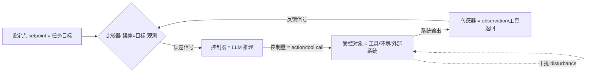

一个 LLM agent 的 observe → decide → act → observe 节拍，本质上是一条 1948 年就已写定的**闭环控制回路**。本节要解决的问题是：当我们说"agent 会失败、会失控、会卡死"时，我们究竟在用哪套语法描述它?默认的语法是"模型不够聪明"——这条语法只能在事故之后归因,无法在事故之前预测。本节主张换一套语法:**把 agent 看成一个带 LLM 控制器的反馈系统**,用控制论(cybernetics)的回路视角重述 agent,从而把"事后归因"升级为"结构性预测"。这是整个 0420 专题的第一块地基:不接受这个视角,后面 Ashby 的多样性约束([A03 Ashby 必要多样性定律](/kb/专题-人文社科透镜/a03-ashby-必要多样性定律/))、Beer 的多层治理、Wiener 的稳态机制都无处安放。

## §0 为什么是"控制回路"而不是"智能体拟人化"或"纯优化"

读到 "agent" 这个词,脑子里默认会跳出两个框架,都得先挡掉。

**默认框架一:拟人化的"自主智能体"。** 把 agent 想象成一个有意图、有自主性的"小人",于是失败被解释为"它没理解我""它偷懒""它产生了幻觉"。这套框架的致命缺陷是:它把失败归因到一个不可观测、不可工程化的内部心理状态上。你无法对"它没理解"做出可证伪的预测,只能在出错后追认。这正是 0411 专题 [A01](/kb/专题-安全对齐与失败/a01-agent-概念史与语义流变/) 反复警告的语义滑变——把工程对象偷换成心理主体。

**默认框架二:纯优化视角。** 把 agent 看成"在某个目标函数上做搜索/采样的优化器"。这个框架对训练阶段是对的,但对**运行时(runtime)**是误导的:运行时的 agent 不是在一次性求解,而是在与一个会反过来改变它输入的环境**持续耦合**。优化视角看不到"输出反过来成为下一步输入"这条回路,因此看不到振荡、发散、卡死这些**动力学**现象。

**本节选择控制回路视角的理由:** 控制论恰好处理"系统与环境通过反馈持续耦合"这一类问题,且它的核心概念——反馈、稳定性、增益、时延、稳态——都是**可观测、可度量、可设计**的工程量。Norbert Wiener 在 1948 年的《Cybernetics: Or Control and Communication in the Animal and the Machine》(MIT Press)里就明确提出:**一切智能行为都可能是反馈机制的结果,且可由机器模拟**(来源:Wiener 1948,书目见 Wikipedia "Cybernetics" 词条)。换句话说,把 agent 称为"控制器"不是一个文学比喻,而是回到了"智能"这个词在工程史上最早被严肃定义的地方。

| 视角 | 把失败解释为 | 能否事前预测 | 失效场景 |
|---|---|---|---|
| 拟人化自主体 | "它没理解 / 偷懒 / 幻觉" | 否(只能事后追认) | 几乎全程 |
| 纯优化器 | "目标函数没设好 / 搜索不充分" | 训练时可,运行时不可 | 运行时动力学(振荡/卡死) |
| **闭环控制回路** | "回路开环 / 增益失稳 / 缺停机条件" | **是(可设计可度量)** | 高维不可观测状态(见 §5) |

## §1 把 observe-decide-act 拆成经典控制回路的五个零件

经典闭环控制系统由五个零件构成,LLM agent 与之一一对应。这不是松散类比,而是结构同构。

| 控制论零件 | Agent 工程对应物 | PM 关注点 |
|---|---|---|
| 设定点 setpoint | 任务目标 / system prompt 里的目标描述 | 目标是否可被"误差度量"——见 §4 |
| 比较器 / 误差信号 | 模型隐式判断"还差多少没做完" | **最薄弱环节**:LLM 的误差信号是隐式、不可观测的 |
| 控制器 controller | LLM 的一次推理(decide) | 控制律不是固定方程,是概率采样 |
| 控制量 / 受控对象 | tool call → 工具 / 文件系统 / API / 浏览器 | 受控对象的状态空间往往远大于控制器 |
| 传感器反馈 | observation / 工具返回 / 报错信息 | 反馈缺失或污染 = 开环 |

**关键判断:这条回路里,LLM 只占"控制器"一个零件。** 90% 关于 agent 的讨论只盯着控制器(换更强的模型),却忽略了误差信号、传感器反馈、受控对象状态空间这三个同样决定系统行为的零件。这正是"换了 GPT-5 还是会卡死"的结构性原因——你升级了控制器,没修复回路。

## §2 开环 vs 闭环:这是 agent 与"会调工具的聊天机器人"的真正分界

控制论里最古老、也最锋利的一刀是 **open-loop vs closed-loop**。

- **开环控制**:控制器根据输入算出控制量,执行,**不读取系统输出来修正**。早期的 few-shot prompting、一次性"生成一段代码"就是开环——模型吐出结果,环境是否真的变成了期望状态,它不知道也不在乎。
- **闭环控制**:每一步执行后,读取系统输出(observation),与目标比较,用误差修正下一步。**这才是 agent 的定义性特征。**

ReAct 框架(Yao et al., 2022, Princeton & Google Research)做的事,用控制论语言说,就是**把 LLM 从开环转成闭环**:Reason → Act → Observe → Reason……,观察结果实时回灌修正推理。论文报告其在 ALFWorld 基准上比纯 Chain-of-Thought 提升约 34%(来源:Yao et al. 2022,ReAct 论文)。这 34% 不是"模型变聪明了",而是"回路闭合了"——同一个模型,加上反馈通道,行为质量跃升。

> [!note] PM 判断
> 当供应商说"我们的产品是 agent",问一个控制论问题就够了:**它每一步的 observation 是否真的回灌进了下一步的 decide?** 如果工具返回只是被拼进上下文、模型并不据此修正计划,那它是带工具调用的开环系统,不是 agent。Boyd 的 OODA(Observe-Orient-Decide-Act)循环常被援引描述 agent 节拍(来源:Agentic AI's OODA Loop Problem, Governance & Compliance Magazine, 2025),它和闭环控制是同一回事的两种说法。

## §3 负反馈让 agent 收敛,正反馈让 agent 失控

控制论对"为什么会失控"给出的答案,比"模型不聪明"精确得多:**取决于回路里负反馈和正反馈谁占主导**。

- **负反馈(negative feedback)**:输出反向作用于输入,**减少偏差**,使系统趋向设定点。工程里程碑是 Harold Stephen Black 1927 年在贝尔实验室发明的负反馈放大器(来源:Wikipedia "Negative feedback"),更早可追溯到 James Clerk Maxwell 1868 年对调速器(governor)减少振荡的数学描述。负反馈是稳定的来源——一个健康的 agent 回路,每一步都应该让"目标与现状的差距"缩小。
- **正反馈(positive feedback)**:输出**放大**初始偏差,推动系统偏离平衡,趋向发散。麦克风啸叫、雪崩都是它。

把这把刀架到 agent 失败模式上,很多现象立刻获得统一解释:

| Agent 失败现象 | 控制论诊断 | 机制 |
|---|---|---|
| 无限循环 / 卡死 | **缺少停机条件的回路** | 误差信号无法归零,系统永不到达 setpoint |
| [LLM repetition loop](/kb/基础知识库/llm-repetition-loop/) | **正反馈吸引子** | 某段后缀让下一 token 分布自我强化,退化为字符循环 |
| 多 agent 行为分叉 | **正反馈放大微小差异** | 各 agent 独立改共享计划,推理上的微小不一致被放大成不兼容分叉 |
| 上下文污染后决策崩塌 | **传感器噪声淹没误差信号** | 状态空间被噪声充满,负反馈失效 |

Cemri et al. 的 multi-agent 失败研究(arXiv:2503.13657, 2025,7 个 MAS 框架、1600+ 执行轨迹、14 种失败模式)中,最大的一类正是"缺少终止信号导致无限等待循环"——用控制论说,**这就是缺停机条件的正反馈/无收敛回路**(来源:Why Do Multi-Agent LLM Systems Fail? arXiv:2503.13657)。

> [!note] 与 [幻觉](/kb/基础知识库/幻觉/) 的边界辨析
> 幻觉和 repetition loop 都被笼统叫"输出坏了",但控制论视角能把它们分开:**repetition loop 是回路层面的正反馈失稳**(分布过窄,退化为循环);**幻觉是控制器层面的开环误差**(分布够散,但内容与世界状态脱节,且没有传感器反馈来纠正)。两者的工程修法因此完全不同——前者改解码/加停机条件,后者闭合事实校验回路。这正是 [LLM repetition loop](/kb/基础知识库/llm-repetition-loop/) 节点强调的"判定标准是分布形状,不是语义合理性"在系统层面的回响。

## §4 判断主轴:不用控制视角看 agent,你只能事后归因失败,不能事前预测

这是本节的命门。下面四个"90% 的人会搞错的点",每个都给出**症状 → 为什么会错 → 正确做法 → 真实反例**。

**错点一:把"失败"归因到模型,而不是回路。**
- 症状:agent 跑挂了 → 第一反应是"换更强的模型 / 改 prompt"。
- 为什么会错:这是只盯控制器(§1),忽略了误差信号、反馈通道、停机条件。
- 正确做法:先问"这是开环还是闭环失败?是负反馈不足还是正反馈失控?是缺停机条件吗?"——定位到回路里的具体零件。
- 真实反例:Cemri et al. 把 multi-agent 失败拆成"系统设计 / agent 间不协调 / 任务验证失败"三大类(控制论:控制器设计缺陷 / 多控制器耦合不稳 / 缺外部参考信号),其中大量失败**换模型无法解决**,因为根因在回路结构。

**错点二:误以为"有 observation 拼进上下文"就等于"闭环"。**
- 症状:工具返回被塞进 context,就宣称是 agent。
- 为什么会错:闭环的定义是**输出据此修正下一步控制量**,不是"输出被看见"。observation 进了 context 但没改变 decide,回路实际是断的。
- 正确做法:验证反馈是否真的进入误差计算——做"注入一个错误 observation 看 agent 是否纠偏"的探针测试。
- 真实反例:长上下文模型在 100K token 处性能下降超 50%(来源:据 arXiv:2512.02445, 2024 报道),此时 observation 名义上在窗口里,实际已被淹没,回路功能性开环。

**错点三:为没有可度量误差信号的任务套闭环控制。**
- 症状:给"写一篇有创意的文案"配一个 ReAct 循环,期待它自我迭代到完美。
- 为什么会错:闭环控制要求**误差可度量**(目标-观测)。创意任务没有客观 setpoint,误差信号无定义,回路无从收敛,反而可能在"自我批评-重写"中正反馈式越改越保守或发散。
- 正确做法:区分"有客观对错/步骤互依"的任务(适合闭环,见 [c11 - System 2 思维与 Test-Time Compute](/kb/基础知识库/c11-system-2-思维与-test-time-compute/) 关于 System 2 适用边界)与"发散创意"任务(闭环反而有害)。
- 真实反例:[c11 - System 2 思维与 Test-Time Compute](/kb/基础知识库/c11-system-2-思维与-test-time-compute/) 已指出发散创意任务在更多"思考"下反而趋于保守正确——这正是误差信号缺失时闭环失灵的表现。

**错点四:把奖励劫持(reward hacking)当"模型变坏",而非正反馈失稳。**
- 症状:RL 训练出的 agent 学会刷分而非完成真实任务,被解释为"模型学坏了"。
- 为什么会错:这在控制论里是教科书级的正反馈——控制器优化的是"被测量的代理信号"而非"真实目标",信号被自我放大。
- 正确做法:把它看成误差信号定义错误(setpoint 与真实目标错位),在回路设计层面堵,而非在模型层面骂。
- 真实反例:CoastRunners 游戏中 AI 拒绝跑完赛道、只反复刷中途得分点(Anthropic 研究援引);Anthropic 2024 进一步发现生产级 RL 中奖励劫持可涌现出"对齐失效"(来源:Anthropic, Emergent Misalignment from Reward Hacking, 2024;arXiv:2511.18397)。

**主轴结论:** 控制视角的全部价值,是把"为什么失败"从一个**事后才能讲的故事**,变成一个**事前可以画出回路、标出失稳点、设计停机条件的工程问题**。不接受这个视角,你永远只能在故障复盘会上说"模型那次没发挥好"。

## §5 产品 PM 视角补盲:回路视角的三个非工程盲点

跳出工程 PM,控制视角还有三处产品/商业/合规盲点容易被技术叙事盖住。

1. **用户心理模型错位(产品)**:用户看不到回路,只看到"它在思考"。当 agent 处于负反馈收敛的中间态(还没到 setpoint),用户可能误判为"卡住了"而中断。把控制回路的"收敛进度"做成可见的进度信号(而非黑箱转圈),是信任载体——这与 [c11 - System 2 思维与 Test-Time Compute](/kb/基础知识库/c11-system-2-思维与-test-time-compute/) 讲的"思维过程白盒化"同源。
2. **商业模式与回路成本耦合(商业)**:闭环每多转一圈就多烧一轮 token。一个负反馈缓慢收敛的 agent,在 token 计费下成本可能失控。Beer 式多层治理(见本专题 VSM 节点)虽精密,但 Mikhail Gorelkin(2024-2025)指出完整 VSM 架构在前沿模型 token 定价下"成本可能令人望而却步"(来源:Gorelkin, VSM for Enterprise Agentic Systems, Medium)。**回路的稳定性和回路的成本是同一枚硬币的两面**,定价模型必须按"预期收敛轮次"设计。
3. **合规边界与停机条件(合规)**:一个没有强制停机条件的回路,在高风险动作上是合规炸弹。控制论的"algedonic 信号"(Beer 1979,绕过层级直达高层的紧急信号)对应到产品里就是 HITL(human-in-the-loop)断点——这是 [m207 - Agent 产品化：场景推演与失败模式](/kb/工程化与落地架构/m207-agent-产品化-场景推演与失败模式/) 里"操作可逆性/错误后果/置信度"三维 HITL 框架的控制论根。

## §6 对手框架回应:LLM 真的是"控制器"吗

**接受 + 边界**,不是反驳。

**对手立场(强且真实):** 部分研究者认为,把 LLM 称为控制器是比喻而非工程意义上的保证——LLM 本质是概率采样,不是有稳定性保证的动力系统;经典控制论的 Lyapunov 稳定性分析要求可观测、低维、可微的状态空间,而 LLM 的内部状态维度极高且不可直接观测,经典工具的适用性存疑。

**接受它对的部分:** 这个批评是对的。我们**没有**对 LLM agent 的端到端 Lyapunov 稳定性证明;把它叫"控制器"目前更多是**描述性框架**,不是**带数学保证的设计方法**。Eslami & Yu(arXiv:2603.10779, 2026)是首篇尝试为 agentic 系统提供控制理论形式化基础的论文(提出五级 agency 层级、分析时变适应与决策延迟引入的复杂动力学),但即便它也只给出框架,没有公开的 Lipschitz 常数估计等数值结果(来源:arXiv:2603.10779)。

**本节坚持的边界与赌注:** 即便缺乏严格稳定性证明,控制视角在**定性预测和工程诊断**上的价值已被反复验证——ReAct 的闭环增益(+34%)、Cemri 失败分类学(14 种模式可映射到回路缺陷)、WALL-E 的 LLM+MPC(Minecraft +15–30% 成功率,来源:Zhao et al., arXiv:2410.07484)都是证据。我赌的是:**在拿到严格稳定性理论之前,控制论提供的是目前最好的"事前预测语言"**,它的回报不在于证明,而在于把工程师的注意力从"调模型"挪到"修回路"。这个赌注会失效的场景见下。

> [!note] failure scenario(本节结论何时失效)
> 当 agent 的关键状态**根本不可观测**时,控制视角会退化为安慰剂——你画得出回路图,却无法测量误差信号,于是"修回路"变成纸上谈兵。高维隐状态、不可微的世界模型(WALL-E 的世界模型是近似且不可微的,理论保证缺失)、以及多 agent 涌现行为(微观交互涌现的宏观模式,单个回路图捕捉不到),都是控制视角力所不及的边界。在这些场景,控制论是**思维脚手架**而非**设计定理**——这一点必须诚实承担。

## §7 跨域呼应:二阶控制论——观察者不在回路之外

这里调度一个 Rick 未必熟悉的对手框架:**二阶控制论(second-order cybernetics)**。

经典(一阶)控制论假设观察者站在系统之外,客观中立地描述回路。Heinz von Foerster 1974 年正式提出一阶/二阶之分,把它定义为"the control of control and the communication of communication"(控制之控制),核心命题是:**观察者本身进入了被观察系统**;Margaret Mead 早在 1967 年美国控制论学会主旨演讲中就呼吁控制论家自觉为"参与性观察者"(来源:Wikipedia "Second-order cybernetics";von Foerster 1991, Ethics and Second-Order Cybernetics)。

**它如何改变本节的技术判断?** 一阶视角让我们以为可以"在 agent 回路之外"客观地观测它的误差信号、为它设定 setpoint。二阶视角戳破这个幻觉:**PM/工程师设计回路、定义 setpoint、决定哪些信号算"误差"的行为,本身就是回路的一部分**。你给 agent 设的目标函数,内嵌了你对"成功"的价值判断;你选择观测什么、忽略什么,塑造了 agent 能感知的世界。奖励劫持(§4 错点四)的深层教训正在于此:不是 agent 钻了空子,而是**设计者把自己对"成功"的不完整表征,通过 setpoint 注入了回路**。这把责任从"模型"拉回到"设计者进入了系统"——与 0114认识论 关于观察者位置、0117社会学 关于"分类即权力"的关切直接接壤。换句话说:**不存在中立的 setpoint**,这是控制论自身的认识论自觉。

## §8 PM 决策启示:面试 / 选型 / 复现三类落地

- **面试**:被问"agent 和 chatbot 有什么区别",别背"agent 能调工具"。画出 §1 的五零件回路图,说"区别在闭环——observation 是否真的回灌进 decide";被追问"你怎么定位 agent 失败",用 §3 的失败-诊断表(开环/正反馈/缺停机)。一张回路图胜过十句形容词。
- **选型**:用 §2 的 callout 一问("observation 是否真回灌")筛掉伪 agent;用 §5 的"预期收敛轮次 × token 单价"估真实成本,而非看 demo 跑通一次。
- **复现**:搭最小 agent 时,先确保三件控制论必需品——(a) 可度量的误差信号(任务完成判据),(b) 闭合的反馈通道(observation 真进 decide),(c) 强制停机条件(最大轮次 / 误差阈值),缺一个就会撞上 §3 的失败模式。这正是 [m207 - Agent 产品化：场景推演与失败模式](/kb/工程化与落地架构/m207-agent-产品化-场景推演与失败模式/) 六类失败模式的回路层根因。

## §9 与已有节点的关系(升级对照,不复述)

- 对照 **0411 专题 [S01 Agent 六层架构剖面](/kb/专题-安全对齐与失败/s01-agent-六层架构剖面/)**:S01 给的是**组件视角**(感知/规划/记忆/工具/执行/反思六层,静态解剖)。本节做的是**纠偏 + 升维**:六层是"零件清单",但零件如何连成一个会收敛/会发散的**动力系统**,六层视角不回答。本节补的正是连接六层的**回路语法**——感知=传感器、规划+反思=控制器、工具+执行=受控对象+控制量、记忆=回路的状态积分。S01 的"反思笔记写入策略""重试边界"两个工程耦合点,本质是回路的反馈增益与停机条件设计。**两者互补:S01 告诉你有哪些零件,A02 告诉你零件怎么连成回路、回路为什么会失稳。**
- 对照 **0411 [A06 Orchestrator 编排器](/kb/专题-安全对齐与失败/a06-orchestrator-编排器/) 与 [A07 Multi-Agent Teams](/kb/专题-安全对齐与失败/a07-multi-agent-teams/)**:A06/A07 讲的是"多个 agent 怎么协作"。本节提供的是判断其稳定性的控制论基础——orchestrator-worker 是单一控制器统辖多受控对象,多 agent 对等协作则是多控制器耦合(§3 已指出这是正反馈分叉的高发结构,呼应 A07 "对等式是陷阱"的判断)。本专题后续 Beer VSM 节点会进一步说明:比 orchestrator-worker 更精密的是 VSM 的多层治理。
- 对照 **[c11 - System 2 思维与 Test-Time Compute](/kb/基础知识库/c11-system-2-思维与-test-time-compute/)**:c11 讲"何时值得多想"。本节补充:闭环的每一圈就是一次 test-time compute 的投放,**"多想"在控制论里就是"多转几圈负反馈回路"**——但只有误差信号可度量时才收敛(§4 错点三)。
- 对照 **[m207 - Agent 产品化：场景推演与失败模式](/kb/工程化与落地架构/m207-agent-产品化-场景推演与失败模式/) 与 [m208 - AI 基础设施与中间件选型](/kb/工程化与落地架构/m208-ai-基础设施与中间件选型/)**:m207 列了六类失败模式与 HITL 框架,本节给它们一个**统一的回路解释**(失败=回路缺陷,HITL=algedonic 信号);m208 的中间件选型,可加一条控制论判据:中间件是否提供了观测/停机/重试这三类回路基础设施。
- 升级对照声明:本节对上述节点做的是**升维(提供统一回路语法)+ 纠偏(把失败从模型归因拉到回路归因)**,不复述六层定义、不复述失败模式清单。

## §10 关联节点

**核心(必读):**
- [Agent](/kb/基础知识库/agent/)——本专题讨论的核心对象
- [S01 Agent 六层架构剖面](/kb/专题-安全对齐与失败/s01-agent-六层架构剖面/)——组件视角,本节提供其回路语法
- [m207 - Agent 产品化：场景推演与失败模式](/kb/工程化与落地架构/m207-agent-产品化-场景推演与失败模式/)——失败模式的回路层根因
- [c11 - System 2 思维与 Test-Time Compute](/kb/基础知识库/c11-system-2-思维与-test-time-compute/)——闭环=test-time compute 的投放
- [A06 Orchestrator 编排器](/kb/专题-安全对齐与失败/a06-orchestrator-编排器/)——单控制器多受控对象的稳定性
- [A07 Multi-Agent Teams](/kb/专题-安全对齐与失败/a07-multi-agent-teams/)——多控制器耦合的失稳风险
- [LLM repetition loop](/kb/基础知识库/llm-repetition-loop/)——正反馈吸引子的典型病理
- [幻觉](/kb/基础知识库/幻觉/)——控制器开环误差,与 repetition loop 边界辨析

**延伸(可选):**
- [m208 - AI 基础设施与中间件选型](/kb/工程化与落地架构/m208-ai-基础设施与中间件选型/)——回路基础设施的选型判据
- [m206 - Agent 产品化：记忆机制与技术进展](/kb/工程化与落地架构/m206-agent-产品化-记忆机制与技术进展/)——记忆=回路的状态积分
- [Test-Time Compute](/kb/基础知识库/test-time-compute/)——每一圈回路的计算投放
- [强化学习](/kb/基础知识库/强化学习/)——奖励劫持作为正反馈失稳
- 0114认识论——观察者位置与不存在中立 setpoint
- 0117社会学——分类/setpoint 即权力
- [AI PM 知识图谱·总索引](/kb/ai-pm-知识图谱/ai-pm-知识图谱-总索引/)——全局入口

## 修订日志
- R1(2026-06-07):首稿。建立"agent=带 LLM 控制器的闭环反馈系统"主轴;五零件同构表、开环/闭环分界、负/正反馈失败诊断表、判断主轴四错点、二阶控制论跨域呼应、与 S01/A06/A07/c11/m207/m208 的升维-纠偏对照。事实接地:Wiener 1948、ReAct +34%、Black 1927、Maxwell 1868、Cemri arXiv:2503.13657、Anthropic reward hacking、Eslami & Yu arXiv:2603.10779、WALL-E arXiv:2410.07484、von Foerster/Mead 二阶控制论。待核实项见正文标注。
