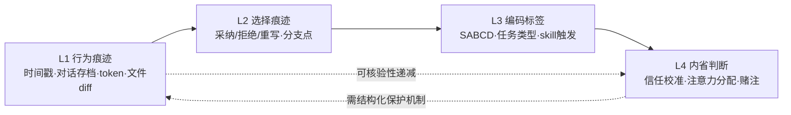

# A02 使用即数据·什么算 observation

当一个 power user 每天和 AI 协作几十次，这些交互里**哪些算"数据"、哪些只是过眼云烟**？本节点要解决的问题不是"如何收集数据"（那是 A03 的事），而是更前置的认识论问题：**在自我民族志中，一次 AI 使用要被怎样"看见"，才配称为一个 observation（观察单元）**。框架名：**使用即数据的"可观察性梯度"——从行为痕迹到内省判断的分层编码**。这是一个问题陈述，不是答案：因为自我民族志最大的诱惑，恰恰是事后凭一段流畅的回忆把"我当时是这么想的"写成事实，而那往往是被叙事重构污染的伪数据。

---

## §0 为什么是"可观察性梯度"框架，而不是"全记录"框架

读者脑中的默认错误框架有两个，都要先挡掉。

**错误框架一：全记录主义。** "把所有对话存档就有数据了。" 错。对话存档是 raw log，不是 observation。observation 是**被编码过的、带语义标签的、指向某个研究问题的最小分析单元**。一万条未编码的对话存档，分析价值约等于零——它们噪声大、碎片化、缺乏语义结构（这是大规模 usage log 分析的公认难题，见 OpenRouter 2025 对 100 万亿 token 交互的分析方法说明）。Rick 的 vault 里已有约 40+ 条旅行期对话存档（`99Archive/9910 claude 对话存档/`，日期戳 20260412–20260423），但只有当它们被 SABCD 评级、被升格为笔记节点时，才从"痕迹"变成"数据"。

**错误框架二：内省至上主义。** "最重要的数据是我当时的感受和决策。" 这正是自我民族志被实证派攻击为"navel-gazing（自我沉溺）"的命门（Delamont 2007、2012 的核心批评）。纯内省数据如果不与可观察痕迹锚定，就退化为事后合理化（post-hoc rationalization）——这是出声思考法（think-aloud）回顾式变体早已记录的偏差：参与者会**重建而非真实回忆**（Ericsson & Simon, *Protocol Analysis*, 1984；UXPA 关于回顾式 TA 记忆衰减的讨论）。

**本节点采用的第三框架——可观察性梯度。** 把"什么算 observation"答成一个分层问题：每一类数据按"独立于内省可被核验的程度"排序，越靠近可核验端越可信，越靠近内省端越需要结构化保护机制。这个框架的核心主张是一条可证伪的判断：**不结构化记录使用决策，等于把数据生产外包给三周后的回忆，而回忆的系统性偏差会让自我民族志失真到无分析价值**。

---

## §1 五类数据类目：从 L1 到 L4 的可观察性梯度

自我民族志要回答"什么该记"，必须先把"使用"拆成可分层的数据类目。下表是本专题给出的**记录类目表**——它既是 Rick 的记录清单，也是任何 AI 使用自我民族志的通用骨架。

| 层级 | 类目 | 具体载体（Rick vault 已有/可加） | 可观察性 | 偏差风险 |
|---|---|---|---|---|
| **L1 行为痕迹** | 交互事件流 | 对话存档时间戳、token 用量、文件 diff、skill 调用记录 | 高（机器自动产生） | 低，但"只记行为不记意图" |
| **L2 选择痕迹** | 决策分支 | 采纳/拒绝 AI 建议、重写 prompt、塌缩架构（v1.3→v1.4）、反向删除旧 memory | 中高（事后可从对话重建） | 中（重建时易补全成"理性叙事"） |
| **L3 编码标签** | 语义分类 | SABCD 评级、任务类型（探索/利用）、过拟合诊断这类元层干预 | 中（依赖编码者判断） | 中（编码漂移、标准不一） |
| **L4 内省判断** | 主观状态 | 信任校准、注意力分配、为何此刻跳过/拒绝 AI、塌缩决策的驱动 | 低（仅当事人可及） | 高（事后合理化、社会期望偏差） |

**判断密度落点：L1–L2 是 Rick 的"不公平数据优势"。** 多数 AI 使用研究者只有 L1（usage log）或被试自报的 L4（访谈），缺中间层。Rick 的 vault 因为有**工程化的痕迹留存机制**，天然富集 L2：
- skill 设计史本身是 L2 数据——trip-structure skill 有 over-design→被拉回→收敛的完整迭代轨迹（2026-04-03，由 skill-creator 元 skill 重写）；
- memory 治理转型是 L2 数据——从 blocklist 切换到 allowlist，并**反向删除**旧记忆条目（2026-05-13），这个"反向修订"动作是可观察的决策痕迹，不需 Rick 内省也能确认发生过；
- 架构塌缩是 L2 数据——12-agent v1.3 在 2026-05-21 被 Rick 用"是否 over-engineering"挑战后塌缩为 5 sub-agent + 6 skill (v1.4)，判别用 A/B/C/D 框架，文档可查。

这些是**已经发生、留有产物**的决策，属于自我民族志里最硬的那类数据：行为已外化为文件，分析它们不依赖 Rick 三周后的回忆。

---

## §2 怎么编码：三阶编码 + SABCD 作为现成的 L3 标签系统

"怎么记"的核心是编码（coding）。本专题不重新发明轮子，而是借建构主义扎根理论（Charmaz, *Constructing Grounded Theory*, 2006）的并行编码思路：**数据收集、编码、分析并行推进，靠反思性备忘录（reflexive memo）留痕**，而非线性的先收集后分析。

关键洞察：**Rick 的 SABCD 评级体系，本质上已经是一套运行中的 L3 编码 schema。** `99Archive/_README.md` 记录的 Phase 1 pipeline 评级分布（S:14 / A:103 / B:194 / C:182）就是一次完整的开放编码（open coding）产物——每条对话被赋予一个质量维度的语义标签。把它接入自我民族志，只需补两件事：

1. **加轴心编码（axial coding）维度**：现在 SABCD 只编"质量高低"，要再加正交的"使用模式"轴——例如认知轴（探索 Exploration vs 利用 Exploitation，这是 Human-LLM 交互模式综述的常用框架）、信任轴（采纳/拒绝/核查）。一条对话同时有 [A级 × 探索 × 拒绝后重写] 三个标签，才能支撑模式发现。
2. **加 reflexive memo**：每次评级时附一句"我为什么给这个分"。这正是把 L4 内省安全锚定到 L3 标签上的机制——内省不再悬空，而是附着在一个可核验的编码动作上。

> [!note] 编码漂移是 L3 的头号敌人
> 14 条 S 级和 182 条 C 级之间的界线，三个月后会不会变？扎根理论的"理论饱和"判断本就依赖编码者主观、可复制性低（这是 GT 的公认软肋）。对策：每批编码留下"边界样本"——那些"差点给 A 又给了 B"的对话，连同犹豫理由一起记。边界样本比典型样本信息量大得多。

---

## §3 判断主轴：什么算 observation，90% 的人会在这四处搞错

这是本节点的命门。把"使用即数据"做成自我民族志时，有四个高频致命错误，每个配症状→为什么会错→正确做法→真实反例。

**错位一：把 raw log 当 observation。**
- **症状**：以为"存了档=有数据了"，年底打开一万条对话发现无从分析。
- **为什么会错**：混淆了"痕迹"（trace）与"观察单元"（coded unit）。log 是 observation 的原料，不是 observation。
- **正确做法**：observation = 被赋予至少一个语义标签、指向某研究问题的最小单元。存档当下就编码，别攒着。
- **真实反例**：Rick 的旅行期对话若停在 `9910 对话存档/`，只是 L1；只有被 SABCD 评级 + 升格为 `NMAAHC 深度导览与 AI 表达元批评` 这样的节点后，才成为可分析的 observation。

**错位二：用事后回忆填 L4，却伪装成实时记录。**
- **症状**：写"我当时在 review diff 时觉得不放心所以拒绝了"——但这句话是三周后补的。
- **为什么会错**：回顾式自报有记忆衰减和合理化（Ericsson & Simon 1984；think-aloud 回顾变体的已知缺陷）。人会把"碰巧拒绝了"重述成"经过权衡的理性决策"。
- **正确做法**：L4 内省必须**事件触发（event-contingent）当场记**，或明确标注"此为事后重建"。这正是经验采样法（ESM, Csikszentmihalyi et al. 1977）的核心纪律：信号/事件触发的实时记录，对抗回忆偏差。
- **真实反例**：本专题对 Rick 一切内省项一律留 `〔Rick 待填〕` 模板而非代填，就是这条纪律的执行——可观察的（塌缩动作发生了）如实写，需内省的（塌缩是疲劳驱动还是美感驱动）绝不替他编造。

**错位三：只记成功，不记弃用与摩擦。**
- **症状**：自我民族志写成"我的 AI 协作多么高效"的成功学。
- **为什么会错**：这是 confirmation bias 的典型——只采可印证"我是高级用户"的正面案例。
- **正确做法**：把"哪个 skill 被弃用了""三步 ingestion 在哪一步制造了流程阻力""哪条 CLAUDE.md 原则最常被跳过"作为**必记类目**。负面/摩擦数据的信息密度通常更高。
- **真实反例**：trip 套件里若有 skill 在旅行中实际从未触发，这个"零使用"本身是关键 observation——但它在 L1 log 里表现为"沉默"，最容易被漏记，必须主动设一个"弃用清单"类目去捕捉。

**错位四：把"我"当成稳定不变的观察者。**
- **症状**：假设三周前评级的我和现在分析的我用同一把尺。
- **为什么会错**：编码漂移 + 研究者自身在演化（memory 治理观、架构观都在变）。
- **正确做法**：给每个编码盖"版本戳"——记下"这是用哪一版评级标准、在认知的哪个阶段做的判断"。分析式自我民族志要求的**分析性反身性**（analytic reflexivity, Anderson 2006）正是此意：自觉审视"我这个观察工具本身在怎样变化"。
- **真实反例**：Rick 的 memory 观在 2026-03-23（过拟合诊断）→05-13（allowlist 转型）之间明显演化，同一种 AI 行为在这两个时点会被他编码成不同标签。不记版本戳，就会把"我变了"误读成"AI 变了"。

---

## §4 产品 PM 视角补盲：使用即数据不只是研究方法，是产品本能

跳出"研究者"视角，三个 PM 才看得见的盲点：

1. **数据生产成本 vs 洞察收益的边际权衡**。每多一层编码（L1→L4）都增加记录摩擦，摩擦过高则记录行为本身会中断（diary study 的高流失率 attrition 是公认难题）。PM 直觉是：用最低记录成本的层级（L1/L2 自动留痕）承载主分析，把高成本的 L4 留给少数关键事件。Rick 的"三步 ingestion 沙盒"恰好是低成本 L1/L2 自动化的现成基础设施。
2. **观察者即用户的双重身份风险**。Rick 既是被研究的 power user，又是设计 vault 协作系统的 PM——他设计的 SABCD schema 会反过来塑造他怎么使用 AI（被测量者会朝指标优化，这是 Goodhart 风险的微观版）。observation 一旦被定义，就开始改变被观察的行为。
3. **"什么算数据"是个产品决策，不是中立记录**。选择记 L1 还是 L4、记成功还是记弃用，等于预先决定了能发现什么模式。这与产品埋点（instrumentation）一模一样：你埋什么点，决定你能回答什么问题。

---

## §5 对手框架回应：接受批评的对的部分，标出本专题的边界

**对手立场一（实证派 / Anderson 分析式自我民族志）：** Leon Anderson（2006, *Journal of Contemporary Ethnography*, 35(4)）批评纯唤起式自我民族志缺乏分析性理论建构，只剩个人故事，无法产生可迁移洞见。
- **接受**：完全接受。本节点之所以坚持分层编码、坚持 L4 必须锚定 L1/L2，正是为了不滑向"只有感受、没有可核验数据"的唤起式陷阱。Anderson 五特征里的"完整成员研究者(CMR)"和"分析性反身性"对本专题适用——Rick 正是他所研究场域（自己的 AI 协作系统）的完整设计者兼成员。
- **边界与赌注**：但本专题不接受 Anderson 对"理论建构"的实证主义化要求所隐含的、对 N=1 的轻视。我赌的是：**一个极端 power user 的厚描述，其价值不在统计代表性，而在揭示"使用上限"的边界形态**——这与 lead user 研究（von Hippel 1986）的逻辑一致：领先用户比市场早遭遇新问题，研究极少数前沿用户能预见普遍趋势。N=1 的 Rick 不是样本，是探针。

**对手立场二（唤起派 / Ellis & Bochner）：** Carolyn Ellis & Arthur Bochner（*Evocative Autoethnography*, 2016）认为 Anderson 用实证框架约束本质上后现代的实践，效度应看 verisimilitude（栩栩如生性）而非客观准确。
- **接受**：接受"效度不能只用实证标准"。Richardson 的水晶化（crystallization）隐喻——研究如水晶有无穷折射面、无需固定三角测量——对本专题成立：Rick 的 AI 使用确实是多棱镜。
- **边界**：但在"AI 使用即数据"这个特定题材上，我坚持向 Anderson 一侧倾斜。原因是赌注：本专题的产出要服务 Rick 的 AI PM 求职与决策训练，需要的是**可被他人质疑、可被复用的方法论**，而非只能共情的私人叙事。verisimilitude 不够，得加可核验性。

> [!warning] failure scenario
> 本节点的"可观察性梯度"框架在一种场景下会失效：当最重要的 observation 恰恰是**纯内省、无任何外化痕迹**的瞬间（如"我对这个 AI 输出产生了说不清的不信任，于是没采纳，也没留下任何 prompt 痕迹"）。此时 L1/L2 完全空白，框架只能退回到 L4 的事后自报，丧失锚定。对策只能是 ESM 式的实时弹窗自问，但那会严重干扰自然使用——这是本框架无法两全的硬边界。

---

## §6 跨域呼应：Polanyi 默会知识——为什么"使用决策"最难被记成数据

调度一个跨域资源：**Polanyi 的默会知识（tacit knowledge）"我们知道的比我们能说出的多"**。

这条认识论原理直接改变了"什么算 observation"的判断。Rick 决定"此刻信任这个 AI 输出、那刻拒绝"，很大程度是默会的——他能做出正确的信任校准，却未必能完整言说判断依据。这意味着 **L4 内省数据有一个原理性的天花板：能被言说记录的，永远小于实际在起作用的**。

后果有二：
1. **不能因为 L4 难记就放弃它**，但要清醒它的不完整性——这正是为什么本专题坚持用 L1/L2 的行为痕迹去**反推**默会判断，而非只靠 L4 自报。当 Rick 反复在某类 AI 输出上做"采纳后局部重写"（intellectual-lens skill 用"竞品输出对照"定位 prompt 差距的迭代，2026-04-05），这个行为模式比他口头解释更能揭示他的默会质量标准。
2. **自我民族志的诚实，恰在于标记默会的边界**。本专题对内省项留白 `〔Rick 待填〕` 而非代填，不只是"不编造"的纪律，更是对默会知识不可完全外化的认识论尊重——硬要把默会的东西写成清晰的事实陈述，本身就是一种造假。

（详见 [Polanyi 默会知识与提示工程的认识论张力](/kb/基础知识库/polanyi-默会知识与提示工程的认识论张力/)——本节点把那里的"提示工程"语境，迁移到"使用记录"语境：同一个张力，换了战场。）

---

## §7 PM 决策启示：面试 / 选型 / 复现三类落地

- **面试怎么用**：被问"你怎么评估自己的 AI 协作能力"，不说"我用得很熟"，而说"我把使用拆成四层数据，L1/L2 自动留痕、L4 事件触发记录，并承认默会判断的记录上限"。这是把模糊的"我很会用 AI"升级成**可被追问的方法论**——直接区分于 hype 式自述。
- **选型怎么用**：评估任何 AI 协作工具时，问一句"它的使用能不能被结构化记录成 L1/L2？"。一个不留 diff、不留调用记录、对话无法导出的工具，等于让你的使用经验无法沉淀为数据——这是隐性的高 switching cost。
- **复现怎么用**：任何团队想做"AI 使用研究"，先建 L1/L2 自动留痕基础设施（埋点 + 沙盒 ingestion），再补 L3 编码 schema，**最后**才加 L4 内省，且 L4 必须事件触发。顺序颠倒（先做问卷访谈）必然采到被回忆污染的数据。

---

## §8 与已有节点的关系

- 对照 [Skill 系统的本质](/kb/ai-协作方法论/skill-系统的本质/)：那里讲 skill 是"procedural knowledge 的文档化封装"；本节点做**深化**——指出 skill 的设计史本身就是一类高价值 L2 observation，把"skill 是什么"升级为"skill 设计轨迹怎么被当数据读"。
- 对照 [Polanyi 默会知识与提示工程的认识论张力](/kb/基础知识库/polanyi-默会知识与提示工程的认识论张力/)：那里聚焦提示工程的言说困境；本节点做**迁移/对话**——把同一默会张力搬到"使用记录"场景，论证 L4 数据的原理性天花板。不复述 Polanyi 原理，只调用其后果。
- 对照 [AI 记忆过拟合与泛化能力](/kb/基础知识库/ai-记忆过拟合与泛化能力/)：那里是 Rick 对 AI 做过拟合诊断的内容节点；本节点做**纠偏视角的补充**——把那次"两轮元层干预"重新读作一份 L2/L3 数据样本（决策痕迹 + 元层编码），示范"同一份产物如何被当 observation 二次分析"。
- 升级对照 **0418 审阅瓶颈专题**：Rick 的审阅行为（SABCD 评级、三步 ingestion 中的 Rick 审阅环节）是 0418 命题的**一手数据**。本节点提供方法（怎么把审阅行为记成 L2/L3 数据），0418 提供命题（审阅是瓶颈）——二者构成"方法↔命题"互补。
- 升级对照 **0414 Claude Code 体感**：0414 是体感记录（偏 L4 内省）；本节点为它补**结构化骨架**——指出体感若不锚定到 L1/L2 痕迹，会退化为回忆，应按可观察性梯度分层。
- 升级对照 **0422 民族志方法** 与 **本工厂(0412-0423) meta-case**：本工厂这套多 agent 流水线本身就是一个正在运行的、可观察的 AI 使用 observation——它的 round-N critique 留档、SABCD 自评、agent 分工，全是 L1/L2/L3 数据。本节点用它做自指示范：研究"使用即数据"的工具，本身在生产可被同样框架分析的数据。

---

## §9 关联节点

**核心（必读）**
- [Skill 系统的本质](/kb/ai-协作方法论/skill-系统的本质/)
- [Polanyi 默会知识与提示工程的认识论张力](/kb/基础知识库/polanyi-默会知识与提示工程的认识论张力/)
- [AI 记忆过拟合与泛化能力](/kb/基础知识库/ai-记忆过拟合与泛化能力/)
- [trip-structure skill](/kb/工具/trip-structure-skill/)
- [Claude routines 调研与 memory allowlist 设计](/kb/产品/claude-routines-调研与-memory-allowlist-设计/)
- 人类学
- 民族志

**延伸（可选）**
- [旅行规划 Skill 套件系统设计](/kb/产品/旅行规划-skill-套件系统设计/)
- [AI PM 知识图谱框架设计](/kb/产品/ai-pm-知识图谱框架设计/)
- [AI PM 知识图谱·总索引](/kb/ai-pm-知识图谱/ai-pm-知识图谱-总索引/)
- [Claude Code](/kb/ai-公司与产品/claude-code/)
- [Agent](/kb/基础知识库/agent/)
- 0114认识论
- 0117社会学

---

## §10 Rick 待填项（结构化模板 · 绝不代填）

> 以下均为 L4 内省数据，仅 Rick 本人可及。请在实际记录习惯就位后逐条补入，标注"此为实时记录 / 此为事后重建"。

〔Rick 待填：你的实际记录习惯〕
- 你目前真的会把哪些层级（L1/L2/L3/L4）落到文字？哪一层最常被你跳过、为什么？
- 引导问题：上一次你"决定不采纳 AI 输出"，有没有留下任何痕迹？如果没有，那个判断为何没被记？

〔Rick 待填：SABCD 评级时的内部标准与犹豫〕
- 14 条 S 级和 182 条 C 级之间，你自己的价值判断依据是什么？评级时在哪些对话上犹豫过、边界模糊？
- 引导问题：能否找出 1-2 条"差点给 A 又给了 B"的边界样本，写下当时的纠结？（这是最高价值的 observation）

〔Rick 待填：哪些 skill 被弃用 / 哪条 CLAUDE.md 原则最常被跳过〕
- 旅行中哪些 skill 频繁触发、哪些实际从未用上或感到不够用？三步 ingestion 在哪一步制造了流程阻力？
- 引导问题：有没有哪条你自己定的协作原则，你私下经常违反？为什么？

〔Rick 待填：架构塌缩(v1.3→v1.4)的主观驱动〕
- 那次塌缩是认知疲劳驱动、架构美感驱动，还是纯效率驱动？（动作可观察，驱动只有你知道）

---

## §11 修订日志

- 2026-06-07 R0 首稿：建立"可观察性梯度 L1–L4"框架；五类数据类目表；三阶编码 + SABCD 作为 L3 schema；判断主轴四错位；Polanyi 跨域呼应；与 0414/0418/0422 及 [Skill 系统的本质](/kb/ai-协作方法论/skill-系统的本质/)/[Polanyi 默会知识与提示工程的认识论张力](/kb/基础知识库/polanyi-默会知识与提示工程的认识论张力/) 升级对照；Rick 待填 4 项（结构化模板）。待 grounding pass 核 ESM 首创年份、Anderson 期刊卷号、Ericsson & Simon 年份。
