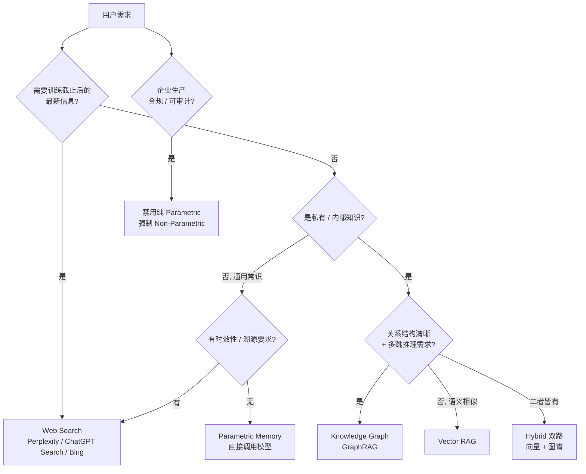

当一个 PM 接到「给产品加个知识能力」的需求，脑子里默认弹出的词是 RAG——这正是本节点要拆掉的第一个反射。问题不是「怎么做 RAG」，而是「这次需求到底该去哪里取知识」：去模型权重里（parametric memory）、去实时网络（web search）、去结构化关系网（knowledge graph）、还是去私有文档库（RAG）？这是四去向的**路由决策**，不是单一技术的实现细节。本节点提供一张可在选型会上直接用的决策矩阵，核心立场只有一句：**默认 RAG 是懒惰**——它是 2023–2024 年的肌肉记忆，把一个本该分流的路由问题，坍缩成了一个工程模板。

## §0 为什么是「四去向路由」框架，而不是「RAG vs 长上下文」框架

业界过去两年最流行的辩论框架是「RAG 是否会被长上下文淘汰」。这个框架本身就是错的——它把检索问题窄化成了「外挂知识 vs 塞进上下文」的二选一，而真正的问题是**知识住在哪种介质里、用哪种代价取出**。

更准确的切分轴是记忆的**参数性**（parametric vs non-parametric，见 Wang et al., *Knowledge Mechanisms in Large Language Models: A Survey and Perspective*, EMNLP 2024 Findings, arXiv:2407.15017）。参数记忆是把知识压进权重，推理时零外部依赖、低延迟，但冻结在训练截止点、无法审计、无法删除；非参数记忆（向量库、知识图谱、实时检索）可更新、可审计、可删除，代价是检索延迟与噪声引入的新失败模式。

一旦用这根轴去切，「四去向」就自然浮现：parametric memory（去权重）是唯一的参数化去向；web search、knowledge graph、RAG 是三种非参数化去向，区别在于**取的是什么形状的知识**——web search 取实时的、公开的、流动的；KG 取结构化的、关系密集的、可多跳的；RAG 取语义相似的、非结构化的、私有的。把这三者全混叫「RAG」，是当下选型会上最常见的认知坍缩。

> [!note] 这与 上下文工程专题（信息流工程）视角下的「信息流工程」是同一枚硬币的两面：0417 谈的是 token 进入上下文窗口的**编排顺序与组装策略**（信息一旦决定要用，如何流入模型）；本节点谈的是这之前的**去向决策**（信息该从哪种介质里取）。先有路由，才有信息流——本节点是 0417 的上游闸门。

## §1 四去向的判断矩阵

| 去向 | 知识形状 | 何时是对的 | 何时是错的（反例） | 代价 |
|---|---|---|---|---|
| **Parametric Memory**（直接调用模型） | 通用常识、稳定推理、跨域泛化 | 无时效性、无私有性、无溯源要求的常识问答 | 任何需要「这条信息来自哪」的合规场景——权重里取不出引用 | 知识冻结、幻觉无内置验证 |
| **Web Search** | 实时、公开、流动 | 新闻、股价、刚发布的产品、训练截止后的事件 | 私有文档问答（搜不到内网）、需要确定性结果的合规场景 | 高且可变的延迟、引用错位率高 |
| **Knowledge Graph / GraphRAG** | 结构化、关系密集 | 多跳推理（A 经 B 到 C）、实体关系明确、连通性/社区级问题 | 频繁变化的数据（图谱维护成本高）、纯语义相似匹配 | 构建成本高、动态数据难维护 |
| **RAG（向量检索）** | 语义相似、非结构化、私有 | 私有文本语料的单步语义问答、低成本快速原型 | 模型本就知道答案时（检索噪声反而拖累）、关系型多跳问题 | 检索质量是瓶颈、垃圾进垃圾出 |

这张矩阵的判断密度在于：**每个去向都有一个「何时是错的」列**。默认 RAG 的懒惰，本质是只看「RAG 何时对」、不看「RAG 何时错」。而 RAG 错得最隐蔽的一种情况是——模型本来就知道答案。Wang et al., *When Retrieval Succeeds and Fails: Rethinking Retrieval-Augmented Generation for LLMs*（arXiv:2510.09106）指出，随着 LLM 自身能力增强，传统 RAG 框架的相对优势正在变弱——当模型参数记忆已含正确答案时，硬塞进来的检索文档反而可能把它带偏。这意味着对一类常识问题，**正确的去向恰恰是 parametric**，而不是任何非参数化检索。

## §2 路由决策树（可在选型会上画的那张图）

这棵树的反共识落点：**「企业生产」这条横切线会一票否决 parametric memory**。Wang et al.（arXiv:2407.15017，*Knowledge Mechanisms in Large Language Models: A Survey and Perspective*, EMNLP 2024 Findings〔已核实(2026-06-12)〕）与 DIVA Portal 的 *LLM: Retrieval vs. Parametric Memory Tradeoff* 论文（2024）都指向同一个产品结论——大多数生产部署倒向非参数记忆，**核心驱动不是技术性能，而是合规要求的可审计性与数据可删除性**。这是 PM 最容易看走眼的一点：以为是「检索更准」才选 RAG，实际上很多时候是「能删除、能审计、能解释」才选 RAG。性能是次要理由，合规是首要理由。

## §3 GraphRAG 何时值得它的构建成本

KG 这条去向的判断主轴是成本。Microsoft GraphRAG（Edge et al., *From Local to Global: A Graph RAG Approach to Query-Focused Summarization*, arXiv:2404.16130, 2024）的数据很诱人：综合性（comprehensiveness）相比传统 RAG 提升 72–83%，多样性 62–82%，根级摘要所需 token 最高减少 97%。但同一份研究的边界是：GraphRAG 用 LLM 自动抽取实体关系再做社区检测与摘要，**构建成本高，对频繁变化的数据维护困难**。

所以 KG 的适用边界是「写少读多」的稳定知识库——产品手册、法规库、组织架构、供应链关系这类「关系明确、更新缓慢」的语料。反例是新闻流、用户行为日志这类高频变化数据，每次更新都要重跑实体抽取与社区检测，成本会吃掉收益。当前学界与工程界的共识不是「KG 替代向量」，而是 **Hybrid 双路**（向量检索负责语义召回、图检索负责多跳关系），KA-RAG（MDPI Applied Sciences, 2025〔待核实〕）在教育问答场景验证了双路的有效性。

## §4 判断主轴：四个 90% 的人会搞错的去向错位

**错位一：把「最新」需求当成 RAG 需求。**
- 症状：用户问「特斯拉今天股价」，产品去查内部文档库。
- 为什么会错：RAG 索引是某个时点的快照，天然滞后；把实时需求路由给 RAG，等于让一个冻结的数据库回答流动的问题。
- 正确做法：时效性需求路由给 web search。
- 真实反例：缓存索引（index-time RAG）在索引滞后时会「自信但错误」地答复——这是知识时效性专题反复警告的失效模式。

**错位二：把多跳关系问题硬塞给向量检索。**
- 症状：问「我们公司哪些供应商同时也是竞争对手的客户」，向量检索召回一堆「相似的句子」却答不出关系。
- 为什么会错：向量检索做的是语义相似匹配，不是关系遍历；多跳推理（A→B→C）需要的是图结构，不是余弦相似度。
- 正确做法：关系型多跳路由给 KG / GraphRAG。
- 真实反例：LinkedIn 的客服 KG-RAG（Xu et al., *Retrieval-Augmented Generation with Knowledge Graphs for Customer Service Question Answering*, arXiv:2404.17723, SIGIR 2024）正是因为工单间存在结构化关系，用 KG 把检索 MRR 提升 77.6%，纯向量做不到。

**错位三：在模型本就知道答案时强行检索。**
- 症状：问「光合作用的化学方程式」，产品去 RAG 私有库召回一段不相关的文档，把模型带偏。
- 为什么会错：parametric memory 已含此常识，外部检索引入的是噪声而非信息。
- 正确做法：用 Self-RAG / FLARE 这类 agentic 机制让模型**自己决定是否需要检索**，而非每次都查。
- 真实反例：arXiv:2510.09106 记录的「LLM 能力增强后，传统 RAG 相对优势变弱」现象——模型已知答案时检索反成噪声。

**错位四：以为 Agent 能让去向决策消失。**
- 症状：选型会上有人说「上了 Agent 就不用管 RAG 了，它会自己处理」。
- 为什么会错：Agent 不是去向的替代品，而是去向的**动态路由器**——它依然要在 search/KG/parametric/RAG 之间做选择，只是把这个选择从「架构时硬编码」变成「推理时动态决策」。
- 正确做法：把 Agent 理解为「会自己读决策树的路由层」，而不是「让决策树消失的魔法」。
- 真实反例：RAGFlow 评述（*RAG at the Crossroads* / *From RAG to Context: 2025 Year-End Review*）明确驳斥「Agents 替代 RAG」是「market-driven stunt」——现实是 Agents 依赖 RAG 做领域知识、对话历史、工具元数据三类检索。

## §5 Agentic Retrieval：把去向决策从「架构时」推迟到「推理时」

四去向矩阵的静态版本是 PM 在选型会上画的决策树；它的动态版本，就是把这棵树**编译进模型的推理流**——这正是 agentic retrieval 的本质。传统 RAG 的两条死路是：单次检索拼接（single-shot concatenation）和刚性预定义工作流。Agentic RAG 的突破在于让模型主动参与「何时检索、检索什么、用什么策略」。

三个里程碑方法对应三种「自动路由」机制：
- **Self-RAG**（Asai et al., 2023/2024）：用反思 token（IsREL/IsSUP/IsUSE）评估是否需要检索及检索质量——把「错位三」自动化。
- **FLARE**（Jiang et al., 2023）：生成置信度下降时才触发检索——预判未来信息需求。
- **A-RAG**（Du et al., *A-RAG: Scaling Agentic Retrieval-Augmented Generation via Hierarchical Retrieval Interfaces*, arXiv:2602.03442, 2026）：暴露三个工具（关键词/语义/chunk 读取），代理分层选择，可随模型规模扩展；实测以同等或更少 token 持续优于现有方法。

但 agentic 路由不是免费午餐。它的边界（failure scenario）是：反思 token 的训练成本高，且在小模型上效果不稳定——Self-RAG 的可靠性仍是活跃研究领域，无定论。所以 PM 的判断是：**模型规模决定能否把去向决策交给模型自己做**。大模型可以信任 agentic 路由，小模型上你还是得自己画决策树硬编码。

## §6 产品 PM 视角补盲：去向决策是 GTM 决策，不只是工程决策

工程视角下，四去向是个延迟/成本/准确率的权衡。但产品视角下，去向决策直接决定**用户对你产品「权威性」的心理建模**。

第一，**去向决定了「这是谁说的」**。web search 去向天然带来「这是网上查的」的心理预期，用户对错误的容忍度更高；parametric 去向带来「这是 AI 自己的判断」的预期，一旦出错对品牌信任的伤害更大。同样一个错误，挂在「检索来源」上和挂在「模型自信断言」上，用户的归因完全不同。

第二，**实时 web search 去向的引用错位是 GTM 软肋**。Tow Center / Columbia Journalism Review 的研究（*AI Search Has a Citation Problem*, 2025-03，经 Nieman Lab 报道〔来源可追溯〕）测试 8 个 AI 搜索引擎、200 条新闻查询：超过 60% 的查询返回不正确引用，Perplexity 失败率最低也有 37%，Grok-3 Search 高达 94%。这意味着选 web search 去向的产品，必须在 UX 层面默认「引用可能错」，把验证成本设计进去——这是 [c13 - 幻觉的不可消除性](/kb/基础知识库/c13-幻觉的不可消除性/) 在去向选择层的直接后果。

第三，**Deep Research 是「多去向串联」的产品形态**。OpenAI Deep Research（o3，2025-02）与 Perplexity Deep Research（2025-02）的对比显示，测试者常把两者串联使用——Perplexity 快速扫描收集源（~3 分钟），OpenAI 深度合成（7–20 分钟、127 条引用）。这告诉 PM：去向决策不一定是「四选一」，成熟产品是「按阶段串联多个去向」。

## §7 对手框架回应：长上下文派与「RAG 已死」派

**对手立场一（长上下文窗口淘汰检索）**：1M token 窗口可直接塞入全量文档，绕过检索误差，去向决策因此简化为「全塞进去」。
- **接受**：对中小规模、一次性、高价值的文档（如一份 100 页合同的精读），全塞进上下文确实比建索引更省事、更准——检索召回的失败模式被消除了。
- **边界**：RAGFlow 评述把全文塞入称为「暴力策略」，会导致「信息洪水」（information flooding）效应且成本禁止性高；KV Cache 全量缓存方案成本比 RAG 高至少一个数量级（RAGFlow 2025 年终回顾）。长上下文里「迷失于中间」（lost-in-the-middle）问题持续存在。**我赌的是**：长上下文是「单文档精读」去向的胜者，但不是「大规模私有库」去向的替代——后者 RAG 仍是唯一经济可行解。

**对手立场二（Agent 让去向决策消失）**：见 §4 错位四与 §5。接受 Agent 把决策从静态变动态；坚持决策本身没有消失，只是换了执行层。

**Rick 未读的对手框架引入**：Festinger 的**认知失调理论**（cognitive dissonance）被 Clemente et al.（*In Praise of Stubbornness: An Empirical Case for Cognitive-Dissonance Aware Continual Update of Knowledge in LLMs*, arXiv:2502.04390, 2025）借来论证——模型对「与已有参数知识直接矛盾」的信息应保持「顽固」（stubbornness），盲目接受失调信息会「灾难性地破坏与当前更新无关的知识」。这对去向决策的逼问是：**当 web search / RAG 取来的信息与 parametric memory 冲突时，该信谁？** 四去向矩阵默认「外部检索优先」，但认知失调框架提醒：在模型高置信的常识领域，外部检索可能是污染源而非纠正源。这正是「错位三」的理论深化——去向决策不只是「去哪取」，还包括「取来的和权重里的打架时听谁的」。

## §8 跨域呼应：去向决策是一道「认识论的权力分配」

> [!note] 从 0117社会学 的视角看，「默认 RAG」不只是技术懒惰，更是一种**基础设施的权力固化**。当一个团队把 RAG 设为默认去向，它实际上在系统层面规定了「什么算知识」——只有进了向量库的私有文档才被当作可信来源，而 parametric memory 的常识、web search 的实时信息、KG 的关系结构都被边缘化。这与福柯意义上「知识/权力」的装置（dispositif）同构：去向决策决定了哪种知识有发言权。

对 PM 的实操含义：去向矩阵不是中立的工程选择，它**编码了你的产品「相信什么样的知识」**。一个法律产品默认 KG（相信结构化判例关系），一个新闻产品默认 web search（相信实时性），一个企业内网产品默认 RAG（相信私有文档权威）——这些默认值是产品价值观的技术表达。把它当成「随便选个技术栈」，等于把产品的认识论立场外包给了工程惯性。

## §9 PM 决策启示

- **面试怎么用**：被问「你会怎么给产品加知识能力」，不要张口就说 RAG。先反问需求的四个属性——时效性？私有性？关系密度？溯源要求？——再画 §2 的决策树。这一步就把你和「只会背 RAG 流程」的候选人分开了。
- **选型怎么用**：在选型会上把 §1 矩阵的「何时是错的」列打印出来贴墙上。每次有人说「用 RAG」，逼问一句「这次需求落在 RAG 的失效列里吗」。
- **复现怎么用**：先用 parametric（直接调模型）跑 baseline，测出模型本来就会答的那部分；再决定剩下的需求该路由给哪个非参数化去向——避免「错位三」的过度检索。

## §10 与已有节点的关系

- 对照 [c09 - RAG 架构](/kb/基础知识库/c09-rag-架构/)：c09 讲 RAG 作为**非参数化记忆管线**的工程解构（分块、混合检索、Reranker）。本节点是其**上游纠偏**——c09 回答「RAG 怎么做」，本节点回答「这次到底该不该用 RAG，还是该走另外三个去向」。本节点不复述 c09 的分块/Reranker 细节。
- 对照 [m203 - RAG 生产环境：Embedding 与文档解析](/kb/工程化与落地架构/m203-rag-生产环境-embedding-与文档解析/)、[m204 - RAG 生产环境：Chunking 与范式演进](/kb/工程化与落地架构/m204-rag-生产环境-chunking-与范式演进/)、[m205 - RAG 生产环境：索引运维与评估体系](/kb/工程化与落地架构/m205-rag-生产环境-索引运维与评估体系/)：m20x 是「已决定用 RAG 后」的生产工程；本节点是「决定用不用 RAG」的路由前置，做**对话**而非复述。
- 对照 [c13 - 幻觉的不可消除性](/kb/基础知识库/c13-幻觉的不可消除性/)：c13 论证幻觉是架构性特征。本节点是其**去向层应用**——去向选择直接改变幻觉的归因（parametric 的幻觉无内置验证、web search 的引用错位、RAG 的检索噪声），是 c13 的产品决策落地。
- 对照 上下文工程专题（信息流工程）：0417 是「信息决定要用之后如何流入上下文」，本节点是「信息从哪种介质取出」的上游闸门，做**互补**。

## §11 关联节点

**核心（必读）**
- [c09 - RAG 架构](/kb/基础知识库/c09-rag-架构/)
- [m205 - RAG 生产环境：索引运维与评估体系](/kb/工程化与落地架构/m205-rag-生产环境-索引运维与评估体系/)
- [c13 - 幻觉的不可消除性](/kb/基础知识库/c13-幻觉的不可消除性/)
- [Perplexity](/kb/ai-公司与产品/perplexity/)
- [RAG](/kb/基础知识库/rag/)

**延伸（可选）**
- [m203 - RAG 生产环境：Embedding 与文档解析](/kb/工程化与落地架构/m203-rag-生产环境-embedding-与文档解析/)
- [m204 - RAG 生产环境：Chunking 与范式演进](/kb/工程化与落地架构/m204-rag-生产环境-chunking-与范式演进/)
- [Embedding](/kb/基础知识库/embedding/)
- [幻觉](/kb/基础知识库/幻觉/)
- [ChatGPT](/kb/ai-公司与产品/chatgpt/)
- [Gemini](/kb/ai-公司与产品/gemini/)
- [Agent](/kb/基础知识库/agent/)
- 0117社会学
- [AI PM 知识图谱·总索引](/kb/ai-pm-知识图谱/ai-pm-知识图谱-总索引/)

## 修订日志
- 2026-06-12 内审·arXiv 联网核实：清了 1 个。§2 正文 arXiv:2407.15017 的 inline〔待核实〕系 R1-grounding（已确证）后的遗留标记，与本日志矛盾——WebFetch 复核确证为 Wang et al., *Knowledge Mechanisms in Large Language Models: A Survey and Perspective*, EMNLP 2024 Findings，标记改为〔已核实(2026-06-12)〕并补全标题/会议。
- 2026-06-11 P3.4 校链：0417 上下文工程专题已入库，将 §0、§8 两处〔跨专题待落盘〕降级文本恢复为真链 `上下文工程专题`，删除 staging 注解。
- R1（2026-06-07）：首稿。建立四去向路由框架（parametric/web search/KG/RAG）、判断矩阵、Mermaid 决策树、四类去向错位的判断主轴、长上下文派与「RAG 已死」派的对手回应、认知失调框架（Clemente et al.）与福柯知识/权力的跨域呼应。
- R1-grounding（2026-06-07）：WebFetch 逐条核实六个 arXiv ID，全部确证标题与作者匹配，去除〔待核实〕标记——2407.15017（Wang et al., Knowledge Mechanisms in LLMs, EMNLP 2024）、2404.16130（Edge et al., GraphRAG）、2404.17723（Xu et al., LinkedIn KG-RAG, SIGIR 2024）、2510.09106（Wang et al., When Retrieval Succeeds and Fails）、2602.03442（Du et al., A-RAG）、2502.04390（Clemente et al., In Praise of Stubbornness）。仍待核实：KA-RAG（MDPI Applied Sciences 2025）、Self-RAG/FLARE 年份、Tow Center 引用研究数字（已标可追溯线索）。
