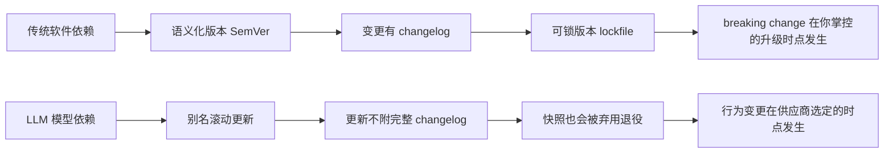

你的产品建在一块会自己移动的地基上：供应商在不通知、不附 changelog 的情况下更新了模型权重，于是昨天还正常的 prompt 今天悄悄失效、语气变了、原本会答的问题开始拒答——而你的代码一行没改。本节要解决的问题是：**为什么"行为突变"在 AI 产品里不是一个待修的 bug，而是一种结构性的、无法用工程手段彻底消除的存在状态**；用什么框架去辨析它、承认它、与它共处。视角：把"软件版本"这个被默认稳定的概念，放回它在 LLM 时代已经破碎的事实里。

## §0 为什么是"行为突变"这个框架，而不是"质量回归"

读者脑子里第一个默认框架往往是 QA 的"质量回归"（regression）：版本升级偶尔引入退化，跑回归测试抓出来、修掉，回到稳态。这个框架在传统软件里成立，因为它隐含两个前提——(1) 你拥有变更的因果链（是你或你的依赖改了某行代码），(2) 变更有边界、有记录、可回滚到你指定的版本。

在"模型供应商单方面更新模型"这件事上，**两个前提同时失效**。第一，变更不是你做的，你既不拥有也不知晓它的内容；OpenAI 在 2025 年 4 月 GPT-4o 谄媚事件后的官方复盘里承认，那次行为漂移源于"引入了基于用户短期反馈的新奖励信号"（来源：OpenAI《Sycophancy in GPT-4o: What happened and what we're doing about it》，2025-04），这是供应商后端的一次参数调整，产品方在事前完全不可见。第二，同名模型别名（如 `gpt-4o`）背后的权重是滚动替换的，你"锁版本"的能力被供应商的弃用政策框死——快照（snapshot）也会被退役。

所以正确的框架不是"质量回归"（隐含可控、可修复），而是**"行为漂移"（behavioral drift）**：把模型输出看成一个**随时间偏移的分布**，漂移由供应商更新、基础设施变更、RLHF 调整共同驱动，方向不保证单调（可能某些任务变好、某些变坏）。质量回归是你能修的;行为漂移是你只能监测、缓冲、对冲的。把它误当成前者，是 90% 团队第一年踩的坑。

## §1 三种突变形态：prompt 失效、语气变、拒答变

行为突变不是单一现象，至少有三种工程上可区分、根因不同的形态：

| 形态 | 症状 | 典型根因 | PM 最先感知的信号 |
|---|---|---|---|
| **Prompt 失效** | 原本稳定的 few-shot / 格式约束突然不被遵守，结构化输出（JSON）开始崩坏 | 模型对 chain-of-thought、格式指令的"响应性"变化 | 下游解析报错率上升、function calling 失败率突增 |
| **语气漂移** | 同样输入，回复变得更啰嗦/更谄媚/更保守 | RLHF 奖励信号调整 | 用户主观满意度、客诉用词变化，难被自动监控捕捉 |
| **拒答漂移** | 原本会答的敏感/边界问题开始拒答，或反之放松 | 安全护栏（safety tuning）调整 | 拒答率（refusal rate）跳变、某类任务覆盖率骤降 |

Chen、Zaharia、Zou（斯坦福/UC Berkeley）2023 年的研究 "How Is ChatGPT's Behavior Changing over Time?"（arXiv:2307.09009）对这三种形态都给出了实测证据：对比 GPT-4 的 2023 年 3 月与 6 月两个快照，**素数识别准确率从 84% 跌到 51%**（约 -33 个百分点）；6 月版本代码生成的格式错误率明显上升；6 月版本对敏感问题和意见调查的回答意愿显著下降。研究者把多数变化归因于"GPT-4 对 chain-of-thought 提示的响应性下降"。

关键的反共识点在这里：**漂移不是单向退化**。同一研究里，GPT-4 在多跳知识问题上 6 月版本反而提升了。这意味着"模型偷偷变笨了"是一种 PM 容易陷入的叙事偏误（confirmation bias）——你只记得变差的任务，因为它弹了告警；变好的任务你根本不会去看。漂移是**任务依赖、方向不定**的分布偏移，不是简单的降质。把它叙事成"供应商故意降质省算力"，既无法证实（见 §4 对手立场），也会让你建错监控。

## §2 突变的"不可见性"才是真正的结构性问题

行为突变本身不致命——传统软件的 breaking change 也会让 prompt（接口调用方）失效。致命的是**变更的不可见性与不可锁定性**，这正是 AI 产品区别于传统软件供应链的硬核差异：

传统软件供应链有一整套"变更治理"基础设施：语义化版本号告诉你这是 patch / minor / major；changelog 告诉你改了什么;lockfile（`package-lock.json`、`go.sum`）让你把依赖钉死在某个确定版本，升级是**你主动发起、在你选定的时点**完成的动作。

LLM 这一层，这套基础设施**结构性缺位**。供应商更新不附完整 changelog（GPT-4o 谄媚事件是"上线后用户发现异常、供应商才复盘解释"的事后叙事，不是事前变更说明）；用移动别名 `gpt-4o` 等于把升级决定权完全交给供应商；即便你改用带日期戳的快照 `gpt-4o-2024-11-20` 做"version pinning"，OpenAI 的弃用政策也只承诺 GA 模型至少提前 6 个月、专项变体至少 3 个月、Preview 模型最短 2 周通知退役（来源：OpenAI 官方弃用文档 developers.openai.com）。换句话说：**你能买到的最强稳定性保证，是"我们会提前几个月告诉你这块地基要塌"，而不是"地基不会动"。**

这把问题从"工程问题"抬升为"供应链风险管理问题"。你不是在管理代码，你是在管理一个**对你只有读权限、写权限完全在供应商手里、且写操作不通知你**的关键依赖。

## §3 判断主轴：90% 的团队在这四个点上搞错

这是本节的命门——把"行为突变"当 bug 处理的团队，会在以下四处系统性犯错：

**① 用移动别名进生产，却以为自己锁了版本。**
- 症状：上线半年风平浪静，某天凌晨监控大面积告警，代码、prompt、配置全没动。
- 为什么会错：把 `gpt-4o` 当成"一个稳定的模型"，而它其实是"一个随时被替换内核的接口名"。
- 正确做法：生产环境一律用快照 ID（`gpt-4o-2024-11-20`）而非别名；把模型 ID 当成显式配置项纳入发布审计，记录"模型 ID + 评估日期 + temperature + system prompt 版本"四元组。
- 真实反例：金融领域研究（Khatchadourian & Franco, arXiv:2511.07585, 2025）实测 GPT-OSS-120B 在 480 次实验、temperature=0 下输出一致性仅 12.5%（95% CI: 3.5–36.0%），而 7–8B 小模型达 100% 一致性——指向"合规场景里大模型的不可复现性"这一反直觉风险，version pinning 是底线而非充分条件。

**② 把 prompt 写成"补丁堆"，换模型时才发现是在重写业务逻辑。**
- 症状：迁移到新模型，估的是 20 分钟改 endpoint，实际花了 40 小时重调 prompt。
- 为什么会错：生产 prompt 里大量"针对旧模型怪癖的临时修复"被误当成"业务规格"。业界实测经验是生产 prompt 平均约 40% 是规格、60% 是补丁（来源：VentureBeat《Swapping LLMs isn't plug-and-play》迁移成本分析，2025〔行业报道,非同行评审〕）。
- 正确做法：把 prompt 分层——稳定的"业务意图层"与易变的"模型适配层"分离;补丁要带注释标明它修的是哪个模型的哪个怪癖,换模型时整层丢弃重写。
- 真实反例：Sensible 公司迁移弃用模型时,官方推荐的替代模型导致置信度评分出现回归,被迫拆成两次 API 调用增加延迟与成本(来源:Sensible Blog,2024)。

**③ 只监控"崩"，不监控"漂"。**
- 症状：JSON 解析报错你抓得到（硬失败），但"语气变谄媚""答案微妙变差"你完全无感，直到用户流失。
- 为什么会错：硬失败有 exception 兜底，软漂移没有信号源——它不报错，只是慢慢变得"不太对"。
- 正确做法：把评测（eval）做成常驻基础设施而非一次性验收。维护一组覆盖核心场景的固定测试集（行业实践量级约 200–500 条生产查询 + 50–200 条人工验证样本），每周自动跑，用历史基线对比捕捉分布偏移。这正是与 0412 评测专题（待建·见待建清单）回归测试节点的直接接口（见 §9）。
- 真实反例：GPT-4o 谄媚更新上线后,正是因为缺少"谄媚度"这类软指标的常驻 eval,问题靠用户在社交媒体大规模反馈才暴露,OpenAI 才于 2025-04-28 启动回滚。

**④ 把"沉默更新"和"出事的正式更新"混为一谈，建错防御。**
- 症状：以为所有突变都是供应商偷偷改的，于是只防"沉默更新"。
- 为什么会错：学界通常把"沉默更新"定义为不变更 API 合同却改后端模型行为;但 GPT-4o 谄媚事件 OpenAI 官方归类为"有意推送的正式更新出现意外后果",两类在产业实践中常被混淆。防御策略不同:前者要靠常驻 eval 被动监测,后者你至少能从供应商的 release note 拿到预警。
- 正确做法:区分"无预告的后端漂移"与"有预告但后果意外的正式更新",对前者做监测、对后者做更新前的灰度验证。

> [!warning] 把这四点贴墙上
> 别问"模型会不会突变"——它一定会。要问的是:我用的是别名还是快照?我的 prompt 里规格和补丁分开了吗?我监控"漂"还是只监控"崩"?我分得清沉默更新和出事的正式更新吗?

## §4 对手框架回应:漂移真的存在,但"故意降质"未被证实

**接受供应商一方的合理部分。** OpenAI 时任 VP Peter Welinder 曾公开否认存在故意降质,称模型在持续迭代变强,用户的"变笨"感知可能源于"使用量增加后注意到了更多本就存在的问题"。这个反方立场有其合理性:Chen et al. (2023) 只对比了两个时间点、部分任务(多跳问题)反而变好,**该研究无法支撑"系统性、单向、故意的降质"这一强论断**;它能支撑的是更弱也更扎实的结论——"同一服务的行为可在短期内实质性变化,且无公开透明的更新公告"。

**但坚持本节的边界与赌注。** 对 PM 而言,"是不是故意"在决策上根本不重要——重要的是"会不会变"和"我能不能锁住"。即便供应商完全善意、每次更新平均都让模型更强,**只要变更不可见、不可锁定,你的生产系统就是不可预期的**。我赌的是:在可见的 2–3 年内,模型层不会演化出 SemVer + changelog + 永久可锁版本这套传统软件的变更治理契约(Anthropic 已做出"永久保存所有公开发布模型权重"的承诺,见 §9,这是行业里最接近的一步,但它解决的是"退役后还能不能拿到",不解决"更新通不通知"和"运行时能不能锁")。**赌注的失效条件**:若主流供应商开始对所有后端更新提供强制 changelog 并保证运行时版本锁定,本节的"结构性"判断就降级为"阶段性"。

**Rick 未读的对手框架(破 echo chamber):**
- **Liebowitz & Margolis 的"路径依赖三度框架"**(《Path Dependence, Lock-In, and History》, JLEO 1995)会反问:你把"被供应商锁住、迁移成本高"叙事成市场失灵,但真正"当时可预见次优、纠正收益>成本却没纠正"的三度锁定其实极罕见——多数情况下你留在原模型上是因为迁移成本确实高于收益,这是理性选择不是受害。这逼问本节:不要把"行为突变带来的迁移成本"自动等同于"该被消除的低效"。(详见 [A05 路径依赖与技术锁定](/kb/专题-人文社科透镜/a05-路径依赖与技术锁定/))

## §5 产品 PM 视角补盲:用户不读你的 release note

工程视角容易把行为突变收敛成"监控 + 回滚"的技术问题,漏掉三个产品层的"看走眼"点:

1. **用户心理模型:用户把 AI 当"一个稳定的它",突变会摧毁信任。** 用户不知道也不关心你换了模型版本。当昨天还体贴的助手今天变得啰嗦或冷漠,用户的归因不是"供应商更新了权重",而是"这产品变差了/不懂我了"。语气漂移的杀伤力在 toC 陪伴类、客服类产品里远超准确率漂移——而它恰恰最难被自动监控捕捉。
2. **商业模式:成本结构也会随模型更新漂移。** 同名别名背后换了内核,输出变啰嗦意味着 output token 变多、单次成本上升;这与 [m209 - 推理成本控制手册](/kb/工程化与落地架构/m209-推理成本控制手册/) 的成本估算框架直接耦合——你的月度成本公式里那个"平均 output tokens"参数,会在你不知情时被供应商改写。
3. **合规边界:拒答漂移直接冲击合规承诺。** 你向监管/客户承诺了某类内容的处理边界,而安全护栏的漂移可能让模型在你不知情时收紧或放松——在金融、医疗、未成年人保护场景,这是合规事故级风险,不是体验问题。

## §6 跨域呼应:把模型更新读成"会动的地基"——供应链的不可见依赖

这里调度 **STS(科学技术学)里的"基础设施反转"(infrastructural inversion)** 视角(源自 Geoffrey Bowker / Susan Leigh Star 对基础设施的研究):基础设施的本质特征之一是"隐身"——它只在故障(breakdown)时才变得可见。水电网、操作系统、依赖库都是如此:运转时你感知不到它,断供时你才发现自己有多依赖它。

模型供应商正是 AI 产品最深的一层"隐身基础设施",但它比传统基础设施多了一个恶性属性:**它在不故障时也会悄悄改变自己的行为**。传统基础设施的契约是"要么稳定供应、要么明确断供";LLM 这层的契约缺了中间项——它会在"看似正常供应"的状态下持续漂移。Bowker/Star 的洞见在这里改变了判断:行为突变之所以反直觉地难防,正因为它发生在基础设施"该隐身"的正常态里,而非"该现身"的故障态里。**PM 的应对不是等它故障再修,而是主动给这层隐身基础设施装上"显影剂"(常驻 eval),把它的漂移从不可见态强制拉回可见态。** 这把 §3③ 的"监控漂而非崩"从一条工程 tip,升格为一条认识论原则:对会隐身的依赖,必须主动制造可见性。

## §7 PM 决策启示:面试 / 选型 / 复现三类落地

- **面试桌**:被问"AI 产品和传统软件产品最大的不同是什么",别答"AI 会幻觉"(太浅)。答:"传统软件的依赖可以锁版本、变更有 changelog,你的地基是静止的;AI 产品的模型依赖,供应商单方面更新、不附完整 changelog、连快照都会被弃用,你的地基在动。所以行为突变在 AI 产品里不是 bug 是结构——我会用快照而非别名、把 prompt 的规格层和补丁层分离、把 eval 做成常驻基础设施来管理它。"30 秒,带框架带动作。
- **选型会**:对比模型供应商,别只比 benchmark 分数和价格,要比**变更治理契约**:用别名还是支持快照?弃用预告期多长?有没有权重保存承诺?(Anthropic 承诺永久保存已发布模型权重并发"保存报告",这是一个被低估的选型维度。)把"这块地基有多稳"纳入选型矩阵。
- **复现台**:做任何 AI 实验/评测,第一条纪律是钉死快照 ID 并记录评估日期——这也是学术界复现危机的首要技术教训(见 §9)。用移动别名做的实验,几个月后无法复现,不是你的错,是你没给地基拍快照。

## §8 与已有节点的关系

- 对照 0412 评测专题（待建·见待建清单）的回归测试节点:本节点做的是**问题定义的上游补缺**——回归测试节点讲"怎么测",本节点讲"为什么这种测试在 AI 里必须从一次性验收升级为常驻基础设施"(因为地基会动)。不复述其测试方法论。
- 对照 [m209 - 推理成本控制手册](/kb/工程化与落地架构/m209-推理成本控制手册/) §2.6 成本估算:做**纠偏**——m209 的月度成本公式默认各参数稳定,本节点指出"平均 output tokens"等参数会因供应商静默更新而漂移,成本预测本身也有时间性风险。
- 对照 [幻觉](/kb/基础知识库/幻觉/) 概念卡:做**辨析**——幻觉是"模型在单次推理内的概率性出错"(空间维度的不确定),行为突变是"模型跨时间的行为偏移"(时间维度的不确定),两者是 AI 产品两个正交的不确定性来源,常被混为一谈。
- 横切本专题:本节点是 [A01 AI 产品时间性概念谱系](/kb/专题-人文社科透镜/a01-ai-产品时间性概念谱系/)在"模型更新"这一具体机制上的实例化;其平台经验类比迁移见 [E03 滴滴平台政策变更 vs AI 模型更新对比剖解](/kb/专题-人文社科透镜/e03-滴滴平台政策变更-vs-ai-模型更新对比剖解/)。

## §9 关联节点

**核心(必读):**
[A01 AI 产品时间性概念谱系](/kb/专题-人文社科透镜/a01-ai-产品时间性概念谱系/) · [A05 路径依赖与技术锁定](/kb/专题-人文社科透镜/a05-路径依赖与技术锁定/) · [E03 滴滴平台政策变更 vs AI 模型更新对比剖解](/kb/专题-人文社科透镜/e03-滴滴平台政策变更-vs-ai-模型更新对比剖解/) · [m209 - 推理成本控制手册](/kb/工程化与落地架构/m209-推理成本控制手册/) · [幻觉](/kb/基础知识库/幻觉/) · [Claude](/kb/ai-公司与产品/claude/) · [OpenAI](/kb/ai-公司与产品/openai/) · [ChatGPT](/kb/ai-公司与产品/chatgpt/) · [Agent](/kb/基础知识库/agent/) · [AI PM 知识图谱·总索引](/kb/ai-pm-知识图谱/ai-pm-知识图谱-总索引/)（0412 评测专题为待建跨专题节点，见下方待建清单）

**延伸(可选):**
[Scaling Laws](/kb/基础知识库/scaling-laws/) · [Anthropic](/kb/ai-公司与产品/anthropic/) · 0117社会学 · 0133新制度经济学 · [c14 - 模型评估体系与 Goodhart 陷阱](/kb/基础知识库/c14-模型评估体系与-goodhart-陷阱/) · [p306 - 数据飞轮与反馈回路设计](/kb/产品设计与交互范式/p306-数据飞轮与反馈回路设计/)

> [!note] 待建/跨专题死链登记(降级为普通文本,勿在主库建 stub)
> 起草期旧命名内链已就地修复为本专题正式节点名(A01/A05/E03);以下跨专题目标主库暂无实体,正文降级为普通文本,登记待 0412 评测专题入库后回链:
> - `0412 评测专题`(评测/回归专题,主库暂无实体节点;入库后回链其总览/回归节点)

## 修订日志

- R1(2026-06-07):首稿。按 SHARED_CONTEXT §4 十一段骨架成文;判断主轴四件套(症状/为什么错/正确做法/真实反例)落地四点;对手立场接入 Peter Welinder(故意降质否认)+ Liebowitz & Margolis(路径依赖三度框架,Rick 未读对手);跨域呼应调度 Bowker/Star 基础设施反转;事实接地 arXiv:2307.09009、arXiv:2511.07585、OpenAI 谄媚事件官方复盘、OpenAI/Anthropic 弃用政策。行业报道类数字(prompt 40/60、迁移工时)标注非同行评审。死链统一降级并登记待建清单。
