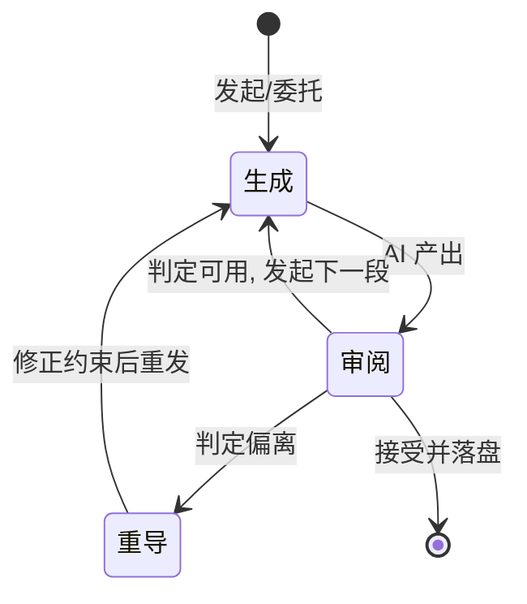

# A04 注意力分配的隐性算法

与 AI 协作时，人的注意力到底在哪里被消耗？不是"我用了多少 AI"，而是"AI 把我的注意力从哪里挪到了哪里"——本节用**注意力调度（attention scheduling）**这个框架，主张一个反共识的判断：在 power user 的 AI 工作流里，注意力不是被 AI **节省**的，而是被 AI **重新分配**的；而且这种再分配遵循一套连本人都未必能口头说清的**隐性算法**——它可观察、可建模、且是真实瓶颈（接 [0418 审阅瓶颈专题](/kb/专题-评测与度量/_审阅瓶颈系统化专题-总览/) 的延长线）。把这套隐性算法显式化，正是自我民族志在"AI 使用"这个题材上独一无二的价值。

## §0 为什么是"注意力调度"框架，而不是"生产力提升"框架

读者脑中的默认框架是**生产力账本**：AI 帮我写，所以我省下时间，净产出上升。这个框架在 power user 身上系统性失真，必须先挡掉。

生产力账本把"省下的写作时间"记为收益，却把"省下的时间被注意力转移吃掉"记为零。真实情况是：当生成成本趋近于零，**注意力的稀缺性不降反升**——因为现在你要审的东西变多了，而审阅几乎无法被 AI 代劳（这是 [0418 审阅瓶颈专题](/kb/专题-评测与度量/_审阅瓶颈系统化专题-总览/) 的核心命题）。所以正确的会计单位不是"时间"，而是"注意力的去向"。

我选"注意力调度"而非另外两个邻近框架，理由如下：

| 候选框架 | 它会怎么描述 AI 协作 | 为什么不够用 |
|---|---|---|
| 生产力提升（time-saving） | "AI 替我干活，我省时间" | 把注意力当成无限资源，看不见审阅瓶颈，对 power user 失真最严重 |
| 认知卸载（cognitive offloading） | "我把记忆/计算外包给 AI" | 只描述"卸载什么"，不描述"卸载后注意力流向哪"——缺少调度维度 |
| **注意力调度（本节）** | "AI 改变了我注意力在生成/审阅/重导三态之间的分配比例与切换频率" | 把注意力当成有限、可被调度、有切换成本的资源——能解释审阅为何成为瓶颈，且可建模 |

"注意力调度"是操作系统的隐喻：CPU（你的注意力）是单核的、可抢占的，AI 是一堆并发进程不断抛出待处理的中断（生成结果、待审 diff、偏题输出）。**问题不是 CPU 算得快不快，而是调度策略对不对、上下文切换贵不贵。** 这正是 power user 与普通用户的真正分野——普通用户被 AI 的中断牵着走，power user 在设计自己的调度器。

## §1 三态模型：生成 / 审阅 / 重导

把 AI 协作中的注意力拆成三个互斥状态，是本节的最小建模单元：

- **生成态（Generation）**：注意力在"如何让 AI 产出我要的东西"——写 prompt、设约束、调度 skill。成本特征：前置投入高（设计指令），但单位产出的边际注意力低。
- **审阅态（Review）**：注意力在"AI 产出对不对、好不好、要不要"。成本特征：**几乎无法委托、与产出量成正比、是真实瓶颈**。这是 [0418 审阅瓶颈专题](/kb/专题-评测与度量/_审阅瓶颈系统化专题-总览/) 锚定的状态。
- **重导态（Redirect）**：注意力在"AI 偏了，我怎么把它拉回来"——诊断偏离原因、修补约束、决定是局部修还是推倒重来。成本特征：**切换成本最高**，因为它要求同时持有"我原本要什么"和"AI 实际给了什么"两个表征做 diff。

判断密度落点：三态中，**只有生成态的成本被 AI 显著降低；审阅态成本随产出量线性上升；重导态成本几乎不变甚至上升**（因为更强的模型产出更"像对的"，诊断偏离更难）。这就解释了一个反直觉现象——AI 越强，注意力越累。这与 Parasuraman & Manzey（2010, *Human Factors*, "Complacency and Bias in Human Use of Automation"）描述的自动化情境一脉相承：自动化降低了执行成本，却把人的负担转移到了**监督**上，而监督是注意力密集的。

## §2 隐性算法：可观察的调度规则

"隐性算法"不是比喻噱头，而是一个可证伪的主张：**power user 的注意力调度遵循稳定的、可从行为中反推的规则，即便本人未必能口头陈述。** 这正是 Polanyi 意义上的默会知识——"我们知道的比我们能说出的多"（参见 [Polanyi 默会知识与提示工程的认识论张力](/kb/基础知识库/polanyi-默会知识与提示工程的认识论张力/)）。自我民族志的任务，就是把这套调度器从行为里**逆向工程**出来。

从 Rick 本工厂项目（0412-0423，本身就是一个可观察的 meta-case）的真实产物里，可以反推出至少四条候选调度规则：

| 候选规则 | 可观察证据（本工厂/vault 真实产物） | 待 Rick 内省验证的部分 |
|---|---|---|
| **R1 沙盒优先于审阅**：把审阅推迟到"批量产出落定后"再集中进行，而非逐条实时审 | vault CLAUDE.md 原则四"三步 ingestion"：AI 产出一律先入 `_ai_review/` 沙盒，Rick 审后才 move（见 PKM 设计哲学与演化史） | 集中审 vs 实时审的主观体感差异，是注意力策略还是仅是流程产物？ |
| **R2 元层干预优于实例级修补**：注意力优先投向"改 prompt/记忆/架构"这类一次投入、长期复用的杠杆点，而非逐条改输出 | 过拟合诊断用 ML 术语做元层干预（[AI 记忆过拟合与泛化能力](/kb/基础知识库/ai-记忆过拟合与泛化能力/)）；memory 从 blocklist → allowlist 的治理转型（[Claude routines 调研与 memory allowlist 设计](/kb/产品/claude-routines-调研与-memory-allowlist-设计/)） | 何时选择"修这一条"vs"改生成器"？这个开关的触发条件是什么？ |
| **R3 over-design 自检**：注意力会周期性地从"建设"切到"审视自己建的东西是不是太多了" | 12-agent → v1.4 主动塌缩，A/B/C/D 判别框架（见 PKM 设计哲学与演化史）；trip-structure skill 的 over-design → 收敛轨迹（[trip-structure skill](/kb/ai-协作方法论/trip-structure-skill/)） | 这种自检是定期触发、阈值触发，还是疲劳触发？ |
| **R4 现场即问的注意力前移**：在田野现场把 AI 当作"即时分析器"，把本该事后做的审阅/分析压到现场 | 0412-0423 旅途中实时调度 trip-discover / intellectual-lens，现场对话直接产出升格笔记（如 NMAAHC 深度导览与 AI 表达元批评） | 现场即问是否改变了旅行/田野体验的深度或方向感？ |

> [!warning] 接地纪律
> 上表左栏（证据）是文件、对话、时间戳可查的**可观察行为**；右栏是需要 Rick 内省才能确认的**主观调度依据**。本节绝不替 Rick 编造右栏的内容——把它显式留为待填，正是自我民族志的诚实做法（不把研究者的内省伪装成已知事实）。

〔Rick 待填：上面四条候选规则，哪些是你真实的调度习惯，哪些是 agent 从产物里过度归纳的"假规则"？请就每条标注"成立/部分成立/不成立"，并补一句你实际的决策依据。〕

## §3 切换成本：调度器最贵的隐藏开销

三态模型最容易被忽略的是**态与态之间的切换成本**。注意力不是无损切换的：从"生成态"切到"审阅态"，要把脑子从"我想要什么"切换到"它给了什么"；这是两种几乎相反的认知姿态（发散 vs 收敛、创造 vs 批判）。

操作系统里，上下文切换要保存/恢复寄存器；人的注意力切换要保存/恢复"意图表征"。频繁的小批次交互（生成一段、审一段、再生成）= 高频上下文切换 = 寄存器反复存取的开销，可能吃掉所有"生成提速"的收益。这给出一个可操作的设计原则，也解释了为何 R1（沙盒优先、批量审阅）是理性的：**批处理（batch）优于交互式（interactive），因为它摊薄了切换成本。** vault 的"三步 ingestion"在事后看，正是一个降低注意力切换频率的调度优化——无论 Rick 当初是否如此自觉。

判断主轴在此显形：**90% 的 AI 协作低效，不在生成质量，而在切换调度上的三个错位——**

| 症状 | 为什么会错 | 正确做法 | 真实反例 |
|---|---|---|---|
| 每生成一小段就立刻审，全程在两态间高频跳 | 误以为"及时审"=高质量；实则切换成本吃掉收益，且每次审都是浅审 | 攒成批，进入"审阅模式"一次性深审（R1 沙盒优先） | 三步 ingestion：先批量入 `_ai_review/`，再集中审（PKM 设计哲学与演化史） |
| 输出偏了就在审阅态里"手动改成对的" | 把重导误当审阅，注意力耗在缝补单个产物，不改生成器 | 切到重导态，诊断偏离的**结构性原因**，改 prompt/约束/记忆（R2） | 过拟合诊断：不改单条输出，改记忆解耦"偏好"与"审美"（[AI 记忆过拟合与泛化能力](/kb/基础知识库/ai-记忆过拟合与泛化能力/)） |
| 持续扩建 AI 协作系统，从不回看是否过度工程 | 缺少"审视建设本身"的元态，调度器只有建设没有自检 | 周期性触发 over-design 自检（R3），按"是否需要独立 context 隔离"裁剪 | 12-agent → 5 sub-agent + 6 skill 的 v1.4 塌缩 |

## §4 产品 PM 视角补盲：调度器是可设计的产品界面

跳出"工程效率"视角，注意力调度有三个产品层的"看走眼"点：

1. **用户心理模型错位**：大多数 AI 产品的交互设计默认"交互式聊天"，把用户钉死在高频切换的小批次模式里。这对 power user 是反优化的——他们需要的是 batch 友好的界面（沙盒、暂存区、批量审阅视图）。Obsidian + `_ai_review/` 沙盒之所以好用，恰恰因为它无意中提供了一个 batch 调度容器。**产品机会：为"注意力批处理"而非"对话流畅度"设计的 AI 工作台。**
2. **审阅成本的不可见性**：产品仪表盘普遍统计"生成了多少 token / 节省了多少时间"，几乎没有产品统计"用户在审阅上花了多少注意力"。这制造了一个度量盲区——把成本最高的状态当成零成本。Anthropic 对百万级 Claude 对话的隐私保护分析、OpenRouter（2026）对逾百万亿 token 交互的分析（来源：OpenRouter "State of AI" 报告），都偏重生成侧的量化，审阅侧的注意力消耗在行为日志里几乎是不可见的——这正是 usage log 分析的已知局限：日志记录**行为**，不记录**审阅时的认知负荷与意图**。
3. **合规与责任边界**：当注意力从生成滑向"接受"，责任归属变得模糊。三步 ingestion 的沙盒隔离（AI 写权限不直接污染主区）在产品层是一种**责任分配机制**——它强制审阅态发生，把"接受"变成一个显式动作而非默认行为。这对任何高 stakes 的 AI-augmented 工作流都是可迁移的设计模式。

## §5 对手框架回应：extended mind 与"注意力本就是分布式的"

最强的反方来自认知哲学的 **extended mind 论题**（Clark & Chalmers, 1998, "The Extended Mind", *Analysis*, 58(1)）。其主张：认知过程本就不局限于颅内，工具（笔记本、计算器、乃至 AI）在满足某些条件时是认知系统的**真正组成部分**，而非外部辅助。按此立场，"注意力在我和 AI 之间分配"是个伪问题——根本没有一条清晰的"我/AI"边界，注意力本就是分布在人-工具耦合系统里的。

> [!note] 接受 + 边界
> **接受的部分**：extended mind 的洞察是对的——把 AI 当成"外部工具"而非"认知系统的一部分"，会低估耦合之深。Rick 的 skill 设计（把 procedural knowledge 文档化封装进 [Skill 系统的本质](/kb/ai-协作方法论/skill-系统的本质/)）正是在主动地把认知功能外置到耦合系统里，这是 extended mind 的活样本。
> **坚持的边界**：但 extended mind 化解不掉**审阅瓶颈**。即便认知是分布式的，"判断 AI 产出对不对"这个功能至今**无法外置**——它必须由人的注意力承担（否则就是让 AI 审 AI，循环论证）。Clark & Chalmers 的"对等原则"（parity principle）要求外置部分与内部部分功能对等，而审阅恰恰是那个**不对等**的功能：你可以把记忆、计算、生成外包给耦合系统，但把"信任校准"（trust calibration, Lee & See, 2004, *Human Factors*）外包出去，就等于放弃了调度权。所以注意力分配不是伪问题，而是**耦合系统里唯一不能被进一步分布出去的那个核**。
> **我赌的是什么**：我赌"审阅这一态在可见未来不可委托"。如果出现了可信的"AI 审 AI 且人能验证元规则"的机制（amplified oversight 方向，参见 Jain, Bridgers, Janzer et al., 2025, arXiv:2510.26518 "Human-AI Complementarity: A Goal for Amplified Oversight"，DeepMind Safety Research），这个赌注会部分失效——届时注意力会从"逐条审"上移到"审审阅规则"，三态模型需要加一个"元审阅态"（Jain, Bridgers, Janzer et al. 2025 的实证发现支持这一方向：组合人类与 AI 评分优于任一单独方案，但呈现方式不当会诱发过度依赖）。

**failure scenario**：三态模型在"低 stakes、可丢弃产出"场景下会失真——比如用 AI 头脑风暴一次性创意，审阅态可以坍缩到近乎零（反正都是草稿）。此时注意力调度退化为纯生成态，本节的瓶颈论不成立。

## §6 跨域呼应：从 extended mind 到注意力的政治经济学

承上节，extended mind 给了本节最关键的认识论升级：**它把"注意力分配"从一个人因工程问题，重构成一个"认知系统边界在哪里"的哲学问题。** 一旦承认 AI 是认知系统的一部分，"注意力的隐性算法"就不再是"人如何使用工具"，而是"分布式认知系统如何调度它唯一的串行瓶颈资源"——这个重构直接改变了我们对 R1-R4 的解读：它们不是 Rick 的个人习惯，而是**任何深度人-AI 耦合系统都会演化出的调度策略**，Rick 只是把它显式化得比别人早。

再叠一层社会学视角（链入 0117社会学）：注意力是稀缺资源，谁定义"什么值得审"就掌握了权力。AI 通过决定"先生成什么、怎么呈现待审项"，实际上在**为人的注意力排序**——这是一种隐性的议程设置。Rick 的 memory allowlist 治理（[Claude routines 调研与 memory allowlist 设计](/kb/产品/claude-routines-调研与-memory-allowlist-设计/)）从这个角度看，是一次**夺回注意力议程权**的行动：通过控制 AI 记住什么，控制 AI 会把什么推到审阅队列的前面。这就是为什么"调度器是谁设计的"是个权力问题，而不只是效率问题。

## §7 PM 决策启示

- **面试怎么用**：当被问"AI 会不会取代 PM"，不要答"不会，因为创造力"。答："AI 把成本从生成转移到了审阅与重导，而这两态恰恰是 PM 的核心——判断什么值得做、把跑偏的方向拉回来。AI 越强，这两态越值钱。"（带框架、带反直觉判断）
- **选型怎么用**：评估 AI 工具时，别只比生成质量，要问"它的交互模式是 batch 友好还是 interactive 强制"。一个强制高频切换的工具，对 power user 是负优化。把 §3 的切换成本表当作选型 checklist。
- **复现怎么用**：搭自己的 AI 工作流时，第一优先级不是接最强的模型，而是建一个**降低注意力切换频率的调度容器**（沙盒 + 批量审阅 + 元层干预入口）——即把 R1/R2 工程化。vault 的三步 ingestion 是一个可抄的最小模板。

## §8 与已有节点的关系

- 对 [0418 审阅瓶颈专题](/kb/专题-评测与度量/_审阅瓶颈系统化专题-总览/)：**深化**。0418 锚定"审阅是瓶颈"这一事实；本节点把它放进"生成/审阅/重导"三态模型里，给出瓶颈的**结构性位置**与可建模的调度规则，并把 Rick 的审阅行为列为该命题的一手数据来源。不复述 0418 的瓶颈论证。
- 对 [Polanyi 默会知识与提示工程的认识论张力](/kb/基础知识库/polanyi-默会知识与提示工程的认识论张力/)：**对话**。Polanyi 节点讲"提示工程是把默会知识显式化的尝试"；本节点把同一认识论张力用到**注意力调度**上——隐性算法正是注意力层面的默会知识，自我民族志是它的显式化工具。
- 对 **0414 Claude Code 体感专题**（邻接专题，尚未在 vault 落成可链接的 synthesis 节点）：**对照升级**。0414 是 Rick 使用 Claude Code 的一手体感记录；本节点把那种"体感"抽象成可建模的三态调度，体感是数据，三态模型是从数据里逆向出的结构。
- 对 **0422 民族志方法专题**（邻接专题，尚未在 vault 落成可链接的 synthesis 节点）：**方法论对接**。0422 给出民族志/自我民族志的方法学基础（厚描述、反身性、Anderson 2006 分析式五特征）；本节点是该方法在"注意力"这一具体对象上的一次落地，R1-R4 的"可观察证据 + 待填内省"结构正是分析式自我民族志"完整成员研究者 + 分析性反身性"的实操。
- 对 [Skill 系统的本质](/kb/ai-协作方法论/skill-系统的本质/)：**补缺**。Skill 节点讲"为什么要把能力封装成 skill"；本节点补上"封装 skill 是一种把注意力从重导态前移到生成态的调度优化"这一注意力会计视角。

## §9 关联节点

**核心（必读）**
- [0418 审阅瓶颈专题](/kb/专题-评测与度量/_审阅瓶颈系统化专题-总览/) — 本节点的事实锚，审阅为何是真实瓶颈
- [Polanyi 默会知识与提示工程的认识论张力](/kb/基础知识库/polanyi-默会知识与提示工程的认识论张力/) — 隐性算法的认识论基础
- 0422 民族志方法专题（邻接专题，待落库）— 把隐性算法显式化的方法学
- [Skill 系统的本质](/kb/ai-协作方法论/skill-系统的本质/) — 封装作为注意力调度优化
- PKM 设计哲学与演化史 — 三步 ingestion / over-design 自检的一手史料

**延伸（可选）**
- 0414 Claude Code 体感专题（邻接专题，待落库）— 注意力体感的一手数据
- [AI 记忆过拟合与泛化能力](/kb/基础知识库/ai-记忆过拟合与泛化能力/) — R2 元层干预的真实案例
- [Claude routines 调研与 memory allowlist 设计](/kb/产品/claude-routines-调研与-memory-allowlist-设计/) — 注意力议程权的夺回
- [trip-structure skill](/kb/ai-协作方法论/trip-structure-skill/) — R3 over-design 自检的微观轨迹
- NMAAHC 深度导览与 AI 表达元批评 — R4 现场即问的产物证据
- [AI PM 知识图谱·总索引](/kb/ai-pm-知识图谱/ai-pm-知识图谱-总索引/) — 回到知识图谱主入口

## 修订日志

- R0（2026-06-07）：首稿。建立"生成/审阅/重导"三态模型 + 隐性算法四规则（R1-R4，可观察证据 + Rick 待填内省）；判断主轴落在切换成本三错位；对手框架接入 extended mind（Clark & Chalmers 1998，接受+边界+赌注）；跨域呼应 extended mind → 注意力政治经济学；与 0418/0422/0414/Polanyi/Skill 五节点显式升级对照。已核实：Jain, Bridgers, Janzer et al. 2025 arXiv:2510.26518（WebFetch 验证，DeepMind Safety Research）。待 Rick 填项 1 处（§2 四规则的真伪标注）。
