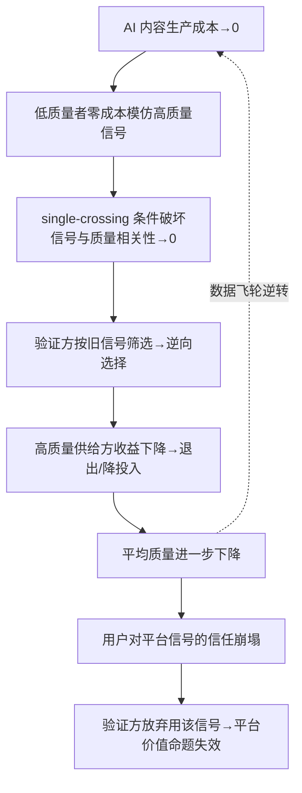

简历筛选、学术同行评审、内容平台、电商评价——这一整类产品的价值命题，本质都是「替信息劣势方做信号验证」。它们靠的不是自己生产内容，而是**用海量 UGC（用户生成内容）的质量分布做信号**：筛掉柠檬、抬出珍珠。本节点要回答的问题是：当 AI 把内容生产的边际成本压到趋近于零，这类产品赖以成立的 [Spence 信号理论](/kb/专题-人文社科透镜/a01-信号理论概念谱系与语义/)分离条件被抽掉之后，它们面临的不是「内容质量下降」这种运营麻烦，而是**价值命题失效**这种产品级的新失败类别。本节的框架是「信号坍缩 = 平台价值命题失效」——把它和 [失败考古学专题](/kb/专题-安全对齐与失败/_失败考古学系统化专题-总览/) 的失败分类框架（"能力失败 vs 价值失败"）对接，把它和 [p306 - 数据飞轮与反馈回路设计](/kb/产品设计与交互范式/p306-数据飞轮与反馈回路设计/) 那套「飞轮转动 vs 飞轮逆转」的动力学对接。

## §0 为什么是「价值命题失效」这个框架，而不是「内容审核」框架

第一个要挡掉的错误框架是：**把 AI 内容泛滥当成一个「内容审核 / 反垃圾」问题。**

这是 90% 的产品经理本能反应：内容质量下降了？那就加检测、加过滤、加人审、上模型识别 AI 痕迹。这个框架把问题归到「运营成本」象限——是个累活，但不动摇产品的存在理由。

但这个框架错在它默认了**信号还在，只是噪声变多了**。信号理论告诉我们的恰恰相反：当低能力者发出高质量信号的成本从「30–60 分钟写一封定制求职信」掉到「10 秒一个 prompt」（Galdin & Silbert, 2025, arXiv:2511.08785，下文详证），分离均衡的**单交叉条件**（single-crossing condition）被破坏——不是噪声变多，而是**信号与底层质量的相关性本身归零**。一个相关性为零的信号，过滤得再干净也无法承载它原本的功能。

所以正确的框架是 [失败考古学专题](/kb/专题-安全对齐与失败/_失败考古学系统化专题-总览/) 的失败分类框架里的「价值命题失效」：用户来这个产品，是因为它**承诺帮你完成一次可信的能力推断**（这份简历背后是个能干的人 / 这篇论文是真研究 / 这个 5 星评价是真用户）。当承诺无法兑现，产品不是「变差了」，而是**那条价值命题不再为真**。这是一类比「功能没做好」更深的失败——做对了所有功能，价值命题依然塌掉。

> [!note] 框架辨析一句话
> 内容审核框架问的是「怎么把脏内容洗掉」；信号坍缩框架问的是「就算洗干净，这个信号还能区分类型吗」。前者是运营题，后者是产品存亡题。

## §1 哪些产品在「靠 UGC 质量做信号」——四个同构案例

把看似无关的四类产品放进 [Spence 信号理论](/kb/专题-人文社科透镜/a01-信号理论概念谱系与语义/)的同一个模具，它们的结构是一致的：都有一个**信息劣势的验证方**，靠观测**信息优势方主动发出的内容信号**来推断不可直接观测的底层质量。

| 产品 | 验证方 | 信号载体（UGC） | 被推断的隐藏质量 | 分离条件原本靠什么成立 |
|---|---|---|---|---|
| 简历筛选 / ATS | HR / 招聘经理 | 简历、求职信、作品集 | 候选人真实能力 | 写出对口、有细节的材料对低能力者更费劲 |
| 学术同行评审 | 审稿人 / 期刊 | 论文（引言、方法、引用） | 研究的真实性与价值 | 编出一篇通过专家拷问的论文成本极高 |
| 内容平台 | 推荐算法 + 读者 | 帖子、长文、回答、图片 | 创作者的真实见解 / 经验 | 持续产出有信息量的内容需要真本事 |
| 电商评价 | 买家 | 评分、评论、买家秀 | 商品真实质量 | 写出可信的真实使用体验需要真用过 |

这四个产品过去几十年的繁荣，**全部押注在同一个隐含假设上**：内容生产成本与内容质量正相关，且对高质量者更低。LinkedIn 的护城河是「真实职业身份 + 真实内容」；豆瓣 / 大众点评的护城河是「真实用户的真实评价」；arXiv / 顶会的护城河是「同行验证过的真知识」。它们卖的不是内容本身，**卖的是「这内容可信」这件事**。AI 抽掉的正是这个隐含假设。

## §2 坍缩的传导链——从成本归零到飞轮逆转

信号坍缩在产品内部不是一次性事件，而是一条可观测的传导链。把它画成一张图，对接 [p306 - 数据飞轮与反馈回路设计](/kb/产品设计与交互范式/p306-数据飞轮与反馈回路设计/) 的飞轮模型：

关键在那条虚线：**[p306 - 数据飞轮与反馈回路设计](/kb/产品设计与交互范式/p306-数据飞轮与反馈回路设计/) 描述的正反馈飞轮（更多用户→更多内容→更好信号→更多用户）在这里整条反向运转**。p306 教 PM 怎么让飞轮越转越快；A05 揭示的是同一个飞轮的**逆转模式**——这正是 p306 的显式升级：它把「飞轮可能逆转」从一个抽象警告，落成「信号坍缩」这个具体的、有实证量化的逆转触发器。不复述 p306 的飞轮机制，只补它没写的那一半：飞轮的轮齿是「信号可信度」，AI 锈蚀的就是这颗轮齿。

实证锚点（已核实，来自 Galdin & Silbert, 2025, arXiv:2511.08785 *Making Talk Cheap*）：用 Freelancer.com 的结构化计量模型反事实推断，LLM 引入后，**最高能力五分位工作者的录用率下降 19%，最低五分位上升 14%**——市场显著变得「更不唯才是举」。这不是质量下降的渐变，这是分离均衡塌成混同均衡的相变。Cui, Dias & Ye（2025, arXiv:2509.25054）用双重差分进一步量化：求职信的**信息含量下降 51%**，雇主随即转向依赖求职者既往工作记录。

## §3 三个领域的坍缩证据（同机制、异路径）

坍缩机制相同（成本归零→分离失效→逆向选择），但三个领域的可观测形态和恢复路径各异。

**学术同行评审：** 这是最触目惊心的样本，因为它本应是「人类专家亲自验证」的最强信号系统。规模数据（来自 *Frontiers in Research Metrics*, 2025）：2024–25 年 **2,100+ 篇论文因 AI 生成内容被撤稿，2,300+ 篇涉及论文工厂**。更说明问题的是 Ansari（2026, arXiv:2602.05930）对 NeurIPS 2025 的审计：**53 篇被接收论文含 100 条 AI 幻觉引用，每篇经 3–5 名专家审阅，竟无一人察觉**。这是「[幻觉](/kb/基础知识库/幻觉/)引用的复合可信性」——多重验证启发式被同时绕过。同行评审作为信号产品，价值命题（「过审 = 可信」）在硬数据面前已部分失效。

**简历筛选：** 64% 招聘人员在 2024–25 察觉「千篇一律」的 AI 简历激增，筛选工作量不降反升（Resume Genius, 2025）；83% 公司用 AI 简历筛选，67% 承认存在算法偏见（The Interview Guys, 2025）。这是信号坍缩的一个残忍闭环：AI 制造信号 → 平台用 AI 检测信号 → 双方军备竞赛 → **真正的信息（候选人能力）在双向 AI 中蒸发**。

**内容平台与电商评价：** 仅 41% 美国人相信网上读到的是准确的人类内容；78% 表示难以分辨人类与 AI 内容（2025 Edelman Trust Barometer）。LinkedIn 长文 **54% 可能为 AI 生成**，Reddit 帖子 AI 比例 2021–24 增长 146%。当用户默认「这评价可能是刷的、这长文可能是 AI 写的」，平台最核心的资产——信任——开始计提减值。

## §4 判断主轴：4 个 90% 的 PM 会搞错的点

这是本节点的命门。围绕「依赖 UGC 信号的产品」，PM 最容易在以下四处踩坑。每点四件套。

**坑 1：把信号坍缩当成「内容质量」KPI 问题。**
- **症状**：看到 AI 内容多了，开 OKR 做「AI 内容识别准确率」「低质内容下架率」，季度复盘汇报「治理成效」。
- **为什么会错**：把价值命题失效误诊成运营题（见 §0）。识别准确率做到 99% 也救不回信号——因为剩下 1% 的漏网 + 你下架的内容里被误伤的真人，共同让信号相关性归零。
- **正确做法**：先问「我的产品哪条价值命题押在 UGC 信号上」，再问「这条命题在 AI 时代还能不能成立」，必要时**换信号载体**（见坑 4）而非洗内容。
- **真实反例**：OpenAI 自家 AI 文本检测器只能正确识别 26% 的 AI 文本、9% 人类文本误判，2023 年 7 月直接下线（来源已核实）。连模型厂商都放弃了「靠检测救信号」这条路。

**坑 2：以为「检测/水印」能恢复信号。**
- **症状**：把宝押在 C2PA 溯源标准、SynthID 水印、AI 检测器上，认为技术能把脏水过滤回清水。
- **为什么会错**：研究共识（Zhang 等《Watermarks in the Sand》, arXiv:2311.04378）——**没有任何水印同时满足鲁棒性、不可伪造性、公开可检测性三条件**。水印元数据可被去除，检测器可被 prompt 绕过；截至 2025 年 9 月「折磨短语」黑名单已收录 7,500+ 词条，这是一场结构上赢不了的追逐。
- **正确做法**：检测是减速带不是护栏。真正的解是把信号从「可零成本伪造的内容」迁到「AI 伪造不了的高成本载体」（实时验证 / 时间连续性 / 第三方时间戳，见 [A04 AI 不能伪造的信号](/kb/专题-人文社科透镜/a04-ai-不能伪造的信号/)）。
- **真实反例**：C2PA 虽被 Adobe、YouTube、Google Pixel 在 2025 年采用，但覆盖率不足且元数据可剥离——部署速度永远落后于 AI 普及速度。

**坑 3：误判坍缩的受害方向，以为「AI 让弱者作弊、伤害平台」。**
- **症状**：直觉认为信号坍缩主要伤害平台和「老实人」，弱者搭便车占便宜。
- **为什么会错**：Galdin & Silbert（2025）的反事实结果反直觉——**受损最深的是顶部能力者**（录用率 -19%），因为他们原本靠「我写得出别人写不出的东西」吃信号溢价，AI 把这个溢价抹平了。底部五分位反而 +14%。坍缩不是「平台受损」，是**高质量供给方的激励被系统性摧毁**——而高质量供给方退出，才是飞轮逆转的真正燃料（§2 的 E→F 环节）。
- **正确做法**：保护高质量供给方的可识别性是平台自救的第一优先级，不是反作弊。
- **真实反例与边界**：此结论基于 Freelancer.com 零工市场，能否推广到正式雇佣关系仍待检验——这是本节点的一个 failure scenario（见 §6）。

**坑 4：以为换个信号载体就万事大吉，忽视「验证成本转移」。**
- **症状**：决定从「UGC 内容信号」转向「行为信号 / 实时信号」，以为换了载体就解决了。
- **为什么会错**：换载体会把验证成本从「平台审内容」转移到别处，且新载体有新的公平性代价。实时面试评估能防 AI（HackerEarth 2026：「10 分钟现场追问，依赖 ChatGPT 的候选人两个问题内暴露」），但自动监考对深色肤色、残障人士存在系统性误报；EU AI Act 高风险条款 2026 年 8 月生效，招聘 AI 合规成本陡升。
- **正确做法**：换载体是对的方向，但要把它当成一次**带新约束的产品重构**（合规、公平、用户体验三重账），不是一次「换个字段」的小迭代。
- **真实反例**：技能型招聘喊了多年，2024 年 85% 企业声称采用，但真正惠及无学历者的录用每 700 例不到 1 例（0.14%，HBS & Burning Glass, 2024）——载体迁移在「政策宣示」和「落地」之间有巨大鸿沟。

## §5 产品 PM 视角补盲——工程之外的三个看走眼点

跳出「怎么治理内容」的工程视角，补三个商业 / 心理 / 合规盲点：

1. **用户心理模型：信任是存量资产，坍缩是计提减值。** 用户对平台的信任是多年攒下的存量，一旦「这平台全是 AI 假货」的心理标签贴上，**信任的崩塌是非线性的**——41% 信任率不是慢慢往下走，而是过了某个临界点断崖式塌方（参照 Akerlof 柠檬市场的逆向螺旋：一旦买家认定都是柠檬，整个市场瞬间蒸发）。PM 要把「平台信任度」当成资产负债表上的科目来管，而非满意度调研里的一个数。
2. **商业模式：信号即定价权。** 这类产品的变现（招聘会员、广告、佣金、增值认证）全部建立在「我的信号值钱」之上。信号坍缩直接打击的是**定价权**：LinkedIn 招聘解决方案卖的是「触达可信人才」，一旦人才档案普遍 AI 注水，这个 SKU 的溢价就缩水。坍缩不是用户体验问题，是收入结构问题。
3. **合规与平台责任边界：从「中立管道」到「信号担保人」。** 过去 UGC 平台躲在「我只是中立管道」（avg. Section 230 式叙事）后面。但当用户主要价值是「信任你的信号」，监管和舆论会要求平台**为信号质量背书**——这是责任边界的悄然外移。EU AI Act 对招聘 AI 的高风险定性正是这个趋势的法律化。

## §6 对手框架回应——接受 + 边界

**对手立场一（乐观派 / 平台技术团队）：「AI 检测 + 行为信号会赢，信号坍缩是过渡期阵痛。」**
- 接受：检测和行为信号确实在进步，C2PA 已被主流厂商采用，平台并非束手无策；某些垂类（强身份绑定的金融、医疗）坍缩程度确实较轻。
- 边界 / 赌注：我赌**部署速度 < 伪造速度**这个剪刀差在未来 2–3 年不会闭合（水印三难定理 + 7,500 词黑名单的追逐战为证）。对依赖「开放 UGC」做信号的产品（公开内容平台、开放评价系统），过渡期阵痛会是结构性的，不是暂时的。

**对手立场二（Bryan Caplan 式信号悲观/虚无派）：信号本来就大半是浪费（《The Case Against Education》, 2018，估计约 80% 教育回报来自信号而非人力资本）。既然信号本就是社会浪费，AI 把它打掉是好事。**
- 接受：Caplan 对「凭证军备竞赛是零和浪费」的批判有力，羊皮纸效应（Hungerford & Solon, 1987）确实支持信号论。如果信号纯属浪费，摧毁它确实无损甚至有益。
- 边界：但这忽略了**信号坍缩与人力资本验证一起被摧毁**。AI 抹掉的不只是「装样子的信号」，也抹掉了「真本事的可识别性」——它没让真能力变得更易验证，反而更难。Caplan 的世界假设有更好的替代信号在等着；现实是替代信号（实时评估、可验证凭证）的落地率仍 < 0.14%（§4 坑 4）。摧毁旧信号 ≠ 自动获得好信号。

**对手立场三（人力资本派 / Becker）：教育与内容的回报来自真实能力提升，信号只是次要。果真如此，AI 写不出的「真东西」自会浮现，平台无需恐慌。**
- 接受：人力资本确实存在，Huntington-Klein（2021）甚至论证「信号 vs 人力资本」在经验上不可识别——两者都在起作用。
- 边界：可识别性是关键。即便底层是真能力，**验证方无法在零成本伪造的内容里把它认出来**，真能力对市场就等于不存在。A05 关心的不是「真能力存不存在」，而是「平台还能不能验证它」——后者已被坍缩。

**Rick 未读的对手框架引入（破 echo chamber）：**
- **Goodhart 定律 / Strathern 表述**（人类学家 Marilyn Strathern：「当一个测度变成目标，它就不再是好测度」）：UGC 信号一旦成为平台的核心目标指标，必然被博弈到失效——AI 只是把这个 Goodhart 化的速度从「数年」压到「数月」。这逼问本专题一个盲点：**信号坍缩或许不是 AI 的原罪，而是任何信号被产品化、KPI 化之后的必然终局，AI 只是加速器。** 这与 [c14 - 模型评估体系与 Goodhart 陷阱](/kb/基础知识库/c14-模型评估体系与-goodhart-陷阱/) 同源。
- **Baudrillard 拟像（simulacra）**：当 AI 内容与真实内容在表征层不可区分，平台流通的不再是「指向真实的信号」，而是「自我指涉的拟像」——评价指向的不是商品，而是评价的样式本身。这逼问：平台或许不该再试图「恢复指向真实的信号」，而要承认进入了一个需要全新验证基建的拟像秩序。

## §7 跨域呼应——Akerlof 柠檬市场作为产品级的「市场崩溃」预言

调度 [Akerlof 柠檬市场](/kb/专题-人文社科透镜/a02-信号坍缩-ai-让信号成本趋零/)（1970, *QJE* 84(3): 488–500，已核实），具体展开它如何改变对本节点的判断。

Akerlof 的洞察不是「信息不对称导致质量下降」，而是更激烈的——**信息不对称会导致市场完全消失**。买方只愿出平均价 → 高质卖方退出 → 均价下降 → 逆向螺旋 → 市场崩溃。把这个机制叠到本节点上，得到一个比「信号变弱」严厉得多的判断：

> 依赖 UGC 信号的产品面临的最坏情形，不是「信号质量下降」，而是 **Akerlof 式的市场崩溃**——当用户对所有内容的先验信任降到某个阈值以下，平台的整个验证市场会像柠檬市场一样**瞬间蒸发**，而不是缓慢退化。

这正是 §5 第 1 点「非线性崩塌」的经济学根基。它改变了 PM 的判断：信任度从 60% 掉到 41% 看起来是渐变，但 Akerlof 告诉你存在一个临界点，过了它就是断崖。所以**坍缩管理的目标不是「让信号慢慢变好」，而是「死守在临界点之上」**——这是个截然不同的产品目标函数。这与 0117社会学 里「信任作为社会资本」的脉络相通：平台不是内容的容器，是信任的容器。

值得一提的历史反讽：Akerlof 这篇论文本身就被三家顶刊以「太微不足道 / 结论有误」为由拒稿，第四投才被 QJE 接受——**学术同行评审这个信号系统，连识别 1970 年最重要的经济学论文之一都失灵过**。它本身就是「依赖人类专家验证的信号系统会失灵」的活样本。

## §8 PM 决策启示——面试 / 选型 / 复现三类落地

- **面试怎么用**：被问「如果你来做 LinkedIn / 大众点评，AI 内容泛滥怎么办」，不要答「加 AI 检测」（这是坑 1 + 坑 2，面试官在等你掉进去）。答：「先判断这是不是价值命题失效——LinkedIn 卖的是可信职业信号，我会优先保护高质量供给方的可识别性（坑 3），并评估把核心信号从可伪造的内容迁到 AI 伪造不了的载体（实时验证 / 时间连续性 / 第三方时间戳），同时管住合规与公平的新代价（坑 4）。这是产品重构不是反作弊。」——一口气展示四个判断主轴 + 价值命题框架。
- **选型怎么用**：评估任何「靠 UGC 做信号」的产品 / 赛道时，问一句**诊断题**：「这个产品的核心信号，能不能被 AI 零成本伪造？」能 → 它在坍缩高危区，估值要打折；不能（强身份绑定 / 实时 / 时间累积）→ 它有 AI 时代的护城河。这是一把可立即上手的赛道筛子。
- **复现怎么用**：要重建一个 AI 时代可信的信号系统，按本节点的传导链（§2）逆向加固——在「成本归零」环节用高成本载体（[A04 AI 不能伪造的信号](/kb/专题-人文社科透镜/a04-ai-不能伪造的信号/)），在「相关性归零」环节用第三方时间戳与连续性，在「信任崩塌」环节守 Akerlof 临界点。

## §9 与已有节点的关系

- 对照 [失败考古学专题](/kb/专题-安全对齐与失败/_失败考古学系统化专题-总览/) 的失败分类框架：本节点把「价值命题失效」这一失败大类，**实例化**为「信号坍缩」这个 AI 时代的新失败子类——不复述其失败分类法，只往里塞一个它成书时还不存在的新物种。
- 对照 [p306 - 数据飞轮与反馈回路设计](/kb/产品设计与交互范式/p306-数据飞轮与反馈回路设计/)：本节点是 p306 的**显式升级与反向补全**——p306 讲飞轮如何正向加速，A05 讲同一个飞轮的逆转模式，并指出轮齿是「信号可信度」。不复述飞轮机制，补它没写的逆转触发器。
- 对照 [c14 - 模型评估体系与 Goodhart 陷阱](/kb/基础知识库/c14-模型评估体系与-goodhart-陷阱/)：§6 的 Goodhart 框架与 c14 同源——评估指标失效与 UGC 信号失效是同一定律在两个场景的投影。
- 与本专题内：依赖 [A01 信号理论概念谱系与语义](/kb/专题-人文社科透镜/a01-信号理论概念谱系与语义/)（成本单交叉条件）、[A02 信号坍缩·AI 让信号成本趋零](/kb/专题-人文社科透镜/a02-信号坍缩-ai-让信号成本趋零/)（市场崩溃机制）作为概念底座；向 [A04 AI 不能伪造的信号](/kb/专题-人文社科透镜/a04-ai-不能伪造的信号/) 交棒「那换什么信号」这个下一问题。

## §10 关联节点

**核心（必读）**
- [A01 信号理论概念谱系与语义](/kb/专题-人文社科透镜/a01-信号理论概念谱系与语义/) —— 本节点的理论地基（单交叉 / 分离均衡）
- [A02 信号坍缩·AI 让信号成本趋零](/kb/专题-人文社科透镜/a02-信号坍缩-ai-让信号成本趋零/) —— §7 跨域呼应的机制来源
- [A04 AI 不能伪造的信号](/kb/专题-人文社科透镜/a04-ai-不能伪造的信号/) —— 接棒「换什么信号」
- [失败考古学专题](/kb/专题-安全对齐与失败/_失败考古学系统化专题-总览/) —— 失败分类母框架（价值命题失效）
- [p306 - 数据飞轮与反馈回路设计](/kb/产品设计与交互范式/p306-数据飞轮与反馈回路设计/) —— 飞轮逆转的动力学对接

**延伸（可选）**
- [c14 - 模型评估体系与 Goodhart 陷阱](/kb/基础知识库/c14-模型评估体系与-goodhart-陷阱/) —— Goodhart 同源
- [幻觉](/kb/基础知识库/幻觉/) —— NeurIPS 幻觉引用案例
- [ChatGPT](/kb/ai-公司与产品/chatgpt/) —— 成本归零的技术触发器
- 0117社会学 —— 信任作为社会资本
- [AI概念滥用反思](/kb/基础知识库/ai概念滥用反思/) —— AI 内容须经批判性验证
- [AI PM 知识图谱·总索引](/kb/ai-pm-知识图谱/ai-pm-知识图谱-总索引/) —— 知识体系总入口

## 修订日志
- R1（2026-06-07）：首稿。建立「信号坍缩 = 价值命题失效」主轴；四同构案例表；§2 飞轮逆转传导链对接 p306；§4 四个判断主轴四件套；§6 三对手立场 + Goodhart/Baudrillard 两个未读框架；§7 Akerlof 临界点跨域呼应。
- R1 grounding pass（2026-06-07）：三处 arXiv ID 经 WebFetch 实地核验通过——arXiv:2511.08785 = Galdin & Silbert *Making Talk Cheap*（确证标题/作者/主题）；arXiv:2509.25054 = Cui, Dias & Ye *Signaling in the Age of AI: Evidence from Cover Letters*（确证）；arXiv:2602.05930 = Ansari *Compound Deception in Elite Peer Review*（确证，标题精确为「A Failure Mode Taxonomy of 100 Fabricated Citations at NeurIPS 2025」，~53 篇论文 / 100 条捏造引用 / 3–5 名专家审阅未察觉，与正文一致）。其余数字（撤稿量、信任率、五分位增减、检测器准确率）来自接地证据简报内已标「确证 / 已核实」的来源，沿用未独立复核。
- 2026-06-11 P3.4 校链：引言/§0/§9/§10 中"失败分类框架（专题外 0416 待建节点）"的降级文本恢复为真 [失败考古学专题](/kb/专题-安全对齐与失败/_失败考古学系统化专题-总览/) 链（0416 已入库）。
- 2026-06-12 内审修复：修断链——正文残留的 `失败考古学专题` 数字式链（5 处）实为死链，统一改为真实 basename `[失败考古学专题](/kb/专题-安全对齐与失败/_失败考古学系统化专题-总览/)`（别名保留）。
- 2026-06-12 内审·arXiv 联网核实：§水印不可能性原引 arXiv:2308.00862 经 WebFetch 确证为误植（该 ID 实为 Shoker 等《Confidence-Building Measures for AI: Workshop Proceedings》2023，未证明不可能三角），已订正为正确出处 Zhang 等《Watermarks in the Sand》(arXiv:2311.04378, 2023，已核实)。清了 1 个误植 / 存疑 0 个。
