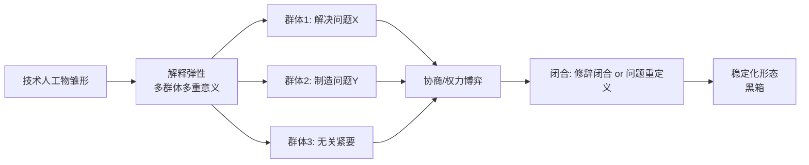

当你的 CEO 在战略会上说"AI 必然会取代客服 / 必然会重塑组织 / 必然会让中台消失"时，他其实在做一个未经检验的**形而上学**承诺，而不是一个产品判断。本节点的任务是给这种"必然"装一个探测器：用 STS 里最锋利的一把刀——**SCOT（Social Construction of Technology，技术的社会建构）**及其核心概念"解释弹性（interpretive flexibility）"——拆穿"技术决定论"这个 PM 决策里最隐蔽、最昂贵的思维错误。本节的框架名是：**技术的形态是相关社会群体协商出来的结果，不是技术内在逻辑展开的必然。**

## §0 为什么是 SCOT，而不是"用户采纳曲线"或"技术成熟度"

转型 PM 脑子里关于"新技术怎么落地"的默认框架，通常是两个：Rogers 的**创新扩散曲线**（早期采纳者→鸿沟→大众）和 Gartner 的**Hype Cycle**（期望膨胀→幻灭谷底→稳步爬升）。这两个框架都很有用，但它们共享一个隐藏假设：**技术本身的形态和意义是给定的，问题只是"社会多快接受它"**。这正是技术决定论的软性版本——技术在前，社会在后，社会的角色只是"接受速度"这个标量。

SCOT 把这个假设整个掀翻。它问的不是"AI 多快被采纳"，而是"AI 这个东西到底会**长成什么样**——而这个'样子'本身就是社会群体争夺、协商、闭合的产物"。同一个 LLM，对程序员是"结对编程伙伴"，对老师是"作弊工具"，对法务是"合规黑洞"，对监管者是"算法歧视的载体"。这不是"同一个东西的不同用法"，而是 SCOT 意义上的**解释弹性**：在闭合（closure）发生之前，它根本就不是"一个东西"。Rogers 和 Gartner 默认闭合已经完成、只剩扩散；SCOT 关心的恰恰是闭合**之前**那段最关键、对 PM 最有杠杆的窗口期。

所以选 SCOT，不是因为它更"学术"，而是因为它瞄准的是 PM 真正能施加影响的环节：**在意义被锁死之前，参与协商它。**

## §1 技术决定论：那个你以为自己不信、却天天在用的框架

技术决定论（technological determinism）的核心命题是：技术按自身内在逻辑自主发展，并**单向地**决定社会结构；社会变迁是技术进步的必然后果，技术路径是唯一可能的路径。最常被引为代表的是 Jacques Ellul 在 *La Technique*（1954，英译 1964）中描述的"自律技术"（autonomous technology）系统——技术已成超脱人类控制的自我增殖逻辑。〔注：Ellul 本人否认自己是技术决定论者，称其分析是对文化资本主义的批判，学界对其归类有争议。来源：Wikipedia 技术决定论条目，WebSearch 核实。〕

技术决定论在 PM 语境里几乎从不以"我信技术决定论"的形式出现，它总是穿着"行业洞察"的外衣：

- "Agent 必然会取代 SaaS 的 GUI"——把一个**正在被多方争夺的形态**说成了**已锁定的终局**。
- "大模型必然走向中心化垄断"——把**资本与监管协商的结果**说成了**技术规模律的物理必然**。
- "AI 必然消灭初级岗位"——把一个**组织选择**（要不要用 AI 替代而非增强）说成了**技术后果**。

| 表述 | 技术决定论读法（错） | SCOT 读法（对） |
|---|---|---|
| "Agent 会取代 GUI" | 技术内在优越性的必然胜出 | 开发者/企业买家/合规方仍在争夺，形态未闭合 |
| "AI 必然中心化" | 规模律导致的物理终局 | 算力资本+开源社区+监管三方协商的暂定均衡 |
| "AI 替代初级岗" | 技术后果，不可抗 | 组织在"替代 vs 增强"间的可选择路径 |

判断决定论的试纸很简单：**句子里出现"必然""不可避免""终将"，且把主语的能动性全部抽空时，你正在用技术决定论替代分析。**

## §2 SCOT 的三件套：相关社会群体、解释弹性、闭合

SCOT 由 Trevor Pinch 与 Wiebe Bijker 在 1984 年的奠基论文中系统提出："The Social Construction of Facts and Artefacts," *Social Studies of Science*, 14(3), 399–441（SAGE DOI 已核实）。1987 年扩展为文集 *The Social Construction of Technological Systems*（Bijker, Hughes & Pinch 编，MIT Press，官网已核实）。三个核心概念：

**1. 相关社会群体（Relevant Social Groups）**——对某一技术赋予共同意义的群体：用户、工程师、记者、监管者、公民组织。不同群体对"这个技术要解决什么问题"有不同定义。

**2. 解释弹性（Interpretive Flexibility）**——SCOT 最具区别性的概念。同一技术人工物向不同群体开放完全不同的诠释。经典案例是 19 世纪自行车的**充气轮胎**：对一部分群体它意味着"更舒适的交通"，对另一部分群体它意味着"技术麻烦、抓地问题、审美丑陋"（多个学术来源一致引用，已核实）。轮胎的"是好是坏"不是物理属性给定的，而是社会协商出来的。

**3. 闭合与稳定化（Closure & Stabilization）**——解释弹性最终收敛，技术趋于稳定。两种机制：**修辞闭合**（相关群体认为问题已解决，哪怕没真解决）与**问题重新定义**（设计转向满足新问题，从而绕开争议）。

对 AI 的迁移：今天的 LLM 正处在 B→D 的高峰期。"幻觉"是缺陷还是创造力（[幻觉](/kb/基础知识库/幻觉/)）、Agent 是助手还是替代者（[Agent](/kb/基础知识库/agent/)、参见 [p307 - Copilot 到 Autopilot 光谱](/kb/产品设计与交互范式/p307-copilot-到-autopilot-光谱/)）、ChatGPT（[ChatGPT](/kb/ai-公司与产品/chatgpt/)）是搜索引擎还是对话伙伴——这些都还没闭合。**PM 的战略机会，恰恰在闭合发生之前。**

## §3 SCOT 怎么证明决定论是错的：偶然性论证

SCOT 对决定论的根本一击，浓缩在一句已核实的断言里："通向现在的路径并非唯一可能的路径"（Wikipedia SCOT 条目，WebFetch 核实）。Bijker 的 Bakelite（电木）与自行车研究（*Of Bicycles, Bakelites, and Bulbs*, 1995）通过历史案例证明：

- 技术的最终形态是**社会群体利益协商**的结果，不是技术自身逻辑的必然展开；
- 被淘汰的技术方案**并非天然劣等**，而是在特定权力关系与利益格局中落败；
- 技术路径具有**偶然性（contingency）**——历史本可走向不同结果。

这对 AI PM 的直接含义：今天 LLM 主导生成式 AI 的格局，不是"transformer 物理上最优"的必然，而是 2017 注意力机制论文、英伟达算力、大公司数据资本、以及一连串组织决策共同协商的偶然产物。判断"下一代架构必然如何"时，决定论会让你赌错——它把偶然当必然。

## §4 判断主轴：90% 的人在"AI 必然导致 X"上踩的四个坑

这是本节的命门。"AI 必然导致 X"是技术决定论谬误的标准句式，下面四个坑，每个都带症状→为什么错→正确做法→真实反例。

**坑一：把"形态已闭合"当成"形态本来如此"。**
- 症状："AI 客服必然走向全自动，人工只是过渡。"
- 为什么错：把一个仍在解释弹性窗口期的技术，当成已稳定化的黑箱。全自动 vs 人机协同，是相关社会群体（用户信任、合规、成本）还在协商的开放问题。
- 正确做法：识别当前处于"解释弹性"还是"闭合后"。前者你能影响形态，后者只能影响扩散。
- 真实反例：滴滴/99 的安全感知与干预场景，全自动判责一度被当作"必然方向"，但巴西PDP现金支付纠纷治理的实践证明，监管、司机群体、乘客三方协商把形态推回了"裁判到管家"（纠纷治理从裁判到管家）的人机协同，而非全自动。形态没闭合，是被社会协商重塑了。

**坑二：忽略沉默群体——只听得见声音大的相关社会群体。**
- 症状："用户都想要更聪明的 Agent。"——"用户"指的是发声的早期采纳者。
- 为什么错：这正是 Langdon Winner 1993 批判 SCOT 的第二点（"遗漏沉默群体"，见 §6），但反过来用：决定论叙事系统性地只采样发声群体的意义，把它当成"技术的必然方向"。
- 正确做法：显式列出**无法参与协商但被技术影响**的群体（被替代的劳工、低数字素养用户、全球南方用户）。
- 真实反例：RLHF（[RLHF](/kb/基础知识库/rlhf/)）对齐数据主要来自全球北方标注者，导致谄媚（sycophancy）倾向向北方用户偏斜——而全球南方用户这个沉默群体的意义从未进入"AI 必然更有用"的叙事。这正是 Rick 在拉美民族志田野里能看见、硅谷叙事看不见的盲区。

**坑三：把组织选择伪装成技术后果。**
- 症状："AI 必然让初级岗位消失。"
- 为什么错：技术不会"让"任何岗位消失，是**组织决定**用 AI 替代而非增强。这是把人的能动性外包给"技术必然"，从而免除决策责任。
- 正确做法：每次听到"AI 让 X 发生"，把"AI"换成"我们公司决定用 AI 来"，看句子还成不成立。
- 真实反例：Winner 的 Robert Moses 低桥案例（*Do Artifacts Have Politics?*, 1980）——低矮立交桥据称被设计来阻止公共巴士（载着穷人和少数族裔）进入海滩，这是政治选择嵌入技术物，不是"桥梁技术的必然"。〔注：历史学家对此案例真实性有争议，见关联档案。〕

**坑四：把"反决定论"做成另一种决定论——社会决定论。**
- 症状："技术形态完全由社会协商决定，技术物本身没有任何约束力。"
- 为什么错：这是 Winner 对 SCOT 最致命的批判——SCOT "倒向另一极端"，以社会决定论取代技术决定论，遮蔽了技术物本身的政治性（见 §6）。LLM 的自回归生成（[自回归生成](/kb/基础知识库/自回归生成/)）+ Softmax（[Softmax](/kb/基础知识库/softmax/)）不留白机制，是**真实的物质约束**，不是纯社会建构。[幻觉](/kb/基础知识库/幻觉/)的不可消除性有架构根因，不是协商出来的。
- 正确做法：SCOT 用来破"必然"，但不能用来否认技术物的物质约束。两者都要拿。
- 真实反例：你可以社会建构"幻觉是缺陷还是特性"的**意义**，但你无法社会建构掉概率采样导致幻觉的**机制**。

## §5 产品 PM 视角补盲：解释弹性是 GTM 的隐藏战场

跳出工程视角，SCOT 给 PM 三个工程框架看不见的盲点：

**用户心理模型：意义之争先于功能之争。** 同一个 AI 写作功能，定位成"帮你写得更快"还是"帮你写得更好"，会激活完全不同的相关社会群体（效率焦虑者 vs 质量焦虑者），决定了完全不同的留存曲线。这是解释弹性在 GTM 层的直接体现——你不是在卖功能，你是在参与"这个东西是什么"的闭合。

**商业模式：谁完成修辞闭合，谁定义品类。** 第一个把"AI Agent = 自动化你的工作流"这句话说服市场接受的公司，就完成了对品类的修辞闭合，后来者只能在它定义的意义框架里竞争。品类定义权 = 闭合权。

**合规边界：监管是最强的相关社会群体。** 欧盟 AI Act、巴西 LGPD 这些监管框架不是"对既成技术的事后约束"，它们是**正在参与定义 AI 形态本身**的相关社会群体。Rick 在CPF实名验证、乘客信息透明化上的经验：合规方对"什么是可接受的 AI"的定义，会直接重塑产品形态，而非仅仅"拖慢上线"。

## §6 对手框架回应：接受 Winner 的批判，守住 SCOT 的边界

**接受 Langdon Winner（1993，"Upon Opening the Black Box and Finding It Empty," *Science, Technology, & Human Values*, 18(3), 362–378，已核实）。** Winner 对 SCOT 提出四点批评，每一点我都接受其对的部分：(1) SCOT 热衷拆黑箱却不关心技术采纳后的**社会后果**；(2) 只研究发声群体，**遗漏沉默群体**；(3) 对阶级、制度、经济政治等**宏观权力结构不敏感**；(4) "解释弹性"立场导致**道德中立**，难以判断技术好坏。

**接受 + 边界：** 我接受 SCOT 单用会失明——它擅长破"必然"，但对权力、后果、伦理近乎沉默。所以本专题的边界是：**SCOT 用作"反决定论的探测器"，但权力分析交给 ANT（[Agent](/kb/基础知识库/agent/) 作为非人行动者，见 [A03 Actor-Network Theory·AI 作为非人行动者](/kb/专题-人文社科透镜/a03-actor-network-theory-ai-作为非人行动者/)）、后果分析交给生命政治（生命政治）与社会技术想象（[A04 Sociotechnical Imaginaries·跨文化](/kb/专题-人文社科透镜/a04-sociotechnical-imaginaries-跨文化/)）、跨文化分析交给人类学。** 我赌的是：SCOT 的"解释弹性 + 偶然性"在 AI PM 决策中价值极高，但它必须和其他工具组队使用，单独使用会滑向坑四的社会决定论。

**引入 Rick 未读对手框架——Klein & Kleinman（2002，"The Social Construction of Technology: Structural Considerations," *Science, Technology, & Human Values*, 27(1), 28–52，SAGE DOI 已核实）。** 这是 SCOT 阵营内部的自我修正：他们指出 SCOT 的"相关社会群体"概念缺乏对**社会结构约束**（资本关系、制度规则）的说明，需要结合结构社会学补充。这个内部批判比 Winner 的外部批判更难反驳——它承认 SCOT 的框架本身有结构盲区。我把它作为 failure scenario 显式标注：**当技术争议的核心是结构性权力（如算力资本垄断）而非群体诠释时，SCOT 会系统性低估结构、高估协商。**

**第二个未读对手框架——MacKenzie & Wajcman 的 SST（Social Shaping of Technology，1985，已核实）。** 他们刻意用"社会塑造"而非"社会建构"，正是为了避免唯建构主义，同时把**性别、政治经济、组织结构**拉进来——Wajcman（2000，*Technology and Culture*）批评 SCOT 的"相关社会群体"界定过窄，系统性排除女性和劳工。这逼问本专题的盲点：当我说"相关社会群体在协商 AI 形态"时，我采样的是谁？是不是又一次只听见了技术精英？

## §7 跨域呼应：从 Descola 的本体论多元，看 AI 的解释弹性是文化深处的

SCOT 的"解释弹性"在 STS 里是个相对**浅**的概念——它谈的是不同群体对同一物的不同**意义**。但 Rick 的人类学底子（人类学、民族志）能把它推到更深一层。Philippe Descola 在 *Beyond Nature and Culture*（Beyond Nature and Culture）里论证：不同文化对"什么是行动者、什么是物、人与非人的边界在哪"有根本不同的**本体论**（自然主义、泛灵论、图腾主义、类比主义）。

这给 AI 的解释弹性提供了一个 SCOT 自己给不出的深度诊断：**当一个 AI Agent 进入不同社会，争夺的不只是"它是助手还是替代者"这种意义层面的弹性，而是"它算不算一个能动者（actant）"这种本体论层面的弹性。** 在一个把算法当"中性工具"的本体论里，和一个把算法当"有意图的行动者"的本体论里，同一个 AI 产品会闭合成完全不同的东西——前者监管轻、后者监管重。这正是为什么 [A04 Sociotechnical Imaginaries·跨文化](/kb/专题-人文社科透镜/a04-sociotechnical-imaginaries-跨文化/) 说"同样的 AI 在不同社会走出不同产品形态"。

Rick 在巴西-拉美的民族志田野里见过这种本体论差异的实际后果：当地司机群体对"明镜系统"（明镜系统）这类算法监督的意义诠释，和北方工程师设计时的预设（Akrich 意义上的 script，见 [A02 Script 理论·产品内嵌脚本](/kb/专题-人文社科透镜/a02-script-理论-产品内嵌脚本/)）发生剧烈错位——不是"用户没理解功能"，而是**两套本体论在协商这个物到底是什么**。SCOT 让你看见协商在发生，Descola 让你看见协商有多深。

## §8 PM 决策启示

**面试怎么用：** 当面试官说"你觉得 AI 必然会怎样"，不要接"必然"这个词。回："我会先问这个形态闭合了没有——如果还在解释弹性窗口期，那'必然'是个伪命题，真正的问题是哪些相关社会群体在协商、我们能不能参与定义。"一句话展示你不被决定论叙事牵着走。

**选型怎么用：** 评估一个新 AI 品类（如"AI Agent 平台"）时，先判断它处于 SCOT 周期的哪一段。还在协商期，押注就是押"哪种意义会闭合"——风险在社会，不在技术；已闭合，押注是押扩散速度——风险在 GTM。两种风险定价完全不同。

**复现怎么用：** 做技术方案时，把"这个设计预设了哪些相关社会群体、排除了哪些沉默群体"写进设计文档，作为风险项。这是把 SCOT 工程化的最直接方式。

## §9 与已有节点的关系

- 对照 [p307 - Copilot 到 Autopilot 光谱](/kb/产品设计与交互范式/p307-copilot-到-autopilot-光谱/)：p307 描述了"助手→自动驾驶"的光谱，但**默认这是技术能力的线性展开**。本节点做**纠偏**：这条光谱上停在哪一格，不是技术成熟度决定的，是相关社会群体（用户信任、合规、责任归属）协商闭合的结果。p307 给坐标，A05 给"谁在挪动那个点"。
- 对照"信任校准/适当依赖"这一产品议题（本库暂无对应专门节点，降级为概念引用）：信任校准常被当作"用户侧的认知任务"，本节点做**升级**：信任本身是相关社会群体协商技术意义的产物，不是个体心理变量。
- 对照 [幻觉](/kb/基础知识库/幻觉/)：幻觉节点讲架构根因（事实基础），本节点**不复述**，只补一层：幻觉"是缺陷还是特性"是解释弹性问题，但其**机制**不是社会建构能消解的（见坑四）。
- 对照 0117社会学、0115道德哲学-伦理学：本节点是 STS 视角，与社会学的结构分析、伦理学的规范判断形成对话——SCOT 的道德中立性正是需要伦理学补缺的地方。

## §10 关联节点

**核心（必读）：**
- [幻觉](/kb/基础知识库/幻觉/) —— 解释弹性能改意义、不能改机制的边界案例
- [Agent](/kb/基础知识库/agent/) —— 形态未闭合的当代最大解释弹性场
- [p307 - Copilot 到 Autopilot 光谱](/kb/产品设计与交互范式/p307-copilot-到-autopilot-光谱/) —— 被本节点纠偏的决定论坐标
- [A04 Sociotechnical Imaginaries·跨文化](/kb/专题-人文社科透镜/a04-sociotechnical-imaginaries-跨文化/) —— 跨文化形态分化的上位框架
- 0117社会学 —— 结构分析的补缺来源
- 人类学 —— Descola 本体论多元的入口

**延伸（可选）：**
- [ChatGPT](/kb/ai-公司与产品/chatgpt/) —— "搜索 vs 对话"未闭合的解释弹性实例
- [RLHF](/kb/基础知识库/rlhf/) —— 沉默群体（全球南方）被排除的对齐偏斜案例
- 生命政治 —— 技术后果分析的接力框架
- 0115道德哲学-伦理学 —— SCOT 道德中立性的补缺
- Beyond Nature and Culture —— Descola 本体论多元原典
- 民族志 —— Rick 拉美田野的方法论
- 明镜系统、安全感知与干预、纠纷治理从裁判到管家 —— 形态被社会协商重塑的滴滴/99 实例
- CPF实名验证、乘客信息透明化 —— 监管作为相关社会群体的实例
- [自回归生成](/kb/基础知识库/自回归生成/)、[Softmax](/kb/基础知识库/softmax/) —— 技术物物质约束的根因
- [AI PM 知识图谱·总索引](/kb/ai-pm-知识图谱/ai-pm-知识图谱-总索引/) —— 全库入口

## §11 修订日志

- R1（2026-06-07）：首稿。建立 SCOT 三件套对决定论的探测器框架；判断主轴四坑（形态闭合误判 / 沉默群体 / 组织选择伪装 / 社会决定论反噬）；接受 Winner 四点批判 + Klein & Kleinman、MacKenzie & Wajcman 两个 Rick 未读对手框架；跨域呼应用 Descola 本体论多元把解释弹性推到本体论深度并迁移至拉美田野；与 p307/p306/幻觉 显式升级对照。待核实项：Ellul 决定论归类争议、Robert Moses 桥梁案例真实性、p306 节点是否存在。
