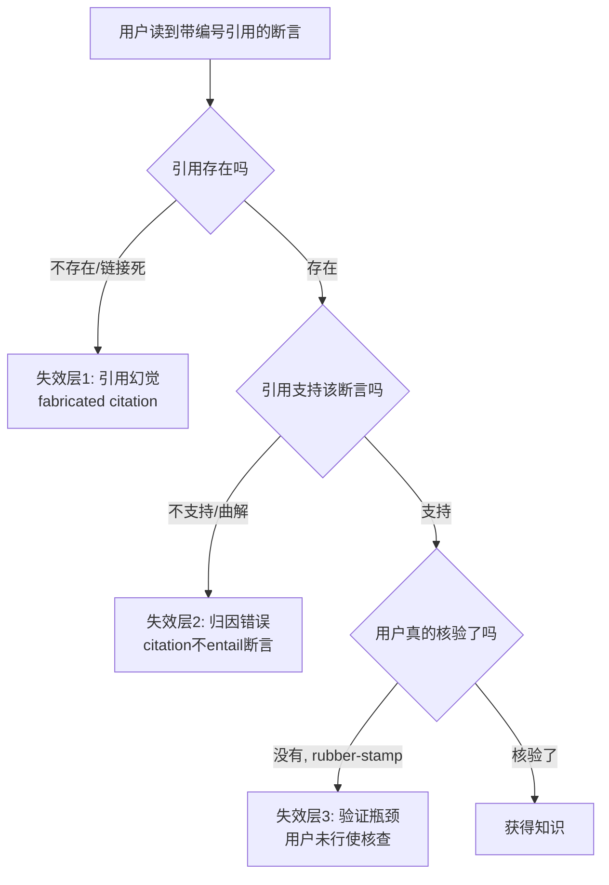

Perplexity、ChatGPT 的 deep research、Gemini Deep Research 这类「AI 研究助手」给用户的到底是知识，还是**知识的模拟**——一个在表面上具备知识全部外观（引用、脚注、链接、结构化综述），但在认识论实质上未必提供知识所要求的辩护（justification）的产物？本节的判断主轴：**带编号的引用制造了「可信表象」，但「表象的可信」与「认识论上的可信」是两件不同的事；引用的存在不等于验证的发生，而当下产品的设计恰恰系统性地诱导用户把前者误当后者。** 这是一个把 0114认识论 的盖梯尔问题、过程可靠主义、证言认识论，直接落到 Perplexity 这类具体产品的剖面。

> [!warning] 本节定位（不复述）
> 本节不重述「幻觉为什么不可消除」（那是 [c13 - 幻觉的不可消除性](/kb/基础知识库/c13-幻觉的不可消除性/) 的事），不重述「知识产品如何设计」（那是 0427 E01 的事）。本节只问一件事：当 AI 在用户与原始文献之间插入一层「带引用的综述」，这层中介在认识论上是 verification 装置，还是 rubber-stamping 装置？这是 0418（审阅产品机制）、0427（知识产品）之下的**认识论哲学层**。

---

## §0 为什么用「引用 ≠ 验证」这个框架，而不是「幻觉率」框架

业界评价 AI 研究助手的默认框架是**幻觉率 / 引用准确率**：抽样 N 条断言，数有多少条引用真实存在、有多少条引用真的支持该断言。这个框架重要但不够——它停在「事实正确性」，没碰「认识论地位」。

一条断言可以**引用真实、引用支持、内容正确**，用户仍然没有获得知识。理由是盖梯尔问题（Gettier 1963，*Analysis*，"Is Justified True Belief Knowledge?"；概念见 0114认识论，主库无独立节点）的结构：**有辩护的真信念（JTB）未必是知识，如果信念之为真与辩护之间的连接是偶然的。** AI 研究助手的生成机制——下一个 token 的概率采样——使「输出为真」与「输出有可靠辩护」之间的连接，在结构上就是偶然的：模型不是因为核验了来源才说 A，而是因为「在它见过的语料分布里，A 之后接这个引用很常见」。引用是事后**装配**上去的，不是断言的**理由**。

所以本节的正确框架不是「它错得多不多」，而是 Goldman 式的**过程可靠主义**（Goldman 1979, "What is Justified Belief?"；*Epistemology and Cognition*, 1986, Harvard UP；可靠主义概念见 0114认识论，主库无独立节点）：一个信念有认识论辩护，当且仅当它由一个**可靠的过程**产生。问题随之变成：**用户读 Perplexity 报告时，他形成信念的过程可靠吗？** 这才是 PM 在设计 confidence display、citation 系统、human-in-the-loop 触发条件时真正要回答的问题。

---

## §1 引用的双重功能：认识论辩护 vs 修辞性可信表象

引用在学术写作里本来承担两个功能，AI 研究助手把它们解耦了：

| 功能 | 学术语境里的引用 | AI 研究助手里的引用 |
|---|---|---|
| **可追溯性（traceability）** | 读者可顺链核查原文，独立重建辩护 | 链接通常真实可点，**这一功能保留** |
| **辩护性（justification）** | 作者写下断言**是因为**读过该来源、该来源支持它 | 断言由采样生成，引用事后匹配，**这一功能常缺失** |

关键洞察：**AI 研究助手保留了引用的「修辞外观」，却不保证引用的「辩护实质」。** 它给出的是一个**可信表象（appearance of credibility）**——脚注、编号、来源链接共同触发读者「这是被核查过的」的心理预期，而生成过程并未执行核查。这正是 Renieris、Kiron、Mills 与 Kleppe（2025, *MIT Sloan Management Review*, "AI Explainability: How to Avoid Rubber-Stamping Recommendations"）所说的 **「explainability theater」**：表面合规、表面可解释，而无实质认识论内容。

> [!note] 与 speech act theory 的呼应
> 用奥斯汀/塞尔的言语行为理论看：人类引用是一个**断言行为（assertion）**，附带「我为此真理性负责」的承诺（commitment）。AI 的引用在语用层缺失这个承诺——Ori Freiman（2023, *Episteme*, "Analysis of Beliefs Acquired from a Conversational AI"）正是据此论证：从 AI 获得的信念既非「仪器性信念」也非「证言性信念」，而是新类别**「技术性信念」（technology-based beliefs）**，因为证言理论历史上以**意向性与道德可问责**为前提，而 AI 不具备。引用的「形」在，引用的「言语行为承诺」不在。

---

## §2 引用三层失效谱系（接地的硬事实）

「引用不提供真验证」不是一句口号，它在工程上分三层，且每层都有可证伪的测量：

- **失效层 1（引用幻觉）**：引用的论文/来源根本不存在，或链接指向无关页面。这是 [c13 - 幻觉的不可消除性](/kb/基础知识库/c13-幻觉的不可消除性/) 已剖透的引用幻觉，本节不复述其架构成因（Softmax 强制输出 + 概率采样），只接力指出：**它把「层 2、层 3」的问题前置遮蔽了**——用户一旦发现一两条死链，反而可能因为「其余链接都能点开」而过度放心。
- **失效层 2（归因错误 / citation 不蕴含断言）**：来源真实存在、可点开，但**它并不支持被附加的断言**，或断言是对来源的曲解、过度泛化、张冠李戴。这是比层 1 更隐蔽、更难被用户抓到的失效——因为它需要用户真的打开来源、读懂、判断 entailment 关系，而这正是用户最不愿做的。学界对此有专门评测线索：归因可信度评估（attribution / citation faithfulness）是 RAG 评测的核心维度之一（参 [RAG](/kb/基础知识库/rag/) 与 RAGAS 的 faithfulness 指标，详见 [c13 - 幻觉的不可消除性](/kb/基础知识库/c13-幻觉的不可消除性/) 引述的 RAGAS Faithfulness 评测线索）。〔具体到 Perplexity/Gemini 的层-2 错误率公开实测数字，待核实；不同评测口径差异大，此处只断言「层 2 必然非零且高于层 1 的可感知率」这一结构性判断。〕
- **失效层 3（验证瓶颈 / rubber-stamping）**：这是认识论上最致命的一层，也是产品设计真正的杠杆点。**即便引用真实且支持断言，如果用户从不点开核验，他形成信念的过程仍然不可靠**——他的「知识」实际来自对 AI 输出的被动转移，而非自身可靠的评估过程。这就是 verification 退化为 rubber-stamping。

---

## §3 判断主轴：90% 的人会在这里搞错的四件事

> [!danger] 致命耦合点
> AI 研究助手最危险的认识论结构是：**「引用密度↑」与「用户核查率↓」正相关。** 引用越多、越规整、越像学术综述，用户越不去核查——可信表象的精致程度，反向腐蚀了真验证的发生。这不是用户懒，是设计在系统性地诱导。

### 错位一：把「可追溯」误当「已验证」

- **症状**：「它每条都有出处啊，肯定查过了。」用户把「链接可点」直接读成「断言被核查」。
- **为什么会错**：可追溯性（层 1 通过）和辩护性（层 2/3 通过）被产品 UI 故意视觉合并——编号脚注的样式直接挪用学术论文，触发「这是同行评议过的内容」的心理框架（0114认识论 的证言信任默认机制：Coady 1992 的 credulity principle，缺乏不信任理由时默认接受）。
- **正确做法**：把「可追溯」当成**验证的前提**而非**验证的完成**。产品侧应区分「来源已列出」与「断言-来源蕴含关系已被检验」两种状态，分别给信号。
- **真实反例**：律师在 Mata v. Avianca 案（2023，美国纽约南区联邦法院，Steven Schwartz 提交 ChatGPT 编造的判例）中，正是把「有 citation 格式」误当「判例真实」，提交了六个不存在的案例并被制裁。这是层 1 失效叠加 rubber-stamping 的教科书案例。（来源：Mata v. Avianca, Inc., No. 22-cv-1461, S.D.N.Y., 2023，公开判决。）

### 错位二：把「综述的流畅」误当「判断的可靠」

- **症状**：报告读起来连贯、平衡、四平八稳，于是被当成「客观全面」。
- **为什么会错**：流畅性（fluency）是 LLM 的强项，也是它**最危险的认识论伪装**——Angjelin Hila（2024/2025, arXiv:2512.19570, "The Epistemological Consequences of Large Language Models"）区分**内在主义辩护**（对命题为何为真有反思性理解 → 反思性知识）与**外在主义可靠传递**（仅「动物性知识」animal knowledge）。AI 综述至多是后者：可靠地搬运已建立的信息，但不生成需要理解的反思性知识。流畅的综述外观让用户误以为背后有理解。
- **正确做法**：把流畅度从可信度信号里剔除；在产品上对「高争议、低共识」的话题强制显示分歧地图，而非给一个抚平分歧的「平衡综述」。
- **真实反例**：对一个学界明确未决的问题（如「LLM 是否具有理解」，Searle 1980 中文屋 vs Hossenfelder 2023 的有限理解论，至今未决），AI 研究助手常给出一段「一方面…另一方面…总体而言…」的伪共识，把**实质争议**降级成**修辞平衡**。

### 错位三：把「检索范围」误当「认识完整」

- **症状**：「它搜了 50 个来源，比我全面多了。」
- **为什么会错**：检索宽度不等于认识完整。集体性默会知识（[Polanyi 默会知识与提示工程的认识论张力](/kb/基础知识库/polanyi-默会知识与提示工程的认识论张力/)：Collins 三类默会知识中嵌入社会实践、无法进入文本的那一类）**根本进不了任何检索语料库**——组织里最值钱的判断、领域专家的临床直觉、尚未被写下的前沿共识，AI 研究助手系统性地看不见。它的「全面」是**可文本化知识的全面**，对默会维度是结构性盲区。
- **正确做法**：在高默会含量的领域（医疗诊断、并购判断、安全合规裁量），把 AI 报告定位为「文献起点」而非「结论」，强制 human-in-the-loop。
- **真实反例**：DiDi/99 这类出行安全场景里，「什么样的司机-乘客交互在某地真的危险」高度依赖本地默会知识与一线运营经验——任何 AI 研究助手综述都无法替代区域安全 PM 的现场判断，但它的「完整外观」会诱导跨区团队跳过本地校验。

### 错位四：把「自己点了一两个链接」误当「已尽核查义务」

- **症状**：抽查一个链接、发现是真的，于是信整篇。
- **为什么会错**：这是**自动化自满（automation complacency）** 的精确表现（Parasuraman & Manzey 2010, *Human Factors* 52(3), "Complacency and Bias in Human Use of Automation"）：高可靠性的系统反而**降低**用户的持续监视注意力；且该研究的政策性结论是——**自满无法靠训练克服**。抽查一条≠核查全部，恰恰是注意力资源在「系统看起来靠谱」时自动撤离的结果。
- **正确做法**：产品不应让用户自己决定「抽查几条」；应在高风险断言上**强制**逐条核验门，或显示「本断言尚未被任何独立来源交叉确认」的醒目降级标记。
- **真实反例**：Huemmer 等（2026, arXiv:2601.17055, "AI, Metacognition, and the Verification Bottleneck"）的三波纵向研究：困难任务上 AI 依赖率 73.9%，对 AI 输出的验证置信度下降 68.1%（恰在最需要验证处），实际准确率仅 47.8%，信念-表现差距扩大到 34.6 个百分点——**验证而非生成成了瓶颈**。〔该研究样本限于学术早期采用者、缺控制组、自我报告偏差，趋势方向明确但量化数字应谨慎引用。〕

---

## §4 产品 PM 视角补盲：可信表象是怎么被「设计」出来的

工程 PM 会把这当成「引用准确率」KPI，但有三个**非工程**盲点：

1. **用户心理模型**：用户读 AI 报告时启用的是**「读综述/读维基」的心智脚本**，而非「审稿人」脚本。综述脚本的默认动作是「接受并吸收」，审稿人脚本才是「逐条质疑」。产品 UI 每多一个学术化视觉元素（脚注样式、参考文献列表、置信百分比），就把用户往「综述脚本」推得更深、离「审稿人脚本」更远。**置信度分数（confidence display）若设计不当，会成为可信表象的放大器而非校准器**——这是反直觉证据：更高透明度有时增加过度依赖（"explainability theater" 效应，Renieris et al. 2025）。
2. **商业模式**：AI 研究助手的留存与「省时间」「显得权威」绑定，而真验证**反时间**、反留存。产品激励与认识论健康在结构上冲突——这是为什么「鼓励核查」的功能很难被优先级排上去。PM 必须显式承认这个 conflict，而不是假装能两全。
3. **合规边界**：在受监管领域（金融投顾、医疗、法律、安全裁量），「AI 给了带引用的结论 + 人点头」可能在程序上满足「人在回路」，但在认识论上是 rubber-stamping——这正是荷兰儿童福利案、澳大利亚 Robodebt 案的教训：**制度上有「人在回路」，认识论上监督已失效**。EU AI Act（2024-08-01 正式生效；高风险系统义务自 2026-08-02 适用）要求「有效的人类监督（effective human oversight）」，但如何把这条法律要求翻译成认识论条件（不是点头，而是独立判断），学界尚无共识。〔Robodebt、荷兰案的法律细节与 EU AI Act 具体条款编号待核实，此处用于说明「程序合规≠认识论有效」的结构。〕

---

## §5 对手框架回应（接受 + 边界，不是反驳）

> [!quote] 对手立场一：计算可靠主义者（Durán & Formanek 2019, arXiv:1904.01052, "Grounds for Trust"）
> **他们对的部分**：他们主张计算过程的输出**不需要透明性即可被信任**，只要满足四类可靠性依据（验证与确认程序、鲁棒性分析、历史成功记录、专家判断）。据此，「AI 报告不可解释」本身不构成「不可信」的理由——这对我「引用≠验证」的悲观论是有力的纠偏：**可靠性可以经由外部指标建立，而非必须经由用户逐条核查。**
>
> **我坚持的边界**：computational reliabilism 成立的前提是那四类指标**真的被建立并被监测**。当下的 Perplexity/deep research 产品**没有**向用户暴露任何一类——没有验证程序、没有鲁棒性分析、没有可审计的历史准确率。所以 CR 给的是「理论上 AI 可被可靠信任」，不是「当下这个产品已可被可靠信任」。我的赌注：**在产品把可靠性指标产品化之前，用户的默认核查义务不能被免除**；而 CR 的「历史成功记录」依据在 distribution shift 下会失效（Durán 等 2026, *Minds and Machines* 亦部分承认 update opacity 问题）。

> [!quote] 对手立场二：延展认知论者（Clark & Chalmers 1998, "The Extended Mind", *Analysis* 58(1)）
> **他们对的部分**：若 AI 研究助手功能上等同于「我脑内的检索-综述过程」，且持续可获取、被自动认可、易于提取，那它就**构成我认知系统的一部分**——纠结「这是不是我自己的知识」是个伪问题，正如没人问「我记在笔记本上的电话号码是不是我的知识」。
>
> **我坚持的边界**：Adams & Aizawa 的「联接-构成谬误」批评在此咬人——「我与 AI 联接」推不出「AI 是我认知的组成部分」。更要命的是延展认知要求的**「信任与胶合」（trust and glue）条件**：外部过程必须被自动认可为可靠。而 AI 研究助手恰恰**不满足**这个条件（Tandfonline 2023, "We Have No Satisfactory Social Epistemology of AI-Based Science" 正是据此论证 AI 工具难以被真正延展性地融入认知系统）——它的输出可靠性是波动、不透明、未经校准的，自动认可它**就是** rubber-stamping。我的赌注：**延展认知要的是「可信赖的外部过程」，而当前 AI 研究助手是「外观可信但实质未校准的外部过程」，把它当延展记忆用是在透支。**

---

## §6 跨域呼应：维特根斯坦的语言游戏边界

> [!note] 调度：0601 维特根斯坦 后期的「语言游戏」与「遵守规则」
> AI 研究助手最深的认识论问题，不在它会不会错，而在它**玩的是哪个语言游戏**。在「学术引用」这个语言游戏里，「引用 X」这个动作的**意义**由一整套实践构成：作者读过 X、X 支持断言、作者愿为此负责、读者可质询作者。维特根斯坦（*Philosophical Investigations*, 1953）的核心洞察是——**词的意义在于它在生活形式（form of life）中的用法**，而不在于它的外观。
>
> AI 研究助手复制了引用的**外观（句法）**，却没有参与那个赋予引用以意义的**实践（语言游戏）**——它不曾「读过」、不曾「为之负责」、无法「被质询」。这正是 [幻觉](/kb/基础知识库/幻觉/) 与中文屋（Searle 1980）的同一个结构在认识论中介上的投影：**句法的复制不等于意义的参与。** 用户以为自己在玩「读学术综述」的语言游戏，实际上 AI 在玩「生成符合引用句法的文本」的另一个游戏——两个游戏外观相同，规则与承诺完全不同。
>
> **这改变了什么技术判断**：confidence display 与 citation 系统的设计目标，不该是「让引用看起来更可信」，而该是**「向用户揭示这是哪个语言游戏」**——明确标注「本引用未经断言-蕴含核验」，把用户从误入的语言游戏里拉出来。这是从「修饰可信表象」到「澄清认识论契约」的范式转向。

---

## §7 PM 决策启示

- **面试怎么用**：被问「怎么评价 Perplexity / deep research 产品」时，不要停在「幻觉率」——升一层说「它解耦了引用的可追溯性与辩护性，制造可信表象但不保证真验证；真正的产品杠杆在于把 verification 从用户的自由裁量变成结构化的、分风险等级的强制环节」。30 秒讲清「为什么我不会让团队直接信 AI 研究助手的结论」。
- **选型怎么用**：评估 AI 研究助手类产品，加三个维度到选型表——(a) 是否暴露**层-2 归因核验**状态（断言-来源蕴含是否被检验）；(b) 是否对**高争议话题**显示分歧而非伪共识；(c) 是否有**自动化自满的反制设计**（强制核查门 / 未交叉确认标记），而不只是更漂亮的脚注。
- **复现怎么用**：自己搭 RAG / deep-research 流水线时，把 faithfulness（断言是否被检索内容蕴含）作为**一等评测指标**，与召回率分开测；并在 UI 上把「来源已列出」与「蕴含已检验」做成两个独立的视觉状态——这是把本节的认识论区分落成可工程化的产品契约。

---

## §8 与已有节点的关系

| 旧/邻节点 | 本节做的是 | 升级方向（不复述对方事实基础） |
|---|---|---|
| [c13 - 幻觉的不可消除性](/kb/基础知识库/c13-幻觉的不可消除性/) | **深化 + 对话** | c13 解决「为什么引用会幻觉（架构性不可消除）」；本节接力到「即便引用**不**幻觉，引用仍不提供验证」——把问题从**层-1（事实正确性）** 推进到**层-2/3（认识论辩护与 rubber-stamping）**。c13 是风险存在论，本节是风险在「研究助手」这一具体产品形态里的认识论剖面。 |
| 0427 E01（知识系统专题 · 实例剖解） | **分工对话** | 0427 E01 从「知识产品设计」角度剖 AI 研究助手（L1 覆盖率、检索-生成耦合）；本节从**认识论哲学层**剖同一对象（引用的辩护性、盖梯尔结构、语言游戏）。两节点对照阅读 = 同一产品的产品层 vs 哲学层双视角。 |
| [Polanyi 默会知识与提示工程的认识论张力](/kb/基础知识库/polanyi-默会知识与提示工程的认识论张力/) | **借用 + 落地** | 借 Collins 集体性默会知识论证「检索范围 ≠ 认识完整」（错位三），落到出行安全这类高默会场景。 |
| 0114认识论 | **应用** | 把盖梯尔问题、过程可靠主义、证言信任默认机制（Coady credulity）从概念层应用到具体产品行为。 |

---

## §9 关联节点

**核心（必读）**
- [c13 - 幻觉的不可消除性](/kb/基础知识库/c13-幻觉的不可消除性/) —— 本节的上游：引用幻觉的架构成因
- 0114认识论 —— 盖梯尔问题、可靠主义、证言认识论的概念基座
- 0601 维特根斯坦 —— 语言游戏边界，本节跨域主调度
- [Polanyi 默会知识与提示工程的认识论张力](/kb/基础知识库/polanyi-默会知识与提示工程的认识论张力/) —— 检索范围≠认识完整的默会知识论证
- [RAG](/kb/基础知识库/rag/) —— faithfulness / 归因核验的工程载体
- [幻觉](/kb/基础知识库/幻觉/) —— 句法复制≠意义参与的同构现象

**延伸（可选）**
- [Agent](/kb/基础知识库/agent/) —— deep research 作为多步检索 Agent 的认识论问题
- 盖梯尔问题 —— 偶然真信念结构的原典；概念见 0114认识论，主库无独立节点
- 可靠主义 —— Goldman 过程可靠主义；概念见 0114认识论，主库无独立节点
- 社会认识论 —— 证言与 gatekeeper 框架；概念见 0114认识论，主库无独立节点
- 0117社会学 —— 知识的社会生产与权力盲点

---

## 修订日志

- 2026-06-07 R0：首稿。确立「引用 ≠ 验证」判断主轴；建引用三层失效谱系（幻觉/归因错误/验证瓶颈）；判断主轴四错位四件套；接入 CR（Durán & Formanek）与延展认知（Clark & Chalmers）两个对手框架的「接受+边界」；维特根斯坦语言游戏跨域呼应；与 c13 / 0427 E01 / Polanyi 节点显式升级对照。待核实项已就地标〔待核实〕：层-2 实测错误率、Robodebt/荷兰案法律细节与 EU AI Act 条款编号、Huemmer 2026 量化数字的可推广性。
- 2026-06-11 P3.4 校链：§失效层 2 内死链占位 `m205 §RAGAS Faithfulness`（节点真名为 `m205 - RAG 生产环境…`，无此 §section 双链目标）去双链改为「RAGAS Faithfulness 评测线索」普通文本。
- 2026-06-12 内审修复：§3 合规边界 EU AI Act 生效口径统一为"2024-08-01 正式生效；高风险系统义务自 2026-08-02 适用"（权威值，呼应总览 §8 QC #5）；Robodebt/荷兰案细节与层-2 实测错误率仍诚实保留〔待核实〕。
