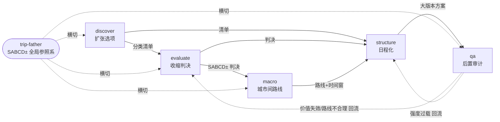

# E01 Trip-planning Skill Workflow 剖解

当 Rick 的五个 trip-* skill 在一次真实旅途中被**串起来跑**——而不是被一个一个设计出来——这条端到端流水线的运转方式，能反推出 Rick 作为产品经理的哪些设计直觉？本节点的问题陈述是：A05 已经把"造 skill 时的设计选择"当数据剖过了（设计决策史 = revealed preference）；E01 换一个完全不同的数据轴——把 **discover → evaluate → macro → structure → qa 这条 workflow 在运转时的接口契约、状态流转、耦合点**当作可观察样本，用 **Conway 定律（系统结构镜像设计者的沟通/认知结构，Melvin Conway 1968）** 这个框架来读：一个人怎么切分自己的工作流，就泄露了他脑中"旅行决策这件事到底由哪些不可约的子问题组成"那张图。设计史看的是"造的时候删了什么"；workflow 剖解看的是"跑起来之后，数据在哪些边界上交接、哪些地方会卡"。

## §0 为什么是"workflow 流水线"框架，而不是"skill 清单"或"设计史"

读到"剖 Rick 的 trip skill 套件"，脑子里会跳出三个框架，前两个都被本专题别的节点占了，必须先划清边界，否则就是复述。

**错误框架一：把它当 skill 功能清单。** "有 5 个 skill，覆盖发散到 QA，good。"——这是 [旅行规划 Skill 套件系统设计](/kb/产品/旅行规划-skill-套件系统设计/) 那个设计文档的工作，本节点不复述它的架构表。

**错误框架二：把它当设计决策史。** "Rick 造的时候按认知阶段切分、砍掉了 over-design。"——这是同专题 [A05 Skill 生态建设作为设计实践](/kb/专题-人文社科透镜/a05-skill-生态建设作为设计实践/) 的工作（设计史 = revealed preference）。E01 **不研究造的过程**，只研究**跑起来之后**的流水线。这是本节点与 A05 最关键的分工：A05 是"造工具时的快照"，E01 是"工具运行时的录像"。

正确框架：**把 trip 套件当成一条数据处理流水线（pipeline）来解剖。** 流水线有四个可观察的属性，每一个都泄露设计者的判断：(a) **切分边界**（在哪里把一个连续过程切成离散 stage）；(b) **接口契约**（上游交给下游的是什么数据结构）；(c) **状态语义**（中间产物是一次性的还是可变文档）；(d) **耦合点**（哪两个 stage 改一个必须改另一个）。这四个属性都不需要 Rick 内省——它们写在 SKILL.md 的边界声明里、写在 [旅行规划 Skill 套件系统设计](/kb/产品/旅行规划-skill-套件系统设计/) 记录的接口约定里、写在 0412–0423 旅途中真实跑出来的产物里。

为什么用 **Conway 定律**而不是别的？Conway（1968，"How Do Committees Invent?"，*Datamation*）的原命题是"系统的结构必然复刻设计它的组织的沟通结构"。把"组织"换成"一个人脑中对问题域的分解结构"，它就变成：**一个人造的工作流，其 stage 切分必然复刻他对'这件事由哪些子问题组成'的认知分解。** 于是 trip 套件的流水线结构，是 Rick 旅行决策心智模型的一次外化拓印——这正是从 workflow 反推产品直觉的理论许可证。

> [!note] 本节点的赌注
> 赌"一条**运转中**的工作流，比它的设计文档更能暴露设计者的判断"。因为设计文档可以写得漂亮、可以抄模板；但 stage 之间的接口契约一旦定下，跑起来时哪里卡、哪里要返工是藏不住的——运行暴露设计文档掩盖的东西。失效边界见 §6 对手回应。

## §1 这条流水线的真实拓扑（一手数据陈列）

下表全部来自 vault 真实产物（[旅行规划 Skill 套件系统设计](/kb/产品/旅行规划-skill-套件系统设计/) 记录的接口约定 + 各 SKILL.md 的边界声明 + 0412–0423 美国南方民权路线旅途中的实际产出），不含任何 Rick 内省内容。

| Stage | 认知模式 | 输入契约 | 输出契约 | 下游 |
|---|---|---|---|---|
| **discover** | 生成性（扩张选项空间） | 一个目的地 + 用户画像 | 分类候选清单 + 时间估计 + 复杂度信号 | evaluate / structure |
| **evaluate** | 裁定性（收缩选项空间） | 一个或多个具体项 | 带理由的 SABCD± 判决 + 机会成本比较 | macro / structure |
| **macro** | 宏观规划 | 多城市 / 长时段 | 路线 + 大交通 + 季节约束 + 城市价值 + 优先级 | structure |
| **structure** | 微观结构化 | 已筛选项 + 时间窗 | 日程化行程（事件粒度表 + 迷你导览） | qa |
| **qa** | 后置审计 | 已成型方案 | 路线合理性 + 注意事项 + **价值判断验证** | （回流到 evaluate/structure）|
| **trip-father** | 父级共享 | — | 全局 SABCD± 评级体系（横切所有 stage）| — |

这张拓扑里有三个一眼能看出"不是普通人会这么搭"的特征，构成 Rick 的"workflow 设计指纹"：(a) **生成与裁定被强行分到两个 stage**（discover 不做最终判决、evaluate 不铺选项）；(b) **有一个独立的后置审计 stage（qa）且带回流边**，而不是把校验塞进 structure；(c) **评级标准（SABCD±）被抽成一个横切所有 stage 的父级 trip-father，而不是在每个 stage 各自定义**。下面三节逐一拆这三个特征泄露了什么。

## §2 切分边界：生成与裁定的"读写分离"

trip 套件最值钱的一处可观察判断，是它**拒绝把 discover 和 evaluate 合并**。一个图省事的设计者会让一个 skill"既列选项又打分"——因为对用户来说"告诉我哪好玩"和"这个值不值"听上去是一回事。Rick 把它们切成两个 stage，给出的机制理由是：discover 是**生成性的**（扩张选项空间、surface non-obvious 项），evaluate 是**裁定性的**（收缩空间、做 verdict、敢说某地 overrated）——两种认知模式根本不同（见 [旅行规划 Skill 套件系统设计](/kb/产品/旅行规划-skill-套件系统设计/) §二）。

这泄露了什么？这是一次被 PM 直觉复现出来的 **CQRS（命令查询职责分离）/ 读写分离**架构决策——把"产生候选"（写密集、要发散、容错高）和"做出判决"（读密集、要收敛、要权威）拆到两条路径上，因为它们的优化目标互相打架：发散要的是 recall（别漏），判决要的是 precision（别错）。把两者塞进一个 skill，等于让同一个 prompt 同时优化 recall 和 precision，结果两头都不到位。Rick 没有用这套术语，但他**按优化目标的冲突来切边界**——这正是 Conway 定律预测的："他脑中把'找选项'和'下判断'当成两个不可约的子问题，所以工具也必然长成两个 stage。"

更细的证据是接口契约：两个 stage 通过**结构化清单**作为输入输出接口自然交接（discover 的输出 = evaluate 的输入）。定义清楚的接口契约，是流水线能解耦的前提——这是一个**接口先于实现**的工程直觉，在一个 PM 自造的个人工具里出现，信息量很大。

## §3 状态语义与回流边：qa 作为独立审计 stage

第二个指纹是 **qa 被设计成一个独立的后置审计 stage，而且带回流边**——structure 产出大版本方案后，qa 提示用户是否触发，覆盖路线合理性、注意事项、以及最关键的**价值判断验证**（之前 evaluate 给的判断是否因外部变化失效，如某地"原住民人类学观察价值"因士绅化而减弱，见 [旅行规划 Skill 套件系统设计](/kb/产品/旅行规划-skill-套件系统设计/) §六）。

为什么这是强证据？因为 90% 的人会把校验**内联**进 structure（"排行程时顺便检查一下合理性"）。Rick 把它**外置**成一个职责单一的 stage，理由是 [旅行规划 Skill 套件系统设计](/kb/产品/旅行规划-skill-套件系统设计/) 里写明的："qa 是审计角色，不是规划角色——它对 structure 的产物做后置验证，而不是参与生成。" 这是一次**生成与校验分离**的判断：让生成者校验自己的产物，会有"自己看不见自己的盲点"的结构性问题；必须有一个**对抗性的、独立的**审计环节。

这条判断不是孤立的。它与 Rick 在 vault AI 协作规约上做的事**跨对象同构**：vault CLAUDE.md 原则四（AI 产出一律先入 `_ai_review/` 沙盒，Rick 审阅后才 move）也是把"生成"和"审阅/校验"强行分到两个环节、两个权限域。trip-qa 是工具内的审计 stage，`_ai_review` 沙盒是 vault 级的审计 gate——同一条"生成 ≠ 可信，必须经独立校验"的设计直觉，在两个完全不同的对象上重复显形。自我民族志把这种"跨情境重复出现的稳定模式"叫作 pattern across episodes，是分析式自我民族志（Anderson 2006，"Analytic Autoethnography"，*Journal of Contemporary Ethnography* 35(4):373–395）要求的"理论性承诺"——从一手经验抽出可迁移命题，而非停留在个人故事。

关于 qa 的**状态语义**还有一处可观察判断：[旅行规划 Skill 套件系统设计](/kb/产品/旅行规划-skill-套件系统设计/) §七明确"行程是可变文档而非自由文本，qa 验证基于最新版本而非历史快照"，且"macro 改动触发 structure 重排"。这是把行程当成一个**有版本边界、可叠加 patch 的状态机**来管理，而不是每次重写。在个人旅行工具里引入"版本边界 + 增量 patch + 校验针对最新版本"这套状态管理纪律，是一个被 PM 直觉复现的**事务一致性**关注——Rick 关心的是"当上游变了，下游的校验结论会不会失效"。

## §4 判断主轴：剖解一条运转中的 AI workflow 时，90% 的人会踩的四个坑

这是本节点的命门。把一条跑起来的 AI 流水线当数据来反推设计者判断时，下面四个错位最容易让分析失真。每点四件套：症状 → 为什么会错 → 正确做法 → 真实反例。

**坑一：把"流水线漂亮"读成"判断强"。**
- 症状：看到五 stage 拓扑工整、有回流边，就写"Rick 的 workflow 设计直觉强"。
- 为什么会错：拓扑工整可能来自 trip-planning 这个 skill 家族的通用 router 模板（trip-discover 的 SKILL.md 里"Do NOT use for X，use trip-Y"是模板化的路由声明），不构成 Rick 个人判断的证据。自我民族志的效度来自能否区分"研究者特异性"与"系统通用性"。
- 正确做法：只把**反默认的切分**当强证据——discover/evaluate 拒绝合并（多数人会合并）、qa 外置且带回流（多数人会内联）。这两处是"别人不会那样做"的地方，才是个人指纹。
- 真实反例：五 stage 里每个 skill 都带的"何时不该用我"路由声明，很可能是 Anthropic skill 范式的标配（A05 §6 已用 Winner 论证过"工具系统自带的政治"），把它算作 Rick 的判断就是过度归因。

**坑二：把"设计意图"当成"运行实况"。**
- 症状：拿 [旅行规划 Skill 套件系统设计](/kb/产品/旅行规划-skill-套件系统设计/) 里写的接口契约，断言"旅途中流水线就是这么顺畅地跑的"。
- 为什么会错：设计文档写的是**意图**；workflow 在 0412–0423 真实旅途中**实际怎么跑、哪个 stage 被跳过、哪里返工**，是 Rick 待填的运行实况，本节点**没有**这份数据，编造它触发 §8 一票否决。
- 正确做法：可观察的设计契约如实分析；运行实况（哪个 stage 实际触发、qa 是否真被调起、回流边是否真走过）留〔Rick 待填〕。
- 真实反例：qa 设计成"提示用户是否触发"——这意味着它**可能在多数旅途中根本没被触发**。设计了回流边 ≠ 回流边被走过。

**坑三：把"按认知阶段切分"过度拔高成 Rick 独有的发明。**
- 症状：把"读写分离 / CQRS 式切分"说成 Rick 的原创架构洞见。
- 为什么会错：generate-then-rank、explore-then-exploit 是信息检索与决策科学里的通用二分（人-LLM 交互研究里也用 exploration vs exploitation 作认知轴）；Rick 复现了它，不等于发明了它。过度拔高是给数据强加叙事。
- 正确做法：表述为"Rick 凭工作流直觉**复现**了一个成熟的架构二分"，这本身已是强判断（多数人凭直觉切不出这条线）；但别说成原创。
- 真实反例：discover/evaluate 的发散-收敛二分，与学界 exploration/exploitation 框架同构——是趋同演化，不是独立发明。

**坑四：把单条回流边读成完整的反馈控制系统。**
- 症状：看到 qa → evaluate 的回流边，就说"Rick 设计了一个带闭环反馈的自适应规划系统"。
- 为什么会错：一条"qa 发现价值失效 → 提示重评"的回流，是局部的后置校验，不是控制论意义上的闭环（没有自动增益调节、没有收敛判据）。过度拔高违背接地纪律。
- 正确做法：单条回流边只支撑"Rick 关心上游判断会过期"这一局部命题；要上升到"系统级反馈直觉"，需要跨案例佐证（如 §3 引的 vault 沙盒同构，才敢上升）。
- 真实反例：qa 的回流是人触发的（"提示用户是否触发"），不是自动的——把它说成自动闭环是把人留在环里的事实抹掉了。

## §5 产品 PM 视角补盲：流水线设计里被工程视角漏掉的三件事

跳出"工程 PM"视角，补三个容易被忽略的点。

**(1) 用户心理模型：stage 边界 = 决策疲劳的分段点。** 从纯工程看，切五个 stage 是为了解耦；但从用户（也是 Rick 自己）心理看，**每个 stage 边界都是一个天然的"停下来喘口气、做一次决策"的检查点**。把"找选项"和"下判断"分开，不只是优化目标分离，更是**保护用户的认知带宽**——发散时不被"这个到底值不值"打断，判决时不被"还有没有别的"拖住。这是 trip 套件里一处被工程语言掩盖的**用户体验判断**：流水线分段同时是注意力分段（与同专题 [A04 注意力分配的隐性算法](/kb/专题-人文社科透镜/a04-注意力分配的隐性算法/) 的三态调度互补——A04 看注意力在生成/审阅/重导间怎么流，E01 看 workflow 的 stage 边界怎么给这些状态切换提供"合法停顿点"）。

**(2) 商业模式维度的彻底缺席，是干净的对照信号。** 这条流水线没有任何转化漏斗、增长 hook、留存机制的设计——纯粹是"把旅行决策这件事的流程做对"。在商业产品里，workflow 几乎必然被增长目标污染（多插一步引导、多埋一个推荐位）。trip 套件给研究者一个干净对照组：**当商业噪声被剥离，Rick 的流水线判断收敛到"决策正确性 + 认知负荷控制"两个变量。** 这两个变量是不是他在 DiDi/99 做产品时也真正在乎、只是被增长 KPI 盖住——是 Rick 待填的内省项，本节点不替他回答。

**(3) 合规/可信边界以"价值判断会过期"的形式出现。** qa 的"价值判断验证"（士绅化让人类学价值失效）本质是一个**数据新鲜度 / 事实时效**的可信边界设计。在没有任何合规要求的个人工具里，主动设计"我之前的判断可能已经过时，需要在落地前复核"这一环——这暴露的是一种把"信任校准"工程化的倾向（信任应与实际可靠性匹配，且可靠性会随时间衰减，见 Lee & See 2004，"Trust in Automation: Designing for Appropriate Reliance"，*Human Factors*）。这与 trip-grounding skill 的存在（强制把交通时间、营业时间、票价等可证伪事实路由到真实工具核验，否则标"需查询"）是同一条"AI 输出默认不可信、硬事实必须接地"的直觉在 workflow 里的落点。

## §6 跨域呼应：Conway 定律与"工作流是认知结构的拓印"

调度的跨域资源是 **Conway 定律（Melvin Conway，1968，"How Do Committees Invent?"，*Datamation*）**。原命题："设计系统的组织，被约束去生产复刻该组织沟通结构的设计。" 把"组织沟通结构"替换成"一个人对问题域的认知分解结构"，它给出本节点的核心方法论许可：**Rick 怎么把旅行规划切成 stage，就外化了他脑中'旅行决策由哪些不可约子问题组成'那张图。** 五个 stage 不是任意的——它们是 Rick 决策心智模型的拓印。这就是为什么我们能在"绝不编造 Rick 内省"的硬约束下，仍产出关于他认知结构的实质结论：我们读的是**他外化在工具里的结构**，不是他自陈的想法。

但要引入一个 Rick 未必读过的**对手框架**来逼问这个方法的盲点：**Suchman（1987）《Plans and Situated Actions》**。Suchman 论证："计划"（plan）是对行动的**事后理性化重构**，真实行动是**情境化**（situated）的、随现场涌现而即兴调整的——人并不真的"按计划执行"，计划只是行动的资源之一。对照本节点，她提出一个尖锐反问：trip 套件这条工整的 discover→…→qa 流水线，到底是 Rick 旅行决策的**真实认知结构**，还是他**事后给自己的规划行为编出来的一套整洁叙事**？真实旅途（0412–0423，现场触发 AI 对话、博物馆里临时提问）很可能是高度情境化、跳着 stage 走、甚至绕开整条流水线的。**Conway 定律假设结构反映认知；Suchman 警告结构可能只反映'我们想让规划看起来的样子'。** 这正是 §4 坑二（设计意图 ≠ 运行实况）的理论根基。

结论：**workflow 拓扑是反推认知结构的好数据，但必须扣掉"事后理性化"那一层——区分'设计时的整洁结构'与'旅途中情境化的真实用法'。** 这一层区分目前在本节点只能定性指出；定量区分需要 Rick 提供旅途中流水线的真实运行轨迹（哪个 stage 实际触发、哪些被跳过），这正是 §8 的待填项，也是一个可执行的后续动作。

## §7 对手框架回应：Anderson 对"纯叙事自我民族志"的修正

业界对"用自己单个案例反推普遍判断"最锋利的内部修正来自 **Leon Anderson（2006，分析式自我民族志）**：他批评纯唤起式（Ellis/Bochner）的自我民族志只讲个人故事、缺乏分析性理论建构，导致 n=1 的经验无法产生可迁移的洞见；他要求自我民族志必须有"理论承诺"——从一手经验抽出能对话更广社会现象的命题。

**接受它对的部分**：本节点确实是 n=1，且若只停在"Rick 的流水线真巧妙"，就是 Anderson 批评的那种自我沉溺。把一条个人工具的拓扑当奇观展览，产生不了知识。

**标注本节点坚持的边界与赌注**：(a) 本节点不停在描述拓扑，而是每个特征都上升到**可迁移的架构命题**——读写分离（§2）、生成-校验分离（§3）、stage 边界 = 认知分段（§5），这些命题脱离 trip 套件依然成立，可被任何"设计 AI 协作 workflow 的 PM"复用，这正是 Anderson 要的理论承诺；(b) 本节点用**接口契约/状态语义**这类可被第三方逐行核对的结构证据，而非"我觉得这流程很顺"的感受，把 n=1 的主观风险降到最低；(c) 本节点对所有运行实况（哪个 stage 真触发、回流边是否走过）留〔Rick 待填〕而不替他作答，符合 Anderson 的"analytic reflexivity"（研究者可见但不僭越数据）。**赌注**：赌"高保真的极端个案拓扑 + 接口级结构接地 + 可迁移命题"能让一个 n=1 的 workflow 剖解站住脚；**failure scenario**：如果 Rick 在待填项里给出的真实运行轨迹显示——这条流水线在旅途中几乎从不按设计跑（Suchman 赢），那么"workflow 拓扑反映认知结构"这一核心假设就要重估，本节点的结论需降级为"设计意图分析"而非"认知结构分析"。

## §8 PM 决策启示

**面试怎么用**：被问"你怎么设计一个复杂工作流的 AI 产品"，不要答方法论，答这条——"我给自己的旅行规划造过一条五 stage 流水线，最关键的两个决策是：把'发散找选项'和'收敛下判断'拆成两个 stage（因为它们的优化目标——recall vs precision——互相打架），以及把校验外置成一个独立的审计 stage 而不是让生成者自己检查自己。" 用读写分离和生成-校验分离这两个工程概念，把"我懂 workflow 设计"从口号变成可验证的结构判断。

**选型怎么用**：评估任何"AI workflow / agent 编排"平台时，问两个 pipeline 式问题——(1) 它强不强制**接口契约**（上游交给下游的是定义清楚的结构化数据，还是一坨自由文本）？接口不清的编排平台跑不远。(2) 它有没有**独立的校验/审计环节**，还是把校验内联进生成？没有独立审计 gate 的 AI workflow，等于让 AI 给自己打分。

**复现怎么用**：要研究任何 power user（包括你自己）的 AI 工作流，**先画运行拓扑（stage + 接口契约 + 回流边），再标哪些是反默认切分，最后才问运行实况**。顺序反了就会把"设计意图"当成"真实用法"（坑二 / Suchman）。本节点示范了一套可复用的接地纪律：可观察的接口契约如实分析，需内省的运行轨迹一律留结构化〔待填〕模板。

## §9 与已有节点的关系

- 对照 [旅行规划 Skill 套件系统设计](/kb/产品/旅行规划-skill-套件系统设计/)：那个节点是 trip 套件的**设计文档**（系统怎么搭、为什么这么搭）；本节点**不复述**它的架构，只把它记录的接口契约/状态语义当**一手数据**，做**换轴深化**——从"系统怎么搭"问到"这条流水线的运行结构泄露了 Rick 的什么认知分解"。
- 对照 [A05 Skill 生态建设作为设计实践](/kb/专题-人文社科透镜/a05-skill-生态建设作为设计实践/)（同专题）：A05 研究**造 skill 时的设计选择**（设计史快照 = revealed preference）；E01 研究**skill 跑起来后的流水线结构**（运行录像 = Conway 拓印）。两者是同一对象的两个正交切面——A05 看"删了什么"，E01 看"接口怎么交接、哪里卡"，**互补不重叠**。
- 对照 [trip-structure skill](/kb/工具/trip-structure-skill/)：本节点引用它的"事件表 + 迷你导览"双层输出结构作为 structure stage 输出契约的证据，是**取证关系**，不复述其内容。
- 对照 [A04 注意力分配的隐性算法](/kb/专题-人文社科透镜/a04-注意力分配的隐性算法/)（同专题）：A04 建注意力三态调度模型（生成/审阅/重导）；本节点 §5(1) 指出 workflow 的 stage 边界正是这些状态切换的"合法停顿点"——**结构与调度互补**（workflow 提供分段，注意力在分段间流动）。
- 对照 [AI PM 知识图谱框架设计](/kb/产品/ai-pm-知识图谱框架设计/)：那也是 Rick "为自己造决策工具"的设计，与 trip 套件同源；其"挂钩到具体产品判断"的结构化倾向与本节点的"接口契约化"同构，构成**互证**。

## §10 关联节点

**核心（必读）**
- [旅行规划 Skill 套件系统设计](/kb/产品/旅行规划-skill-套件系统设计/) — trip 套件设计文档，本节点的一手数据源（接口契约/状态语义出处）
- [trip-structure skill](/kb/工具/trip-structure-skill/) — structure stage 输出契约的取证出处
- [A05 Skill 生态建设作为设计实践](/kb/专题-人文社科透镜/a05-skill-生态建设作为设计实践/) — 同专题正交切面（设计史 vs 运行流水线）
- [A04 注意力分配的隐性算法](/kb/专题-人文社科透镜/a04-注意力分配的隐性算法/) — workflow 分段与注意力调度互补
- [Skill 系统的本质](/kb/ai-协作方法论/skill-系统的本质/) — skill 抽象层级的技术底座

**延伸（可选）**
- [AI PM 知识图谱框架设计](/kb/产品/ai-pm-知识图谱框架设计/) — 同源"为自己造决策工具"，互证
- [Claude routines 调研与 memory allowlist 设计](/kb/产品/claude-routines-调研与-memory-allowlist-设计/) — 同属个人 AI 系统的架构决策，revealed-preference 数据
- [Polanyi 默会知识与提示工程的认识论张力](/kb/基础知识库/polanyi-默会知识与提示工程的认识论张力/) — 把默会的旅行决策流程编码为显式 stage，本质是默会→显性转译
- [Claude Code](/kb/ai-公司与产品/claude-code/) / [Agent](/kb/基础知识库/agent/) — 技术底座
- 人类学 / 民族志 — 方法论母体
- [AI PM 知识图谱·总索引](/kb/ai-pm-知识图谱/ai-pm-知识图谱-总索引/) — 图谱总入口

## 升级对照（显式）

| 旧节点/参照 | 本节点做了哪种升级 |
|---|---|
| [旅行规划 Skill 套件系统设计](/kb/产品/旅行规划-skill-套件系统设计/) | **换轴深化**：从"系统怎么搭"换到"运行流水线结构泄露的认知分解" |
| [A05 Skill 生态建设作为设计实践](/kb/专题-人文社科透镜/a05-skill-生态建设作为设计实践/) | **正交互补**：A05 看设计史快照，E01 看运行录像；同对象两切面 |
| [A04 注意力分配的隐性算法](/kb/专题-人文社科透镜/a04-注意力分配的隐性算法/) | **结构-调度互补**：workflow stage 边界 = 注意力状态切换的合法停顿点 |
| [trip-structure skill](/kb/工具/trip-structure-skill/) | **取证**：引用其双层输出作为 structure stage 输出契约证据 |
| [Polanyi 默会知识与提示工程的认识论张力](/kb/基础知识库/polanyi-默会知识与提示工程的认识论张力/) | **对话**：流水线是默会旅行决策流程的显式化，本节点提供其运行结构侧证 |
| 0414（Claude Code 体感）〔同专题节点，待建〕 | **互补**：0414 记录使用体感，E01 记录工作流运行结构，体感与结构互校 |
| 0418（审阅瓶颈）〔同专题节点，待建〕 | **互补**：qa 独立审计 stage（§3）是审阅瓶颈的工程化前置，Rick 触发 qa 与否是 0418 一手数据 |
| 0422（民族志方法）〔同专题节点，待建〕 | **方法继承**：本节点是 0422 方法论在"运转中的工作流"这一数据源上的具体落地 |

## 〔Rick 待填〕结构化模板

> 以下为需 Rick 内省/运行实况的内容，本节点**不替你作答**，仅留引导问题。这正是自我民族志的诚实做法。

**待填一·流水线的真实运行轨迹（Suchman 检验）**
- 0412–0423 旅途中，这条 discover→evaluate→macro→structure→qa 流水线**真的按顺序跑过**吗？还是大多时候只触发其中一两个 stage、甚至完全绕开？
- 有没有"现场临时起意、根本没走流水线"的决策？占多大比例？
〔Rick 待填：你的实际观察〕

**待填二·qa 是否真被触发**
- trip-qa 设计成"提示用户是否触发"。旅途中你实际触发过几次 qa？还是基本跳过？
- 有没有过 qa 真的逮到一个"价值判断已失效"（如某地士绅化）从而改了计划的实例？
〔Rick 待填：你的实际观察〕

**待填三·哪个 stage 边界最常被跨越/合并**
- 实际用的时候，discover 和 evaluate 这条你刻意分开的边界，会不会经常被你自己又揉回一起？
- 五个 stage 里，哪个最名存实亡（设计了但几乎不单独用）？
〔Rick 待填：你的实际观察〕

**待填四·读写分离/生成-校验分离是否为你的通用设计直觉**
- 把"生成"和"判断/校验"分到不同 stage/权限域——这在 trip 套件、vault `_ai_review` 沙盒里都出现了。这是你的通用产品直觉，还是个案巧合？
- 你在 DiDi/99 的产品设计里，有没有同样"强行把生成与校验分开"的决策？
〔Rick 待填：你的实际观察〕

## 修订日志
- R1 (2026-06-07)：首稿。建立"运转中的 workflow 流水线 = Conway 拓印"框架，与 A05（设计史快照）显式划清正交边界；陈列五 stage 拓扑（接口契约 + 状态语义 + 回流边 + trip-father 横切）；三大设计指纹（读写分离/生成-校验分离/评级标准抽父级）；判断主轴四件套（四坑：漂亮≠判断强、设计意图≠运行实况、复现≠发明、单回流边≠闭环）；跨域调度 Conway 定律 + 引入对手框架 Suchman《Plans and Situated Actions》（情境化行动 vs 事后理性化计划）；对手回应 Anderson 对纯叙事自我民族志的修正（接受+边界+赌注+failure scenario）；PM 补盲三点（分段=认知停顿点、商业噪声剥离、价值时效=信任校准）；与 0414/0418/0422 互补对照；全程对 Rick 运行实况留〔待填〕模板，0 处编造内省数据。
