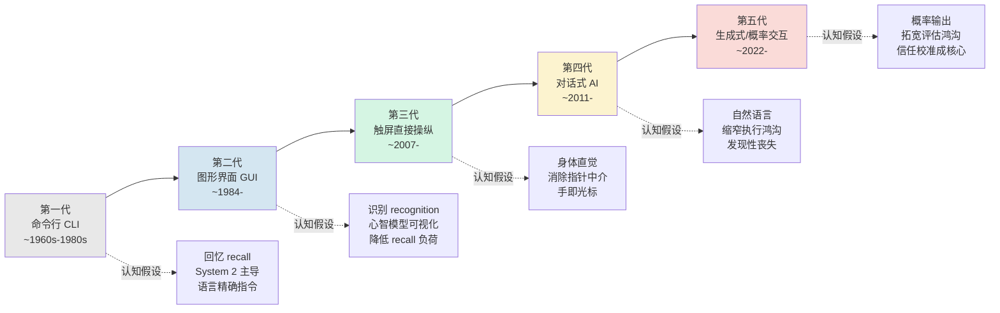

# G01 HCI 认知范式代际谱系总图

人机交互（HCI）史常被讲成一部"界面越来越友好"的进步史：命令行→图形界面→触屏→语音→AI 对话，每一代都"更自然、更易用"。本节点要解决的问题是：**这套进步叙事在认知科学上是错的**。每一代界面真正改变的不是"友好度"，而是**它对用户大脑下了什么认知假设**——要求用户记什么、看什么、信什么、何时切换 System 1 与 System 2。一旦换了认知假设，旧界面解决的瓶颈被消除，新的瓶颈同时被制造出来。本节点用 Kahneman 双系统、Norman 心智模型、Miller/Cowan/Sweller 认知负荷三把尺子，给五代交互范式画一张**认知谱系图**，并刻意以"每代的反例"对抗线性进步史。这是整个 0426 专题的纵向骨架：它把后面各代际节点要展开的认知机制，先安放在一条时间轴上。

> [!note] 本节点在专题中的位置
> 0426 专题是 [p302 - 七种 AI 交互设计模式](/kb/产品设计与交互范式/p302-七种-ai-交互设计模式/) 等 p3xx 设计模式之下的**认知科学底座**。p3xx 回答"AI 产品该怎么设计"，本专题回答"用户的大脑为什么会这样反应"。G01 是这条底座的纵向总图——它不讲单个认知机制的细节（那是各 G/A 节点的事），只负责把"代际更替 = 认知假设更替"这条主线立起来。

---

## §0 为什么用"认知假设代际"框架，而不是"技术代际"框架

主流的 HCI 分代叙事是**技术驱动**的：以输入设备（键盘→鼠标→手指→麦克风）或以底层范式（批处理→分时→个人计算→移动→云/AI）来切。这种切法的问题是它**测量的是工程，不是认知**——它能告诉你"鼠标什么时候出现"，但回答不了"为什么 GUI 让普通人第一次能用电脑"。

我选**认知假设**作为分代轴，因为对 PM 而言，决定一个界面成败的从来不是它用了什么硬件，而是它**默认用户能承担多大的认知成本、用哪个系统去处理**。同一块触摸屏，既能做成认知负荷极低的微信，也能做成让人崩溃的某政务 App——硬件相同，认知假设天差地别。

> [!note] 这里的"代"是 Kuhn 意义上的范式，不是版本号
> 借 Kuhn《科学革命的结构》(1962) 的范式（paradigm）概念：范式之间是**不可通约的**（incommensurable），不是简单的优劣递进。GUI 的"直接操纵"心智模型与 CLT 的"语言命令"心智模型，是两套不可互相翻译的世界观——你没法用"鼠标比命令行进步了多少"来度量，因为它们要求用户脑中装的根本是两样东西。详见 0114认识论 中对 范式 的讨论。把 HCI 史读成范式更替而非线性改良，是本节点的方法论赌注。

一个直接推论：**代际更替不是"瓶颈被消除"，而是"瓶颈被搬家"**。下面的谱系图，每一代都标出它"消除了什么瓶颈"和"制造了什么新瓶颈"——这正是反线性进步史的抓手。

---

## §1 谱系总图：五代认知范式

这张图的读法不是"从左到右越来越好"，而是"**认知负担从一个部位转移到另一个部位**"。下表是它的判断密度版本——每一代的认知假设、消除的瓶颈、制造的新瓶颈、以及反线性进步史的反例。

| 代际 | 认知假设（要求用户的大脑做什么） | 主导认知系统 | 消除的旧瓶颈 | 制造的新瓶颈 | 反例（不是单调进步） |
|---|---|---|---|---|---|
| **CLI 命令行** | **回忆**（recall）精确语法；语言即操作 | System 2 全程在线 | 无（起点） | 极高记忆负荷；新手零可发现性 | 至今 DevOps/数据工程仍首选 CLI——可组合性、可脚本化是 GUI 永远给不了的 |
| **GUI 图形界面** | **识别**（recognition）而非回忆；菜单/图标把心智模型外显 | System 1 识别 + System 2 决策 | recall 负荷；可发现性 | 屏幕空间有限→功能藏进多级菜单；间接操纵（鼠标作中介） | 专家用户被 GUI **拖慢**——熟手敲快捷键远快于点菜单；GUI 对高频专家是负优化 |
| **触屏直接操纵** | **身体直觉**；手指即光标，消除指针中介 | System 1 主导 | 鼠标的间接性；学习门槛 | 无悬停/无精确点击；隐藏手势零可发现性（"不知道能左滑"） | 触屏对**文本密集/精确编辑**任务是退步——这也是笔记本没被平板取代的原因 |
| **对话式 AI** | **自然语言**表达意图 | System 1 表达 + System 2 评估（理论上） | 执行鸿沟（不必学命令/找菜单） | 评估鸿沟暴涨；"空白画布"焦虑（不知能说什么） | 自然语言**更慢、更歧义**——"调亮度"说一句话不如直接拖一下滑块（直接操纵在很多场景仍胜） |
| **生成式/概率交互** | 接受**概率性输出**；对不确定结果做信任判断 | System 1 快接受 vs System 2 审视（需主动校准） | 空白画布（AI 帮你起草） | 自动化偏误、锚定、技能退化；幻觉的归因困难 | 生成式在**可证伪/高确定性**任务上反而危险——它把确定系统的"出错=bug"变成"出错=正常分布事件"，用户更难归因 |

接下来逐代展开认知机制。

---

## §2 第一代 CLI：System 2 全程在线的"回忆"范式

命令行的认知假设最苛刻：用户必须**从记忆中检索**（recall）精确的命令、参数、语法，没有任何视觉提示。这是认知心理学里 recall 与 recognition 的经典区分——recall（自由回忆）的认知成本远高于 recognition（再认）。CLI 要求 System 2 全程在线：每一条命令都是有意识、分析性、受工作记忆限制的操作（容量见 Miller/Cowan，详 [A03 认知负荷理论与 AI 信息呈现](/kb/专题-人文社科透镜/a03-认知负荷理论与-ai-信息呈现/)）。

用 Miller (1956)《The Magical Number Seven, Plus or Minus Two》(*Psychological Review*, 63:81–97) 的框架看，CLI 把**所有 chunk 都压在用户的工作记忆里**——你得同时记住命令名、当前路径、上一步输出、目标状态。这正是它对新手的致命门槛。

**反例（反线性进步史）**：CLI 至今没死，而且在专业领域**正在复兴**。原因恰恰是它的"高认知假设"换来了 GUI 永远给不了的东西——**可组合性与可脚本化**。`grep | sort | uniq -c | sort -rn` 这种管道组合，是把人脑的工作记忆负荷"外包"给了 shell 的组合语法。对专家而言，CLI 不是落后的一代，而是**认知负荷外包效率最高**的一代。把 HCI 史写成"GUI 取代了 CLI"是错的——它们服务于不同的 System 1/System 2 配比需求。

---

## §3 第二代 GUI：从"回忆"到"识别"的范式革命，与 Norman 心智模型

GUI 的革命性不在"有图标好看"，而在它把交互的认知基础**从 recall 切换到 recognition**。菜单、图标、窗口是把"系统能做什么"**外显**到屏幕上，用户不必从记忆里检索，只需在看见的选项里**识别**。这是认知负荷的结构性下降——也是普通人第一次能用电脑的真正原因。

这一代正是心智模型理论的主场（Norman 三角，详见 [A04 心智模型形成·概率系统 vs 确定系统](/kb/专题-人文社科透镜/a04-心智模型形成-概率系统-vs-确定系统/)）。Donald Norman 在 "Some Observations on Mental Models" (1983, 收于 Gentner & Stevens 编《Mental Models》) 和后来的《The Design of Everyday Things》(1988/2013) 中给出三角模型：**设计模型 / 用户心智模型 / 系统意象**（system image）。GUI 的设计哲学就是"**直接操纵**"（direct manipulation）——让系统意象尽可能逼近用户的心智模型，使界面元素的行为符合用户对物理世界的直觉（拖动文件夹、拖入垃圾桶）。

Norman 与 Hutchins、Hollan 在 "Direct Manipulation Interfaces" (*Human-Computer Interaction*, Vol.1, 1985, pp.311–338；书章版收于 *User-Centered System Design*, 1986) 中提出**执行鸿沟**（gulf of execution）与**评估鸿沟**（gulf of evaluation）这对概念。GUI 的成就是同时收窄两条鸿沟：图标降低执行鸿沟（看得见怎么做），即时视觉反馈降低评估鸿沟（看得见做成了什么）。记住这对概念——到第四、五代它们会被彻底打破。

> [!note] 业界反方：直接操纵被高估了？
> 接受 Ben Shneiderman 的"直接操纵"是 GUI 的基石——这点无可争议。但**边界**在于：直接操纵假设"用户想操纵的东西能被可视化"。当目标是抽象的（"把这 200 个文件按项目重命名"），直接操纵反而笨拙，CLI 的一行 `rename` 完胜。GUI 不是 CLI 的全面升级，而是用"识别替回忆"换来了"抽象操作变低效"。这是认知假设的 trade-off，不是单调进步。

**反例**：GUI 对**专家用户是负优化**。熟练用户的快捷键（System 1 自动化后的肌肉记忆）远快于在多级菜单里 recognition。这是为什么所有专业软件（IDE、Photoshop、Excel）都保留了大量快捷键——它们承认 GUI 的"识别"范式对高频操作是认知瓶颈，必须让位给"回忆"的自动化。

---

## §4 第三代触屏：身体直觉与"消失的可发现性"

触屏（以 2007 年 iPhone 为标志）把"间接操纵"再推进一步到**身体直觉**：手指直接触碰目标，消除了鼠标这个指针中介。从认知负荷看，这是又一次外在负荷（extraneous load，Sweller 1988/1994 CLT 三分法中设计者可控的那部分）的削减——用户不必把"手的移动"映射到"屏幕上指针的移动"，手即光标。

但这一代制造了一个隐蔽而严重的新瓶颈：**可发现性的崩塌**。GUI 还有菜单和按钮把功能外显；触屏为了沉浸式体验，把大量功能藏进**手势**（左滑删除、长按菜单、双指缩放、底部上滑）。这些手势**零可发现性**——用户根本不知道它们存在。这是认知科学上一次倒退：从 recognition 退回到了某种"需要先知道才能用"的隐性 recall。

**反例**：触屏对**精确编辑和文本密集**任务是退步。没有悬停（hover）状态、没有像素级精确点击、没有物理键盘的触觉反馈和盲打速度。这是为什么笔记本电脑没有被平板取代——对写代码、写长文、做表格这些 System 2 密集任务，触屏的认知假设（轻量、浏览式、单点焦点）根本不匹配。把触屏当作"比 GUI 更先进的一代"是错的——它在一个维度（直觉性）前进，在另一个维度（精确性与可发现性）后退。

---

## §5 第四代对话式 AI：执行鸿沟收窄，评估鸿沟暴涨

对话式 AI（从 2011 年 Siri 到 2022 年 ChatGPT 是其内部的剧烈跃迁）的认知假设是**自然语言即接口**：用户用日常语言表达意图，不必学命令、不必找菜单。

用 Norman 的鸿沟框架看，这一代的特征是**两条鸿沟的剧烈不对称变化**。Yuexi Chen（UMD 博士论文，2025，导师 Zhicheng Liu）系统论证了这个核心悖论：

> AI 通过自然语言交互**缩小了执行鸿沟**（用户更容易表达意图），却同时**拓宽了评估鸿沟**——AI 生成的输出可能不准确或不可信，用户难以判断哪些内容可用。

这是 HCI 认知史上的一次**结构性反转**。前三代界面都在努力同时收窄两条鸿沟；对话式 AI 第一次出现"一条鸿沟塌缩、另一条鸿沟暴涨"的局面。执行端几乎归零（说人话就行），评估端的认知负担却被甩回给用户——而用户往往没有能力判断 AI 输出对不对。

新瓶颈还有"**空白画布综合症**"：自然语言看似自由，实则因为没有菜单提示"系统能做什么"，用户面对输入框反而不知能说什么。这正是 [p303 - 克服空白画布综合症](/kb/产品设计与交互范式/p303-克服空白画布综合症/) 要解决的设计问题——而它的认知根源在这里：对话式界面用"无限语言空间"换掉了 GUI 的"有限可见选项"，可发现性再次崩塌（这与第三代触屏的"手势可发现性丧失"是同一个认知病灶的不同形态）。

**反例**：自然语言**更慢、更歧义**。"把亮度调到 60%"说一句话，远不如直接拖一下滑块——直接操纵在大量场景仍然完胜对话。把对话式 AI 当成"交互的终点/最自然形态"是 hype。自然语言只在"意图复杂、难以可视化操纵"时才胜出；在"目标明确、可直接操纵"时它是认知负荷的倒退。这一代不是淘汰前几代，而是新增了一种适用于特定认知场景的范式。

---

## §6 第五代生成式/概率交互：信任校准成为交互的核心认知任务

第五代（2022 年生成式大模型起）的认知假设是最激进的一次断裂：**用户必须接受"输出是概率性的"**。这正是 [c01 - 认知重构：从确定性系统到概率系统](/kb/基础知识库/c01-认知重构-从确定性系统到概率系统/) 在系统层面论证的范式跃迁，在**交互认知层面**的对应。前四代界面，无论多复杂，背后都是**确定性系统**——同样的操作给同样的结果，出错就是 bug，用户可以归因、可以建立稳定心智模型。生成式系统第一次让"同一输入→不同输出"成为正常态。

这对用户认知的冲击是结构性的，体现在三个认知机制上：

**(1) System 1 快接受 vs System 2 审视的切换失败。** 这是本专题 [A02 双系统理论与 AI 接受](/kb/专题-人文社科透镜/a02-双系统理论与-ai-接受/) 与 [G02 交互认知范式代际演化详解](/kb/专题-人文社科透镜/g02-交互认知范式代际演化详解/) 要详展的机制。Kahneman《Thinking, Fast and Slow》(2011) 的双系统框架——System 1 快速自动、System 2 慢速分析（术语实由 Keith Stanovich 1999 首创，Kahneman 普及）——在这里的关键是：**用户默认用 System 1 接受 AI 输出**（"AI 生成的，应该没问题"），因为启用 System 2 逐句核查的认知成本太高。产品的核心任务变成**校准这个切换**：在低风险处让 System 1 顺畅通过，在高风险处用设计手段强制激活 System 2。

**(2) 自动化偏误（automation bias）放大。** Skitka, Mosier & Burdick (1999, *Int. J. Human-Computer Studies*) 奠基的自动化偏误——倾向无批判接受自动建议、折扣矛盾信息——在生成式时代被急剧放大。Rosbach et al. (2026, arXiv:2603.11821) 对 28 名病理学专家的实验给出一个具体数字：**7% 的自动化偏误率**（专家本来判断正确，却因接受错误 AI 建议而改答案），且时间压力下偏误严重程度上升。医疗场景下，当 LLM 输出含一个错误细节时幻觉相关风险被放大（medRxiv 2025）。

**(3) 评估鸿沟的性质变了。** Dhuliawala et al. (2023, EMNLP, arXiv:2310.13544) 发现一个对 PM 至关重要的不对称：**"过度自信但出错"（overconfident + wrong）比"信心不足但正确"对信任的破坏性大得多**，且信任崩塌后恢复极慢。在确定性系统里，出错是异常态，用户归因于 bug，心智模型不受动摇；在概率系统里，出错是分布内的正常事件，用户**无法稳定归因**，心智模型反复震荡。这是为什么 [p305 - 信任架构与可解释性设计](/kb/产品设计与交互范式/p305-信任架构与可解释性设计/) 把目标定为"校准信任"而非"最大化信任"——它的认知根据就在这里。

**新瓶颈——技能退化（deskilling）。** 这是前四代都没有的全新认知风险。Liu et al. (2026, arXiv:2604.04721, n=1,222, RCT) 给出震撼证据：**仅约 10 分钟的 AI 辅助交互后，参与者独立执行同类任务时表现显著变差、更容易放弃**。机制呼应 Bainbridge (1983)《Ironies of Automation》的自动化悖论——系统越可靠，操作者手动技能越退化，一旦系统失效，最需要技能的人却最生疏。这把 Seligman 的习得性无助框架投射到了 AI 时代。

> [!note] 业界反方：把这一代叫"概率交互"是否言过其实？
> 接受一种合理的反方立场（如部分 HCI 研究者）：目前**直接以 System 1/2 为理论框架研究 LLM 交互的实验性论文仍很少**，大多数研究是隐式援引；把生成式交互拔高为"独立认知范式"有过度理论化之嫌。**我接受这个边界**——本节点对第五代的认知刻画，确实主要建立在"自动化偏误"这一**间接但扎实**的实证基础上，而非"System 1/2 直接测量 LLM 交互"的直接证据（后者是学界空白）。**但我坚持的赌注是**：确定性→概率性的输出本质改变（c01 已论证），必然要求用户认知模式的相应改变，这是逻辑必然而非经验偶然；产品决策无法等待学界把直接实验补齐。这正是本节点标注的 failure scenario——若未来研究证明用户对概率输出与确定输出的认知处理无本质差异，本代的"独立性"论断需下调。

---

## §7 判断主轴：四个"90% 的人会搞错"的代际认知误判

这一节是本节点的命门——把上面的谱系落成 PM 在判断时最常踩的四个坑，每个带"症状→为什么会错→正确做法→真实反例"。

**误判一：把代际更替当成"友好度的单调提升"。**
- **症状**：产品规划里默认"加个 AI 对话框 = 体验升级"，砍掉原有的直接操纵入口。
- **为什么会错**：忽视了每代都在"搬家"瓶颈。对话式 AI 收窄执行鸿沟的同时拓宽了评估鸿沟（Chen 2025）——你为用户省了"找按钮"，却塞给他"判断 AI 对不对"这个更重的认知任务。
- **正确做法**：按任务的认知类型选范式。目标可视化、可直接操纵的（调亮度、裁图），保留直接操纵；意图复杂、难以可视化的（写文案、跨数据问答），才上对话。
- **真实反例**：大量"AI 化"的工具把简单的滑块/按钮换成对话框，用户体验不升反降——这是误把"新范式"当"全面升级"的典型代价。

**误判二：以为新一代消除了旧一代的认知瓶颈。**
- **症状**：认为生成式 AI"解决了"空白画布问题，于是不再做可发现性设计。
- **为什么会错**：生成式只是把"空白画布"从用户侧搬到了"用户得判断 AI 起草得对不对"的评估侧。瓶颈没消失，换了部位。
- **正确做法**：对每个新范式，显式问"它把认知负担转移到了哪里"，并在那里补设计（如 [p304 - 防御性 UX：对抗延迟与幻觉](/kb/产品设计与交互范式/p304-防御性-ux-对抗延迟与幻觉/) 的置信度外显、溯源引用）。
- **真实反例**：Beck et al. (2025, arXiv:2509.08514, N=2,784) 发现，要求用户纠错反而**降低参与度、提高对错误建议的接受率**——因为纠错的额外认知成本激活了 System 1 的省力策略。"让用户审核"不是免费的，它本身是认知负荷。

**误判三：假设所有用户在新范式下的认知反应一致。**
- **症状**：用单一信任模型设计 AI 产品，假设"用户会理性核查输出"。
- **为什么会错**：个体对 AI 的态度差异巨大。Beck et al. (2025) 发现**个体对 AI 的态度是绩效最强预测因子，超过人口统计变量**；怀疑者检测错误更可靠，"自动化友好者"表现出危险的过度依赖。Horowitz & Kahn (2023, arXiv:2306.16507, 9 国 9,000 人) 更发现"U 型"规律：AI 知识中等者自动化偏误最强（类比 Dunning-Kruger）。
- **正确做法**：按用户的 AI 素养与信任倾向分层设计干预强度，而非一刀切。
- **真实反例**：Rosbach et al. (2026) 中，专业经验和自我效能感越高的病理学家，对 AI 的依赖越低——专家与新手的认知风险曲线完全不同。

**误判四：把"概率系统出错"等同于"确定系统的 bug"。**
- **症状**：用修 bug 的思路对待 AI 幻觉——"找到根因，修掉它"。
- **为什么会错**：确定系统的错误是异常态、可归因、可消除；概率系统的错误是分布内正常事件、不可彻底消除（见 [幻觉](/kb/基础知识库/幻觉/)）。把它当 bug 管理，会反复挫败并误导用户心智模型。
- **正确做法**：把"出错"作为常态纳入设计（优雅降级、不确定性诚实表达、校准信任而非最大化信任）。
- **真实反例**：Dhuliawala et al. (2023) 证明"过度自信 + 出错"对信任的破坏远大于"信心不足 + 正确"——确定系统里不存在这种不对称，因为它根本不"自信地出错"。

---

## §8 产品 PM 视角补盲：认知谱系之外的三个盲点

工程视角容易把这张图读成"交互技术路线图"。补三个非工程盲点：

- **商业模式盲点**：每一代范式的"认知假设"直接决定**谁是用户**。CLI 的高认知假设把用户锁定在专业人群（B 端、开发者）；GUI 的低认知假设打开了消费级大众市场（PC 革命的真正引擎不是图形，是 recall→recognition 的认知民主化）。第五代的认知假设——"用户得有能力校准对概率输出的信任"——可能正在**重新收窄**用户群：缺乏 AI 素养的用户在概率系统里风险更高（自动化偏误更强）。这意味着生成式产品的可及性悖论：界面门槛降到最低（说人话即可），但**安全使用的认知门槛反而升高**。
- **合规/责任盲点**：代际更替也在转移**出错的责任归属**。确定系统里出错是厂商的 bug，责任清晰；概率系统里"用户接受了 AI 的错误建议"，自动化偏误（7% 实测率）让责任变得模糊——是 AI 错了，还是用户没尽到核查义务？这在医疗、金融、安全等高风险场景是真实的法律灰区，PM 必须在设计阶段就用"强制 System 2 断点"来界定责任边界。
- **用户心智模型盲点**：用户会用**旧范式的心智模型**套用新范式，造成系统性误用。把确定性软件的心智模型（"它会照我说的精确执行、可复现"）套到 LLM 上，是当前最普遍的安全隐患——用户预期一个确定的工具，得到的是一个概率的合作者。这也是 [A04 心智模型形成·概率系统 vs 确定系统](/kb/专题-人文社科透镜/a04-心智模型形成-概率系统-vs-确定系统/) 要展开的"概率系统心智模型难以稳定"问题的代际根源。

---

## §9 跨域呼应：Kuhn 范式不可通约性如何改写"HCI 进步史"

本节点的方法论支柱是 Thomas Kuhn《科学革命的结构》(1962) 的**范式不可通约性**（incommensurability）。Kuhn 反对科学是"知识线性累积"的史观，主张科学史是一系列范式革命，革命前后的世界观**无法用同一套标准互相度量**。

这个框架直接改写了我对 HCI 史的判断：**把五代交互读成"越来越友好"的累积进步，犯的正是 Kuhn 批判的那种辉格史（Whig history）错误。** 直接操纵的 GUI 范式与语言命令的 CLI 范式之间，不存在一把公共的"友好度尺子"——它们对"用户大脑该做什么"的假设不可通约。用 recognition 的标准衡量 CLI，CLI 是落后的；用可组合性的标准衡量 GUI，GUI 才是落后的。**没有中立的进步度量**，只有"在什么认知任务下哪种范式更匹配"。

这个跨域调度不是装饰——它**改变了 PM 的决策动作**：不要问"我们的产品用了最新一代范式吗"（辉格史问法），要问"我们的用户在这个任务上需要哪个 System、能承担多大认知负荷、该用哪代范式的认知假设"（Kuhn 式问法）。范式选择是任务匹配，不是版本竞赛。延伸阅读 0114认识论 与 0117社会学 中对知识生产与技术史叙事的批判。

> [!note] Rick 未读的对手框架（破 echo chamber）
> 引入两个本专题刻意自我拷问的外部声音：**Lucy Suchman**《Plans and Situated Actions》(1987) 从人类学/STS 角度论证人机交互不是"用户执行计划"而是"情境化的即兴应对"——这对本节点"用户带着稳定心智模型操作界面"的预设构成挑战：也许根本不存在稳定的代际心智模型，只有具体情境下的临时应对。**Melnikoff & Bargh (2018)**《The Mythical Number Two》(*Trends Cogn. Sci.*) 则从认知科学内部攻击双系统框架本身**不可证伪**——若 System 1/2 二分本身可疑，那么本节点"按 System 配比给界面分代"的整个轴线就需要降级为启发式隐喻而非理论事实。这两个反方我接受其杀伤力，并据此把本图的认知论断定位为"有用的分析框架"而非"已证实的认知科学定律"。

---

## §10 PM 决策启示：三类落地

- **面试桌**：被问"怎么看 AI 交互的发展趋势"，不要背"越来越自然"的 hype。用本图回答："交互史不是友好度的线性进步，是认知瓶颈的不断搬家——对话式 AI 收窄了执行鸿沟却拓宽了评估鸿沟（Chen 2025），生成式带来了前四代都没有的技能退化风险（Liu 2026 的 RCT 证据：10 分钟即显著）。所以我判断产品的关键不是追新范式，而是按任务的认知类型匹配范式、并在高风险处校准 System 1/2 的切换。" 30 秒，反共识，带证据。
- **选型/产品决策会**：用 §7 的四个误判做 checklist。每上一个 AI 交互特性，先问"它把认知负担搬到哪了""我假设的用户认知反应一致吗（Horowitz U 型曲线说不一致）""我是不是在用修 bug 的思路对待幻觉"。
- **复现/设计落地**：把本图作为 0426 专题的纵向索引——每个具体认知机制（双系统、认知负荷、心智模型、锚定、自动化偏误、技能退化）都能在这张代际图上定位它"在第几代成为核心问题"，从而知道该调 [p303 - 克服空白画布综合症](/kb/产品设计与交互范式/p303-克服空白画布综合症/)、[p304 - 防御性 UX：对抗延迟与幻觉](/kb/产品设计与交互范式/p304-防御性-ux-对抗延迟与幻觉/) 还是 [p305 - 信任架构与可解释性设计](/kb/产品设计与交互范式/p305-信任架构与可解释性设计/) 里的哪个设计模式。

---

## §11 与已有节点的关系

- **对照 [c01 - 认知重构：从确定性系统到概率系统](/kb/基础知识库/c01-认知重构-从确定性系统到概率系统/)（深化 + 视角转换）**：c01 论证的是**系统侧**的确定性→概率性范式跃迁（If-Else → 概率分布采样）。本节点把同一个跃迁映射到**交互认知侧**——它在用户大脑里引发的是 System 1/2 切换、评估鸿沟暴涨、信任校准成核心。c01 回答"系统为什么变了"，G01 回答"用户的认知该怎么跟着变"。不复述 c01 的算法/分布细节。
- **对照 [p302 - 七种 AI 交互设计模式](/kb/产品设计与交互范式/p302-七种-ai-交互设计模式/)、[p303 - 克服空白画布综合症](/kb/产品设计与交互范式/p303-克服空白画布综合症/)、[p304 - 防御性 UX：对抗延迟与幻觉](/kb/产品设计与交互范式/p304-防御性-ux-对抗延迟与幻觉/)、[p305 - 信任架构与可解释性设计](/kb/产品设计与交互范式/p305-信任架构与可解释性设计/)（提供认知底座）**：p3xx 是**设计模式**（怎么做），本节点是它们的**认知理论根基**（为什么有效）。p303 的"场景化入口"之所以有效，是因为本图第四代揭示的"对话式可发现性崩塌"；p305 的"校准信任"之所以是对的目标，是因为本图第五代揭示的"概率系统评估鸿沟与信任不对称"。本节点不复述 p3xx 的设计策略，只补它们的认知谱系出处。
- **对照 0418 审阅瓶颈系列（认知负荷视角的代际续写）**：0418 讨论的 AI 时代"审阅成为新瓶颈"，在本图里有了代际坐标——它正是第五代"评估鸿沟暴涨"在生产协作场景的具体形态。审阅瓶颈不是孤立现象，是 Norman 评估鸿沟在概率系统下的必然放大。不复述 0418 的认知负荷测算。

---

## §12 关联节点

**核心（必读）**
- [c01 - 认知重构：从确定性系统到概率系统](/kb/基础知识库/c01-认知重构-从确定性系统到概率系统/) —— 系统侧范式跃迁，本图交互侧论断的根
- [p305 - 信任架构与可解释性设计](/kb/产品设计与交互范式/p305-信任架构与可解释性设计/) —— 第五代"信任校准"的设计落地
- [p304 - 防御性 UX：对抗延迟与幻觉](/kb/产品设计与交互范式/p304-防御性-ux-对抗延迟与幻觉/) —— 第五代"评估鸿沟"的防御设计
- [p303 - 克服空白画布综合症](/kb/产品设计与交互范式/p303-克服空白画布综合症/) —— 第四代"可发现性崩塌"的设计应对
- [幻觉](/kb/基础知识库/幻觉/) —— 第五代"出错=正常分布事件"的机制根据
- [A04 心智模型形成·概率系统 vs 确定系统](/kb/专题-人文社科透镜/a04-心智模型形成-概率系统-vs-确定系统/) —— 各代认知假设的统一理论语言（Norman 三角模型）

**延伸（可选）**
- [p302 - 七种 AI 交互设计模式](/kb/产品设计与交互范式/p302-七种-ai-交互设计模式/) —— 设计模式总览，本图为其认知底座
- [A03 认知负荷理论与 AI 信息呈现](/kb/专题-人文社科透镜/a03-认知负荷理论与-ai-信息呈现/) —— Miller/Cowan 容量限制，认知负荷分代的物理基础
- [Agent](/kb/基础知识库/agent/) —— 第五代异步/自主交互形态的延伸
- 0114认识论 —— Kuhn 范式不可通约性、辉格史批判
- 0117社会学 —— 技术史叙事的权力与建构视角
- [AI PM 知识图谱·总索引](/kb/ai-pm-知识图谱/ai-pm-知识图谱-总索引/) —— 全图谱入口

---

## 修订日志

- **R1（2026-06-07）**：首稿。建立五代认知范式谱系（CLI/GUI/触屏/对话式/生成式），以"认知假设→消除瓶颈→制造新瓶颈→反例"四列表反线性进步史；调度 Kuhn 范式不可通约性为方法论支柱，引入 Suchman 与 Melnikoff & Bargh 两个对手框架破 echo chamber；接地 Chen (2025)、Dhuliawala (2023)、Rosbach (2026)、Liu (2026)、Horowitz & Kahn (2023)、Beck (2025) 等实证；与 c01 / p3xx / 0418 建立显式升级对照。
- **R1 接地复核（2026-06-07）**：本会话 WebFetch 逐条直接核实五个载重 arXiv 引用——2603.11821（Rosbach et al.，标题/作者/7% 自动化偏误率全部一致）、2604.04721（Liu, Christian, Dumbalska, Bakker, Dubey，n=1,222 RCT、10 分钟效应一致）、2310.13544（Dhuliawala et al.，"过度自信+出错 vs 信心不足+正确"不对称、信任恢复缓慢一致）、2509.08514（Beck, Eckman, Kern, Kreuter，N=2,784、纠错降低参与度、个体态度为最强预测因子一致）、2306.16507（Horowitz & Kahn，~9,000 人 9 国、Dunning-Kruger 式倒 U 曲线一致）。其余引用（Miller 1956、Norman 1983、Kahneman 2011、Skitka 1999、Bainbridge 1983、Kuhn 1962、Suchman 1987、Chen UMD 2025）为经典文献或 briefing 已交叉核实来源。本节点当前 0 处疑似编造、0 处待核实硬事实。
- **2026-06-11 P3.4 校链**：0418 审阅瓶颈专题已迁入 04AI，§"跨域呼应"对照 0418 的〔跨专题待落盘〕降级文本恢复为真 `0418 审阅瓶颈系列` 双链。
