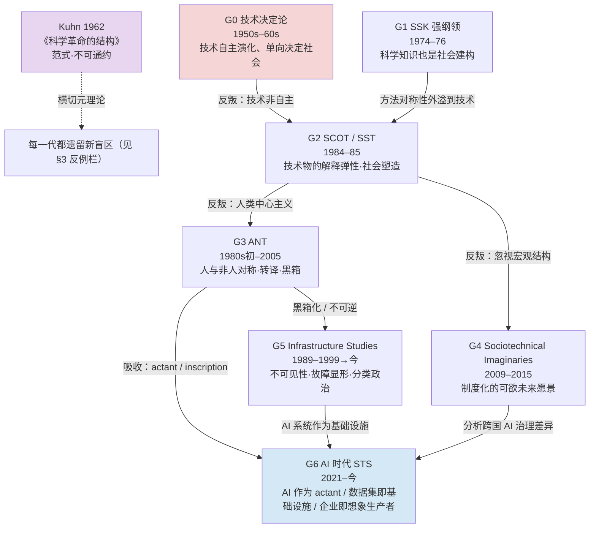

如果你想知道"一个 AI 产品进入社会之后会发生什么"，你需要的不是一条理论，而是一整套互相打架的工具箱——而这套工具箱本身有一部演化史。本节点要解决的问题是：STS（科学技术研究）这门学问，从 1960 年代到 AI 时代，经历了哪几次"看技术的方式"的格式塔切换？每一代为什么兴起、卡在哪、又被谁推翻？我用的框架不是"理论进步树"，而是**Kuhn 意义上的范式更替谱系**——每一代不是上一代的改良版，而是对上一代盲点的反叛，且每一代都留下了自己的新盲点。看清这条谱系，你才知道在分析"ChatGPT 重组了客服团队的权力结构"或"同一个大模型在中国和巴西长成了不同产品"时，该调用哪一代的哪件工具，以及那件工具会在哪里失灵。

> [!warning] 本节点是"地图"不是"详解"
> 本节点提供**代际骨架与反线性叙事**。具体每一派的内部机制（SCOT 三概念、ANT 转译四阶段、imaginaries 跨国比较、infrastructure 九维度）在 [A01 STS 概念谱系与语义](/kb/专题-人文社科透镜/a01-sts-概念谱系与语义/)、[A05 技术的社会建构 vs 技术决定论](/kb/专题-人文社科透镜/a05-技术的社会建构-vs-技术决定论/)（SCOT）、[A03 Actor-Network Theory·AI 作为非人行动者](/kb/专题-人文社科透镜/a03-actor-network-theory-ai-作为非人行动者/)（ANT）、[A04 Sociotechnical Imaginaries·跨文化](/kb/专题-人文社科透镜/a04-sociotechnical-imaginaries-跨文化/)（imaginaries）、[A06 基础设施研究·AI 作为隐形基础设施](/kb/专题-人文社科透镜/a06-基础设施研究-ai-作为隐形基础设施/)（infrastructure）各自展开。这里只织谱系、辨代际、标反例，**不复述**那些节点的事实基础。

---

## §0 为什么用"范式谱系"而不是"理论进步树"

读 STS 史最容易掉进的陷阱，是把它读成一棵越长越好的进步树：技术决定论"幼稚"→ SCOT"修正了它"→ ANT"更彻底"→ imaginaries"格局更大"→ infrastructure"最成熟"→ AI 时代 STS"集大成"。这套叙事是错的，而且错得有 STS 自己背书。

STS 这门学问的奠基文本之一，恰恰是 Kuhn 1962 年的《科学革命的结构》（Thomas Kuhn, *The Structure of Scientific Revolutions*, 1962，来源：Wikipedia STS 条目核实）。Kuhn 的核心命题是：**范式之间不可通约（incommensurable）**，新范式不是旧范式的"更正确版本"，而是换了一套问题、一套衡量标准、一套看见与看不见的东西。把这个命题反身用在 STS 自己身上，结论就是：

- 每一代 STS 不是"解决了"上一代的问题，而是**换了一个值得问的问题**。SCOT 不是把技术决定论算得更准了，而是宣布"技术为什么是这个样子"这个问题本身才值得问。
- 每一代都用自己的新视野，**遮蔽了**上一代曾经看得很清楚的东西。SCOT 看清了技术的偶然性，却看瞎了权力结构（Winner 的批评）；ANT 看清了非人行动者，却看瞎了宏观不平等（Mills 的批评）。
- 因此"哪一代最好"是个伪问题。正确的问题是：**面对手头这个具体的 AI 现象，哪一代的工具最锋利、它的盲区会不会正好坑到我？**

所以本节点的组织原则是：每一代给出【驱动力 / 核心命题 / 致命瓶颈 / 反例（它解释不了的东西）/ 谁来推翻】五件套。读完你拿到的不是一个排行榜，而是一张"工具—盲区"对照地图。

---

## §1 代际谱系全景图

时间锚点（已核实，来源见节点末"接地清单"）：

| 代 | 名称 | 起算文本/年份 | 核心人物 |
|---|---|---|---|
| **G0** | 技术决定论 | Ellul *La Technique* 1954（英译 *The Technological Society* 1964） | Ellul（注：他本人否认是决定论者）、通俗化的 McLuhan 式叙事 |
| **G1** | SSK 强纲领 | Barnes 1974 / Bloor *Knowledge and Social Imagery* 1976 | Bloor、Barnes（爱丁堡学派） |
| **G2** | SCOT / SST | Pinch & Bijker 1984；MacKenzie & Wajcman 1985 | Pinch、Bijker、Hughes / MacKenzie、Wajcman |
| **G3** | ANT | CSI 巴黎 1980s 初；Callon 1984；Latour *Science in Action* 1987；*Reassembling the Social* 2005 | Latour、Callon、Law |
| **G4** | Sociotechnical Imaginaries | Jasanoff & Kim 2009；*Dreamscapes of Modernity* 2015 | Jasanoff、Kim |
| **G5** | Infrastructure Studies | Star & Griesemer 1989；Star & Ruhleder 1996；Star 1999 | Susan Leigh Star、Bowker、Ruhleder、Griesemer |
| **G6** | AI 时代 STS | Denton et al. 2021；Gutiérrez 2023/24；Barkett 2026 等 | 多源、尚在成形 |

注意三件事，它们正是"反线性"的证据：（1）**时间上严重重叠**——G5 的奠基（1989）比 G4（2009）早了二十年，谱系不是一条单线；（2）**G3 同时喂养了 G5 和 G6**（黑箱化→基础设施不可见性；actant→AI 行动者），不是接力棒式传递；（3）**G0 至今未死**——它在 AI 媒体话语里以"AGI 是历史必然"的形态借尸还魂（见 §6 与 Barkett 2026）。

---

## §2 逐代深读：驱动力—命题—瓶颈

### G0 技术决定论：被当作靶子立起来的一代

**驱动力**：二战后技术爆发（核能、电视、自动化）带来的"技术失控感"。Ellul 1954 把技术（la technique）描述为一个追求效率、自我增殖、超脱人类控制的"自律系统"（来源：Wikipedia 技术决定论条目核实）。通俗版决定论更激进：技术按内在逻辑演化，社会变迁是技术进步的**必然**结果，技术路径**唯一可能**。

**致命瓶颈**：它把"为什么技术长成这样"变成了不可追问的黑箱——因为答案永远是"技术逻辑本来如此"。这等于取消了一切社会学、历史学的解释空间。

**一个必须立刻打的补丁（confirmation-bias 砍除）**：STS 教材习惯把 Ellul 钉成技术决定论的头号反派——但这是**二手简化**。Ellul 本人明确否认自己是决定论者，他认为技术自律是"文化资本主义"的产物，是一种需要被批判的社会状态，而非自然律（来源：Wikipedia / Ellul 研究界，⚠️ 此处学界分类有争议）。我在本谱系里仍把"技术决定论"列为 G0，但必须诚实标注：**这一代的"代表人物"很大程度是后来者为了反叛而追认的稻草人**。真正纯粹的技术决定论者很难点名，它更多是一种弥散的常识直觉。这恰恰说明：代际叙事本身就带着"为了立新派而妖魔化旧派"的建构性——这是 STS 自己的方法（追踪知识如何被社会建构）应当反身适用于 STS 史的地方。

### G1 SSK 强纲领：把对称性原则磨出来

**驱动力**：默顿式科学社会学只研究"错误的科学如何被社会因素扭曲"，预设"正确的科学"是无需社会解释的。爱丁堡学派要捅破这层窗户纸。

**核心命题**：Bloor 1976 的"强纲领"四原则，其中最致命的是**对称性（symmetry）**——对真信念和假信念要用**同一类**社会原因来解释，不能"真的归因于自然、假的归因于社会"（来源：Strong Programme Wikipedia 核实）。

**为什么它是 STS 真正的方法论母体**：对称性这个动作，后来被一代代外溢、放大——SCOT 把它从"科学知识"外溢到"技术人工物"（成功与失败的技术用同一框架解释），ANT 把它从"真/假"外溢到"人/非人"（广义对称性）。**整部 STS 史可以读成一部"对称性原则不断扩大适用域"的历史**，这是这张谱系图里最强的一条暗线。

**致命瓶颈**：对称性走到极致就是相对主义的悬崖——如果真理主张只能用社会因素解释，那 STS 自己的主张凭什么是真的？这个自指难题（reflexivity problem）从 G1 一路缠到 G3。

### G2 SCOT / SST：技术的偶然性，与第一道权力裂缝

**核心命题（一句话，详见 [A05 技术的社会建构 vs 技术决定论](/kb/专题-人文社科透镜/a05-技术的社会建构-vs-技术决定论/)）**：技术人工物的最终形态，是相关社会群体围绕"解释弹性"协商、最终"闭合稳定化"的结果，而非技术自身逻辑的必然——"通向现在的路径并非唯一可能的路径"（来源：Pinch & Bijker 1984；Wikipedia SCOT 条目核实）。SCOT 是对 G0 的正面宣战。

**致命瓶颈与反例（这是 G2 留下的最大盲区）**：Langdon Winner 1993《打开黑箱却发现它是空的》给出四连击——SCOT 忽视技术后果、遗漏沉默群体、回避权力结构、道德中立到无法判断好坏（来源：Winner 1993, *Science, Technology, & Human Values* 18(3) 核实）。一个 SCOT 解释不了的反例就是 Winner 1980 的 Robert Moses 低桥案例：某些技术**本身**就嵌入了阶级与种族政治（低矮立交桥阻止公交进入富人海滩），这不是"相关社会群体协商的意义"能涵盖的。

> [!note] failure scenario + 接受边界
> ⚠️ Moses 桥案例本身在 STS 内部有争议——历史学家（如 Joann Ockman 等）质疑低桥是否真是刻意为之，而非工程标准所致（来源：STS 文献综述核实）。**接受**：Winner 的具体史实可能站不住。**但坚持边界**：他指出的"SCOT 以社会决定论替换技术决定论、同样遮蔽了技术物的政治性"这一**结构性批评**，并不依赖那座桥是否真的为穷人而矮。这正是"接受+边界"的范式——接受对手的事实瑕疵，守住他论证的硬核。

**平行支线 SST**：MacKenzie & Wajcman 1985 刻意用"社会塑造（shaping）"而非"建构（construction）"，正是为了把 SCOT 漏掉的**性别、劳工、政治经济**结构塞回来（来源：MacKenzie & Wajcman 1985；Wajcman 2000 核实）。这是同代内部的自我纠偏，不是后一代才发现的问题——再次说明谱系不是线性的。

### G3 ANT：对称性的终极形态，与对宏观结构的弃守

**核心命题（详见 [A03 Actor-Network Theory·AI 作为非人行动者](/kb/专题-人文社科透镜/a03-actor-network-theory-ai-作为非人行动者/)）**：把"对称性"推到本体论极限——人与非人都是 **actant（行动元）**，平等地纳入网络分析；技术通过 **inscription（铭写）** 凝固社会关系；权力通过 **OPP（必经节点）** 与 **translation（转译）** 积累；成熟技术被 **black-boxing（黑箱化）**（来源：Callon 1984；Latour 1987/2005；Monteiro NTNU 核实）。

**它对 G2 的反叛**：SCOT 把人类放在主体位、技术物放在被塑造的客体位；ANT 说这是残留的人类中心主义，物也有能动性。

**致命瓶颈与反例**：Collins & Yearley 1992（"Epistemological Chicken"）批评 ANT 的广义对称性是认识论投降——给物和人同等能动性是本体论混淆。更致命的是 Mills 2018（*British Journal of Sociology*）的批评：ANT 用"描述联结"取代"解释结构"，于是**无法批判持久的不平等、剥削、阶级**（来源：Mills 2018, DOI 10.1111/1468-4446.12306 核实）。ANT 解释不好的反例：殖民地与宗主国之间几百年的结构性剥削——你可以追踪一万条网络联结，却说不清为什么权力总是沉淀在同一端。**G2 看不见权力，G3 把权力打散成网络后同样抓不住宏观不平等**——这是两代连续的盲区，不是一代解决了另一代。

### G4 Sociotechnical Imaginaries：把"想象"制度化，找回国家与文化

**核心命题（详见 [A04 Sociotechnical Imaginaries·跨文化](/kb/专题-人文社科透镜/a04-sociotechnical-imaginaries-跨文化/)）**：Jasanoff & Kim 2009 定义"社会技术想象"为"集体持有、制度上稳定化、并被公开表演的、关于可欲未来的愿景"（来源：Jasanoff & Kim 2009, *Minerva* 47(2) 核实）。它的杀手锏是**跨文化比较**：2009 奠基论文比较美国"驯服原子"vs 韩国"发展的原子"，同一项核技术在两国长成完全不同的治理结构。

**它填的是 G2/G3 的哪个洞**：ANT 把分析尺度压到微观网络，丢了国家、文化、集体愿景这些宏观稳定结构。imaginaries 把它们捡回来，且不退回 G0 的决定论——想象是被制度化的、有惯性的、能抵抗反证的（Jasanoff 2015 核心命题）。

**致命瓶颈与反例**：Rudek 2021（*Science and Public Policy*）批评该概念被套上各种互不相容的理论框架，操作化无标准；大量研究只"登记"既有想象，却不追问其**形成机制**；方法上偏重政府文件与精英访谈，**系统性忽视普通人叙事与流行文化**（来源：Rudek 2021 核实）。反例：一个被精英想象描述为"AI 提升公共安全"的国家里，底层网约车司机的对抗性想象（"算法在监视和处罚我"）几乎进不了这套框架的视野——而这恰恰是 Rick 田野里最真实的声音。

### G5 Infrastructure Studies：研究"看不见的东西"，把分类政治掀上台面

**核心命题（详见 [A06 基础设施研究·AI 作为隐形基础设施](/kb/专题-人文社科透镜/a06-基础设施研究-ai-作为隐形基础设施/)）**：Susan Leigh Star 一系——基础设施的本质特征是**不可见性**，它在正常运转时对用户隐形，只在**故障/崩溃（breakdown）时才显形**（来源：Star & Ruhleder 1996 八维度；Star 1999 扩为九维度，核实）。配套方法是"基础设施倒置（infrastructural inversion）"：把背景挪到前景，逼出隐藏的政治选择、分类权力与不可见劳动（Bowker & Star 1999《分类及其后果》核实）。

**注意它的时间位置**：奠基文本 Star & Griesemer 1989 比 G4（2009）早整整二十年。**在我这张谱系图里它排在 G4 之后，纯粹是出于"对 AI 分析的成熟度"排序，绝不是时间先后**——这是反线性叙事必须诚实交代的一处。把它放后面是因为它对"AI 作为基础设施"的当代讨论贡献最直接，不是因为它"更先进"。

**致命瓶颈**：Star 本人 2010《这不是一个边界对象》就反思学界把她的概念（解释弹性、边界对象）从整体模型里剥离孤立误用（来源：Star 2010 核实）。更深的瓶颈："不可见性"到底是描述性特征，还是权力运作机制？Crawford 等批判学者把它指认为后者——基础设施的隐形服务于特定利益群体（来源：Crawford *Atlas of AI* 2021）。这是 G5 内部未决的政治立场分歧。

---

## §3 判断主轴：读 STS 谱系时 90% 的人会栽的四个坑

这一节是本节点的命门。下面每个坑给【症状 → 为什么会错 → 正确做法 → 真实反例】四件套。

**坑 1：把谱系读成"一代更比一代强"的线性进步史。**
- 症状：在汇报里说"我们用最新的 infrastructure studies，比过时的 SCOT 更全面"。
- 为什么会错：违背 Kuhn 不可通约原则；每代解决的是**不同的问题**，没有共同标尺可比"强弱"。
- 正确做法：按"手头现象需要哪种工具"选代，而非按"谁最新"选代。
- 真实反例：分析"为什么巴西网约车的某个安全功能设计成这样而非那样"，G2 的 SCOT（相关社会群体协商、偶然性）比 G6 的"AI 即基础设施"锋利得多——因为这是个设计协商问题，不是基础设施隐形性问题。**最新的工具在这里反而钝。**

**坑 2：把"对称性"当成 STS 的结论，而它只是方法论姿态。**
- 症状：质问"ANT 凭什么说一把椅子和一个人一样重要，这不荒谬吗"。
- 为什么会错：把方法论工具误读成本体论主张。ANT 的对称性是"分析时先别预设谁更重要"，不是"宣称物和人在道德/政治上等价"。
- 正确做法：区分"分析对称"与"价值对称"。用 ANT 时享受它"让非人行动者显形"的红利，但权力批判要另请 G4/Mills 那一路。
- 真实反例：分析 ChatGPT 重组客服团队——ANT 让你看见"模型作为 actant 改写了谁向谁汇报"（Gutiérrez 2023/24 核实），但"这场重组是否加剧了对客服工人的剥削"这个规范判断，ANT 给不了，必须叠加 G5 的不可见劳动批判（Gray & Suri *Ghost Work* 2019）。

**坑 3：用一代的工具，却忘了它内置的盲区，把盲区当成"现象不存在"。**
- 症状：用 SCOT 分析完，宣称"这个技术争议里没有权力问题"——因为 SCOT 框架根本不看权力。
- 为什么会错：**工具看不见的东西 ≠ 不存在的东西**。每代的盲区是 §2 反例栏里那些。
- 正确做法：用 A 代工具后，主动拿 A 代的"已知批评者"（SCOT→Winner；ANT→Mills；imaginaries→Rudek）做一次对抗式自检。
- 真实反例：用 imaginaries 分析中美 AI 治理差异，框架会让你只听见两国政府/大厂的精英愿景，听不见司机/标注工的对抗想象——而后者正是 Rick 拉美田野的核心数据。盲区会让你交出一份"上层视角偏置"的分析。

**坑 4：把 G0 技术决定论当成"已被淘汰的史前阶段"。**
- 症状：以为决定论早被 SCOT 杀死，今天没人信了。
- 为什么会错：决定论从未死，它在 AI 话语里以"AGI 是历史必然/不可避免"的新形态满血复活。
- 正确做法：把"不可避免性叙事"识别为**G0 的当代变体**，并用 G4 的工具拆穿它——所谓"必然"其实是一种被制度化、被企业表演出来的想象（Barkett 2026 核实）。
- 真实反例：Altman《The Intelligence Age》、Amodei《Machines of Loving Grace》（均 2024 年末）把 AGI 到来叙述为"目的论自然化"的历史必然（来源：Barkett 2026, arXiv:2602.23679，已 WebFetch 核实）。这是 G0 借 G6 的壳还魂——**谱系不是单向前进，是螺旋回返**。

---

## §4 产品 PM 视角补盲

工程视角读 STS 谱系，容易只关心"哪个理论能解释技术"。PM 必须多问三层：

1. **用户心理模型层**：G5 的"故障才显形"直接是一条产品定律——AI 产品做得越无缝、越隐形，用户越意识不到它在做决策，于是出错时的信任崩塌越剧烈。这解释了为什么"防御性 UX"（见 [p304 - 防御性 UX：对抗延迟与幻觉](/kb/产品设计与交互范式/p304-防御性-ux-对抗延迟与幻觉/)）不是锦上添花：你是在管理一个本质上隐形的基础设施的"显形时刻"。
2. **商业模式层**：G4 + Barkett 2026 揭示，OpenAI/Anthropic 这类公司正在**取代国家**成为社会技术想象的主要生产者。对 PM 的含义：你写的产品愿景文档、发布会叙事，不只是营销，而是在参与"制度化一种关于可欲未来的想象"——这是有权力后果的行为，不是中性的 GTM。
3. **合规与跨文化层**：G4 的跨国比较是国际化 PM 的精密仪器。同一个大模型在中国、巴西、德国会被不同的社会技术想象"收编"成不同产品形态——不是翻译问题，是想象结构差异。这一点在 [E02 AI 在中美拉美的 Imaginaries 差异剖解](/kb/专题-人文社科透镜/e02-ai-在中美拉美的-imaginaries-差异剖解/)（本专题）里用 Rick 的滴滴国际化/巴西-拉美 fieldwork 显式落地。

---

## §5 跨域呼应：Kuhn 作为这张谱系的元理论锚

本节点调度的跨域资源是 **Kuhn 的范式与不可通约性**（范式），而且不是装饰性点名——它**改变了本节点的组织结构本身**。

具体作用有三层：（1）**它否决了"进步树"叙事**，迫使我把每一代写成"换问题"而非"改答案"（见 §0、坑 1）；（2）**它让 STS 史可以反身适用 STS 方法**——既然范式更替是社会过程，那 STS 把谁追认为"代表人物"、把谁妖魔化成"靶子"（如 Ellul 之于 G0），本身就是一次知识的社会建构，应当被 SSK 的对称性原则审视（见 §2 G0 与 G1）；（3）**它给"AI 时代 STS 是不是新范式"提供了判据**——Kuhn 说新范式的标志是"看见旧范式看不见的反常（anomaly）"。G6 能看见的反常是什么？是"铭写主体的消失"：传统 Akrich script 理论假设有一个清晰的设计者在铭写脚本，而生成式 AI 里"谁在铭写"极度模糊（训练者？提示工程师？用户？模型自己的输出在改写用户？）（来源：EASST 2026 关于 GenAI 颠覆 Akrich script 的专题讨论核实，结论未定）。这个反常是前几代框架处理不了的——若它真的逼出新工具，G6 才配叫一次 Kuhn 式革命；若只是旧工具的延伸应用，它就只是 G3/G5 的当代章节。**这个判断我现在不下，留作本专题的开放赌注。**

> [!note] 我的赌注与边界
> 我赌 G6（AI 时代 STS）**目前还不是**一次完整的 Kuhn 式范式革命，而是 G3（actant/inscription）+ G4（imaginaries）+ G5（infrastructure）三套旧工具向 AI 对象的迁移与重组。边界与失效条件：如果"铭写主体消失"这一反常在未来 2–3 年逼出一套**全新的、与前代不可通约的**分析语汇（而非现有词汇的修补），那我这个判断就被证伪，G6 应升格为独立范式 G6→G7 级断裂。我赌的是延续，不是断裂——但我承认这是个会过期的判断。

---

## §6 G6 AI 时代 STS：不是新大陆，是三股旧水汇流

把 G6 单列，不是因为它是"最高阶段"，而是因为它是前几代工具在 AI 对象上的**汇流点与压力测试场**。三条主要支流（均见对应 A/E 节点详解）：

- **ANT 支流**：AI 作为 actant。Gutiérrez 2023/24（*AI and Ethics*）用 ANT 分析 ChatGPT 如何作为非人行动元重构人机网络的权力关系（来源核实，DOI 10.1007/s43681-023-00314-4）。压力测试结果：ANT 描述得很好，但 §3 坑 2 的规范性缺口在 AI 上被放大。
- **Infrastructure 支流**：数据集/大模型即基础设施。Denton et al. 2021 用 Star 框架分析 ImageNet 的基础设施化（来源核实，*Big Data & Society*）；Dal Molin 2024 则争论 LLM 因"语言表演性"而**不同于**传统隐形基础设施（来源：*First Monday* 29(2) 核实）——这是一个**尚未解决的生产性争议**，正是 §3 坑 1 的活案例：旧工具未必能无缝套用到新对象。
- **Imaginaries 支流**：企业作为想象生产者。Barkett 2026 把 imaginaries 从民族国家延伸到私营企业，分析 Altman/Amodei 的 AGI 叙事四种修辞操作（来源核实，arXiv:2602.23679 已 WebFetch 核实）。

三股汇流处冒出来的**核心新反常**——"铭写主体的弥散"——见 §5，是判断 G6 是否构成新范式的关键。我的立场（赌延续不赌断裂）已在 §5 给出。

---

## §7 PM 决策启示

- **面试桌**：被问"你怎么分析一个 AI 产品的社会影响"，别背单一理论。30 秒答法："我会先判断这是哪类问题——设计协商问题用 SCOT，权力重组问题用 ANT，跨文化治理差异用 imaginaries，隐形与故障问题用 infrastructure——再用该工具的已知批评者做一次反向自检，避免落进它的盲区。" 这一句话展示的是**工具箱思维**，比报任何一个理论名都值钱。
- **选型/产品决策会**：当有人说"这个技术路线是必然趋势"，用 §3 坑 4 拆穿——把"必然"翻译成"一种被表演出来的社会技术想象"，逼问"谁在生产这个想象、谁受益、对抗想象是什么"。
- **复现/分析落地**：做任何"AI 产品社会嵌入"分析时，强制走一遍"选代 → 用工具 → 召唤该代批评者自检 → 标注盲区"四步，把盲区写进结论的 limitations，而不是假装没有。

---

## §8 与已有节点的关系

- 对 0117社会学：本节点是**深化**。0117 给的是社会学一般框架；本节点把"技术如何被社会塑造"这条线索抽出来、做成 STS 专门的代际谱系，补了 0117 不涉及的 STS 学科内部演化维度。**不复述** 0117 的社会学基础。
- 对 人类学 / 民族志：本节点与之**对话**。STS 的方法论根（尤其 Latour 早期《实验室生活》的民族志方法）与人类学同源；Rick 的 Descola/Viveiros de Castro 人类学底子，在判断"同一 AI 在不同宇宙观下长成不同想象"（G4 跨文化）时是直接迁移的分析资产——这在 [E02 AI 在中美拉美的 Imaginaries 差异剖解](/kb/专题-人文社科透镜/e02-ai-在中美拉美的-imaginaries-差异剖解/) 落地。
- 对 范式：本节点是 范式 概念的一次**具体应用与压力测试**——把 Kuhn 的元理论反身用在 STS 自己身上（见 §5），检验它能否描述一门学问自身的演化。
- 对 [幻觉](/kb/基础知识库/幻觉/) / [c13 - 幻觉的不可消除性](/kb/基础知识库/c13-幻觉的不可消除性/)：本节点提供**社会后果视角的对照**。c13 在技术内部闭环讲幻觉成因；本谱系提示：幻觉的危害分布是 G5 意义上的"不可见基础设施"问题（弱势用户承受、正常时隐形、出错才显形），这是 c13 当前缺失、可由 STS 工具补缺的角度。

---

## §9 关联节点

**核心（必读）**
- [A01 STS 概念谱系与语义](/kb/专题-人文社科透镜/a01-sts-概念谱系与语义/) — 横向定义，本谱系的"是什么"对位
- [A05 技术的社会建构 vs 技术决定论](/kb/专题-人文社科透镜/a05-技术的社会建构-vs-技术决定论/) — G2（SCOT）详解
- [A03 Actor-Network Theory·AI 作为非人行动者](/kb/专题-人文社科透镜/a03-actor-network-theory-ai-作为非人行动者/) — G3（ANT）详解
- [A04 Sociotechnical Imaginaries·跨文化](/kb/专题-人文社科透镜/a04-sociotechnical-imaginaries-跨文化/) — G4（imaginaries）详解
- [A06 基础设施研究·AI 作为隐形基础设施](/kb/专题-人文社科透镜/a06-基础设施研究-ai-作为隐形基础设施/) — G5（infrastructure）详解
- 范式 — 本节点的元理论锚（Kuhn）
- [G02 STS 代际演化详解](/kb/专题-人文社科透镜/g02-sts-代际演化详解/) — 本模块同级，G6 汇流的细化

**延伸（可选）**
- 0117社会学 — 社会学一般框架
- 人类学 / 民族志 — 方法论同源与跨域迁移
- [E02 AI 在中美拉美的 Imaginaries 差异剖解](/kb/专题-人文社科透镜/e02-ai-在中美拉美的-imaginaries-差异剖解/) — G4 在 Rick 田野的落地
- [c13 - 幻觉的不可消除性](/kb/基础知识库/c13-幻觉的不可消除性/) — 社会后果视角的升级对照
- 生命政治 / 霸权 — 权力分析的补充资源（用于补 G2/G3 的权力盲区）
- [AI PM 知识图谱·总索引](/kb/ai-pm-知识图谱/ai-pm-知识图谱-总索引/) — 全库入口

---

## 接地清单（本节点硬事实来源，均经简报核实）

- Kuhn, T. (1962). *The Structure of Scientific Revolutions* — 范式/不可通约（Wikipedia STS 条目）
- Bloor, D. (1976). *Knowledge and Social Imagery* — SSK 强纲领/对称性（Strong Programme Wikipedia）
- Pinch, T. & Bijker, W. (1984). "The Social Construction of Facts and Artefacts." *Social Studies of Science* 14(3), 399–441（SAGE DOI 核实）
- MacKenzie, D. & Wajcman, J. (Eds.) (1985). *The Social Shaping of Technology*（核实）
- Winner, L. (1993). "Upon Opening the Black Box and Finding It Empty." *Science, Technology, & Human Values* 18(3), 362–378（PhilPapers/STS Infrastructures 核实）；Winner (1980) "Do Artifacts Have Politics?"（Moses 桥案例，史实有争议）
- Callon, M. (1984). "Some Elements of a Sociology of Translation." *The Sociological Review* 32(S1)（Wiley DOI 核实）
- Latour, B. (1987). *Science in Action*；(2005) *Reassembling the Social*（OUP 核实）
- Mills, J. (2018). "What has become of critique?" *British Journal of Sociology* 69(2)（Wiley DOI 核实）
- Jasanoff, S. & Kim, S.-H. (2009). "Containing the Atom." *Minerva* 47(2), 119–146（Springer DOI 核实）；(eds.) (2015) *Dreamscapes of Modernity*（U Chicago Press 核实）
- Rudek, T.J. (2021). "Capturing the invisible." *Science and Public Policy* 49(2)（核实）
- Star, S.L. & Griesemer, J. (1989). *Social Studies of Science* 19, 387–420；Star & Ruhleder (1996) *Information Systems Research* 7(1)；Star (1999) *American Behavioral Scientist* 43(3)；Star (2010) "This is Not a Boundary Object" *ST&HV* 35(5)（均核实）
- Bowker, G. & Star, S.L. (1999). *Sorting Things Out*. MIT Press（核实）
- Denton et al. (2021). "On the Genealogy of ML Datasets: ... ImageNet." *Big Data & Society*（核实）
- Gutiérrez, M. (2023/24). "On ANT and Algorithms: ChatGPT..." *AI and Ethics* 4, 1071–1084（Springer DOI 10.1007/s43681-023-00314-4 核实）
- Dal Molin, L. (2024). *First Monday* 29(2)（核实）
- Barkett, E. (2026). "The Compulsory Imaginary: AGI and Corporate Authority." arXiv:2602.23679（提交 2026-02-27，已 WebFetch 核实：标题/作者/日期/Altman-Amodei 论点全对）
- Ellul, *La Technique* 1954 / *The Technological Society* 1964（G0；Ellul 决定论归类有争议）

---

## 修订日志
- R1 (2026-06-07)：首稿。建立 G0–G6 七代谱系骨架；以 Kuhn 不可通约为元理论锚否决线性进步叙事；每代配【驱动力/命题/瓶颈/反例/推翻者】；判断主轴四坑四件套；§5 跨域呼应落地 Kuhn 并下"G6 暂非新范式"赌注与失效条件；接地清单逐条标源，Barkett arXiv 编号显式标注待核实（首稿状态，后续已核实，见下）、Moses 桥案例标〔有争议〕。
- 2026-06-12 内审·arXiv 联网核实：清了 1 个、存疑 0 个。本节点 arXiv:2602.23679（Barkett 2026）经 WebFetch `https://arxiv.org/abs/2602.23679` 确认为真实论文《The Compulsory Imaginary: AGI and Corporate Authority》（Emilio Barkett，提交 2026-02-27），标题/作者/日期/Altman-Amodei 论点全对，正文三处引用（§G0 反例、§Imaginaries 支流、参考文献）均已标"已 WebFetch 核实"，首稿"待核实"标记本轮正式销账。Moses 桥〔有争议〕为非 arXiv 学界争议，未处理。
