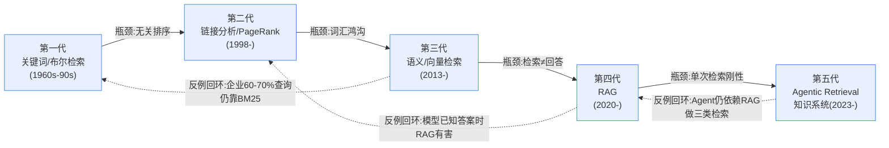

# G01 信息检索代际谱系总图

本节点要解决的问题：当一个 PM 在选型会上被问"你的知识产品到底用哪种检索"时，他脑子里通常只有一条扁平的时间线——关键词检索老了、向量检索新了、RAG 最新、Agent 最潮。这条时间线**几乎全错**。本节点提供的框架不是"检索技术编年史"，而是一张**驱动力—瓶颈—反例**三轴谱系图：每一代检索范式都是为了解决上一代的某个**具体瓶颈**而生，但每一代解决新瓶颈的同时都**重新引入了被上一代解决过的老问题**，并且——这是命门——**没有任何一代真正淘汰了前一代**。读完这张图，你应该能在 30 秒内对任意知识产品需求说清：它在谱系上的位置、它赌的是哪个瓶颈、以及它会在哪里翻车。

> [!warning] 这是知识**产品设计**的代际视角，不是 RAG 技术实现史
> 本节点谈的是"检索范式如何作为产品能力代际演化"，RAG 的工程细节（Reranker 原理、Chunking 策略、RAGAS 四指标）在 [c09 - RAG 架构](/kb/基础知识库/c09-rag-架构/) [m204 - RAG 生产环境：Chunking 与范式演进](/kb/工程化与落地架构/m204-rag-生产环境-chunking-与范式演进/) [m205 - RAG 生产环境：索引运维与评估体系](/kb/工程化与落地架构/m205-rag-生产环境-索引运维与评估体系/) 里讲透了，本节点**不复述**，只在谱系坐标上为它们定位。

---

## §0 为什么是"驱动力—瓶颈—反例"谱系图，而不是技术时间线

读者脑中的默认框架是**线性进步史**：关键词 → PageRank → 语义检索 → RAG → Agentic Retrieval，一代更比一代强，新的出来旧的就该被淘汰。这个框架有三个致命缺陷，每一个都会让 PM 在选型时做出错误决策：

1. **它假设"代"是替换关系**。事实是：2025 年 Glean 自己披露，**60–70% 的企业查询用传统词法搜索（BM25 + 时效性）已足够**（来源：ZenML LLMOps Database, 2023）。第一代关键词检索不仅没死，还在最现代的企业 AI 搜索产品里承担多数流量。
2. **它假设"新代"在所有维度上 dominate 旧代**。事实是：检索噪声可以**覆盖**模型本来正确的推理——"retrieval hurts when the model already knows the answer"（来源：arXiv:2510.09106《When Retrieval Succeeds and Fails》）。给一个本就知道答案的模型硬塞 RAG，准确率反而下降。
3. **它把"驱动力"和"能力"混为一谈**。每一代的诞生是被一个**具体瓶颈**逼出来的，离开那个瓶颈语境，"先进性"就不成立。

正确的框架是 **Kuhn 的范式谱系（paradigm genealogy）** 而非进步阶梯。Kuhn 在《科学革命的结构》里的核心洞见是：范式转移**不是积累式进步，而是不可通约（incommensurable）的视角切换**——新范式擅长解的问题，恰恰是旧范式根本看不见的问题；而新范式会**丢失**旧范式曾经解得很好的某些问题。把这条用到检索上：每一代检索范式都是一次"看见新问题、丢失老能力"的格式塔切换。**这张图的价值不在排序，在于让你看清每一代的盲区。**

下面这张谱系矩阵是本节点的骨架——后续每一节都是对其中一行的展开：

注意图里那三条**虚线回环**——它们是本节点最反共识的部分：每一代都向更早的某一代"回流"，证明谱系不是单向阶梯，而是螺旋。

---

## §1 第一代：关键词与布尔检索——把"匹配"当成"相关"

**驱动力**：1960s–90s，文档数字化产生了"如何在海量文本里定位含特定词的文档"的需求。倒排索引（inverted index）+ 布尔逻辑（AND/OR/NOT）+ 后来的 TF-IDF / BM25 加权，构成第一代的全部。

**核心假设**：用户的信息需求可以被表达为关键词的集合，文档与查询的相关性约等于**词面重叠度**。

**瓶颈**：词面匹配把"匹配"等同于"相关"。两个问题致命——其一是"垃圾文档塞满目标词也能排到前面"（spam / keyword stuffing）；其二是同一文档集里成千上万篇都含目标词，**它给不出"哪篇更重要"的排序信号**。

**反例（为什么它没死）**：第一代是被讲述得最像"史前时代"的一代，但它在 2026 年的知识产品里活得最好。BM25 在**企业特有实体查询**（产品代码、团队名、专有名词、序列号）上系统性优于 embedding 语义检索（来源：tianpan.co, 2026）。原因很硬：语义向量擅长"意思相近"，但"GX-4471-B 这个零件号"没有"意思相近"可言，它要的就是**精确字面命中**。这就是为什么 2025 年工程共识是**混合检索（BM25 + 向量 + RRF）**——混合检索比纯向量 Precision@5 平均高 12–19%（来源：largitdata.com, 2025）。<mark>第一代不是被淘汰，而是被**降格为混合架构里不可或缺的一路**。</mark>

> [!note] PM 视角的第一个反共识
> 当供应商对你说"我们用最先进的语义检索，告别过时的关键词搜索"——这是一句**红旗话术**。它要么不懂自己的系统，要么在向你隐瞒：任何严肃的生产检索系统都保留着 BM25 这一路。问他"专有名词查询怎么处理"，对方答不上来就出局。

---

## §2 第二代：链接分析与 PageRank——用"结构"补"内容"看不见的权威

**驱动力**：1998 年，Page、Brin、Motwani、Winograd 的 PageRank（《The PageRank Citation Ranking: Bringing Order to the Web》, Stanford Technical Report SIDL-WP-1999-0120, 1998；来源经 WebSearch 核实）解决的正是第一代的排序瓶颈：当一万篇文档都含目标词，**谁更权威**？

**范式切换（Kuhn 意义）**：第一代只看文档**内部**（词频）。PageRank 第一次引入了**文档之间的关系结构**——把"被多少高质量页面链接"作为权威信号。这是一次真正不可通约的视角切换：相关性第一次从"文档内属性"变成了"文档间关系属性"。

**瓶颈**：PageRank 解决了"权威排序"，但它仍然是**词面匹配之上的排序层**——它没有解决"用户用'怎么治感冒'查，文档写的是'上呼吸道感染的处理'"这种**词汇鸿沟（vocabulary gap）**。同义、近义、多语言表达，PageRank 一概看不见。此外，PageRank 假设链接是"诚实的权威投票"，但 SEO 产业链很快把它变成了**可操纵的军备竞赛**（买链接、链接农场）——这是"关系信号也会被博弈污染"的第一次大规模演示。

**反例 / 回环**：PageRank 的"关系结构即信号"思想没有消失，它在 25 年后以**知识图谱检索**的形式王者归来——GraphRAG 的社区检测、多跳推理，本质上是 PageRank"用结构补内容"哲学的现代回响（详见 [S01 知识系统分层剖面](/kb/专题-人文社科透镜/s01-知识系统分层剖面/) 与下文 §5）。同时它也告诉我们一个反进步主义的教训：**没有哪种信号是"不可被博弈的"**。今天 AI 搜索引擎的引用源里，Perplexity 有 46.7% 引用来自 Reddit（来源：DiscoveredLabs, 2026）——这是新一代的"链接农场"问题：当一个信号被产品用作权威依据，内容生产者就会去优化那个信号。

---

## §3 第三代：语义 / 向量检索——填平词汇鸿沟，却引入"语义噪声"

**驱动力**：2013 年 Word2Vec、2018 年 BERT、2019+ 的 Sentence Transformers，让文本可以被压缩成稠密向量（[Embedding](/kb/基础知识库/embedding/)）。向量近邻搜索（ANN）解决了第二代留下的词汇鸿沟瓶颈——"怎么治感冒"和"上呼吸道感染处理"在向量空间里相邻，无需词面重叠。

**范式切换**：相关性从"词面/链接"彻底转移到"**语义空间中的几何距离**"。这是第三次格式塔切换：检索第一次能处理"意思相近但用词完全不同"。

**瓶颈（这是被低估的一代级缺陷）**：向量检索把**精度换成了召回**。它擅长"找意思相近的"，但带来三个新失败模式：
- **语义噪声**：语义"相近"不等于"相关"，更不等于"正确"。检索回一堆主题相关但答非所问的 chunk，是向量检索的常态病。
- **专有名词盲区**：见 §1，精确字面命中是它的硬伤。
- **"匹配但不回答"**：这是最深的瓶颈——向量检索能找到**相关段落**，但它**不生成答案**。用户要的是"答案"，第三代给的是"一堆可能相关的文档"。

**反例**：向量检索常被当成"RAG 的当然基础"，但 §0 提到的 arXiv:2510.09106 反例在这里同样成立——**检索质量是瓶颈，垃圾进垃圾出**。向量检索本身不是答案，它只是把"找文档"做得更好了，却把第四代的诞生（"怎么把找到的文档变成答案"）逼了出来。

---

## §4 第四代：RAG——把"检索"接到"生成"，但幻觉与陈腐如影随形

**驱动力**：2020 年 Lewis et al. 的 RAG（《Retrieval-Augmented Generation for Knowledge-Intensive NLP Tasks》, NeurIPS 2020）解决第三代的"匹配≠回答"瓶颈：把向量检索的结果喂给 LLM，让模型**基于检索内容生成答案**。检索负责"找到证据"，生成负责"组织成答案"——这是参数记忆（[幻觉](/kb/基础知识库/幻觉/) 的温床）与非参数记忆（可更新、可审计）的联姻。

**范式切换**：检索系统第一次的输出单位从"文档列表"变成"自然语言答案 + 引用"。这定义了今天几乎所有知识产品的形态——[Perplexity](/kb/ai-公司与产品/perplexity/) 是其 C 端教科书级样板。

**三代内部演化**（来源：Gao et al., arXiv:2312.10997, 2024）：Naive RAG（固定 chunk → 生成）→ Advanced RAG（查询改写、重排序、混合检索）→ Modular / Agentic RAG（检索决策嵌入推理流）。

**瓶颈（被营销掩盖的硬限制）**：
- **幻觉没被消除**。法律问答场景仍有 10–60% 的幻觉/缺漏率（来源：MDPI Mathematics 综述《Hallucination Mitigation for RAG: A Review》, 2025）。这与 [c13 - 幻觉的不可消除性](/kb/基础知识库/c13-幻觉的不可消除性/) 的核心论点完全一致：幻觉是**架构性特征**（概率采样 + Softmax 从不留白），RAG 是外部护栏，**降低但不能归零**。
- **检索陈腐（staleness）**：即使知识库里同时存在新旧信息，模型仍可能优先引用过时事实，并被诱导产生有害输出（来源：HoH 基准, Ouyang et al., arXiv:2503.04800, 2025）。"有最新数据"不等于"会用最新数据"。
- **lost-in-the-middle**：长上下文中部信息被系统性忽略，至今未解。
- **单次检索的刚性**：Naive/Advanced RAG 都是 one-shot——查一次、拼一次、生成一次。复杂问题需要多步检索时，它无能为力。

**反例 / 回环**：RAG 最大的反例是 §0 那条——**当模型已经知道答案时，硬塞 RAG 反而有害**（arXiv:2510.09106）。这直接回环到第二代的教训：检索不是越多越好，注入无关证据就是注入噪声。这也是为什么 RAGFlow 2025 评述强调"long-context 暴力塞全文导致**信息洪水（information flooding）效应**"（来源：RAGFlow Blog《RAG at the Crossroads》, 2025）——更多上下文 ≠ 更好答案。

> [!note] PM 视角：警惕两个对称的营销神话
> 神话 A："长上下文窗口（1M token）淘汰 RAG"——被驳为暴力策略，成本禁止性高 + 信息洪水（RAGFlow, 2025）。神话 B："Agent 淘汰 RAG"——见 §5。两个神话共享同一个错误：**把某一代当成银弹，幻想它 dominate 全部维度**。这正是 §0 要拆掉的线性进步史。

---

## §5 第五代：Agentic Retrieval 与知识系统——检索决策本身被纳入推理

**驱动力**：第四代的 one-shot 刚性。Agentic Retrieval 让模型**主动参与检索决策**——何时检索、检索什么、用什么策略、是否需要再检索一轮。

**三个里程碑**：
- **Self-RAG**（Asai et al., 2023/2024）：用反思 token（IsREL / IsSUP / IsUSE）让模型自评"要不要检索""检索质量够不够"——检索**按需触发**，不是每次都查。这直接回应了 §4 的反例（已知答案时别检索）。
- **FLARE**（Jiang et al., 2023）：生成置信度下降时**主动触发**检索，预判未来的信息需求。
- **A-RAG**（Du et al., 《Scaling Agentic RAG via Hierarchical Retrieval Interfaces》, arXiv:2602.03442, 2026-02；arXiv ID 经 WebSearch 核实存在）：向 agent 暴露三种工具（关键词 / 语义 / chunk 读取），分层选择，可随模型规模与 test-time compute 扩展。

**范式切换**：检索从"管线里的一个固定步骤"变成"**推理流里的一个动态决策**"。知识系统不再是"查一次给答案"，而是"像研究员一样多轮搜集—评估—综合"——Deep Research 类产品（OpenAI o3 Deep Research, 2025-02；Perplexity Deep Research, 2025-02）是其产品化形态。

**瓶颈**：工程复杂度与调试困难急剧上升；Self-RAG 的反思 token 训练成本高，小模型上效果不稳定（业界活跃争议，无定论）。更根本的是——**它没有解决幻觉，只是把幻觉推到了更高的抽象层**：Deep Research Agent 生成的引用更多，但 URL 幻觉率**高于**普通搜索增强 LLM（来源：arXiv:2604.03173, 2026〔预印本，待评审〕）。多步推理放大了出错的复利。

**反例 / 回环（本节点最关键的反进步主义判断）**：业界 2025 年最流行的口号是"**Agents 替代 RAG**"。RAGFlow 2025 评述把它直接定性为"**市场营销话术（market-driven stunt）**"——现实是 Agent **依赖** RAG 来完成三类检索：领域知识、对话历史、工具元数据（来源：RAGFlow Blog, 2025）。第五代不是淘汰第四代，而是把第四代变成了自己的**子程序**。这正是谱系图里 G5 → G4 那条虚线回环的含义：<mark>最新一代对前一代的关系不是替换，而是**封装与调用**。</mark>

---

## §6 判断主轴：90% 的人在代际谱系上会搞错的四个点

> [!warning] 这一节是本节点的命门——四个高频错误，每个带"症状→为什么错→正确做法→真实反例"

**错误一：把"代"理解为替换关系（线性进步谬误）**
- **症状**：选型会上说"我们要上最新的 Agentic RAG，淘汰掉老的关键词检索"。
- **为什么错**：每一代解决的是**特定瓶颈**，离开瓶颈语境先进性不成立；且新代会重新引入老问题。
- **正确做法**：按需求类型选代，混合架构是常态而非过渡态。
- **真实反例**：Glean 这种最现代的企业 AI 搜索产品，60–70% 查询仍靠 BM25（ZenML, 2023）。

**错误二：以为"更多检索 = 更好答案"**
- **症状**：把能塞的全塞进上下文，检索 top-50 而不是 top-5。
- **为什么错**：信息洪水 + lost-in-the-middle + 检索噪声覆盖正确推理。
- **正确做法**：检索质量 >> 检索数量；Self-RAG 式"按需检索"优于"每次都查"。
- **真实反例**：模型已知答案时 RAG 反而有害（arXiv:2510.09106, 2025）。

**错误三：把"检索到最新数据"等同于"会用最新数据"**
- **症状**：知识库及时更新了，就以为产品答案时效性没问题。
- **为什么错**：HoH 基准证明，库里同时有新旧信息时，模型仍可能优先引旧的。
- **正确做法**：时效性约束要在**检索排序**和**生成提示**两处同时注入（参见知识时效性专题）。
- **真实反例**：HoH 基准（arXiv:2503.04800, 2025）——过时事实诱导有害输出，即便正确信息在库中。

**错误四：相信"Agent / 长上下文淘汰 RAG"的营销叙事**
- **症状**：因为"Agent 是未来"就砍掉 RAG 基础设施投资。
- **为什么错**：Agent 把 RAG 当子程序调用（领域知识/对话历史/工具元数据三类检索）。
- **正确做法**：把投资重心放在"RAG 演化为 Context Engine（上下文引擎）"，而非"用 Agent 替换 RAG"。
- **真实反例**：RAGFlow 2025 直接把"Agents 替代 RAG"定性为 market-driven stunt。

---

## §7 产品 PM 视角补盲：谱系图之外的三个看走眼点

工程视角看的是"哪代技术指标更高"，产品 PM 必须补三个工程视角看不见的维度：

1. **用户心理模型的代际错位**。用户对"搜索"的心智模型停留在第一/二代——"我输关键词，你给我一列链接，我自己判断"。第四/五代给的是"一个直接答案 + 引用"，这**改变了信任的归属**：在链接列表里，判断责任在用户；在 RAG 答案里，**产品替用户做了判断**，于是产品要为答案的对错负责。这就是为什么 [Perplexity](/kb/ai-公司与产品/perplexity/) 的引用错位幻觉会成为"被聚光的样板"——不是它幻觉更多，而是它的产品形态把幻觉**摆到了用户决策的正中央**。

2. **商业模式与代际成本的张力**。代际越往后，单位查询成本越高。Perplexity 用户增长极快但**单位经济亏损**（搜索 + LLM 双成本）。KV Cache 全量缓存方案成本比 RAG 高出至少一个数量级（来源：RAGFlow 2025）。PM 必须把"知识更新成本梯队"作为显式约束：更新索引（小时级）< 持续微调（天–周级）< 全量重训（周–月级）。选哪一代检索，本质上是在选你愿意为"新鲜度"付多少边际成本。

3. **合规边界决定代际下限**。企业生产场景**禁用纯参数记忆**——不是因为性能，而是合规要求**可审计性 + 数据可删除性**（来源：Wang et al., 《Knowledge Mechanisms in LLMs》, EMNLP 2024, arXiv:2407.15017）。这意味着对受监管行业，第零代（纯模型记忆）从一开始就出局，谱系的"可选起点"被合规抬高到了第三代（非参数检索）。

---

## §8 对手框架回应：接受反方，标注边界

**对手立场一（RAGFlow / Modular RAG 阵营）："RAG 没有代际终点，它演化为 Context Engine。"**
- **接受**：完全同意 RAG 正从"模式"演变为统一管理领域知识、工具描述、对话历史的"上下文引擎"——本节点的 G4→G5 封装关系正是这一观点的谱系化表达。
- **边界**：但我坚持"代际"框架仍有价值。把一切都叫"Context Engineering"会**抹平**每一代的特定瓶颈与盲区，让 PM 失去诊断工具。叫它什么不重要，重要的是知道**这一坨能力在哪里会翻车**——而那恰恰是代际谱系（每代的瓶颈与反例）保留的信息。

**对手立场二（Kuhn 的反方，Lakatos）："你用 Kuhn 的'不可通约'是危险的相对主义——难道没有进步，只有视角切换？"**
- **接受**：Lakatos（Rick 未深读的对手框架之一）对 Kuhn 的批评是对的——纯粹的"不可通约"会滑向"怎么都行"的相对主义。检索领域**确有累积性进步**：BM25 → 向量 → RAG 在"处理词汇鸿沟"这个**固定问题**上是单调改善的。
- **边界**：所以本节点的立场是**混合的**——在"解决某个**固定瓶颈**"的维度上承认 Lakatos 式进步（research programme 的 progressive shift）；但在"整体能力是否 dominate"的维度上坚持 Kuhn 式不可通约（新代丢失老能力）。两者不矛盾：进步是局部的、单维的；不可通约是全局的、多维的。**线性进步史的错误，恰恰是把局部单维进步误读成了全局多维 dominance。**

**对手立场三（Perplexity 拥护者）："引用失败率 37% 是业界最低，证明最新一代检索最可信。"**
- **接受**：Tow Center 2025 研究确实显示 8 款 AI 搜索引擎中 Perplexity 失败率最低（37% vs Grok-3 的 94%；来源：Columbia Journalism Review / Tow Center, 2025-03）。
- **边界**：但"最低"= 37% 失败率，绝对值仍高得不可接受。更要命的是**各研究对"引用失败"定义不一致**（URL 错 vs 内容错 vs 归属错），跨研究不可比。<mark>"最新一代最可信"是一个被相对排名掩盖的绝对失败。</mark>这是 confirmation bias 砍除点：不能因为 Perplexity 是"代际最新 + 排名最好"就当它可信。

---

## §9 跨域呼应：Kuhn 的范式不可通约性，如何改写我们对"检索进步"的判断

**调度的跨域资源：Thomas Kuhn《科学革命的结构》的"范式不可通约性（incommensurability）"。**

把 Kuhn 放进检索谱系，改变的不是"知识点"，而是**判断的方向**。没有 Kuhn，我们会自然地问"哪代检索最好"——这是一个进步阶梯式的问题，答案永远是"最新的"。有了 Kuhn，问题变成"**每一代看见了什么、又对什么瞎了**"——这是一个谱系式的问题，答案是一张盲区地图。

具体地说，Kuhn 的不可通约性逼出了本节点三个核心判断，每一个都与线性进步史相反：
- "新范式擅长解的问题，是旧范式看不见的问题"→ 解释了为什么向量检索能填词汇鸿沟（第一代根本看不见这个问题）。
- "新范式会丢失旧范式解得好的问题"→ 解释了为什么向量检索在专有名词上不如 BM25（它丢了字面精确匹配这个老能力）。
- "范式转移不是积累而是格式塔切换"→ 解释了为什么"Agent 替代 RAG"是伪命题（Agent 不是 RAG 的累积升级，它是封装；二者在不同抽象层运作，不可简单比较谁更强）。

> [!note] 这是 Rick 的不公平优势：用哲学工具拆穿技术营销
> 当 VC、供应商、media 用线性进步叙事兜售"下一代检索"时，Kuhn 给了 PM 一把手术刀：问"它丢失了上一代的哪个能力？它的盲区在哪？"——这个问题任何线性进步框架都回答不了，而它恰恰是选型会上唯一重要的问题。这呼应了 0117社会学 视角下的技术叙事批判：技术代际的"进步话语"往往是**利益相关方建构的**，而非中立的事实描述。

---

## §10 PM 决策启示

- **面试怎么用**：被问"你怎么看 RAG 会不会被 Agent / 长上下文淘汰"——不要选边，画这张谱系图。回答"每一代是封装而非替换关系，Agent 把 RAG 当子程序调用（举 RAGFlow 三类检索的例子），真正的问题不是谁淘汰谁，而是每代的瓶颈在哪"。30 秒展示你有诊断框架而非站队。
- **选型怎么用**：拿到任意知识产品需求，先在谱系图上定位——需要实时信息→Web Search；私有文档 + 多跳→GraphRAG；私有文档 + 语义→向量 RAG；二者皆有→混合；跨源多步研究→Agentic / Deep Research；合规场景→禁用纯参数记忆。然后**立刻问那一代的标志性瓶颈**（如选向量 RAG 就问"专有名词查询怎么办""时效性怎么注入"）。
- **复现怎么用**：搭原型时默认上**混合检索（BM25 + 向量）**而非纯向量——这是把谱系教训直接转成工程默认值；再按需求决定是否加图谱路、是否加 agentic 多轮。

---

## §11 与已有节点的关系

本节点对照并**升高了一个抽象层**：

- 对 [c09 - RAG 架构](/kb/基础知识库/c09-rag-架构/)：c09 讲 RAG 是什么、怎么搭（概念层技术基础）；本节点把 RAG **定位在第四代**，讲它从哪来、解决了谁的瓶颈、又被谁封装。**做的是"定位"而非"复述"**——c09 的 Reranker/混合检索/HyDE 细节本节点不重复。
- 对 [m203 - RAG 生产环境：Embedding 与文档解析](/kb/工程化与落地架构/m203-rag-生产环境-embedding-与文档解析/) [m204 - RAG 生产环境：Chunking 与范式演进](/kb/工程化与落地架构/m204-rag-生产环境-chunking-与范式演进/) [m205 - RAG 生产环境：索引运维与评估体系](/kb/工程化与落地架构/m205-rag-生产环境-索引运维与评估体系/)：m20x 是 RAG 的工程运维细节（第四代内部的实现学）；本节点提供它们的**代际坐标系**，说明这一整套工程为何存在、它的边界在哪。**对话关系**，不复述其指标定义。
- 对 [c13 - 幻觉的不可消除性](/kb/基础知识库/c13-幻觉的不可消除性/)：c13 论证幻觉是架构性的、不可消除；本节点把这条用作"为什么每一代检索都没能消除幻觉"的**贯穿性证据**（§4、§5）——做的是**深化中的"应用"**：把 c13 的理论结论转成代际谱系的判断主轴。
- 对 [幻觉](/kb/基础知识库/幻觉/) [Embedding](/kb/基础知识库/embedding/) [RAG](/kb/基础知识库/rag/) [Perplexity](/kb/ai-公司与产品/perplexity/) [ChatGPT](/kb/ai-公司与产品/chatgpt/) [Gemini](/kb/ai-公司与产品/gemini/) [Agent](/kb/基础知识库/agent/)：本节点把这些原子概念/产品 entity 编织进同一张谱系图，给它们彼此的代际关系。

**升级类型汇总**：对 c09/m20x 是"定位 + 对话"，对 c13 是"应用 + 深化"，对原子概念是"编织"。

---

## §12 关联节点

**核心（必读）**
- [c09 - RAG 架构](/kb/基础知识库/c09-rag-架构/)——第四代的技术解剖，本节点的定位对象
- [c13 - 幻觉的不可消除性](/kb/基础知识库/c13-幻觉的不可消除性/)——贯穿各代的"为什么检索消不掉幻觉"
- [m204 - RAG 生产环境：Chunking 与范式演进](/kb/工程化与落地架构/m204-rag-生产环境-chunking-与范式演进/)——第四代内部的范式演进细节
- [m205 - RAG 生产环境：索引运维与评估体系](/kb/工程化与落地架构/m205-rag-生产环境-索引运维与评估体系/)——第四代的运维与评估
- [Perplexity](/kb/ai-公司与产品/perplexity/)——第四/五代的 C 端产品样板
- 0117社会学——技术进步叙事的批判性视角（§9）

**延伸（可选）**
- [m203 - RAG 生产环境：Embedding 与文档解析](/kb/工程化与落地架构/m203-rag-生产环境-embedding-与文档解析/)——第三代向量化的工程基础
- [RAG](/kb/基础知识库/rag/) [Embedding](/kb/基础知识库/embedding/) [幻觉](/kb/基础知识库/幻觉/)——谱系节点的原子概念卡
- [ChatGPT](/kb/ai-公司与产品/chatgpt/) [Gemini](/kb/ai-公司与产品/gemini/) [Agent](/kb/基础知识库/agent/)——第五代产品/范式的代表
- [AI PM 知识图谱·总索引](/kb/ai-pm-知识图谱/ai-pm-知识图谱-总索引/)——回到 04AI 总入口
- 本专题同级节点：[S01 知识系统分层剖面](/kb/专题-人文社科透镜/s01-知识系统分层剖面/)（架构剖面）、[A02 检索去向决策·search KG parametric RAG](/kb/专题-人文社科透镜/a02-检索去向决策-search-kg-parametric-rag/)（概念辨析·检索去向决策）

---

## 修订日志

- **R0（2026-06-07）**：首稿。建立"驱动力—瓶颈—反例"三轴谱系图（五代）；以 Kuhn 不可通约性为跨域主轴反线性进步史；§6 判断主轴四件套（四个高频错误）；§8 接入 RAGFlow / Lakatos / Perplexity 三方对手立场（含 Lakatos 作为 Rick 未读对手框架，与 Kuhn 互搏）；与 c09/m203/m204/m205/c13 建立"定位/对话/应用/深化"四类升级对照，不复述其技术细节。
- **R0.1（2026-06-07）grounding pass**：WebSearch 核实两条载重事实——(a) PageRank 论文署名补全为 Page/Brin/Motwani/Winograd，技术报告号 SIDL-WP-1999-0120，移除〔史实未核〕标注；(b) A-RAG arXiv:2602.03442 确认存在（Du et al., 2026-02-03），移除〔待核实〕降级，补 test-time compute 扩展表述。剩余待核实：同专题 S01/A01 节点全名待建成后回填双链。
