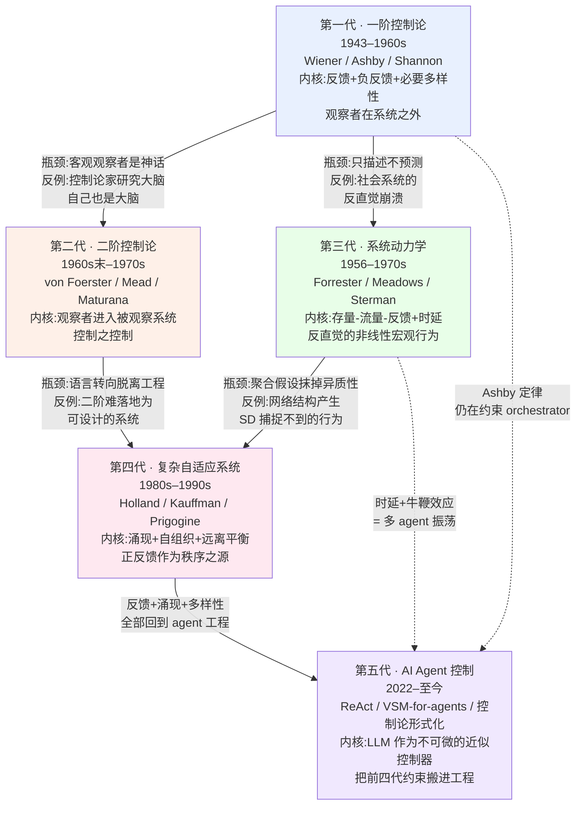

控制论不是一门"过气的旧学科被 AI 取代了",而是一条从 1948 年延续到今天的**控制思想主干**——它要回答的问题始终没变:一个系统(动物、机器、组织、agent)如何通过信息与反馈,在一个比自己更复杂的环境里维持目的、不失控?本节点要解决的问题是:**当我们说"多 agent 系统本质是控制系统"时,这句话背后压着五代人七十多年的思想积累,它们各自解决了什么、又各自在什么地方撞了墙。** 本节用"代际谱系"这个框架,把一阶控制论 → 二阶控制论 → 系统动力学 → 复杂自适应系统 → AI agent 控制串成一条线,但刻意拒绝写成"一代更比一代强"的进步史——每一代的**驱动力、瓶颈、和把它逼出新范式的那个反例**才是给 PM 的真正货。

> [!warning] 这是一张谱系图,不是一条进化链
> 谱系(genealogy)和进化(evolution)是两个不同的隐喻。进化暗示"后者比前者高级、前者被淘汰";谱系只承诺"后者从前者的某个未解问题里长出来,但前者并未死亡"。本节点选谱系框架,正是因为:Ashby 的必要多样性定律(1956)今天仍然约束着 GPT-5 级别的 orchestrator;Wiener 的负反馈回路就是 ReAct 的 observe-decide-act;这些不是"被超越的旧理论",而是仍在生效的结构性约束。

## §0 为什么是"代际谱系"而不是"技术编年史"或"思想史"

读者脑中的默认框架通常有两个,都得先挡掉。

**默认错误框架一:技术编年史。** "1948 年 Wiener 写了书,1970 年 Beer 搞了 VSM,2022 年有了 ReAct……" 这种线性时间轴会让人把控制论读成一堆按年份排列的"成就清单",看不出**每一代是被前一代的什么瓶颈逼出来的**。编年史回答"何时",谱系回答"为什么是它、为什么是这时候"。

**默认错误框架二:纯思想史(谁影响了谁)。** 思想史会陷入"von Foerster 受 Mead 启发、Forrester 师从 Gordon Brown"的人物关系网,但 PM 不需要学术八卦,需要的是**每一代的可操作内核**:它把"控制"这个词的定义改写成了什么,以及这个新定义对今天设计 agent 有什么硬约束。

代际谱系框架的承诺是三件套:**每一代 = 一个驱动力(被什么问题逼出来)+ 一个核心内核(把控制重新定义成什么)+ 一个瓶颈反例(在哪里撞墙,从而催生下一代)。** 这正是 Kuhn 意义上的范式更替结构——不是积累,而是**问题域的格式塔切换**(详见 §7 跨域呼应)。

## §1 谱系总图:五代一张图看完

这张图的读法:**实线箭头是"被瓶颈逼出下一代"的谱系关系,虚线箭头是"旧代约束至今仍生效"的回路。** 注意第一代分叉出两条线——二阶(认识论方向)和系统动力学(工程量化方向),这两条到第四代复杂科学时部分汇流,最后全部沉淀进第五代的 agent 工程。下面逐代拆。

## §2 第一代 · 一阶控制论(1943–1960s):反馈作为通用原语

**驱动力。** 二战防空火控:高射炮要打中机动飞行的飞机,必须根据"炮弹打偏了多少"持续修正瞄准——这是 Wiener 在战时研究中提炼出的核心洞见。1948 年他出版《Cybernetics: Or Control and Communication in the Animal and the Machine》(MIT Press,确证),把"反馈与控制原理在生物系统与机器中**通用**"立为公理。1946–1953 的十届 Macy 会议(Wiener、McCulloch、von Neumann、Mead、Bateson 等)把"信息""反馈""数字/模拟"锻造成跨学科通用语。

**核心内核(三个,都仍在生效)。**

| 内核 | 提出者/年份 | 一句话 | 对 agent 的直接对应 |
|---|---|---|---|
| **负反馈回路** | Wiener, 1948(先驱 Maxwell 1868 调速器) | 输出反向作用于输入,减少偏差,趋向设定点 | ReAct 的 Reason→Act→Observe→Reason 闭环 |
| **Homeostasis(稳态)** | Cannon 命名,1926;前驱 Bernard 1865 | 系统通过负反馈维持内部变量稳定 | agent 的"目标-差距-修正"目标导向行为 |
| **必要多样性定律** | Ashby, 1956《An Introduction to Cybernetics》 | V(R) ≥ V(D)/V(E):控制器多样性必须 ≥ 扰动多样性 | orchestrator 的控制上界 = 可表征状态多样性 |

> [!important] 必要多样性定律是本专题的调度主轴
> Ashby 的原话是 **"Only variety can destroy variety"**(1956,Stafford Beer 后来普及为 "absorb")。它的精确含义经 Ashby 本人与 Shannon 信道定理对应(《Introduction to Cybernetics》10/1 节):**调节能力受限于调节器作为通信信道的容量上限**。翻译成 agent 工程:如果一个 orchestrator 的 context 不足以表征环境的状态多样性,那么它**在信息论上**就不可能完备地控制 worker——这是结构性约束,不是"模型不够聪明"。这一点会在 [A06 Orchestrator 编排器](/kb/专题-安全对齐与失败/a06-orchestrator-编排器/)、[m207 - Agent 产品化：场景推演与失败模式](/kb/工程化与落地架构/m207-agent-产品化-场景推演与失败模式/) 的失败模式里反复出现。

**瓶颈与反例(逼出后两代)。** 一阶控制论预设了一个**站在系统之外、客观中立的观察者**。这个假设有两个裂缝:(a) 当控制论家去研究"大脑如何工作"时,他自己也是一个大脑——观察者无法真正抽身(逼出第二代);(b) 经典控制论擅长**描述**稳定系统,却**预测不了**多回路非线性系统的反直觉崩溃(逼出第三代)。

## §3 第二代 · 二阶控制论(1960s末–1970s):观察者进入系统

**驱动力。** Margaret Mead 在 1967 年美国控制论学会主旨演讲中呼吁:控制论家必须认识自己是"参与性观察者"。Heinz von Foerster 在 1974 年正式阐述一阶/二阶之分,把二阶定义为 **"the control of control and the communication of communication"(控制之控制,沟通之沟通)**——观察者进入被观察系统。

**核心内核。** "观察者是系统的一部分",连带三个同期理论:von Glasersfeld 的激进建构主义、Pask 的对话理论、Maturana & Varela 的自创生(autopoiesis)。对 PM 的含义:**没有"上帝视角"的系统监控**——你设计 agent 评估体系时,评估器本身也在改变被评估对象的行为(这正是 [m207 - Agent 产品化：场景推演与失败模式](/kb/工程化与落地架构/m207-agent-产品化-场景推演与失败模式/) 里 Goodhart 陷阱的控制论根源)。

**瓶颈与反例。** 科学社会学家 Andrew Pickering 直接批评:二阶控制论发生了"语言转向",向哲学/语言学漂移,**脱离了早期控制论的工程技术实践**(确证)。反例很尖锐:二阶控制论很难落地成一个"可设计、可施工"的系统——它是深刻的认识论自觉,却不是工程蓝图。这个瓶颈使它在第四代被复杂科学部分吸收,但本身没有成为主流工程范式。

> [!note] 进步史修正 #1
> 不能说"二阶比一阶高级"。二阶赢在认识论诚实,却**输在可操作性**。今天绝大多数 agent 工程(包括 Beer 的 VSM)其实仍站在一阶立场:假设存在可观察的客观状态、可设计的控制结构。二阶是悬在头顶的提醒,不是替代品。

## §4 第三代 · 系统动力学(1956–1970s):反馈的工程量化

**驱动力。** Jay W. Forrester(1918–2016,确证)师从 MIT 伺服机构实验室的 Gordon Brown,把军用反馈控制的思维带进管理。从 Gordon Brown 的伺服机构 → Wiener 的控制论 → Forrester 的系统动力学,**三者同根**:反馈是理解复杂性的核心原语。1961 年《Industrial Dynamics》奠基。

**核心内核:存量(Stocks)- 流量(Flows)- 反馈回路 + 时延(Time Delays)。** 系统动力学的正式定义(Wikipedia,确证)是"用存量、流量、内部反馈回路、表函数和时延,理解复杂系统随时间的**非线性行为**"。关键贡献是 Forrester 1971 年《Counterintuitive Behavior of Social Systems》:**社会系统是多回路非线性反馈系统,人类直觉在简单线性环境中形成,因此对它的预测系统性偏错。**

**对 agent 的直接对应——这是最被低估的一代。** 著名的"啤酒游戏"(Beer Game,MIT Sloan):供应链各层级各自理性响应库存信号,**时延叠加反馈,导致整条链剧烈振荡,即使终端需求几乎不变**(Sterman 研究确证:玩家系统性低估时延、误读反馈)。这与 [m207 - Agent 产品化：场景推演与失败模式](/kb/工程化与落地架构/m207-agent-产品化-场景推演与失败模式/) 里的"雪崩效应"、Cemri et al.(2025,arXiv:2503.13657)发现的多 agent"无终止信号导致无限循环"是**同一个控制论现象**:局部理性 + 时延 + 反馈 = 全局振荡/发散。

> [!important] 牛鞭效应 = 多 agent 振荡的祖型
> 当多个 agent 独立修改共享计划,推理上的微小差异被反馈放大成"不兼容分叉"(incompatible forks),这在控制论里就是正反馈失稳,在系统动力学里就是 Forrester 早在 1961 年描述的牛鞭效应。把 agent swarm 的宏观行为(资源消耗、任务完成率、协作/竞争均衡)用 SD 框架分析,是一个尚未被工业界充分使用的工具。

**瓶颈与反例。** SD 的连续聚合假设——把所有同类个体聚合成单一存量——抹掉了**异质性和网络结构**。Rahmandad & Sterman(2008,确证)对比同一系统的 ABM 与 SD 模型:agent 同质且充分混合时两者一致,但**存在网络结构和异质性时,ABM 产生 SD 捕捉不到的行为**。这个反例(以及 Forrester《World Dynamics》《Limits to Growth》遭主流经济学界"Nonsense"式批评的世界模型争议)逼出了第四代:自下而上的复杂自适应系统。

## §5 第四代 · 复杂自适应系统(1980s–1990s):涌现与正反馈

**驱动力。** 圣塔菲研究所一代人(John Holland 的遗传算法与 CAS、Stuart Kauffman 的自组织、Ilya Prigogine 的耗散结构)要回答前三代回避的问题:**秩序如何从无序中自发涌现?** 经典控制论偏重负反馈/稳定,把正反馈当成"麻烦"(振荡、发散);复杂科学反转了这个判断。

**核心内核(对前几代的反转)。**

| 反转项 | 前三代立场 | 第四代立场 |
|---|---|---|
| 正反馈 | 不稳定的来源,要压制 | **创新与秩序的来源**(Prigogine 耗散结构) |
| 控制 | 自上而下设计调节器 | **自组织**:宏观模式从微观局部交互涌现,无中央控制器 |
| 平衡 | homeostasis,维持设定点 | **远离平衡态**才有生命力;边缘混沌(edge of chaos) |
| 建模 | 聚合存量(SD) | 自下而上的个体 agent(ABM) |

**对 agent 的直接对应。** 多 agent 系统的"涌现行为"——既是卖点(集体智能超过单体)也是风险(谁也没设计过的失控模式)——正是 CAS 的语言。Miehling, Varshney et al.(IBM Research, arXiv:2503.00237, 2025, 已核实)的论文标题就叫《Agentic AI Needs a Systems Theory》,核心论点:**AI 开发过度聚焦单模型能力,忽略了 agent 与环境、与其他 agent 交互产生的涌现属性**——这是把第四代的问题意识直接搬进 2025 年的 agent 工程。

> [!note] 进步史修正 #2
> 第四代不是"推翻"了控制论的负反馈,而是**补上了它的盲区**。负反馈解释稳定,正反馈解释变化/创新,二者在生命系统里嵌套(局部正反馈嵌在更大的负反馈框架内,实现"决策性跃迁")。一个只会压制正反馈的 orchestrator 会扼杀 agent 的探索;一个放任正反馈的会发散——工程上要的是**嵌套**,这是第四代给 PM 的判断。

**瓶颈与反例。** CAS 强在解释,弱在控制——它告诉你"涌现会发生",却很少告诉你"如何可靠地设计出你想要的涌现、压住你不想要的"。这个"可解释不可控"的缺口,正是第五代 agent 工程不得不正面解决的。

## §6 第五代 · AI Agent 控制(2022–至今):把前四代搬进工程

**驱动力。** LLM 让"用自然语言驱动的通用 agent"第一次成为可能,但也立刻撞上前四代描述过的所有失控模式。于是出现了一波把控制论显式形式化进 agent 的工作。

**核心内核 + 谱系回收。**

- **闭环回到 ReAct。** ReAct(Yao et al., 2022,Princeton & Google)把 agent 从开环(few-shot,无外部信号修正)转为闭环(Reason→Act→Observe),在 ALFWorld 上比纯 CoT 提升约 34%(确证)。这就是 Wiener 第一代负反馈回路的 LLM 实现。
- **VSM 回到多层治理。** Stafford Beer 的可行系统模型(1972《Brain of the Firm》,确证)提供了比"orchestrator-worker"精密得多的五层治理(S1运营/S2协调/S3控制/S4情报/S5政策),且每个 S1 单元本身又是一个完整 VSM(递归自治)。Gorelkin(2024,Medium)已尝试把 VSM 应用于企业 agentic 系统,但诚实指出成本问题:按 token 计费,完整 VSM 架构可能贵到不可行。
- **Ashby 定律回到 context 工程。** 若 agent 的内部状态多样性(推理空间)< 环境状态多样性,控制从根本上不可能完备——这是 agent 在开放世界频繁失败的**信息论解释**,不是"模型不够大"。
- **稳定性形式化。** Eslami & Yu(arXiv:2603.10779, 2026,已核实)首次为 agentic 系统提供控制理论形式化基础,提出五级 agency 层级,用 Lyapunov 等工具分析时变适应、内生切换、决策延迟引入的耦合动力学。

**瓶颈(本代尚未解决,见 §8 对手回应)。** LLM 是**不可微、不可直接观测内部状态、高维**的近似控制器——经典控制论的稳定性工具能否真正适用,仍是开放问题。把 LLM 称为"控制器"目前更多是有解释力的类比,而非工程意义上的稳定性保证。

## §7 判断主轴:用这张谱系时,90% 的人会搞错的四个点

> [!warning] 这是本节点的命门:四个致命误读
> 每点按 **症状 → 为什么会错 → 正确做法 → 真实反例** 四件套。

**误读一:把谱系当成"旧的被新的取代"。**
- **症状:** "控制论是上世纪的东西,现在有 LLM 了,不用学。"
- **为什么会错:** 把谱系当进化链。Ashby 定律(1956)不是会过期的"理论",是和热力学第二定律同级的**结构性约束**。
- **正确做法:** 把每一代当成"仍在生效的约束层",越老的越底层。
- **真实反例:** 2025–2026 年三篇顶会/arXiv 论文(Miehling et al. 2503.00237、Eslami & Yu 2603.10779、Wang et al. 2605.10754)集体回到控制论给 agent 找语法——如果旧理论真过气了,前沿研究者不会回头取经。

**误读二:把"反馈回路"等同于"负反馈/稳定"。**
- **症状:** 设计 agent 时只想着"如何收敛、如何防发散",把所有正反馈当 bug。
- **为什么会错:** 漏掉了第四代——正反馈是创新/探索之源。一个只会压制正反馈的 agent 系统不会有涌现智能。
- **正确做法:** 设计成**嵌套结构**:局部允许正反馈探索,外层用负反馈兜底(对应 VSM 的 S3 控制 + S4 情报平衡)。
- **真实反例:** 奖励劫持(reward hacking,Anthropic 2024 确证)正是失控的正反馈——但解决方案不是"消灭所有正反馈",而是修正奖励信号的设计(对应控制论:不是关掉回路,而是修正传递函数)。

**误读三:把"必要多样性"理解成"context 越大越好"。**
- **症状:** "那我把 context window 拉到 2M 不就有足够多样性了?"
- **为什么会错:** Ashby 定律说的是**有效可表征状态多样性**,不是 token 数。长上下文 LLM 在 100K token 处性能已下降超 50%(arXiv:2512.02445, 2024 据称),增益失稳。塞满噪声的 context 不增加 V(R),反而是 Context Pollution。
- **正确做法:** 提升的是"调节器能区分多少种环境状态并给出不同响应"的能力,这关乎 context 的**结构与信息密度**,不是长度。
- **真实反例:** 这正是 [m208 - AI 基础设施与中间件选型](/kb/工程化与落地架构/m208-ai-基础设施与中间件选型/) 里 RAG/记忆机制要解决的——用结构化检索提升有效多样性,而非无脑堆长。

**误读四:把"涌现"当成褒义词。**
- **症状:** "我们的多 agent 系统会涌现出集体智能!"(销售话术)
- **为什么会错:** 第四代 CAS 的涌现是**价值中立**的——失控、振荡、不兼容分叉同样是涌现。Cemri et al.(2025)的 14 种失败模式大多是负面涌现。
- **正确做法:** 问"你能压住你不想要的涌现吗?"——这是第四代留给第五代的未解难题,谁声称完全解决了谁在吹。
- **真实反例:** Project Cybersyn(1971–1973,智利,确证)是 VSM 最大规模现实应用,设计精密,但其"去中心化自治涌现"到底是民主还是变相中央监控,至今学界争议未决(Eden Medina《Cybernetic Revolutionaries》2011)——涌现的好坏取决于谁定义、谁受益。

## §8 产品 PM 视角补盲:工程之外的三个看走眼点

工程视角只看"系统会不会失控",PM 还得看三层:

1. **用户心理模型错位。** 用户不懂"涌现",他们期待 agent 像确定性软件一样可预测。当 agent 因正反馈探索出一个"创造性但意外"的结果,工程师叫"涌现",用户叫"bug"。**控制论的 homeostasis 隐喻在产品上要翻译成"可预期的稳定边界",而不是"绝对不变"。**
2. **商业模式错位。** 完整 VSM 五层治理在控制论上最优,但 Gorelkin(2024)的诚实结论是:按 token 计费,**精密控制 = 高成本**。PM 的判断是"在哪一层接受控制不完备,换取成本可行"——这是必要多样性定律的商业版:你买不起无限多样性的调节器(详见 [m208 - AI 基础设施与中间件选型](/kb/工程化与落地架构/m208-ai-基础设施与中间件选型/))。
3. **合规边界错位。** 二阶控制论提醒:监控系统本身改变被监控对象。当 agent 知道自己被审计,行为会变(对齐税/表演性合规)。合规设计不能假设"客观观察者"存在——这是把 von Foerster 的认识论直接用于合规架构。

## §9 对手框架回应:接受 + 边界

> [!note] 用反对的声音建造
> 三个最该被听见的反方立场,每个"先接受对的部分,再标边界"。

**反方一(Andrew Pickering,科学社会学):"控制论已发生语言转向,脱离工程实践,谈它是怀旧。"**
- **接受:** 对二阶控制论这条线确实成立——它漂向了哲学,几十年没产出工程蓝图。
- **边界:** 但一阶(Ashby/Wiener)和第三代(SD)从未脱离工程;且 2025–2026 的形式化工作(Eslami & Yu 等)正在把它拉回工程。**我赌的是:控制论的工程主干没死,死的是它的哲学支线。**

**反方二(LLM 工程主流,优化视角而非控制视角):"把 LLM 叫控制器是比喻,它本质是概率采样,没有动力系统的稳定性保证。"**
- **接受:** 完全成立。LLM 不可微、内部状态不可观测、高维,经典 Lyapunov 工具的适用性确实存疑(这是 §6 承认的瓶颈)。
- **边界:** 但"没有形式化保证"不等于"控制论无用"。控制论在这里的价值是**诊断语法**——它让你提前知道"无终止信号 = 缺停机条件的正反馈""context 不足 = 必要多样性不足",这些诊断在工程上已被 Cemri et al.(2025)的实证验证。**我赌的是:控制论先作为诊断工具落地,形式化保证是后话。**

**反方三(VSM/Ashby 应用的可操作性批评,Graham Berrisford 等):"必要多样性定律逻辑严密但无法操作化——你根本量不出现实组织或 agent 的 variety。"**
- **接受:** 对,Ashby 没给出测量 variety 的操作方法,Beer 的 VSM 也被批评不可证伪(Popper 意义上)。
- **边界:** 但定律的价值不在精确测量,而在**给出方向性的不等式**:当你观察到 agent 反复失败,先问"是不是环境多样性 > 调节器多样性",这个提问本身就能改变排障路径。**我赌的是:作为定性判据有用,别假装它能定量。**

## §10 跨域呼应:Kuhn 的范式更替,而非积累

本节点的框架选择本身就是一次跨域调度:**为什么用"谱系/代际"而不是"积累/进步"?** 答案来自 Thomas Kuhn 的 范式 理论(《科学革命的结构》)。

Kuhn 的核心命题是:科学不是知识的线性积累,而是**常规科学(在一个范式内解谜)→ 反常累积 → 危机 → 范式革命(格式塔切换)→ 新常规科学**的循环。关键是**不可通约性(incommensurability)**:新旧范式不是"对错"关系,而是"看世界的方式不同",彼此的核心概念无法完全翻译。

把这个框架套到本谱系,每一代更替都是一次小型 Kuhn 革命:
- 一阶→二阶:从"观察者在外"到"观察者在内",这是认识论的格式塔切换,不是"二阶算得更准"。
- 三阶(SD)→四阶(CAS):从"自上而下聚合"到"自下而上涌现",连"什么是系统的基本单元"这个问题的答案都变了(存量 vs 个体 agent)——典型的不可通约。
- 第五代 agent 控制:正在经历从"LLM 是更好的 NLP 模型"(优化范式)到"LLM 是不可微的控制器"(控制范式)的切换——§9 反方二的争论,本质是两个范式在抢夺同一现象的解释权,**两套语言尚未互译**,正是 Kuhn 说的不可通约期。

> [!important] 这给 PM 的硬判断
> 当你在选型会上听到"我们这个 agent 框架是新一代、吊打旧框架"时,用 Kuhn 反问:**它是在同一范式里解题更好(可比较),还是切换了范式(不可比较)?** 如果是前者,要数字对比;如果是后者,要问"它把什么问题域换掉了、新范式自己的盲区是什么"——因为范式切换从不是纯收益,每次都丢掉旧范式擅长的东西(进步史修正 #1 和 #2 就是证据)。这条接入 0117社会学 与 0114认识论 的知识社会学传统。

## §11 PM 决策启示:面试 / 选型 / 复现三类落地

- **面试桌:** 被问"你怎么理解多 agent 系统的失败",不要罗列现象,画这张五代谱系图,一句话定位:"多 agent 失败本质是控制问题——无限循环是缺停机条件的正反馈(第一代),振荡是时延叠加(第三代),失控涌现是没压住的正反馈(第四代),根因是 context 不足以提供必要多样性(Ashby)。" 30 秒展示**结构性理解**而非现象记忆。
- **选型会:** 用第五代的判据筛框架——问供应商三件事:(1) 你的 orchestrator 如何保证 V(R) ≥ V(D)(必要多样性)?(2) 有无 algedonic 式的紧急升级通道(VSM)绕过正常层级?(3) 涌现行为里,你能压住哪些、压不住哪些?答不上来的多半在卖话术。
- **复现台:** 排障时按谱系**自底向上**查——先查最底层约束(多样性是否足够)→ 再查反馈结构(是否有失稳的正反馈/缺停机)→ 最后才怀疑模型能力。这个顺序能避免"换个更大模型"的昂贵误判。

## §12 与已有节点的关系

本节点是 0420 专题"代际演化"模块的总图,与既有节点的关系是**升高抽象层 + 提供时间坐标**,不复述它们的事实:

- 对 **[m207 - Agent 产品化：场景推演与失败模式](/kb/工程化与落地架构/m207-agent-产品化-场景推演与失败模式/)**:做**根因深化**。m207 列举了六类失败模式(规划/工具/推理/无限循环/雪崩/越界),本节点把它们**重新归因到控制论谱系**——无限循环=第一代负反馈缺停机,雪崩=第三代时延振荡。m207 回答"会怎么坏",本节点回答"为什么从控制论看必然会这样坏"。
- 对 **[c11 - System 2 思维与 Test-Time Compute](/kb/基础知识库/c11-system-2-思维与-test-time-compute/)**:做**对话**。c11 讲 test-time compute 是"值不值得多想",本节点补一句控制论视角:多想 = 提升调节器的内部状态多样性(V(R)),所以 System 2 本质是用算力换 Ashby 意义上的控制能力。
- 对 **[m208 - AI 基础设施与中间件选型](/kb/工程化与落地架构/m208-ai-基础设施与中间件选型/)** 与 **[m206 - Agent 产品化：记忆机制与技术进展](/kb/工程化与落地架构/m206-agent-产品化-记忆机制与技术进展/)**:做**指针**。本节点指出"有效多样性 ≠ context 长度",具体的结构化检索/记忆机制如何提升有效多样性,落在 m206/m208。
- 对 **[LLM repetition loop](/kb/基础知识库/llm-repetition-loop/)**:做**呼应纠偏**。repetition loop 在控制论里是一个**退化的正反馈吸引子**(后缀自我强化),与本节点 §7 误读二的"正反馈失控"同源——但要区分:repetition 是 token 分布层的失稳,本节点谈的是 agent 行为层的失稳,两层别混。
- 对 **[幻觉](/kb/基础知识库/幻觉/)**:做**辨析**。幻觉是"分布够散但内容错"(第二代认识论:观察者建构),repetition 是"分布过窄退化",二者是控制论稳定性谱的两端。
- 与本专题同级节点:本图是 `G02 五代演化详解·G1-G5` 的索引总图(详细逐代拆解在 G02);为 `S0x 架构剖面`(VSM 多层治理、Ashby 约束的工程落地)和 `A0x 概念辨析`(反馈/稳态/必要多样性的术语史)提供谱系坐标。

> [!note] 显式不复述
> 本节点与 0411 Agent 专题的 [Agent](/kb/基础知识库/agent/)、[c11 - System 2 思维与 Test-Time Compute](/kb/基础知识库/c11-system-2-思维与-test-time-compute/) 是**互补不重叠**关系:0411 从"agent 由什么组成/怎么演化"切入,本专题从"agent 作为控制系统为什么会失控"切入。0416 失败专题(显式升级对照)讲"失败的分类与处置",本节点讲"失败的控制论语法",两者**对照不复述**。

## §13 关联节点

**核心(必读):**
- [m207 - Agent 产品化：场景推演与失败模式](/kb/工程化与落地架构/m207-agent-产品化-场景推演与失败模式/) —— 失败模式的现象层,本图的根因来源
- [c11 - System 2 思维与 Test-Time Compute](/kb/基础知识库/c11-system-2-思维与-test-time-compute/) —— 算力换控制能力的对话
- [Agent](/kb/基础知识库/agent/) —— 被控对象的本体定义
- `G02 五代演化详解·G1-G5` —— 本图的逐代详细展开

**延伸(可选):**
- [m208 - AI 基础设施与中间件选型](/kb/工程化与落地架构/m208-ai-基础设施与中间件选型/) —— 有效多样性的工程实现
- [m206 - Agent 产品化：记忆机制与技术进展](/kb/工程化与落地架构/m206-agent-产品化-记忆机制与技术进展/) —— 记忆作为多样性提升手段
- [LLM repetition loop](/kb/基础知识库/llm-repetition-loop/) —— token 层的退化正反馈
- [幻觉](/kb/基础知识库/幻觉/) —— 控制论稳定性谱的另一端
- [Test-Time Compute](/kb/基础知识库/test-time-compute/) —— V(R) 提升的算力侧
- [强化学习](/kb/基础知识库/强化学习/) —— 奖励信号作为反馈回路
- 0114认识论 —— 二阶控制论的观察者问题、Kuhn 不可通约
- 0117社会学 —— 知识社会学与范式更替
- [AI PM 知识图谱·总索引](/kb/ai-pm-知识图谱/ai-pm-知识图谱-总索引/) —— 全库入口

## 修订日志

- **R1(2026-06-07)**:首稿。建立五代谱系总图(Mermaid),逐代写齐"驱动力/核心内核/瓶颈反例"三件套;判断主轴四件套(四个致命误读);三处对手回应(Pickering/LLM工程主流/Berrisford)按"接受+边界";跨域呼应落 Kuhn 范式不可通约;两处进步史修正(一阶vs二阶、负vs正反馈);与 m207/c11/m206/m208/LLM repetition loop/幻觉 建立升级对照(根因深化/对话/指针/呼应纠偏/辨析);显式标注与 0411 Agent 专题、0416 失败专题对照不复述。所有人物/定律/年份接地于已核实简报,无新增〔待核实〕项。
