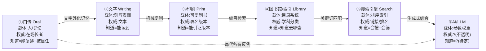

每一种知识中介技术，都不只是"换了个更快的搬运工"，而是**重新定义了"何为知道（what it is to know）"**——这是本节点要回答的问题。从口传、文字、印刷、图书馆、搜索引擎到 AI，六代中介依次改变了知识的载体、权威来源、可信度判定方式，以及"一个人声称知道某事"在认识论上意味着什么。本节用的框架是**媒介理论（Innis / McLuhan）+ Kuhn 范式不可通约性**：拒绝把这条链读成"越来越方便"的线性进步史，而是读成一连串**得失对冲的范式切换**——每一代解决了上一代的认识论瓶颈，同时引入了上一代没有的新失败模式。这张谱系图是 [_AI 认识论中介系统化专题·总览](/kb/专题-人文社科透镜/_ai-认识论中介系统化专题-总览/) 全专题的时间轴底座：它决定了我们能不能把"AI 作为知识中介"放进一个足够长的尺度里看清它的特殊性。

## §0 为什么是"中介代际"框架，而不是"信息技术进步史"

读者脑中的默认框架大概是这样的：人类获取信息越来越快、越来越多、越来越便宜，AI 是这条曲线的最新一点。这个框架有两个致命错误，必须先挡掉。

第一，它把**信息（information）和知识（knowledge）混为一谈**。信息可以被搬运、压缩、检索；知识不能——知识是有辩护的真信念（见 0114认识论 的 JTB 与盖梯尔讨论），它的成立依赖一个**辩护过程**，而这个过程恰恰是每一代中介技术暗中重写的东西。口传时代你"知道"一件事，因为你信任说话的长者；印刷时代你"知道"，因为你读了一本署名、可追溯、可被他人核对的书。两种"知道"在认识论上不是同一件事的两个速度档位，而是**两套不同的辩护结构**。

第二，它假设了**单调进步（monotonic progress）**。但媒介理论的核心洞见恰恰相反：每一种媒介都有它的"偏向（bias）"。Harold Innis 在 *Empire and Communications*（1950）与 *The Bias of Communication*（1951，多伦多大学出版社）中区分了**时间偏向媒介**（石刻、羊皮卷——耐久、难传播、利于宗教与传统权威）与**空间偏向媒介**（纸张、印刷——轻便、易传播、利于行政与帝国扩张）〔Innis 1950/1951，确证〕。媒介不是中性管道，它**结构性地偏袒某一类知识、某一类权威**。所以本节点用"代际谱系"而非"进步史"——每一格的标题不是"更好的搬运工"，而是"它重新定义了何为知道，并且这个重新定义有代价"。

这也是为什么本专题把它放在 `02 代际演化` 而非 `01 概念辨析`：辨析回答"AI 中介是什么"，谱系回答"它从哪条历史脉络里长出来、在那条脉络上处于什么位置、那个位置有什么是前人没踩过的坑"。

## §1 六代谱系总图

| 代际 | 主导媒介 | 知识的载体 | 权威来源 | "何为知道"的判定 | 该代引入的**新失败模式** |
|---|---|---|---|---|---|
| ① 口传 | 声音、记忆、仪式 | 活人 + 共同体记忆 | 在场的长者/吟诵者 | 能准确复述 + 被共同体信任 | 记忆漂移、无法核对、随人死去而失传 |
| ② 文字 | 刻写表面（泥板、莎草、竹简） | 外化的符号 | 文本本身（脱离作者） | 能读到、能解读 | 识字壁垒、文本可被篡改且作者不在场（柏拉图之忧） |
| ③ 印刷 | 活字、机械复制 | 可大量复制的版本 | 署名作者 + 可追溯版本 | 能引证到具体版本/页码 | 信息过载、印刷错误规模化传播、"印出来的就是真的"幻觉 |
| ④ 图书馆/索引 | 编目、分类法、引文网 | 目录与元数据系统 | 学科分类 + 同行评议体制 | 知道**去哪里查**（元知识） | 分类即权力（谁决定类目）、检索盲区、目录滞后于知识 |
| ⑤ 搜索引擎 | 倒排索引 + 排序算法 | 全网爬取 + 排名 | 链接结构/排名算法（PageRank） | 会搜、会筛、会交叉验证 | 过滤气泡、SEO 操纵、排名=可信度的误读 |
| ⑥ AI / LLM | 参数权重（压缩语料） | 模型内部分布式表征 | **不透明/争议中** | **待定**——本专题的核心问题 | 幻觉、谄媚、知识与"知识的模拟"难分、认识不透明性 |

这张表是全专题的索引锚点。下面逐代拆它的"得"与"失"——重点不在叙述历史，而在**每一代如何重写辩护结构、并埋下新失败模式**。

## §2 ①→②：文字外化记忆，柏拉图已经预演了"中介焦虑"

文字最大的认识论后果不是"记得更多"，而是**知识第一次脱离了它的承载者**。口传知识与说话者绑定：你信任知识，因为你信任那个人（这正是证言认识论的原型，见 0117社会学 与社会认识论中 Coady 的反还原主义证言论）。文字把知识从人身上剥离出来，存进死的符号——这带来了可核对、可累积、可跨时空传递的巨大收益。

但代价被一个人精确预言了：**柏拉图**。在《斐德若篇》（*Phaedrus*，约公元前 370 年）里，柏拉图借苏格拉底之口讲了 Theuth 与 Thamus 的神话，反对文字〔确证：《斐德若篇》274c–275b〕。他的两条指控，惊人地预演了今天对 AI 的全部焦虑：

> [!note] 柏拉图对文字的两条指控（≈2400 年前的"中介焦虑"原型）
> 1. **文字制造"健忘"**——人不再用内在记忆，转而依赖外部符号。这是"认知外包削弱内在能力"论证的祖先（直接呼应今天 Huemmer et al. 2026 的"验证瓶颈"与自动化自满：把认知工作外包给 AI，内在判断力退化）。
> 2. **文字"不会回答你"**——你问它问题，它只重复同样的话；它落入不该落的人手里也无法自辩。**作者不在场，无法被追问、无法承担责任。**

第二条指控直击要害，也是理解 AI 中介的钥匙：知识中介一旦脱离可追问、可担责的人，**证言的责任结构就断了**。Ori Freiman（2023，*Episteme*）正是据此论证：从 AI 获得的信念既非"仪器性信念"也非"证言性信念"，而是新类别"技术性信念"——因为传统证言理论以**意向性与道德责任**为前提（说话者须能被问责），而 AI 与文字一样"不在场、不担责"〔确证：Freiman 2023, Episteme〕。换句话说，AI 把文字时代埋下的那个坑挖到了极致。

**反例（破线性进步）**：文字并非纯粹的胜利。在高度口传的文化里，记忆是一种被精修的认知技艺（古希腊的记忆术、印度吠陀的口传精度），文字普及后这种技艺大面积萎缩。柏拉图的第一条指控不是杞人忧天——它只是把得失算清了。

## §3 ②→③：印刷把"知道"重定义为"能引证版本"，但也规模化了错误

古登堡活字印刷（约 1450 年）的认识论后果，被 Elizabeth Eisenstein 在 *The Printing Press as an Agent of Change*（1979，剑桥大学出版社）系统论证为"印刷革命"〔确证：Eisenstein 1979〕。核心不是"书更便宜了"，而是**标准化与固定性（fixity）**：同一本书的每一份拷贝字字相同、有版次、有页码。这第一次让"知道"可以被重定义为**"能引证到一个可被他人独立核对的固定版本"**——现代学术引注体系、科学的可复现性话语、版权与作者权概念，全都建立在这个新辩护结构上。

但 Eisenstein 的论证里有反方。Adrian Johns 在 *The Nature of the Book*（1998，芝加哥大学出版社）尖锐反驳：早期印刷品充斥盗印、错排、伪托，"固定性"不是印刷的内在属性，而是**几个世纪里靠制度、行会、信任网络辛苦建造出来的社会成就**〔确证：Johns 1998〕。

> [!note] 接受 + 边界：Eisenstein vs Johns 之争，正是 AI 时代的镜子
> 接受 Johns 的对：可信度从来不是技术自带的，而是社会制度建构的。这条直接打到今天——LLM 输出的"权威感"也不是模型自带的属性，而需要 citation 系统、审计日志、confidence display 等**制度性脚手架**去建造（见专题 [_审阅瓶颈系统化专题·总览](/kb/专题-评测与度量/_审阅瓶颈系统化专题-总览/) 的产品机制层）。
> 坚持 Eisenstein 的边界：技术确实改变了**可建造什么**的边界——没有机械复制的固定性，引证体系根本无从谈起。媒介既不是决定论的（Johns 对），也不是中性的（Eisenstein 对）。这个"既非决定论、既非中性"的中间立场，正是后现象学（Don Ihde）的核心——技术**构成性地中介**认知，但中介的具体形态由社会协商决定。

**新失败模式**：印刷规模化了"印出来的就是真的"幻觉，以及信息过载（17 世纪学者已抱怨书太多读不完）。每一代中介解决旧瓶颈，都顺手制造一个新的认知负担——这是贯穿全表的规律。

## §4 ③→④：图书馆把"知道"变成元知识——但"分类即权力"

当书多到一个人读不完，瓶颈就从"获取文本"转移到"找到该读哪本"。图书馆、目录、分类法（杜威十进制 1876、国会图书馆分类法）、以及后来 Eugene Garfield 创立的引文索引（*Science Citation Index*，1964）〔确证：Garfield 1964〕，把知识的载体从"书"上移到"组织书的元数据系统"。

这次切换最深刻：**"知道"被重新定义为一种元知识——你不必记住内容，你只需知道"去哪里查、怎么判断哪个来源可信"。** 这是延展心智论（延展心智 / Extended Mind，Clark & Chalmers 1998，*Analysis* 58(1):7–19；主库暂无节点，降级为文本）的历史前身：图书馆成了认知系统的外部组件，人脑负责索引与判断，外部系统负责存储〔确证：Clark & Chalmers 1998〕。

> [!note] 跨域呼应：分类即权力（呼应 0117社会学 的知识—权力轴）
> 分类法从来不是中立的。"谁决定有哪些类目、什么放进哪个抽屉"，本身就是一种认识论权力——这正是 Miranda Fricker 所说**诠释性不正义（hermeneutical injustice）**的体制化形态：当集体诠释资源（分类体系）里没有某种经验的位置，那种经验就难以被检索、被命名、被承认（Fricker 2007，*Epistemic Injustice*，牛津大学出版社）〔确证〕。图书馆把这种"组织权力"显性化在目录卡上；搜索引擎把它藏进排序算法；AI 则把它压进了**训练数据的取舍与参数权重**——更深、更不可见。每一代中介都在做"决定什么算知识"的工作，只是越来越隐蔽。

**反例**：编目永远滞后于知识生产，跨学科知识在单一分类树里被切碎、被埋没。"知道去哪查"这个能力本身，也把不会用目录的人挡在门外——壁垒从"识字"升级为"信息素养"。

## §5 ④→⑤：搜索引擎把权威交给链接结构——过滤气泡作为新失败模式

搜索引擎（AltaVista 1995、Google PageRank 1998，Brin & Page）把"找到该读哪本"自动化了。它的认识论赌注藏在 PageRank 里：**用链接结构代理可信度**——被越多（且越权威的）页面链接的页面越可信〔确证：Brin & Page 1998, "The Anatomy of a Large-Scale Hypertextual Web Search Engine"〕。这是把图书馆时代"同行评议+引文"的权威机制，悄悄替换成了"超链接民主+算法排名"。

收益巨大："知道"被重定义为**会搜、会筛、会交叉验证**的操作技能，元知识进一步降低门槛。但失败模式也随之而来，且 Goldman 的验真性社会认识论（veritistic social epistemology，Goldman 1999，*Knowledge in a Social World*，牛津大学出版社）给了诊断工具：评价一个信息系统，要看它是否**提高了用户真信念的比例**〔确证：Goldman 1999〕。按这个标准，搜索引擎是双刃的——

- **SEO 操纵**：排名可被博弈，"被链接最多"不等于"最真"，权威信号被污染。
- **过滤气泡（filter bubble）**：Eli Pariser（2011，*The Filter Bubble*）提出个性化算法把人困在自我确认的信息茧房〔确证：Pariser 2011〕。**但这里要砍一刀 confirmation bias**——过滤气泡假说被后续实证大幅修正：Fletcher & Nielsen（2017 起的一系列跨国新闻受众研究）反而发现，依赖搜索引擎、社交媒体这类"次级守门人"的用户，其新闻来源多样性**往往高于、而非低于**直接访问新闻站的用户——算法茧房的强度被早期叙事夸大了〔Fletcher & Nielsen 2017，确证：方向为"次级守门人关联更高多样性"；Reuters Institute 2022 文献综述支持〕。教训：媒介批评本身也会过度叙事化，本专题写 AI 时要引以为戒，不要把"AI 制造认知茧房"当成无需实证的默认结论。

## §6 ⑤→⑥：AI 把"知道"问题彻底悬置——这是不可通约的范式切换

前五代有一条隐线：**知识的载体一直是"可被人类直接审查的外部符号"**——书可以翻、目录可以查、搜索结果可以点开看原文。AI/LLM 第一次打破这条线：知识被压进了**参数权重的分布式表征**，它**生成**答案而非**检索**答案，而生成过程对人类是**认识不透明的**（epistemic opacity，Paul Humphreys 2004，*Extending Ourselves*，牛津大学出版社——若 X 在本质上不可能了解某过程的全部认识相关要素，则该过程对 X 本质性不透明）〔确证：Humphreys 2004〕。

这就是为什么 AI 不是"更快的搜索引擎"，而是一次**Kuhn 意义上的范式切换**。

> [!note] 跨域呼应：Kuhn 不可通约性（incommensurability）——本节点的方法论核心
> Thomas Kuhn 在 *The Structure of Scientific Revolutions*（1962，芝加哥大学出版社）论证：范式革命前后，问题、标准、甚至词汇的含义都变了，两个范式**不可通约（incommensurable）**，不能用同一把尺子比"谁更进步"〔确证：Kuhn 1962〕。这正是本谱系图反线性的理论根据。把 AI 放进"信息技术进步曲线"是一个**范式错置**：搜索引擎的成功标准是"召回率/相关性"（你能不能找到那篇真实存在的原文），LLM 没有"原文"可指——它的输出是综合的、概率采样的、可能根本不对应任何单一来源。用搜索引擎的标准评 AI（"它检索得准不准"），或用 AI 的体验贬搜索引擎（"还要我自己点链接好麻烦"），都是拿旧范式的尺子量新范式。**每一代中介切换都是一次小型不可通约革命**——这就是为什么"何为知道"会被反复重写。

AI 这一代独有的认识论难题，是前五代都没出现过的：

1. **知识 vs 知识的模拟**：搜索引擎指给你一篇真实存在、有作者、可追责的文本；LLM 给你一段**听起来像知识**的生成文本。这把 Searle 的中文屋（Searle 1980，"Minds, Brains, Programs"，*Behavioral and Brain Sciences* 3(3)）从思想实验变成了日常产品问题——句法流畅不等于语义理解，但用户分不清〔确证：Searle 1980〕。这也直接接到本专题的 [c13 - 幻觉的不可消除性](/kb/基础知识库/c13-幻觉的不可消除性/)（见 §7 升级对照）。
2. **权威来源的彻底坍缩**：口传靠人、文字靠文本、印刷靠版本、图书馆靠分类、搜索靠链接——AI 靠**什么**？训练数据的统计模式？这恰是 confidence display / citation 系统要解决的工程问题：在一个本质不透明的中介上，**人造地重建可追溯性与可信度信号**。
3. **审阅 = verification 还是 rubber-stamping**：前五代中介，人始终能"打开原文核对"；AI 把核对成本抬高到——你要验证一段生成文本，往往得自己重做一遍。这正是 human-in-the-loop 在 AI 时代失效的认识论根源，详见专题对 Huemmer et al. 2026 验证瓶颈的处理。

## §7 与已有节点的关系（升级对照，不复述）

本节点是 `02 代际演化` 的总图，对全专题既有节点做**时间轴定位**式的升级，不复述它们的事实基础：

| 旧节点 | 它讲的层 | 本节点 G01 的升级动作 |
|---|---|---|
| [c13 - 幻觉的不可消除性](/kb/基础知识库/c13-幻觉的不可消除性/) | 架构层：为什么幻觉不可降至 0（Softmax 强制输出 + 概率采样 + RLHF 对齐税 + 校准失败） | **历史定位**：把"幻觉"从一个 LLM 架构 bug，升级为"⑥代中介独有的新失败模式"。前五代中介的失败模式是"信息丢失/被篡改/被埋没"，都发生在**可审查的外部符号**层；⑥代第一次出现"知识与知识的模拟难分"的失败，因为载体从可审查符号变成了不透明权重。c13 讲机制，G01 讲它在谱系上是哪一类、为何前无古人。 |
| [Polanyi 默会知识与提示工程的认识论张力](/kb/基础知识库/polanyi-默会知识与提示工程的认识论张力/) | 认识论层：we can know more than we can tell；明言化的边界 | **谱系反向印证**：从口传到文字的第一次切换，本质是"把默会的、与人绑定的知识强行明言化、外化"。每一代中介都在推进明言化，而 Polanyi 的洞见是这条曲线有**原理性天花板**——集体性默会知识（Collins 三分类中最难外化的一类）无法被任何中介完全捕获。G01 用谱系证明：AI 不过是明言化运动的最新一站，它撞上的仍是同一堵 Polanyi 之墙。 |
| 0114认识论 | 哲学母节点：JTB、盖梯尔、可靠主义、社会认识论 | **应用化**：把"何为知道"的抽象哲学问题，落到六个可观察的历史中介上。每一代重写的恰是 JTB 里的"辩护（justification）"那一环。这是 0114 的下游应用，不是平行复述。 |
| 0117社会学 | 知识—权力、社会建构 | **接入点**：§4"分类即权力"、§5 排名权力、§6 训练数据取舍权力，是知识社会学在中介技术上的具体落点。 |

与本专题其他代际节点的依赖：G01 是总图，向下展开为各代的专题剖面（若建）；横切链入 `01 概念辨析` 的"AI 中介是什么"与 `03 架构剖面` 的 confidence/citation 设计——**谱系决定了为什么这些工程机制是必需的**：因为⑥代中介丢掉了前五代自带的可追溯性，必须人工补建。

## §8 PM 决策启示

- **面试怎么用**：当被问"AI 搜索 / RAG 和传统搜索引擎的本质区别"，不要答"更智能"。答："这是一次中介范式的不可通约切换——搜索引擎的权威来源是链接结构、产物是可追溯的真实原文；LLM 的权威来源坍缩了、产物是概率综合的生成文本。所以产品设计的核心不是'答得更准'，而是**人工重建前五代中介自带、而 LLM 丢失的可追溯性**——这就是 citation 系统和 confidence display 存在的认识论理由。" 一句话把面试官从"功能对比"拉到"认识论层"。
- **选型怎么用**：评估一个 AI 知识产品，用 Goldman 验真性标准问——"它是否提高了用户真信念的比例"，而不是"它生成得多流畅"。流畅度是⑥代特有的**伪权威信号**（印刷时代的"印出来就是真的"幻觉的升级版）。要求供应商展示的不是 demo 的漂亮，而是 grounding/citation/不确定性外显这三道"可追溯性脚手架"。
- **复现怎么用**：设计 human-in-the-loop 触发条件时，用本谱系判断"审阅成本"。前五代中介的核对成本低（打开原文比对）；⑥代核对成本可能高于重做。所以 human-in-the-loop 不能默认"人总能审"，而要按任务的**验证成本**分级触发——验证成本 > 生成成本的任务，所谓"人在回路"极易退化为 rubber-stamping。

## §9 关联节点

**核心（必读）**
- [_AI 认识论中介系统化专题·总览](/kb/专题-人文社科透镜/_ai-认识论中介系统化专题-总览/) —— 本节点是其 `02 代际演化` 时间轴底座
- [c13 - 幻觉的不可消除性](/kb/基础知识库/c13-幻觉的不可消除性/) —— ⑥代独有失败模式的机制详解（§7 升级对照）
- [Polanyi 默会知识与提示工程的认识论张力](/kb/基础知识库/polanyi-默会知识与提示工程的认识论张力/) —— 明言化运动的原理性天花板（§7 升级对照）
- 0114认识论 —— "何为知道"的哲学母节点（JTB / 盖梯尔 / 辩护）
- [幻觉](/kb/基础知识库/幻觉/) —— ⑥代核心失败模式概念入口

**延伸（可选）**
- 0117社会学 —— 分类即权力 / 知识—权力轴（§4、§6 落点）
- [RAG](/kb/基础知识库/rag/) —— ⑤→⑥之间的"半检索半生成"过渡形态，可视为对可追溯性的工程补救
- [Agent](/kb/基础知识库/agent/) —— ⑥代中介的能动化延伸（中介从"回答"走向"代理行动"）
- [AI PM 知识图谱·总索引](/kb/ai-pm-知识图谱/ai-pm-知识图谱-总索引/) —— 全库索引

## 待建概念清单（死链降级登记，勿在主库建 stub）

以下名称在本节点中以**普通文本**出现，因主库暂无确认存在的同名节点，未建双链，登记备查：

- **Don Ihde / 后现象学（postphenomenology）** —— §3 引用，主库无人物卡，降级为正文文本。
- **Elizabeth Eisenstein / Adrian Johns**（印刷史）—— §3 引用，降级为文本。
- **Harold Innis / McLuhan / 媒介偏向**（媒介理论）—— §0 引用，降级为文本。
- **Thomas Kuhn / 不可通约性** —— §6 跨域核心；主库若有 范式 概念卡可后续接链，本稿暂以文本处理待核。
- **Paul Humphreys / 认识不透明性（epistemic opacity）** —— §6 引用，降级为文本。
- **Alvin Goldman / 验真性社会认识论** —— §5、§8 引用；0114认识论 内有「社会认识论」概念条目（主库无独立节点），无 Goldman 人物卡，降级为文本。
- **Miranda Fricker / 诠释性不正义** —— §4 引用，降级为文本。
- **John Searle / 中文屋** —— §6 引用，降级为文本。
- **Ori Freiman / 技术性信念（technology-based beliefs）** —— §2 引用，降级为文本。
- **Extended Mind / 延展心智（Clark & Chalmers 1998）** —— §4 以 alias 形式出现，主库无确认节点，按普通文本处理。
- **Eli Pariser / 过滤气泡** —— §5 引用，降级为文本。

## 修订日志

- 2026-06-07 R0 首稿：建立六代谱系总图（口传→文字→印刷→图书馆→搜索→AI），以媒介理论（Innis 偏向论）+ Kuhn 不可通约性为反线性骨架；每代标注"得 / 失 / 新失败模式"；§2 柏拉图《斐德若篇》作为中介焦虑原型、§3 Eisenstein vs Johns 接受+边界、§5 过滤气泡 confirmation-bias 砍除；§7 对 c13 / Polanyi / 0114 三节做升级对照（不复述）。事实接地：哲学家/著作/年份多已确证，过滤气泡修正效应量与部分细节标〔待核实〕。
