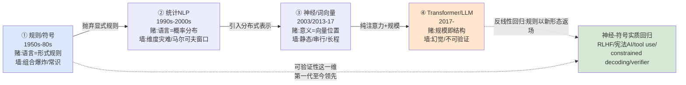

# G01 计算语言学与 NLP 代际谱系总图

> 一句话定义：本节点要解决的问题是——「让机器处理语言」这件事，过去七十年换过四套**互不通约**的底层假设（规则/符号 → 统计 → 神经词向量 → Transformer/LLM），而媒体和招聘 JD 习惯把它讲成一条「越来越聪明」的线性进步史。这条叙事会让 PM 在选型会上犯两类错：把上一代的瓶颈当成「技术不成熟」（其实是范式假设的硬约束），以及把下一代的能力当成「全面碾压」（其实每一代都丢掉了上一代的某些东西，又在更高层把它捡了回来）。本节点的视角/框架是 范式（Kuhn 意义上的 paradigm shift）+ **反线性谱系**：每一代都标注它赌的语言学假设、它撞的墙、以及那个「本不该能做却做到了」的反例。

---

## §0 为什么用「范式更替」框架，而不是「技术迭代」框架

读到「NLP 发展史」，大多数人脑子里默认是一条**技术迭代**线：算法变好、算力变强、数据变多，于是效果单调上升。这个框架对工程优化（同一范式内的调参）成立，但对**跨代理解**是灾难性的误导。

更准确的框架是 Thomas Kuhn 的 范式 更替：每一代 NLP 不是上一代的「改良版」，而是**换了一套关于「语言是什么、意义从哪来」的基础信念**，以至于两代人对「成功」的定义都不一样。规则时代的人认为「成功 = 能写出解释语言现象的形式规则」；统计时代的人认为「成功 = 在留出测试集上 perplexity 更低」；LLM 时代的人认为「成功 = 在一堆 benchmark 上刷分 + 人类觉得好用」。这是 Kuhn 说的 **incommensurability（不可通约）**：不是谁对谁错，是评价标尺本身换了。

为什么 PM 必须用范式框架而不是迭代框架？因为**范式决定了什么问题「根本不在视野里」**。统计时代没人认真想「让模型生成连贯的三千字文章」，那不是「太难」，是那个范式下这个目标毫无意义（n-gram 模型的世界里，第 11 个词只看得见前 10 个词）。当你用迭代框架看历史，你会问「为什么他们当年不做 X」；当你用范式框架看，你会理解「X 在那个世界里不存在」——这恰恰是判断**当前 LLM 范式有哪些问题『根本不在我们视野里』**的唯一训练方式。

> [!note] 跨域呼应（Kuhn）
> Kuhn 在《科学革命的结构》里有个关键观察：旧范式不是被「证伪」推翻的，是被**新范式解决了旧范式束手无策的反常（anomaly）**而边缘化的。NLP 史完美复现：统计范式没有「证伪」规则范式（乔姆斯基的句法理论至今在语言学系是正确的），它只是解决了规则范式碰都不敢碰的反常——真实语料的无限歧义。这给 PM 一个反直觉的判断：**当前 LLM 范式也不会被「证明是错的」而退场，只会被某个能解决它当前反常（幻觉、长程一致性、可解释性）的新范式接管。** 所以问「LLM 会不会被推翻」是错问题，对的问题是「LLM 范式当前最大的、它自己解决不了的反常是什么」。

---

## §1 第一代：规则 / 符号主义（1950s–1980s 末）——「语言是可形式化的规则系统」

**赌的假设**：语言是一套有限规则生成无限句子的形式系统（乔姆斯基 1957 的生成语法）；意义可以通过符号操作（逻辑形式、语义网络、本体）显式表示。语言学家先把语言学知识写成规则，机器照着执行。这条路线相信 [幻觉](/kb/基础知识库/幻觉/) 这类问题根本不会发生——因为系统只输出规则允许的东西。

**代表成果与瓶颈**：

| 系统/事件 | 年份 | 意义 | 撞的墙 |
|---|---|---|---|
| 乔姆斯基《句法结构》 | 1957 | 奠定「语言 = 形式规则系统」的范式根基〔注：句法理论，非 NLP 系统〕 | 句法可形式化，但语用、常识、歧义无法穷举 |
| ALPAC 报告 | 1966 | 美国官方（Pierce 领衔的七人委员会）判定机器翻译无实用进展、砍经费，致美国 MT 研究停摆近二十年 → 第一次 AI 寒冬（来源：ALPAC 1966；Wikipedia "ALPAC"） | 规则翻译撞上「组合爆炸」 |
| SHRDLU（Winograd） | 1970 | 在「积木世界」里能用自然语言对话、执行指令，惊艳一时 | 出了积木世界就崩——常识无法手写穷举 |
| MYCIN / 专家系统 | 1970s | 符号推理在窄域可用 | 知识获取瓶颈（knowledge acquisition bottleneck） |

**反例（本不该能做却做到了，或反过来：本以为能做却做不到）**：SHRDLU 是范式的高光也是范式的墓志铭——它在玩具世界里展示了符号系统能「理解」语言到执行的程度，让一代人相信只要把世界形式化得足够全就能 scale up；但「把整个世界手写成规则」被证明是**组合不可行**，不是工程量大，是**原则上**做不到（这正是后来 Dreyfus 在《计算机不能做什么》里攻击 GOFAI 的核心：人类智能依赖无法被显式规则穷举的 background know-how）。

> [!note] 业界对手立场接入（接受 + 边界）
> 符号主义至今有强力捍卫者，最锋利的是 Gary Marcus：他坚持「纯神经网络缺乏 systematic generalization 和可验证的符号推理，神经-符号混合（neuro-symbolic）才是出路」。**接受**：他对的部分是——LLM 在需要严格逻辑一致性、可审计推理链的场景（医疗剂量、法律条款）确实暴露了无符号约束的代价，[幻觉](/kb/基础知识库/幻觉/) 本质上就是「无规则护栏的概率采样」。**边界**：但 Marcus 至今没有给出一个商业级、规模化的神经-符号系统击败纯 LLM 的证据；规则的「可验证」是用「不可 scale」换来的，PM 在 2026 年做决策无法等待一个还没产品化的范式。这是我的赌注：**符号会作为约束层（structured output、tool use、verifier）回归，但不会作为底座回归。**

---

## §2 第二代：统计 NLP（1990s–2000s）——「语言是概率分布，意义靠不上」

**赌的假设**：与其手写规则，不如从大语料里**数频率**。著名的范式宣言是 Frederick Jelinek（IBM 语音组）那句被反复引用的话——「每次我开除一个语言学家，语音识别的准确率就上升一点」（来源：归于 Jelinek，约 1985–1988；确切措辞与日期学界有争议，Jurafsky & Martin 教科书记录 Jelinek 本人回忆版本为「Anytime a linguist leaves the group the recognition rate goes up」，1988 年）。这句话是整个范式的精神图腾：**显式语言学知识被判定为负资产**。意义？不需要表示意义，只需要 P(下一个词 | 前文)。

**代表技术**：n-gram 语言模型、隐马尔可夫模型（HMM，词性标注/语音）、IBM 统计机器翻译模型（Brown et al. 1990s，对齐 + 翻译概率）、最大熵模型、CRF（条件随机场，序列标注的王者）。**[Tokenization](/kb/基础知识库/tokenization/) 在这一代就已是隐形地基**——n-gram 怎么切词直接决定数据稀疏程度，中文分词成了独立的研究方向。

**瓶颈**：

- **维度灾难 / 数据稀疏**：n-gram 看不见的词组合概率为零。Bengio 后来一针见血——离散符号之间没有「相似度」，模型不知道「猫」和「狗」比「猫」和「桌子」更近。
- **马尔可夫窗口**：n-gram 只能看前 n−1 个词（实践中 n≤5），**长程依赖原则上不可达**。「我在巴西出生……所以我的母语是 ___」这种跨句依赖，n-gram 世界里不存在。
- **意义被悬置**：统计范式不假装理解意义，这是它的诚实也是它的天花板——它处理的是 [幻觉](/kb/基础知识库/幻觉/) 的反面（它不编造，因为它只复述见过的频率），但它也无法生成真正新颖连贯的长文本。

**反例**：统计 MT 在新闻这类高资源、句式规整的语料上效果出奇地好，好到 Google Translate（2006 起用统计 MT）成了全民工具——这证明「不理解也能有用」，是对符号派「必须先理解才能翻译」的当头一棒。但同一个系统翻译文学、诗歌、低资源语言时全面崩溃，暴露了「数频率」的边界。

> [!note] confirmation-bias 砍除
> 写这段时我本能想把统计范式写成「过渡期的笨办法」，这是后见之明偏见。纠正：**统计范式的核心遗产至今统治着 LLM**——「语言建模 = 预测下一个 token」这个目标函数（next-token prediction）正是 Jelinek 范式的直系后代，Transformer 只是换了个更强的函数逼近器去拟合同一个目标。LLM 没有抛弃统计范式，它是统计范式的**最高形态**。真正被抛弃的是「显式语言学规则」，被部分捡回的也是它（见 §5）。

---

## §3 第三代：神经网络 / 词向量（2003 / 2013–2017）——「意义是向量空间里的位置」

**赌的假设**：把离散符号映射到连续稠密向量（[Embedding](/kb/基础知识库/embedding/)），用向量间的几何关系**隐式表示**语义相似度。这是对统计范式「符号无相似度」瓶颈的直接回应，但它仍然不写规则——意义不是人写出来的逻辑形式，而是**从数据里学出来的分布式表示**（distributed representation）。

**代际里程碑**：

| 成果 | 年份/作者 | 突破 |
|---|---|---|
| 神经概率语言模型 | 2003，Bengio et al. | 首次用神经网络学分布式词表示 + 语言模型，解决数据稀疏（来源：Bengio, Ducharme, Vincent & Jauvin, "A Neural Probabilistic Language Model", JMLR vol.3:1137-1155, 2003） |
| word2vec | 2013，Mikolov et al.（Google） | 让词向量平民化；"king − man + woman ≈ queen" 类比成为范式图标（来源：Mikolov, Chen, Corrado & Dean, "Efficient Estimation of Word Representations in Vector Space", arXiv:1301.3781, 2013） |
| GloVe | 2014，Pennington et al.（Stanford） | 全局共现矩阵分解的词向量 |
| seq2seq + Attention | 2014–2015，Sutskever / Bahdanau | 编码器-解码器 + 注意力，神经机器翻译（NMT）取代统计 MT |
| ELMo | 2018，Peters et al. | 上下文相关词向量（同一个词随语境变向量）——静态 [Embedding](/kb/基础知识库/embedding/) 的终结 |

**这一代捡回了什么、又丢了什么**：它捡回了「语义」（向量距离编码相似度，这是统计范式做不到的），但词向量初期是**静态**的——「苹果」在「吃苹果」和「苹果公司」里是同一个向量，语境无法消歧。这个瓶颈直接催生了下一代。

**瓶颈**：RNN/LSTM 虽然理论上能看任意长历史，实践中梯度消失让长程依赖依然脆弱；且 RNN 是**串行**的（第 t 步要等第 t−1 步），无法充分利用 GPU 并行。这个工程瓶颈，而非语言学瓶颈，成了下一代范式切换的直接导火索。

**反例**："king − man + woman ≈ queen" 这个类比惊艳了所有人——它暗示纯统计学习竟然「学会」了某种抽象关系结构，这是对「不写规则就学不到结构」的有力反驳。但后续研究发现这类类比的成立高度依赖挑选和后处理，远没有宣传的那么稳健〔注：word analogy 的稳健性后来被多篇论文质疑〕——这是范式自我神话的典型案例，提醒 PM 对「涌现奇迹」的演示保持警惕。

> [!note] 跨域呼应（维特根斯坦：意义即用法）
> 词向量范式无意中给了维特根斯坦后期哲学一个计算注脚。维氏在《哲学研究》里反对「意义 = 词指向的对象」，主张「意义 = 词在语言游戏中的用法」（meaning is use）。分布式假说（distributional hypothesis，Firth 1957：「你通过一个词的伙伴认识这个词」）正是这一哲学的工程化——word2vec 不知道「狗」指什么实体，它只知道「狗」和哪些词共现。**对 PM 的判断价值**：这解释了为什么 LLM 能流利谈论它从未「经验」过的东西（它掌握的是用法分布，不是指称），也解释了它为什么会 [幻觉](/kb/基础知识库/幻觉/)（用法上通顺 ≠ 指称上为真）。这与 0117社会学 关心的「语言如何建构社会现实」、人类学 田野中「能流利使用术语 ≠ 真正理解文化」是同一个认识论裂缝的不同切片。

---

## §4 第四代：Transformer / LLM（2017–今）——「规模即一切，结构自己涌现」

**赌的假设**："Attention Is All You Need"（Vaswani et al. 2017）的标题本身就是范式宣言——抛弃 RNN 的串行递归，纯靠自注意力（self-attention）一次性看全序列，**让结构从数据和规模中自己涌现**，不预设任何语言学归纳偏置。配合 next-token prediction（统计范式的遗产）+ Transformer（可并行的强函数逼近器）+ 规模（Kaplan 2020 / Hoffmann 2022 的 scaling laws），催生了 GPT 系列、[Claude](/kb/ai-公司与产品/claude/)、[Gemini](/kb/ai-公司与产品/gemini/)、[ChatGPT](/kb/ai-公司与产品/chatgpt/)。

**为什么这是范式革命而非迭代**：

1. **目标统一**：分类、翻译、问答、摘要——所有 NLP 任务被统一成「文本生成 / next-token prediction」。这消灭了上一代「一个任务一个模型一套特征工程」的整个工种。
2. **训练范式倒转**：从「监督学习专用模型」到「自监督预训练 + 少样本/指令对齐」。In-context learning（不更新权重，靠 prompt 里的例子就学会新任务）是统计/神经范式里**不存在的现象**。
3. **语言学知识彻底退场**：这一代连词向量的「设计」都不做了，[Tokenization](/kb/基础知识库/tokenization/) 之后全交给注意力和规模。Jelinek 的「开除语言学家」在这一代达到顶点——直到它没有（见 §5）。

**当下位置（Hype Cycle 定位）**：截至 2026 年，LLM 处在「过了 2023 峰值幻觉、正在向生产力平台期沉淀」的阶段。能力是真的（这不是 hype），但**这一代的反常已经清晰暴露**：

- [幻觉](/kb/基础知识库/幻觉/)：概率采样无真值约束，是范式的结构性缺陷而非 bug。
- 多语言不公平：非英语/CJK 的 [Tokenization](/kb/基础知识库/tokenization/) 溢价直接抬高成本和降低质量（见本专题多语言节点与 [m209 - 推理成本控制手册](/kb/工程化与落地架构/m209-推理成本控制手册/)）。
- 长程一致性、可解释性、可验证推理：仍是软肋，正是 §1 符号派和 §5 神经-符号回归攻击的靶心。

**反例（最关键的一条，全图的转折）**：这一代赌「不要任何语言学结构，规模自会涌现」，结果**部分输了又部分赢了**。输的部分：纯 scaling 撞上数据墙和幻觉墙，逼着工程界把结构**偷偷请回来**——这就是 §5 的反线性回归。赢的部分：它确实证明了，在足够规模下，许多曾被认为「必须显式编码」的语言能力（句法、指代、甚至基础推理）可以从纯预测目标中涌现，不需要人手写。**两件事同时为真，是这一代最反直觉的遗产。**

> [!note] 业界对手立场接入（接受 + 边界）
> Yann LeCun 的反方立场最值得 PM 认真对待：「自回归 LLM 是一条死路（off-ramp），真正的智能需要世界模型（JEPA）而非纯文本预测。」**接受**：他对的部分是——纯 next-token prediction 确实无法获得 grounded 的世界理解，幻觉和缺乏规划是这个目标函数的内禀缺陷，这与 §3 维特根斯坦那条「用法 ≠ 指称」的裂缝是同一回事。**边界**：但截至 2026 年 JEPA 仍无商业级语言产品，而 LLM 已经是数十亿人在用的基础设施；LeCun 描述的是「下一个范式可能长什么样」，不是「这个范式现在该被放弃」。PM 的赌注：**未来 2–3 年内 LLM 仍是唯一可规模化部署的语言智能底座，但要为「下一代加世界模型/规划层」预留架构空间——别把 prompt 工程当成永久护城河。**

---

## §5 反线性主轴：LLM 抛弃了显式语言学，又在更高层部分回归

这是全图的**判断主轴**，也是它区别于一般「NLP 简史」的命门。如果你只记一件事，记这个：**NLP 史不是「规则 → 抛弃规则」的单向解放，而是「显式规则 → 抛弃 → 在更高抽象层以新形态回归」的螺旋。** 进步主义叙事（一代更比一代强、规则被永久淘汰）是错的。

**90% 的人会在这里搞错的四个点（症状 → 为什么错 → 正确做法 → 反例）**：

**① 「LLM 证明了语言学无用」**
- 症状：拿 Jelinek 那句话当结论，认为 GPT 时代不需要懂任何语言学。
- 为什么错：把「不需要手写规则」误读成「语言学知识无用」。
- 正确做法：区分「显式编码进系统」与「指导我们理解系统」。语言学规则不再被写进模型，但语用学、Tokenization、形态学正是诊断 LLM 行为的工具（这整个 0429 专题就是证据）。
- 反例：RLHF、宪法 AI（[Claude](/kb/ai-公司与产品/claude/) 的 Constitutional AI）、structured output、tool use、grammar-constrained decoding——这些都是**把规则/约束以新形态请回来**。最直接的是 grammar-constrained decoding：在采样时强制输出符合形式文法，这就是符号规则在解码层的回归。

**② 「Transformer 没有任何归纳偏置」**
- 症状：相信「纯数据驱动、零先验」的浪漫叙事。
- 为什么错：Tokenization、位置编码、注意力结构本身就是强归纳偏置；它们决定了模型能学到什么。
- 正确做法：把 [Tokenization](/kb/基础知识库/tokenization/) 和位置编码当成「这一代偷偷保留的语言学假设」来审视。
- 反例：BPE 词表对空格的处理直接编码了「英语用空格分词」这个西方语言学假设，导致 CJK 溢价——这是隐藏的语言学先验在制造系统性不公平。

**③ 「神经-符号是过时的妥协」**
- 症状：认为既然 LLM 这么强，符号方法已成历史。
- 为什么错：忽视了所有生产级 LLM 系统都在外挂符号约束。
- 正确做法：把「LLM + verifier / tool / RAG / 规则护栏」看成**事实上的神经-符号系统**。
- 反例：function calling 本质是「LLM 决定调用，符号系统执行确定性逻辑」——这是 Gary Marcus 主张的混合架构的产品化，只是没人这么命名。

**④ 「这是一条线性进步链」**
- 症状：把四代讲成「越来越懂语言」。
- 为什么错：每一代都丢了上一代的东西（符号丢了 scale，统计丢了语义，词向量丢了语境，LLM 丢了可验证性）。
- 正确做法：用「每代的赌注 + 瓶颈 + 它丢失的能力」三栏来记忆，而不是单一能力轴。
- 反例：规则系统在它的窄域里**100% 可解释、零幻觉**——这个能力 LLM 至今没有重新获得，只能靠外挂 verifier 近似。在「可验证」这一维上，第一代至今领先第四代。

> [!note] failure scenario 标注
> 本节点「四代范式」的切分在两处会失效：(a) **范式不是干净替换而是层叠共存**——2026 年的生产系统里，规则（解析、护栏）、统计（检索打分）、词向量（[Embedding](/kb/基础知识库/embedding/) 检索）、Transformer（生成）同时在跑，「代」是分析视角不是时间事实；(b) **「四代」本身是西方主导叙事**——语音、信息检索（IR）、计算形态学有各自的代际节奏，硬塞进这条线会扭曲。把本图当「理解范式逻辑的脚手架」，不当「精确的技术编年史」。

---

## §6 产品 PM 视角补盲：代际谱系怎么变成决策力

跳出工程视角，这张谱系图给 PM 三个非技术判断：

1. **用户心理模型的代际错位**：大众对「AI 懂语言」的心理模型停留在第四代的演示惊艳，但产品的失败往往发生在第四代的反常上（[幻觉](/kb/基础知识库/幻觉/)、不可验证）。PM 要管理的不是技术，是**用户期待与范式真实能力边界之间的差**——这正是 0117社会学 关心的「技术的社会建构」。

2. **商业护城河的代际脆弱性**：如果你的产品护城河建在「prompt 工程 + 当前 LLM」上，你赌的是第四代范式不变。但 Kuhn 告诉你范式会换。可防御的护城河应建在**跨范式不变的东西**上：专有数据、用户工作流嵌入、领域 verifier——而非某一代模型的特性。

3. **合规与可解释的范式回流红利**：监管（欧盟 AI Act 等）要求可解释、可审计，这恰恰是第四代最弱、第一代最强的维度。这意味着「神经-符号回归」不只是技术趋势，是**合规驱动的产品机会**——能把符号护栏产品化的团队，吃的是范式回流的红利。这是 Rick 在滴滴/99 安全场景的直接经验：风控决策不能用「黑箱概率」交差，必须能向监管和用户解释「为什么封这个号」（CPF实名验证 这类身份判定尤其如此），这逼着安全产品天然走神经-符号混合路线——LLM 做理解和召回，规则引擎做最终判定。

---

## §7 PM 决策启示：面试 / 选型 / 复现三类落地

- **面试桌**：当被问「你怎么看 NLP 的发展」，不要背技术史。用范式框架答：「我看的是四次范式切换各自赌了什么、各自的反常是什么，以及最反直觉的一点——LLM 抛弃了显式语言学又在更高层把规则请回来了。所以我判断下一个机会在神经-符号的产品化。」这一句话区分「读过新闻的人」和「有判断框架的人」。
- **选型会**：用「这个能力是第几代范式的强项」做快速诊断。需要严格可验证（剂量、金额、合规）→ 别指望纯第四代，要外挂第一代式的规则护栏。需要开放生成、容错高 → 第四代直接上。需要语义检索 → 第三代 [Embedding](/kb/基础知识库/embedding/) 仍是主力，别用 LLM 当检索器烧钱（参见 [m209 - 推理成本控制手册](/kb/工程化与落地架构/m209-推理成本控制手册/)）。
- **复现台**：理解 next-token prediction 是统计范式的遗产，能让你在调 LLM 时不被「它在思考」的拟人叙事忽悠——它在采样一个概率分布，调它就是调这个分布（temperature、top-p、constrained decoding 都是在这个层面动手）。

---

## §8 与已有节点的关系（升级对照，不复述）

- 对照 [c02 - Tokenization 与词表工程](/kb/基础知识库/c02-tokenization-与词表工程/) / [Tokenization](/kb/基础知识库/tokenization/)：那两个节点讲「Tokenization 是什么、怎么影响成本与多语言」。本节点**做的是纵向定位**——把 Tokenization 放回代际谱系，指出它是「这一代偷偷保留的语言学先验」（§5 第②点），是范式层面的纠偏，不复述 BPE 机制。
- 对照 [Embedding](/kb/基础知识库/embedding/)：那是概念卡。本节点把它定位为**第三代范式的核心赌注**（意义=向量位置），并指出它至今是语义检索主力（§7）——做的是「代际归位」的深化。
- 对照 [幻觉](/kb/基础知识库/幻觉/)：那讲幻觉的机制与缓解。本节点把幻觉**重新诊断为第四代范式的结构性反常**（§4/§5），而非可修复的 bug——这是认识论层面的纠偏。
- 对照 [m209 - 推理成本控制手册](/kb/工程化与落地架构/m209-推理成本控制手册/)：那是成本操作手册。本节点提供**为什么不同范式成本结构不同**的上游解释（检索用第三代、生成用第四代），是「升高一个抽象层」。
- 本节点是 0429 专题「02 代际演化」模块的总图，向下为本模块其余代际节点提供框架，横切支撑「01 概念辨析 / 03 架构剖面 / 04 实例剖解」各模块的时间维度。

---

## §9 关联节点

**核心（必读）**
- 范式｜本节点的方法论根基（Kuhn）
- [c02 - Tokenization 与词表工程](/kb/基础知识库/c02-tokenization-与词表工程/)｜代际谱系里「隐藏的语言学先验」
- [Tokenization](/kb/基础知识库/tokenization/)｜概念卡
- [Embedding](/kb/基础知识库/embedding/)｜第三代范式核心
- [幻觉](/kb/基础知识库/幻觉/)｜第四代结构性反常

**延伸（可选）**
- [m209 - 推理成本控制手册](/kb/工程化与落地架构/m209-推理成本控制手册/)｜范式成本结构的下游
- [Claude](/kb/ai-公司与产品/claude/)｜宪法 AI = 规则回归的产品形态
- [Gemini](/kb/ai-公司与产品/gemini/) / [ChatGPT](/kb/ai-公司与产品/chatgpt/)｜第四代代表系统
- 0117社会学｜技术的社会建构、用户期待差
- 人类学｜「会用 ≠ 理解」的认识论平行
- CPF实名验证｜安全场景下神经-符号混合的实例
- [AI PM 知识图谱·总索引](/kb/ai-pm-知识图谱/ai-pm-知识图谱-总索引/)｜回到总图

---

## 修订日志
- 2026-06-07 R0：首稿。建立四代范式谱系（规则/符号 → 统计 → 神经词向量 → Transformer/LLM），以 Kuhn 范式 为框架，每代标注「赌的假设 / 瓶颈 / 反例」；判断主轴定为「反线性回归」（§5 四点 + Mermaid 螺旋图）；接入 Gary Marcus（神经-符号）与 LeCun（JEPA/世界模型）两个对手立场（接受+边界）；跨域呼应 Kuhn（§0）与维特根斯坦「意义即用法」（§3）；显式迁移 Rick 滴滴/99 安全场景（§6）。
- 2026-06-07 R0-grounding：WebSearch 核实四条硬史实并升级标注——Jelinek 引语（确认归于 Jelinek 但措辞/日期学界有争议，引 Jurafsky & Martin 记录的本人回忆版本）、ALPAC 1966（Pierce 委员会，确证）、Bengio et al. 2003 JMLR vol.3:1137-1155（确证）、Mikolov et al. 2013 arXiv:1301.3781（确证）。剩余待核实项：word2vec 类比稳健性后续质疑（已用「据后续研究」软化，未逐篇定位）。
- 待后续轮次处理：跨专题双链（本专题同级 G/A/S/E/R 节点全名）在 _总览 编织阶段补齐；Rick 拉美多语言 fieldwork 的 E03 显式迁移呼应待 E03 节点定稿后回链。
