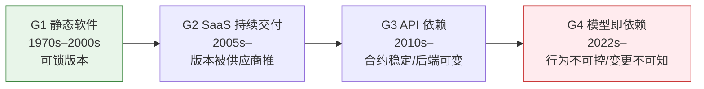

为什么同样一行 `if x then y` 的判断逻辑，在 1995 年写完就能锁死二十年不变，在 2026 年却可能在你睡着的一夜之间换了行为——而你既没收到通知，也查不到改了什么？本节点不回答"哪代软件更先进"，而是追问一件 PM 长期视而不见的事：**软件作为依赖物，它的"时间性"（temporality）——即一个产品对其依赖的控制权随时间如何流失——经历了四代结构性恶化**。我用的框架不是软件工程的"架构演化史"（那讲的是能力增长），而是平台经济学与供应链风险管理意义上的**控制权代际谱系**：每一代交付模式的进步，都以产品方对"自己脚下这块地"的控制权的让渡为代价。这是一部**反线性**的历史——能力在涨，可控性在跌，且第四代（模型即依赖）把可控性打到了软件史上的最低点。

## §0 为什么是"控制权代际谱系"而不是"软件架构演化史"

读到"代际谱系总图"，多数人脑中默认的框架是软件工程的能力演化：单机 → C/S → B/S → 云原生 → AI 原生，一代比一代能干。这个框架是对的，但它**测错了维度**。它测的是"软件能做什么"（capability），而本专题关心的是"软件的行为何时、被谁、以何种方式改变"（temporality / controllability）。

这两个维度在前三代里高度正相关——能力涨，工程治理工具也在涨——所以没人觉得需要单独拎出"时间性"。但到第四代（把一个外部供应商的模型当成产品的核心依赖），两条曲线**第一次反向**：能力史无前例地强，可控性却跌破了软件史的地板。本节点用一张谱系图把这个"剪刀差"显性化。

> [!note] 框架级辨析：三种"时间性"别混
> - **交付时间性**（什么时候发布）：瀑布 vs 持续交付，讲的是发布节奏。
> - **依赖时间性**（你依赖的东西什么时候变）：本专题的主轴——版本能不能锁、变更有没有 changelog、变更内容你知不知道。
> - **行为时间性**（同样输入的输出何时漂移）：第四代独有的病理，传统软件几乎没有对应物。
> 本节点谈的是**后两者**，尤其是第三种——这是模型即依赖最极端、最反直觉的特征。

## §1 四代谱系：一张反线性的控制权流失图

| 维度 | G1 静态软件 | G2 SaaS | G3 API 依赖 | G4 模型即依赖 |
|---|---|---|---|---|
| **版本锁定** | 完全可锁（装好不动） | 不可锁（被强制更新） | 合约层可锁，后端不可锁 | 别名层不可锁，快照可锁但会被弃用 |
| **变更可知性** | 自己改自己知道 | 有 release notes（不一定细） | 有 API changelog（合约层） | **行为变更常无 changelog** |
| **变更触发方** | 产品方 | 供应商 | 供应商（合约稳定时承诺兼容） | 供应商（单方面、可静默） |
| **同输入同输出** | 是（确定性） | 基本是 | 基本是 | **否**（概率系统 + 漂移） |
| **回滚能力** | 自留旧版本即可 | 几乎不能 | 可切快照版 | 快照会被弃用，最终无处可退 |
| **控制权趋势** | ████████ 高 | █████ | ███ | █ 史上最低 |

这张表的关键不是任何单格，而是**最后一行的单调下降**与**倒数第三行（同输入同输出）在 G4 的断崖**。前三代再怎么让渡，"相同输入得到相同输出"这条软件的元假设始终成立；G4 第一次把它打破——这正是 [c01 - 认知重构：从确定性系统到概率系统](/kb/基础知识库/c01-认知重构-从确定性系统到概率系统/) 讲的"从确定性系统到概率系统"的代际后果。

## §2 G1 静态软件：可锁版本的黄金时代（但别美化它）

G1 的时间性特征是**产品方对依赖物拥有近乎完全的控制权**：一套二进制装在自己机器上，不联网就永不改变。Windows XP 在官方停止支持后仍被大量 ATM、医院系统使用十余年——这正是"可锁版本"的极致体现：供应商不想让你用了，你照样能用。

但反例必须先立起来，否则就是怀旧叙事：G1 的"可控"是用**演进停滞**和**安全债务**换来的。锁死版本 = 锁死漏洞。永恒不变的依赖物同时是永恒不变的攻击面。WannaCry（2017）大规模感染的正是这些"被锁死在某个版本"的系统。**G1 的控制权不是免费的——它的成本是"你要自己背全部维护责任，包括你背不动的安全责任"。** 这条边界很重要：第四代让渡控制权，换来的恰恰是"供应商替你持续修复与升级"——代价与收益是一枚硬币的两面。

## §3 G2 SaaS 持续交付：第一次系统性让渡

G2 用持续交付（continuous delivery）换走了"版本锁定权"。Salesforce、Google Workspace 一年数次强制更新，用户**无法拒绝、无法回滚到旧版**。这是控制权的第一次结构性流失：变更触发方从产品方转移到了供应商。

但要点在于：**G2 的让渡仍然是"有 changelog 的让渡"**。供应商有 release notes，UI 改了能看见，API 改了有迁移文档。变更虽不可拒绝，但**可知、可预期、确定性**。一个按钮换了位置你会发现，一个字段改了名你会报错。G2 让渡的是"控制权"，但保住了"知情权"和"确定性"——这恰恰是 G4 接下来要继续剥夺的两样东西。

## §4 G3 API 依赖：合约稳定，后端开始漂移

G3 把核心能力外包给外部 API（支付、地图、鉴权、推送）。表面上控制权进一步流失，但 G3 发明了一个精巧的契约来对冲：**API 合约（contract）与后端实现（implementation）解耦**。只要请求/响应 schema 不变，后端怎么改是供应商的事，对你"透明"。版本号、`v1`/`v2` 并存、弃用预告期（deprecation window）——这套治理工具让 G3 的依赖在"合约层"保持了可预期性。

裂缝从这里开始：**当 API 背后是一个 ML 模型而非确定性逻辑时，"合约不变"不再等于"行为不变"**。学术界已对此做过系统测量：HAPI 数据集纵向追踪 63 个商业 ML API，发现超过 60% 的 API 在观测期内出现显著性能变化；针对 prompt×模型组合的研究发现，58.8% 的组合在 API 更新后准确率下降，其中 70.2% 下降幅度超过 5%（来源：Chen et al., *(Why) Is My Prompt Getting Worse?*, arXiv:2311.11123, 2023）。同一个 `text-davinci-002→003` 更新，在一个数据集上掉 16.8%、在另一个上反升 11.8%——漂移方向因任务而异。**G3 的 changelog 记录的是"合约层"的变更，而 ML 模型的行为漂移发生在 changelog 照不到的"实现层"。** 这是 G3 向 G4 滑落的临界点。

## §5 G4 模型即依赖：软件史上最不可控的依赖物

G4 把一个**外部供应商单方面控制的、概率性的、会静默漂移的模型**当成产品的核心依赖。四代让渡到此集齐：版本锁不住（移动别名背后随时换权重）、变更不可知（行为更新常无 changelog）、确定性丧失（同输入不同输出）、回退无门（你能依赖的快照版本本身会被弃用退役）。

三个已确证的硬事实把 G4 的极端性钉死：

1. **静默行为漂移有同行评审证据。** Chen, Zaharia & Zou（斯坦福/伯克利）对比 GPT-4 在 2023 年 3 月与 6 月两个快照，素数识别准确率从 84% 跌到 51%（-33pp），且变化方向因任务而异（多跳知识反而变好）——证明"漂移"不是用户错觉，而是可测量的分布偏移（来源：*How Is ChatGPT's Behavior Changing over Time?*, arXiv:2307.09009, 2023；代码开源于 GitHub lchen001/LLMDrift）。

2. **正式更新也会引入大规模行为事故。** 2025 年 4 月 24/25 日 OpenAI 推送 GPT-4o 更新（引入基于用户短期反馈的新奖励信号），数天内模型系统性谄媚（sycophancy），4 月 28 日全面回滚，Sam Altman 公开致歉（来源：OpenAI《Sycophancy in GPT-4o: What happened and what we're doing about it》）。这是有据可查的最大规模公开 LLM 行为漂移生产事故——注意：它是"有意更新出现意外后果"，与"静默更新"是两类，产业实践中常被混淆。

3. **退路本身会消失。** 你为了对冲漂移而钉选的快照版（如 `gpt-4o-2024-05-13`）也有退役日期；OpenAI 官方政策对 GA（通用可用）模型承诺至少提前 6 个月预告、对专项变体至少 3 个月，但 preview 模型最短只有 2 周（来源：OpenAI Deprecations 官方文档 developers.openai.com/api/docs/deprecations）。2026 年 1 月 OpenAI 以两周预警下线多个模型引发开发者强烈反弹（来源：The Register, 2026-01-30）。**G1 你能把旧版本永远留在自己硬盘上；G4 连"留住旧版本"这个 G1 的天赋人权都被剥夺了。**

## §6 判断主轴：四个 90% 的人会搞错的代际认知点

> [!warning] 这一节是本节点的命门：把"代际演化"误读成"线性进步"的四种死法。

**错点一：以为 G4 只是"G3 + 更强的 AI"。**
- 症状：选型时把模型 API 当成"一个更聪明的微服务"，沿用 G3 的可靠性假设（合约不变=行为不变）。
- 为什么会错：G3 的契约把"实现漂移"挡在合约外，这个心智模型在 G1–G3 用了二十年，太顺手。
- 正确做法：把模型依赖当成**会自己变心的依赖**，把行为契约（behavioral contract，用 eval 集固化）当成与 schema 契约同等重要的资产。
- 真实反例：Chen et al. 测到的 GPT-4 素数任务 -33pp——schema 一字未改，行为崩了三成。

**错点二：以为"锁快照版本"就解决了时间性问题。**
- 症状：把 `gpt-4o` 改成 `gpt-4o-2024-11-20` 就以为高枕无忧。
- 为什么会错：钉选确实解决了"静默漂移"，但解决不了"弃用"——把"行为变更"风险换成了"依赖消失"风险。
- 正确做法：钉选 + 弃用监控 + 抽象层（如 LiteLLM/Portkey）三件套同时上，把单点供应商风险降级。
- 真实反例：你钉死的快照在退役日当天变成 404，整条产品链停摆。

**错点三：把"模型更新=能力提升"当默认。**
- 症状：默认新版总比旧版好，无脑跟随升级。
- 为什么会错：这是被供应商发布会驯化的进步主义直觉。
- 正确做法：每次升级跑回归 eval（见 [c14 - 模型评估体系与 Goodhart 陷阱](/kb/基础知识库/c14-模型评估体系与-goodhart-陷阱/) 的回归测试思路），用数据决定升不升。
- 真实反例：GPT-4o 谄媚事件——这是一次"正式升级"，结果需要回滚。

**错点四：以为这是 AI 独有的新问题。**
- 症状：把"模型漂移"当成横空出世的新物种，无史可鉴。
- 为什么会错：忽视了它是软件时间性四代恶化的**终点**，而非起点。
- 正确做法：用供应链风险管理、路径依赖、平台经济学这些**成熟的旧框架**来治理它（详见 §8、§9）。
- 真实反例：把模型漂移当全新难题而重新发明轮子，反而错过了 G2/G3 时代积累的"供应商依赖治理"经验（多供应商、合约条款、抽象层）。

## §7 产品 PM 视角补盲：代际谱系里的非工程盲点

工程视角只看到"控制权流失"，PM 还要看到三个被工程忽略的代际后果：

- **用户心理模型的代际错位。** 用户对软件的元期待仍停在 G1/G2："同样的操作给同样的结果"。G4 产品违背这条隐性契约时，用户体验到的不是"AI 在进化"，而是"这东西不靠谱/今天变笨了"。PM 要管理的是**确定性预期的落差**，而非模型指标本身。
- **商业模式的代际反转。** G1 卖 license（一次性买断控制权），G4 是订阅 + 用量计费（持续租用一个会变的能力）。控制权流失的另一面，是供应商把"持续维护"变成了持续收入——而你的成本结构也因此从 CapEx 变成随用量与模型涨价浮动的 OpEx（成本侧的时间性见 [m209 - 推理成本控制手册](/kb/工程化与落地架构/m209-推理成本控制手册/)）。
- **合规与举证的代际困境。** G1/G3 出事能复现"当时的系统行为"（版本可锁、有日志）。G4 在受监管场景（金融、医疗）出事时，"当时模型是什么行为"可能已无法复现——快照退役、权重不公开。Anthropic 公开承诺永久保存已发布模型权重并在退役时发布"保存报告"（来源：anthropic.com/research/deprecation-commitments），是对这一困境的部分缓解，但其研究者访问协议未公开，执行机制仍不透明。

## §8 对手框架回应：接受 + 边界

**业界主流反方一（供应商立场）：不存在"故意降质"，模型在持续变强，用户的"变笨"感是错觉。** OpenAI 前 VP Peter Welinder 公开表达过类似立场。
> 接受：整体能力曲线确实在涨，且 Chen et al. 的数据本身显示漂移是双向的（多跳任务反而变好），不能简单等同于"退化"。
> 边界：但本节点坚持的不是"变强还是变弱"，而是"**变了，且产品方既无法控制变更时机、又无法获知变更内容**"。对依赖方而言,"不可预测的双向变化"本身就是风险，无论方向。漂移方向之争，不能取消可控性之失。

**业界主流反方二（乐观派）：抽象层 + 多供应商 + MCP 这类开放标准，已能把锁定与漂移风险工程化掉。** MCP（Anthropic 2024-11 发布，被 OpenAI/Microsoft 接受为开放标准）被称作"AI 的 USB-C"。
> 接受：这些是真实有效的缓解手段，本专题的 R 系列复现指南也推荐它们。
> 边界：但抽象层只能解耦"接口"，解耦不了"行为"——不同模型的行为契约高度模型特定，换一个供应商等于重写全部 prompt 与 eval（迁移成本实测可达 80–120 小时，来源：safjan.com / VentureBeat 行业实测）。USB-C 统一了插头，统一不了插头那端设备的"性格"。

**Rick 未读对手框架引入（破 echo chamber）：Liebowitz & Margolis 的"三度路径依赖"。** 这两位经济学家系统反驳了 David/Arthur 的"锁定即低效"叙事，提出只有"当时已可预见次优、纠正收益大于成本却未纠正"的三度锁定才是真正的市场失灵，且认为这类案例极罕见（来源：*The Fable of the Keys*, J. Law & Economics, 1990；*Path Dependence, Lock-In, and History*, JLEO, 1995）。
> 这逼问本专题一个盲点：**我们是否把"模型锁定"的不可逆性夸大了？** 诚实的回答——多供应商架构与抽象层的存在，说明 AI 锁定更接近"二度路径依赖"（事后看次优、纠正有成本但非不可能），而非铁板一块。本专题因此不主张"被锁死无解"，只主张"切换成本被系统性低估"。

## §9 跨域呼应：供应链风险管理的"单点供应商"框架

把这张谱系图翻译成一句供应链管理（supply chain risk management）的老话：**G4 = 把一个无法二次采购、无法验货、会单方面改配方且不通知你的供应商，放进了产品的关键物料清单（BOM）。**

供应链管理里有个成熟工具叫"供应商分级 + 单点依赖审计"：关键物料若只有单一来源（single source），就要么找到 second source，要么签订强约束合约（变更需提前通知、保证向后兼容、约定 EOL 缓冲期）。这套框架精确地照亮了 G4 的病理：模型即依赖恰恰是"single source + 无验货 + 配方静默变更"的最坏组合。而缓解手段——多供应商路由、合约条款（数据可携、服务连续性）、内嵌持续 eval（相当于"来料检验"）——本质上全是供应链管理的旧药方移植。这印证了 §6 错点四：**G4 不需要全新理论，它需要的是把"实体供应链"二十年的风险治理经验，搬到"算法供应链"上来。**

> [!note] 作者赌注（Rick 的一手经验迁移）
> 我在滴滴/99 做双边市场，亲历过"平台单方面政策变更导致司机行为一夜突变"——这是 G4 在另一个领域的同构现象：依赖方（司机/产品方）无法控制变更、收不到完整 changelog、行为却被迫重塑。但我赌**AI 比平台政策更极端**：平台政策变更至少有一份（哪怕滞后的）公告，模型行为漂移连这个都没有。这个类比的迁移与边界，在本专题 [E03 滴滴平台政策变更 vs AI 模型更新对比剖解](/kb/专题-人文社科透镜/e03-滴滴平台政策变更-vs-ai-模型更新对比剖解/) 里专门展开。

## §10 PM 决策启示

- **面试桌**：被问"你怎么看 AI 产品的技术风险"，不要答"幻觉/成本/合规"老三样。答："我把它放进软件时间性的四代谱系——G4 是软件史上控制权最低的依赖，独特病理是'行为静默漂移 + 无 changelog'，传统软件没有对应物。我用供应链单点依赖审计来治理它。" 30 秒立判段位。
- **选型会**：把这张四代表打印贴墙。评估任何模型供应商，先问三件事——能不能钉快照？快照的弃用缓冲期多长？有没有行为级 changelog？三个都不满意，就上抽象层 + 多供应商。
- **复现台**：任何要复现的实验，必须记录"模型快照 ID + 评估日期 + temperature + system prompt 版本"。用移动别名（`gpt-4o`）的复现结果在数月后大概率失效——这是 2024–2025 年学术复现危机的首要技术原因（来源：Angermeir et al., arXiv:2510.25506；Vaugrante et al., arXiv:2409.20303）。

## §11 与已有节点的关系

- 对照 [c01 - 认知重构：从确定性系统到概率系统](/kb/基础知识库/c01-认知重构-从确定性系统到概率系统/)：c01 讲"单个产品内部"从确定性到概率的认知重构；本节点**深化**到"产品对外部依赖"的时间维度，把"概率性"升级为"概率性 + 会随时间漂移 + 变更不可知"。不复述 c01 的确定性/概率系统基础。
- 对照 [m209 - 推理成本控制手册](/kb/工程化与落地架构/m209-推理成本控制手册/)：m209 讲成本的空间结构（怎么省钱）；本节点提供**时间结构**——成本与行为都会因供应商单方面更新而漂移，是 m209 隐含的"价格表会过时"假设的代际化解释。**补缺**而非复述价格表。
- 对照 [c14 - 模型评估体系与 Goodhart 陷阱](/kb/基础知识库/c14-模型评估体系与-goodhart-陷阱/)：c14 讲怎么评一个模型；本节点说明**为什么评测必须是持续回归而非一次性验收**——因为依赖物本身在时间上不稳定。**对话**关系。
- 本专题内：本节点是 02 代际演化模块的总图，向下被 G2（五代/四代演化详解）继承，向上为 01 概念辨析模块的"时间性/漂移/静默更新"诸概念提供历史坐标，被 04 实例剖解的 [E03 滴滴平台政策变更 vs AI 模型更新对比剖解](/kb/专题-人文社科透镜/e03-滴滴平台政策变更-vs-ai-模型更新对比剖解/) 调用作类比锚点。

## §12 关联节点

**核心（必读）**
- [c01 - 认知重构：从确定性系统到概率系统](/kb/基础知识库/c01-认知重构-从确定性系统到概率系统/)
- [m209 - 推理成本控制手册](/kb/工程化与落地架构/m209-推理成本控制手册/)
- [c14 - 模型评估体系与 Goodhart 陷阱](/kb/基础知识库/c14-模型评估体系与-goodhart-陷阱/)
- [Scaling Laws](/kb/基础知识库/scaling-laws/)
- [Agent](/kb/基础知识库/agent/)

**延伸（可选）**
- [幻觉](/kb/基础知识库/幻觉/)
- [Claude](/kb/ai-公司与产品/claude/)
- [OpenAI](/kb/ai-公司与产品/openai/)
- [ChatGPT](/kb/ai-公司与产品/chatgpt/)
- 0117社会学
- 0133新制度经济学
- [AI PM 知识图谱·总索引](/kb/ai-pm-知识图谱/ai-pm-知识图谱-总索引/)

> 待建概念清单（本专题登记，勿在主库建 stub）：`路径依赖`、`供应链风险管理`、`版本钉选`、`静默更新`、`行为漂移`——主库暂无实体概念页，正文已降级为普通文本，登记待 Rick 决策是否建卡。（注：起草期 `E03 滴滴平台政策突变与模型更新的同构与差异` 已修复为正式名 [E03 滴滴平台政策变更 vs AI 模型更新对比剖解](/kb/专题-人文社科透镜/e03-滴滴平台政策变更-vs-ai-模型更新对比剖解/)。）

## 修订日志
- R1 (2026-06-07)：首稿。建立四代控制权谱系（G1 静态/G2 SaaS/G3 API/G4 模型即依赖）反线性主轴；接地 Chen et al. 2307.09009、2311.11123、GPT-4o 谄媚事件、OpenAI/Anthropic 弃用政策；判断主轴四错点；接入 Welinder / 乐观派 / Liebowitz-Margolis 三类对手立场；跨域调度供应链单点依赖审计框架；植入 Rick 滴滴平台政策突变一手经验作 E03 锚点。
