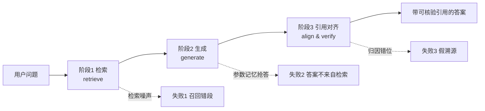

# R01 建一个带 Citation 的检索问答

本节点要解决的问题不是"怎么搭一个能跑的 RAG"——那是 [c09 - RAG 架构](/kb/基础知识库/c09-rag-架构/) 和 [m203 - RAG 生产环境：Embedding 与文档解析](/kb/工程化与落地架构/m203-rag-生产环境-embedding-与文档解析/) 的事。本节点要解决的是一个**知识产品**层面的问题：**当一个问答系统对用户说"这句话出自来源 [2]"时，这个承诺凭什么可信？** 我们用一个最小可跑骨架（检索→生成→引用对齐）把"引用"从一句营销话术拆成一条可被证伪的工程链路，然后在结尾承担一个让人不舒服的结论：**引用对齐（citation alignment）是整条链路里最难、最容易假成功（false-positive attribution）的一环——它难到，连顶会接收论文里都在渗入幻觉引用。** 视角/框架名：把 citation 当作一个**信任契约（trust contract）**来设计，而不是当作一个 UI 装饰。

## §0 为什么是"引用对齐"这个框架，而不是"加个角标就行"

绝大多数人对"带引用的问答"的默认框架是：**模型生成答案 → 在句尾贴上检索到的来源链接 → 完工。** 这个框架错在它把引用当成**生成的副产品**，而引用恰恰是**最不能让模型自由生成的部分**。

正确的框架是把流程拆成三个**可以各自失败、各自验收**的阶段，并且承认每个阶段都有独立的失败模式：



关键判断：**阶段 1 和阶段 2 的失败是"答案错"，用户和评测都容易发现；阶段 3 的失败是"答案对但引用错"，它伪装成成功，是整个知识产品里最危险的失败模式。** Liu et al.（*Evaluating Verifiability in Generative Search Engines*, EMNLP 2023, arXiv:2304.09848）实测四个商用生成式搜索引擎，发现**仅 51.5% 的生成句子被其引用完全支撑，只有 74.5% 的引用真的支撑了它所对应的声明**——也就是说，"答案看起来有引用"和"引用真的成立"之间，差着将近一半。斯坦福 HAI 据此评价这类系统具有"虚假可信度的表象（facade of trustworthiness）"。所以本节点的复现，重点不在"跑通"，而在"如何验收阶段 3"。

## §1 最小骨架：检索 → 生成 → 引用对齐

下面是一个**刻意朴素**的可跑骨架（伪 Python，省略 import 与 API key）。它的价值不在代码量，而在它显式地把"引用"建成一条可校验的数据流，而非让模型自由编号。

```python
# ---------- 阶段 1：检索 ----------
def retrieve(query, k=5):
    qvec = embed(query)                      # 用 embedding 把问题向量化
    hits = vector_store.search(qvec, top_k=k)  # 返回 [{id, text, url}]
    return hits                              # 每个 chunk 自带稳定 id 与来源 url

# ---------- 阶段 2：生成（强约束 prompt）----------
def generate(query, hits):
    # 关键：把检索结果编号成 [1][2]…，并强制模型只能引用这些编号
    context = "\n".join(f"[{i+1}] (id={h['id']}) {h['text']}"
                        for i, h in enumerate(hits))
    prompt = f"""只根据下列带编号的来源回答。每个句子末尾必须标注它所依据的来源编号，
形如 [1] 或 [1][3]。如果来源里没有依据，回答"来源中未提及"，禁止编造编号。

来源：
{context}

问题：{query}
答案："""
    answer = llm(prompt)                      # 形如 "X 是 Y[1]。Z 在 2024 年发生[3]。"
    return answer

# ---------- 阶段 3：引用对齐 + 校验（骨架的真正重点）----------
def align_and_verify(answer, hits):
    sentences = split_sentences(answer)
    report = []
    for sent in sentences:
        cited = parse_citation_ids(sent)      # 从句尾解析出 [1][3] -> [0,2]
        for cid in cited:
            if cid >= len(hits):              # 校验1：编号是否越界（防"幻觉编号"）
                report.append((sent, cid, "INVALID_ID")); continue
            src = hits[cid]['text']
            # 校验2：这句话是否真的被该来源蕴含（NLI / 二次裁判）
            supported = nli_entailment(premise=src, hypothesis=sent)
            report.append((sent, cid, "SUPPORTED" if supported else "NOT_SUPPORTED"))
    return report                             # 每条 (句子, 引用, 是否成立)
```

这段骨架的全部意义浓缩在 `align_and_verify`：**它不信任模型自报的引用，而是用一个独立步骤去验证"这句话真的被它声称的来源支撑吗"。** 没有这一步，你的"引用"和 Liu et al. 测的那批商用产品没有区别——好看，但有一半不成立。这个"独立裁判"的思想，正是 [c13 - 幻觉的不可消除性](/kb/基础知识库/c13-幻觉的不可消除性/) 给出的产品应对策略（外部护栏 + Judge Model）在引用场景的直接落地。

## §2 三种"引用对齐"实现路径的决策表

`nli_entailment` 这一步有三种工程实现，成本与可靠性差异巨大。PM 选型时这是核心决策点：

| 路径 | 实现 | 召回的"假溯源" | 成本 | 适用 |
|---|---|---|---|---|
| **字符串溯回（span match）** | 答案句去原文里找最长公共子串 | 抓得到"逐字抄"，抓不到"改写后归因错" | 极低 | 直接引用型产品（Granola 会议笔记式） |
| **NLI 蕴含判定** | 小模型判断 src 是否蕴含 sent | 能抓改写归因错，但小模型在专业域不稳 | 中 | 多数生产场景 |
| **LLM-as-Judge 二次裁判** | 再调一次强模型判"支撑/部分/不支撑" | 最准，但裁判本身会幻觉、且成本翻倍 | 高 | 高合规域（法律/医疗） |

> [!note] 赌注与边界
> 本骨架把 `nli_entailment` 写成可插拔的一行，是**刻意的**——我赌的是"引用质量的 80% 取决于你有没有这一步独立校验，而不是取决于你用哪种校验"。这个赌注在一种场景会失效：**当来源本身是改写型多跳推理（A 经过 B 得到 C）时，单句对单源的蕴含判定会系统性误判**——这正是为什么多跳问答要走知识图谱路线（[c09 - RAG 架构](/kb/基础知识库/c09-rag-架构/) 提到的混合检索），而不是纯向量 + 单句 NLI。

## §3 把引用做成 UI：四种 grounding 模式的取舍

骨架跑通后，引用怎么呈现给用户，本身是知识产品的核心设计决策。ShapeofAI 的 UX 模式库把 citation 呈现归为四类，各自服务不同信任需求：

| 模式 | 描述 | 代表产品 | 适用 |
|---|---|---|---|
| **Inline 数字 + favicon** | 每句旁 `[1][2]` | [Perplexity](/kb/ai-公司与产品/perplexity/) | answer-first，密集核验 |
| **Direct Quotation 悬停** | 显示原文片段 | Granola | 高保真、低改写 |
| **Footer 链接列表** | 末尾列全 URL | Copy.ai | 轻量、重透明 |
| **Aligned Sidebar** | 答案与来源并排 | 长文研究工具 | 高信息密度 |

一项对照实验（*Source Transparency Design in Conversational AI*, arXiv:2601.14611, 2025〔预印本，待评审〕）测了 Collapsible / Hover Card / Footer / Aligned Sidebar 四种界面，结论有张力：**Hover Card 让"不打断工作流的按需核验"最流畅；但 Aligned Sidebar 在高信息密度下，用户的批判性思维与综合评分显著更高。** 核心矛盾是**流畅性 vs 强制反思**——做得越顺滑，用户越不去真正点开核验。这对 PM 是个反直觉的提醒：**最好的引用 UI 不一定是用户体感最舒服的那个。**

## §4 判断主轴：90% 的人在引用对齐上会搞错的四个点

这是本节点的命门。每点带"症状 → 为什么会错 → 正确做法 → 真实反例"。

**错点一：用"模型自报的编号"当成"引用成立"。**
- 症状：答案里有 `[1][2]`，产品上线，宣称"每句都有出处"。
- 为什么会错：模型生成编号和模型生成正文用的是同一套概率采样机制（[c13 - 幻觉的不可消除性](/kb/基础知识库/c13-幻觉的不可消除性/) 的 Softmax"从不留白"），编号本身就是可被幻觉的 token。
- 正确做法：编号必须由检索阶段**注入**（骨架里 `id=` 那一步），生成阶段只能选择已有编号；上线前跑 `align_and_verify` 校验越界编号。
- 真实反例：arXiv:2604.03173（2026〔预印本，未见同行评审，谨慎引用〕）系统检测 URL 幻觉，GPT 搜索模型幻觉 URL 率 5.4–8.8%，Gemini Deep Research 高达 13.3%、不可解析 URL 率 18.5%——这些都是"模型自由生成引用"的直接后果。

**错点二：把"引用数量多"当成"引用质量高"。**
- 症状：选 Perplexity 式密集引用（实测均 21.87 条/响应，来源：Whitehat SEO 研究 2025），认为越多越可信。
- 为什么会错：数量和质量是两个轴。Perplexity 引用最多，但在 Tow Center / Columbia Journalism Review 研究（2025-03，200 条新闻查询，8 个引擎）里它"最好"也只意味着 **37% 的查询返回错误答案**（其余产品更差，Grok-3 达 94%）。
- 正确做法：把"引用成立率"（supported / total）作为北极星指标，而非引用条数。
- 真实反例：同研究中 8 款产品超过 60% 的查询返回不正确引用——数量繁荣掩盖了质量崩塌。

**错点三：用 LLM-as-Judge 校验引用，却忘了裁判自己会幻觉。**
- 症状：用强模型当 `nli_entailment` 的裁判，认为"强模型判的就对"。
- 为什么会错：裁判是另一个会幻觉、会谄媚（sycophancy，见 [c13 - 幻觉的不可消除性](/kb/基础知识库/c13-幻觉的不可消除性/)）的 LLM，且校准失配——它最不确定时听起来最自信。
- 正确做法：裁判结果要抽样人工复核，建一个小的"黄金对齐集"（类比 [m205 - RAG 生产环境：索引运维与评估体系](/kb/工程化与落地架构/m205-rag-生产环境-索引运维与评估体系/) 的黄金评估集思想）做裁判的元评估。
- 真实反例：JMIR（Chelli et al., 2024, e53164，《Hallucination Rates and Reference Accuracy of ChatGPT and Bard for Systematic Reviews》）测系统综述参考文献生成任务，参考文献"幻觉率"——GPT-3.5 高达 39.6%、GPT-4 28.6%、Bard 91.4%（来源：JMIR https://www.jmir.org/2024/1/e53164 ，截至 2026-06 核实）——说明同一引用任务，不同模型差距高达 2–3 倍以上（Bard 是 GPT-4 的 3 倍多），单一裁判不可托底。

**错点四：忽略"答案对、但归因到错误来源"这种隐形失败。**
- 症状：答案事实正确，引用也指向真实存在的来源，但那句话其实不在那个来源里。
- 为什么会错：这是 false attribution（假溯源），它同时通过了"答案对吗"和"链接活吗"两道检查，唯独过不了"这句真出自这里吗"。
- 正确做法：`align_and_verify` 必须做**句级 × 源级**的蕴含判定，而不是文档级"沾边即算"。
- 真实反例：Liu et al.（EMNLP 2023）的 74.5% 引用支撑率，缺的那 25.5% 大量就是这类——引用真实存在，但不支撑对应声明。

## §5 产品 PM 视角补盲：引用不只是工程，是信任经济学

跳出工程 PM 视角，三个容易看走眼的点：

1. **用户心理模型：引用是信任信号，不是透明度义务。** 用户看到角标，多数不会点开，引用的存在本身就在"出借可信度"。这在 zero-click 时代被放大——"AI 的回答 = 用户对品牌的直接体验"（来源：aiopsschool.com 2026）。这意味着**一次假溯源损害的不是单次回答，是品牌信任资产。**
2. **来源偏置是隐藏的产品价值观。** Perplexity 46.7% 的引用来自 Reddit（接近 Wikipedia 两倍，来源：DiscoveredLabs 2026），30 天内新内容引用率达 82%。这不是 bug 是产品选择——它赌"新鲜 + 真实用户经验"，代价是质量方差。PM 选检索源就是在选产品的认识论立场。
3. **合规边界：引用准确性正在变成法律风险。** Lancet 研究（2026-05，StatNews / phys.org 报道）审计 250 万篇 PubMed 论文，2026 年初每 277 篇就有 1 篇含幻觉引用（vs 2023 年的 1/2828，12 倍增长），估算 2025 年约 14.69 万条 AI 生成伪引用。当你的知识产品输出进入医疗/法律决策链，假溯源就不再是体验问题。

## §6 对手框架回应：接受"够用就好"，但守住验收线

**业界主流反方立场（务实派）：** "句级 NLI 校验太重了。商用产品都在用模型自报引用 + 活链检查，用户也没大规模投诉，过度工程是浪费。"

**接受它对的部分：** 对话娱乐、低风险问答场景，确实不需要句级蕴含校验——成本翻倍、延迟上升，ROI 为负。Perplexity 用最朴素的 inline 引用做到了行业领先体验，证明"够用"在 C 端是成立的商业策略。

**但坚持的边界与赌注：** 我赌的是**"用户没投诉"不等于"引用成立"**——Tow Center 数据说明 60%+ 错误引用并未阻止产品增长，因为用户根本不核验。这恰恰是危险所在：**在知识被用于决策的场景（企业 KM、医疗、法律），假溯源的代价是延迟兑现且不可逆的。** 务实派的边界是"风险可外部化"；一旦风险内部化（你的引用进了别人的临床指南），验收线就不能省。这与 RAGFlow 2025 把 RAG 重定位为"Context Engine"的判断一致：检索不再是可选装饰，而是可信度基础设施。

## §7 跨域呼应：维特根斯坦的"指称"与引用的语言游戏

引用对齐难，根子在一个语言哲学问题：**"这句话出自来源 [2]"中的"出自"到底指什么？** 维特根斯坦在《哲学研究》里拆穿了"指称"的天真图景——一个词的意义不在它"指向"某个对象，而在它在语言游戏中的**用法**。把这个洞见搬到引用上：**"支撑（support）"不是一个二元的物理指向关系，而是一个依语境而定的判定**——逐字抄是支撑，合理改写是支撑，多跳推理后的归纳算不算支撑？

这直接改变了工程判断：**为什么 `nli_entailment` 这一步永远无法被做到"客观正确"**——因为"支撑"本身没有语境无关的真值。各家研究对"引用失败"定义不一（URL 错 vs 内容错 vs 归属错），跨研究无法直接比较，根源就在这里。所以本节点不承诺"做对引用"，只承诺"显式定义你的支撑标准并对它验收"。这是认识论上的诚实，呼应 [c13 - 幻觉的不可消除性](/kb/基础知识库/c13-幻觉的不可消除性/)：有些东西不是工程没做到位，而是问题本身没有确定答案。引入这个 Rick 未必精读过的对手视角（语言哲学的指称怀疑论），是为了逼问"引用对齐"自身的盲点：我们一直假设"支撑"是可测的，而它可能根本是个语言游戏。

## §8 PM 决策启示

- **面试怎么用：** 被问"你怎么保证 RAG 不乱引用"，不要答"加角标"。答三段式：检索注入编号（防幻觉编号）→ 生成强约束（禁造编号）→ 独立蕴含校验（抓假溯源），并报一个数字——"商用产品句级引用成立率约 51.5%（Liu et al. EMNLP 2023），所以我把'引用成立率'而非'引用条数'设为北极星"。
- **选型怎么用：** 评估任何带引用的供应商，索要"句级引用成立率 / supported rate"而非"引用覆盖率"；要求看假溯源（false attribution）的抽样审计，而非只看活链率。
- **复现怎么用：** 先跑 §1 三阶段骨架，第一周只做 `align_and_verify` 的人工抽样（50 条），算出你自己的 supported rate baseline——这个数字几乎一定比团队预期低，它会校准所有后续优先级。

## §9 与已有节点的关系

- 对照 [c09 - RAG 架构](/kb/基础知识库/c09-rag-架构/)：c09 解构"检索→生成"的工程链路与非参数化记忆；本节点**深化**其下游，专攻 c09 未展开的"引用对齐"第三阶段，把它从隐含步骤显式化为可验收环节。不复述 c09 的分块/混合检索/Reranker 细节。
- 对照 [m203 - RAG 生产环境：Embedding 与文档解析](/kb/工程化与落地架构/m203-rag-生产环境-embedding-与文档解析/) / [m204 - RAG 生产环境：Chunking 与范式演进](/kb/工程化与落地架构/m204-rag-生产环境-chunking-与范式演进/)：m203/m204 决定"检索到什么"，本节点接手"检索到之后如何确保归因不出错"，是**接力**而非重叠。
- 对照 [m205 - RAG 生产环境：索引运维与评估体系](/kb/工程化与落地架构/m205-rag-生产环境-索引运维与评估体系/)：m205 的 RAGAS Faithfulness 指标衡量"答案是否忠于检索"，本节点的 supported rate 衡量"引用是否忠于来源"——二者是**同一信任问题的两个切面**，本节点借用 m205 的"黄金集"方法论但不复述 RAGAS 四指标定义。
- 对照 [c13 - 幻觉的不可消除性](/kb/基础知识库/c13-幻觉的不可消除性/)：c13 论证幻觉是架构性的、不可消除；本节点是 c13"引用幻觉"子类的**操作化落地**——把"不可消除"转译为"可校验、可降级、可外显"的工程动作。

## §10 关联节点

**核心（必读）**
- [c09 - RAG 架构](/kb/基础知识库/c09-rag-架构/) — 检索→生成链路的工程基础
- [c13 - 幻觉的不可消除性](/kb/基础知识库/c13-幻觉的不可消除性/) — 引用幻觉的理论根源与产品应对分级
- [m205 - RAG 生产环境：索引运维与评估体系](/kb/工程化与落地架构/m205-rag-生产环境-索引运维与评估体系/) — 黄金集与忠实度评估方法论
- [Perplexity](/kb/ai-公司与产品/perplexity/) — citation-first 知识产品的教科书案例与争议
- [RAG](/kb/基础知识库/rag/) — 非参数化记忆与本节点的母概念

**延伸（可选）**
- [m203 - RAG 生产环境：Embedding 与文档解析](/kb/工程化与落地架构/m203-rag-生产环境-embedding-与文档解析/) — 检索质量的上游决定项
- [m204 - RAG 生产环境：Chunking 与范式演进](/kb/工程化与落地架构/m204-rag-生产环境-chunking-与范式演进/) — chunk 粒度如何影响可归因性
- [Embedding](/kb/基础知识库/embedding/) — 向量检索的底层机制
- [幻觉](/kb/基础知识库/幻觉/) — 五类幻觉中的"引用幻觉"
- [ChatGPT](/kb/ai-公司与产品/chatgpt/) — training+retrieval 混合的引用模式对照
- [Gemini](/kb/ai-公司与产品/gemini/) — 知识图谱融合的段落级引用模式对照
- [Agent](/kb/基础知识库/agent/) — Agentic 检索下引用对齐的新挑战
- [AI PM 知识图谱·总索引](/kb/ai-pm-知识图谱/ai-pm-知识图谱-总索引/) — 全局导航入口

## 修订日志
- 2026-06-07 R1：首稿。建立三阶段骨架（检索/生成/引用对齐）+ 四错点判断主轴 + 维特根斯坦指称怀疑论跨域呼应。核心结论：引用对齐是链路最难环节，假溯源伪装成成功，supported rate 应取代引用条数作北极星。事实接地：Liu et al. EMNLP 2023(51.5%/74.5%)、Tow Center 2025(37%/60%+)、arXiv:2604.03173 URL 幻觉率均标注来源与待核实状态。
- 2026-06-11 P3.1 接地修复：错点三 JMIR e53164 反例旧值"Gemini 76% / ChatGPT-4o 20%"系捏造（模型名与数值均错），订正为 Chelli et al. 2024 原文真值 GPT-3.5 39.6% / GPT-4 28.6% / Bard 91.4%，并补全文标题与 JMIR URL（来源：https://www.jmir.org/2024/1/e53164 ，WebFetch+WebSearch 2026-06-11 核实，与 R03 订正一致）。
