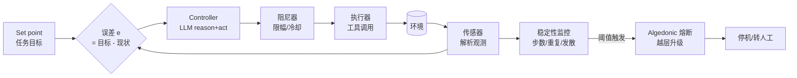

把一个 ReAct agent 从"开环喊话"改造成"闭环受控系统"——给它装上显式反馈回路、可观测的稳定性指标（步数 / 重复度 / 发散度），以及一个会真正踩刹车的阻尼/熔断机制。本节的视角不是"prompt 调得更好"，而是把 agent 当成一个 **Wiener 意义上的控制回路**：observe → 计算误差 → decide → act 是经典的负反馈环，而绝大多数线上 agent 缺的不是更强的模型，而是这条环上的**测量环节和校正环节**。读完你能照着骨架跑起来，并理解为什么这套东西在 demo 里看着多余、在生产里是保命的。

> [!warning] 一句话立场
> Agent 失控不是"模型不够聪明"，是**控制回路不完整**。一个没有显式误差测量、没有阻尼、没有停机条件的 agent loop，在控制论里就是一个**纯前馈 + 潜在正反馈**的结构——它发散是结构性的必然，不是概率性的意外。

---

## §0 为什么是"控制回路"框架，而不是"prompt 工程"框架

读者脑子里关于"agent 跑飞了怎么办"的默认框架，通常是三个错的：

1. **Prompt 框架**:"它循环 / 重复 / 跑偏，是 prompt 没写清楚。" —— 但 prompt 是**前馈控制**（feedforward / open-loop）:你在动作发生**之前**一次性下指令，动作发生**之后**没有任何信号回来修正它。前馈控制的经典局限（控制论教科书第一课）就是:它对**未建模扰动**毫无招架之力。工具返回了脏数据、环境状态变了、模型自己进入了 [LLM repetition loop](/kb/基础知识库/llm-repetition-loop/)——这些都是发生在 prompt 写完**之后**的扰动。

2. **更强模型框架**:"换个更强的模型就不会这样了。" —— 这是把**控制器多样性问题**误读成**控制器智商问题**。Ashby 必要多样性定律（*An Introduction to Cybernetics*, 1956）说的是 V(R) ≥ V(D) / V(E):调节器能吸收的扰动多样性，上界是它自身的状态多样性。换更强的模型在某些任务上确实提高了 V(R)，但只要环境扰动 V(D) 超过控制器能表征的状态空间，**任何模型都会失控**——这是信息论约束，不是参数量问题（详见 [A03 Ashby 必要多样性定律](/kb/专题-人文社科透镜/a03-ashby-必要多样性定律/)，本节不复述其推导）。

3. **多 agent 框架**:"加个 reviewer agent 盯着它。" —— 这只是把单点控制换成多控制器耦合，**新增了振荡风险**而非消除了它（见 [m207 - Agent 产品化：场景推演与失败模式](/kb/工程化与落地架构/m207-agent-产品化-场景推演与失败模式/) 的"雪崩效应"与多 agent 分叉）。

正确的框架是 **Wiener 反馈回路**:把 agent 的每一步当成一次控制周期，显式地测量"当前状态离目标有多远"(误差 e)、显式地对修正量做**阻尼**（避免过冲振荡）、显式地设**停机条件**（避免正反馈发散）。这正是恒温器、巡航定速、PID 控制器跑了一百年的同一套结构。本节的全部工作，就是把这套结构落到 Python 骨架里。

> [!note] 框架级辨析的赌注
> 我赌的是:**"控制回路"是比"prompt / 模型 / 多 agent"更深一层的语法**。前三者是"在回路里换零件"，控制论是"先确认这个回路闭没闭合"。如果你的 agent 连误差信号都没测量，换什么零件都是开环。这个赌注的边界:控制回路框架对**有明确目标函数、状态可部分观测**的任务最有效;对纯发散创意类任务（没有"误差"可言），它会退化成无意义的约束（见末尾失效场景）。

---

## §1 经典控制回路 → Agent 回路的逐项映射

先把控制论的标准负反馈回路和 agent 的 observe-decide-act 对齐。这张表是后面所有代码的"接口契约":

| 控制论组件 | 经典含义 | Agent 中的落地 | 缺失后果 |
|---|---|---|---|
| **Set point（设定点）** | 目标值 | 任务目标 / 成功判据 | 无法定义"误差"，整个回路退化为开环 |
| **Sensor（传感器）** | 测量实际输出 | 解析工具返回 / 环境观测 | observe 名存实亡，模型靠幻觉补状态 |
| **Error（误差 e）** | desired − actual | "离目标还差什么"的显式估计 | 无法判断"是否该停 / 是否在前进" |
| **Controller（控制器）** | 把误差映射成修正动作 | LLM 的 reason→act | —— |
| **Damping（阻尼）** | 抑制过冲与振荡 | 限制单步动作幅度 / 退火温度 / 冷却 | 过冲 → 振荡 → 在两个错误间来回横跳 |
| **Actuator（执行器）** | 施加控制量 | 工具调用 | —— |
| **Stopping condition** | 到达设定点即停 | 终止信号 / 步数上限 / 误差收敛 | **缺停机条件的正反馈 = 无限循环**（MAST 最大类失败模式，Cemri et al., 2025） |

关键洞察:**LLM 本身只是上表中的 Controller 一格**。业界把"agent"等同于"会调工具的 LLM"，恰恰漏掉了 sensor、error、damping、stopping 这四格——而这四格才是控制系统**稳定性**的来源。ReAct（Yao et al., 2022）把 agent 从开环变成了闭环（Reason→Act→Observe→Reason，ALFWorld 上较纯 CoT 约 +34%），但 ReAct 的 observe 只是"把工具输出塞回 context"，**并没有显式计算误差，也没有阻尼和发散监控**。本节做的就是把这四格补全。



注意右下角那条 **algedonic 通道**(借自 Stafford Beer VSM, *The Heart of Enterprise*, 1979):当监控指标越过阈值，信号**绕过正常 reason 层**直接触发停机/升级——就像神经系统的痛觉反射不经过完整的大脑决策。这是本骨架与"在 prompt 里写'如果卡住就停下'"的本质区别:**熔断不能交给被监控的控制器自己判断**（它正卡在 repetition loop 里，最没资格判断自己卡没卡）。

---

## §2 三个稳定性指标:测什么、怎么算、阈值定多少

控制论里"稳定"的标准定义是:系统受扰动后能回到平衡态（Lyapunov 稳定性）。Agent 没有可微的状态空间，但我们可以用三个**可计算的代理指标**逼近"它是否在发散":

### 指标一:步数 / 预算（最钝但最有效）

- **测什么**:已执行步数、已花 token、已花时间、已花钱。
- **为什么**:这是**最后一道熔断**。即使其它指标都没抓到异常，硬上限保证 agent 不会无限烧钱。对应控制论里的"饱和限幅"。
- **阈值**:按任务分位数定。线上跑一周，取 P95 步数 ×1.5 作为硬上限是个务实起点〔示意,需按你的任务实测〕。

### 指标二:重复度（抓 [LLM repetition loop](/kb/基础知识库/llm-repetition-loop/) 与动作循环）

- **测什么**:最近 N 步的"动作指纹"(工具名 + 参数归一化哈希)的去重率;以及输出文本的 n-gram 自重复率。
- **为什么**:动作层面的循环（反复调同一个搜索、反复读同一个文件)是 agent 最常见的"卡住"形态，本质是**控制器在状态空间里进了吸引子**。这与 [LLM repetition loop](/kb/基础知识库/llm-repetition-loop/) 描述的 token 级退化同源——都是自我强化的正反馈，只是发生在不同尺度（一个在 token，一个在 action）。
- **阈值**:最近 6 步动作指纹去重率 < 0.5(即一半以上是重复动作)→ 警告;连续 3 步完全相同 → 熔断。

### 指标三:发散度（抓"越走越远")

- **测什么**:误差 e 的趋势。如果你能定义一个粗糙的"距离目标的进度"(哪怕是 LLM 自评的 0–1 标量),监控它是**单调下降**还是**在涨**。
- **为什么**:这是最接近控制论本义的指标。负反馈系统的标志是误差收敛;若误差**连续上升**,说明回路实际是正反馈（动作在放大偏差),这正是 Forrester 系统动力学里"政策抵抗 / 振荡放大"的微观版本。
- **阈值**:误差连续 K 步不下降 → 警告;误差较历史最优值反弹超过 δ → 熔断或回退到最优 checkpoint。

> [!note] 二阶控制论的提醒
> 这三个指标本身就是 von Foerster 二阶控制论(1974,"the control of control")的实践:**监控器是"对控制器的控制"**。但要警惕——你写下的阈值、你选的"误差"定义,都是**观察者(你)进入了系统**。一个 LLM 自评的"进度分"既是被测量的对象,又被同一个模型的偏差污染。所以指标二、三必须有**指标一(纯外部、不依赖模型自评的硬预算)**兜底:不能把熔断的最终权力交给可能已经失稳的那个模型(详见 0114认识论 中观察者-系统纠缠的讨论)。

---

## §3 可跑的最小骨架（约 120 行核心逻辑）

下面是一个**模型无关**的控制循环骨架。它包装任意 ReAct 风格的 step 函数,在外面套上误差测量、阻尼、三指标监控和 algedonic 熔断。可直接拷贝运行(把 `llm_step` / `compute_error` 换成你的实现)。

```python
import hashlib, time
from collections import deque
from dataclasses import dataclass, field

@dataclass
class ControlConfig:
    max_steps: int = 30              # 指标一:硬上限(饱和限幅)
    max_seconds: float = 120.0       # 指标一:时间预算
    repeat_window: int = 6           # 指标二:动作指纹窗口
    repeat_dedup_warn: float = 0.5   # 指标二:去重率告警线
    repeat_identical_halt: int = 3   # 指标二:连续相同动作熔断
    error_stall_warn: int = 4        # 指标三:误差不降告警步数(K)
    error_rebound_halt: float = 0.15 # 指标三:误差较最优反弹熔断阈(δ)
    damping: float = 0.6             # 阻尼系数(0=不动,1=全速),见 §4

@dataclass
class Telemetry:
    step: int = 0
    errors: list = field(default_factory=list)        # 误差轨迹
    action_fps: deque = field(default_factory=lambda: deque(maxlen=6))
    best_error: float = float("inf")
    stall_count: int = 0
    started: float = field(default_factory=time.time)

def action_fingerprint(tool: str, args: dict) -> str:
    norm = tool + "|" + repr(sorted(args.items()))
    return hashlib.md5(norm.encode()).hexdigest()[:10]

class HaltSignal(Exception):
    """algedonic 信号:绕过控制器,直达停机。"""
    def __init__(self, reason): self.reason = reason

def monitor(t: Telemetry, cfg: ControlConfig, fp: str, err: float):
    # --- 指标一:预算 ---
    if t.step >= cfg.max_steps:
        raise HaltSignal(f"step budget exceeded ({t.step})")
    if time.time() - t.started > cfg.max_seconds:
        raise HaltSignal("time budget exceeded")
    # --- 指标二:重复/循环 ---
    t.action_fps.append(fp)
    if list(t.action_fps).count(fp) >= cfg.repeat_identical_halt:
        raise HaltSignal(f"identical action x{cfg.repeat_identical_halt}: {fp}")
    if len(t.action_fps) == t.action_fps.maxlen:
        dedup = len(set(t.action_fps)) / len(t.action_fps)
        if dedup < cfg.repeat_dedup_warn:
            print(f"[WARN] action loop suspected, dedup={dedup:.2f}")
    # --- 指标三:发散 ---
    t.errors.append(err)
    if err < t.best_error:
        t.best_error, t.stall_count = err, 0
    else:
        t.stall_count += 1
        if t.stall_count >= cfg.error_stall_warn:
            print(f"[WARN] error stalled for {t.stall_count} steps")
    if err - t.best_error > cfg.error_rebound_halt:
        raise HaltSignal(f"error diverging: {err:.2f} vs best {t.best_error:.2f}")

def run_agent(task, llm_step, compute_error, cfg=ControlConfig()):
    t, ctx = Telemetry(), {"task": task, "history": []}
    err = compute_error(ctx)                 # set point - actual,初始误差
    try:
        while err > 0.05:                    # 收敛即停(到达设定点)
            t.step += 1
            thought, tool, args = llm_step(ctx, current_error=err)
            fp = action_fingerprint(tool, args)
            monitor(t, cfg, fp, err)         # 监控在执行 *之前* 拦截
            if cfg.damping < 1.0 and should_throttle(t):
                args = damp(args, cfg.damping)  # §4:对修正量限幅
            obs = execute_tool(tool, args)   # 执行器
            ctx["history"].append((thought, tool, args, obs))
            err = compute_error(ctx)         # 传感器→重新测误差(闭环关键)
        return {"status": "converged", "steps": t.step, "ctx": ctx}
    except HaltSignal as h:
        return {"status": "halted", "reason": h.reason,
                "steps": t.step, "ctx": ctx,        # 保留现场供升级
                "escalate_to_human": True}          # algedonic→越层
```

骨架的**控制论解读**:`while err > 0.05` 是设定点收敛判据(负反馈的目标);`compute_error` 在循环末尾**重新测量**是闭环的命门(开环 agent 恰恰漏掉这一步);`monitor` 在 `execute_tool` **之前**拦截,保证熔断发生在伤害发生前;`HaltSignal` 是 algedonic 信号——它**不返回给 LLM 让它"想想要不要停"**,而是直接抛出,把决策权从可能已失稳的控制器手里夺走。

`compute_error` 怎么写?三种务实做法,从弱到强:(a) 让 LLM 输出一个"距离完成 0–1"的自评(最易实现,但有 §2 警告的自污染问题);(b) 用可验证的外部信号(测试是否通过、目标字段是否填齐、检索结果是否命中),这对应 Conant-Ashby"好的调节器必须是系统的模型"——你的 error 函数越接近真实任务结构,控制越稳;(c) 二者加权。**能用外部可验证信号就别用模型自评**。

---

## §4 阻尼:为什么"全速修正"会让 agent 振荡

控制论里最反直觉、也最常被 agent 工程忽略的一点:**控制不是越快越好**。一个增益过高的负反馈系统会**过冲**(overshoot)——修正过头,然后反向再修正过头,在目标两侧来回振荡,永不收敛。Maxwell 1868 年研究蒸汽机调速器的数学(governor)正是为了解决这个振荡。

Agent 里的过冲长这样:它发现检索结果不对 → **推倒重来,换一套完全不同的策略** → 新策略也有小问题 → **又推倒重来** → 在几套方案间反复横跳,每次都"全速"否定上一步。这在 MAST(Cemri et al., 2025)里对应"过早行动 / 脆弱执行";在多 agent 里对应"不兼容分叉"。

**阻尼的工程落地**(对应骨架里的 `damp` / `should_throttle`):

| 阻尼手段 | 控制论对应 | 具体做法 |
|---|---|---|
| **限幅** | 限制单步控制量 | 单步只允许修改/重做计划的一部分,禁止整体推翻 |
| **冷却/退火** | 降低增益 | 连续多次大改后,强制要求"小步验证"模式,降低 temperature |
| **滞回(hysteresis)** | 防抖动 | 切换策略需误差改善超过阈值才允许,避免在两策略间反复跳 |
| **回退到 checkpoint** | 重置到稳态 | 误差反弹时回到历史最优状态,而非从当前坏状态继续 |

> [!note] 阻尼 vs 重试的区别
> 业界常把"卡住了就重试"当万灵药。但**无阻尼的重试就是正反馈**:同样的输入 + 同样的模型 → 同样的卡点,重试 N 次只是把同一个 repetition loop 跑 N 遍(见 [LLM repetition loop](/kb/基础知识库/llm-repetition-loop/) 的吸引子机制)。有效的"重试"必须改变某个参数(升温、换工具、缩小步幅)——即**在重试里注入阻尼/扰动**,否则你只是在花钱复现 bug。

---

## §5 判断主轴:90% 的人在这四处会搞错

> 这是本节区别于"贴段代码就完事"的命门。每条按 症状 → 为什么会错 → 正确做法 → 真实反例 给。

**错位一:把"在 prompt 里写'卡住就停'"当成了停机条件。**
- **症状**:system prompt 里有"如果你发现自己在重复,请停止",但 agent 照样无限循环。
- **为什么会错**:停机判断被交给了**正在失稳的那个控制器**。一个已经进入 repetition loop 的模型,恰恰丧失了"我在重复"的元认知——它每一步都觉得自己在进展。这违反了 algedonic 信号的核心:**痛觉反射必须独立于决策中枢**。
- **正确做法**:熔断逻辑写在 LLM **外面**(骨架的 `monitor`),用纯计算的指纹去重和预算,不问模型意见。
- **真实反例**:MAST 分类(Cemri et al., 2025)中最大的一类失败正是"缺少终止信号导致无限等待/循环"——这恰恰发生在那些 prompt 里写了"请适时停止"的系统里。

**错位二:用"语义合理性"判断 agent 是否在前进,而不是用"误差/分布形状"。**
- **症状**:agent 的每一步 thought 读起来都很合理、很自洽,所以你以为它在干活,实则原地打转。
- **为什么会错**:LLM 极擅长为任何动作(包括重复动作)生成通顺的事后理由。这和 [LLM repetition loop](/kb/基础知识库/llm-repetition-loop/) 的核心教训同构:判定退化的标准是**分布形状(概率集中度)**,不是语义合理性。
- **正确做法**:监控**动作指纹去重率**和**误差轨迹**这类与文本通顺度正交的信号。thought 再漂亮,动作指纹连续相同就是卡住。
- **真实反例**:经典的 CoastRunners 奖励劫持(Anthropic 研究援引)——AI 反复绕中途点刷分,每一步在它的目标函数下都"合理",但宏观上完全偏离了赢得比赛这个真实 set point。语义/局部合理 ≠ 全局收敛。

**错位三:把熔断阈值定死,不区分任务难度。**
- **症状**:所有任务统一 `max_steps=10`。简单任务浪费,复杂任务被误杀。
- **为什么会错**:这违反 Ashby 必要多样性——你的**监控器多样性**(单一阈值)小于**任务多样性**(难度分布),必然在两端都失配。固定阈值是把 V(R) 人为压到 1。
- **正确做法**:阈值按任务类型/历史分位数自适应;或用相对指标(误差停滞步数、反弹幅度)替代绝对步数。监控器的"分辨率"要匹配任务的"多样性"。
- **真实反例**:[m207 - Agent 产品化：场景推演与失败模式](/kb/工程化与落地架构/m207-agent-产品化-场景推演与失败模式/) 的"逐步放宽自动化"原则——通过率 > 95% 的步骤类型才取消断点。这本质就是让监控阈值随各步骤类型的实测多样性自适应,而非一刀切。

**错位四:监控指标自身引入了新的不稳定性。**
- **症状**:加了一堆监控和自动回退后,agent 反而更不稳定了——一警告就回退,一回退就重算,陷入"监控诱导的振荡"。
- **为什么会错**:监控/控制回路本身有延迟和增益,**多层控制叠加会引入二阶不稳定**(Eslami & Yu, *A Control-Theoretic Foundation for Agentic Systems*, arXiv:2603.10779, 2026 指出:扩展 agent 能力会引入决策诱导延迟与内生切换,形成耦合动力系统)。监控不是免费的稳定性。
- **正确做法**:监控层要有**滞回**(§4)和**冷却**,避免对噪声过度反应;警告(print)和熔断(HaltSignal)分级,警告不触发动作,只有硬阈值才夺权。先观测一周再开自动回退。
- **真实反例**:Forrester 系统动力学的"政策抵抗"——干预系统症状(加监控)而不理解底层反馈结构,会通过其它回路产生反效果。给失稳 agent 草率加自动回退,可能制造新的振荡回路。

---

## §6 产品 PM 视角补盲（跳出工程 PM）

工程上把回路闭合只是一半。三个非工程的"看走眼"点:

- **用户心理模型错位**:用户对"agent 停下来转人工"的容忍度,取决于**它停得是否可解释**。一个 `HaltSignal("step budget exceeded")` 对工程师是信息,对用户是"它放弃了我"。algedonic 升级到人工时,必须带**人类可读的现场快照**(它卡在哪、试过什么),否则熔断反而摧毁信任。PM 要定义的不是阈值,是**熔断时的交接体验**。
- **商业模式错位**:阻尼和熔断**主动牺牲了部分任务完成率**来换稳定性和成本可控。如果产品按"成功完成"计费,过紧的熔断直接砍收入;如果按 token 计费,过松的熔断让坏 case 烧穿利润。监控阈值是个**商业参数,不是工程参数**——它定的是你愿意为"避免失控"付多少完成率/体验的价。
- **合规边界**:在高后果场景(支付、医疗、安全),熔断后的**默认动作**是合规红线。控制论的 fail-safe 原则:不确定时退到**安全态**而非继续。这与 [m207 - Agent 产品化：场景推演与失败模式](/kb/工程化与落地架构/m207-agent-产品化-场景推演与失败模式/) 的 HITL 三维度(可逆性/后果/置信度)直接咬合——后果越严重,熔断阈值越保守,默认退到人工。

---

## §7 对手框架回应（接受 + 边界,不是反驳）

**反方立场(主流工程实践):"这套显式控制回路是过度工程。现代 agent 框架(LangGraph 的 recursion_limit、各家 SDK 的 max_iterations)已经内置了步数上限和基本循环检测,你这套是重复造轮子。"**

- **接受的部分**:完全对。`max_iterations` 就是本节的指标一(预算熔断),而且它确实拦住了绝大多数失控——80% 的线上 agent 灾难,一个步数硬上限就解决了。指标一是性价比最高的一格,先上它。
- **坚持的边界与赌注**:我赌的是**指标二、三(重复度、发散度)是 max_iterations 抓不到的那 20%**,而这 20% 恰恰是最贵的——agent 没超步数,但 10 步里有 8 步在原地打转,或者误差一路走高最后输出一个看似完成实则跑偏的结果。`max_iterations` 是"撞墙才停",本节是"发现在往墙上撞就停"。对低后果、低单价任务,反方对,别过度工程;对高后果或高单价任务(单次 agent run 烧几美元、或动作不可逆),补上指标二三的边际收益远超其工程成本。**这个边界随 agent 单次成本上升而向"该上全套"移动**。

**反方立场(控制论原教旨):"把 LLM 叫'控制器'是比喻,不是工程。真正的控制理论要求可微的状态方程和 Lyapunov 函数,LLM 状态空间维度极高且不可观测,你这套'误差''阻尼'是借术语装门面。"**

- **接受的部分**:对。本节的 error / damping 是**工程启发式**,没有形式化稳定性证明;`compute_error` 的标量化是粗糙近似;阻尼系数 0.6 是拍脑袋(标〔示意〕)。把它当成"有数学保证的控制系统"是认识论错误。
- **坚持的边界**:即便是比喻,**这个比喻改变了工程决策**——它让你从"调 prompt"转向"测误差 + 装熔断",而后者经验上确实降低了失控率。比喻的价值在于它指向了正确的干预点。Eslami & Yu (2026) 正在做这套东西的形式化(五级 agency 层级 + 时变动力学分析),说明这条路不止是比喻;但在它成熟前,**工程启发式 + 诚实标注其非严格性**,优于"既无理论也无熔断"的现状。

---

## §8 跨域呼应:阿什比的"必要多样性"如何改变监控设计

调度 0117社会学 / 控制论资源里的一条具体定律:**Ashby 必要多样性定律**(W. Ross Ashby, *An Introduction to Cybernetics*, 1956)。

它不是装饰性引用,而是直接改变了 §2 监控器的设计判断。朴素的做法是"加更多监控指标 = 更安全"。但 Ashby 定律 V(R) ≥ V(D)/V(E) 给出一个反直觉推论:**监控器的有效性,上界是它能区分的状态数,而不是它的指标条数**。三个高度相关的指标(都在测"步数类")的实际多样性 ≈ 1 个;真正提升 V(R) 的,是让指标在**正交维度**上展开——预算(资源轴)、重复度(动作空间轴)、发散度(误差/目标轴)恰好是三个正交轴。这就是 §2 为什么选这三个、而不是十个同质指标。

更深一层:Conant-Ashby"好的调节器必须是被调系统的模型"(1970)告诉我们,`compute_error` 函数**就是你给任务建的模型**——它越接近任务的真实结构,控制越稳。这把"写好 error 函数"从一个工程小事,提升为"你对这个任务理解多深"的认识论检验。一个只会问 LLM"完成度 0–1"的 error 函数,等于承认你没有任务的独立模型,把建模权拱手让给了那个可能失稳的控制器(呼应 §2 的二阶控制论警告与 0114认识论)。

> [!note] 这条呼应不是空 invocation
> 没有 Ashby,我会写"多加监控指标更安全";有了 Ashby,我写"选三个正交维度,且 error 函数的质量是控制稳定性的上界"。判断变了。

---

## §9 PM 决策启示（面试 / 选型 / 复现）

- **面试**:被问"你怎么防止 agent 失控",别答"加 max_iterations"(这是初级答案)。答:"agent 失控本质是控制回路不闭合。我会区分三类信号——预算(资源轴)、重复度(动作轴,对应 repetition loop)、发散度(误差轴),且熔断逻辑必须独立于被监控的模型(algedonic 原则),因为失稳的控制器没资格判断自己失稳。"——这个答法直接展示了从控制论到工程的完整链条。
- **选型**:评估 agent 框架时,别只看"支不支持工具调用"。问四格:它能不能让我**自定义误差信号**?能不能在 step 之间**插入外部监控钩子**?熔断是**框架内置(可信)**还是**靠 prompt(不可信)**?支不支持**回退到 checkpoint**?多数框架只给了指标一(max_iterations),指标二三和阻尼要自己包(本节骨架就是这个 wrapper)。
- **复现**:本骨架是 0420 专题"05 复现指南"的入口。建议路径:先只开指标一(预算)跑通基线 → 加指标二(动作指纹)观察一周、看 warning 命中率再决定是否升级为 halt → 最后才上指标三(发散)和自动回退(它最容易引入 §5 错位四的二阶不稳定)。**循序渐进地闭合回路,本身就是阻尼。**

---

## §10 与已有节点的关系（升级对照,不复述）

- 对 [m207 - Agent 产品化：场景推演与失败模式](/kb/工程化与落地架构/m207-agent-产品化-场景推演与失败模式/):**深化 + 落地**。m207 给出六类失败模式与 HITL 三维度的"是什么/怎么分类";本节给出"怎么用一套控制回路骨架把它们**测量并拦截**"。m207 的"无限循环/雪崩效应"在这里被映射为"缺停机条件的正反馈"并配了可跑的熔断代码。
- 对 [LLM repetition loop](/kb/基础知识库/llm-repetition-loop/):**升维 + 接续**。那篇讲 token 级退化的吸引子机制与判定标准(分布形状非语义);本节把同一机制升到**动作级**(指标二的动作指纹循环),并指出"无阻尼重试 = 正反馈复现 bug"。不复述其解码层缓解方法(温度/top-p/penalty),只借用其"判定靠分布不靠语义"的认识论。
- 对 [c11 - System 2 思维与 Test-Time Compute](/kb/基础知识库/c11-system-2-思维与-test-time-compute/):**对话**。c11 讲"值得多想吗"的预算分配;本节的指标一(token/步数预算)正是 System 2 预算的**运行时熔断**——Budget Forcing 是"主动给够预算",本节是"防止预算被失控烧穿",一体两面。
- 对 [m208 - AI 基础设施与中间件选型](/kb/工程化与落地架构/m208-ai-基础设施与中间件选型/) / [m206 - Agent 产品化：记忆机制与技术进展](/kb/工程化与落地架构/m206-agent-产品化-记忆机制与技术进展/):**延伸**。监控埋点落在哪、checkpoint 存哪(记忆层),是基础设施与记忆机制问题,本节只给接口,不展开实现。
- 对本专题 [A03 Ashby 必要多样性定律](/kb/专题-人文社科透镜/a03-ashby-必要多样性定律/):**应用**。A03 讲 Ashby 定律的理论(控制上界=可表征状态多样性);本节是它在监控器设计上的一次具体落地(§8)。
- 与 0411 专题 [R01 最小可运行·100 行 ReAct](/kb/专题-安全对齐与失败/r01-最小可运行-100-行-react/):**控制论增补**。那篇给裸 ReAct 回路;本节是给那个回路**外挂控制层**(误差/阻尼/监控/熔断),二者前缀同为 R01 但分属不同专题,引用时用全名消歧。

---

## §11 边界与失效场景（我赌错在哪）

- **发散创意类任务上失效**:头脑风暴、开放写作没有可定义的"误差",指标三退化为噪声,阻尼会扼杀有价值的探索。这类任务该用的是多样性指标(别太收敛),恰恰与本节相反。
- **error 函数自污染**:若只能用 LLM 自评做 `compute_error`,整套监控的可信度被那个模型的偏差封顶(§2/§8 已警告)。没有外部可验证信号时,本节的指标三可信度大打折扣,退回只信指标一二。
- **监控引入二阶不稳定**:§5 错位四——草率开自动回退可能制造新振荡。本节默认建议"先观测后自动化",但若 PM 迫于压力一上来就全开,会自食其果。
- **阈值是赌注不是真理**:所有具体阈值(去重率 0.5、阻尼 0.6、反弹 0.15)都标了〔示意〕,它们是起点不是结论,必须按你的任务实测重定。把它们当确定值照抄,就是把别人的赌注当自己的事实。

---

> [!warning] Demo ≠ 生产
> 这套骨架能让一个 agent 在 demo 里"看起来很稳",但**生产稳定性是另一回事**。demo 里的扰动多样性 V(D) 是你能想到的几种;生产环境的 V(D) 是用户、脏数据、上游变更、对抗输入的笛卡尔积,几乎必然超出任何预设阈值。本节给的是**回路结构**——结构对了,你才有资格去迭代阈值;但结构对 ≠ 调好了。真正的生产稳定来自"上线 → 观测失控样本 → 用真实 V(D) 重标阈值 → 再上线"这条二阶反馈环跑很多圈,而这条环本身,又是一个需要你亲自去闭合的控制回路。把这个骨架当起点,别当终点。

---

## 关联节点

**核心(必读)**
- [m207 - Agent 产品化：场景推演与失败模式](/kb/工程化与落地架构/m207-agent-产品化-场景推演与失败模式/) —— 失败模式分类与 HITL,本节的"病理学"对照
- [LLM repetition loop](/kb/基础知识库/llm-repetition-loop/) —— 指标二的同源机制(token 级 ↔ 动作级)
- [A03 Ashby 必要多样性定律](/kb/专题-人文社科透镜/a03-ashby-必要多样性定律/) —— §8 监控设计背后的理论
- [c11 - System 2 思维与 Test-Time Compute](/kb/基础知识库/c11-system-2-思维与-test-time-compute/) —— 预算分配与运行时熔断的一体两面

**延伸(可选)**
- [m206 - Agent 产品化：记忆机制与技术进展](/kb/工程化与落地架构/m206-agent-产品化-记忆机制与技术进展/) —— checkpoint / 监控埋点的落地层
- [m208 - AI 基础设施与中间件选型](/kb/工程化与落地架构/m208-ai-基础设施与中间件选型/) —— 监控与回退的基础设施
- 0114认识论 —— 观察者-系统纠缠(二阶控制论)与 error 函数即模型
- 0117社会学 —— 控制论/系统思维资源入口
- [幻觉](/kb/基础知识库/幻觉/) —— "语义合理 ≠ 正确"的另一面
- [AI PM 知识图谱·总索引](/kb/ai-pm-知识图谱/ai-pm-知识图谱-总索引/)

---

## 修订日志

- **R1（2026-06-07）**:首稿。确立"控制回路 vs prompt/模型/多agent"框架级辨析(§0);三正交指标(预算/重复/发散)及其阈值(§2,全部标〔示意〕);可跑骨架(§3,~120 行,model-agnostic);阻尼四手段(§4);判断主轴四错位含真实反例(§5);两类对手框架回应(§7,工程"过度工程"派 + 控制论原教旨派);Ashby 必要多样性的具体落地呼应(§8,非空 invocation);demo≠生产收尾。事实接地:ReAct(Yao 2022)、MAST(Cemri 2025)、Eslami & Yu(2026, arXiv:2603.10779)、Ashby(1956)、Conant-Ashby(1970)、Maxwell(1868)、Beer VSM(1979)、von Foerster 二阶控制论(1974)均来自已核实简报。
