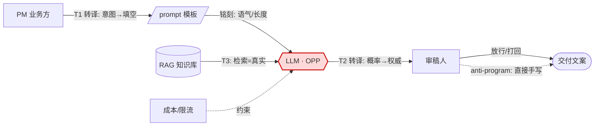

# R02 ANT 描摹一个 AI 工作流的行动者网络

你已经把一个 AI 协作工作流跑顺了——需求进来、模型生成、人审、落库——但你说不清楚「权力到底在哪里重新分配了」「哪个环节一旦黑箱化就再也改不动」「为什么我以为是工具的那个 LLM，事实上正在替我做掉一半决策」。本节点给一套可操作的方法：用 **Actor-Network Theory（行动者网络理论，ANT）** 把这个工作流画成一张「人 + AI + 工具 + 数据」对称编织的网络，标出 **转译点（translation）** 与 **权力节点（OPP / 黑箱）**，给出方法、模板和一个填好的范例。视角框架是 Latour-Callon 的 ANT——它不是流程图，它是一种逼你看见「非人行动者也在行动」的诊断仪。

> [!warning] 本节定位
> 这是 **05 复现指南** 的操作型节点，不是理论综述。理论锚点在 [R01 给一个 AI 产品做 Script 分析](/kb/专题-人文社科透镜/r01-给一个-ai-产品做-script-分析/)（Akrich 脚本读取）与 [A03 Actor-Network Theory·AI 作为非人行动者](/kb/专题-人文社科透镜/a03-actor-network-theory-ai-作为非人行动者/)（ANT 与对称性原则）。本节只回答一件事：**给我一个真实的 AI 工作流，我如何在 90 分钟内把它画成行动者网络并产出可执行的 PM 判断。**

---

## §0 为什么是 ANT，而不是流程图 / SIPOC / 用户旅程图

PM 手上已经有一堆「把工作流画出来」的工具：泳道图、SIPOC、用户旅程图、DAG。为什么还要 ANT？因为这些工具都预设了一个本体论错误——**它们把工具当成透明的传导管，只有人才"行动"**。

| 工具 | 谁被画成行动者 | AI 在图里是什么 | 看不见什么 |
|---|---|---|---|
| 泳道 / 流程图 | 人类角色（岗位） | 一个处理框（黑箱） | AI 自己改写了流程 |
| SIPOC | 供应商→输入→过程→输出→客户 | "过程"里的一步 | 数据集的政治、标注劳动 |
| 用户旅程图 | 单一用户 | 触点/界面 | 组织内部权力重组 |
| **ANT 行动者网络** | **人 + AI + 工具 + 数据 对称** | **actant（行动元），与人同级** | —（这正是它要补的盲点）|

ANT 的硬核主张是 **generalized symmetry（广义对称性）**：分析时不预设谁更重要，人、模型、prompt 模板、向量库、标注规范、API 限流，都先平等地当作 **actant（行动元）** 纳入，再去看谁实际改变了谁的行为（来源：Latour-Callon-Law，巴黎 CSI，1980s；Callon 1984《Some Elements of a Sociology of Translation》, *The Sociological Review* 32(S1):196-233, DOI 10.1111/j.1467-954X.1984.tb00113.x）。

> [!note] 一个判断
> 对 PM 来说，对称性不是哲学姿态，是**防漏诊**。当你说「LLM 只是个工具」，你已经把它从权力分析里删掉了——而它恰恰是这个网络里转译能力最强的节点。ANT 强迫你把它放回桌面。

⚠️ 边界先说在前：ANT 的描述性立场（不预设好坏）被反复批评为**对权力缺乏规范性批判力**（Mills 2018, *British Journal of Sociology* 69(2), DOI 10.1111/1468-4446.12306）。本节的应对是——ANT 负责**让权力显形**，规范判断交给后续的伦理/治理节点（链 0115道德哲学-伦理学、生命政治）。ANT 是诊断仪，不是处方笺。

---

## §1 五个核心零件：你画图时只需要记住这五个词

不要被 ANT 庞杂的术语吓退。描摹一个工作流，你只需要五个零件。

| 零件 | 英文 | 一句话 | 在 AI 工作流里长什么样 |
|---|---|---|---|
| **行动元** | actant | 凡能改变他者行为之物，人或非人 | PM、审稿人、LLM、prompt 模板、RAG 库、标注规范、限流策略 |
| **转译** | translation | 一个行动元让另一个行动元改变目标/行为，并把自己设成"绕不过去" | 把"写一份周报"转译成"调用这个 prompt 模板填空" |
| **必经节点** | OPP（Obligatory Passage Point） | 所有人要达成目标都必须经过的隘口 | 全公司文案都得过这个 LLM 网关 / 这套审核规则 |
| **铭刻** | inscription | 设计者把对用户行为的预设编码进技术物 | prompt 模板里写死的语气、长度、禁用词；RLHF 留下的谄媚倾向 |
| **黑箱化** | black-boxing | 稳定下来的网络被当作单一整体，不再被追溯 | "接入大模型 API" 这一步没人再问里面发生了什么 |

（核心概念来源：Latour《Science in Action》1987；Callon 1984 四阶段转译模型；OPP 见 Monteiro, *ANT and Information Infrastructure*, NTNU；inscription/black-boxing 同上。Akrich 的 inscription/script 更细的读取方法见 [R01 给一个 AI 产品做 Script 分析](/kb/专题-人文社科透镜/r01-给一个-ai-产品做-script-分析/)，本节点不复述。）

**Callon 的四阶段转译模型**（圣布里厄湾扇贝研究经典案例）——画 AI 网络时拿它当"转译点放大镜"：

| 阶段 | 含义 | AI 工作流问法 |
|---|---|---|
| Problematization 问题化 | 定义问题，把自己设成 OPP | 谁定义了"好的输出长什么样"？|
| Interessement 利益化 | 说服并锁定其他行动元 | 工具如何让人离不开它（快捷键、默认值）？|
| Enrollment 征募 | 分配角色，稳固同盟 | 谁被分到"只负责微调 prompt"的角色？|
| Mobilization 动员 | 代言让沉默者被代表 | 谁在替"数据集""被审核的用户"说话？|

---

## §2 方法：六步把工作流画成行动者网络（90 分钟版）

> [!tip] 操作前提
> 选一个**你真正跑过、有产出物可查**的 AI 工作流，不要选想象中的。范围控制在「一个可观测的输入到一个可交付的输出」之间。

**Step 1 · 列全部行动元（含非人，20 分钟）**
把所有参与者写成卡片，**人和非人混在一起列，不分栏**。强迫自己至少写出 5 个非人行动元（模型、prompt 模板、数据/知识库、规范文档、基础设施约束如限流/成本/延迟）。漏掉非人 = 漏诊的开始。

**Step 2 · 画连线并标转译点（25 分钟）**
不是"A 调用 B"的数据流箭头，而是"A 让 B 改变了行为/目标"的转译箭头。每条转译线上标一个动词短语：「把模糊需求 → 转译成结构化 prompt」「把 LLM 概率输出 → 转译成'权威建议'」。**转译发生处 = 改写发生处 = 要重点盯的地方。**

**Step 3 · 找 OPP（必经节点，10 分钟）**
问：所有路径是否都收束到某一两个节点？那个"绕不过去"的就是 OPP。在 AI 工作流里，OPP 常常是**那个被默认接入的模型/网关/审核规则**——它在 Problematization 阶段就把"什么是合格输出"的定义权握在手里。OPP = 权力积累点，圈红。

**Step 4 · 标铭刻与脚本(15 分钟)**
对每个非人行动元问：它身上"写死"了哪些对人的预设？prompt 模板的默认语气是谁定的？RLHF 让模型倾向于讨好谁（[幻觉](/kb/基础知识库/幻觉/) 节点谈过的 sycophancy）?标出 anti-program——人实际怎么对抗这些铭刻（复制粘贴改写、绕过模板、关掉 AI 直接手写）。

**Step 5 · 标黑箱(10 分钟)**
哪些节点"没人再追问内部"?把它们框成灰盒。黑箱化越深 = 批判性追溯越难 = 出事时越难归因。这是给治理留的尾巴。

**Step 6 · 写诊断结论(10 分钟)**
从图里读出 3 类 PM 判断:(a)权力重组——谁的决策权悄悄移交给了非人行动元;(b)脆弱点——哪个 OPP/黑箱一旦失效全盘崩;(c)可干预点——想改变结果,该在哪个转译点下手。

---

## §3 模板：行动者网络描摹表 + Mermaid 骨架

**3.1 行动者清单表（Step 1 产物）**

| ID | 行动元 | 人/非人 | 它想达成什么 | 它身上的铭刻/脚本 |
|---|---|---|---|---|
| A1 | 业务 PM | 人 | 快速产出合规文案 | — |
| A2 | 审稿人 | 人 | 把关，但时间有限 | 组织对"合规"的定义 |
| A3 | LLM（如 [ChatGPT](/kb/ai-公司与产品/chatgpt/)/[Anthropic](/kb/ai-公司与产品/anthropic/) Claude） | 非人 | （无意图，但有倾向）输出流畅、讨好提问者 | RLHF 留下的 sycophancy、训练数据的北方偏差 |
| A4 | prompt 模板 | 非人 | 约束输出格式/语气 | 设计者写死的语气、长度、禁用词 |
| A5 | RAG 知识库 | 非人 | 提供"事实"依据 | 入库口径、检索排序的隐性优先级 |
| A6 | 成本/限流策略 | 非人 | 控制调用量 | "贵的模型只给重要任务"的隐性分层 |

**3.2 转译点表（Step 2 产物）**

| 转译线 | 谁转译谁 | 改写了什么 | 风险 |
|---|---|---|---|
| T1 | PM → prompt 模板 | 把模糊意图压成结构化填空 | 意图被模板的预设吃掉 |
| T2 | LLM → 审稿人 | 把概率输出包装成"看起来很对" | 审稿人放松警惕（[幻觉](/kb/基础知识库/幻觉/) 顺势过关）|
| T3 | RAG → LLM | 把"检索到的"等同于"真实的" | 入库偏差被放大成权威 |

**3.3 Mermaid 网络骨架（可直接套用）**

> [!note] 读图
> 红色 A3（LLM）是 OPP——所有路径都过它，它握着"合格输出"的初始定义权。虚线 anti-program 表示审稿人有时绕过整个网络直接手写,这是铭刻失败的信号,也是你做产品改进的金矿。

---

## §4 范例：把"AI 辅助安全工单分类"工作流画出来（接地到 Rick 的真实场域）

拿 Rick 在滴滴/99 做过的场景：一条 **AI 辅助的安全工单分类与处置建议** 工作流（呼应 安全感知与干预、纠纷治理从裁判到管家）。客服收到行程纠纷工单 → AI 初分类 + 给处置建议 → 人工审核 → 落库。

用上面六步画出来后,网络里浮现三个被流程图永远看不见的判断:

1. **OPP 是分类模型,不是人**。一旦"AI 初分类"成了所有工单的必经隘口,模型在 Problematization 阶段就把"这类纠纷算不算严重"的定义权握住了。客服的角色被 enrollment 成"复核员"而非"判断者"——决策权发生了转移,但组织 OKR 里没人记录这次移交。这正是 ANT 比流程图多看见的:**权力的静默重分配**。

2. **转译点 T2 是风险洼地**。模型把概率输出转译成"建议:判定为乘客责任",这个措辞让疲于奔命的审核员倾向于一键通过——[幻觉](/kb/基础知识库/幻觉/) 在这里不是技术故障,而是被网络结构放大的社会后果。Winner 对 SCOT 的批评在此显形:不能只"拆黑箱",必须追问技术采纳后**对沉默群体(无法参与协商的涉事司机/乘客)的影响**(Winner 1993,《Upon Opening the Black Box and Finding It Empty》, *Science, Technology, & Human Values* 18(3):362-378)。

3. **数据集是个没人替它说话的行动元**。RAG 库的入库口径(历史判例如何标注)铭刻了过往的处置偏好。在国际化场景下,巴西-拉美的纠纷文化语境和训练语料的偏差(Crawford《Atlas of AI》2021 谈的行星级提取链、标注劳动的全球南方外包,Le Ludec et al. 2023 法国-马达加斯加标注研究, *Big Data & Society*, DOI 10.1177/20539517231188723)会被沉默地继承。**谁在 Mobilization 阶段替"被这套分类规则错判的拉美用户"说话?** ANT 逼出这个问题,流程图永远问不出来。

> [!important] 跨域呼应（具体落地，非空喊）
> Rick 的人类学底子(Descola 的Beyond Nature and Culture、Viveiros de Castro 的多元自然主义)在这里有具体迁移:ANT 的对称性原则,本质上是把人类学"悬置我方本体论、认真对待他者的行动者"的田野纪律,搬到了人-机网络。Rick 在巴西-拉美做过的 fieldwork(对照Paisa 与湖南霸蛮的人类学比较、Uwa 宇宙观与政治工具化)训练的,正是"不预设谁是真正的能动者"的眼光——这恰是 ANT 要求 PM 具备的。**把田野的对称性,用到 AI 工作流上,就是 R02 的方法论内核。** 这不是装饰:它直接改变了第 3 条判断——只有带着民族志的对称视角(民族志),你才会把"数据集"当成需要被代言的行动元,而不是中立的背景。

---

## §5 判断主轴：描摹 AI 行动者网络时，90% 的人会栽的四个坑

> [!warning] 这一节是本节点的命门。每个坑配「症状 → 为什么会错 → 正确做法 → 真实反例」。

**坑 1 · 把 AI 画成"工具框"而不是行动元**
- 症状:图里 LLM 是个矩形处理步骤,箭头进箭头出,跟数据库没区别。
- 为什么会错:你下意识保留了"只有人才行动"的本体论,违背 generalized symmetry。
- 正确做法:问"它改变了谁的行为/目标吗?"——只要答案是"是"(它让审稿人放松、让 PM 改写需求),它就是 actant,给它和人一样的图元地位。
- 真实反例:Morton Gutiérrez(2023/2024)《On Actor-Network Theory and Algorithms: ChatGPT and the New Power Relationships in the Age of AI》(*AI and Ethics* 4:1071-1084, DOI 10.1007/s43681-023-00314-4)正是把 ChatGPT 当 actant 分析,才看见它重构了人-机权力关系——当工具框看就什么都看不到。

**坑 2 · 把"数据流"当成"转译"**
- 症状:箭头标的是"传数据""调用 API",名词性的。
- 为什么会错:数据流是中间人(intermediary,透明传导),转译是中介者(mediator,会改写所传之物)。Latour《Reassembling the Social》2005 的核心要求就是把 intermediary 还原成 mediator。
- 正确做法:每条线问"经过这一步,目标/意义被改写了吗?"改写了才是转译,要标动词:「把概率→转译成权威」。
- 真实反例:RAG 那条线如果只标"检索文档",你就漏掉了"检索结果被等同于真实"这个致命转译——[幻觉](/kb/基础知识库/幻觉/) 正是从这里被结构性放大。

**坑 3 · 找不到 OPP,或把 OPP 错认成人**
- 症状:图里没有圈红的隘口,或者把"PM"当成权力中心。
- 为什么会错:你假设权力在人手上;但 AI 工作流的 OPP 常常是被默认接入的模型/网关——它在 Problematization 阶段悄悄夺走了定义权。
- 正确做法:画完所有路径,看它们收束到哪。那个所有人绕不过的非人节点就是 OPP。
- 真实反例:平台推荐算法被分析为"强制人类行为经由其过滤的必经节点"(Monteiro, NTNU)——把它当工具,就解释不了为什么全平台都被它塑形。

**坑 4 · 忽略 anti-program 和黑箱,图画得太"和谐"**
- 症状:网络里所有箭头顺滑流动,没有对抗、没有灰盒。
- 为什么会错:真实工作流总有人对抗铭刻(绕过模板、关掉 AI 手写),也总有没人再追问的黑箱。漏掉它们,你的图是营销 PPT 不是诊断。
- 正确做法:专门标 anti-program(用户的实际反抗)和 black-box(无人追溯的节点)。anti-program 是产品改进金矿,black-box 是治理隐患。
- 真实反例:企业 IS 研究反复发现使用者用 anti-program 对抗设计者意图(Monteiro 的 Statoil Lotus Notes 案例);忽略它就误判了系统的真实采纳度。

---

## §6 产品 PM 视角补盲：图画完了，然后呢

工程视角到此结束,但 PM 不能停在"画了张图"。补三个看走眼点:

- **用户心理模型**:OPP(模型)握着定义权,会制造"自动化偏见"(automation bias)——审核员越信任 AI 越懒于复核。这不是培训能解决的,是网络结构决定的。改进要在转译点 T2 动刀(比如强制显示不确定性,呼应[幻觉](/kb/基础知识库/幻觉/)的产品策略),而不是发个"请认真审核"的通知。
- **商业模式与成本分层**:A6(成本/限流)是个隐形行动元——"贵模型只给重要任务"的策略,实际是在用算力预算重新分配"哪些用户值得被认真对待"。这是个伦理-商业耦合点,在国际化场景(全球南方用户被分到便宜模型)尤其敏感。
- **合规边界**:黑箱化越深,出事时归因越难。GDPR/巴西 LGPD 的"可解释权"要求,本质是要求把黑箱重新打开成可追溯网络。ANT 图就是合规审计的现成底稿——把它存档,出事时你有据可查。

---

## §7 对手框架回应：接受 + 边界

> [!quote] 业界/学界反方立场,逐一接受其对的部分,再标本节坚持的边界。

**反方 A · Langdon Winner / Collins & Yearley:对称性是哲学错误,物没有意向性。**
接受:对。模型确实没有"意图",把它和人完全等量齐观在本体论上可质疑(Collins & Yearley 1992《Epistemological Chicken》批 ANT 对称性导致相对主义)。
边界:但对称性是**方法论工具,不是本体论主张**——它的价值是防漏诊,逼你别把转译能力最强的节点删出权力分析。本节始终说模型"有倾向"而非"有意图",守住这条线。

**反方 B · Mills(2018)/批判社会学:ANT 只描述不批判,对剥削/不平等无能为力。**
接受:对。ANT 的描述性立场确实缺规范判断力,这是真缺陷。
边界:本节把分工说清——ANT 负责**让权力显形**(显形本身就是批判的前提),规范判断交棒给生命政治、霸权、0115道德哲学-伦理学。诊断仪不替代处方笺,但没有诊断仪的处方是瞎开药。

**反方 C(Rick 未读,破 echo chamber)· SCOT 阵营会说:你这套人-物对称,不如老老实实分析"相关社会群体"的协商。**
接受:SCOT 的"解释弹性"在分析**稳定化后**的技术争议时确实更顺手(Pinch & Bijker 1984)。
边界:但 AI 工作流恰恰处于**进行中、未闭合**的状态,且 SCOT 被批人类中心、漏掉非人物质性——画"正在重组中的人机网络"是 ANT 的主场。两者不是优劣,是适用时态不同(对照本专题 [A05 技术的社会建构 vs 技术决定论](/kb/专题-人文社科透镜/a05-技术的社会建构-vs-技术决定论/) 的 SCOT 与本节 ANT 之辨)。

> [!caution] failure scenario(本节方法在何处失效)
> 1. **网络太大画不动**:一个跨 20 个系统的企业级 AI 流水线,ANT 图会爆炸成意大利面。此时该退回 boundary object / 基础设施倒置(Star)分层处理,ANT 只用于关键转译点的局部放大。
> 2. **静态快照骗人**:ANT 图是某时刻切片,但网络在持续重组。一张过期的图比没有图更危险——必须标注版本与日期,定期重画。
> 3. **研究者视角偏差**:你画的网络是你的叙事,不是客观真相(Latour 自己承认无法完全中立)。三个人画同一个工作流会画出三张图——把这当特性,交叉对照而非追求唯一正解。

> [!note] confirmation-bias 砍除
> 本节早期范例反复拿"LLM 是 OPP"当正面案例,这是 bias——并非所有 AI 工作流的权力中心都是模型。补反例:在人工标注仍占主导的工作流里,**标注规范文档**才是真正的 OPP(它在 Problematization 阶段定义了"什么算正确标注"),模型反而是被规范塑形的下游节点。别预设 AI 一定是权力中心。

---

## §8 PM 决策启示:面试 / 选型 / 复现三类落地

- **面试**:被问"你怎么评估一个 AI 协作工具的组织影响?"——别答"提效 X%"。答:"我会先把它画成行动者网络,看它把哪些决策权从人手里转译走了,哪个节点变成了 OPP。提效数字背后,常常是一次没被记录的权力移交。"30 秒展示你比"采纳曲线"深一层。
- **选型**:对比两个 AI 方案时,别比 feature list,比**网络结构**:哪个把更多 anti-program 空间留给用户(可绕过、可手动)?哪个的 OPP 更透明(可审计 vs 黑箱)?把 §3 模板填两遍,差异一目了然。
- **复现**:把本节 §2 六步当 checklist,90 分钟产出一张图 + 三条判断。落地物与本专题 [R01 给一个 AI 产品做 Script 分析](/kb/专题-人文社科透镜/r01-给一个-ai-产品做-script-分析/)（脚本读取）、[R03 跨文化 Imaginaries 对比分析模板](/kb/专题-人文社科透镜/r03-跨文化-imaginaries-对比分析模板/)（跨文化校准）配套，构成复现三件套。

---

## §9 与已有节点的关系

- 对 [R01 给一个 AI 产品做 Script 分析](/kb/专题-人文社科透镜/r01-给一个-ai-产品做-script-分析/):**互补**。R01 用 Akrich 读单个技术物身上的脚本(纵深一个物),R02 用 ANT 把多个行动元织成网络(横展一张图)。R01 的 inscription 是 R02 网络里每个非人节点的"内部",本节不复述 Akrich 词表。
- 对 [幻觉](/kb/基础知识库/幻觉/):**深化 + 补社会维度**。[幻觉](/kb/基础知识库/幻觉/)节点把幻觉当技术-架构问题(概率采样/Softmax 不留白);本节展示幻觉如何被**网络结构(转译点 T2)放大成社会后果**——技术根因不变,新增的是"它在权力网络里如何传播"。不复述幻觉的技术分类学。
- 对 安全感知与干预 / 纠纷治理从裁判到管家:**方法注入**。给 Rick 的真实安全产品场域提供一个可直接套用的诊断工具,不改其业务结论,只加一层 ANT 透镜。
- 对 0117社会学 / 人类学 / 民族志:**升高抽象层 + 落地**。把社会学/人类学的对称性纪律,从理论降维成 PM 可执行的六步法。

---

## §10 关联节点

**核心(必读)**
- [R01 给一个 AI 产品做 Script 分析](/kb/专题-人文社科透镜/r01-给一个-ai-产品做-script-分析/) — 同模块前置,Akrich 脚本读取
- [幻觉](/kb/基础知识库/幻觉/) — 转译点 T2 放大的技术根因
- 0117社会学 — ANT 的理论母体入口
- [Agent](/kb/基础知识库/agent/) — AI agent 作为非人行动者的最强形态
- 安全感知与干预 — §4 范例的真实业务场域

**延伸(可选)**
- 人类学 / 民族志 — 对称性纪律的田野来源
- 生命政治 / 霸权 — ANT 显形后的规范判断接棒
- Beyond Nature and Culture — Descola,对称本体论的人类学根
- [ChatGPT](/kb/ai-公司与产品/chatgpt/) / [Anthropic](/kb/ai-公司与产品/anthropic/) — §3 模板里的 LLM 行动元实例
- [AI PM 知识图谱·总索引](/kb/ai-pm-知识图谱/ai-pm-知识图谱-总索引/) — 回到总图

---

## 修订日志

- **R1(2026-06-07)**:首稿。建立六步描摹法 + 三表一图模板 + 滴滴安全工单范例;判断主轴四坑、Winner/Collins/Mills/SCOT 四路对手回应、三 failure scenario + bias 砍除;跨域呼应迁移 Rick 人类学田野的对称性纪律到 AI 工作流。arXiv 类引用本节未使用(所有文献为 SAGE/Springer/MIT Press 期刊与专著,DOI 可查)。
