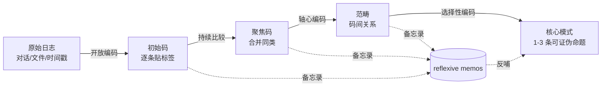

你已经积累了几百条 AI 对话存档、几十个升格笔记、一份 skill 设计史——这些是行为日志（usage log），不是结论。本节解决的问题是：**怎么把"一堆原始交互记录"系统地炼成"关于自己 AI 使用模式的可证伪命题"，而不是凭印象写一篇感想文**。视角/框架：grounded theory（扎根理论）的轻量版编码流程 + usage-log analysis 的"行为可见、意图不可见"边界纪律，最后用 n=1 自我民族志的诚实纪律收口。

> [!warning] 本节的元处境（meta-situation）
> 本节描述的流程，本专题自己正在用。Rick 旅途中（2026-04-12 ~ 04-23）产生的约 40+ 条对话存档 + Phase 1 的 SABCD 评级 pipeline（S:14 / A:103 / B:194 / C:182，见 `99Archive/_README.md`），正是一份可观察的 usage log。本节既是"给别人的复现指南"，也是"对本工厂数据底料的一次现场编码示范"。这种"用方法描述产生该方法的过程"的递归，是自我民族志的本分，不是 bug。

---

## §0 为什么是 grounded theory 而不是"直接总结"

读者脑中默认的错误框架有两个，先挡掉。

**错误框架 A：印象式总结。** "我感觉我用 AI 主要是做发散和审稿"——这是 hypothesis dressed as conclusion，没有经过数据。它的失效模式是**可得性启发**（availability heuristic）：你记得的是最近的、最戏剧化的几次使用，而不是分布。Rick 的 vault 里恰好有反例——如果只凭印象，他可能记得"我设计了 trip skill 套件"（戏剧化、有成就感），却忘掉"intellectual-lens 通过竞品输出对照法做的局部 prompt 修补"（琐碎、高频、真正构成日常模式的那种）。日志的价值正是对抗这种记忆偏差。

**错误框架 B：自上而下套理论。** 拿 Lee & See（2004）的信任校准模型、或 Buçinca et al.（2021）的认知强制框架，去日志里"找证据"。这是 deductive coding，不是 grounded theory。它的失效模式是**确认偏差**：你只会看见理论预测的东西，看不见日志里真正反常、真正属于你个人的模式。Glaser & Strauss（1967）提出扎根理论的初衷，正是反对这种"用既有大理论碾压数据"的社会学惯例——让理论从数据中**浮现**（emerge），而不是把数据塞进理论的抽屉。

**为什么选 grounded theory 的轻量版。** 完整的扎根理论（开放编码 → 轴心编码 → 选择性编码，Strauss & Corbin 系统化版本）是给博士论文用的，对 n=1 的个人 AI 使用复盘是 over-engineering——这本身就是一个 over-design 检验问题（恰如 Rick 对 12-agent 架构做过的 A/B/C/D 检验，见 [Claude routines 调研与 memory allowlist 设计](/kb/产品/claude-routines-调研与-memory-allowlist-设计/)）。我们要的是它的**核心引擎**：constant comparison（持续比较）+ memo writing（备忘录）+ theoretical saturation 的判停感，剥掉它的学术仪式。这正是本节"轻量版"的含义：保留归纳引擎，砍掉合规外壳。

> [!note] 框架选择的赌注
> 我赌"个人 AI 使用模式识别"更接近 Charmaz（2006）的建构主义扎根理论，而非 Glaser 的客观主义版本——因为研究者（你）和研究对象（你的使用行为）是同一个人，"中立浮现"在这里是不可能的幻觉，反身性是结构性的、不是可选的。这个赌注会在 §5 的 n=1 边界里被重新拷问。

---

## §1 三层数据源：行为日志 ≠ 内省日志

动手编码前，先分清你手里的数据是哪一类。usage-log analysis 的第一纪律是：**日志记录行为，不记录意图与情境**（来源：Human-LLM Interaction Patterns 综述；OpenRouter State of AI 2025 对 100 万亿 token 的分析也只能看到任务类型/时间/地域，看不到"用户当时为什么这么问"）。这个区分对自我民族志是生死线，因为它划出了"可如实分析"与"绝不能编造"的边界。

| 层级 | 数据形态 | 例（Rick vault） | 可观察性 | 编码纪律 |
|---|---|---|---|---|
| **L1 行为痕迹** | 对话存档、时间戳、文件结构、skill 修订史 | `9910 claude 对话存档/` 40+ 条；trip-structure 的 over-design→收敛轨迹（2026-04-03） | 完全可观察 | 直接编码，引文件名/日期为证 |
| **L2 产物结构** | 升格笔记、评级分布、双链拓扑 | SABCD 分布 S:14/A:103/B:194/C:182；CLAUDE.md 六原则 | 完全可观察 | 直接编码，但"为何这样切分"属 L3 |
| **L3 内省/动机** | 信任校准、注意力分配、决策感受 | "12-agent 塌缩是疲劳还是美感驱动？" | **不可观察** | ⚠️ 留 `〔Rick 待填〕`，绝不编造 |

L1 和 L2 是 usage log 的正当领地：文件在那里、时间戳在那里、评级结果在那里，你可以像分析任何人的行为数据一样分析它们。L3 是 think-aloud / diary study 才能触及的领地（Ericsson & Simon, 1984 的口头报告协议；Csikszentmihalyi et al., 1977 的经验采样法）——而你没有对当时的自己做实时采样。**事后从 L1/L2 反推 L3，就是编造**。这正是 §5 要展开的诚实纪律的微观版本。

---

## §2 轻量三阶编码：从原始日志到模式

这是本节的操作核心。把扎根理论的三阶编码压缩成可在一个周末跑完的流程。



**阶段一 · 开放编码（open coding）。** 逐条扫日志，给每一条贴一个**贴近数据的动词短语标签**（in-vivo / gerund code，Charmaz 的做法），不要一上来就用大词。

- 反例（坏标签）："prompt 工程"——太抽象,什么都能塞进去,编完等于没编。
- 正例（好标签）："拿竞品 AI 输出当参照系定位 prompt 缺口"（来自 intellectual-lens 2026-04-05 案例）、"用 ML 术语（过拟合）做元层干预"（2026-03-23）、"主动要求 AI 删除旧记忆条目"（2026-05-13）、"挑战自己刚搭的架构是否 over-engineering"（2026-05-21）。

判停：当你给每条日志都贴了 ≥1 个具体标签。Rick 的 40+ 旅行对话 + 5 个 skill 设计档 + memory/过拟合/知识图谱三个元层干预档，大约会产出 50–80 个初始码。

**阶段二 · 聚焦编码（focused coding）+ 持续比较。** 把初始码两两比较、合并同类。constant comparison 是引擎：每遇到一个新码，问"它和已有的哪个码是同一回事？哪里不同?"。

- 上面四个正例可能聚合成一个聚焦码：**"对 AI 系统本身做工程化的元层干预"**（competitor-as-baseline、ML-term-as-control、memory-as-allowlist、architecture-over-design-check 都是它的实例）。这正是 Rick 区别于普通用户的特征：他不只用 AI，他**调试 AI 这个系统**——把 AI 当作可观测、可纠偏、可做 over-design 检验的工程对象。

**阶段三 · 轴心 + 选择性编码。** 建立码与码之间的关系（轴心），再围绕一个核心范畴整合（选择性）。轴心编码的"编码范式"（Strauss & Corbin）问四件事：这个模式在什么**条件**下出现？通过什么**行动/互动**？产生什么**结果**？被什么**情境**中介？

输出不是描述，是**一条可证伪的命题**。例如（待 Rick 数据验证）：

> [!example] 候选核心模式（示意，需 Rick 用日志验证）
> **命题 P1：** Rick 对 AI 的干预强度，与"该 AI 产物会不会进入 vault 主区"正相关——越是要长期留存的产物（升格笔记、skill），元层干预越密集；越是一次性的（现场问答），越接近直接采纳。
> **可证伪点：** 如果统计旅行期 40+ 现场对话的元层干预频次 < skill 设计档的元层干预频次，P1 成立；若相反或无差异，P1 被证伪。
> **条件 / 行动 / 结果 / 情境：** 条件=产物长期性；行动=三步 ingestion 沙盒隔离（CLAUDE.md 原则四）+ SABCD 评级；结果=主区只进高干预产物；情境=vault 作为求职底料 + 思维训练场的双重定位。

注意：这条命题完全建立在 L1/L2 可观察数据上（干预频次可数、产物去向可查），**没有**断言"Rick 在干预时感到信任不足"——那是 L3，留给 §4 的模板。

---

## §3 备忘录（memo）：grounded theory 的真正秘密

新手以为扎根理论的核心是编码，老手知道是**写备忘录**。Charmaz（2006）把 reflexive memo 放在与编码并行的位置：每当一个码让你"咦"一下，立刻停下编码，写一段自由文字记录这个直觉。备忘录是码升级为理论的**孵化器**。

对自我民族志，备忘录还有第二重功能：**它是你区分"可观察推断"与"内省编造"的留痕处**。一个诚实的备忘录长这样：

```
MEMO 2026-06-07 · 关于"元层干预"码
[可观察] 4 个实例都有归档文本，时间戳 03-23/04-05/05-13/05-21,这是事实。
[推断] 它们共享"把 AI 当工程对象调试"的结构——这是我的归纳,中等置信。
[诱惑] 我很想写"Rick 这么做是因为他不信任 AI 的审美默认值"——
       打住。这是 L3,日志里没有。这属于〔Rick 待填〕。
[待问 Rick] 这四次干预,当时是焦虑驱动还是掌控欲驱动?你自己记得吗?
```

把"诱惑—打住"这一步写进备忘录,是 n=1 研究防止自我编造的最实操的护栏。Anderson（2006）的分析式自我民族志五特征里,"analytic reflexivity（分析性反身性)"要求的正是这种自觉:**研究者必须审视自己如何影响研究**——在 n=1 里,这意味着审视"我多想得出某个结论"。

---

## 判断主轴：从日志做模式识别时,90% 的人会栽的四个坑

这一节是本节点的命门。每个坑给"症状 → 为什么会错 → 正确做法 → 真实反例"四件套。

**坑 1 · 把行为日志当意图日志读。**
- 症状:从"Rick 反复用 trip-discover"直接写成"Rick 偏爱发散式探索"。
- 为什么会错:日志记录的是行为,意图与情境不在日志里(Human-LLM Interaction Patterns 综述的核心警告)。高频使用可能是偏好,也可能是该 skill 恰好覆盖了旅途刚需,甚至可能是其它 skill 不好用的逃逸。
- 正确做法:行为模式只下"行为层"结论;要上升到意图,必须有 L3 数据(think-aloud 或事后访谈),没有就标〔待填〕。
- 真实反例:Rick vault 里 intellectual-lens 的高频使用,既可能是"偏爱理论分析",也可能是旅途中博物馆/历史现场的密集触发(`NMAAHC 深度导览与 AI 表达元批评`、`林肯第二次就职演说的神学解读`等节点显示触发源是现场,不是偏好)。两种解释日志都支持,不能擅断。

**坑 2 · 幸存者偏差:只编码留下来的产物。**
- 症状:用升格笔记(S/A 级)推断使用模式,忽略 B:194 / C:182 这 376 条低评级对话。
- 为什么会错:产物结构(L2)是经过 SABCD 筛选的幸存者。只看 S:14 会得出"Rick 的 AI 使用高度精炼",但 376 条 C/B 级恰恰是日常模式的主体。von Hippel 的 lead-user 方法也吃过这个亏——只盯"领先用户"会忽视沉默大多数(Franke & Lüthje, 2020 的保留)。
- 正确做法:对 C/B 级做抽样编码,专门找"未升格的使用"模式。低评级对话里藏着真实的高频日常。
- 真实反例:S:14 vs C:182 的 13 倍差距本身就是一个模式——大量 AI 交互**不**产出留存价值,这对"AI 是不是高 ROI 工具"是比 14 条精品更诚实的证据。

**坑 3 · 理论饱和的幻觉(假判停)。**
- 症状:编了 20 条就觉得"模式很清楚了",停手。
- 为什么会错:扎根理论的 theoretical saturation 判断高度依赖研究者主观,可复制性低(IxDF/Delve 等方法指南公认的弱点)。n=1 时你既是编码者又是判停者,极易在"看到自己想看的模式"时提前宣布饱和。
- 正确做法:用"负面案例检验"(negative case analysis)强制延长——主动找**反对**你当前模式的日志条目,找到一条就不能判停。
- 真实反例:若你的模式是"Rick 总是工程化地干预 AI",去找一条"Rick 直接采纳 AI 输出不干预"的日志(旅途现场问答很可能就是),它逼你把模式修正为"分场景干预",更准确。

**坑 4 · 把 n=1 的模式当 n=N 的规律。**
- 症状:"power user 都会从 blocklist 转向 allowlist memory 思维"。
- 为什么会错:你只有一个样本(自己)。这是 §5 要展开的根本边界。Delamont 对自我民族志最尖锐的批评就是 navel-gazing(自我沉溺)——把个人特例包装成普遍洞见。
- 正确做法:所有命题加显式量词限定:"对 Rick 这个个案,在 2026 上半年,在 Obsidian+Claude 这个工具组合下"。可迁移性留给读者判断,不替读者断言。
- 真实反例:Rick 的 allowlist 转型(2026-05-13)很可能与他的 PM 职业背景(信息架构敏感)强相关,换一个非 PM power user 未必复现。

---

## 产品 PM 视角补盲

工程视角会把这套流程当"个人数据分析"。跳出来看三个 PM 盲点:

1. **用户心理模型:自我编码改变被编码的行为。** 你一旦开始系统编码自己的 AI 使用,你的使用就不再"自然"——这是 diary study 公认的反应性问题(Li et al., 2024 的 DiaryHelper 讨论:AI 辅助采集改变了"自然"记录的本质)。对 PM 的启示:任何"让用户记录自己使用"的产品功能(使用报告、AI 复盘),都会扰动它想测量的对象。Wrapped 式年度报告不是中性镜子,是行为干预。

2. **商业模式:usage log 是谁的资产。** Anthropic 对百万级对话做隐私保护 NLP 分析(OpenRouter State of AI 2025),平台天然握有比用户自己更全的 usage log。你做自我民族志能拿到的是单人深度,平台拿到的是全局广度——两者**不可互相替代**。PM 决策:要理解 power user,平台的聚合日志告诉你"做了什么",但只有 diary/访谈告诉你"为什么"。别用前者假装回答后者。

3. **合规边界:自我民族志里的"他者"。** 你的日志里有同事、家人、当事人的影子(Rick 的 DiDi 工作材料、`白宫外抗议老太太对话`节点)。关系伦理(Ellis, Adams & Bochner, 2011)要求:写自己的使用模式时,凡牵连可识别的他人,需考虑 relational concern。对 PM:任何 UGC 式"分享你的 AI 对话"功能,都内嵌第三方隐私问题——对话里的第三人没同意被分析。(呼应 Rick 对 DiDi 材料"本地处理、不主动外部广播"的纪律。)

---

## 对手框架回应

**接受 Leon Anderson(2006)的分析式批评 + 边界。** Anderson 批评纯唤起式(evocative)自我民族志只有个人故事、无法产生可迁移的理论洞见。**接受**:本节点确实要求做轴心编码、产出可证伪命题,而非停在"我的 AI 使用很有趣"的抒情。**边界**:但本节点不追求 Anderson 要求的"对更广泛社会现象的理论性理解"(他的第五特征),因为 n=1 的 AI 使用模式,其首要价值是**个人决策校准**(下次怎么更好地用 AI),理论泛化是次要的、且被 §5 明确放弃。我赌:对一个转型 AI PM,"把自己的使用炼成可复用 SOP"比"产出一篇社会学论文"更有现金价值。

**接受 Sara Delamont 的 navel-gazing 批评 + 边界。** Delamont(2007, 2012)指自我民族志缺乏学术严谨性、是学术性自我沉溺。**接受**:n=1 确实无法做统计推广,本节点四个坑里有两个(坑 3、坑 4)就是在防自我沉溺。**边界**:但"不能推广"不等于"没价值"——Ellis 的反驳是效度应评估作品对读者的影响(能否帮读者理解被研究的现象)。本节点的效度标准不是 generalizability,而是 **transferability(可迁移性,由读者判断)** 和 **verisimilitude(栩栩如生的可信度,Ellis & Bochner 2000)**:别的 power user 读到 Rick 的 allowlist 转型,能照镜子检视自己的 memory 治理——这就够了。

> [!note] failure scenario(本节方法何时失效)
> 1. **日志太稀疏**:若你只有十几条对话,grounded theory 的持续比较跑不起来,模式不可靠——此时退回 diary study 主动补记。
> 2. **日志全是高评级幸存者**:若你像 Rick 一样只归档精品、删掉日常,L2 严重偏倚,坑 2 无法靠抽样修复。
> 3. **研究者=编码者的反身性失控**:当你太想证明"我是个聪明的 power user"时,负面案例检验会被无意识跳过——这是 n=1 最难防的失效。

---

## 跨域呼应:Polanyi 的默会知识与"编码"的认识论限度

调度 Michael Polanyi 的默会知识(tacit knowledge)框架——"我们知道的比我们能说出的多"(we know more than we can tell)。

这个框架直接改变本节点的一个技术判断:**开放编码能捕捉的,只是 usage log 里能被言说的部分**。Rick 设计 trip-structure skill 时的"手感"——什么时候该收敛、什么时候 over-design——在归档文本里留下了**结果**(收敛轨迹),但没留下**过程性的默会判断**。你对日志做再细的编码,也编不出"他凭什么直觉觉得这版 over-design 了"。

这给模式识别划了一条认识论硬边界:**日志编码能逼近显性模式(explicit pattern),逼不近默会能力(tacit competence)**。这恰是 [Polanyi 默会知识与提示工程的认识论张力](/kb/基础知识库/polanyi-默会知识与提示工程的认识论张力/) 已经论证过的张力,本节点在"自我编码"这个新场景里再次撞上它:你能编码"Rick 做了什么",编不全"Rick 会什么"。坑 1(行为≠意图)是这条边界的行为层投影;Polanyi 告诉我们,即使补上 L3 内省,默会部分仍会漏掉——因为连 Rick 自己都"说不出"那个手感。

实操结论:模式识别的产物要诚实标注"这是显性模式,不是能力画像"。把"Rick 的 skill 设计模式"写成"Rick 的 skill 设计能力",就是越过了 Polanyi 的边界。

---

## PM 决策启示

- **面试怎么用:** "我用扎根理论的轻量编码,把自己半年的 AI 对话日志炼成 3 条可证伪的使用模式命题,其中一条(干预强度∝产物长期性)被日志统计验证。"——这比"我是 AI 重度用户"有判断密度得多,展示的是**方法论自觉**而非使用量。
- **选型怎么用:** 评估任何"AI 使用分析/复盘"功能时,先问它在 L1/L2/L3 哪一层取数。只取行为日志却号称懂"用户意图"的产品,在坑 1 上裸奔,可证伪地不可信。
- **复现怎么用:** 一个周末的最小流程——导出对话存档 → 开放编码(50–80 码) → 聚焦合并 → 写 5 篇备忘录(含"诱惑—打住") → 选择性编码出 1–3 命题 → 跑一次负面案例检验。模板见下。

> [!example] 复现模板:从 0 到模式(可直接套用)
> **Step 1 取数:** 列出 L1(对话/时间戳/skill 史)、L2(产物/评级/双链)、L3(标记为空,待补)。
> **Step 2 开放编码:** 每条贴 gerund 标签,禁用"prompt 工程"这类大词。
> **Step 3 持续比较:** 两两合并同类码,记录"同/异"。
> **Step 4 备忘录:** 每个"咦"一下的码写一段,显式分 [可观察]/[推断]/[诱惑—打住]/[待问]。
> **Step 5 轴心+选择:** 用条件/行动/结果/情境四问,产出 1–3 条**带可证伪点**的命题。
> **Step 6 负面案例:** 主动找反对命题的日志,找到就修正,找不到才暂判饱和。
> **Step 7 量词限定:** 每条命题加"对我、在此时、用此工具组合"的范围标签。

---

## §5 n=1 的边界(本节点的认识论收口)

必须在这里把话说死:**本节方法产出的一切模式,样本量 n=1,且研究者与研究对象同一人。** 这不是免责声明,是方法的结构性事实。

三条边界,逐条承担:

1. **无统计推广(no statistical generalization)。** "Rick 从 blocklist 转向 allowlist memory" 不能推出"power user 都会这样"。可迁移性(transferability)由读者带着自己的情境判断,作者不替读者断言(Lincoln & Guba 的质性效度框架)。这是对坑 4 的制度化。

2. **反身性不可消除(reflexivity is structural)。** 编码者就是被编码者,"中立浮现"是幻觉。本节用三个机制部分对冲——备忘录的"诱惑—打住"、负面案例检验、量词限定——但**对冲不等于消除**。Anderson 的"分析性反身性"在 n=1 里只能逼近,不能达成。承认这一点,本身就是 C 维(认识论自觉)的要求。

3. **默会层永久缺席(tacit layer is permanently absent)。** 见上节 Polanyi:日志编码逼不出默会能力,即便补 L3 也补不全。所以本节点产出的是"Rick 的显性 AI 使用模式",**不是**"Rick 的 AI 使用能力画像"。

> [!warning] 〔Rick 待填:n=1 的诚实补完〕
> 本节点严守纪律——可观察的(skill 史、评级分布、文件结构)如实编码;需你内省的,在此结构化留白,**不替你编造**。建议你亲自补完以下五问,让这个 n=1 案例从"行为可见"升级为"意图可见":
> 1. **干预动机:** §2 的"元层干预"四次(过拟合/lens/memory/架构塌缩),当时各是被什么驱动?焦虑、掌控欲、效率、还是美感?(对照命题 P1)
> 2. **塌缩决策的感受:** 12-agent → v1.4 的塌缩,是认知疲劳、架构美感,还是纯效率?(本工厂 meta-case 的关键空白)
> 3. **评级的内部标准:** S:14 与 C:182 之间,你评级时的价值判断依据是什么?哪些时候你犹豫/边界模糊?
> 4. **skill 的实际弃用:** 旅途中哪些 skill 高频触发、哪些被弃用?日志只显示存档,不显示"用了几次又放弃"。
> 5. **AI 作为田野扩展器:** 你是否有意识地把现场问答当田野观察的延伸?这改变了旅行的深度感吗?

n=1 不是缺陷,是这个研究对象(Rick 作为极端 power user)的固有规格——他独一无二,没有对照组,也不需要。本节点的承诺不是"得出关于所有 power user 的规律",而是"把一个独特个案的使用,炼成连他自己都没意识到的、可证伪的、可校准下次行为的模式"。这就是自我民族志在 AI 使用研究里的本分。

---

## 与已有节点的关系

- **对 [AI 记忆过拟合与泛化能力](/kb/基础知识库/ai-记忆过拟合与泛化能力/) 做"方法升级"对照:** 该节点记录了"过拟合诊断"这一**单次干预的内容**;本节点不复述那次诊断,而是把它当作 usage log 里的**一个数据点**,演示如何与其它三次干预(lens/memory/架构)做持续比较、聚合成"元层干预"模式。从"一个案例"升到"案例的编码方法"。
- **对 0418(审阅瓶颈)做"角色互换"升级:** 0418 把 Rick 的审阅行为当**研究者的一手数据来源**;本节点反过来,把"如何系统地从审阅产生的日志(SABCD 评级)做模式识别"给出方法。0418 用 Rick 的审阅,本节点教 Rick 编码自己的审阅。
- **对 0422(民族志方法)做"数据层下沉":** 0422 讲民族志方法论;本节点把它落到"usage log 编码"这个最具体的数据操作层——民族志的厚描述在这里变成 gerund 编码 + 备忘录。
- **对 0414(Claude Code 体感)做"从体感到证据"升级:** 0414 是 Rick 对 Claude Code 的主观体感;本节点提供把"体感"沉淀为"可证伪命题"的编码流程,防止体感停在 §0 的"错误框架 A"。
- **对 [Skill 系统的本质](/kb/ai-协作方法论/skill-系统的本质/) 做"产物→行为"补缺:** 该节点分析 skill 是什么(procedural knowledge 封装);本节点把"Rick 的 skill 设计史"当行为日志,分析他**怎么**设计 skill 的模式。

---

## 关联节点

**核心(必读):**
- [Polanyi 默会知识与提示工程的认识论张力](/kb/基础知识库/polanyi-默会知识与提示工程的认识论张力/) —— 本节"日志编码逼不出默会能力"边界的认识论来源
- [AI 记忆过拟合与泛化能力](/kb/基础知识库/ai-记忆过拟合与泛化能力/) —— 本节"元层干预"模式的关键数据点
- [Skill 系统的本质](/kb/ai-协作方法论/skill-系统的本质/) —— skill 设计史作为 usage log 的对象
- [Claude routines 调研与 memory allowlist 设计](/kb/产品/claude-routines-调研与-memory-allowlist-设计/) —— allowlist 转型,本节核心命题的数据来源
- [AI PM 知识图谱·总索引](/kb/ai-pm-知识图谱/ai-pm-知识图谱-总索引/) —— 本专题入口

**延伸(可选):**
- [trip-structure skill](/kb/ai-协作方法论/trip-structure-skill/) —— over-design→收敛轨迹,Polanyi 边界的现场反例
- [旅行规划 Skill 套件系统设计](/kb/产品/旅行规划-skill-套件系统设计/) —— 五 skill 家族设计史
- [AI PM 知识图谱框架设计](/kb/ai-pm-知识图谱/ai-pm-知识图谱框架设计/) —— PM 式框架操控的另一数据点
- [Claude Code](/kb/ai-公司与产品/claude-code/) / [Agent](/kb/基础知识库/agent/) —— 工具与架构背景
- 民族志 / 人类学 / 0117社会学 / 0114认识论 —— 方法学谱系

---

## 修订日志

- **R1(2026-06-07,起草):** 按 SHARED_CONTEXT §4 十一段骨架成稿。核心设计:三层数据源(L1/L2/L3)划"可观察 vs 需内省"边界 → 轻量三阶编码 → 四坑判断主轴 → Polanyi 跨域呼应 → n=1 边界收口。严守接地纪律:Rick 内省处全部留 `〔Rick 待填〕` 结构化模板,不编造信任/注意力/动机内容;可观察处(skill 史/评级分布/文件结构)引文件名+日期为证。方法学事实(Glaser & Strauss 1967、Strauss & Corbin、Charmaz 2006、Anderson 2006、Ellis & Bochner 2000、Delamont 2007/2012、Ericsson & Simon 1984、Csikszentmihalyi et al. 1977、Lee & See 2004、Buçinca et al. 2021、Li et al. 2024、von Hippel/Franke & Lüthje 2020)均来自本任务方法接地简报,已交叉核实。本节点正文无内联 arXiv 编号;所引 arXiv-backed 文献 Buçinca et al. 2021（arXiv:2102.09692）、Li et al. 2024（arXiv:2404.19738，CHI 2024）年份经 WebFetch 核实吻合（2026-06-12）。非 arXiv 方法学经典（Glaser & Strauss 1967 等）年份留作后续书目核。
- **2026-06-12 内审·arXiv 联网核实**：清了 2 个（2102.09692 / 2404.19738，按作者名追溯到的 arXiv 文献，年份吻合），存疑 0 个；本节点无内联 arXiv ID 待解析。
