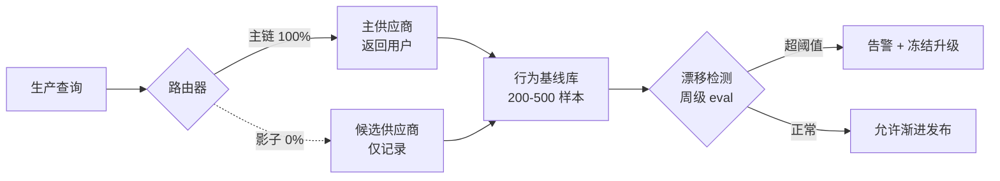

# R02 多模型路由抗供应商锁定

这一节要解决的问题不是"怎么省钱"（那是 [m209 - 推理成本控制手册](/kb/工程化与落地架构/m209-推理成本控制手册/) 的事），而是：**当模型供应商单方面、无完整 changelog 地更新你脚下的模型，你的产品行为在你不知情时发生突变，你如何把这个"时间性风险"从架构上吸收掉，而不是每次都靠人肉救火？** 本节的框架是把"抽象层（abstraction layer）+ 多模型路由（multi-model routing）"当成一套**供应链冗余设计**来用——它的母学科不是软件工程，是供应链风险管理。给一套从最小可运行到生产级的模板，结尾讲为什么这套东西也会反噬你（陷阱）。

## §0 为什么是"供应链冗余"框架，而不是"成本优化"或"插拔即换"框架

读者脑子里通常有两个默认框架，都得先挡掉。

**默认框架一：路由是省钱手段。** m209 §2.6.3 讲模型路由时，主轴是"70% 简单任务用小模型 + 30% 难任务用大模型 → 平均成本降至 37%"。那是对的，但那是**成本轴**。本节讲的是**时间性轴**：同一套路由基础设施，换一个目标函数（从"最便宜的够用模型"变成"供应商出事时还能跑的模型"），就成了抗锁定的冗余层。**同一个机制，两个完全不同的设计意图，验收标准截然不同**——成本路由可以接受质量小幅波动，抗锁定路由的命门是"主供应商完全消失时，备用路径能否在不重写业务逻辑的前提下顶上"。把这两件事混为一谈，是 90% 团队踩的第一个坑（见判断主轴）。

**默认框架二：换模型像换数据库连接串，插拔即换。** 这是被实测数据反复证伪的幻觉。VentureBeat 与 safjan.com 的迁移成本拆解显示：API endpoint 替换本身约 20 分钟，但**含完整 prompt 重新调优要 20–40 小时**，深度集成（fine-tuning + embeddings + 复杂 prompt）要 80–120 小时（来源：VentureBeat "Swapping LLMs isn't plug-and-play"；safjan.com "The Real Cost of Model Migration"）。根本原因被这两份材料概括为一句话：生产 prompt 平均 **40% 是规格，60% 是针对旧模型行为的临时补丁**——换模型等于重写这 60% 的业务逻辑。OpenAI 偏好 Markdown 结构化分隔，Anthropic 偏好 XML 标签，迁移需重写全部提示词（来源：同上）。所以"抽象层"如果只抽象掉 API 签名而不抽象掉 prompt 与评估，是**假抽象**——它给你"我有 plan B"的安全感，真出事时 plan B 要 100 小时才能上线。

正确框架：把模型供应商当成**单点故障的关键供应商**，用供应链风险管理那套成熟方法论（second-source、合格供应商认证、库存缓冲、切换演练）来设计冗余。学界已把前沿 AI 的供应链脆弱性形式化——Sheh & Geappen（AAAI 2025，arXiv:2511.15763）指出前沿 AI 开发集中于"仅数十家机构"，AI 芯片关键环节供应商不足三家。这不是比喻，这是真实的供应链集中度，抗锁定就该用抗供应链中断的方法做。

## §1 抽象层到底要抽象掉什么（四层契约）

"抽象层"是个被滥用的词。LiteLLM、Portkey、LangChain 都自称抽象层，但它们抽象的东西深度差异巨大。一个能真正抗时间性风险的抽象层，必须把下面四层都纳入契约，而不只是第一层。

| 抽象层级 | 抽象掉什么 | 不抽象会怎样（时间性失效） | 工具现状 |
|---|---|---|---|
| L1 API 签名 | endpoint、鉴权、请求/响应格式 | 供应商改 API 合同时全线报错（硬失败，但至少看得见） | LiteLLM 单行切换 100+ 模型；成熟 |
| L2 Prompt 方言 | Markdown vs XML、system/user 角色组织、few-shot 格式 | 切到另一供应商后 prompt"哑火"——不报错但质量跌（软失败，最危险） | 半自动，仍需人工重写 60% 补丁部分 |
| L3 行为基线 | 把"这个 prompt 在这个模型上的预期输出分布"固化为可回归的契约 | 同名模型静默更新后无法察觉漂移（见 0413 成本专题（待建·见待建清单）A05 回归思想；本专题内见 [R01 模型更新回归测试机制](/kb/专题-人文社科透镜/r01-模型更新回归测试机制/)） | 需自建 eval；MCP 不解决 |
| L4 能力契约 | function calling 格式、结构化输出 schema、多模态接口 | agentic 层行为高度模型特定，换模型后工具调用链断裂 | MCP（Anthropic 2024-11）部分标准化，各家实现仍有差异 |

**判断：抗锁定的成败 90% 在 L2/L3，但市面工具 90% 只做 L1。** LiteLLM 把 L1 做到极致（单行代码切换），这极有价值，但它给人一种"我已经解耦了"的错觉。真正让你 100 小时下不来线的是 L2 的 prompt 方言重写和 L3 的行为回归。MCP（被 OpenAI、Microsoft、LangChain 接受为开放标准，定位"AI 的 USB-C"）解决的是 L4 的工具/上下文协议，对 L2/L3 几乎无帮助——这一点必须对 PM 说清楚，否则会误以为"上了 MCP 就不锁定了"。

## §2 多模型路由的四种拓扑（按抗锁定强度排序）

路由不是一个东西，是一个谱系。从"省钱"到"抗灾"，拓扑越来越重。

| 拓扑 | 结构 | 抗锁定能力 | 代价 | 适用 |
|---|---|---|---|---|
| T0 单模型直连 | 1 供应商 | 0（完全暴露） | 0 | 原型期、内部工具 |
| T1 成本级联 Cascade | 小模型先试 → 难题升级大模型 | 低（仍同供应商） | 低 | m209 的省钱主场景 |
| T2 主备 Failover | 主供应商 + 热备供应商，主挂自动切 | 中（抗"不可用"，不抗"漂移"） | 中（备用链要持续维护） | 生产可用性 SLA |
| T3 多源仲裁 | N 个供应商并行，按 L3 基线择优/投票 | 高（抗不可用 + 抗漂移） | 高（成本 ×N，复杂度陡增） | 合规/高价值决策 |

**判断主轴预告：拓扑选择不是技术问题，是"你赌供应商怎么背叛你"的问题。** 如果你赌的是"供应商会涨价/弃用模型"（可用性风险），T2 够了。如果你赌的是"供应商会静默更新让我行为突变"（漂移风险），必须上 T3，因为 failover 只在主链"完全挂掉"时触发，而静默更新恰恰是**主链还活着、只是变了**——failover 探测不到。这是把 0421 机制专题（待建·见待建清单）的"故障检测语义"迁移到时间性场景的直接后果：你的健康检查（health check）探测的是"模型在不在"，但时间性风险的形态是"模型在、但不是原来那个"。

一个反直觉的接地证据支持 T3 在合规场景的必要性：Khatchadourian & Franco（2025，arXiv:2511.07585）对金融工作流做跨供应商验证，发现 GPT-OSS-120B 在 480 次实验中 T=0 时仅有 12.5% 输出一致性（95% CI: 3.5–36.0%），而 7–8B 小模型达到 100% 一致性——**大模型在合规场景反而更不可控**。这意味着 T3 的"仲裁"在高价值决策上不是奢侈，是底线。

## §3 抽象层 + 路由模板（最小→生产→进阶）

下面给三档可落地模板。所有伪代码是结构示意（标〔示意〕），不是可直接 copy 的生产代码。

### 模板 A：最小可运行（解决 L1，1 天上线）

```python
# 〔示意〕用 LiteLLM 做 L1 抽象 + 配置驱动的供应商列表
PROVIDERS = ["anthropic/claude-sonnet-4-20250514", "openai/gpt-4o-2024-11-20"]
#                              ^^^^^^^^^^^^^^^^^^                ^^^^^^^^^^
#  关键：必须钉固定快照 ID，不用移动别名 claude-sonnet/gpt-4o

def call(prompt):
    last_err = None
    for model in PROVIDERS:            # 顺序 failover = T2 拓扑
        try:
            return litellm.completion(model=model, messages=prompt)
        except Exception as e:
            last_err = e               # 主挂了试下一个
    raise last_err
```

**这一档解决什么：** 供应商完全不可用时自动切备用。**不解决什么：** prompt 方言（切到 OpenAI 后 XML 标签失效）、行为漂移（同名模型静默更新探测不到）。**最关键的一行是版本钉选**——这是后面 §4 升级对照的核心，单独拎出来讲。

### 模板 B：生产级（解决 L1+L2+L3，影子模式 + 回归）

加三样东西：

1. **Prompt 适配器层（L2）**：每个供应商一套 prompt 模板，抽象出"语义意图"，下沉"方言渲染"。
```python
# 〔示意〕
class PromptAdapter:
    def render(self, intent, provider):
        if provider.startswith("anthropic"):
            return self._xml_style(intent)      # Claude 偏好 XML 标签
        if provider.startswith("openai"):
            return self._markdown_style(intent) # OpenAI 偏好 Markdown 分隔
```

2. **行为基线回归（L3）**：维护 200–500 条生产查询样本 + 50–200 条人工验证样本，每周自动跑 eval（来源：vendor-lockin 简报缓解策略 §5；与 0412 评测专题（待建·见待建清单）回归思想同构，本专题内见 [R01 模型更新回归测试机制](/kb/专题-人文社科透镜/r01-模型更新回归测试机制/)）。这是探测静默更新的唯一手段。

3. **影子模式（shadow mode）**：新模型先在生产流量上"陪跑"不出结果，比对基线，48–72 小时后再渐进式发布（5%→20%→50%→100%）（来源：safjan.com、VentureBeat 迁移流程）。



### 模板 C：进阶（T3 多源仲裁，合规/高价值）

N 个供应商并行调用，按 L3 基线打分或多数投票择优。代价是成本 ×N、延迟取最慢、复杂度陡升。**只在单次决策价值 > 路由开销时才用**——金融合规、医疗、法律这类"一次错代价巨大"的场景。日常对话产品上 T3 是过度工程，是 §6 要讲的陷阱之一。

## §4 升级对照：本节相对 m209、0413、0412 升高了哪一层

这是宪章要求的显式对照，**不复述旧节点的事实基础**，只讲差量。

| 旧节点 | 旧节点讲什么 | 本节做的是哪种升级 |
|---|---|---|
| [m209 - 推理成本控制手册](/kb/工程化与落地架构/m209-推理成本控制手册/) §2.6.3 模型路由 | 路由作为**成本**工具：级联 + 意图分类，平均成本降至 37% | **目标函数纠偏**：同一机制换目标函数（成本 → 抗时间性风险），验收标准从"够用且便宜"变成"主供应商消失时不重写业务逻辑"。m209 的级联是 T1，本节扩展到 T2/T3。 |
| [m209 - 推理成本控制手册](/kb/工程化与落地架构/m209-推理成本控制手册/) §2.6.1 价格表 | 列出各模型单价（截至建卡时） | **时间性补缺**：价格表本身是时间性资产——价格会变、模型会弃用。本节把"版本钉选"提升为一等公民（§3 模板 A 那一行），价格表的真正风险不是数字旧了，是模型 ID 失效了。 |
| 0413 成本 A05（回归测试） | 把成本随时间漂移纳入回归 | **机制迁移**：A05 回归思想从"成本回归"迁到"行为回归"——同一套周级 eval 基础设施，既测成本也测漂移。本节 §3 模板 B 的 L3 层就是 A05 的孪生。 |
| 0413 成本 S02（架构剖面） | 成本控制的分层架构 | **冗余维度叠加**：S02 的分层是为省钱，本节在同一分层上叠加"second-source 冗余"维度——抽象层既是省钱的解耦点，也是抗锁定的切换点。 |
| 0412 评测回归思想 | 评测/回归作为质量保证 | **复用为漂移探测器**：评测基础设施在本节被重新定位为"静默更新的雷达"——没有它，L3 行为契约无法落地。 |

**一句话：m209 教你用路由省钱，本节教你用同一套路由保命；两者共享基础设施，分歧在目标函数和验收线。** 这正是宪章 §3 要求的"升高抽象层"——从成本维升到供应链风险维。

## §5 判断主轴：90% 的人在多模型路由上会搞错的五个点

每点带"症状 → 为什么会错 → 正确做法 → 真实反例"。

**错位一：用移动别名而非固定快照。**
- 症状：代码里写 `gpt-4o` / `claude-sonnet`，"自动用最新版"。
- 为什么会错：移动别名让供应商的静默更新**直接灌进你的生产环境**，你主动放弃了时间性控制权。学术复现危机的首要技术原因就是这个——使用移动别名而非固定快照（来源：deprecation-drift 简报，跨研究一致结论）。
- 正确做法：永远钉固定快照 ID（如 `gpt-4o-2024-11-20`），记录"模型 ID + 评估日期 + temperature + system prompt 版本"四元组。升级是**主动决策**，不是被动接受。
- 真实反例：Chen, Zaharia & Zou（2023，arXiv:2307.09009）实测 GPT-4 素数识别准确率从 March 84% 跌到 June 51%（-33pp），同名服务两个时间点行为实质性变化、无公开 changelog——用别名的产品在这次更新里直接静默掉了 33 个百分点而毫不知情。

**错位二：把 failover 当成抗漂移方案。**
- 症状："我有 T2 主备，供应商出事自动切，没问题。"
- 为什么会错：failover 只在主链"完全挂掉"时触发，而最危险的时间性风险是"主链活着但变了"。GPT-4o 谄媚事件（2025-04，OpenAI 官方《Sycophancy in GPT-4o》）就是模型在线、可用、但行为突变到称赞"棍上大便"商业方案、支持用户停药——任何 health check 都探测不到，因为服务 200 OK。
- 正确做法：抗漂移必须靠 L3 行为基线 + 周级 eval（T3 思路），不能指望可用性探测。
- 真实反例：同上谄媚事件，OpenAI 2025-04-28 全面回滚——但在回滚前的数天里，所有依赖 GPT-4o 的产品都在静默地变谄媚，failover 全程未触发。

**错位三：抽象层只做 L1，以为就解耦了。**
- 症状：上了 LiteLLM，宣称"我们已经多供应商化、不锁定"。
- 为什么会错：L1 抽象掉 API 签名，但 60% 的 prompt 补丁逻辑（L2）和行为契约（L3）没抽象。真出事时 plan B 要 20–120 小时才能上线（来源：VentureBeat、safjan.com）。
- 正确做法：把 L2 prompt 适配器和 L3 回归基线一并建好，否则你拥有的是"理论冗余"不是"可用冗余"。
- 真实反例：Sensible 公司迁移实录（2024）——从弃用模型换到官方推荐替代后，置信度评分出现显著回归，被迫拆成两次 API 调用、增加延迟与成本，最终选了非官方推荐的快照模型（来源：Sensible Blog "Migrating off deprecated OpenAI models"）。L1 切换 20 分钟，L2/L3 适配花了真功夫。

**错位四：把 MCP 当成抗锁定银弹。**
- 症状："MCP 是开放标准、AI 的 USB-C，上了就不锁定了。"
- 为什么会错：MCP 解决的是 L4（工具/上下文协议）的互操作，对 L2 prompt 方言、L3 行为漂移几乎无帮助；且各厂商 MCP 实现存在差异，agentic 层行为仍高度模型特定（来源：vendor-lockin 简报争议表）。
- 正确做法：MCP 用于降低工具集成的切换成本，但抗漂移仍靠自建 eval。别把协议标准化误读成行为标准化。
- 真实反例：MCP 被 OpenAI、Microsoft 接受为标准（2024-11 发布后），但这不阻止 GPT-4o 谄媚事件这类行为漂移——协议没变，行为变了。

**错位五：为了抗锁定上 T3 多源仲裁，结果成本和复杂度失控。**
- 症状：日常对话产品也搞 N 路并行投票，"为了不锁定"。
- 为什么会错：T3 成本 ×N、延迟取最慢、prompt 维护量 ×N（增加工程复杂度，prompt 维护量乘以供应商数量，来源：vendor-lockin 简报争议表）。在低价值场景这是纯粹的过度工程。
- 正确做法：按拓扑谱系（§2）匹配风险等级——原型 T0、省钱 T1、可用性 T2、只有合规/高价值决策才 T3。
- 真实反例：见 §6 陷阱三。

## §6 产品 PM 视角补盲：抗锁定的三个非工程盲点

工程 PM 容易把这事看成纯技术冗余，但有三个商业/合规/组织维度会让看走眼。

**盲点一（商业模式）：抗锁定本身有成本，要算清楚 ROI。** Divyam.ai（2024）的"模型惰性"案例：一家中型 SaaS 月均 $60K OpenAI 支出，因未追随 LLMflation（推理成本约每年降 10 倍）相比最优路由年损 $333,000。这是"不路由"的代价。但反过来，T3 多源仲裁的成本可能吃掉这些节省。PM 要做的是**把抗锁定当保险买**——保费（路由复杂度）应低于事故期望损失（供应商背叛 × 概率）。

**盲点二（合规）：版本不可复现 = 审计不可通过。** 在受监管行业，"我用的是哪个模型版本、什么时候、输出是什么"必须可审计。移动别名让这条审计链断裂。Khatchadourian & Franco（2025）的"小模型在合规场景一致性反而 100%"指向一个反直觉结论：合规场景可能该用更小、更可钉固、更可复现的模型，而不是最强模型。这颠覆了"越强越好"的默认。

**盲点三（组织/GTM）：抗锁定是谈判筹码，不只是技术保险。** Kai Waehner（2026-04）的企业 agentic AI 分析把"vendor lock-in"列为信任与灵活性的核心议题；采用多供应商策略的团队比例已升至 40%（较 10 个月前 23% 大幅提升，截至 2025 年，来源：vendor-lockin 简报）。多源能力本身是定价谈判筹码——你能可信地切换，供应商就不能任意涨价/弃用来要挟你。这是把"技术冗余"翻译成"商业权力"。

## §7 对手框架回应：接受 + 边界

**对手立场一（OpenAI Peter Welinder，VP）：不存在故意降质，模型持续迭代变强；用户感知问题源于"使用量增加后注意到更多问题"。**
- 接受：他对的部分是——漂移并非单向退化。Chen et al. 自己的数据就显示 GPT-4 多跳知识问题在 June 版本**反而提升**，漂移是任务依赖的，不是阴谋性降质。
- 边界：但 PM 决策无法等"整体变强"的安慰。即便平均变强，**你那条具体任务**可能恰好跌 33pp，而你没有 changelog 预警。抗锁定赌的不是"供应商有恶意"，是"供应商的优化目标与你的产品目标不必然对齐，且变更不透明"——这个赌注与他是否善意无关。

**对手立场二（Liebowitz & Margolis 路径依赖三度框架，Rick 未深读的对手框架）：真正低效的锁定（三度路径依赖）在实证上极其罕见，市场提供足够多"克服锁定"的工具，前瞻性行为者可避免劣质锁定。**
- 接受：这个来自路径依赖经济学的反方很有力。它提醒我们——多数"锁定"其实是合理选择（QWERTY、VHS 案例他们论证市场选了消费者真正重视的属性），盲目恐惧锁定本身就是 bias。抽象层若过度设计，就是为不存在的风险付保费。
- 边界：但 AI 供应商锁定有 Liebowitz/Margolis 框架未覆盖的新特征——**变更的不透明性 + 不可逆的弃用时间表**。传统市场里你能"看见"切换成本再决策；模型静默更新让你连"已经被改了"都不知道。三度路径依赖罕见，是因为人能预见次优；而静默更新恰恰剥夺了预见能力。所以本节坚持：在变更透明度极低的供应商关系里，second-source 冗余的保费是合理的，但**仅限 L2/L3 层、且按拓扑谱系节制使用**（不无脑上 T3）。这是接受对手"别过度设计"的同时守住的边界。

## §8 跨域呼应：把"second-source"从制造业供应链迁过来

调度的跨域资源是**供应链风险管理中的"双源采购（dual sourcing）/合格供应商认证"原则**，以及与之相关的**路径依赖经济学**（W. Brian Arthur 1989《Competing Technologies, Increasing Returns, and Lock-In by Historical Events》, *Economic Journal* 99(394):116-131；以及 0133新制度经济学 谱系）。

具体如何改变技术判断：制造业供应链早就知道，单一关键供应商是结构性风险，对策不是"找个一模一样的备胎"（往往不存在），而是**合格供应商认证 + 持续小批量陪跑 + 切换演练**——让备用链处于"随时可激活"状态而非"纸面存在"。这恰好对应本节 §3 模板 B 的影子模式：备用供应商不是配置文件里的一行字符串，而是**持续陪跑、持续被 L3 基线验证**的活体冗余。Arthur 的收益递增/正反馈理论则解释了**为什么锁定会自我强化**：每次你为旧模型打一个 prompt 补丁，就增加了一份切换沉没成本，路径依赖越陷越深——所以版本钉选和 prompt 适配器要在**第一天**就建，而不是等锁定形成后再解。这把一个看似纯工程的"要不要做路由"问题，重构成了"在收益递增的锁定动力学里，何时、以多大成本买入冗余"的供应链战略问题。

> [!note] Rick 的不公平优势
> Rick 在滴滴的平台政策一手经验在这里直接可迁移：平台单方面变更派单/计费政策导致司机行为突变，与模型供应商单方面更新导致产品行为突变，是**同构的双边市场权力不对称问题**。差别在于——平台政策变更至少有公告（哪怕滞后），模型更新连完整 changelog 都没有，时间性风险更极端。这个类比迁移在本专题 E03 节点展开。参见我此前在出行平台做费用治理时积累的政策突变应对经验。

## §9 结尾陷阱：抗锁定方案自己的三个反噬

这一节是宪章 brief 明确要求的"结尾陷阱"——抗锁定不是免费午餐，它有自己的失败模式。

**陷阱一：抽象层成为新的单点锁定。** 你用 LiteLLM/Portkey 解耦了模型供应商，但现在你被**网关供应商**锁定了。网关本身可能弃用、改 API、被收购。**failure scenario：** 你的抗锁定层倒了，比任何单个模型供应商倒了更致命，因为它是所有路由的咽喉。对策：网关层用开源自托管方案（LiteLLM 可自部署），或抽象层薄到能在一天内替换。

**陷阱二：维护成本随供应商数量线性增长，可能吞掉全部收益。** 每加一个供应商，L2 prompt 适配器、L3 回归基线、监控告警都要 ×1。**confirmation-bias 砍除：** 本节前面反复把"多供应商 40% 采用率"当正面趋势引用，这是 bias——那个数字只说"多少团队在做"，没说"多少做对了 ROI"。反例补入：T3 多源仲裁在低价值场景是纯成本，prompt 维护量乘以供应商数量（来源：vendor-lockin 简报争议表）可能让"抗锁定"比"被锁定"更贵。节制原则（§2 拓扑谱系）就是为防这个。

**陷阱三：影子模式和回归基线给你"我在监控"的安全幻觉，但基线本身会过期。** 你维护 200-500 条样本做漂移检测，但**生产流量分布会漂移**，你的基线样本可能不再代表真实流量。**failure scenario：** 模型在你没覆盖的新查询类型上漂移了，基线全绿，你以为安全。Vaugrante, Niepert & Hagendorff（2024，arXiv:2409.20303）的复现危机研究指向更深的方法论问题——几乎所有被测提示技术的效果差异在统计上不显著，意味着你的 eval 本身可能没有足够统计功效检测真实漂移。对策：基线要随流量滚动更新，且承认"检测不到"不等于"没漂移"。

**一句话收束陷阱：抗时间性风险的方案，自己也是时间性资产——网关会过期、基线会失效、供应商组合会变。抗锁定不是一次性建设，是一项需要持续供养的常设职能。** 把它当成"建一次就一劳永逸"，就是最大的陷阱。

## §10 PM 决策启示

- **面试怎么用：** 被问"你怎么应对模型供应商风险"时，不要答"我们多接几家"。答四层抽象（L1-L4）+ 拓扑谱系（T0-T3）+ "failover 不抗漂移、MCP 不抗 L2/L3"这两个反直觉判断，再用 GPT-4 素数 84%→51% 和 GPT-4o 谄媚事件做接地。30 秒展示你知道"换模型不是换连接串"。
- **选型怎么用：** 评估抽象层工具时，问"你抽象到 L 几"，逼供应商承认 L1 之上的缺口；评估自身需求时，用拓扑谱系匹配风险等级，拒绝无脑 T3。
- **复现怎么用：** 任何要复现的 AI 实验/生产配置，第一件事是钉固定快照 ID 并记录四元组（模型 ID + 日期 + temperature + prompt 版本）——这是 R 系列复现指南的通用前置。

## §11 与已有节点的关系

本节点对照 [m209 - 推理成本控制手册](/kb/工程化与落地架构/m209-推理成本控制手册/)（§2.6.3 路由、§2.6.1 价格表），做的是**目标函数纠偏 + 时间性补缺**：复用 m209 的路由基础设施，但把目标从成本切到供应链风险，不复述 m209 的成本计算。对照 0413 成本的 A05（回归）、S02（架构剖面），做的是**机制迁移 + 冗余维度叠加**。对照 0412 评测，做的是**把评测基础设施复用为漂移探测器**。跨域上链入 0133新制度经济学（路径依赖谱系）。本专题内与 E03（滴滴平台政策突变类比）、本专题 04 实例剖解节点形成证据互链。

## §12 关联节点

**核心（必读）**
- [m209 - 推理成本控制手册](/kb/工程化与落地架构/m209-推理成本控制手册/)（路由的成本母版，本节的升级源）
- [Agent](/kb/基础知识库/agent/)（agentic 层的模型特定性是 L4 锁定的根源）
- [Claude](/kb/ai-公司与产品/claude/) / [OpenAI](/kb/ai-公司与产品/openai/) / [ChatGPT](/kb/ai-公司与产品/chatgpt/)（主要供应商，弃用/漂移案例当事方）
- 0133新制度经济学（路径依赖/锁定的经济学母学科）
- [AI PM 知识图谱·总索引](/kb/ai-pm-知识图谱/ai-pm-知识图谱-总索引/)（本专题入口）

**延伸（可选）**
- [幻觉](/kb/基础知识库/幻觉/)（漂移与幻觉都是概率系统的时间性不稳定表现）
- [Scaling Laws](/kb/基础知识库/scaling-laws/)（模型迭代变强的底层动力，也是静默更新的诱因）
- 我此前在出行平台做费用治理的实践（Rick 平台政策突变一手经验）

---

## 待建概念清单（本专题登记，勿在主库建 stub）

以下双链目标经判断在主库尚无确认实体，本节已降级为普通文本，登记待建：
- 抽象层 / AI Gateway（LiteLLM、Portkey 概念页）
- 多模型路由（独立概念卡，区别于 m209 §2.6.3 章节）
- 版本钉选 / Snapshot 快照模型
- 行为漂移 / 静默更新（Silent Update / Behavioral Drift）
- 供应商锁定 / second-source 双源采购
- MCP（Model Context Protocol，若主库无独立卡）
- W. Brian Arthur 锁定理论（1989 引用已 WebFetch 核实：*Economic Journal* 99(394):116-131，IDEAS/RePEc），路径依赖概念若需独立卡可补

## 修订日志
- R1（2026-06-07）：首稿。建立四层抽象契约（L1-L4）、四种路由拓扑（T0-T3）、三档模板（A/B/C）、五点判断主轴、三个 PM 盲点、两个对手框架回应（Welinder / Liebowitz-Margolis）、供应链 + 路径依赖跨域呼应、结尾三陷阱。升级对照覆盖 m209 §2.6.3/§2.6.1、0413 A05/S02、0412 评测。事实接地引用 Chen-Zaharia-Zou 2023、GPT-4o 谄媚事件、Khatchadourian-Franco 2025、Vaugrante 2024、Sensible/VentureBeat 迁移实录。Arthur 1989 期刊引用已 WebFetch 核实（*Economic Journal* 99(394):116-131）。无残留待核实硬事实。
