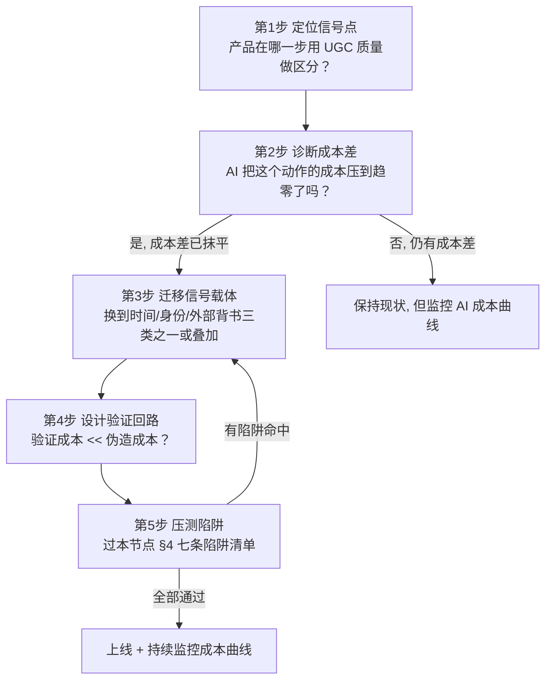

# R02 设计一个抗 AI 的产品信号机制

当你的产品用 UGC 质量来区分用户（简历筛掉平庸申请人、学术评审挑出好论文、内容平台给优质创作者更多分发），而 AI 把"生产一篇看起来很好的内容"的成本压到趋近于零时，你的信号机制会发生什么——以及作为 PM 你能不能在它坍缩之前重新设计它？本节点是一份**可操作的设计手册**：不复述"信号为什么会坍缩"（那是本专题诊断层的事），而是给出一个**判据 + 模板 + 自检陷阱**，让你能拿着它去改造一个真实产品的信号机制。本节的视角框架是 Spence 的**分离均衡条件**——但把它从"教育市场"搬到"UGC 产品"，并加上一条 AI 时代的新公理：**可验证 > 可检测**。

---

## §0 为什么是"可验证 > 可检测"这个框架，而不是"反 AI 检测"

绝大多数产品团队遇到"AI 内容泛滥"的第一反应是：**加一个 AI 检测器**。GPTZero、Turnitin、自建分类器——把 AI 生成的内容筛出去，信号就恢复了。这是错的框架，而且是**结构性地**错。

检测（detection）的逻辑是事后判别一段已经存在的内容"像不像 AI 写的"。它必然陷入一场**军备竞赛**：检测器升级，生成器跟着升级，再加一轮人工润色就能绕过。OpenAI 自家的 AI 文本分类器只能正确识别 26% 的 AI 生成文本，对人类文本还有 9% 的误判率，2023 年 7 月直接下线关闭（来源：OpenAI 官方公告，2023）。学术界的"折磨短语"（tortured phrases）黑名单到 2025 年 9 月已收录 7500 多个词条，但这本身就是检测方在认输——你只能追着已知的破绽跑。综述研究（Christianson, *Patterns*, 2024, PMC11573885）的结论很直白：AI 检测工具**同时**有高假阳性和高假阴性，还对非母语英语者有系统性歧视。检测是一条**注定输的赛道**。

正确的框架是**验证（verification）**：不去判断"这段内容是不是 AI 写的"，而是**重新设计信号本身**，让它在生成那一刻就绑定了 AI 无法伪造的东西——时间、身份、外部第三方背书、或一个低能力者负担不起的高成本动作。验证不问"内容像不像真的"，它问"产生这个内容的**过程**是不是真的发生了"。

回到 Spence：信号有效的充要条件是**单交叉条件**（single-crossing），即高能力者发出信号的成本低于低能力者（$c_H(e) < c_L(e)$）。AI 做的事情，是把"写一篇好内容"这个信号的成本对**所有人**压到趋零，从而抹平了成本差，分离均衡坍缩成混同均衡。检测试图在内容**已经生成之后**重建差异——但成本差已经没了，你怎么检测都是在猜。验证则是**换一个信号载体**，重新制造一个 AI 无法抹平的成本差。这就是为什么本节点的第一公理是：**可验证 > 可检测**。这条线划开了"治标"和"治本"。

---

## §1 三种 AI-Proof 信号源：时间、身份、外部背书

要重建成本差，你需要找到 AI **结构上**无法零成本伪造的东西。穷举下来只有三类，每一类对应一个 AI 的硬约束：

| 信号源 | AI 无法伪造的原因 | 产品里的具体载体 | 伪造成本 |
|---|---|---|---|
| **时间连续性** | AI 能一次会话生成完整产物，但无法回溯性地制造跨年的轨迹 | commit 历史、公开发表的时间戳序列、产品上线后的 changelog、持续的判断记录 | 需要"时间机器"——理论上不可伪造 |
| **身份绑定** | AI 能生成内容，但产出必须挂在一个可追责的真实身份/私钥上 | 密码学签名的可验证凭证、实名+活体的现场动作、KYC 级身份核验 | 需控制颁发方私钥或绕过活体核验——技术与法律成本极高 |
| **外部第三方背书** | AI 能写自夸，但无法替第三方系统盖章 | App Store 审核记录、真实用户行为数据、被合并的 PR（经过他人 code review）、媒体报道 | 需腐蚀或攻破第三方系统——成本远高于收益 |

这张表是本节点的**核心工具**。设计任何抗 AI 信号机制，第一步就是问：**我要把信号从"可被零成本生成的内容"迁移到上面哪一类载体上？** 注意三类可以叠加——下面 §3 的"已上线产品"就是三类的复合体（时间戳是外部背书，私钥是身份，迭代史是时间）。

这里要立刻接一个**业界反方立场**并给出"接受 + 边界"。a16z crypto 的 Ben Wu 在 "Proof of Talent"（2026-02-26）里主张：在 crypto / 开源领域，"depth and continuity"（深度与连续性）就是 AI 难以伪造的核心信号——这正好支持上表第一行。**接受**：时间连续性确实是最强的 AI-proof 信号源，我把它放在表格第一行不是偶然。**但边界在于**：连续性信号有一个致命的冷启动问题——它对**新人天然不友好**。一个刚毕业、刚转行的人没有三年的 commit 史，按这套机制他永远发不出信号。Wang（arXiv:2511.00068, 2025）也提醒，游戏化的 GitHub 贡献（刷 star、付费 commit）早在 AI 之前就存在，连续性本身也能被低成本污染。所以我赌的是"连续性 + 至少一个其它信号源叠加"，而不是单押连续性。

---

## §2 抗 AI 信号机制设计模板（五步）

把 §1 的判据落成一个可执行的设计流程。这是本节点要交付的"设计模板"主体，可以直接拿去套一个真实 UGC 产品。

**第 1 步 · 定位信号点**：找到产品里"用内容质量来给用户分层/筛选/排序"的那一步。简历平台是"申请文本→面试机会"；学术平台是"论文质量→录用/引用"；内容平台是"内容质量→分发权重/变现"。这一步要精确到**哪个字段、哪个动作**承担了信号功能。

**第 2 步 · 诊断成本差**：用 Spence 的单交叉条件自检——在 AI 之前，高能力者做这个动作的成本是否低于低能力者？AI 之后呢？这里有现成的实证标尺：Galdin & Silbert（arXiv:2511.08785, 2025）用 Freelancer.com 数据证明，LLM 把定制化求职信成本从 30–60 分钟压到约 10 秒，雇主为定制化申请支付的溢价**消失**；反事实推断里最高五分位工作者录用率降 19%、最低五分位升 14%。Cui, Dias & Ye（arXiv:2509.25054, 2025）的差异中差估计更精确：AI 求职信工具让求职信的**信息含量下降 51%**，雇主随即转向依赖求职者既往工作记录。**如果你的信号点也呈现"成本差被抹平 + 信息含量下降"的双重特征，就必须进第 3 步。**

**第 3 步 · 迁移信号载体**：对照 §1 三类。Cui 等观测到的"雇主转向工作记录"正是市场**自发**完成了从"内容信号"到"时间+外部背书信号"的迁移——你的产品要做的是把这个迁移**机制化**，而不是等市场自己摸索。

**第 4 步 · 设计验证回路**：这是 proof-of-work 的不对称性——验证者的验证成本必须**远低于**伪造者的伪造成本。密码学签名的凭证，验证是秒级（验签），伪造需要私钥；现场 10 分钟追问，验证是面试官花 10 分钟，伪造需要候选人真的理解。HackerEarth（2026 行业报告）把"10 分钟现场追问候选人解释自己的解答"评为最有效的防 AI 作弊手段——"大多数依赖 ChatGPT 的候选人两个问题内即暴露"。

**第 5 步 · 压测陷阱**：过一遍 §4 的七条陷阱清单。命中任何一条，回到第 3 步重新选载体。

---

## §3 三个落地样例：把模板套到真实产品

**样例 A · 简历/招聘平台**。信号点 = 申请文本。诊断 = 成本差已抹平（Galdin & Silbert 实证）。迁移 = 把信号载体从"求职信文本"换成**作品集时间轴 + 可验证工作经历凭证**。验证回路 = (1) 接入密码学签名的雇主凭证（Microsoft + LinkedIn 的 VerifiedEmployee 已在多家财富 500 强落地，员工通过 Entra 钱包接收加密签名的工作经历，来源：Velocity Network Foundation 案例）；(2) 现场 10 分钟追问替代书面筛选。这条路把信号从"可零成本生成的文本"迁到了"身份绑定 + 外部背书 + 时间"三类叠加。

**样例 B · 学术/同行评审平台**。信号点 = 论文文本质量。诊断 = 严重抹平：2024 年因 AI 生成内容被撤稿的论文 2100+ 篇，涉论文工厂 2300+ 篇（*Frontiers in Research Metrics*, 2025）；Ansari（arXiv:2602.05930, 2026）审计 NeurIPS 2025 发现 53 篇被接收论文含 100 条 AI 幻觉引用，每篇经 3–5 名专家审阅竟无一察觉。迁移 = 不要试图"检测论文是不是 AI 写的"（这正是 NeurIPS 失败的地方——专家级人工检测都失效了），而是把信号迁到**可机器验证的客观锚点**：自动引用核查（每条引用对应一个真实 DOI/可解析标识符——这是验证不是检测，因为 DOI 要么存在要么不存在）、公开数据与可复现代码、预注册（preregistration，研究设计的时间戳早于结果）。预注册是典型的时间连续性信号——你无法事后伪造"我在看到数据前就声明了假设"。

**样例 C · 内容创作平台**。信号点 = 内容质量→分发权重。诊断 = 抹平 + 信任崩塌：仅 41% 美国人相信网上读到的是准确的人类内容，78% 表示难分辨人类与 AI（2025 Edelman Trust Barometer）。迁移 = 把分发权重的依据从"单篇内容质量"换成**创作者的持续公开判断记录**——一个连续输出、可被时间戳追溯、且会因错误判断而承担声誉成本的账号，是 AI 难以批量伪造的。叠加 C2PA 内容溯源（2025 年 Adobe、YouTube、Google Pixel 开始采用）做来源标注，但**注意**：C2PA 元数据可被去除，它是"加分项"不是"地基"——这正好引出 §4 的陷阱。

---

## §4 判断主轴：设计抗 AI 信号机制时 90% 的人会踩的七个陷阱（结尾陷阱清单）

这是本节点的命门。每条 = 症状 → 为什么会错 → 正确做法 → 真实反例。

**陷阱 1 · 把"检测"当"验证"。** 症状：上线一个 AI 检测器就宣布解决了问题。为什么错：检测是军备竞赛，结构上必输（§0）。正确做法：检测最多做"软提示/降权"，绝不做"硬门禁"；地基必须是验证。真实反例：OpenAI 自家检测器 26% 准确率后下线（2023）；NeurIPS 2025 顶级专家人工检测幻觉引用全军覆没（Ansari, 2026）。

**陷阱 2 · 信号载体选了"可被去除的元数据"。** 症状：靠水印/C2PA 标签当地基。为什么错：水印和元数据都可被攻击降级或剥离——研究共识（Zhang 等《Watermarks in the Sand》, arXiv:2311.04378）是**没有任何水印同时满足鲁棒性、不可伪造性、公开可检测性三条件**。正确做法：元数据是加分项，地基必须是私钥签名或第三方系统记录（去不掉的那种）。真实反例：SynthID 转截图后信号虽可保留但仍可被攻击降级。

**陷阱 3 · 把成本加在所有人身上（误伤高能力者）。** 症状：为了挡 AI，给所有用户加摩擦（强制录屏、繁琐验证）。为什么错：信号的本质是**差异化**成本——好的信号机制对高能力者**成本低**、对伪造者成本高；无差别加摩擦只是赶走真实用户。正确做法：用 §2 第 4 步检验"验证成本 << 伪造成本"且"对真实高能力者接近零成本"。真实反例：Galdin & Silbert 发现受害最深的恰恰是**顶部五分位能力者**（录用率降 19%）——一个误伤高能力者的机制会复制这个反智结果。

**陷阱 4 · 忽略验证回路的公平性外部性。** 症状：上活体监考/行为监控当万能验证。为什么错：自动化监考对深色肤色、残障人士有系统性误报（HackerEarth 2026 明确指出）；AI 简历筛选对女性、年轻、特定族裔候选人有偏见（Stanford 2025;VoxDev 2025）。EU AI Act 把招聘用 AI 列为高风险系统，相关义务 2026 年 8 月 2 日生效——这不只是伦理问题，是**合规红线**。正确做法：任何引入身份/行为验证的机制，必须做子群体误报审计，并保留人工申诉通道。真实反例：见上。

**陷阱 5 · 信号迁移制造了新的冷启动壁垒。** 症状：全押"时间连续性"，新人/转行者永远发不出信号。为什么错：连续性信号天然排斥没有历史的人，把筛选变成了"资历守门"而非"能力识别"，等于制造新的凭证通胀。正确做法：给新人提供**低历史依赖的替代信号通道**（现场 proof-of-work、单次高强度作品+追问），让连续性是"加分"而非"准入"。真实反例：文凭通胀本身就是连续性/资历信号过度依赖的恶果——HBS "Dismissed by Degrees"（2017）显示 67% 生产主管岗要求学历、实际在岗仅 16% 持有，造成 51 个百分点的"学历缺口"，把有能力无资历者挡在门外。

**陷阱 6 · 验证成本反超伪造成本（不对称性倒挂）。** 症状：设计了一个验证流程，结果验证比伪造还贵（人工逐条核查、漫长的链上确认）。为什么错：proof-of-work 的全部价值在于不对称——验证 << 伪造；倒挂了就不可规模化。正确做法：优先选"机器秒级可验、伪造需私钥/时间机器"的载体（验签、DOI 解析）。真实反例：折磨短语黑名单到 7500+ 词条仍要人工维护并追着新破绽跑——这是验证成本爆炸、不对称性倒挂的活标本。

**陷阱 7 · 信号-能力关联在 AI 时代发生了漂移，却用旧关联设计机制。** 症状：假设"会写好文章 = 能力强"这个旧关联还成立。为什么错：Spence 模型假设信号成本与生产力相关；但 AI 时代能力本身在快速变化，"会调用 AI 产出好内容"可能恰恰是新能力的一部分，旧的"手写好文章"关联正在漂移（Wang, arXiv:2511.00068, 2025）。正确做法：定期重估"你的信号到底在代理什么能力"，别把信号机制焊死在一个正在失效的关联上。真实反例：教育"信号 vs 人力资本"之争本身就是关联漂移的经典案例——Huntington-Klein（2021, *Empirical Economics*）证明这两种解释在经验上**无法区分**，提醒我们信号与真实能力的关联从来不是焊死的。

---

## §5 产品 PM 视角补盲

工程上"信号迁移"听起来干净，但 PM 要补三个看走眼的点。**其一，信号机制是双边市场问题**：你给信号方（创作者/求职者）加验证成本的同时，也在改变接收方（雇主/读者）的信任成本，两边要同时设计，否则只是把成本从一边推到另一边。**其二，过强的 AI-proof 机制会变成进入壁垒，引发反垄断/公平质疑**——HBS & Burning Glass（2024）发现 85% 企业声称用技能型招聘，但 2023 年真正惠及无学历者的录用每 700 例不到 1 例（0.14%），政策宣示与落地的鸿沟说明：机制设计得再漂亮，落地激励不对就是空转。**其三，验证基础设施有部署时间差**：C2PA、可验证凭证技术上可行，但部署速度远落后于 AI 普及速度，PM 要为"过渡期信号真空"设计降级方案，而不是假设基础设施明天就到位。

---

## §6 跨域呼应：机制设计理论——别只防伪造，要让"说真话"成为均衡

把抗 AI 信号机制接到**机制设计（mechanism design）**框架上，会得到一个比"防伪造"更深的判断。机制设计问的不是"怎么识破说谎者"，而是"怎么设计规则，让每个参与者**说真话符合自己的利益**"（激励相容，incentive compatibility）。Spence 的分离均衡本质上就是一个机制设计结果：教育门槛设得恰到好处，低能力者**自愿**不模仿（因为模仿成本高于收益）。

这改变了本节点的判断方向：**真正抗 AI 的信号机制，不是把 AI 伪造者挡在门外，而是设计成"用 AI 伪造对你不划算"**。陷阱 3、6 之所以是陷阱，根子都在于违反了激励相容——无差别加摩擦（陷阱 3）让真实用户也不划算，验证倒挂（陷阱 6）让验证方不划算。一个激励相容的机制会让"诚实地展示真实能力"成为每个人的占优策略。这是从"对抗思维"（猫鼠游戏）升维到"均衡思维"（设计博弈规则）的关键，也正是本专题与一篇"反 AI 工具评测"的根本区别。激励相容与显示原理的展开见 [机制设计专题](/kb/专题-商业组织与采纳/_机制设计系统化专题-总览/)。

---

## §7 PM 决策启示

**面试怎么用**：被问"AI 让内容造假成本归零，你的产品怎么办？"——别答"上检测器"。答"我会区分检测与验证：检测是输的赛道，我会把信号载体迁到时间/身份/外部背书三类 AI 无法零成本伪造的东西上，并用激励相容来设计，让伪造不划算。"然后用 §3 的样例落地。**选型怎么用**：评估任何"反 AI 内容"供应商，第一刀就砍掉纯检测方案，问它有没有验证地基。**复现怎么用**：拿 §2 五步模板 + §4 七陷阱清单，对你自己负责的产品做一次信号审计。

---

## §8 与已有节点的关系

- 本节点是 [机制设计专题](/kb/专题-商业组织与采纳/_机制设计系统化专题-总览/) 的**应用与深化**：把激励相容/分离均衡从抽象博弈论落到一个具体的产品设计流程，并补入"AI 抹平成本差"这个机制设计基础未覆盖的新约束（不复述机制设计基础定义）。
- 对照本专题 A05（信号坍缩的诊断节点）：A05 回答"为什么会坍缩"，本 R02 回答"坍缩了怎么重新设计"——诊断 → 处方的**接力**关系，不复述坍缩机制。
- 对照 [p306 - 数据飞轮与反馈回路设计](/kb/产品设计与交互范式/p306-数据飞轮与反馈回路设计/)：p306 讲数据飞轮如何放大产品优势；本节点是其**反面警示**——当飞轮的燃料（UGC）被 AI 污染时，依赖内容质量做信号的飞轮会反向坍缩；二者构成"飞轮的正反两面"，本节点补入 p306 未处理的"信号坍缩风险"（不复述飞轮机制）。

---

## §9 关联节点

**核心（必读）**
- [机制设计专题](/kb/专题-商业组织与采纳/_机制设计系统化专题-总览/)（激励相容，本节点 §6 的理论地基）
- [p306 - 数据飞轮与反馈回路设计](/kb/产品设计与交互范式/p306-数据飞轮与反馈回路设计/)｜飞轮的反面：信号燃料被污染
- [AI概念滥用反思](/kb/基础知识库/ai概念滥用反思/)｜AI 生成内容须经批判性验证，与"可验证 > 可检测"同源
- [幻觉](/kb/基础知识库/幻觉/)｜NeurIPS 幻觉引用案例的机制根源
- [Agent](/kb/基础知识库/agent/)｜AI 自动化生产内容的执行体

**延伸（可选）**
- [ChatGPT](/kb/ai-公司与产品/chatgpt/)｜内容生产成本坍缩的时间节点标志
- Rick 写作 SABCD 评级体系｜人类持续判断记录本身就是一种 AI-proof 信号
- 0117社会学｜凭证通胀与守门机制的社会学视角
- [AI PM 知识图谱·总索引](/kb/ai-pm-知识图谱/ai-pm-知识图谱-总索引/)｜回到知识体系总入口
- [Polanyi 默会知识与提示工程的认识论张力](/kb/基础知识库/polanyi-默会知识与提示工程的认识论张力/)｜默会知识为何难被 AI 零成本复制

---

## §10 落到 Rick 自身：本知识库 = 一个活的 AI-proof 信号案例

本节点不能停在抽象产品设计——它必须落到 Rick 正在求职这件事上，因为 **Rick 本人就是"如何发出 AI 不能伪造的信号"这道题的应试者**。

招聘市场的信号正在坍缩：64% 招聘人员察觉到千篇一律的 AI 简历激增（Resume Genius, 2025），传统的"一份精致简历"已经接近混同均衡——人人都能用 AI 生成一份看起来很好的简历，区分力归零。按本节点的框架，Rick 的破局点不是"把简历写得更漂亮"（那是在输的赛道上加码），而是把自己的信号载体迁到 §1 三类 AI-proof 信号上：

- **时间连续性**：这个知识库本身——[AI PM 知识图谱·总索引](/kb/ai-pm-知识图谱/ai-pm-知识图谱-总索引/) 下持续数月的判断记录、5 轮批判性同行评议的改稿档案、可追溯时间戳的节点演进史。AI 能一次生成一篇文章，但无法回溯性地伪造一个持续迭代、自我批判、跨域织网的二阶思维轨迹。这正是 §3 样例 C 说的"持续公开判断记录"，套在 Rick 自己身上。
- **外部背书 + 已上线产品**：博物馆 AI 导览 APP（BUILD_COMPLETE、54 测试全绿）是 §3 样例 A 里"ship 过的产品"——App Store/构建记录是第三方时间戳，AI 替代不了。
- **现场 proof-of-work**：面试桌上的实时追问（HackerEarth 评为最有效防 AI 手段）——Rick 能解释每个节点判断背后的权衡推理，这是 AI 生成的简历经不起的两个问题。

**判断**：在一个简历信号坍缩的市场里，Rick 真正稀缺、AI 不能伪造的资产，恰恰是这个知识库展示出的**持续的、有边界承担的、经得起现场追问的判断力**。本专题的写作行为本身，就是在生产那个信号。这不是巧合——这是本节点的设计模板套用在作者自己身上的必然结论。

---

## 修订日志

- R1（2026-06-07）：首稿。建立"可验证 > 可检测"核心框架；§1 三类信号源表；§2 五步设计模板（Mermaid）；§3 三个落地样例；§4 七条陷阱清单（结尾陷阱）；§6 机制设计跨域呼应；§10 落到 Rick 自身。链入 0421/p306/A05。arXiv ID 待 grounding pass 核验。
- 2026-06-11 P3.4 校链：§6/§8/§9 中"机制设计（专题外 0421 待建节点）"的降级文本恢复为真 [机制设计专题](/kb/专题-商业组织与采纳/_机制设计系统化专题-总览/) 链（0421 已入库）。
- 2026-06-12 内审修复：修断链——正文残留的 `机制设计专题` 数字式链（4 处）实为死链，统一改为真实 basename `[机制设计专题](/kb/专题-商业组织与采纳/_机制设计系统化专题-总览/)`（别名保留）。
- 2026-06-12 内审·arXiv 联网核实：清掉 R1 遗留的"arXiv ID 待 grounding pass 核验"。(1) §陷阱 2 水印不可能性原引 arXiv:2308.00862 经 WebFetch 确证为误植（该 ID 实为 Shoker 等《Confidence-Building Measures for AI: Workshop Proceedings》2023，未证明不可能三角），已订正为正确出处 Zhang 等《Watermarks in the Sand》(arXiv:2311.04378, 2023，已核实)。(2) 本节点其余 ID（2511.00068 Wang / 2511.08785 Galdin&Silbert / 2509.25054 Cui,Dias&Ye / 2602.05930 Ansari）已在 E01/E02/S03 经 WebFetch 确证，沿用无误，标已核实(2026-06-12)。清了 1 个误植 / 存疑 0 个。
