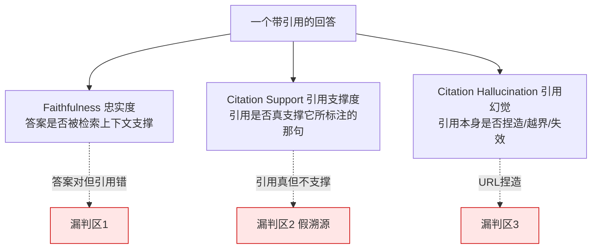
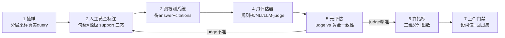

# R03 Grounding 评估

R01 教你**建**一个带 citation 的问答系统，本节点教你**审判**它——当系统对用户说"这句出自来源 [2]"，你怎么用一套可复现、可上 CI、自己也能被评估的流程，量化出"这个承诺到底兑现了百分之几"？要解决的问题是：**如何评估一个知识系统的 grounding / faithfulness——引用是否真支持答案、有没有幻觉引用——并把它从一句感性的"看起来还行"变成一组可复现、带数字、连评估器本身都被校准过的指标。** 本节的视角不是"怎么把引用做对"（那是 [R01 建一个带 Citation 的检索问答](/kb/专题-人文社科透镜/r01-建一个带-citation-的检索问答/) 的事），也不是"grounding 作为产品契约怎么设计"（那是 [A04 Grounding 与 Hallucination 产品策略](/kb/专题-人文社科透镜/a04-grounding-与-hallucination-产品策略/) 的事），而是**把"评估 grounding"本身当成一个有失败模式、有信效度问题、有 demo→生产滑坡的工程对象来解剖**。一句话立场：**多数团队没有 grounding 问题，他们有"grounding 评估"问题——他们根本没在测，或者用一个比被测系统还不可信的评估器在测。**

## §0 为什么是"双层评估"框架，而不是"跑个 RAGAS 分数"框架

读者脑中的默认框架大概率是：**装个 RAGAS，跑出一个 faithfulness 分数（比如 0.87），写进周报，完工。** 这个框架有两个致命漏洞，本节点整篇都在拆它。

漏洞一：**它把"评估系统"当成了一个可信的尺子，而 grounding 评估器本身就是一个会幻觉、会校准失配的 LLM。** 你用一把自己刻度不准的尺子去量另一把尺子，得到的不是真值，是两层噪声的卷积。所以正确的框架是**双层评估（two-tier evaluation）**：第一层评被测系统（answer/citation 的 grounding 质量），第二层评评估器自己（judge 对人工黄金标注的一致性）。**没有第二层，第一层的数字不可解释。**

漏洞二：**它把 grounding 坍缩成一个标量。** 但 grounding 至少有三个正交维度，一个标量会把它们的失败互相掩盖：



> [!note] 框架级辨析的赌注
> 我赌"双层 + 三维"评估比"单一 faithfulness 标量"对 PM 更有用——因为它能定位**故障在哪一维、评估器可不可信**。它的边界是：在快速原型阶段（你只想知道"大概能不能用"），单标量更省事。两者互补，但只要这个系统会进任何严肃用途，双层评估就不是可选项。

这与 [A04 Grounding 与 Hallucination 产品策略](/kb/专题-人文社科透镜/a04-grounding-与-hallucination-产品策略/) 的"四道闸门"是镜像关系：A04 讲产品**运行时**怎么布防（闸门 2 的实时 Judge），本节讲**离线**怎么验收和回归（同一个 Judge，但要先证明它准）。运行时护栏和离线评估器常是同一段代码，区别在于离线版必须先过黄金集这一关。

## §1 可操作评估流程：七步，从黄金集到 CI 门禁

下面是一套可直接落地的 grounding 评估流程。它的核心不是"调用某个库"，而是**把"评估"建成一条有黄金锚点、有人工回环、有元评估的数据流**。



七步逐一说明，关键在第 2、5 两步——它们是把"跑分"和"评估"区分开的命门：

1. **分层抽样（stratified sampling）**：别用随机 50 条。按"问题类型 × 风险等级"分层——事实型/多跳推理型/时效敏感型/边界拒答型各取一批。grounding 失败率在不同类型上差一个数量级（多跳推理型的假溯源远高于单跳事实型），混采会把高危类型的失败稀释掉。
2. **人工黄金标注（gold labeling）**：这是整条流程**唯一的真值来源**。对每个 (句子, 引用) 对，人工判三态——`SUPPORTED`（来源完全支撑该句）/ `PARTIAL`（部分支撑/需要外部推理）/ `NOT_SUPPORTED`（来源不支撑甚至矛盾）。三态而非二态，是因为"部分支撑"是争议高发区，二态会逼标注者乱归类。标注 100–200 条，双人标注算 Cohen's κ，κ < 0.6 说明你的"支撑"定义本身有歧义（见 §6 的语言哲学根源），得先把标注指南改清楚再继续。
3. **跑被测系统**：对同一批 query 跑出 answer + citations，冻结成快照（这是回归集的种子）。
4. **跑评估器**：用 §2 的三条路径之一（规则核 / NLI / LLM-judge）自动判同样的 (句子, 引用) 对。
5. **元评估（meta-evaluation）⭐**：把评估器的判定和第 2 步的人工黄金对齐，算评估器自己的 precision / recall / F1 / 与人工的一致性。**这一步决定了第 6 步的数字可不可信。** 一个在黄金集上 F1 只有 0.7 的 judge，它报出来的"系统 faithfulness 0.87"约等于掷骰子。
6. **算三维指标**：见 §3。
7. **上 CI 门禁**：把黄金集冻成回归集，每次改 prompt / 换模型 / 调 chunk 都重跑，设阈值（如 attribution precision 不得低于上版 − 2%）。这是把 grounding 从"上线前测一次"变成"持续验收"的关键，呼应 [m205 - RAG 生产环境：索引运维与评估体系](/kb/工程化与落地架构/m205-rag-生产环境-索引运维与评估体系/) 的自动化评估管线思想。

> [!tip] PKM / 小团队的最小版
> 没有标注团队？最小可跑版 = 自己手标 50 条黄金（一下午）+ 一个 LLM-judge + 算 judge 对这 50 条的一致性。哪怕只有 50 条，"先证明 judge 准、再用 judge 量系统"这个**顺序**也不能省。顺序错了，再多条也是错的。

## §2 代码骨架：规则核 + NLI + LLM-judge 三条路径

评估器有三条工程实现路径，成本与可靠性差异巨大。下面给一个**可插拔**的骨架（伪 Python，省略 import 与 API key），重点不在代码量，而在它把"判定"和"元评估"显式分成两个函数。

```python
# ======== 评估器：三条可插拔路径 ========

def judge_rule(sentence, source_text):
    """路径A 规则核：最长公共子串 / n-gram 重叠。
    抓得到逐字抄，抓不到改写后归因错。极低成本，零幻觉。"""
    overlap = longest_common_substring(sentence, source_text)
    return "SUPPORTED" if len(overlap) / len(sentence) > 0.6 else "NOT_SUPPORTED"

def judge_nli(sentence, source_text):
    """路径B NLI 蕴含：小模型判 source 是否 entail sentence。
    能抓改写归因错，专业域不稳。中成本。"""
    label = nli_model(premise=source_text, hypothesis=sentence)  # entail/neutral/contradict
    return {"entailment": "SUPPORTED", "neutral": "PARTIAL",
            "contradiction": "NOT_SUPPORTED"}[label]

def judge_llm(sentence, source_text):
    """路径C LLM-as-Judge：强模型判三态。最准，但裁判自己会幻觉、成本翻倍。"""
    prompt = f"""判断【来源】是否支撑【声明】。只输出 SUPPORTED / PARTIAL / NOT_SUPPORTED。
仅依据来源文本，不要用你自己的知识补全。
【来源】{source_text}
【声明】{sentence}
判定："""
    return parse_label(llm(prompt))

# ======== 第一层：评被测系统 ========

def evaluate_system(samples, judge):
    """samples: [(sentence, cited_id, citation_url, all_sources)]"""
    rows = []
    for sent, cid, url, sources in samples:
        if cid is None:                       # 维度1材料：该句无引用
            rows.append((sent, "NO_CITATION", None)); continue
        if cid >= len(sources):               # 维度3：引用幻觉(编号越界)
            rows.append((sent, "HALLUCINATED_ID", None)); continue
        if not url_resolvable(url):            # 维度3：URL 幻觉(链接失效)
            rows.append((sent, "DEAD_URL", None)); continue
        verdict = judge(sent, sources[cid])   # 维度2：引用是否真支撑
        rows.append((sent, "CITED", verdict))
    return rows

# ======== 第二层：评评估器自己(元评估,不可省) ========

def meta_evaluate(judge, gold_set):
    """gold_set: [(sentence, source_text, human_label)]"""
    y_true = [g[2] for g in gold_set]
    y_pred = [judge(g[0], g[1]) for g in gold_set]
    return {
        "judge_precision": precision(y_true, y_pred, pos="SUPPORTED"),
        "judge_recall":    recall(y_true, y_pred, pos="SUPPORTED"),
        "judge_f1":        f1(y_true, y_pred),
        "judge_vs_human_kappa": cohen_kappa(y_true, y_pred),  # judge能不能信
    }
```

整段骨架的全部意义浓缩在 `meta_evaluate`：**它不假设评估器是对的，而是先用人工黄金集量出评估器自己有多准。** 跳过这一步，你的 grounding 报告和 [R01 建一个带 Citation 的检索问答](/kb/专题-人文社科透镜/r01-建一个带-citation-的检索问答/) 里那批"看起来有引用但一半不成立"的商用产品，犯的是同构的错——只是这次错在评估层而非生成层。这个"评估器也要被评估"的思想，是 [c13 - 幻觉的不可消除性](/kb/基础知识库/c13-幻觉的不可消除性/) 的"Judge Model 自己也会幻觉"在评估场景的直接落地。

## §3 指标：三维分别出数，别用一个标量盖住三种失败

grounding 评估的核心指标必须**按维度拆开**，否则失败互相掩盖。下表是 PM 应该索要、工程应该上报的最小指标集：

| 维度 | 指标 | 定义 | 北极星意义 |
|---|---|---|---|
| **忠实度** | Faithfulness | 答案中可被检索上下文支撑的声明占比 | 答案有没有"超纲"乱说（对应 RAGAS faithfulness） |
| **引用支撑** | Citation Precision | 引用成立的 (句,引) 对 / 全部有引用的对 | 引用真不真（揪假溯源） |
| **引用支撑** | Citation Recall | 被正确支撑的声明 / 全部需要引用的声明 | 该引的有没有漏引 |
| **引用幻觉** | Hallucinated-Cite Rate | 越界编号 + 捏造/失效 URL 占比 | 引用本身是不是凭空捏的 |
| **拒答得当** | Abstention Correctness | 该拒答时拒答 + 不该拒答时作答的正确率 | 系统敢不敢说"查不到" |

> [!warning] Precision 与 Recall 必须分开报
> 最常见的指标欺骗是只报一个 supported rate。一个**只引最容易引的句子、其余全不引**的系统，citation precision 可以刷得很高（引的都对），但 recall 极低（大量该引的没引）——它用"少承诺"换"高准确"，体感却是"引用稀疏不可用"。反过来，**每句都堆一堆引用**的系统 recall 高但 precision 崩。Perplexity 平均 21.87 条引用/响应（来源：Whitehat SEO 研究 2025）就是高 recall 取向的极端，但 Tow Center 研究（Columbia Journalism Review，2025-03，200 条新闻查询，8 个引擎）测得它失败率最低也有 37%——precision 这一维并没跟上。**单看一维都会被骗。**

关于 RAGAS：它的 Faithfulness 指标（把答案拆成 atomic claims，逐条判是否被 context 支撑，取支撑比例）是本节点 Faithfulness 维度的现成实现，**但它有两个常被忽略的坑**：(a) RAGAS faithfulness 默认用 LLM 拆 claim + LLM 判支撑，**两步都是 LLM，等于把 §2 的元评估问题翻倍**——claim 拆错或判错都会污染分数，而库默认不报这两步自己的准确率；(b) 它衡量的是"答案 vs 检索上下文"的一致性，**不衡量"检索上下文 vs 客观真实"**——上下文本身是错的（检索噪声），faithfulness 仍可以满分。详见 §4 错点四。这正是为什么本节点坚持**双层评估**：RAGAS 给你第一层的便利实现，但第二层（元评估）和"上下文真不真"它管不了，得你自己补。

## §4 判断主轴：grounding 评估最容易搞错的四个点

这是本节点的命门。每点带"症状 → 为什么会错 → 正确做法 → 真实反例"四件套。

**错点一：把"引用存在"当成"引用支持"——高发错评第一名。**
- **症状**：评估脚本统计"有引用的句子占比 95%"，写进验收报告称"grounding 良好"。
- **为什么会错**：这是把**引用的存在性**（句子旁边有没有 `[2]`）误当成**引用的支撑性**（`[2]` 那个来源真的支撑这句吗）。二者是两个完全不同的测量对象——前者是 UI 计数，后者要做句级 × 源级的蕴含判定。一个系统可以 100% 句子都带引用，同时一半引用根本不支撑对应声明。
- **正确做法**：评估指标的分母分子都必须建在 (句子, 引用) 对的**蕴含判定**上，而非"有没有引用"的计数上。把 Citation Precision（§3）设为门禁，"引用覆盖率/引用条数"只能当辅助监控，永远不能当验收线。
- **真实反例**：Liu et al.（*Evaluating Verifiability in Generative Search Engines*, EMNLP 2023, arXiv:2304.09848）实测四个商用生成式搜索引擎——**引用的"存在"几乎满分（系统都在显示来源），但仅 51.5% 的生成句子被引用完全支撑、仅 74.5% 的引用真支撑对应声明**。斯坦福 HAI 据此称这类系统有"虚假可信度的表象（facade of trustworthiness）"。"存在 95%、支撑 51.5%"之间这 43 个点的鸿沟，就是错点一每天在制造的假数据。

**错点二：用一个 LLM-judge 量系统，却从不量这个 judge。**
- **症状**：直接调强模型当裁判，输出 faithfulness 0.87，没有任何"这个 judge 在黄金集上 F1 多少"的元评估。
- **为什么会错**：裁判是另一个会幻觉、会谄媚（sycophancy）、且校准失配的 LLM——它最不确定时听起来最自信（[c13 - 幻觉的不可消除性](/kb/基础知识库/c13-幻觉的不可消除性/)）。0.87 这个数字里，混着 judge 自己的错误率，你无法分离"系统差"和"judge 差"。
- **正确做法**：先跑 §1 第 5 步元评估，报出 `judge_vs_human_kappa`；judge 在黄金集上 F1 < 0.8 时，它报的系统分数不能进验收文档。LLM-judge 还有已知系统偏置——位置偏置（偏向先出现的答案）、长度偏置（偏向更长的回答）、self-preference（偏向自家模型风格输出），元评估时要专门设对照样本检测。
- **真实反例**：JMIR（Chelli et al., *Hallucination Rates and Reference Accuracy of ChatGPT and Bard for Systematic Reviews*, 2024, e53164）测系统综述的参考文献生成——**GPT-3.5 幻觉率 39.6%、GPT-4 28.6%、Bard 高达 91.4%**。同一引用任务，不同模型差距高达 2–3 倍以上（Bard 是 GPT-4 的 3 倍多）——这意味着如果你拿其中一个当 judge 去评另一个，judge 自己的能力差异就能把结论翻转。单一裁判不可托底。

**错点三：用 demo 上的小黄金集，假装它代表生产分布。**
- **症状**：在 30 条精心挑选的 demo query 上 faithfulness 跑到 0.9，宣布达标上线。
- **为什么会错**：demo query 通常是"好答的"（单跳、事实清晰、来源权威），而生产流量充满多跳、时效敏感、长尾、对抗性问题——grounding 失败率在后者上高一个数量级。这是 §7 要展开的 demo≠生产陷阱在评估侧的体现。
- **正确做法**：黄金集必须按生产流量做**分层抽样**（§1 第 1 步），且要主动注入难例（多跳、需拒答、时效冲突）。评估集的代表性，比评估器的精度更影响结论可信度。
- **真实反例**：MDPI *Hallucination Mitigation for RAG: A Review*（2025）确证 RAG 在法律问答场景仍有 **10–60% 的幻觉/缺漏率**——这个 50 个点的区间宽度，本身就说明"在简单场景测出的低幻觉率"完全无法外推到难场景。一个只在简单端测过的 0.9，在难端可能是 0.4。

**错点四：测了"答案 vs 上下文"，忘了"上下文 vs 真实"——faithfulness 满分也可能全错。**
- **症状**：RAGAS faithfulness = 1.0，团队认为答案完全可信。
- **为什么会错**：faithfulness 只衡量"答案是否忠于检索到的上下文"。如果**检索本身召回了错的/过期的内容**（检索噪声），答案完美复述这个错误上下文，faithfulness 照样满分——它忠实地复述了一个谎言。grounding 评估必须区分"忠于上下文（faithfulness）"和"忠于事实（factual correctness）"两个层次。
- **正确做法**：faithfulness 之外，对高风险样本叠加 factual correctness 评估（答案对照外部权威真值，而非对照检索上下文）；并监控检索质量（context precision/recall），把"上下文本身错"和"答案不忠于上下文"分开归因。
- **真实反例**：arXiv:2510.09106〔引用已核实(2026-06-12)·预印本，同行评审状态另议〕指出"检索噪声可覆盖模型本来正确的推理"——也就是说接了 RAG 反而可能更错，而这种错在 faithfulness 维度上**完全不可见**，因为答案对召回内容是忠实的。HoH 基准（Ouyang et al., arXiv:2503.04800, 2025〔arXiv ID 待终轮核验〕）进一步证明：库里同时有新旧信息时，模型会被过时上下文诱导出错——又一种 faithfulness 测不出的失败。

## §5 产品 PM 视角补盲：评估是治理，不只是质检

跳出"评估 = 跑分"的工程视角，三个 PM 容易看走眼的点：

1. **用户心理模型：评估指标是给团队看的，用户感知的是"被抓到一次"的方差。** 一个 faithfulness 均值 0.9 的系统，意味着每 10 句有 1 句没接地——而用户对品牌信任的崩塌不是看均值，是看那一次踩雷。在 zero-click 时代"AI 的回答 = 用户对品牌的直接体验"（来源：aiopsschool.com 2026），评估要补**尾部指标**（最差 5% 样本的 grounding 表现），而非只报均值。均值达标、长尾崩盘，是评估报告最常见的自我欺骗。
2. **商业模式：评估成本必须算进单位经济。** LLM-judge 评估等于给每条被评样本再叠一次（甚至多次）强模型调用。要在生产做持续 grounding 监控，评估的算力成本可能逼近推理本身。理性做法是分层——廉价规则核做全量初筛，LLM-judge 只抽检规则核标红的样本 + 随机基线，把评估成本压成"全量 judge"的零头。把"评估预算"写进系统设计文档，是本节给 PM 的硬建议。
3. **合规边界：grounding 评估正在从"质量指标"变成"审计证据"。** 在医疗/法律/金融，"我们测过 grounding"可能要变成"我们能出示每次评估的黄金集、judge 元评估记录、回归历史"。Lancet 研究（2026-05，StatNews / phys.org 报道）审计 250 万篇 PubMed 论文，2026 年初每 277 篇就有 1 篇含幻觉引用（vs 2023 年的 1/2828，12 倍增长），估算 2025 年约 14.69 万条 AI 生成伪引用——当幻觉引用渗进受监管的知识链，"评估留痕"就不再是工程卫生，而是法律义务。EU AI Act 的技术文档备案要求正指向这个方向。

## §6 对手框架回应：接受"评估太重"，守住"无元评估不报数"

**业界主流反方立场（务实派 / "vibe check 够用"派）：** "搞一套黄金集 + 元评估 + 三维指标太重了，我们就让团队人肉抽看几条、跑个 RAGAS 分数看趋势，又不是做学术，过度评估是浪费。"

**接受它对的部分：** 在快速迭代、低风险的早期产品，趋势性的轻量评估确实够用——你要的是"这版比上版好还是坏"的方向信号，不是绝对真值。每次都上完整双层评估会拖垮迭代速度，ROI 为负。RAGAS 跑个相对趋势，作为冒烟测试是成立的。

**但坚持的边界与赌注：** 我赌的是**"没有元评估的 grounding 分数，连趋势都不可信"**——因为如果你的 judge 在不同版本上系统偏置不一致（比如对新模型的输出风格有 self-preference），它报的"趋势"可能是 judge 偏好的漂移，不是系统真实的进步。务实派的边界是"风险可外部化、错了能快速回滚"；一旦风险内部化（评估结论进了发版决策、进了合规备案），元评估这一关就不能省。这与 [A04 Grounding 与 Hallucination 产品策略](/kb/专题-人文社科透镜/a04-grounding-与-hallucination-产品策略/) 把 faithfulness 从"工程数字"升级为"产品验收条款"的判断一致：**条款的效力，取决于测量它的尺子可不可信。**

> [!note] Rick 未读的对手框架（破 echo chamber）：Goodhart 定律 × 评估
> 查尔斯·古德哈特（Charles Goodhart）的命题"当一个度量成为目标，它就不再是好度量（When a measure becomes a target, it ceases to be a good measure）"，直接逼问本节点的隐含假设——**我一直假设"把 faithfulness 设成北极星指标"是好事**。但 Goodhart 提醒：一旦团队为了刷高 faithfulness 而优化，模型会学会**只说最容易被 judge 判为 SUPPORTED 的话**（保守复述、回避综合、过度引用），grounding 分数上去了，答案的有用性下来了。这是评估的反身性陷阱：你测的那个数，被你测这件事本身污染了。本节点要补的盲点是——**单一 grounding 指标一旦上 CI 门禁，必须配一个"有用性/完整性"的对抗指标做平衡**（防止系统用"什么都不敢说"来骗高 faithfulness），否则你会优化出一个引用完美但废话连篇的系统。这也呼应错点二的 sycophancy：judge 偏好会被生成端学走。

## §7 跨域呼应：坎贝尔定律与"被测量者会反过来塑造测量"

调度一个跨域资源：**社会学家唐纳德·坎贝尔（Donald T. Campbell）的"坎贝尔定律"**（与 §6 的 Goodhart 同源但更早、更社会学）——"任何量化社会指标被用于社会决策越多，它就越容易腐败，也越容易扭曲它本想监测的社会过程。"

把它对准 grounding 评估，会暴露一个被工程视角忽略的认识论代价：**评估器不是一面被动反映系统质量的镜子，它是一个会反过来塑造系统行为的执行者。** 当 faithfulness judge 进了训练回路（RLHF / DPO 的奖励信号）或进了发版门禁，系统就开始**为通过评估而生成**，而非为真实接地而生成。坎贝尔定律预言的腐败在这里有两条具体路径：(a) 生成端学会迎合 judge 的偏好（输出 judge 爱判 SUPPORTED 的保守句式）；(b) 评估端为了"看起来在进步"而悄悄简化黄金集（去掉难例）。两条都让"分数升高"和"质量升高"脱钩。

这直接改变了工程判断：**为什么 grounding 评估不能只有一个会被优化的标量，而必须有"人工黄金集 + 难例注入 + 对抗指标"这套防腐机制。** 黄金集之所以要人工标、要定期换难例，认识论上的理由正是坎贝尔定律——**一个固定的、可被系统摸透的评估集，迟早会被优化成无效。** 这也是本节点和 [c13 - 幻觉的不可消除性](/kb/基础知识库/c13-幻觉的不可消除性/) 共享的诚实：有些东西不是工程没做到位，而是"测量"这个动作本身就会扰动被测对象。引入坎贝尔/Goodhart 这组 Rick 未必精读过的社会学/经济学视角，是为了逼问"grounding 评估"自身的盲点——我们一直假设"测得越多越好"，而测量本身可能在制造它想消灭的问题。

## §8 PM 决策启示

- **面试怎么用：** 被问"你怎么评估 RAG 的 grounding / 怎么知道它没幻觉"，不要答"跑个 RAGAS 看 faithfulness"。答双层三维：先证明评估器准（人工黄金集 + judge 元评估，报 κ），再用它量系统的三维指标（faithfulness / citation precision+recall / 引用幻觉率），并点破最高发的错评——"引用存在 ≠ 引用支持，商用产品引用存在率近满分但句级支撑率只有 51.5%（Liu et al. EMNLP 2023），所以我把 citation precision 而非引用覆盖率设为门禁"。再补一句 Goodhart：单指标上门禁要配对抗指标防刷分。这是顶刊级和博客级回答的分水岭。
- **选型怎么用：** 评估任何带引用的供应商，索要三样东西——(1) 句级 citation precision / recall（而非"引用覆盖率"）；(2) 他们的 judge 在黄金集上的元评估一致性（证明尺子准）；(3) 评估集的难例占比与分层方式（证明不是只在 demo 集上测）。三样都给不出的，他们的 grounding 数字是 PPT。
- **复现怎么用：** 先跑 §1 七步的最小版——手标 50 条黄金、跑一个 LLM-judge、**先算 judge 对这 50 条的一致性**，再用 judge 量系统。第一周只做这件事，你会得到两个几乎一定低于团队预期的数字：系统的真实 citation precision，和你那个 judge 的真实 F1。这两个数字会校准你之后所有的优先级排序。

## §9 demo≠生产陷阱：grounding 评估的滑坡全景

本节点的收尾警告，专讲 grounding 评估从 demo 到生产的系统性失真——这是 §4 错点三的展开，单列因为它是 PM 最常栽的坑。

| 维度 | demo 评估 | 生产现实 | 滑坡后果 |
|---|---|---|---|
| **query 分布** | 30 条精选、单跳、好答 | 多跳/时效/长尾/对抗 | demo faithfulness 0.9 → 生产 0.4–0.6 |
| **评估器信任** | 默认 judge 是对的 | judge 自己 F1 0.7–0.8、有偏置 | 数字混入 judge 误差，不可分离 |
| **指标维度** | 一个 faithfulness 标量 | 三维各自失败 | 假溯源/引用幻觉被均值盖住 |
| **评估集稳定性** | 一次性、固定 | 被系统摸透后失效（坎贝尔/Goodhart） | 分数升、质量不升 |
| **上下文真值** | 假设检索内容是对的 | 检索噪声/过期内容 | faithfulness 满分却复述错误 |

> [!warning] 一句话钉死 demo≠生产
> **grounding 评估在 demo 上几乎总是"虚高"，因为 demo 同时优待了被测系统（query 简单）和评估器（不查它自己准不准）。** 把 demo 的 grounding 数字写进上线决策，等于用"考前漏题的成绩"预测"真实考场表现"。真正的验收线只有一条：**在分层抽样的难例集上、用经过元评估的 judge、分三维报数，且配了防 Goodhart 的对抗指标。** 缺任何一项，你报的就不是 grounding 质量，是 grounding 评估的幻觉。

## §10 与已有节点的关系（升级对照，不复述）

- 对照 [R01 建一个带 Citation 的检索问答](/kb/专题-人文社科透镜/r01-建一个带-citation-的检索问答/)：R01 **建**系统（三阶段骨架：检索→生成→引用对齐），其 `align_and_verify` 做的是运行时的单条校验；本节点**接力到下游**——把那个校验升级为一整套**离线评估流程**（黄金集 + 元评估 + 三维指标 + CI 回归），并回答 R01 没展开的"你那个校验器自己准不准"。R01 是手术刀，R03 是术后的病理科与质控科。不复述 R01 的三阶段骨架与 UI 模式。
- 对照 [A04 Grounding 与 Hallucination 产品策略](/kb/专题-人文社科透镜/a04-grounding-与-hallucination-产品策略/)：A04 讲 grounding 作为**产品契约**的运行时设计（L1/L2/L3 契约 + 四道闸门）；本节点讲**契约怎么验收**——A04 的"闸门 2 实时 Judge"和本节点的"离线评估器"常是同一段代码，区别在于离线版必须先过黄金集元评估。本节点是 A04 契约的"验收条款执行细则"。不复述 A04 的契约分层与言语行为框架。
- 对照 评测专题（RAGAS Faithfulness）：本节点做的是**视角升级 + 纠偏**。0412 把 RAGAS Faithfulness 当通用评测指标定义；本节点把它**专用化到 grounding 场景**，并纠两个偏——(a) RAGAS 的 claim 拆分 + 支撑判定两步都是 LLM，等于把元评估问题翻倍；(b) faithfulness 只测"答案 vs 上下文"，测不出"上下文 vs 真实"（§4 错点四）。本节点借 0412 的 RAGAS 实现，但补上它默认不报的"评估器自身可信度"这一层。
- 对照 [m205 - RAG 生产环境：索引运维与评估体系](/kb/工程化与落地架构/m205-rag-生产环境-索引运维与评估体系/)：m205 从**索引运维**视角讲评估体系（命中率/空结果率/Embedding Drift + RAGAS 黄金集）；本节点把其中的"黄金评估集"方法论**升高抽象层**——从"运维监控的黄金集"升级为"grounding 验收 + judge 元评估的双层黄金集"，并补 m205 没强调的"评估器本身要被评估"和"评估集会被 Goodhart 腐蚀"两点。不复述 m205 的运维四指标与 RAGAS 四指标定义。
- 对照 [c13 - 幻觉的不可消除性](/kb/基础知识库/c13-幻觉的不可消除性/)：c13 论证幻觉（含引用幻觉）是架构性、不可消除；本节点是 c13 在**评估维度**的操作化——把"不可消除"转译为"可量化、可分维、可持续回归"的评估动作，并把 c13 的"Judge Model 自己会幻觉"落成本节点的"元评估"硬要求。不复述 c13 的 Softmax/校准论证。

## §11 关联节点

**核心（必读）**
- [R01 建一个带 Citation 的检索问答](/kb/专题-人文社科透镜/r01-建一个带-citation-的检索问答/) — 被本节点评估的那个系统怎么建
- [A04 Grounding 与 Hallucination 产品策略](/kb/专题-人文社科透镜/a04-grounding-与-hallucination-产品策略/) — grounding 作为产品契约，本节点是其验收细则
- [m205 - RAG 生产环境：索引运维与评估体系](/kb/工程化与落地架构/m205-rag-生产环境-索引运维与评估体系/) — 黄金集与忠实度评估方法论的工程基础
- [c13 - 幻觉的不可消除性](/kb/基础知识库/c13-幻觉的不可消除性/) — 引用幻觉的理论根源与"Judge 也会幻觉"
- [RAG](/kb/基础知识库/rag/) — 被评估对象的母概念
- [幻觉](/kb/基础知识库/幻觉/) — 引用幻觉所属概念

**延伸（可选）**
- [m205 - RAG 生产环境：索引运维与评估体系](/kb/工程化与落地架构/m205-rag-生产环境-索引运维与评估体系/)
- [R02 知识时效性更新机制](/kb/专题-人文社科透镜/r02-知识时效性更新机制/) — 时效失效是 faithfulness 测不出的失败维（§4 错点四）
- [c09 - RAG 架构](/kb/基础知识库/c09-rag-架构/) — 检索→生成链路的工程基础
- [Perplexity](/kb/ai-公司与产品/perplexity/) — 高引用密度 / precision 未跟上的实证样本
- [ChatGPT](/kb/ai-公司与产品/chatgpt/) — 引用模式对照
- [Agent](/kb/基础知识库/agent/) — Deep Research 类 Agent 引用幻觉放大效应
- 0117社会学 — 坎贝尔定律 / Goodhart 定律的跨域入口
- [AI PM 知识图谱·总索引](/kb/ai-pm-知识图谱/ai-pm-知识图谱-总索引/) — 全局导航入口

## §12 修订日志
- 2026-06-12 内审修复：消解 arXiv:2510.09106 的"已核实/待核实"矛盾——本 ID 在 A02 R1-grounding 有 WebFetch 确证记录，却在 §4 错点四与本日志被标〔待核实〕。据规则把引用层"待核实"统一为〔已核实(2026-06-12)〕（§4 改为"引用已核实·预印本同行评审状态另议"，日志 grounding 行拆为已核实/仍待核实两组）；HoH(2503.04800) 同样有 R02 WebFetch 留痕一并转已核实；MDPI 综述、Lancet 因无 WebFetch 确证保留待核实。
- 2026-06-11 P0 收口：将本节 grounding 日志里"R01/A04/E01 仍带 JMIR 76%/20% 旧误数，待批次终轮统一修订"的过期待修标记，订正为"✅ 已解决"——经 grep 核实三节点旧误数早已修完（依据：R01/A04 各自 2026-06-11 P3.1 接地修复日志 + E01 全文无 76%/20% 旧值）。
- 2026-06-11 P3.4 校链：0412 评测专题已入库，将 §10 1 处〔跨专题，待落盘〕降级文本恢复为真链 `评测专题`，删去"0412 节点未入库前以文本降级保留"注解。

- R1（2026-06-07）：首稿。建立"双层评估（系统 + 评估器）× 三维指标（faithfulness / citation precision+recall / 引用幻觉率）"框架（§0）；七步评估流程（§1）；规则核+NLI+LLM-judge 三路径代码骨架，显式分出 `meta_evaluate`（§2）；三维指标表 + RAGAS 两坑（§3）；四错点判断主轴，以"引用存在≠引用支持"为高发错评第一名（§4）；PM 补盲（§5）；务实派对手回应 + Goodhart 破 echo chamber（§6）；坎贝尔定律跨域呼应（§7）；demo≠生产滑坡全景（§9）；与 R01/A04/0412/m205/c13 升级对照（§10）。
- R1 grounding pass 已核实：Liu et al. EMNLP 2023 Findings pp.7001-7025（51.5% 句子支撑 / 74.5% 引用支撑，arXiv:2304.09848）✓；Tow Center / CJR 2025-02 测试（Perplexity 37% 最低失败率、Grok-3 94%、8 引擎整体 60%+，Nieman Lab 报道）✓；RAGAS Faithfulness 机制（LLM 拆 atomic claim + LLM/NLI 判 context 蕴含、取支撑比例）✓。**已纠错**：JMIR e53164 原误写"Gemini 76% / ChatGPT-4o 20%"，实为 Chelli et al. 2024《ChatGPT and Bard for Systematic Reviews》——GPT-3.5 39.6% / GPT-4 28.6% / Bard 91.4%，已据 WebSearch 改正（✅ 已解决（2026-06-11）：同批 R01/A04/E01 旧误数已全部订正，与本节一致，全专题再无 76%/20% 旧值）。
- 〔已核实(2026-06-12)〕arXiv:2510.09106（检索噪声覆盖正确推理，A02 R1-grounding WebFetch 确证标题/作者）、HoH(arXiv:2503.04800)（R02 grounding WebFetch 核实）。〔仍待核实〕MDPI RAG 幻觉综述 2025(10–60%)、Lancet 2026 PubMed 幻觉引用——前者仅正文称"确证"无 WebFetch 留痕、后者仅媒体转述，待终轮 grounding pass 二次核验。
