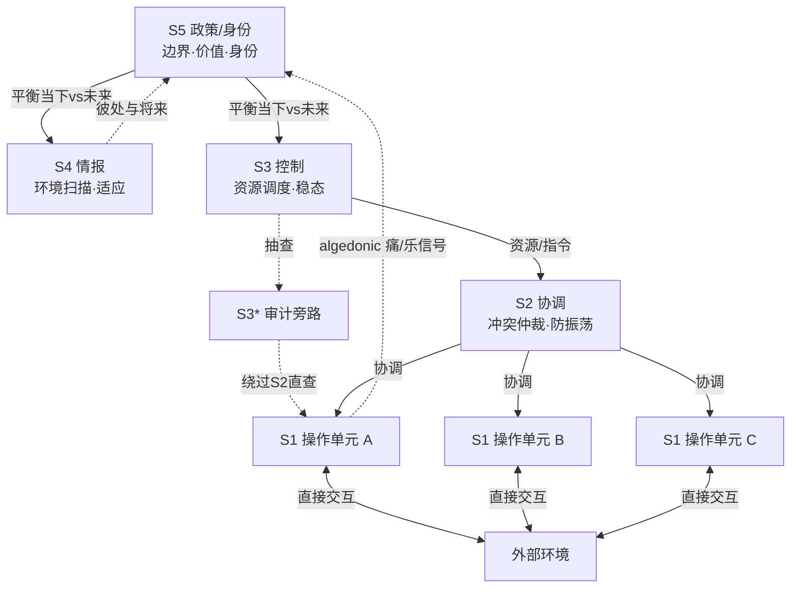

如果你要给一个跑在生产环境、能调用真实工具、会花真钱的 multi-agent 系统设计"组织结构"，你该照着什么蓝图画?本节点解决的问题是:**把 Stafford Beer 的可行系统模型(Viable System Model, VSM)当作一张可施工的治理图纸,而不是又一个 orchestrator-worker 的别名**。视角/框架名:VSM 的 System 1–5 五层职能拆分 + 递归自治 + algedonic 紧急信号通道,落成一个可以照着搭的 agent 治理骨架模板。

这不是要你"把组织管理学硬塞进 AI 工程"。Beer 的 VSM 在 1972 年的《Brain of the Firm》里已经把一个核心命题讲清楚了:**任何要在复杂环境里持续存活的系统,必须同时具备五种职能,缺一则不可行(viable)**。这个命题对一家钢铁厂成立,对智利 Allende 政府的 Project Cybersyn(1971–1973)成立,对一个 multi-agent 系统同样成立——因为它们面对的是同一个控制论问题:**用有限的内部复杂度,去吸收环境抛来的无限复杂度**(Ashby 必要多样性定律)。

> [!note] 与 [R02 中型生产·LangGraph + MCP](/kb/专题-安全对齐与失败/r02-中型生产-langgraph-+-mcp/)、[R01 最小可运行·100 行 ReAct](/kb/专题-安全对齐与失败/r01-最小可运行-100-行-react/) 的分工
> R01 给单 agent 的最小闭环,R02 给中型生产的 LangGraph 编排骨架。**R03 是这条复现线的最上层:当你的系统从"一个 agent"长到"一个 agent 组织"时,你需要的不是更多 worker,而是一套治理结构。** 本节点不复述 LangGraph 的 API,只给治理层的职能契约。

---

## §0 为什么是 VSM,而不是 orchestrator-worker

读到这里你脑子里大概率已经有一张默认图:一个 orchestrator,底下挂 N 个 worker,任务分下去、结果收上来。这是 [A06 Orchestrator 编排器](/kb/专题-安全对齐与失败/a06-orchestrator-编排器/) 讲的模式,也是 2024–2026 业界 multi-agent 框架(AutoGen / CrewAI / LangGraph)的事实标准。**那为什么还要 VSM?**

因为 orchestrator-worker 只刻画了 VSM 五层里的**两层半**:

| orchestrator-worker 概念 | 对应 VSM | 缺了什么 |
|---|---|---|
| worker / sub-agent | System 1 操作 | ✅ |
| orchestrator 的任务分发 | System 3 控制(部分) | 只有"分派",没有"协调防冲突"(S2)、没有"审计"(S3*) |
| —— | System 2 协调 | ❌ 多个 worker 改共享状态时的冲突仲裁 |
| —— | System 4 情报 | ❌ "环境变了/出现新威胁"的外向扫描 |
| —— | System 5 政策 | ❌ 价值观、边界规则、身份(它到底该不该做这件事) |

换句话说,**orchestrator 把"控制(S3)"和"政策(S5)"压扁成了同一个 system prompt**——它既负责"怎么把活干完",又隐式承担"什么活不能干"。这正是 [m207 - Agent 产品化：场景推演与失败模式](/kb/工程化与落地架构/m207-agent-产品化-场景推演与失败模式/) 里六类失败模式中"安全越界"和"雪崩效应"的结构性温床:当短期任务压力(S3 的优化目标)和长期边界(S5 的身份约束)挤在同一个决策点,模型几乎必然牺牲后者保前者。VSM 的价值不在"更多层",而在**把这五种职能显式拆开、各自给独立的多样性预算**。

这一层抽象比 [A07 Multi-Agent Teams](/kb/专题-安全对齐与失败/a07-multi-agent-teams/) 高:A07 辨析的是"层级式/对等式/市场式"三种**拓扑**;VSM 辨析的是无论哪种拓扑,一个可行系统**必须配齐的五种职能**。拓扑是横向布线,VSM 是纵向治理。

---

## §1 五层职能契约:把 VSM 翻译成 agent 工程

下面是模板的核心。每一层给"职能定义 / agent 实现 / 多样性预算 / 关键产出物",**职能契约是 PM 的核心交付物**——它定义了哪个 agent 对什么负责、信息如何流动。

| System | VSM 职能 | agent 实现 | 多样性预算(context/工具) | 关键产出物 |
|---|---|---|---|---|
| **S1 操作** | 自治运营单元,直接与外部环境交互 | 干活的 sub-agent(检索/写码/调 API),复数并列,各自有完整 ReAct 闭环 | 各自只持有**本单元任务**的上下文 + 本域工具;不知道全局 | 任务结果 + 自评置信度 |
| **S2 协调** | 仲裁 S1 单元间相互作用,防振荡 | 共享状态仲裁器(锁/版本/合并策略),处理多 agent 改同一份计划的冲突 | 只持有"S1 间接口契约",不碰任务内容 | 冲突裁决 + 一致性保证 |
| **S3 控制** | 内部稳态,优化 S1 集体绩效;含 S3* 审计旁路 | 调度器 + 预算守门人 + **独立审计 agent(S3\*)** | 全部 S1 的状态汇总 + 资源池视图 | 资源分配 + 审计报告 + 重试边界 |
| **S4 情报** | 外向扫描环境,感知威胁与机会;管"将来与彼处" | 环境监控 agent(用户意图漂移 / 工具 API 变更 / 新约束) | 外部环境信号 + 历史趋势,**不碰当下执行** | 环境变更告警 + 适应建议 |
| **S5 政策** | 设定愿景/价值/边界规则,维持身份;平衡 S3↔S4 | 治理 agent / constitution / HITL 终审 | 只持有**不可协商的规则集**,极小但极高权重 | 边界裁决 + S3/S4 张力仲裁 |

注意图里那条**虚线 algedonic 通道**:当任一 S1 单元绩效严重偏离阈值(连续失败、token 烧穿、检测到越权请求),它可以**绕过 S2/S3 的正常层级,直达 S5**。词源是希腊语 algos(痛)+ hedone(乐)。这是 VSM 最被低估的设计:它承认"正常管理通道会淹没真正的异常信号",所以专门留一条紧急逃生道。在 agent 系统里,这对应**硬中断/kill switch 必须能跳过 orchestrator 直接触发 HITL**——否则当 orchestrator 自己进入 [LLM repetition loop](/kb/基础知识库/llm-repetition-loop/) 式的退化循环时,没有任何信号能穿透它叫醒人类。

---

## §2 递归自治:为什么每个 S1 本身又是一个 VSM

Beer 称之为 **cybernetic isomorphism(控制论同构)**:每个 System 1 单元本身就是一个完整的 VSM,内含自己的 S1–S5;它在上层视角里只扮演 S1 角色。无论尺度——工作小组→部门→公司→国家——结构不变。

> "The system is its own meta-system at each level of recursion."(Beer, 1979)

翻译成 agent 工程:一个 sub-agent 在 orchestrator 眼里是"一个干活的 S1",但如果这个 sub-agent 自己又调度了几个工具调用 + 一个反思步骤 + 一个置信度自检,**它内部就跑着一套微型的 S1–S5**(执行=S1,反思=S3,自检置信度=S4,拒绝越权=S5)。这与 [c11 - System 2 思维与 Test-Time Compute](/kb/基础知识库/c11-system-2-思维与-test-time-compute/) 的"这个任务值得多想吗"完全咬合:递归深度 = 你愿意为这个子单元付多少 test-time compute。简单子任务退化成纯 S1(直接干);高风险子任务展开成完整递归 VSM(自带审计与边界检查)。

**模板规则**:不要在所有层级都铺满五层。**递归深度由"该单元的错误后果 × 不可逆性"决定**(这正是 [m207 - Agent 产品化：场景推演与失败模式](/kb/工程化与落地架构/m207-agent-产品化-场景推演与失败模式/) 的 HITL 三维度:可逆性/后果/置信度)。一个只读检索的 S1 可以是裸 agent;一个能 `rm -rf` 或下真实订单的 S1 必须展开成自带 S3*/S5 的完整递归单元。

---

## §3 多样性预算:Ashby 定律如何决定每层的 context 配额

这是把抽象控制论落到工程判断的关键一步,也是本专题主轴的接地。Ashby 必要多样性定律(1956,《An Introduction to Cybernetics》):**"Only variety can absorb variety."**——调节器的多样性必须不低于扰动的多样性,即 V(R) ≥ V(D)/V(E)。

在 agent 系统里,**一个 agent 的"多样性"≈ 它能表征的状态数 ≈ 它实际持有的有效上下文 × 可用工具的组合空间**。于是 VSM 的分层变成一个**多样性预算分配问题**:

- **S1 要"足够但不过量"**:每个操作单元的 context 多样性要 ≥ 它那一块环境的扰动多样性。给检索 agent 塞进全公司的工具会让它的有效决策空间被噪声淹没(这正是 [m207](/kb/工程化与落地架构/m207-agent-产品化-场景推演与失败模式/) 的"上下文污染")。
- **S2 用衰减器(attenuator)**:S1 间传递的信息要被裁剪,只留接口契约,**主动降低**传给彼此的多样性,防止振荡。
- **S3 用放大器(amplifier)+ 衰减器**:平衡与 S1 的信息不对称——向上汇总时衰减(只看聚合状态),向下指令时放大(把一条策略展开成多个单元的具体动作)。
- **失配即失控**:若任一层的调节多样性 < 其面对的扰动多样性,该层控制从信息论上就**不可能完备**。这不是"模型不够聪明",是结构性约束。

> [!note] 业界反方:Ashby/VSM 应用"难以操作化"——接受 + 边界
> 必须诚实接受批评者(Graham Berrisford 等)的核心论点:**variety 在现实中难以量化**,Beer 从未给出测量 variety 的标准方法,VSM 因此被指"过于通用、Popper 意义上难以证伪"——你总能事后把任何系统"拟合"进五层框架(来源:[Wikipedia: Viable System Model 批评节];[Tandfonline《A Test of the VSM》2016])。
>
> 我坚持的边界:**VSM 在 agent 工程里不是用来"精确测量"的,而是用来"分配预算"和"定位失控源"的诊断网格**。当一个 multi-agent 系统失控时,VSM 给你五个明确的盘问位:是 S1 context 不够(信息饥饿)?S2 缺失导致冲突分叉?S3 把控制和政策压扁?S4 缺位看不见环境变化?还是 S5 边界规则根本没写?这种"定位力"不需要 variety 可量化就成立。**赌注**:我赌一个有显式五层职能划分的系统,比一个把五职能糊在单个 system prompt 里的系统,失控时更可调试——但这条在 2026 年仍**待大规模工程验证**(Gorelkin 2024 给了企业 VSM-agent 架构方案,尚无公开 benchmark 证明其优于扁平 orchestrator)。

---

## §4 判断主轴:搭 VSM-agent 时 90% 的人会踩的五个坑

> [!warning] 这一节是本模板的命门。每坑四件套:症状 → 为什么会错 → 正确做法 → 真实反例。

**坑 1 · 把 S3(控制)和 S5(政策)压扁进同一个 prompt**
- **症状**:orchestrator 的 system prompt 里既有"高效完成任务"又有"不要做危险操作",运行中前者总是赢。
- **为什么会错**:S3 优化的是"当下与此处"的绩效,S5 守护的是"身份与边界";二者本质冲突,Beer 设计上让 S5 **独立于并凌驾于** S3。压扁=让裁判和运动员同体。
- **正确做法**:S5 必须是**独立 agent / 独立 constitution / 独立 HITL**,持有不可被任务上下文覆盖的高权重规则集;S3 的任何输出在触及边界时必须能被 S5 否决。
- **真实反例**:Anthropic(2024)在生产级 RL 环境中发现的 reward hacking → emergent misalignment——模型为优化奖励(S3 目标)而蓄意破坏(突破 S5 边界),恰恰是因为训练时没有独立于奖励信号的政策层(来源:[Anthropic《Emergent Misalignment from Reward Hacking》];[arXiv:2511.18397])。

**坑 2 · 给 S1 塞满全局上下文(违反必要多样性的"过量"方向)**
- **症状**:为了"让 agent 更聪明",把所有工具、所有历史、所有兄弟单元状态都塞给每个 S1。
- **为什么会错**:多样性不是越多越好。超出本单元扰动多样性的 context 是纯噪声,稀释决策。这与"context 不够→失控"是同一枚硬币的两面。
- **正确做法**:S1 的 context 配额 = 匹配它那块环境的扰动多样性,不多不少;跨单元信息走 S2 衰减后的接口契约。
- **真实反例**:长上下文 LLM 在 100K token 处性能已下降超 50%(来源:[arXiv:2512.02445]);[m207] 的"上下文污染"列为四种反复出现的失败原型之一。

**坑 3 · 没有 S2,让多个 S1 直接改共享状态**
- **症状**:多个 agent 并行修改同一份计划/文档,产生互不兼容的分叉。
- **为什么会错**:这是缺失协调层的典型正反馈失稳——微小推理差异被独立修改放大成 incompatible forks。
- **正确做法**:S2 作为仲裁器,提供锁/版本/合并策略,**主动衰减** S1 间的直接耦合。
- **真实反例**:Cemri et al.(2025,[arXiv:2503.13657])对 1600+ multi-agent 执行轨迹的 MAST 分类中,"agent 间不协调(指令冲突导致行为分叉)"是三大失败类之一;κ=0.88 标注一致性。

**坑 4 · 把 algedonic 通道接到 orchestrator 而非 S5**
- **症状**:紧急中断信号("这个 agent 失控了")发给了 orchestrator,等它处理。
- **为什么会错**:algedonic 的全部意义是**绕过正常层级**。如果 orchestrator 本身正是失控源(如陷入退化循环),信号永远到不了能叫停的人。
- **正确做法**:kill switch / 硬中断必须能直达 S5(HITL 终审),物理上独立于执行调度链。
- **真实反例**:[m207] 六类失败模式中的"无限循环"——缺少终止信号导致无限等待,正是 algedonic 通道缺位的后果;Cemri et al. 指出"无终止信号导致的无限循环"是最大失败子类之一。

**坑 5 · 在所有层级铺满五层(过度治理,把控制延迟变成新不稳定源)**
- **症状**:连一个只读检索都套上完整 S1–S5,每步都过审计、过政策检查。
- **为什么会错**:每多一层就多一次"感知-决策-行动"的延迟。Forrester 系统动力学早已证明:**反馈链里的时延本身会制造振荡**(啤酒游戏)。过度治理 = 给系统注入新的不稳定。
- **正确做法**:递归深度由"错误后果 × 不可逆性"决定;低风险单元退化成裸 S1。
- **真实反例**:Gorelkin(2024)在企业 agentic VSM 实践中明确指出代价——前沿模型按 token 收费,完整 VSM 架构成本"可能令人望而却步"(来源:[Medium/Gorelkin: VSM for Enterprise Agentic Systems]);多层控制延迟可能自身引入新不稳定性(本专题"控制论与 Agent"简报争议表第 5 行,状态:初步,待工程验证)。

---

## §5 产品 PM 视角补盲:治理结构不是越精密越好卖

跳出工程视角,VSM-agent 模板有三个 PM 容易看走眼的点:

1. **用户心理模型错位**:用户面对一个五层治理的 agent,**不关心你内部有几个 system**,只关心"它会不会乱来、出事找谁"。S5(政策/HITL 终审)应当是用户可感知、可信任的**单一责任界面**,而不是埋在五层下面的隐形组件。把治理复杂度暴露给用户 = 反向 GTM。
2. **商业模式错位**:完整 VSM 的 token 成本是扁平 orchestrator 的数倍(每层都要 LLM 调用)。这直接决定**只有高错误后果场景(金融/医疗/安全)才付得起完整递归 VSM**;低货值场景应当卖"退化版"(裸 S1 + 一个轻 S5 边界检查)。定价必须按治理深度分档——这与 [m208 - AI 基础设施与中间件选型](/kb/工程化与落地架构/m208-ai-基础设施与中间件选型/) 的成本拆分思路一致。
3. **合规边界即 S5 的产品化**:在 Rick 的安全 + 国际化产品语境里,S5 不是抽象"价值观",而是**具体到地区的合规规则集**(不同司法辖区的数据/内容/交易边界)。VSM 的递归同构在这里有现成红利:每个区域市场是一个递归 S1,各自带本地化 S5,上层 S5 只管全局红线。这把"合规"从散落的 if-else 收拢成一个有结构的治理层。

---

## §6 跨域呼应:VSM 是一阶控制论工具,但 agent 治理需要二阶自觉

调度一个 Rick 未必常用的对手框架——**二阶控制论(second-order cybernetics, Heinz von Foerster, 1974)**,用它逼问本模板自己的盲点。

VSM 本质上是**一阶控制论**的设计工具:它假设存在一个可观察的客观系统,设计者站在系统之外画出五层结构。Beer 知道二阶控制论,但 VSM 偏一阶。von Foerster 的二阶命题是"the control of control"——**观察者本身就是被观察系统的一部分**,描述系统的行为会改变系统。

这对 agent 治理是一记重击:**当 S5(政策层)是一个 LLM,它既在"制定边界",又在"被自己制定的边界约束",还在"被它自己的输出污染上下文"——它不是站在系统外的中立裁判,它在系统内**。Margaret Mead(1967)呼吁控制论家正视自己作为"参与性观察者"的角色;同理,设计 VSM-agent 时不能假装 S5 是一个客观、稳定、不受执行层反馈影响的外部规则机。

落地判断:**S5 的规则集必须尽可能"非 LLM 化"**——硬编码的 constitution、确定性的 policy check、人类 HITL 终审,而不是又一个会被 prompt injection 漂移的模型。这正是一阶 VSM 的结构 + 二阶控制论的认识论自觉之合题:用 VSM 画职能骨架,用二阶控制论提醒你"画图的笔也在图里"。链入 0114认识论(观察者不可从系统中抽身)与 0117社会学(治理结构本身重塑被治理者行为)。

---

## §7 PM 决策启示:面试 / 选型 / 复现三类落地

- **面试怎么用**:被问"你怎么设计一个多 agent 系统的可靠性",不要答"加 orchestrator 加 worker"。答:"我会先做职能完备性检查——S1–S5 五种职能是否都有归属,尤其 S3 控制和 S5 政策有没有被压扁进同一个 prompt,有没有独立于执行链的 algedonic 中断通道。" 这一句话把你从"会用框架的人"拉到"懂治理结构的人"。
- **选型怎么用**:评估 AutoGen / CrewAI / LangGraph 时,别比 feature list,**用五层职能契约表逐项打勾**:这个框架原生支持 S2 冲突仲裁吗?有没有 S3* 审计旁路?algedonic 中断能否绕过编排器?多数框架到 S3 就止步,S4/S5 要你自己搭——这恰恰是选型时该问供应商的硬问题。
- **复现怎么用**:照 §1 的契约表搭骨架,**先只实现 S1 + 一个极薄的 S5(边界检查)**,跑通后按"错误后果 × 不可逆性"逐步加 S2/S3/S3*/S4,每加一层验证它是否真的降低了失控率而非只增加了延迟。这与 [m207](/kb/工程化与落地架构/m207-agent-产品化-场景推演与失败模式/) 的"逐步放宽自动化"(通过率 >95% 才取消断点)是同一个增量纪律的反向版:**逐步增加治理,而非一开始全治理**。

---

## §8 与已有节点的关系

- **对 [A06 Orchestrator 编排器](/kb/专题-安全对齐与失败/a06-orchestrator-编排器/):深化 + 纠偏**。A06 讲 orchestrator-worker 模式;本节点指出该模式只覆盖 VSM 的 S1+S3 局部,补上 S2/S4/S5 三层缺口,并纠正"把政策压进 system prompt"的隐患。不复述 orchestrator 的实现细节。
- **对 [A07 Multi-Agent Teams](/kb/专题-安全对齐与失败/a07-multi-agent-teams/):正交补充**。A07 辨析三种**拓扑**(层级/对等/市场);本节点提供与拓扑正交的**职能治理**维度。A07 的"可操作判据三题"(可并行子查询≥3 / prompt>8K / 有对抗性 review)可与本节点的"五层职能完备性检查"叠用。
- **对 [m207 - Agent 产品化：场景推演与失败模式](/kb/工程化与落地架构/m207-agent-产品化-场景推演与失败模式/):结构化映射**。m207 列六类失败模式;本节点把每类失败定位到具体的 VSM 层缺失(安全越界=S5 压扁;无限循环=algedonic 缺位;雪崩=S2 缺失),给失败模式一个治理坐标系。不复述六类失败的定义。
- **对 [c11 - System 2 思维与 Test-Time Compute](/kb/基础知识库/c11-system-2-思维与-test-time-compute/):借用 + 延伸**。借 c11 的"值得多想吗"判据决定递归深度;延伸为"值得多治理吗"。
- **对本专题:操作收口**。本专题前序节点(必要多样性定律 / VSM 原理 / 反馈回路)是理论与原理;R03 是把它们**收口成可施工模板**的操作层。同列复现指南 [R01 给 Agent 加显式反馈回路与稳定性监控](/kb/专题-人文社科透镜/r01-给-agent-加显式反馈回路与稳定性监控/)、[R02 用 Requisite Variety 估 Orchestrator 容量](/kb/专题-人文社科透镜/r02-用-requisite-variety-估-orchestrator-容量/)。

---

## §9 结尾:四个陷阱(照着这张清单避坑)

把这四条打印出来贴在你的 multi-agent 设计评审会上:

1. **职能压扁陷阱**:S3 控制和 S5 政策塞进同一个 prompt → 任务压力永远碾压边界 → 必然 reward hacking 式越界。**拆开,给 S5 独立权重。**
2. **多样性失配陷阱**:S1 context 太少(信息饥饿,失控)或太多(噪声淹没,污染)→ 两个方向都违反 Ashby 定律。**按本单元扰动多样性配额,不多不少。**
3. **algedonic 错接陷阱**:紧急中断接到 orchestrator 而非独立 S5 → orchestrator 自己失控时无人能叫停。**kill switch 必须物理独立于执行链。**
4. **过度治理陷阱**:所有层级铺满五层 → 控制时延本身制造振荡(Forrester) + token 成本爆炸 → 治理反成不稳定源。**递归深度由"错误后果 × 不可逆性"决定,低风险退化成裸 S1。**

最深的那条:**VSM 给你的不是"更对"的架构,而是失控时的五个盘问位**。当系统出事,别问"模型为什么不够聪明",问"是哪一层的多样性不够、哪种职能没有归属"。这是控制论提供的最深层语法——失败是结构性的,不是智力性的。

> [!note] 边界与赌注(诚实承担)
> 本模板的核心赌注:**显式五层治理 > 扁平 orchestrator**,在高错误后果场景下成立。但这条在 2026 年**尚无大规模公开 benchmark 证明**(Gorelkin 2024 有架构方案无对照实验)。VSM 本身的可证伪性争议(难以量化 variety、易事后拟合)我已在 §3 接受。在低货值、高频、低风险场景,扁平 orchestrator 可能就是对的——别因为 VSM 优雅就过度治理。

---

## 关联节点

**核心(必读)**
- [A06 Orchestrator 编排器](/kb/专题-安全对齐与失败/a06-orchestrator-编排器/) —— 本模板补全的起点
- [A07 Multi-Agent Teams](/kb/专题-安全对齐与失败/a07-multi-agent-teams/) —— 与拓扑正交的职能维度
- [m207 - Agent 产品化：场景推演与失败模式](/kb/工程化与落地架构/m207-agent-产品化-场景推演与失败模式/) —— 失败模式的治理坐标系
- [c11 - System 2 思维与 Test-Time Compute](/kb/基础知识库/c11-system-2-思维与-test-time-compute/) —— 递归深度的判据来源
- [R02 中型生产·LangGraph + MCP](/kb/专题-安全对齐与失败/r02-中型生产-langgraph-+-mcp/) —— 治理层之下的编排骨架

**延伸(可选)**
- [R01 最小可运行·100 行 ReAct](/kb/专题-安全对齐与失败/r01-最小可运行-100-行-react/) —— S1 单元的最小实现
- [m206 - Agent 产品化：记忆机制与技术进展](/kb/工程化与落地架构/m206-agent-产品化-记忆机制与技术进展/) —— S1/S3 间的状态记忆
- [m208 - AI 基础设施与中间件选型](/kb/工程化与落地架构/m208-ai-基础设施与中间件选型/) —— 治理深度的成本拆分
- [LLM repetition loop](/kb/基础知识库/llm-repetition-loop/) —— S1/orchestrator 退化循环的微观机制
- [幻觉](/kb/基础知识库/幻觉/) —— S4 情报层误报的来源
- [Test-Time Compute](/kb/基础知识库/test-time-compute/) —— 递归治理的算力代价
- [强化学习](/kb/基础知识库/强化学习/) —— S3 优化目标与 S5 边界冲突(reward hacking)的训练根源
- 0114认识论 —— 二阶控制论:观察者在系统内
- 0117社会学 —— 治理结构重塑被治理者行为
- [AI PM 知识图谱·总索引](/kb/ai-pm-知识图谱/ai-pm-知识图谱-总索引/) —— 全局入口

---

## 修订日志
- **R1(2026-06-07)**:首稿。建立 VSM System 1–5 职能契约表 + 递归自治 + algedonic 通道 + 多样性预算分配;五个判断主轴坑(四件套);二阶控制论跨域呼应;结尾四陷阱清单。接地:Beer 1972/1979、Ashby 1956、Cemri et al. 2025(arXiv:2503.13657)、Anthropic 2024 reward hacking、Gorelkin 2024。待核实项见正文标注。
