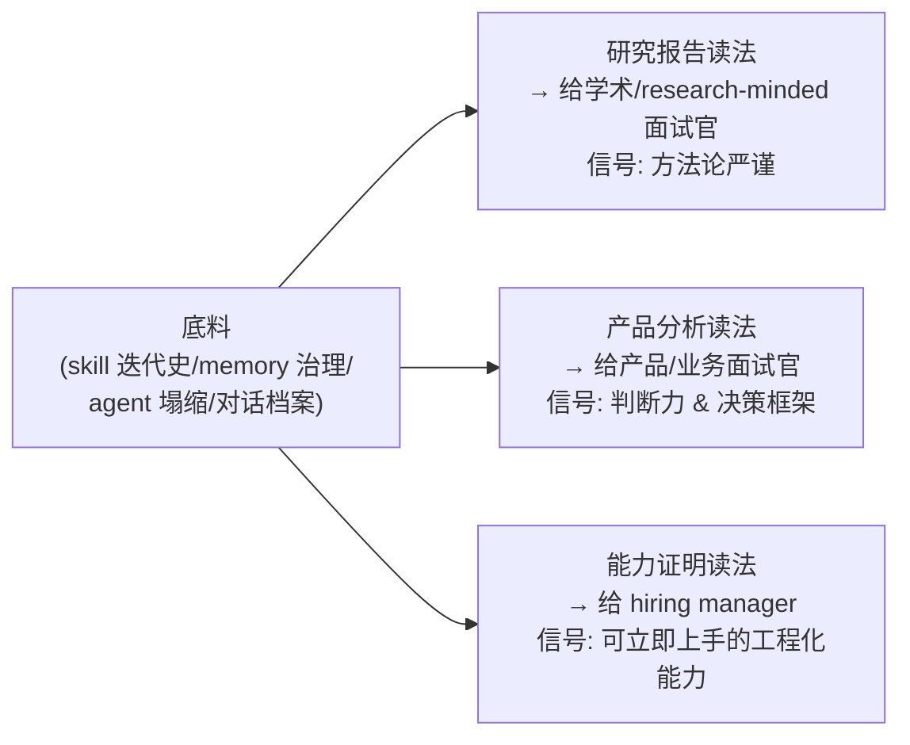

# R03 把自我民族志写成作品集材料

> 问题：一份"深度 AI 用户行为模型"的自我民族志，能不能同时是研究报告、产品分析、和能力证明——一份让招聘方在 30 秒内分辨出"这个人不是又一个会用 ChatGPT 的 PM，而是一个能把自己的 AI 协作工程化并反思的 AI PM"的求职信号？本节点给出一个可复用的结构模板，并用**信号理论（signaling theory）**论证：在一个所有候选人都声称"我会用 AI"的劳动力市场里，自我民族志是 Rick 几乎无法被模仿的**链信号（costly chained signal）**。这不是"写一篇博客炫技",而是把 R01/R02 的方法论产物折叠成一份成本极高、因而极难伪造的能力凭证。

## §0 为什么是"信号理论"框架，而不是"作品集最佳实践"框架

第一直觉会把这件事归到"如何写一份好的 PM 作品集"——讲故事、配数据、突出 impact。但那个框架解释不了一个核心异常：**为什么 2026 年市面上充斥着 AI 作品集，招聘方却越来越不信它们**。原因是生成式 AI 把"产出漂亮作品集"的成本压到了近乎为零——任何人都能让 Claude 写出一份 STAR 结构、配 mermaid 图、引 von Hippel 的求职材料。当一个信号的伪造成本趋近于零，它就**停止传递信息**（这是 Spence 1973 市场信号模型的直接推论：只有当信号成本与候选人质量负相关时，信号才可分离 separating equilibrium）。

所以正确的框架不是"作品集写作学",而是 Michael Spence 的**信号理论**（Spence, M. *Job Market Signaling*, Quarterly Journal of Economics, 1973，他凭此获 2001 年诺贝尔经济学奖〔已核实〕）。它问的是一个更尖锐的问题：**这份材料里有哪一部分是别人模仿不了的？** 信号理论的核心是 single-crossing / costly-to-fake 条件——能区分高低能力者的，不是信号本身漂不漂亮，而是低能力者**复制这个信号的代价是否高到不划算**。

把这个框架套到自我民族志上，立刻得到一个反共识的判断：

> [!note] 判断主轴（核心赌注）
> 自我民族志作品集的价值，**不在于它记录的内容（"我设计了 5 个 skill"），而在于它本身是一个 18 个月、跨数百次对话、不可回溯伪造的行为档案的副产品**。内容可以编，**档案不能**。Rick 的 vault 里有时间戳连续的 skill 迭代史、memory 治理转型记录、12→5 agent 的塌缩决策痕迹——这是一条**链信号**：每一环都依赖前一环真实发生过，整条链的伪造成本随长度指数上升。这正是它作为求职信号的不可替代性来源。

这一节挡掉的默认错误框架是："作品集 = 包装"。在 AI 把包装成本归零的市场里，**包装是负信号**（它暗示你只有包装）；真正的信号是包装背后那条无法伪造的链。

## §1 信号的可信度阶梯：从"声明"到"链信号"

把求职材料按"伪造成本"排序，得到一个四级阶梯。AI 把前两级的成本打穿了，只剩后两级还在传递信息。

| 级别 | 形态 | 2026 年伪造成本 | 是否仍传递信息 |
|---|---|---|---|
| L0 声明 | "我精通 AI 工具 / Prompt Engineering" | ≈0（一句话） | 否，已成噪声 |
| L1 即时产出 | 一份 AI 生成的漂亮作品集 / 一个 demo | ≈0（让 AI 写） | 否，且暗示只会包装 |
| L2 可验证产物 | 开源的 skill / agent 代码、可运行系统 | 中（要真的会做） | 是，但可被外包/抄袭 |
| **L3 链信号** | **时间戳连续的行为档案 + 元层反思** | **极高（要 18 个月真实发生）** | **是，且几乎不可伪造** |

Rick 的底料天然落在 L3：`99Archive/9910 claude 对话存档/` 有 20260305 到 20260423 跨度的连续对话，[AI 记忆过拟合与泛化能力](/kb/基础知识库/ai-记忆过拟合与泛化能力/) 记录了用 ML 术语对 AI 做元层干预的两轮诊断，[Claude routines 调研与 memory allowlist 设计](/kb/产品/claude-routines-调研与-memory-allowlist-设计/) 记录了 blocklist→allowlist 的认知转型并**反向删除旧记忆条目**。一个想伪造 L3 的人，需要回到过去真的经历这一切——这就是链信号的"costly-to-fake"在起作用。

> [!note] 边界（我的判断在哪失效）
> 链信号的不可伪造性**依赖招聘方能验证链的真实性**。如果招聘方只看到最终的 PDF 作品集、看不到底层档案，L3 就坍缩回 L1（无法分辨真伪）。所以本节点的赌注是：**作品集必须给出"可审计的钩子"**——让感兴趣的面试官能下钻到原始档案（脱敏后的对话片段、commit 时间线、迭代 diff）。没有这个钩子，再真的链信号也传不出去。

## §2 同一份底料的三重折叠：研究报告 / 产品分析 / 能力证明

brief 要求"同时是研究报告、产品分析、能力证明"。这不是写三份文档，而是对**同一份底料**做三种"读法折叠"，因为三类读者要的信号不同：



| 折叠 | 主问题 | 调用的 R 节点方法 | 信号给谁 | Rick 底料中的支点 |
|---|---|---|---|---|
| 研究报告 | "一个极端 power user 的 AI 行为有何可迁移的模式？" | R01 数据采集纪律、R02 编码/分析 | research/AI lab、需要方法严谨的岗 | grounded theory 式从对话档案归纳的模式；显式区分可观察事实 vs 待补内省 |
| 产品分析 | "这些模式对设计 AI 产品意味着什么？" | 判断主轴提炼、决策表 | AI 产品岗、PM | 12→5 agent 塌缩的 A/B/C/D 判别框架；CLAUDE.md 写权限沙盒（产品级护栏设计） |
| 能力证明 | "雇我，我明天就能搭这套协作流水线" | 可复现模板、工程产物 | hiring manager | trip skill 套件 + intellectual-lens 的完整 prompt 工程迭代记录 |

关键不是写三遍，而是**一份主文档 + 三个入口（reading paths）**——这正好复用本专题 README 的"多路径入口"设计，把作品集本身做成一个微型 PKM。

## §3 结构模板（可直接套用）

下面是 brief 要求的"结构模板"。它刻意做成**倒金字塔 + 可下钻**：前 30 秒给信号，后面给可审计的证据链。

```
┌─ 0. 信号锚点（一屏，≤150 字）
│    一句话定位 + 一个反共识判断 + 一个可验证数字
│    例: "我用 18 个月把自己作为唯一被试,做了一场 AI 协作的自我民族志:
│         设计并迭代 6 个 skill、主动把 12-agent 架构塌缩到 5、
│         所有产物经三步沙盒 ingestion。下面是可审计的档案。"
│
├─ 1. 研究设计（研究报告折叠）
│    研究对象=我自己(N=1 极端 power user) | 方法=autoethnography(分析式,见 §4)
│    数据源=连续对话档案+vault 结构+本专题工厂 meta-case
│    诚实声明: 可观察 vs 内省待补 的边界(这本身是信号——见 §4)
│
├─ 2. 行为模型（研究报告 × 产品分析）
│    3-5 条可迁移的行为模式,每条:症状→机制→产品启示→档案钩子
│    例: "把 AI 工具当 procedural knowledge 来工程化封装" → [Skill 系统的本质](/kb/ai-协作方法论/skill-系统的本质/)
│
├─ 3. 三个深度案例（能力证明的主体）
│    每案例套: 触发→我的干预→AI 反应→收敛→可复现产物
│    case A: 过拟合诊断(ML 术语做元层 prompt)
│    case B: memory allowlist 转型(认知框架切换 + 反向修订)
│    case C: 12→5 agent 塌缩(对自己的 AI 系统做 over-design 检验)
│
├─ 4. 可复现资产（能力证明的"明天就能上手"）
│    skill 代码/CLAUDE.md 协作规约/agent 编排图 — 带 L3 钩子(时间线/diff)
│
└─ 5. 元层反思（认识论自觉,最高级信号)
     这个研究的局限/我可能错在哪/N=1 不等于普遍规律
```

> [!note] 模板使用纪律
> 每个 case 的"档案钩子"是 L3 信号的载体——必须是**可指向真实文件/时间戳**的，不是"我曾经做过 X"的口头声明。没有钩子的 case 降级为 L1。

## §4 判断主轴：把自我民族志写成作品集时,90% 的人会搞错的四个点

这一节是本节点的命门。从"自我民族志"到"求职作品集"的转换，有四个高频翻车点：

**错点一：把"唤起式"当默认体裁，结果写成情感独白。**
- 症状：通篇"我感到 AI 让我既兴奋又焦虑"，读者共情了但拿不到任何可迁移判断。
- 为什么会错：自我民族志的奠基流派是 Carolyn Ellis & Arthur Bochner 的**唤起式（evocative）**（Ellis & Bochner, 2000，*Handbook of Qualitative Research* 2nd ed.〔已核实〕），它优先触发情感共鸣、以 verisimilitude（栩栩如生）为效度标准。求职场景误用它就会变成"自我感动"。
- 正确做法：求职作品集应走 **Leon Anderson 的分析式自我民族志（analytic autoethnography）**（Anderson, L. 2006, *Journal of Contemporary Ethnography*, 35(4): 373-395, DOI 10.1177/0891241605280449〔已核实〕）。它的五特征恰好就是好作品集的骨架：① Complete Member Researcher（你是被研究群体的完整成员——Rick 就是那个极端 power user 本人）② analytic reflexivity ③ narrative visibility ④ dialogue with informants ⑤ **theoretical commitment**（发展可迁移的理论理解，而非个人故事）。第⑤条正是把"日记"升级为"研究报告"的关键。
- 真实反例：Delamont（加的夫大学）正是以"navel-gazing（自我沉溺）、缺乏学术严谨"批评纯唤起式自我民族志〔已核实〕。一份招聘作品集若读起来像 navel-gazing，等于自证只会自我感动、不会做分析。

**错点二：为了显得 impressive 而编造内省数据。**
- 症状："我在 review AI 的 diff 时，会本能地感到第 3 行不对劲"——听起来很专家，但 Rick 从没记录过这种感受。
- 为什么会错：求职压力会诱导把"可观察的产物"和"想象的心理过程"缝合成一个流畅故事。但这恰恰摧毁了 L3 信号——一旦面试官追问下钻、发现内省部分无档案支撑，整条链的可信度坍塌（信任校准文献的对称提示：过度自信的声明会触发 overtrust 后的反弹，参 Lee & See 2004 信任校准模型〔已核实〕）。
- 正确做法：**严格区分可观察事实与内省待补**，并把这种区分**显式写进作品集**作为方法论诚实的展示。可观察的（skill 迭代史、agent 塌缩决策、对话时间线）如实分析；需要内省的（"我在评级 S 级与 C 级对话时的内部标准"），留结构化模板：

  > 〔Rick 待填：你的实际观察〕
  > 引导问题：14 条 S 级与 182 条 C 级对话之间，你评级时的价值判断依据是什么？哪几次评级你犹豫过、边界模糊？

  这不是缺陷，是 analytic reflexivity 的正确操作——把研究者的主体性当作**知识来源**而非偏差来源，同时不越界编造。一份显式标注"这里需要被试本人补充"的作品集，比一份处处流畅自信的作品集**信号更强**：它证明作者懂得区分证据等级。

**错点三：用"我"的故事掩盖"informant dialogue"的缺失。**
- 症状：整份材料只有 Rick 的独白，没有任何"AI 这一侧"或"协作对象"的声音。
- 为什么会错：Anderson 五特征第④条要求 dialogue with informants——纯自我独白会退回唤起式的封闭性。而 Rick 的研究里有一个天然的"informant"：**AI 本身**，以及**本次专题工厂这个多 agent 系统**。
- 正确做法：把 AI 的反应、agent 编排的运作当作 informant 的"对话方"纳入分析。例如 case A 里"AI 第一轮矫正方向对但平均化了，Rick 第二轮要求保留高水平审美基底"——AI 的反应是真实数据点，构成 dialogue。**本次专题工厂（0412-0423 这套正在运行的多 agent 知识生产）本身就是一个可观察的 meta-case**：它是 Rick 设计的 AI 协作系统在真实任务上的运行剖面，写进作品集就同时是"被研究的现象"和"informant 的声音"。

**错点四：把 N=1 的个案吹成普遍规律。**
- 症状："深度 AI 用户都会经历从 blocklist 到 allowlist 的转型"——把一个人的轨迹普遍化。
- 为什么会错：自我民族志的效度软肋正是可推广性（Walford、Delamont 的批评核心〔已核实〕）。把 N=1 吹成规律，会被任何有研究素养的面试官一击即溃。
- 正确做法：用 Laurel Richardson 的 **crystallization（水晶化）** 效度隐喻〔已核实〕替代"代表性"——研究如水晶，有无穷折射维度，价值在于**深度与多棱角**而非样本代表性。明确写："这是一个极端 power user 的深度个案，目的是揭示**可能的**行为模式与设计启示，供产品决策做假设来源，而非统计推断。" 把局限前置，反而是认识论自觉的信号。

## §5 产品 PM 视角补盲：作品集是一个"产品",招聘方是"用户"

跳出"研究/写作"视角，把作品集当一个**有用户、有转化漏斗、有合规边界的产品**：

- **用户心理模型**：招聘方的真实痛点不是"找不到会用 AI 的人"，而是"分不清谁真会、谁在表演"（逆向选择 adverse selection，Akerlof 柠檬市场〔Akerlof 1970 The Market for Lemons，已核实为经典文献〕）。你的作品集要解决的是**他们的甄别成本**，不是展示你有多努力。L3 链信号正是降低对方甄别成本的产品功能。
- **转化漏斗**：30 秒信号锚点（§3 第 0 段）= 落地页 hero；三重折叠 = 分人群的 landing path；档案钩子 = 让"高意向用户"深度转化的 CTA。多数 PM 作品集只有 hero 没有漏斗。
- **合规边界（关键，且是 Rick 的真实约束）**：Rick 的底料含 DiDi/99 内部材料。自我民族志的**关系伦理（relational ethics）**（Ellis, Adams & Bochner 2011〔已核实〕）要求：叙述自身经历时必然暴露他者/组织信息，发表前须处理"关系性关切"。落到作品集就是硬约束——**展示协作方法论，绝不泄露任何 DiDi 业务内容/截图/数据**。本专题工厂的可观察运作、个人 vault 的 skill 设计是安全素材；任何工作内部信息必须脱敏或排除。这一条不是建议，是一票否决项。
- **GTM**：同一份底料的三重折叠对应不同渠道——研究报告折叠投 research/AI lab，产品分析折叠投 AI 产品岗，能力证明折叠放 GitHub/个人站做长尾入站。不要一份材料打所有渠道。

## §6 对手框架回应：自我民族志根本不该用于求职?

**业界反方立场（接受 + 边界）：**

- **反方一（学术内部）：Delamont 的 "navel-gazing" 批评。** 接受其对的部分——纯唤起式、无分析、无理论承诺的自我叙事确实是自我沉溺，放进求职材料是灾难。**边界**：本节点主张的是 Anderson 的**分析式**路径 + theoretical commitment，正是为了规避这一批评；且求职场景的"效度"标准本就不是学术可推广性，而是"能否让招聘方甄别能力"——用 Spence 信号理论而非学术效度评判，是另一个评价坐标系。
- **反方二（招聘实践）："作品集已死,招聘只看 work sample test / 实战题"。** 这是 Laszlo Bock 在《Work Rules!》中代表的实证招聘观——结构化实战测试的预测效度高于简历/作品集〔Bock 2015,Google 招聘负责人,已核实为公开立场〕。接受其对的部分——空洞作品集确实预测力差，这正是 §1 说 L0/L1 已死的同源逻辑。**边界**：L3 链信号本质上**就是一种 work sample**——它不是"声称我能做"，而是"这是我过去 18 个月真做过的、带时间戳的工作样本"。它把 work sample 从"面试现场的一道题"扩展为"一段不可伪造的工作史"，与实证招聘观不矛盾，是其延伸。
- **反方三（AI 时代特有）："AI 让人人都能产出深度内容,深度不再是信号"。** 接受——内容深度确实贬值了（AI 能写出引 von Hippel、Anderson 的漂亮分析）。**边界**：贬值的是**内容**，不是**产生内容的真实过程档案**。AI 能模仿一篇分析式自我民族志的文体，但模仿不了 20260305→20260423 那条真实发生的迭代链。信号从"内容"上移到了"档案"——这恰恰强化而非削弱了 L3 的价值。

**Rick 未读的对手框架引入（破 echo chamber）：**

- **Erving Goffman《日常生活中的自我呈现》(The Presentation of Self in Everyday Life, 1959)〔已核实为社会学经典〕。** Goffman 的拟剧论（dramaturgy）逼问一个尖锐盲点：**任何"自我民族志作品集"本质都是一场 impression management（印象管理）的舞台表演**——前台（作品集展示的"反思的 AI PM"）与后台（实际工作中的混乱）必然有落差。这击中本节点的赌注：我主张 L3 不可伪造，但 Goffman 提醒——**呈现本身就是表演**，"诚实地标注待填项"也可能是一种更高级的印象管理策略。回应：承认这一张力无法消除，但 L3 的时间戳档案把"后台"部分变得可审计，缩小了前台/后台落差的造假空间——这是 Goffman 框架下能做到的最优,而非取消表演性。
- **信号理论的"烧钱信号"反例（Zahavi 累赘原理 handicap principle,生物学〔Zahavi 1975,已核实〕）。** 它提醒：有效信号往往要求**真实的、不可挽回的代价**。这逼问 Rick——你的自我民族志付出了什么不可挽回的代价？如果只是"花周末写了篇文档"，代价不够高，信号不够强。回应：真正的代价不在写作品集那一刻，而在前置的 18 个月——真去设计 skill、真去把 12-agent 塌缩、真去做三步沙盒 ingestion——这些是沉没的、不可挽回的投入。作品集只是把这笔已付的"累赘成本"显化出来。

## §7 跨域呼应：默会知识为什么必须用"展示"而非"陈述"来传递

调度 [Polanyi 默会知识与提示工程的认识论张力](/kb/基础知识库/polanyi-默会知识与提示工程的认识论张力/) 这一节点的核心张力到本节点的写作方法上。

Polanyi 的命题是"我们知道的比我们能说出来的多"（we know more than we can tell）——一个极端 power user 的 AI 协作能力，大量是**默会的**：何时该挑战 AI 的 over-design、何时该用 ML 术语做元层干预、何时该信任 AI 的判断而何时拦截。这些 know-how 无法被穷尽地**陈述**成一份"能力清单"（任何陈述都丢失了默会维度）。

这直接决定了作品集的写法：**默会知识只能通过"展示行动序列"来间接传递，不能靠"陈述结论"。** 所以 §3 模板的每个 case 必须是"触发→干预→AI 反应→收敛"的完整行动序列，而不是"我具备 X 能力"的清单。读者从行动序列中**默会地推断**出能力，正如学徒从师傅的操作中习得手艺（Polanyi 的师徒传承隐喻）。这把"判断主轴错点一"（别写成情感独白）和这里接上了：分析式自我民族志展示的是**带分析的行动序列**——既有 know-how 的展示（默会维度），又有 theoretical commitment 的提炼（可陈述维度），两者缺一不可。

> [!note] 跨域呼应的具体落地
> 它改变的技术判断是：作品集**不应该有"技能清单"那一节**（陈述默会知识=信息丢失+变成 L0 声明）。取而代之的是"行动序列档案 + 事后分析"。这是 Polanyi 框架对作品集结构的直接干预，不是装饰性引用。

## §8 PM 决策启示：面试 / 选型 / 复现三类落地

- **面试怎么用**：把 §3 的"信号锚点"练成 30 秒口头版本——一句定位 + 一个反共识判断 + 一个可验证数字（"我把自己 12 个 AI agent 主动塌缩到 5 个,判别框架是……"）。面试官追问时，下钻到对应 case 的行动序列（默会知识的展示），最后用 §4 错点二的"可观察 vs 待补"诚实区分收尾——这串组合拳本身就是 analytic reflexivity 的现场演示。
- **选型怎么用**：这套"L0-L3 信号阶梯"可反向用于**评估你要招的人 / 你要选的 AI 协作工具供应商**——别看 demo（L1），要看可审计的运行档案（L3）。同一逻辑迁移到供应商选型。
- **复现怎么用**：任何想做 AI 自我民族志作品集的人，按 §3 模板 + §4 四错点检查清单执行即可。最低门槛：先有 R01 的连续档案，否则没有 L3 的料，作品集只能停在 L1。

## §9 与已有节点的关系

- 对照 [Skill 系统的本质](/kb/ai-协作方法论/skill-系统的本质/)：该节点讲"skill 是什么"（概念），本节点做**深化与用途转换**——把 skill 设计史当作求职信号的素材来源，回答"它能为我的职业资本做什么"，不复述 skill 的本体论。
- 对照 [AI 记忆过拟合与泛化能力](/kb/基础知识库/ai-记忆过拟合与泛化能力/) 与 [Claude routines 调研与 memory allowlist 设计](/kb/产品/claude-routines-调研与-memory-allowlist-设计/)：这两个是本节点 case A/case B 的**一手档案源**，本节点不复述其内容，只把它们重新读作"L3 链信号的环"。
- 对照 0418 审阅瓶颈专题：**Rick 的审阅行为（SABCD 评级、三步 ingestion 把关）是 0418 的一手数据**。本节点的关系是**互补**——0418 研究"审阅作为瓶颈"的现象，本节点把同一审阅行为重新折叠为"可写进作品集的能力证明"（审阅纪律 = 质量护栏设计能力的信号）。
- 对照 [AI PM 知识图谱框架设计](/kb/产品/ai-pm-知识图谱框架设计/)：那是 case 素材之一（PM 式框架操控行为）；本节点把它读作"产品分析折叠"的支点。

### 显式升级对照（专题要求）

- **vs 0414（Claude Code 体感）**：0414 记录"用 Claude Code 的主观体感"。本节点升级为——体感是 L1 级私人经验，要变成 L3 求职信号，必须配上时间戳档案与 analytic reflexivity。即：**体感 → 可审计的行为档案**的认识论升级。
- **vs 0418（审阅瓶颈）**：0418 把审阅视为待优化的瓶颈（负向）。本节点做**视角翻转**：同一审阅行为，在作品集语境里是**正向能力信号**（懂得设质量门、区分 S/C 级）。瓶颈与资产是同一行为的两种读法。
- **vs 0422（民族志方法）**：0422 是方法本体（怎么做民族志）。本节点是其**下游应用**——方法产物如何转化为职业资本。0422 提供"怎么观察",本节点提供"观察完怎么变现为信号"。
- **vs [Skill 系统的本质](/kb/ai-协作方法论/skill-系统的本质/)**：从"本体论（是什么）"升级到"职业经济学（作为信号值多少）"——抽象层从技术上移到劳动力市场。
- **vs [Polanyi 默会知识与提示工程的认识论张力](/kb/基础知识库/polanyi-默会知识与提示工程的认识论张力/)**：那里 Polanyi 用于解释"提示工程为何难以言传"。本节点把同一张力**应用为写作约束**——默会知识决定了作品集必须"展示行动序列而非陈述清单"。从认识论描述升级为方法论处方。

## §10 关联节点

**核心（必读）**
- [Skill 系统的本质](/kb/ai-协作方法论/skill-系统的本质/)
- [Polanyi 默会知识与提示工程的认识论张力](/kb/基础知识库/polanyi-默会知识与提示工程的认识论张力/)
- [AI 记忆过拟合与泛化能力](/kb/基础知识库/ai-记忆过拟合与泛化能力/)
- [Claude routines 调研与 memory allowlist 设计](/kb/产品/claude-routines-调研与-memory-allowlist-设计/)
- [AI PM 知识图谱框架设计](/kb/产品/ai-pm-知识图谱框架设计/)
- [旅行规划 Skill 套件系统设计](/kb/产品/旅行规划-skill-套件系统设计/)
- [trip-structure skill](/kb/工具/trip-structure-skill/)

**延伸（可选）**
- [Claude Code](/kb/ai-公司与产品/claude-code/)
- [Agent](/kb/基础知识库/agent/)
- [AI PM 知识图谱·总索引](/kb/ai-pm-知识图谱/ai-pm-知识图谱-总索引/)
- 人类学
- 民族志
- 0117社会学
- 0114认识论

## §11 修订日志

- R1（2026-06-07）：首稿。确立信号理论（Spence）为判断主轴，建立 L0-L3 信号阶梯、三重折叠、§3 结构模板、§4 四错点四件套；接入 Delamont / Bock / AI 内容贬值三类对手立场 + Goffman 拟剧论 / Zahavi 累赘原理两个 echo-chamber-破除框架；以 Polanyi 默会知识做跨域呼应并落地为写作处方；与 0414/0418/0422 及核心节点建立显式升级对照。内省类数据一律留 〔Rick 待填〕 模板，未编造 Rick 的感受/决策。
- 〔R2 待批评 Agent issue 单后修订〕
