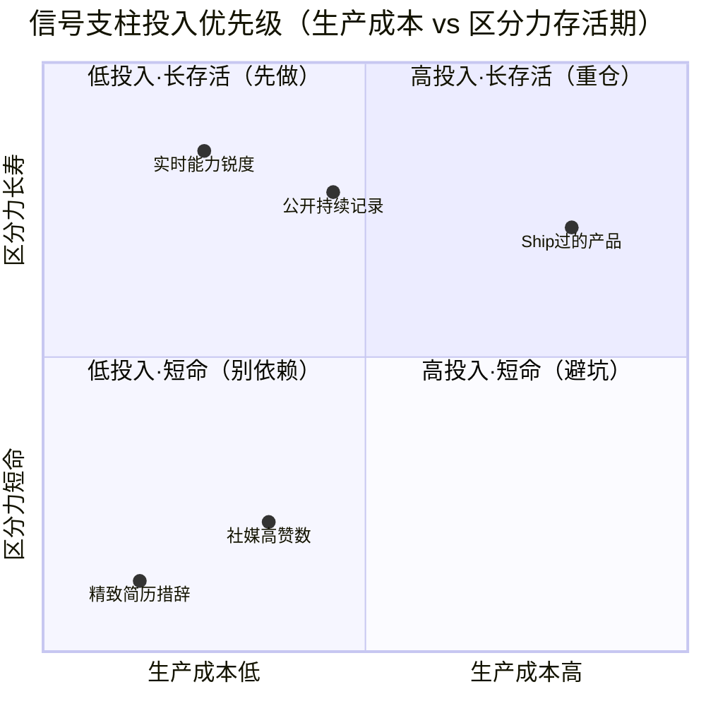

# R03 构建个人 AI-proof 求职信号组合

**本节点要解决的问题**：当 LLM 把"一封精心撰写的求职信""一份措辞精致的简历"的边际生产成本压到趋近于零，Spence 分离均衡赖以成立的"成本差异"（高能力者发信号更便宜）就被抹平——传统书面求职信号正在**信息含量坍缩**。本节点不是又一篇"如何写简历"的攻略，而是用信号理论给转型者（具体到 Rick 自己）一套**可执行的信号组合配置框架**：哪些信号 AI 还伪造不了、为什么伪造不了、怎么把它们生产出来、怎么在面试桌上翻译成对方听得懂的话。视角是经济学 + PM + 求职三合一，框架名是**"内生性成本信号组合"（endogenous costly-signal portfolio）**。

---

## §0 为什么是"信号组合"，而不是"找一个 AI 杀不死的杀手锏"

转型者最容易掉进的第一个错误框架，是去找**单一的、AI 永远伪造不了的"银弹信号"**——"是不是只要有个 GitHub 绿墙就稳了""是不是考个证就 AI-proof 了"。这个框架错在两个层面。

第一，**没有任何单一信号能长期免疫**。本专题在 [E02 内容平台与学术评审信号坍缩剖解](/kb/专题-人文社科透镜/e02-内容平台与学术评审信号坍缩剖解/)（产品侧"内容即信号"集体坍缩）里反复论证的核心机制是：任何被广泛采用、又被证明有效的信号，都会触发军备竞赛，被低能力者用 AI 模仿到稀释——这正是 Caplan《The Case Against Education》（Princeton University Press, 2018）描述的凭证军备竞赛在 AI 时代的加速版。今天的"GitHub 绿墙"早在 AI 之前就有人靠 paid contributions、刷 star 注水（Ben Wu, a16z crypto, "Proof of Talent", 2026 明确指出这一点）。指望单点，等于把全部赌注押在一个迟早会坍缩的均衡上。

第二，**真正抗伪造的不是某个信号的"种类"，而是信号之间的"交叉验证结构"**。这是本节点最反共识的判断：**AI-proof 性来自组合的不可同时伪造性，而非单点的不可伪造性。** 一个 AI 可以伪造一份漂亮的作品集 README；可以伪造若干条社媒高赞；甚至可以代写一篇看似深刻的长文。但要让这四类信号**在时间轴上彼此印证、在现场追问下不穿帮、在第三方时间戳上对得上**——这件事 AI 还做不到，因为它需要的是真实的时间连续性、真实的上下文记忆、真实的现场认知。所以本节点交付的是**组合（portfolio）**，而不是清单里挑一项。

> [!note] 本节点的赌注（边界先行）
> 我赌的是：**未来 18–24 个月，单点信号的区分力会继续坍缩，而"多信号交叉验证"的成本曲线对真能力者依然友好、对模仿者依然陡峭。** 这个赌注会失效的场景见 §6 failure scenario：如果出现端到端的"AI 数字分身"能跨年度伪造连续的公开记录 + 实时对答，本框架的护城河会被填平。我赌它两年内做不到工业级，但这是赌注，不是定理。

---

## §1 四类信号的成本结构：为什么这四件、各自贵在哪

把"AI-proof 信号组合"拆成四个正交支柱，每个支柱对应一种 AI **当前无法低成本伪造**的成本来源。判断这四件值不值得投入，先看它们各自的"单交叉条件"（single-crossing condition）在 AI 时代是否仍然成立——即真能力者生产它的净成本是否仍低于模仿者。

| 信号支柱 | 成本来源（贵在哪） | AI 当前能否低成本伪造 | 单交叉条件在 AI 时代 |
|---|---|---|---|
| **① 作品集（Portfolio）** | 从 0 到 1 ship 一个真运转产品的时间 + 失败风险 | 能伪造"看起来像"的 README/截图，**不能**伪造真实运转 + 第三方时间戳 | 仍成立（真能力者已 ship，模仿者要补全运转证据成本极高） |
| **② 公开持续记录（Public Track Record）** | 跨年度的连续判断留痕 + 公开可被打脸的风险 | 能一次性生成单篇，**不能**回溯性制造数年连续迭代轨迹 | 强成立（时间不可逆是内生成本，AI 无时间机器） |
| **③ 实时能力（Real-Time Assessment）** | 现场无准备窗口下的认知锐度 + 即时追问应对 | **几乎不能**（HackerEarth 2026：大多数靠 ChatGPT 者两个问题内暴露） | 最强成立（信号生成窗口压缩到无法事先 prompt） |
| **④ Ship 证据（Shipped Evidence）** | 真实用户行为数据 + 上线后持续维护的证据链 | 不能伪造 App Store 审核时间戳、真实评分、changelog 连续性 | 成立（复合型外生第三方验证） |

这四件之所以"四件套"而非"挑一件"，正是因为它们**贵的方式互不相同**：①④贵在第三方时间戳（外生验证），②贵在时间连续性（内生成本），③贵在现场窗口（无准备成本）。一个模仿者要同时跨过这三种不同性质的成本墙，付出的总成本远超真能力者——这才是组合的护城河。

**经济学接地**：这正是 Spence(1973, *QJE* 87(3):355–374) 分离均衡的核心条件 $c_H(e) < c_L(e)$ 在 AI 时代的重写——AI 抹平的是"书面表达"这一维度上的 $c_H$ 与 $c_L$ 差距（Galdin & Silbert, 2025, "Making Talk Cheap: Generative AI and Labor Market Signaling", arXiv:2511.08785，已核实，证明 LLM 引入后定制求职信溢价消失，顶部五分位录用率下降 19%），但它**没有抹平**作品 ship、时间连续性、现场认知这三个维度上的成本差。组合的设计，就是把信号从被抹平的维度迁移到尚未被抹平的维度。

---

## §2 配置框架：四象限投入矩阵（转型者怎么排优先级）

不是四件平均用力。转型者（尤其 Rick 这种带薪 gap、时间有限的状态）要按"**生产成本 × 区分力存活期**"排序。

**读法（决策启示）**：
- **左上"先做"**：实时能力锐度——边际生产成本最低（不需要额外造东西，是把已有能力变成现场可展示形态），区分力最长寿。转型者第一周就该练。
- **右上"重仓"**：Ship 过的产品——生产成本最高（要真的从 0 ship），但一旦 ship 成，区分力最持久。这是转型者的**主轴投入**。
- **左下/右下"别依赖/避坑"**：精致简历措辞、纯社媒高赞——已被 AI 抹平或本就易刷，不能作为主信号（但简历仍是**入场券**，见 §4 致命错位）。

这张图与 [p306 - 数据飞轮与反馈回路设计](/kb/产品设计与交互范式/p306-数据飞轮与反馈回路设计/) 形成显式升级对照：p306 讲的是**产品侧**如何用反馈回路把用户行为沉淀成护城河；本节点把同一个"飞轮"逻辑搬到**个人侧**——你的公开记录 + ship 证据就是你个人的数据飞轮，每多一次公开判断、每多一个上线版本，都在加厚护城河。区别在于 p306 的飞轮转的是产品数据，R03 的飞轮转的是**你自己作为信号发送方的内生成本积累**。（不复述 p306 的飞轮机制本身。）

---

## §3 转译话术：把"内生成本"翻译成面试官听得懂的话

信号生产出来还不够——信号理论里，信号必须**可被接收方观测和解读**才有效。转型者最大的浪费，是花了几个月 ship 了东西，却在面试桌上把它讲成了"我做了个小项目"。这一节给四类信号各一句**对话级转译模板**，把"成本"翻译成"能力归因"。

| 信号 | 错误讲法（信号丢失） | 正确转译（成本→能力归因） |
|---|---|---|
| 作品集 | "我做了个博物馆导览 App" | "我从 0 ship 了它，54 个测试全绿、三套机制（记忆/Agent/主动引导）；这里有 App 的真实上线时间戳和 changelog——重点不是它多炫，而是我独立扛完了从场景反推能力到上线的全链路" |
| 公开记录 | "我写了很多笔记" | "我有一个持续两年的公开知识库，你能看到我对同一个概念在不同时间点的判断怎么演化、哪些早期判断我后来自己打了脸——这是 AI 代写不出来的连续判断轨迹" |
| 实时能力 | （被动等对方出题） | "我现在就可以拆这个产品/这道题给你看，边拆边讲我为什么排除掉其他方案"——主动把现场认知摆上桌 |
| Ship 证据 | "用户反馈还不错" | "上线后我处理了 X 类真实反馈，这是迭代记录；产品的存活本身就是第三方在替我背书" |

**判断主轴贯穿这一节**：转译的本质是**把信号从"成果展示"重构为"成本归因"**。面试官在做的事和雇主在 Spence 模型里做的事一模一样——他无法直接观测你的真实生产率，只能从信号反推。你的工作就是让信号的"成本结构"显形，让对方算得出"这件事低能力者做不出来"。

---

## §4 判断主轴：90% 转型者在信号组合上会搞错的 4 个点

这一节是本节点的命门。每点四件套：症状 → 为什么会错 → 正确做法 → 真实反例。

### 错位 1：把"入场券信号"当成"区分信号"

- **症状**：把大量时间砸在打磨简历措辞、优化 LinkedIn 关键词上，以为简历越精致越能脱颖而出。
- **为什么会错**：简历在 AI 时代已从"区分信号"退化为"过滤门槛"——它能让你不被刷掉（入场券），但不能让你被选中（区分力已坍缩）。Cui, Dias & Ye(2025, "Signaling in the Age of AI: Evidence from Cover Letters", arXiv:2509.25054，已核实) 证明 AI 求职信工具引入后求职信信息含量下降、雇主转而依赖**既往工作记录**（51% 这一具体降幅〔待核实，来自二手简报〕）。把弹药打在已坍缩的维度上，是把信号投到了 $c_H = c_L$ 的地方。
- **正确做法**：简历做到"不被过滤"即止（≈20% 精力），把 80% 精力投到作品集 + 公开记录这些雇主**正在迁移过去**的替代信号上。
- **真实反例**：一个候选人简历改了十七版、措辞无可挑剔，但点开作品集链接是空的、GitHub 三个月没动——面试官三分钟内判定"会包装、无产出"。措辞的精致反而成了反信号。

### 错位 2：把"一次性产出"误当"连续记录"

- **症状**：临求职前突击产出——一周建个知识库、三天刷个绿墙、面试前一晚发条深度长文。
- **为什么会错**：这恰恰把信号投到了 AI **能**低成本伪造的维度（单点产出），而放弃了 AI 伪造不了的维度（时间连续性）。突击产出和 AI 代写在接收方眼里**无法区分**——都是"无历史的孤立产出"。Wang(2025, "Hope, Signals, and Silicon", arXiv:2511.00068，已核实) 称这种现象为学术市场的"effort laundering（努力洗白）"：传统精细化输出失去信号价值，因为无法证明它来自持续投入而非临时拼凑。
- **正确做法**：尽早开始、持续留痕。哪怕每篇质量一般，**连续两年的判断演化轨迹**本身就是 AI 造不出的信号。重点是"可见的连续性"，不是"单篇的完美"。
- **真实反例**：两个候选人都提交了知识库。A 的所有文件创建时间集中在求职前两周；B 的能看到跨越两年、含早期拙劣版本和后来自我修订的迭代轨迹。B 的"早期拙劣"反而是真实性证据——A 看起来更"干净"，却因此更可疑。

### 错位 3：用"作品集的存在"代替"作品集的可追问性"

- **症状**：以为只要作品集链接能点开、能跑起来就够了。
- **为什么会错**：作品集的信号强度不在"它存在"，而在"你能在现场被追问到设计决策的最深一层而不穿帮"。AI 能生成代码和文档，但**无法替你在现场解释设计决策背后的权衡推理**（这需要真实的上下文理解）。HackerEarth(2026) 的实践：10 分钟现场追问，"大多数依赖 ChatGPT 的候选人两个问题内即暴露"。这正是支柱③（实时能力）和支柱①（作品集）的交叉验证点——作品集为现场追问提供素材，现场追问为作品集背书真实性。
- **正确做法**：为作品集的每个关键决策准备"为什么不选 X"的权衡叙事（呼应本专题宪章的产出承诺：30 秒说清"为什么我不选 X"）。把作品集当成现场追问的弹药库，而不是展示橱窗。
- **真实反例**：候选人提交了功能完整的 App，但被追问"为什么记忆机制用这套方案而不用 RAG"时答不出权衡——面试官立刻怀疑这是代做或 AI 生成。可追问性的缺失，让一个真存在的作品集失去了信号价值。

### 错位 4：信号之间互相矛盾（自毁组合）

- **症状**：简历写"精通 Multi-Agent 编排"，但作品集里没有任何 Agent 痕迹；公开记录里对 Agent 的判断和简历自述对不上。
- **为什么会错**：组合的护城河来自**交叉一致性**。一旦信号互相打架，接收方做的不是"取平均"，而是**整体折价**——因为矛盾本身暴露了至少一处在注水（柠檬市场逆向选择的微观版：一个假信号污染整个组合的可信度）。这与 Akerlof(1970) 柠檬市场的逻辑同构：信息劣势方一旦察觉一处造假，会把不确定性折价施加到**全部**信号上。
- **正确做法**：定期做"信号一致性审计"——简历每条强主张，都要在作品集或公开记录里找到对应的可追溯证据。说得出的，必须做得到、查得到。
- **真实反例**：候选人简历列了八项"精通"技能，作品集只覆盖其中两项——面试官的合理推断不是"他还有六项没展示"，而是"这八项里至少有六项是 AI 帮他堆的关键词"，连真有的两项也被连带打折。

---

## §5 产品 PM 视角补盲：信号组合不只是求职术，更是产品设计的镜像

跳出"求职 PM"视角，这一节补三个容易看走眼的点。

**① 用户心理模型：接收方的"AI 疲劳"是新变量。** 2024–25 年，64% 的招聘者察觉"千篇一律"的 AI 简历激增、筛选量反而上升（Resume Genius, 2025〔行业报告〕）。这意味着接收方的解读策略正在变化——他们对"看起来太完美"的信号天然警惕。这是反直觉的：**适度的粗糙、可追溯的失败痕迹，在 AI 时代反而成了真实性信号。** 产品类比：这就像内容平台上"过度精修"的图反而降低信任，UGC 的"真实感"成为新的信号维度。

**② 商业模式/合规边界：信号组合的"可验证性基础设施"。** 这一支柱正在被产品化——Microsoft + LinkedIn 的 VerifiedEmployee 凭证（Velocity Network Foundation 案例〔行业来源〕）、C2PA 内容溯源标准（2025 年 Adobe/YouTube/Google 开始采用）。对 Rick 这类要进 AI 产品团队的人，这本身是个**产品机会的观察窗口**：依赖内容质量做信号的产品（简历筛选、学术评审、内容平台）正面临信号坍缩，谁能重建可信信号基础设施，谁就吃下这波需求。求职信号和产品设计在这里合流——你在为自己造 AI-proof 信号的同时，也在亲身理解一个待解的产品问题。

**③ GTM 视角：信号要"投放"到接收方在的渠道。** 一个 ship 了产品却没人知道的转型者，等于信号生产了却没投放。要主动把信号摆到目标公司能看到的地方——这正是本专题"产品层 + 求职层双重价值"的落点：**你既是信号发送方（求职），又要像 PM 一样思考信号的分发（GTM）。**

---

## §6 对手框架回应（接受 + 边界，不是反驳）

**对手 1：Bryan Caplan 的极端信号论（《The Case Against Education》, 2018）。** Caplan 估计教育个人回报约 80% 来自信号、仅 20% 来自人力资本，并断言信号是零和军备竞赛、终将通胀失效。
- **接受**：他对的部分——任何被广泛采用的信号都会通胀，本节点的四支柱也不例外，今天的"作品集""绿墙"迟早被稀释。这正是 §0 我拒绝"银弹信号"的理由。
- **边界**：但 Caplan 的框架预测不了"组合的交叉验证"为什么能延缓通胀。零和军备竞赛针对的是**单维同质信号**（大家都去考同一张文凭）；而四支柱的成本来源**异质**（时间戳/连续性/现场窗口），模仿者无法用同一种作弊手段同时攻破。我赌的是：异质信号组合的通胀速度，慢于单维信号。

**对手 2：人力资本论（Gary Becker, 《Human Capital》, 1964）。** 反方会说：你这套"信号"是表演，真正重要的是你**实际**会不会做产品，能力本身才是根本。
- **接受**：完全对——如果信号背后没有真能力，组合迟早在现场追问（支柱③）穿帮。本节点从不主张"伪造信号"，恰恰相反，四支柱里 AI 伪造不了的部分，**正是因为它们要求真能力才能低成本产出**。
- **边界**：但 Becker 框架忽略了"信息不对称"这个无法回避的现实——你真有能力，不等于接收方能观测到。Huntington-Klein(2021, *Empirical Economics* 60(5):2499–2531) 的结论恰是：人力资本与信号在经验上**不可区分**。所以争论"是信号还是能力"是个伪问题——AI-proof 信号组合的设计目标，本就是让真能力**可被低成本观测**，它同时服务两派。

**对手 3（Rick 未读框架引入·破 echo chamber）：Steigenberger et al.(2025, *IJMR*) 的"欺骗性信号"理论。** 这一框架（Rick 的双链清单里没有，刻意引入逼问盲点）指出：AI 降低了欺骗性信号的发送成本，同时削弱了接收方识别虚假信号的能力。
- **它逼问本节点的盲点**：我一直假设"接收方能识别交叉验证"，但如果接收方自己被 AI 淹没、连辨别真假的认知带宽都没有了呢？那时再好的真信号也无人解读。这指向一个本框架不能独力解决的系统性风险——信号坍缩是**双向**的（发送端造假变易 + 接收端辨识变难）。

**对手 4（Rick 未读框架引入）：Luhmann 的系统信任理论。** Luhmann 区分"人际信任"与"系统信任"。本节点默认面试是人际信任场（现场追问可建立信任），但大规模招聘越来越依赖**系统信任**（AI 初筛、自动化测评）。在系统信任主导的环节，"现场追问"这个最强支柱根本没机会启动——你的真信号在见到人之前就被算法过滤了。这是本框架在"大厂海量初筛"场景下的真实边界。

> [!warning] failure scenario 显式标注
> 1. **端到端 AI 分身成熟**：若出现能跨年度伪造连续公开记录 + 实时对答的工业级"数字分身"，§1 的成本墙全线失守。
> 2. **系统信任主导的初筛**：在 AI 自动初筛环节，支柱③（现场能力）无法启动，本框架失效（Luhmann 边界）。
> 3. **接收方认知带宽崩溃**：若招聘方被 AI slop 淹没到放弃辨别（Steigenberger 边界），再真的信号也无人解读。
> 4. **目标行业本就不看这套**：传统行业/关系型招聘里，四支柱的边际回报可能低于一个内推——本框架假设的是"看真能力的 AI 原生团队"。

> [!note] confirmation-bias 砍除
> 本节点早期反复把"Rick 的博物馆导览 App"当正面案例引——这是 bias。补反例：一个**只有作品集、没有公开记录连续性、且现场答不出权衡**的候选人，作品集再完整也只是"四支柱缺三"的残缺组合。作品集是必要不充分，单押作品集同样会坍缩。

---

## §7 跨域呼应：Spence 信号理论 × Goodhart 定律

调度一个跨域思想资源并具体展开其作用：**Goodhart 定律**（"当一个指标成为目标，它就不再是好指标"）。

本节点的整个论证，本质是信号理论遭遇 Goodhart 定律的故事。Spence 的分离均衡假设信号成本对真能力者更低，因而信号可信。但**一旦信号被广泛当作"求职目标"去优化，AI 又把优化成本压到零，信号就被 Goodhart 化**——"写好求职信"从"能力的副产品"变成"被直接优化的指标"，于是它不再衡量能力。

这改变了本节点的核心判断：**AI-proof 信号的真正定义，是"难以被 Goodhart 化"的信号**——即"优化这个指标"和"提升真能力"无法解耦的信号。现场追问（支柱③）之所以最强，正因为你**没法绕过真能力直接优化它**：要现场答好权衡，唯一的路就是真懂。而简历措辞之所以坍缩，正因为它**可以脱离能力被直接优化**。这个跨域视角把四支柱的排序从"经验直觉"升级为"可推导的判据"：**抗 Goodhart 性 = AI-proof 性。**（链入 [c14 - 模型评估体系与 Goodhart 陷阱](/kb/基础知识库/c14-模型评估体系与-goodhart-陷阱/)，与其形成产品侧↔个人侧的对照：c14 讲模型评估指标被 Goodhart 化，R03 讲求职信号被 Goodhart 化，同构。）

---

## §8 PM 决策启示：面试 / 选型 / 复现三类落地

- **面试怎么用**：面试前做一次"信号一致性审计"（§4 错位 4），确保简历每条强主张在作品集/公开记录里有可追溯证据；面试中主动把作品集当"现场追问弹药库"（§3 转译模板）；用 §0 的"为什么不选 X"框架展示抗 Goodhart 的真判断。
- **选型怎么用**（给在岗 PM）：如果你的产品依赖 UGC 质量做信号（内容平台、评审、招聘工具），用 §6 的"信号坍缩双向风险"做风险评估——你的信号机制是否抗 Goodhart？接收方还有没有辨识带宽？
- **复现怎么用**（Rick 的可执行清单，本节点的独特资产落点）：见下方清单。

> [!tip] Rick 的 AI-proof 信号组合 · 可执行清单
> **支柱① 作品集**：[博物馆 AI 导览 APP](/kb/产品/博物馆-ai-导览-app/) 已 BUILD_COMPLETE（54 测试全绿、三机制）→ 行动：把上线时间戳、changelog、三个关键决策的"为什么不选 X"权衡叙事补全，转成现场追问弹药库。
> **支柱② 公开持续记录**：本知识库"Rick's Second Brain"本身就是 AI-proof 信号的活案例——跨两年、含早期版本与自我修订轨迹（如 [AI概念滥用反思](/kb/基础知识库/ai概念滥用反思/) R1→R2 的死链修订留痕）。行动：把 [AI PM 知识图谱·总索引](/kb/ai-pm-知识图谱/ai-pm-知识图谱-总索引/) 作为面试"你学了什么"的可追溯入口，重点展示**判断演化**而非笔记数量。
> **支柱③ 实时能力**：行动：用 字节 AI PM 面试模拟与方法论沉淀 + AI PM 岗位 JD 分析与面试问题反推 练"现场拆产品/拆题"，目标是任何 AI 产品都能现场拆给对方看（抗 Goodhart 的最强支柱）。
> **支柱④ Ship 证据**：行动：把我在出行平台完整工作履历里的真实业务数据（徽章覆盖 +14.0pp、不支付按额 -11.2%、补贴 burn -13.8%）作为"已 ship 过有指标产品"的第三方背书底座——这是 AI 完全伪造不了的、带组织背书的历史。
> **一致性审计**：用 Rick 写作 SABCD 评级体系 给本知识库做信号质量自评，确保对外强主张都有库内可追溯证据。

本知识库本身就是 Rick 最强的 AI-proof 信号：它同时满足时间连续性（两年）、可追问性（每个判断可被追问演化轨迹）、抗 Goodhart 性（优化它就是真在训练思维）——E03 的"内容即信号坍缩"在这里反向落地：**当大多数人的内容信号坍缩时，一个经得起追问的连续判断记录，区分力不降反升。**

---

## §9 与已有节点的关系（升级对照，不复述）

- **对照 [p306 - 数据飞轮与反馈回路设计](/kb/产品设计与交互范式/p306-数据飞轮与反馈回路设计/)（深化 + 迁移）**：p306 的飞轮逻辑从产品侧迁移到个人侧——你的公开记录 + ship 证据是你个人的数据飞轮。本节点不复述飞轮机制，只做"产品护城河 ↔ 个人信号护城河"的同构迁移。
- **对照 审阅瓶颈专题（信号 vs 验证，深化）**：0418 区分"发信号"与"被验证"；本节点把这条区分操作化为"信号必须可被现场追问验证"（§4 错位 3），并指出 AI 时代验证环节的权重在上升。
- **对照 机制设计专题（信息不对称，深化）**：0421 讲信息不对称的经济学基础；本节点把它落到个人求职——你的真能力是私有信息，组合的任务是降低接收方的观测成本。
- **对照 自我民族志专题（作品集信号，实例化 + 纠偏）**：0423 论证作品集作为信号；本节点纠偏其"作品集万能论"——作品集是必要不充分，单押会坍缩（§6 bias 砍除），必须配齐四支柱。本节点是 0423 的组合化升级。
- **对照 失败考古学专题（失败，对话）**：0416 讲失败的价值；本节点呼应——可追溯的失败痕迹（早期拙劣版本、自我打脸的判断）在 AI 时代反而是真实性信号（§4 错位 2、§5 ①）。
- **对照 [E02 内容平台与学术评审信号坍缩剖解](/kb/专题-人文社科透镜/e02-内容平台与学术评审信号坍缩剖解/)（求职侧落地）**：E02 论证产品侧的信号坍缩；R03 是它在个人求职侧的镜像与解法。（求职侧的个人化剖解另见 [E03 Rick 个人 AI-proof 求职信号设计剖解](/kb/专题-人文社科透镜/e03-rick-个人-ai-proof-求职信号设计剖解/)）

---

## §10 关联节点

**核心（必读）**
- [E02 内容平台与学术评审信号坍缩剖解](/kb/专题-人文社科透镜/e02-内容平台与学术评审信号坍缩剖解/) · [E03 Rick 个人 AI-proof 求职信号设计剖解](/kb/专题-人文社科透镜/e03-rick-个人-ai-proof-求职信号设计剖解/)
- [p306 - 数据飞轮与反馈回路设计](/kb/产品设计与交互范式/p306-数据飞轮与反馈回路设计/)
- [c14 - 模型评估体系与 Goodhart 陷阱](/kb/基础知识库/c14-模型评估体系与-goodhart-陷阱/)
- [博物馆 AI 导览 APP](/kb/产品/博物馆-ai-导览-app/)
- [AI PM 知识图谱·总索引](/kb/ai-pm-知识图谱/ai-pm-知识图谱-总索引/)
- 我在出行平台的完整工作履历
- Rick 写作 SABCD 评级体系

**延伸（可选）**
- 字节 AI PM 面试模拟与方法论沉淀
- AI PM 岗位 JD 分析与面试问题反推
- 09 离职·Gap·AI 转型与作品集
- AI PM 简历 - 司豪杰 Rick
- 通往 AI PM 之路
- [AI概念滥用反思](/kb/基础知识库/ai概念滥用反思/)
- 0117社会学
- [Agent](/kb/基础知识库/agent/)
- [幻觉](/kb/基础知识库/幻觉/)
- [ChatGPT](/kb/ai-公司与产品/chatgpt/)

---

## 修订日志

- **R1（2026-06-07）首稿**：建立"内生性成本信号组合"框架；四支柱成本结构表 + 四象限投入矩阵 + 转译话术 + 4 点判断主轴 + 4 类对手回应（含 Steigenberger/Luhmann 两个 Rick 未读框架）+ Goodhart 跨域呼应 + Rick 可执行清单。E03 落到 Rick 自身知识库作为 AI-proof 信号活案例。已完成：WebFetch 核实三个 arXiv ID 全部为真且作者/标题正确（2511.08785 Galdin & Silbert / 2509.25054 Cui, Dias & Ye / 2511.00068 Shaohui Wang）。残留〔待核实〕：求职信信息含量"51%"具体降幅（来自二手简报，arXiv 摘要只确认方向不确认数值）。
- **2026-06-11 P3.4 校链**：§9 升级对照中 0418/0421/0423/0416 的"〔同级节点名待核对〕"标记移除——四相邻专题确认已入库，对照恢复为真 `可读名` 链。
