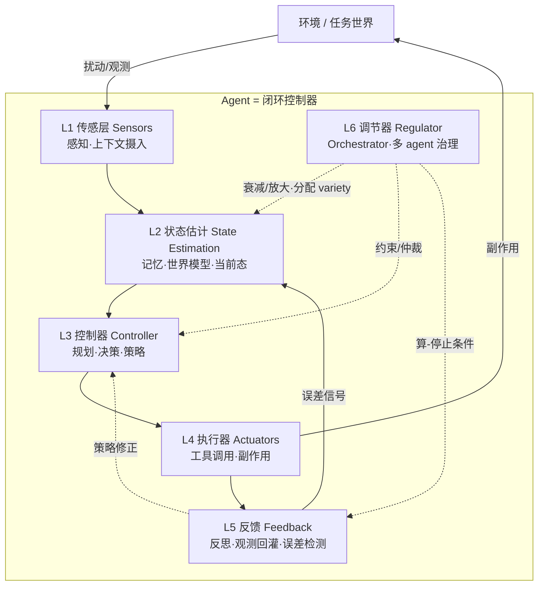

一个 multi-agent 系统为什么会"失控"——不是因为模型不够聪明，而是因为它本质上是一个**控制系统**,而控制系统有它自己的、与"智能"无关的失败语法。本节点的问题是:如果把 agent 拆成"传感 / 状态估计 / 控制器 / 执行器 / 反馈 / 调节器"六个控制论意义上的层,每一层各自的控制论含义是什么、各自给 PM 留下哪些必须回答的问题、以及——最关键的——**哪几对层间耦合一旦失配就会结构性地导致失控**。视角/框架名:**控制系统分层剖面(control-theoretic layered profile)**,它是对 [S01 Agent 六层架构剖面](/kb/专题-安全对齐与失败/s01-agent-六层架构剖面/)(0411 专题,感知/规划/记忆/工具/执行/反思的"组件视角")的一次**抽象层抬升**——不再问"agent 由哪些组件组成",而问"作为一个闭环控制器,agent 的稳定性由什么决定"。

> [!warning] 本节点的核心赌注
> 我赌的是:**控制论(而非"提示工程"或"模型能力")提供了理解 agent 为什么会失败/失控的最深层语法**。如果你接受这个赌注,那么 "context 不够导致失控" 就不再是 "模型不够聪明" 的委婉说法,而是一条可以写下来的**结构性约束**:orchestrator 的控制上界 = 它能表征的状态多样性;当 context 撑不起足够的 requisite variety,失控不是概率事件,是定理。这条赌注会在 §0117社会学 / §0114认识论 两处被外部框架拷问,我会在"对手框架回应"里标边界。

---

## §0 为什么是"控制系统六层",而不是"Agent 六层组件"

读者脑中的默认框架,大概率是 0411 的那套:**感知 → 规划 → 记忆 → 工具 → 执行 → 反思**。那套是对的,但它是**组件视角(静态解剖)**——回答"一个 agent 拆开来有哪些零件"。本节点要先挡掉一个错误迁移:**把组件清单当成控制结构**。

组件视角看不到的东西,恰恰是失控的根源:

| | 0411 组件视角(静态) | 本节点 控制视角(动态) |
|---|---|---|
| **追问** | agent 由什么组成 | 作为闭环,稳定性由什么决定 |
| **"记忆"的地位** | 一个横切组件 | 不是独立层——它是状态估计层的**积分器**(stock) |
| **"反思"的地位** | 一个组件 | 是**反馈回路**本身(negative feedback) |
| **"orchestrator"的地位** | 多 agent 时才出现的一个角色 | 是**调节器(regulator)**,其控制上界由 Ashby 定律封顶 |
| **失败如何解释** | "某个组件没做好" | **层间耦合失配**(误差放大 / variety 不足 / 反馈延迟致振荡) |

控制论的映射并非牵强类比。Norbert Wiener 在 1948 年的《Cybernetics: Or Control and Communication in the Animal and the Machine》中的核心论点就是:**反馈与控制原理在生物系统与机器中通用**(来源:MIT Press 原版;Wikipedia)。而 agent 的 observe-decide-act 循环——无论你叫它 ReAct、agentic loop 还是 Boyd 的 OODA——就是一个经典控制回路。ReAct(Yao et al., 2022, Princeton & Google Research)把 agent 从 few-shot 的**开环控制**(open-loop:输入→输出,无外部信号回灌)转成**闭环控制**(closed-loop:Reason→Act→Observe→Reason),在 ALFWorld 上比纯 CoT 提升约 34%(来源:ReAct 论文;MindStudio 解读)。所以"agent 是控制系统"不是修辞,是已有实验支撑的等价。

**六层控制剖面(本节点的主结构):**

注意三处与组件视角不同的画法:(1) L5 反馈的箭头**回灌到 L2 状态估计**,这是闭环的命门;(2) L6 调节器**不在主调用链上**,它横切地"调"其余各层的 variety 分配——这正是 orchestrator 的本质;(3) L4 执行器的副作用**直接改变环境**,而环境的扰动又回到 L1,形成 agent-环境**耦合动力系统**(coupled dynamical system,这是 Eslami & Yu, arXiv:2603.10779, 2026 形式化的核心对象)。

---

## §1 L1 传感层(Sensors)——感知即"信道",带宽决定一切

**控制论含义:** 传感层是控制器与环境之间的**通信信道**。Ashby 在《An Introduction to Cybernetics》(1956)10/1 节明确写道:"The quantity of regulation that can be achieved is bounded by the quantity of information that can be transmitted in a certain channel"(可达成的调节量,受限于某信道能传输的信息量)。翻译成 agent 工程:**你的 agent 最多能控制的复杂度,被它"看得见多少"封顶**。一个只能读到错误日志最后 50 行的 coding agent,其 debug 能力在信息论上就有上界,与模型多强无关。

**负反馈 vs 正反馈在传感层的预演:** 传感层若引入**正反馈**——比如 agent 自己写的 log 又被自己读回当上下文——会形成 [LLM repetition loop](/kb/基础知识库/llm-repetition-loop/) 式的自我强化吸引子。这不是巧合:repetition loop 的判定标准"不是语义合理性而是分布形状",而正反馈回路在控制论里就是"输出放大初始变化,趋向新状态"(来源:Wikipedia Negative Feedback;ScienceInsights)。

**PM 问题清单:**
- 信道带宽:agent 单步能"看见"的有效 token 是多少?(注意:长上下文 LLM 在 100K token 处性能已下降超 50%,见 arXiv:2512.02445, 2024——名义带宽 ≠ 有效带宽)
- 信噪比:传感输入里有多少是噪声(无关检索结果、冗余日志)?
- 采样率:多久观测一次环境?(采样率太低 → 控制器基于过期状态决策,见 §7 致命耦合 C)

---

## §2 L2 状态估计层(State Estimation)——记忆是积分器,误差会被积分放大

**控制论含义:** 状态估计层维护 agent 对"我现在处于什么状态"的内部表征。在系统动力学(Forrester, *Industrial Dynamics*, 1961)里,这是 **stock(存量)**——"系统的记忆,是对 flow 的时间积分"。记忆层不是横切的"零件",它是**积分器**:每一步的状态更新都累加进来。

这带来一个被组件视角完全遮蔽的危险:**积分器会放大误差**。如果 L1 传感引入了一个小偏差(检索到一条错误事实),它进入状态估计后不会消失,而是被后续每一步**积分**,直到 agent 的"世界模型"与真实世界系统性偏离。这就是 MAST 分类(Cemri et al., arXiv:2503.13657, 2025)里 **Context Pollution(上下文污染)** 的控制论本质——不是"上下文脏了",是**状态估计的积分误差发散**。

**Good Regulator 定理的接入(确证):** Conant & Ashby(1970, *Int. J. Systems Science*, "Every good regulator of a system must be a model of that system")证明:任何对系统的良好调节器**必须是该系统的模型**——系统状态到调节器状态之间存在一个**同态映射**(homomorphism,注意是同态不是同构,模型可以丢信息)。这直接预示了现代 agent 的**世界模型**:L2 状态估计的质量,等于 agent 内部模型对真实世界的同态保真度。WALL-E(Zhao et al., arXiv:2410.07484, 2024)用 LLM+规则世界模型做 MPC 规划,在 Minecraft 上 +15–30% 成功率——本质是改善 L2 的模型保真度。

**PM 问题清单:**
- 你的 agent 维护的"状态"是显式的(写进 context/memory)还是隐式的(藏在 KV cache)?显式才可审计。
- 积分误差有没有"泄放阀"?(纯积分器无界发散;需要遗忘/压缩机制——对照 [m206 - Agent 产品化：记忆机制与技术进展](/kb/工程化与落地架构/m206-agent-产品化-记忆机制与技术进展/) 的记忆机制)
- 状态估计与真实环境的偏差,有没有信号能检测?(没有 → §7 致命耦合 A)

---

## §3 L3 控制器(Controller)——规划即策略,variety 不足即结构性失控

**控制论含义:** 控制器把"当前状态估计 + 目标"映射为"下一步动作"。这是 agent 的规划/决策核心。但控制论给出了一个 PM 必须刻进脑子的硬约束——**Ashby 必要多样性定律(Law of Requisite Variety, 1956)**:

> "Only variety can destroy variety."(Ashby 原文;Stafford Beer 普及为 "Only variety can absorb variety.")

数学形式:**V(R) ≥ V(D) / V(E)**,简化即 **V(控制器) ≥ V(扰动)**——控制器的状态多样性必须不低于环境扰动的多样性,否则控制在**根本上不可能完备**。这里 variety 是 Ashby 的**精确计数概念**("a set of possible states that a system may take"),不是隐喻。

**这是本节点最重的一条判断:** 当 agent 的"内部状态多样性(可表征的决策空间)"小于其所处环境的状态多样性,**失控是结构性约束,不是"模型不聪明"**。一个 context window 撑不起足够 requisite variety 的 orchestrator,无论换多强的模型,都无法稳定调度一个比它更复杂的环境。这就是 agent 在开放世界频繁失败的**信息论解释**,而非"再等下一代模型"就能解决的工程债。

**PM 问题清单:**
- 你的环境扰动 variety 有多大?(开放 web vs 封闭 API,差几个数量级)
- 控制器的 variety 由什么提供?(模型本身 + context 中可表征的状态 + 工具集的组合空间)
- 当 V(控制器) < V(环境),你的产品设计是**衰减环境 variety**(收窄场景、加约束)还是**放大控制器 variety**(加工具、加 context)?这是选型会上的核心权衡。

---

## §4 L4 执行器(Actuators)——工具是不可微的副作用,且不可逆

**控制论含义:** 执行器把控制器的决策施加到环境上。在 agent 里就是工具调用。控制论视角的关键洞察:**执行器的副作用直接改变被控对象(环境),而这些改变往往不可逆**。控制器可以重新规划,但已经发出的"删库""转账""发邮件"收不回来。

这与经典 MPC(模型预测控制)的一个根本张力相关:MPC 在每步对未来 N 步滚动优化、执行最优第一步、再重规划,**前提是动力学模型精确且可微**。但 LL+工具的"世界模型是近似且不可微的"(见专题争议:MPC 类比是否成立,状态"开放")。执行器层就是这个不可微性最痛的地方——你无法对"已发生的副作用"求梯度回退。

**PM 问题清单(直接对接 HITL):** 这里是 [m207 - Agent 产品化：场景推演与失败模式](/kb/工程化与落地架构/m207-agent-产品化-场景推演与失败模式/) 的 HITL 三维度(操作可逆性 / 错误后果 / 置信度)的控制论落点。
- 每个工具的**可逆性**分级:可逆(只读)/ 半可逆(可补偿)/ 不可逆(副作用永久)。
- 不可逆执行器前,是否有 HITL 断点?(m207 原则:通过率 >95% 的步骤类型才取消断点,不从一开始全自动化)
- 执行器失败的错误,是被 L5 反馈捕获,还是静默丢失?(静默 → §7 致命耦合 A 的另一条放大路径)

---

## §5 L5 反馈层(Feedback)——反思是负反馈,但延迟会把它变成振荡源

**控制论含义:** 反馈层检测"期望 − 实际"的误差,并回灌以修正行为。这是**负反馈回路**:检测误差 → 校正输入 → 趋向设定点(set point)。Agent 里的"反思(reflection)"就是它。负反馈是稳定之源——Harold Black 1927 年在贝尔实验室发明负反馈放大器,正是用反馈换稳定。

但控制论给出了一个组件视角永远看不到的陷阱:**负反馈一旦带上延迟或过高增益,会从"稳定器"翻转为"振荡源/发散源"**。系统动力学的"啤酒游戏"(Beer Game, MIT Sloan)是经典演示:供应链各层各自理性响应库存信号,但**时延叠加反馈**,导致整条链剧烈振荡——即使终端需求几乎不变。Sterman 的研究发现玩家系统性地低估时延、误读反馈,从而过度订货。

映射到 agent:多个 agent 独立修改共享计划时,"推理上的微小差异会被放大,形成不兼容分叉(incompatible forks)",这正是正反馈放大——是振荡的控制论解释(来源:多 agent 失败分析)。

**PM 问题清单:**
- 反馈延迟有多大?(reflection 是每步做,还是批处理?批处理 = 大延迟 = 振荡风险)
- 反馈增益是否过高?(每次反思都大幅改写计划 = 高增益 = 易过冲)
- 反馈写回哪里?(写回 L2 状态估计的策略 = 0411 S01 §9 "反思笔记写入策略"耦合点)
- 有没有停机条件?(缺停机条件的反馈循环 = 正反馈发散,即 Cemri et al. 最大失败类"无终止信号导致无限等待循环")

---

## §6 L6 调节器(Regulator)——Orchestrator 的控制上界,被 Ashby 定律封顶

**控制论含义:** 调节器不在主调用链上,它**横切地分配 variety**:决定哪个子任务给哪个 worker、压制 worker 间的冲突、设置全局停机条件。这就是 orchestrator。但比 orchestrator-worker 这种扁平模型精密得多的治理结构,Stafford Beer 早在 1972 年的《Brain of the Firm》里就给出了——**Viable System Model(VSM)**。

VSM 把任何"可存活组织"分解为五个子系统(缺一不可):**S1 运营 / S2 协调(防 S1 间振荡)/ S3 控制协同(+S3* 审计旁路)/ S4 情报(扫描外部环境)/ S5 政策身份**。其中 S2 用**衰减器(attenuator)** 减少 S1 间传递的噪音,S3 用**放大器(amplifier)** 平衡信息不对称——这正是 Ashby variety 的工程化分配。对 agent 工程的直接启示:

| VSM 系统 | 对应 agent orchestration 缺失项 |
|---|---|
| S2 协调(防振荡) | 现在的 orchestrator 大多**没有** S2——这就是为什么 multi-agent 会出现 §5 的不兼容分叉 |
| S3* 审计旁路 | 很少有 agent 系统有独立审计通道,只能信 agent 自报 |
| **Algedonic 信号** | Beer 的"痛/乐"紧急信号:S1 绩效越界时**绕过层级直达 S5**——对应 agent 系统里几乎不存在的"异常熔断直通"机制 |
| S4 情报(管"将来与彼处") | orchestrator 大多只管当下调度,不扫描环境漂移 |

> [!note] 跨域呼应(0117社会学 / 二阶控制论)落地
> Beer 的 VSM 与 **Heinz von Foerster 的二阶控制论**(1974 正式阐述一阶/二阶之分:"the control of control")存在张力:VSM 假设存在**可观察的客观现实**(一阶:观察者在系统外、中立描述),而二阶控制论坚持**观察者进入被观察系统**。这对 agent 设计是个真问题:当 orchestrator 监控 worker 时,它的监控行为本身改变了被监控系统(worker 的 context 被 orchestrator 注入)——**调节器不是中立观察者,它是被控系统的一部分**。这意味着 §7 的所有耦合分析都有一层"观察者效应":你测量 agent 状态的动作,本身就在扰动那个状态。我把这条接入 0117社会学 的反身性(reflexivity)讨论,而非停在"加个监控就行"。

**PM 问题清单:**
- 你的 orchestrator 有没有 S2 协调层防 worker 振荡?
- 有没有 algedonic 直通熔断?(异常能否绕过正常层级直达停机)
- orchestrator 的 variety 够不够覆盖所有 worker 状态的组合空间?(若不够 → 它必然漏掉某些失控组合,这是 Ashby 定律对调节器自身的递归约束)

---

## §7 判断主轴——三个层间致命耦合(90% 的人在这里搞错)

这是本节点的命门。组件视角让人以为"每层做好,整体就好",但控制系统的失控**几乎全部发生在层间耦合**,而非单层。以下三对耦合,每条配"症状 → 为什么会错 → 正确做法 → 真实反例"四件套。

### 耦合 A:状态估计误差 × 反馈缺失 → 误差经积分被放大到发散
- **症状:** agent 一开始只差一点点(检索到一条略微过时的事实),几步后整个推理链系统性跑偏,且越跑越自信。
- **为什么会错:** 大家把 L2 当"只读的记忆库",忘了它是**积分器**(§2)。而 L5 反馈又没有一条信号专门检测"状态估计 vs 真实环境"的偏差。于是初始小误差被每一步积分,负反馈又不存在,纯积分器**无界发散**。这就是 Context Pollution(Cemri et al., 2025)的控制论真相。
- **正确做法:** (1) 给积分器装"泄放阀"——定期用环境 ground truth 重置状态估计(对应 RAG re-grounding);(2) 在 L5 显式加一条"状态-环境偏差检测"信号,而不只检测"任务是否完成"。
- **真实反例:** coding agent 基于一份已被改名的 API 文档持续生成调用,每次报错都被它解释成"我代码写错了"(归因到 L3 控制器)而非"我的世界模型过时了"(L2 积分误差)——它永远修不好,因为反馈信号指向了错误的层。

### 耦合 B:控制器 variety × 环境 variety 失配 → 结构性失控(非模型问题)
- **症状:** 换了更强的模型,benchmark 涨了,但放进真实开放环境照样失控;团队的结论是"再等下一代模型"。
- **为什么会错:** 把 variety 不足误诊为"智能不足"。Ashby 定律说得很清楚:当 **V(控制器) < V(环境扰动)**,控制在信息论上不可能完备(§3)——这是**结构性约束,不是模型聪明度问题**。加大模型只在"模型是 variety 瓶颈"时有用;若瓶颈是 **context 撑不起足够可表征状态**,加模型无效。
- **正确做法:** 先量级估算 V(环境) 与 V(控制器) 的差距,再决定是**衰减环境**(收窄场景/加护栏,VSM 的 attenuator)还是**放大控制器**(加工具/加 context/加专职 sub-agent,VSM 的 amplifier)。两条路成本结构完全不同。
- **真实反例:** "通用 web agent"在受控 demo 里完美,一进真实互联网就崩——因为真实 web 的 variety 比 demo 高几个数量级,而控制器(context+工具)的 variety 没跟着涨。这不是模型不行,是**结构性 variety 失配**。对照专题争议:VSM/Ashby 应用"可操作性"仍是开放问题(variety 难量化),所以这里给的是量级估算而非精确公式。

### 耦合 C:反馈延迟 × 高增益 → 振荡 / 过冲(把稳定器变成发散源)
- **症状:** agent 在两个方案之间反复横跳,或不断"修正上一步的修正",任务越做越乱。
- **为什么会错:** 以为"多反思 = 更稳"。但 §5 说过:负反馈一旦带**延迟**(批量反思)或**过高增益**(每次反思大改计划),会从稳定器翻转为振荡源。这是啤酒游戏在 agent 里的重演:每个 agent 局部理性响应,时延叠加反馈 → 系统级剧烈振荡。
- **正确做法:** (1) 降增益——限制单次反思能改写的状态比例(类似学习率衰减);(2) 减延迟——高频小步反馈优于低频大步;(3) 加阻尼——对频繁反复的决策引入"冷却期"或多数表决。
- **真实反例:** multi-agent 团队里两个 agent 各自"反思"后独立修改共享 plan,产生不兼容分叉(incompatible forks),每个分叉又触发对方再反思,形成正反馈振荡——这正是缺 VSM 的 S2 协调层(§6)所致。

> [!tip] 把这张表打印出来贴在选型会的墙上
> 别再问"哪个模型 agent 能力更强";问"在我的环境 variety 下,这套架构的 L2 积分误差有没有泄放阀、L3 的 variety 够不够、L5 反馈的延迟和增益会不会振荡"。这三问能在 30 秒内判掉一个看起来很炫的 multi-agent 方案。

---

## §8 产品 PM 视角补盲(跳出工程 PM)

工程 PM 只看技术耦合,产品 PM 必须补三个"看走眼"点:

1. **用户心理模型错位(二阶控制论的用户侧):** 用户把 agent 当"会自我纠错的智能体",但 §7-A 表明它的反馈可能指向错误的层。当 agent 自信地给出错误结果,用户**没有信号**知道这是"状态估计积分误差"还是"控制器决策错误"——信任一旦崩,产品就死。设计启示:把 L5 的"状态-环境偏差"信号**对用户可见**(不确定性披露),而非只展示流畅的最终答案。
2. **商业模式错位(VSM 的成本现实):** Beer 的完整 VSM 治理在 agent 上**昂贵**——前沿模型按 token 收费,多层 attenuator/amplifier/审计旁路意味着 token 成本可能令人望而却步(来源:Gorelkin, VSM for Enterprise Agentic Systems, Medium, 2024)。PM 必须算:加一层 S2 协调防振荡,值不值它烧的 token?这是 [m209 - 推理成本控制手册](/kb/工程化与落地架构/m209-推理成本控制手册/) 视角下的"控制开销 vs 控制收益"权衡。
3. **合规边界错位(执行器不可逆性的法律面):** §4 的不可逆执行器,在 To B/金融/出行安全等场景里是**合规红线**。控制论说"无法对副作用求梯度回退",合规说"不可逆操作必须留痕可审计"——这两者交汇点就是必须的 HITL 断点 + S3* 审计旁路。作为 DiDi/99 安全 PM,这一条尤其要前置到 PRD。

---

## §9 对手框架回应(接受 + 边界,不是反驳)

**对手立场一:"把 LLM agent 叫'控制器'是比喻,不是工程意义上的稳定性保证"。** 这是把 agent 形式化为控制系统时最真实的反方(专题争议状态:开放)。理由有力:LLM 本质是概率采样,不是经典动力系统;其内部状态空间维度极高且不可直接观测,Lyapunov 等经典稳定性工具适用性存疑。
**接受:** 我接受——目前没有任何 LLM agent 给出过 Lipschitz 常数或 Lyapunov 函数的实测数值(Eslami & Yu, 2026 只提框架,无公开数值)。把六层叫"控制系统"在**严格工程意义上**确实尚是框架而非定理。
**边界/赌注:** 但我坚持控制论作为**诊断语法**的价值不依赖完整形式化——就像在能精确解方程之前,"负反馈致稳、正反馈致发散、延迟致振荡"这些定性结论已经能挡掉 90% 的失控设计。我赌的是**定性控制论 ≥ 无框架的试错**,而不是"控制论能给 agent 颁发稳定性证书"。这条赌注在"能形式化稳定性吗"这个开放问题被证伪之前,对 PM 决策足够用。

**对手立场二(Good Regulator 定理的批评,破 echo chamber 用):** Goker Erdogan(2021)等指出 Conant-Ashby 原始论文有证明缺口——"model"定义不清(更接近 RL 的 policy 而非 transition model)、目标函数缺陷(最小化末态熵会认可"闭眼"这类无意义行为)、且已有大量 Artificial Life 系统在**无内部模型**下完成调节,暗示定理不易泛化。
**接受:** 我接受"good regulator 必须是 model"不是无条件定理。所以 §2 我没说"agent 必须有显式世界模型",只说"L2 的同态保真度决定 L2 质量"——这是更弱、更安全的主张。
**边界:** 但 ALife 反例不否定 Ashby 在**高 variety 开放环境**下的相关性:无模型调节能在低 variety 封闭环境奏效,恰恰因为那里 V(环境) 低。环境一旦高 variety,缺模型的调节器就撞上必要多样性的墙。

---

## §10 PM 决策启示(面试 / 选型 / 复现三类落地)

- **面试桌:** 当被问"multi-agent 为什么难做",别答"协调复杂"。答:"它是个多控制器耦合系统,有三类结构性失控——状态估计积分误差发散、控制器 variety 不足、反馈延迟致振荡;前两个是 Ashby 必要多样性的推论,不是模型能力问题。"——这一句把你和"读过几篇博客的候选人"区分开。
- **选型会:** 用 §7 三问表(积分泄放阀 / variety 匹配 / 反馈延迟与增益)做架构尽调;用 §6 的 VSM 五系统表检查 orchestrator 缺了哪几层治理(尤其 S2 协调和 algedonic 熔断)。
- **复现台:** 自己搭 ReAct(对照 0411 的 `R01 最小可运行·100 行 ReAct`)时,先确认它是不是**真闭环**(observe 是否真回灌到状态);加 reflexion(对照 `A04 Reflexion`)时,显式调反馈增益与延迟,亲手复现一次 §7-C 的振荡,你会永远记住"多反思 ≠ 更稳"。

---

## §11 与已有节点的关系(不复述,只标对照类型)

- **对照 [S01 Agent 六层架构剖面](/kb/专题-安全对齐与失败/s01-agent-六层架构剖面/)(0411 专题)——做"抽象层抬升 + 对话":** 0411 S01 是组件视角(感知/规划/记忆/工具/执行/反思),本节点把同一对象重新切成控制论六层(传感/状态估计/控制器/执行器/反馈/调节器),回答它回答不了的"稳定性由什么决定"。两者不替代:画 agent 解剖图用 0411,诊断失控用本节点。0411 S01 §9 的三个工程耦合点(重试边界/反思笔记写入策略/token 预算瓜分)在本节点 §7 被重新解释为控制论耦合(分别对应执行器幂等、反馈写回 L2 的策略、各层 variety 的预算分配)。
- **对照 [A06 Orchestrator 编排器](/kb/专题-安全对齐与失败/a06-orchestrator-编排器/) / [A07 Multi-Agent Teams](/kb/专题-安全对齐与失败/a07-multi-agent-teams/)——做"深化":** A06/A07 讲 orchestrator-worker 怎么搭、何时不该上 multi-agent;本节点 §6 用 Beer VSM 指出 orchestrator-worker 是个**缺了 S2/S3*/algedonic 的简化调节器**,解释 A07 "对等式是陷阱"的控制论根因(缺协调层 → 振荡)。
- **对照 [m207 - Agent 产品化：场景推演与失败模式](/kb/工程化与落地架构/m207-agent-产品化-场景推演与失败模式/)——做"理论接地":** m207 的六类失败模式(规划/工具调用/推理/无限循环/雪崩/安全越界)和 HITL 三维度,在本节点被映射回控制层(无限循环=缺停机的正反馈;雪崩=积分误差发散;HITL=不可逆执行器断点)。m207 给"现象学分类",本节点给"控制论病因"。
- **对照 [c11 - System 2 思维与 Test-Time Compute](/kb/基础知识库/c11-system-2-思维与-test-time-compute/)——做"补缺":** c11 讲"值不值得多想";本节点指出"多想"在控制论上是**给控制器加 variety**(test-time compute 扩展决策空间),但若 L1 信道带宽不足、L2 积分误差未泄放,加再多 test-time compute 也越不过 Ashby 的墙——多想有上界。
- **对照 [m206 - Agent 产品化：记忆机制与技术进展](/kb/工程化与落地架构/m206-agent-产品化-记忆机制与技术进展/) / [m208 - AI 基础设施与中间件选型](/kb/工程化与落地架构/m208-ai-基础设施与中间件选型/)——做"延伸":** m206 的记忆机制 = L2 积分器的泄放阀工程;m208 的中间件选型 = 决定各层信道带宽与 variety 上限的基础设施约束。

---

## §12 关联节点

**核心(必读):**
- [S01 Agent 六层架构剖面](/kb/专题-安全对齐与失败/s01-agent-六层架构剖面/) — 组件视角原型,本节点的抬升对象
- [A06 Orchestrator 编排器](/kb/专题-安全对齐与失败/a06-orchestrator-编排器/) — 调节器层(L6)的具体形态
- [A07 Multi-Agent Teams](/kb/专题-安全对齐与失败/a07-multi-agent-teams/) — 多控制器耦合的失控现场
- [m207 - Agent 产品化：场景推演与失败模式](/kb/工程化与落地架构/m207-agent-产品化-场景推演与失败模式/) — 失败模式的现象学,本节点给病因
- [c11 - System 2 思维与 Test-Time Compute](/kb/基础知识库/c11-system-2-思维与-test-time-compute/) — test-time compute = 给控制器加 variety,有 Ashby 上界
- [Agent](/kb/基础知识库/agent/) — 概念锚点
- [LLM repetition loop](/kb/基础知识库/llm-repetition-loop/) — 传感层/反馈层正反馈失稳的微观案例

**延伸(可选):**
- [m206 - Agent 产品化：记忆机制与技术进展](/kb/工程化与落地架构/m206-agent-产品化-记忆机制与技术进展/) — L2 积分器泄放阀工程
- [m208 - AI 基础设施与中间件选型](/kb/工程化与落地架构/m208-ai-基础设施与中间件选型/) — 各层带宽/variety 的基础设施约束
- [幻觉](/kb/基础知识库/幻觉/) — 与积分误差发散的区分(分布散但内容错 vs 状态系统偏)
- [Test-Time Compute](/kb/基础知识库/test-time-compute/) — 控制器 variety 扩展的一种手段
- [强化学习](/kb/基础知识库/强化学习/) — Good Regulator 中 "model=policy" 争议的接口
- 0117社会学 — 二阶控制论 / 反身性:调节器非中立观察者
- 0114认识论 — variety 不足作为"可知性边界"的结构约束
- [AI PM 知识图谱·总索引](/kb/ai-pm-知识图谱/ai-pm-知识图谱-总索引/) — 全局入口

---

## 修订日志
- **R1(2026-06-07):** 首稿。建立控制论六层剖面(传感/状态估计/控制器/执行器/反馈/调节器),每层含控制论含义 + PM 问题清单;§7 给出三个层间致命耦合(积分误差发散 / variety 失配 / 反馈延迟振荡)四件套;§6 接入 Beer VSM 与 von Foerster 二阶控制论;§9 接受 + 边界回应"agent 是否真控制器"与 Good Regulator 批评两类对手立场;§11 与 0411 S01 / A06 / A07 / m207 / c11 建立升级对照。事实接地:Wiener 1948、Ashby 1956 必要多样性、Conant-Ashby 1970 Good Regulator、Beer 1972 VSM、ReAct 2022、WALL-E 2024、Cemri et al. 2025、Eslami & Yu 2026 均来自已核实简报。
