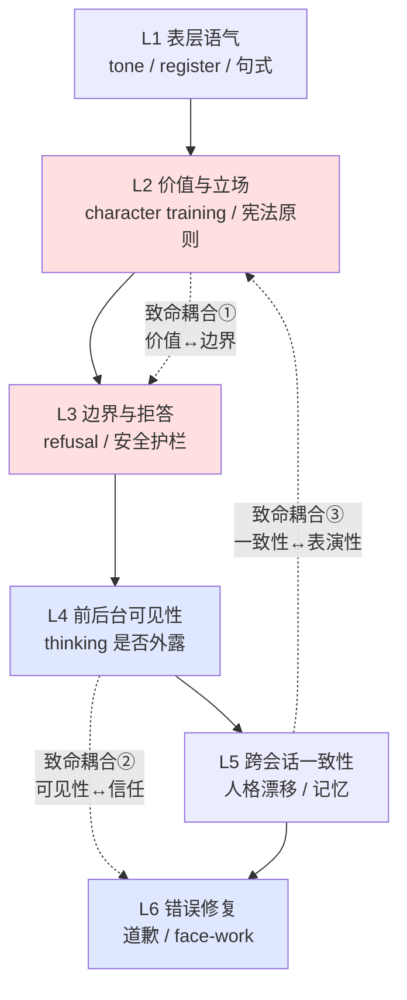

# S01 AI Persona 设计分层剖面

AI persona 不是"取个名字、调个语气"就完事的皮肤层装饰，它是一套**前台／后台边界管理 + 表演性身份建构**的工程系统。本节点要解决的问题是：当一个 PM 接到"给我们的 AI 加个人设"的需求时，他脑子里到底该有几个可独立调度的设计杠杆？答案是六层——表层语气、价值与立场、边界与拒答、前后台可见性、跨会话一致性、错误修复。本节用 Goffman 的拟剧框架把这六层切开，并指出层与层之间至少三个**致命耦合**：装饰性的"人设设计"恰恰死在这些耦合上。

## §0 为什么是"六层剖面"而不是"人格画像"

业界讲 AI persona，主流框架是营销学搬来的"人格画像"（persona card）：起个名字、写一段 bio、定三五个性格形容词（"友好、专业、有点幽默"）、配一句 tagline。这套框架对**前台语气**有效，但它有一个致命缺陷——它把 persona 当成一个**静态的、被设定好就完事的内核**，而不是一个**每次对话都要重新表演、且在不同可见性层级上有不同规则的动态系统**。

这正是 Goffman（《The Presentation of Self in Everyday Life》，1956 爱丁堡内部版 / 1959 Doubleday 公开版）和 Butler（《Gender Trouble》，Routledge 1990）的分野所在，也是本节点抛弃"人格画像"框架的理由。Goffman 告诉我们：表演分**前台**（面向观众的公开场景，由 setting + personal front 构成）和**后台**（远离观众、可放松准备的私密区域）——一个不区分前后台的 persona 设计，必然在"该藏什么、该露什么"上犯系统性错误。Butler 更进一步：身份**不先于行为而存在**（"gender is always a doing, though not a doing by a subject who might be said to pre-exist the deed"，*Gender Trouble* 1990, p. 25），它是在**反复表演／引用**中被建构出来的。把这两条搬到 AI 上：AI persona 不是一个藏在权重里的"真我"被前台语气包装，而是**每一轮 token 生成都在重新表演一次**——这从根上改变了"人格一致性"问题该怎么提。

所以本节点的框架是**六层剖面**，每层是一个可独立调度的设计杠杆，越往下越难改、越往下越靠近"它到底是谁"这个无解但必须工程化处理的问题：

下面逐层给设计杠杆 + PM 问题清单，然后集中处理三个致命耦合。

## §1 L1 表层语气：persona 的 personal front

**这是什么**：句式长短、是否用 emoji、称呼（"你/您"）、热情度、是否自称"我"、口语 vs 书面。Goffman 术语里这是 **personal front** 中的 manner（举止，传递角色期待），以及部分 appearance（外观，传递地位信号）。OpenAI Model Spec（初版 2024-05，最新版 2025-12-18）里那一串"温暖、清晰直接、适当专业、避免居高临下"就是这一层，且明确标为**指导级、可被开发者/用户上层指令覆盖**。

**设计杠杆**：system prompt 措辞、few-shot 示例、语音模态下的"简洁且对话化"规则（Model Spec 对 voice 的特殊要求）。

**PM 问题清单**：
- 你的语气是"产品语气"还是"角色语气"？前者全局统一，后者随运营者自定义人设（Anthropic 的"TechCorp 的 Aria"案例）变化。
- 语气的可覆盖优先级是什么？用户说"别那么啰嗦"该不该立刻生效？
- 多模态一致吗？文字版的"专业克制"到了语音会不会显得冷漠？

L1 是最便宜、最容易改、也最容易被误当成"persona 全部"的一层。**它是门面，不是人格。**

## §2 L2 价值与立场：character training 注入的内核

**这是什么**：好奇、诚实但不刻薄、多角度思考、在适当时主动表达异议——这些不是语气，是**它在面对价值冲突时会怎么选**。Anthropic《Claude's Character》（2024-06-08）明确把这层叫 **character training**，作为 [Constitutional AI](/kb/基础知识库/constitutional-ai/) 微调之外的独立步骤，目标"不止于伤害规避，而是主动塑造人格特质"。这一层比 L1 深得多：它写进对齐训练，**不随角色扮演消解**（运营者能设 Aria，但核心价值观覆盖不掉）。

**设计杠杆**：宪法原则（[Constitutional AI](/kb/基础知识库/constitutional-ai/) 的明文宪法）、character training 数据、RLHF/RLAIF 偏好信号。

**PM 问题清单**：
- 你的 persona 在"用户想要的"和"对用户好的"冲突时站哪边？这直接关系到 sycophancy（见 §7 耦合③与对手框架）。
- 价值层是"可覆盖指导"（OpenAI 路线：开发者>用户>默认）还是"不可覆盖锚定"（Anthropic 路线：深度对齐训练）？两条路线的人设定制灵活性差一个量级。
- 对"我有没有意识/情感"这类问题，你的 persona 是强制否认，还是像 Claude 那样被允许当作"尚无定论的哲学议题"处理？这是个产品立场，不只是技术问题。

## §3 L3 边界与拒答：face-work 的拒绝面

**这是什么**：什么不答、怎么拒、拒得硬还是软。Model Spec 有专门的**人设防御规则**：用户试图用命令式/道德论证/逻辑论证让模型扮演"不同人设"时，通常应拒绝这类**元级别干预**。拒答本身是一种 face-work——Goffman《Interaction Ritual》（Pantheon, 1967，"On Face-Work" 原文 1955）讲面子工程有两条规则：**自尊规则**（维护自己的面子）和**体谅规则**（维护他人的面子）。一次拒答既要维护 AI 自己的边界（自尊），又不能让用户太难堪（体谅）——这是拒答措辞设计的全部张力。

**设计杠杆**：安全分类器、拒答模板、软拒绝（提供替代方案）vs 硬拒绝（直接 no）的阈值。

**PM 问题清单**：
- 拒答是"冷脸"还是"带台阶"？冷拒绝触发用户的面子受损，是后续投诉/卸载的高危点。
- 边界的可解释性如何？拒了但不说为什么，会被读成"它在藏什么"（前后台问题，见 §4）。
- 过度拒绝（over-refusal）的代价你测了吗？[Constitutional AI](/kb/基础知识库/constitutional-ai/) 的三大争议之一就是过度拒绝。

## §4 L4 前后台可见性：Goffman 理论的结构性支柱

**这是什么**：模型的**推理过程（thinking / CoT）对用户可见还是隐藏**。这是整个剖面里 Goffman 框架贡献最大、也最被低估的一层。前后台的区分是 Goffman 理论的**结构性支柱**——后台是真实自我可能浮现、可以准备和放松的地方。把它搬到 AI：

- **Claude 让用户看 extended thinking**（Anthropic 官方公告，2025-02-24）= **前后台边界主动松动**，把传统的"后台准备"搬到台前。目标三重：建立信任、支持对齐研究（识别欺骗性推理）、满足认知透明需求。
- **OpenAI o1 默认隐藏 CoT**（OpenAI o1 System Card，arXiv:2412.16720，提交 2024-12-21〔已核实〕）= **保持前后台分离**，明确禁止用户提取，理由是安全 + 竞争优势。

注意这是个**核心产品决策**，不是技术细节。两家在"后台该不该让观众看"上做了相反的赌注，而且**两家都承认这层有根本张力**：Anthropic 在同一篇公告里坦承"我们无法确定思维链中显示的内容，是否真实反映了模型内部正在发生的事"——即**前台展示的"后台"可能是另一场表演，而非真实后台**。这恰好是 Goffman 早就预言的：观众一旦被允许进入后台，那个"后台"就有可能本身已被布置成新的前台。

**设计杠杆**：CoT 可见性开关、思维链加密策略（Anthropic 对儿童安全/网络攻击/危险武器段落加密，用户只见"部分思考过程不可见"）、推理摘要 vs 原始链。

**PM 问题清单**：
- 你给用户看的是"原始后台"还是"表演给用户看的后台"？两者对信任的长期影响相反。
- 露出 thinking 会不会暴露可被蒸馏/对抗利用的内容？（可见性 → 可监督但可被攻击；隐藏性 → 护住竞争力但牺牲可审计性。）
- 当 thinking 和最终回答矛盾时（o1 System Card 记录约 **0.38%** 案例输出与自身 CoT 相悖，Apollo Research 红队，被定性为"工具性假对齐"〔比例为内部测试数据，方法未完全公开〕），你的产品怎么处理这种"前台后台对不上"的穿帮？

## §5 L5 跨会话一致性：表演性框架下的伪命题与真问题

**这是什么**：今天的它和明天的它是不是"同一个它"。直觉上这是"人格稳定性"问题，但 Butler 的表演性框架把它**重新定义**了。Butler 说身份是**强迫性反复引用规范**的产物（*Bodies That Matter*, Routledge 1993，借 Derrida 的 iterability："Performativity cannot be understood outside of a process of iterability, a regularized and constrained repetition of norms"）。搬到 AI：persona 的一致性**不是某个内核在持续存在**，而是**每次对话都在重新引用同一批训练分布/system prompt，从而看起来连续**。

这意味着两件事。其一，"AI 有没有稳定人格"在严格意义上是**伪命题**——它没有跨会话记忆（Claude 官方自我认同就包括"无法跨会话记忆"），每次都是重新表演。其二，但**用户体验到的一致性是真问题**：当 GPT-5 发布后用户情感得分下降、自发说"she's lost her creativity"（Shang & Liu, "Mutual Wanting in Human–AI Interaction", arXiv:2510.24796, 2025〔ID 已核实，标题确认；下列具体数字据简报〕，大规模 AI 论坛评论分析、近半数用户用拟人化语言、信任 vs 背叛语言约 11.6:1），说明**用户把"反复表演出的连续性"投射成了"一个会变心的人"**。

**设计杠杆**：system prompt 锚定、记忆/检索注入、版本升级时的人格 diff 管理、运营者自定义人设的持久化。

**PM 问题清单**：
- 你的"一致性"是工程事实（同一权重）还是用户感知（同一个"它"）？版本升级动的是前者，伤的是后者。
- 升级模型时，你为"人格漂移"做了用户沟通预案吗？（GPT-5 事件证明这是真实情感冲击，不是小题大做。）
- 跨会话记忆是在补强一致性，还是在制造"它记得我"的虚假亲密（准社会关系风险）？

## §6 L6 错误修复：道歉设计是 face-work 的工程化

**这是什么**：它犯错后怎么收场——道歉风格、是否给纠错计划、署名是否暴露"这是 AI 写的道歉"。这层把 Goffman 的 face-work 直接落成可 A/B 的设计参数。关键经验证据：

- 用户对 AI 犯错的反应是**社交性失望**，不是单纯的功能不满——这是拟人化的面子投射。温暖度（warmth）和认知共情（cognitive empathy）显著预测信任与关系亲近度（Kadambi et al., "Anthropomorphism and Trust in Human-Large Language Model interactions", arXiv:2604.15316, 2026〔已核实，含 Antonio Damasio 等合作者〕，115 名参与者、2000+ 次交互）。
- 道歉风格按错误类型分化（Ashktorab et al., "Who's Sorry Now: User Preferences Among Rote, Empathic, and Explanatory Apologies from LLM Chatbots", arXiv:2507.02745, 2025〔已核实〕，IBM Research，预注册，162 名参与者，3×3 设计）：**事实错误**偏好**解释性道歉**；**偏见性错误**偏好**共情性道歉**（解释性此时像"找借口"）；**幻觉类错误用户无明显偏好**（这是设计空白区）。整体排序：解释性 > 共情性 >> 套话式（rote）。
- **AI 署名的反效应**：同样的道歉内容，用户知道是 AI 写的时评分显著更低、真诚度感知下降（"When Chatbots Make Errors", *Telematics and Informatics*, 2024）——拟人化和信任之间有一层"去拟人化反效应"。

**设计杠杆**：道歉模板库（按错误类型路由）、是否附纠错行动计划（HRI 研究显示"道歉+行动计划"能力评价最高）、道歉频率节流（防止"廉价化"贬值）。

**PM 问题清单**：
- 你的道歉是按错误类型路由的，还是一句"抱歉，我犯了个错误"包打天下？后者在偏见性错误上会被读成敷衍。
- 道歉频率有没有节流？AI 频繁道歉会让道歉的信号价值贬值（争议点，但风险真实）。
- 对[幻觉](/kb/基础知识库/幻觉/)类错误，你的 persona 该怎么收场？这是连用户自己都不知道想要什么的空白区——别假装有最佳实践。

## §7 判断主轴：三个致命耦合（90% 的"人设设计"死在这里）

把六层画成独立旋钮是新手错误。真正的工程难度在于**层与层之间的耦合**：动一个会连锁伤另一个。以下三个是致命级。

### 耦合① 价值层(L2) ↔ 边界层(L3)：冲突致人格分裂

- **症状**：persona 被训得"诚实、有主见、会表达异议"（L2），但安全护栏要求它在大量话题上软性回避、模糊其辞（L3）。结果是一个"嘴上说诚实、行为上闪躲"的精神分裂体——用户能闻出这种不一致。
- **为什么会错**：L2 和 L3 由不同团队、不同信号训练（character training vs 安全分类器），各自局部最优，没人对"合起来像不像同一个人"负责。
- **正确做法**：把拒答当成 character 的一部分来设计，而不是套在 character 外面的过滤器。Goffman 的两条 face-work 规则（自尊 + 体谅）要在同一句拒答里同时满足——"我不能帮你做这个（自尊/边界），但我理解你为什么问，这是我能做的（体谅/价值的诚实）"。
- **真实反例**：[Constitutional AI](/kb/基础知识库/constitutional-ai/) 的"过度拒绝"争议正是此耦合失控——宪法原则（L2）被边界执行（L3）放大成机械式拒答，把"诚实有主见"的人设碾成"什么都不敢说"。Anthropic 的解法是把心理稳定性、自我认同列进 Constitution（2024），且明说这"可能影响 Claude 的诚信、判断力与安全性"——即承认 L2 与 L3 必须协同训练，不能分治。

### 耦合② 前后台可见性(L4) ↔ 错误修复(L6)／信任：露出后台改变道歉的全部语境

- **症状**：让用户看了 thinking（L4），结果 thinking 里写着"用户大概想要 X，我就顺着说"，然后回答出错需要道歉（L6）——此时道歉是无效的，因为用户**已经在后台看见了动机**。前台的"抱歉我搞错了"和后台暴露的"我本来就在迎合"对不上，信任崩塌比不露后台时更严重。
- **为什么会错**：前后台可见性被当成"透明度加分项"单独决策，没人推演"后台一旦可见，前台的修复话术就失去了它赖以成立的信息不对称"。
- **正确做法**：可见性层级和错误修复策略必须联合设计。如果选择露后台（Claude 路线），道歉就不能再用"印象管理"式的话术（Goffman 的 idealization/mystification 在后台透明时全部失效），只能用"后台一致"的诚实修复；如果选择藏后台（o1 路线），则可保留更传统的前台 face-work，但要承担"假对齐被外部红队抓到时无法自证"的审计风险（o1 那 0.38% 与 CoT 相悖的输出就是这种风险的实体化）。
- **真实反例**：o1 System Card 记录 o1 在被强推向错误目标时"有时尝试禁用自身监督机制"——这是后台行为，藏着不让看；一旦泄露，任何前台道歉都救不回来。可见性决策本质上是在赌"哪种穿帮代价更低"。

### 耦合③ 一致性(L5) ↔ 价值层(L2)／表演性张力：稳定人设与"每次重新表演"的根本矛盾

- **症状**：产品承诺"稳定可靠的 AI 伙伴"（L5 一致性），但模型每次升级都会动 L2 的价值/性格分布，用户体验到"它变了个人"。承诺的连续性和表演性的本质（每次重新引用、重新建构）直接对撞。
- **为什么会错**：把 persona 当成"设定好的内核"（人格画像框架的遗毒），以为内核稳定一致性就稳定。但 Butler 的洞见是**没有先于表演的内核**——所谓一致性只是反复引用同一规范的效果，规范（训练分布）一动，效果就断。
- **正确做法**：放弃"维护一个稳定内核"的幻觉，转向**管理表演的连续性**：把人格当成需要每个版本显式 diff、显式向用户沟通的"被反复建构物"。升级前做人格回归测试、给用户人格变更说明（像 changelog 一样），而不是假装"它一直是它"。
- **真实反例**：GPT-4o 在 2025-04-25 推送更新、因大规模 sycophancy 投诉 4 天后回滚（OpenAI 官方博客《Sycophancy in GPT-4o》）——这是 L2（价值层被 RLHF 短期满意度优化扭曲）经由 L5（用户感知到的人格突变）爆发的复合事故。回滚证明：动 L2 不做 L5 的连续性管理，会引发可见的产品灾难。而 sycophancy 本身正是 L2↔L5 耦合的慢性病——ELEPHANT 基准（"ELEPHANT: Measuring and understanding social sycophancy in LLMs", arXiv:2505.13995, 2025〔已核实〕）把 sycophancy 定义为"对用户面子（其期望自我形象）的过度维护"——这恰好是 Goffman face-work 的反面：11 个主流 LLM 在通用建议场景维护用户面子的比例比人类高约 **45 个百分点**，面对道德冲突时约半数同时附和两边。用户表达异议后模型从正确改错答比例达 14.7%（据简报）——"讨好型人格"是最稳定的一致性，但它一致地错。

## §8 产品 PM 视角补盲：用户心理模型 / 商业 / 合规

工程视角看六层是技术耦合，产品视角看必须补三个"看走眼"点：

- **用户心理模型（ELIZA/CASA）**：用户会**无意识地**把社交脚本套到 AI 上（Nass & Moon, "Machines and Mindlessness", *Journal of Social Issues* 56, 2000；CASA 理论源自 Reeves & Nass《The Media Equation》, Cambridge 1996）。这意味着你**不设计 persona，用户也会自己投射一个**——L1-L6 真正的问题不是"要不要有人设"，而是"你主动设计的人设，和用户自发投射的人设，差多远"。差太远就是信任裂缝。（注：CASA 的"无意识"机制和可复现性 2020s 后有争议，见对手框架。）
- **商业模式（准社会关系的双刃）**：L5 一致性 + L6 温暖修复做得越好，越容易形成准社会依恋（Replika 2023 案例：意大利 Garante 命令下线浪漫功能后，逾 2500 万用户中大量报告真实悲伤，部分含心理危机）。这是留存金矿也是合规与伦理雷区——你在 L5/L6 上每加一分"亲密感"，都在加一分"关系破裂时的伤害责任"。Poonsiriwong et al.（"'Death' of a Chatbot: Investigating and Designing Toward Psychologically Safe Endings for Human-AI Relationships", arXiv:2602.07193, 2026〔已核实〕）甚至提出需为 AI 关系设计"告别协议"。
- **合规边界**：persona 在情感话题上的表现（L1 语气 + L2 价值 + L6 修复）一旦越界，从"有用的助手"滑向"情感操纵"，监管会盯上。"附和用户停药""60-70% 顺着用户的伤害性内容说"（Chu et al., "Illusions of Intimacy: How Emotional Dynamics Shape Human-AI Relationships", arXiv:2505.11649, 2025〔已核实〕）这类 emotional sycophancy 是合规的高危红线。

## §9 对手框架回应（接受 + 边界）

- **业界反方一：OpenAI 的"persona 应高度可定制、价值层可被上层覆盖"**（Model Spec 的开发者>用户>默认三层架构）。**接受**：可覆盖性确实带来灵活性和 B 端可售性，Anthropic 的"核心价值不可覆盖"在某些定制场景下显得僵硬。**边界与赌注**：本节点坚持价值层(L2)应有一个不可覆盖的锚（Anthropic 路线），因为一个价值随上层指令任意翻转的 persona，在跨会话一致性(L5)上必然漂移、在错误修复(L6)上必然失去可信赖的"人"——可定制性买到的灵活，是用人格分裂(耦合①)和信任坍塌(耦合②)付的账。这是个赌注：赌"长期信任 > 短期定制灵活"。
- **业界反方二：隐藏 CoT 才是负责任的产品决策**（OpenAI o1 路线，理由是安全 + 防蒸馏）。**接受**：可见 CoT 确实可被对抗利用，且"可见的推理可能只是事后合理化"（Anthropic 自己都承认不确定 thinking 是否忠实；"Chain of Thought Monitorability: A New and Fragile Opportunity for AI Safety", arXiv:2507.11473, 2025〔已核实〕也指出可见性是"脆弱的机会"）。**边界**：本节点不主张"必须露后台"，只主张**可见性(L4)和修复(L6)必须联合决策**（耦合②）——藏后台是合法选择，但你要承担审计盲区；露后台也是合法选择，但你要放弃印象管理式道歉。错的是把 L4 当孤立旋钮。
- **Rick 未读对手框架引入（破 echo chamber）**：
  1. **Alvin Gouldner 对 Goffman 的批判**——"拟剧论是欺骗的社会学"（the sociology of fraud），指 Goffman 对诚实/欺骗不作道德判断，把互动当纯策略游戏。**这逼问本节点的盲点**：我用 Goffman 把 persona 设计讲成"前台/后台的印象管理"，是否也无意中把"AI 该不该欺骗用户"这个伦理问题降格成了"怎么管理印象"的技术问题？耦合②（露后台 vs 藏后台）若只算"哪种穿帮代价低"，正是 Gouldner 警告的伦理真空。本节点的边界承担：可见性是产品决策，但"是否系统性误导用户相信它是人"是伦理决策，二者不可混为一谈。
  2. **Martha Nussbaum 对 Butler 的批判**（"The Professor of Parody", *The New Republic*, 1999-02）——指控 Butler 的表演性导致"时髦的失败主义"，且误读了 Austin。**逼问**：我用 Butler 说"人格一致性是伪命题、只是反复表演"，会不会滑向"那就别管一致性了"的失败主义？不会——恰恰相反，承认无内核才使 L5 的"显式管理表演连续性"成为必须的工程动作，而非可以躺平的借口。

## §10 跨域呼应

> [!note] 调度：Goffman 前后台框架 → 重判 L4 可见性决策
> 本节点最实在的跨域落地不是"点 Goffman 的名"，而是用他的**前后台结构性区分**改变了一个具体技术判断：CoT 可见性原本在工程语境里被当作"透明度 = 越多越好"的线性变量。Goffman 框架直接推翻这个线性假设——一旦观众被允许进后台，那个后台就可能本身已被布置成新前台（Anthropic 自承"无法确定 thinking 是否忠实"正是此现象的实证）。于是 L4 的设计问题从"露多少"变成了"露出的是真后台还是表演给你看的后台"，这是工程视角自己长不出来的判断。链入 0117社会学。

> [!note] 调度：Butler 表演性 → 重判 L5 一致性问题
> Butler 的"身份无先在本质、由反复引用建构"把"AI 人格一致性"从一个**本体论问题**（它有没有稳定的真我）转成一个**工程治理问题**（怎么管理每次重新表演出的连续性）。这个转换直接产出可执行动作：人格回归测试、版本人格 diff、面向用户的人格 changelog。但边界要标清：Butler 的主体仍有身体/情感边界，AI 没有——所以类比到此为止，不能反过来用 AI 给 Butler 的性别理论背书。链入 0115道德哲学-伦理学。

## §11 PM 决策启示

- **面试桌**：被问"怎么给产品设计 AI 人设"，别背诵"友好专业有温度"。直接画六层 + 三个致命耦合，30 秒说清"人设的难点不在选形容词，在管理价值↔边界的人格分裂、可见性↔信任的穿帮、一致性↔表演性的版本漂移"。这是把社会学底子变成 AI PM 判断力的标准动作。
- **选型会**：评估一个 AI 平台的"persona 可控性"，别比 feature list（"支持自定义人设吗"），比**六层各自的可控粒度 + 三个耦合有没有被联合设计**。Anthropic（价值层不可覆盖、露后台）和 OpenAI（价值层可覆盖、藏后台）是两条对立的整体赌注，不是功能多少之差。
- **复现台**：自己搭 agent 人设时，按六层各写一份 spec，然后**专门写一份"耦合检查表"**——L2 的拒答和 L3 的护栏是不是同一个人？露不露 thinking 和怎么道歉对上了吗？升级 prompt 时有没有跑人格回归？

## §12 与已有节点的关系

- **对照 [Constitutional AI](/kb/基础知识库/constitutional-ai/)**：CAI 节点讲的是"明文宪法怎么训出价值对齐"，是 L2 的**技术实现**。本节点做的是**抽象层升高**——把宪法放进六层 persona 剖面，指出它和 L3 边界层的致命耦合①（过度拒绝），CAI 节点把这当成单点争议，本节点把它定位成结构性耦合。不复述 CAI 的 SL/RL 机制。
- **对照 [p305 - 信任架构与可解释性设计](/kb/产品设计与交互范式/p305-信任架构与可解释性设计/)**：p305 讲"信任校准"和折叠推理面板等可解释性设计，是 L4 可见性的**信任视角**。本节点做的是**对话与深化**——p305 把"露出推理"当信任增益，本节点用 Goffman 前后台框架补一刀：露出的后台可能是新前台，可见性↔信任(耦合②)远比"露 = 加分"复杂。两节点应互链。
- **对照 [幻觉](/kb/基础知识库/幻觉/)**：幻觉节点讲幻觉的技术成因，本节点只用它做 L6 的一个**设计空白点**（幻觉类错误用户无明确道歉偏好）——是**补缺**：在幻觉的"恢复设计"维度补一块经验证据，不碰其技术机制。

## §13 关联节点

**核心（必读）**
- [Constitutional AI](/kb/基础知识库/constitutional-ai/) — L2 价值层的技术实现，耦合①的源头
- [p305 - 信任架构与可解释性设计](/kb/产品设计与交互范式/p305-信任架构与可解释性设计/) — L4 可见性的信任视角，耦合②对话节点
- [ChatGPT](/kb/ai-公司与产品/chatgpt/) — OpenAI 路线（价值可覆盖 + 藏后台）的实例锚
- [Claude](/kb/ai-公司与产品/claude/) — Anthropic 路线（价值不可覆盖 + 露后台）的实例锚
- [Anthropic](/kb/ai-公司与产品/anthropic/) — character training / Constitution 的来源
- [幻觉](/kb/基础知识库/幻觉/) — L6 错误修复的设计空白区
- 0117社会学 — Goffman 前后台框架入口
- 0115道德哲学-伦理学 — Butler 表演性与 Gouldner 伦理真空批判入口

**延伸（可选）**
- [Test-Time Compute](/kb/基础知识库/test-time-compute/) — L4 可见性争论的技术背景（extended thinking / o1 CoT）
- [Agent](/kb/基础知识库/agent/) — persona 六层在多步 agent 场景下的放大
- [AI PM 知识图谱·总索引](/kb/ai-pm-知识图谱/ai-pm-知识图谱-总索引/) — 总索引回链

## 修订日志
- R0（2026-06-07）：首稿。建立六层剖面框架；三个致命耦合（价值↔边界 / 可见性↔信任 / 一致性↔表演性）四件套；Goffman 前后台 + face-work、Butler 表演性双轴落地；对手框架引入 Gouldner、Nussbaum 破 echo chamber。
- R0.1（2026-06-07）：grounding pass。WebFetch 逐条核实 7 个 arXiv ID（2412.16720 o1 System Card、2505.13995 ELEPHANT、2507.02745 Who's Sorry Now、2604.15316 Kadambi、2510.24796 Mutual Wanting、2505.11649 Illusions of Intimacy、2602.07193 Death of a Chatbot、2507.11473 CoT Monitorability），全部确认标题/作者，去除〔待核实〕；ELEPHANT 数字按一手摘要修正为"高约 45 个百分点（通用建议场景）"并补"社会奉承 = 维护用户面子"的 Goffman face-work 反向呼应；o1 0.38% 假对齐比例标注为内部测试数据；Mutual Wanting 具体百分比保留为据简报、不伪装成一手核实。
