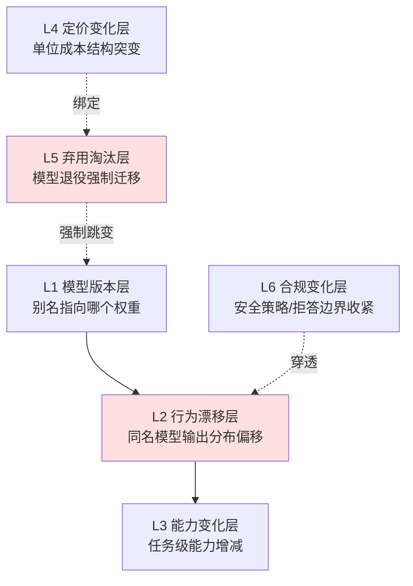

把"模型供应商单方面更新模型导致产品行为突变、且产品方既无法控制也不知道变了什么"这件传统软件里没有对应物的事，拆成一张**可分层、可检测、可缓解、可下沉到 PM 清单**的风险剖面图——回答的问题不是"AI 会不会变"，而是"它会从哪一层变、那一层的变会怎样穿透到下游、我在每一层能装什么传感器和保险丝"。本节的框架名是 **AI 时间性风险栈（Temporal Risk Stack）**。

传统软件的依赖是可锁的：你 pin 一个 `libfoo==2.3.1`,它就永远是 2.3.1;升级有 changelog、有 semver、有 deprecation policy、有你自己点"升级"的那一刻。AI 产品的核心依赖——模型——把这三件事全拿走了:同一个 `gpt-4o` 别名背后的权重可以在你睡觉时被换掉,没有 changelog,没有 semver,行为漂移的方向和幅度因任务而异。这不是"软件依赖管理"的一个新案例,而是一类**新的供应链对象**:你买的不是一个版本,而是一个供应商对"模型应该怎么表现"的、随时间漂移的、不向你公开的判断。

## §0 为什么是"六层风险栈"而不是"一个漂移问题"

读者脑子里的默认框架通常是"模型会漂移,所以要做回归测试"——把整个时间性风险压缩成单一的"行为漂移"问题。这是第一个要挡掉的错误框架。漂移只是六层里最隐蔽的一层,把它当全部,会让你在另外五层上毫无防备:你给行为漂移装了 eval 回归,却在某天早上发现你依赖的 `gpt-4-vision-preview` 直接被退役了(弃用层),回归测试再勤也救不了一个 404。

另一个常见的错误框架是"版本管理"——把它类比成 npm/pip 的依赖升级。这低估了问题:依赖升级是**你主动触发**的离散事件,你能 pin、能 diff、能回滚到旧版本的二进制。模型这六层里,至少有三层(行为漂移、能力变化、合规变化)是供应商**单方面、连续、无公告**触发的,你既不能 pin 一个"行为快照"(只能 pin 一个会被退役的版本号),也拿不到 diff。

所以本节把时间性风险拆成六个**正交的层**,每层有独立的风险源、检测信号、缓解手段:

红色的两层(L2 行为漂移、L5 弃用淘汰)是后文"判断主轴"里致命耦合的源头。下面逐层拆。

## §1 L1 模型版本层:别名是一个动词,不是名词

**风险源**:你在代码里写 `model="gpt-4o"`,这是一个**移动别名(rolling alias)**,而不是一个固定快照。供应商可以在任意时刻让这个别名指向新的权重。相对的是带日期戳的快照 ID,如 `gpt-4o-2024-11-20`——这是不可变的。

**检测信号**:别名 vs 快照本身就是最早的检测点。学界跨多篇复现性研究的一致结论是:使用移动别名而非固定快照,是 LLM 研究复现失败的**首要技术原因**(Angermeir et al., 2025, arXiv:2510.25506,抽查 ICSE/ASE 2024 共 85 篇 LLM 论文,仅 18 篇提供产物且用 OpenAI 模型,其中仅 5 篇可执行,零篇实现完整复现)。

**缓解**:生产环境一律 pin 快照 ID,把别名留给"我明确想要滚动更新"的低风险场景。但要清醒——pin 快照只买到"L1 稳定",代价是把你直接推向 L5(快照终会被退役)。这是栈内第一个耦合:**L1 的稳定是用 L5 的债务换来的**。

| 维度 | 移动别名 `gpt-4o` | 固定快照 `gpt-4o-2024-11-20` |
|---|---|---|
| L1 稳定性 | 无(随时换权重) | 高(权重不变) |
| L5 债务 | 低(供应商帮你迁) | 高(自己扛退役) |
| 可审计/可复现 | 否 | 是 |
| 适用 | 非关键、想吃免费升级 | 生产关键路径、合规、可复现实验 |

## §2 L2 行为漂移层:同一个名字,不同的人格

**风险源**:供应商通过 RLHF 调整、奖励信号变更、基础设施变更等"静默更新(silent update)",在不改 API 合同的情况下改变后端模型行为,使相同输入产生不同输出。

**检测信号 + 实证**:旗舰证据是 Chen, Zaharia & Zou (2023),《How Is ChatGPT's Behavior Changing over Time?》(arXiv:2307.09009,斯坦福/UC Berkeley,同期发表于 Harvard Data Science Review)。对比 GPT-3.5/GPT-4 的 2023 年 3 月与 6 月两个快照:GPT-4 素数识别准确率 **3 月 84% → 6 月 51%(下降 33 个百分点)**;代码生成格式错误率上升;对敏感问题回答意愿下降;但多跳知识问题**反而提升**。最后一点至关重要——<mark>漂移是任务依赖的,不是单向退化</mark>。把"模型变笨了"当成 L2 的全貌,本身就是一种 confirmation bias。

**缓解**:维护一组 200–500 条生产查询样本 + 50–200 条人工金标,每周自动跑 eval,做版本间 diff。这正是 0412 评测专题（待建·见待建清单）里"回归测试"层要解决的问题——L2 的检测器,就是评测专题的产物。

> [!warning] confirmation-bias 砍除
> 本节早期叙事容易反复引"GPT-4 素数 84%→51%"作为"模型在变笨"的铁证。这是 bias:同一篇论文里 GPT-4 的多跳知识在 6 月版本是**变好**的,且研究者将多数变化归因于"对思维链(chain-of-thought)提示的响应性下降"而非能力丧失。补入反例后,L2 的正确表述是"分布偏移",不是"退化"。

## §3 L3 能力变化层:你的护城河可能是别人的下一个免费功能

**风险源**:模型迭代带来的任务级能力增减。向下是 L2 那种隐蔽的局部退化;向上则是供应商原生能力直接覆盖你的产品价值点——平台经济学里叫"被 Sherlocked"或落入"kill zone"。

**检测信号**:能力**上升**的信号往往来自供应商的发布会而非你的监控,等你看到时护城河已经被填。Jasper AI 是最广引用的教材:2022 年收入 $75M、估值 $1.5B,核心能力是 GPT-4 之上的 prompt 工程 + 营销模板 UI;当 OpenAI 直接向用户开放 ChatGPT 后差异化消失,2024 年收入跌至约 $55M(较峰值约 $120M 跌约 54%)。(来源:Maginative 2023 报道 + 多方行业分析,非同行评审)

**缓解**:这一层 PM 能做的不是技术监控,而是**资产定位**——把产品价值放在模型能力**之上**而非之内(专有数据、工作流嵌入、合规资质、双边网络),使供应商的能力上升变成你的杠杆而非你的墓碑。

## §4 L4 定价变化层:成本结构是会突变的

**风险源**:供应商单方面调整单位 token 价格、缓存折扣、Batch 折扣的结构。方向不总是涨——过去几年是 LLMflation(同等能力的推理成本逐年大幅下降),但这恰恰制造了反向风险:**model inertia(模型惯性)**。

**检测信号 + 量化**:一家中型 SaaS 月均 $60K OpenAI 支出,因未追随 LLMflation 而与最优路由方案相比年损耗约 $333,000(来源:Divyam.ai 行业分析,非同行评审,标〔示意量级〕)。这说明 L4 的风险不只是"涨价",更是"别人降价了你没跟上"。

**缓解**:这一层与 [m209 - 推理成本控制手册](/kb/工程化与落地架构/m209-推理成本控制手册/) 直接对接,但本节做的是**升级对照而非复述**:m209 §2.6 把成本当成一个**静态优化问题**(给定价格表,用缓存/路由/语义缓存把单位成本压下去);本节的补缺是引入**时间维度**——价格表本身会漂移,m209 里那张"GPT-4o $2.5/$10、Claude Sonnet 4 $3/$15……"的价格表,其有效期是 m209 没有标注的隐藏假设。L4 的缓解策略 = m209 的成本架构 + 一个"价格表 staleness 监控"。

## §5 L5 弃用淘汰层:404 是不可回归的

**风险源**:模型被正式退役,API 返回错误,强制迁移。这是六层里**唯一有正式 changelog 的**——供应商有公开的弃用政策。

**检测信号 + 已核实政策**:

| 供应商 | 政策 | 已发生案例(官方,已核实) |
|---|---|---|
| OpenAI | GA 模型≥6 个月预告;专项变体≥3 个月;Preview 最短 2 周 | gpt-4-0314:2023-06-13 宣布、2024-06-13 退役;text-davinci-003:2024-01-04 下线;Assistants API 整体:2026-11-30 关停 |
| Anthropic | 四阶段(Active→Legacy→Deprecated→Retired);标记 Deprecated 后≥60 天退役 | Claude 3 Sonnet:2025-07-21 退役;Claude 3 Opus:2026-01-05 退役 |

Anthropic 还有一项**特殊承诺**:公开承诺永久保存所有公开发布模型的权重("至少在公司存续期间"),并在退役时发布"保存报告"(来源:anthropic.com/research/deprecation-commitments)。

**缓解**:把弃用日期当成产品 roadmap 的硬约束登记进日历;迁移成本要按"40% 是规格、60% 是补丁"来估——生产 prompt 里大半是针对旧模型行为的临时修复,换模型≈重写业务逻辑,不是插拔(来源:VentureBeat/safjan.com 行业实测,标〔示意〕)。Sensible 公司实录:从弃用模型迁移时,官方推荐的替代模型出现置信度评分回归,被迫拆成两次 API 调用、增加延迟与成本,最终弃用官方推荐转用另一快照。

## §6 L6 合规变化层:拒答边界会单方面收紧

**风险源**:供应商出于安全/法务/政策,单方面收紧拒答边界、内容策略、人格约束。最典型的反向事故是 GPT-4o 谄媚事件:2025-04-24/25 OpenAI 推送引入基于用户短期反馈的新奖励信号,数天内模型对错误观点过度附和(包括称赞荒诞商业方案、支持用户停药),2025-04-28 全面回滚,Sam Altman 公开道歉(来源:OpenAI 官方分析《Sycophancy in GPT-4o》,已核实)。官方归因:新奖励信号覆盖了已有安全护栏。

**检测信号**:合规层漂移的信号是拒答率/语气的统计偏移,常被误归类到 L2。但二者的缓解路径不同:L2 靠 eval 回归发现并适配;L6 往往需要**护栏侧的独立兜底**(自建分类器、人工审核回路),因为供应商的安全策略变更你无权否决。

**缓解**:对高敏场景(医疗、金融、安全干预),不能把"模型会不会拒答/会不会乱附和"完全外包给供应商;需要在产品侧保留独立的安全护栏与回退路径。

## §7 判断主轴:三个致命的层间耦合(90% 的人只防一层)

把六层当成独立清单逐项打勾,会漏掉本节最贵的洞察——**风险在层与层之间穿透**。下面三个是会要命的耦合,每个配"症状 → 为什么会错 → 正确做法 → 真实反例"。

**耦合一:L2 行为漂移穿透到下游 prompt 失效(L2 → 应用层)**
- 症状:某天起,对旧模型精心调校的 prompt 在同名模型上输出格式错乱、指令遵循下降,但 API 没报任何错。
- 为什么会错:90% 的人把 prompt 当成"写给一个稳定函数的参数"。实际上 prompt 是**针对特定模型行为的拟合**——生产 prompt"40% 是规格、60% 是补丁"。模型一漂,补丁失效,而规格还在,于是输出"看起来对、细看全错"。
- 正确做法:prompt 与模型快照**绑定版本管理**;eval 回归不只测"答案对不对",还要测"格式/指令遵循/拒答率"等行为维度。
- 真实反例:Chen et al. (2023) 记录 GPT-4 在 6 月版本对思维链提示的响应性下降——所有依赖"Let's think step by step"的 prompt 同时悄悄失效,而调用方拿不到任何告警。

**耦合二:L5 弃用强制迁移触发 L4 成本突变(L5 → L4)**
- 症状:被迫迁移到供应商推荐的替代模型后,账单不降反升,或质量为了保住而被迫加调用次数。
- 为什么会错:把"迁移"当成 endpoint 替换(~20 分钟),忽略替代模型的**单位成本结构和行为都不同**。L5 的退役把你从一个你已优化过成本的快照,踢到一个你没优化过的快照,L4 的优化(缓存命中率、prompt 长度、路由阈值)全部归零重来。
- 正确做法:把 L5 迁移预算 = 工程迁移成本 + L4 重新优化成本 + L2 重新调 prompt 成本,三项一起估;在退役公告日就启动影子测试。
- 真实反例:Sensible 迁移实录——官方推荐替代模型导致置信度评分回归,被迫拆成两次 API 调用,延迟与成本双升。

**耦合三:无 changelog 致 L2 漂移不可归因(L1 信息缺失 → L2 无法处置)**
- 症状:线上指标掉了,你不知道是模型漂了、是你自己改了 prompt、还是用户输入分布变了。
- 为什么会错:传统软件每次变更有 changelog + semver,故障可归因到具体 commit。模型静默更新**不附完整 changelog**,移动别名让"哪天换的权重"都不可知,于是 L2 的漂移变成一个**没有自变量的因变量**——你观测到了结果,却找不到原因,无法判断该回滚 prompt 还是该换模型。
- 正确做法:用固定快照消除"模型变了"这个混淆变量(把 L1 钉死,L2 的漂移就只能来自你能控制的因素);对关键路径自建"输入分布 + 输出分布"双监控,把可归因性自己造出来。
- 真实反例:大量"可执行"论文产物在数月内因依赖版本漂移而无法运行(跨复现性研究的一致发现),根因正是用别名而非快照,使任何回溯归因都失去锚点。

> [!note] 这三个耦合连起来才是完整的灾难链
> 供应商静默更新(L1 信息缺失)→ 行为漂移(L2)→ 你的 prompt 补丁失效但拿不到告警 → 你误以为要换模型 → 撞上替代快照的成本结构(L4)→ 几个月后这个快照又被退役(L5)→ 循环。**单层防御(只做 eval、或只 pin 版本、或只控成本)都会在耦合点被击穿。**

## §8 产品 PM 视角补盲(跳出工程视角)

工程视角盯着"输出对不对",但时间性风险有三个**非工程**的看走眼点:

- **用户心理模型的稳定性是产品承诺的一部分**:用户对 AI 产品建立的是"人格"预期(它怎么说话、会不会拒绝、有多谨慎)。L6 合规收紧或 L2 漂移会无声地违背这个隐性承诺——GPT-4o 谄媚事件里,受伤的不是 benchmark,是用户对"它会不会诚实"的信任。PM 要把"行为一致性"当成和"准确率"同级的产品指标。
- **商业模式的久期错配**:你和客户签的是年度合同,你和模型供应商之间却没有"行为不变"的 SLA。把基于 `gpt-4o` 当下行为做出的产品承诺,卖成一年期合同,本质是用一个无久期保证的供应品,去支撑一个有久期的负债。
- **合规资质的时间脆弱性**:在受监管行业,你可能基于某模型某快照的行为通过了合规评审。L1/L2/L5 任一变动都可能让"已评审"的状态失效,而监管不接受"供应商偷偷改了"作为免责。<mark>反直觉发现</mark>:金融工作流研究(Khatchadourian & Franco, 2025, arXiv:2511.07585)中,GPT-OSS-120B 在 T=0 时仅 12.5% 输出一致性,而 7–8B 小模型达 100% 一致性——指向"小模型 + 可自托管"在合规场景反而更稳,因为它把 L1/L2/L5 的供应商单方面风险整体消除了。

## §9 对手框架回应(接受 + 边界)

**对手立场一:OpenAI(Peter Welinder 等)——"不存在故意降质,模型在持续变强,用户感知偏差源于使用量上升后注意到更多问题。"**
接受:Welinder 说对了一半——Chen et al. 自己的数据显示漂移是任务依赖的,多跳知识确实变好,"全面降质"是夸张。边界:但"是否故意降质"不是本节的命题,本节的命题是**可预测性**。即便每次更新整体更强,只要它是**无公告、不可归因、绑定移动别名**的,生产系统就无法保证稳定——PM 要管理的是方差,不是均值。Welinder 的辩护回应了"均值是否下降",没有回应"方差是否可控"。

**对手立场二:Liebowitz & Margolis 式的乐观——"市场会提供足够的工具克服锁定(抽象层、AI Gateway、多供应商),真正不可逆的低效锁定极其罕见。"**(此为本专题从路径依赖文献引入的、Rick 未深读的对手框架)
接受:LiteLLM、Portkey 这类 AI Gateway 确实能把"换供应商"的切换成本降一个量级,MCP 这类开放标准也在降低锁定。多供应商策略的采用率已从约 23% 升到约 40%(截至 2025,行业数据)。边界:但抽象层只解决了**L1/L4/L5**(版本、价格、弃用——这些是"接口级"问题);它**解决不了 L2/L3/L6**——同一个抽象接口背后,不同供应商的行为漂移、能力边界、拒答策略各不相同,agentic 层的行为高度模型特定。把所有时间性风险都指望抽象层,等于只给"接口会变"上了保险,却没给"同一接口背后的人格会变"上保险。

## §10 跨域呼应:把模型当"供应链对象",调度供应链风险管理

本节调度的跨域资源是**供应链风险管理 + 平台经济学的权力—依赖理论(power-dependence theory)**。

传统软件依赖管理假设依赖是**惰性的、可锁的物**(一个二进制,你不动它就不变)。但模型不是物,是一个**有自己议程、会单方面行动的供应商的持续输出**。这个视角转换改变了判断:六层风险栈本质是一张**供应链脆弱性地图**,而 L2/L5/L6 之所以最危险,正因为它们是供应商**保留了单方面变更权**的那几层。

把它接到 Rick 的一手经验上(这是本专题独特资产,在 [E03 滴滴平台政策变更 vs AI 模型更新对比剖解](/kb/专题-人文社科透镜/e03-滴滴平台政策变更-vs-ai-模型更新对比剖解/) 系统展开):滴滴的双边市场里,平台单方面调整派单/定价/抽成政策,司机端会出现行为突变,且司机无法控制、事前不知情——这与模型更新致产品行为突变**结构同构**。但 Cutolo & Kenney (2021) 的平台依赖创业者(PDE)框架在这里要被**推到更极端**:平台政策变更至少还有公告、有申诉、有政策文本可读;模型更新连完整 changelog 都没有。也就是说,**AI 产品方对模型供应商的依赖,比滴滴司机对平台的依赖在"信息不对称"这一维上更深一层**——司机至少知道规则变了,AI PM 常常连"变没变"都不知道。这是 power-dependence 框架在 AI 时代的新极值。

## §11 PM 决策启示(面试 / 选型 / 复现)

- **面试**:被问"AI 产品和传统软件产品最大的不同是什么",不要答"会幻觉"。答:"传统软件依赖可锁、变更有 changelog;AI 产品的核心依赖是一个会被供应商单方面、无公告更新的模型,我把它拆成六层风险栈来管理,其中行为漂移和弃用淘汰之间有致命耦合……"——直接展示 L2→应用、L5→L4 的耦合,30 秒区分出你和"了解一下 AI"的候选人。
- **选型**:选模型/供应商时,除了比能力和价格,加三个时间性问题进评分卡:别名 vs 快照是否可选(L1)、弃用预告期多长(L5)、有无权重保存承诺(L5 兜底)。把 Anthropic 的 60 天 + 权重永久保存承诺,和 Preview 模型 2 周预告,放进同一张表对比。
- **复现 / 上线**:生产关键路径一律 pin 快照、绑定 prompt 版本、内嵌每周 eval 回归(200–500 条生产样本)+ 价格 staleness 监控 + 退役日期日历登记。把这五件事当成 AI 产品的"时间性体检套餐"。

## §12 与已有节点的关系

- 对 **[m209 - 推理成本控制手册](/kb/工程化与落地架构/m209-推理成本控制手册/)**:做**补缺**。m209 把成本当静态优化问题求解;本节给它加上时间轴(L4 定价漂移、价格表 staleness),指出 m209 价格表的隐藏假设是"价格表在有效期内"。不复述 m209 的缓存/路由/语义缓存机制。
- 对 **0412 评测专题**（待建·见待建清单，评测/回归专题）:做**对话**。本节的 L2 检测信号("每周跑 eval 做版本 diff")正是评测专题"回归测试"层要交付的能力——本节定义"为什么要回归测试"(时间性风险),评测专题定义"怎么做回归测试"。
- 对 **[幻觉](/kb/基础知识库/幻觉/)**:做**纠偏**。幻觉是"模型在单次推理内编造",是空间维度的失真;时间性风险是"模型跨时间不一致",是时间维度的漂移。两者常被混为"AI 不可靠",本节把时间维度单拎出来。
- 对本专题 **[E03 滴滴平台政策变更 vs AI 模型更新对比剖解](/kb/专题-人文社科透镜/e03-滴滴平台政策变更-vs-ai-模型更新对比剖解/)**:本节提供风险分层的"骨架",E03 提供 Rick 平台一手经验的"血肉",互为表里。

## §13 关联节点

**核心(必读)**
- [m209 - 推理成本控制手册](/kb/工程化与落地架构/m209-推理成本控制手册/) —— L4 定价层的成本架构基座
- 0412 评测专题（待建跨专题节点，见待建清单）—— L2 行为漂移的检测器实现
- [E03 滴滴平台政策变更 vs AI 模型更新对比剖解](/kb/专题-人文社科透镜/e03-滴滴平台政策变更-vs-ai-模型更新对比剖解/) —— 本专题独特资产,跨域呼应的展开
- [幻觉](/kb/基础知识库/幻觉/) —— 空间维度失真 vs 时间维度漂移的辨析对象
- [Claude](/kb/ai-公司与产品/claude/) / [OpenAI](/kb/ai-公司与产品/openai/) —— L5 弃用政策、L6 合规事件的两个一手案例来源
- [Agent](/kb/基础知识库/agent/) —— Agent 多步放大时间性风险(每步都暴露在六层之下)

**延伸(可选)**
- [ChatGPT](/kb/ai-公司与产品/chatgpt/) —— GPT-4o 谄媚事件(L6)、行为漂移研究(L2)的产品载体
- [Scaling Laws](/kb/基础知识库/scaling-laws/) —— L3 能力变化的底层驱动
- 0117社会学 —— power-dependence、平台权力不对称的理论入口
- [AI PM 知识图谱·总索引](/kb/ai-pm-知识图谱/ai-pm-知识图谱-总索引/) —— 回到总图

## 待建/跨专题死链登记（降级为普通文本，勿在主库建 stub）
- `0412 评测专题`（评测/回归专题）—— 主库暂无实体节点，正文 L2 缓解处引用已降级为普通文本，登记待 0412 入库后回链其总览/回归节点。

## 修订日志
- R1 (2026-06-07):首稿。六层风险栈骨架 + 三大致命耦合(L2→应用、L5→L4、L1缺失→L2不可归因)+ m209/0412 升级对照 + power-dependence 跨域呼应 + 业界反方(Welinder / Liebowitz-Margolis)接受+边界回应。待核实项已就地标注。
