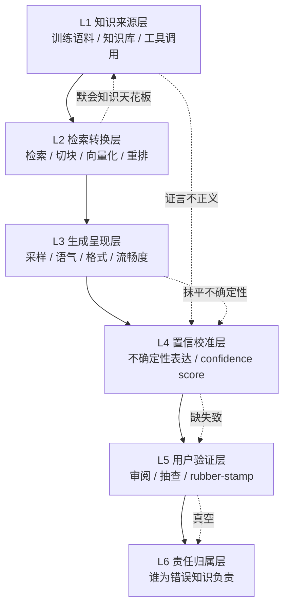

当用户读一份 AI 报告时，他到底在跟"知识"打交道，还是在跟"知识的统计模拟"打交道？这个问题不是哲学清谈——它决定了你的产品要不要做 confidence display、要在哪一层插 citation、human-in-the-loop 的触发条件应该绑在哪个变量上。本节点提出一个**六层认识论中介剖面**（知识来源 → 检索转换 → 生成呈现 → 置信校准 → 用户验证 → 责任归属），把"AI 在用户与知识之间插入了一个什么性质的中介"拆成可解剖、可定位故障、可下产品决策的分层结构。核心论点：**真正杀死知识质量的不是任何单层的缺陷，而是层与层之间的认识论耦合——上一层悄悄抹掉的不确定性，下一层无从恢复，最后在用户那里坍缩成一个无人负责的"确定事实"。**

## §0 为什么是"六层中介"而不是"AI 准不准"

业界默认框架是**二元的**："AI 说得对 / AI 说得错"，于是产品做法就是堆 benchmark 分数、做事实核查、加免责声明。这个框架的致命错误在于：它把 AI 当成一个**单一的知识源**来评判，而 AI 实际上是一条**认识论传递链**——它从某处取来证言，做了若干次转换，用某种语气呈现，再交给一个注意力有限的人去"审"。链条上每一环都在改变信息的认识论地位（epistemic status），而二元框架对这些中间环节完全失明。

第二个候选框架是 Don Ihde 后现象学的**人技关系四类型**（具身 / 解释学 / 他者 / 背景，*Technology and the Lifeworld*，印第安纳大学出版社，1990）。它比二元框架深刻得多——它问的是"技术如何中介人与世界的关系"，而不只是"技术准不准"。但四类型框架是**横向分类**（一次交互属于哪一类），不是**纵向分解**（一次交互内部经过哪些层）。对 PM 来说，我们需要的是后者：能在某一层定位故障、下某一层的设计决策。

所以本节点的剖面是 Ihde 的精神（中介改变认识论关系）+ 工程的解剖学（可替换的分层堆栈）。它把"AI 是认识论中介"这个判断，从一句哲学口号，落成一张能贴在评审会墙上的故障定位表。这是 [0427 知识系统专题](/kb/专题-人文社科透镜/_信息检索与知识系统系统化专题-总览/) 的"知识产品"层和 [0418 审阅瓶颈专题](/kb/专题-评测与度量/_审阅瓶颈系统化专题-总览/) 的"审阅机制"层之下的**认识论哲学层**——前两者问"怎么做产品机制"，本层问"这些机制中介的到底是不是知识"。

## §1 六层中介剖面：每层的认识论问题 + 产品含义

| 层 | 认识论问题 | 经典坐标 | 产品设计含义 |
|---|---|---|---|
| **L1 知识来源** | 训练语料/知识库本身是谁的证言？谁被边缘化？这是 testimony 还是噪声？ | Goldman 真值社会认识论（*Knowledge in a Social World*, OUP, 1999）；Fricker 证言性不正义（*Epistemic Injustice*, OUP, 2007） | 语料审计、来源覆盖率分层、对低资源语言/边缘群体的可靠性单独评估 |
| **L2 检索转换** | 把语料切块、向量化、检索，丢掉了什么？默会的、集体性的知识进得了向量库吗？ | Collins 集体性默会知识（*Tacit and Explicit Knowledge*, 芝加哥大学出版社, 2010）；Polanyi "We can know more than we can tell"（*The Tacit Dimension*, 1966） | RAG 召回率有原理性天花板；要标注"本系统不覆盖的知识类型" |
| **L3 生成呈现** | 流畅的自然语言把概率分布压成了一个确定句子——句法的流畅是否伪装成了语义的确定？ | Searle 中文屋（"Minds, Brains, Programs", *BBS* 3(3), 1980）；Humphreys 认识不透明性（*Extending Ourselves*, OUP, 2004） | 生成层默认抹平不确定性；这是 confidence display 必须对抗的对象 |
| **L4 置信校准** | 系统对"我有多确定"的自我报告，是否对应它实际的可靠性？ | 校准理论 / process reliabilism（Goldman, "What is Justified Belief?", 1979）；computational reliabilism（Durán & Formanek, arXiv:1904.01052, 2019〔arXiv 已核实〕） | confidence score 是否校准是 human-in-the-loop 触发条件的核心变量 |
| **L5 用户验证** | 用户"审阅"AI 输出，是在独立检验（verification）还是在盖橡皮图章（rubber-stamping）？ | 适当依赖（Lee & See, "Trust in Automation", *Human Factors* 46(1), 2004）；自动化自满（Parasuraman & Manzey, *Human Factors* 52(3), 2010） | 验证瓶颈是真瓶颈；UI 要逼出独立判断而非确认偏误 |
| **L6 责任归属** | 当 AI 中介的知识出错，谁的信念出了错？谁负责？ | Verbeek 道德中介（*Moralizing Technology*, 芝加哥大学出版社, 2011）；Freiman "技术性信念"（*Episteme*, 2023〔Cambridge 条目已核实〕） | 责任真空会让 L5 退化为形式；要设计可审计日志 + 明确归责协议 |

每层都不是知识本身，而是**对知识的一次重新中介**。用户拿到的从来不是 L1 的原始证言，而是经过 L2–L4 五次转换后的产物——这正是"用户获得的是知识还是知识的模拟"这个问题的结构性答案：**取决于这条链在哪一层、以何种方式改变了信息的认识论地位。**

## §2 判断主轴：三个层间致命耦合（四件套）

这是本节点的命门。单层缺陷可以修；**层间耦合是系统性的、难以从任一层局部修复的认识论故障**。下面三个耦合直接决定了 confidence display / citation / human-in-the-loop 的设计成败。

### 耦合一：L3 生成层抹平 L1 来源的不确定性 → 用户高估知识地位

- **症状**：AI 用同样流畅、同样自信的语气，说出"巴黎是法国首都"和一个训练语料里只出现过两次、来源存疑的冷门论断。用户读不出二者认识论地位的天壤之别。
- **为什么会错**：生成层（L3）的本质是把一个概率分布**采样并压成一个确定的自然语言句子**。流畅度（fluency）是语言模型的优化目标，而流畅度在人类的认知里是**可信度的强启发式**——我们天然把"说得顺"当成"知道得清"。Searle 的中文屋点破了这一层：句法操纵（说得对）不等于语义理解（真的知道）。生成层是一台把句法流畅伪装成语义确定的机器。
- **正确做法**：confidence 不能在 L4 才"补"，因为 L3 已经把来源的方差信息丢了。必须把 L1 的来源强度**穿透**到 L3 的呈现——例如对低支撑度的论断强制降低语气确定性、强制带 citation、或拒绝生成。这是"citation 系统应该插在哪一层"的认识论答案：**插在 L1→L3 的穿透通道上，而不是 L3 之后的事后标注。**
- **真实反例**：检索增强（RAG）系统给出带引用的答案，但引用是生成后"贴"上去的——模型先生成结论再去找看起来相关的来源，citation 与实际推理路径无关。这是典型的 L3 抹平后 L4 假装恢复，用户看到引用反而**更**信任（"explainability theater"效应；Renieris et al., *MIT Sloan Management Review*, 2025〔已核实〕）。引用在这里不是恢复了认识论地位，而是给模拟盖了个真章。

### 耦合二：L4 校准层缺失 → L5 退化为 rubber-stamping

- **症状**：产品上线了"人在回路"，每份 AI 报告都有人"审过"。但实测准确率没有提升，错误照样流出——审阅成了形式。
- **为什么会错**：L5 用户要做真正的 verification，前提是 L4 给了他**可分辨的信号**——哪些部分系统自己也没把握。如果 L4 缺失或不校准（系统对所有内容都显示同样高的置信，或干脆不显示），用户面对的是一片**均匀的确定性**，他无从知道该重点查哪里。于是注意力有限的人类只能整体性地"信"或"不信"，而在高可靠性历史的诱导下，默认就是信——这就是 Parasuraman & Manzey（2010）的自动化自满：系统越可靠，监视注意力越分散。Huemmer et al.（arXiv:2601.17055, 2026〔arXiv 已核实〕）的纵向实证给出了刺眼的数字：对困难任务的 AI 依赖率 73.9%，对输出的验证置信度反而下降 68.1%，实际准确率 47.8%，信念-表现差距扩大至 34.6 个百分点——"verification, not solution generation, became the bottleneck"。
- **正确做法**：human-in-the-loop 的触发条件**必须绑定在 L4 的校准信号上**，而不是绑在"是否重要"这种静态规则上。低置信、来源冲突、超出训练分布的内容才强制人工审；高置信、强支撑的内容放行。把人的稀缺注意力配置到系统自己都不确定的地方——这是把 L4 从"装饰性进度条"变成"注意力路由器"的设计原则。
- **真实反例**：荷兰儿童福利算法案、澳大利亚 Robodebt 案——制度上都有"人在回路"，但认识论上监督已失效（Renieris et al., 2025；治理文献 arXiv:2512.13768, 2025〔arXiv 已核实〕）。程序合规（procedural compliance）≠ 认识论有效（epistemic efficacy）。审批栏里的签名是真的，被签的判断是空的。

### 耦合三：L6 归责真空 → 无人为错误知识负责，反向掏空 L5 的动机

- **症状**：AI 报告出错造成损失，复盘时发现：模型供应商说"我们只是工具"，产品方说"有人审过"，审阅者说"我信任了系统的置信度"。错误知识有受害者，没有责任人。
- **为什么会错**：L6 不是 L5 之后的"事后追责环节"，它**反向决定** L5 的认真程度。当审阅者知道签字不会让自己承担实质责任（因为责任会沿链条扩散到消失），rubber-stamping 就成了理性选择——花精力做真验证是纯成本、无收益。Verbeek 的道德中介（2011）说的正是：技术通过设计在道德层面中介人的行为，谁设计了归责结构，谁就在塑造审阅者会不会认真。而 AI 作为证言者有个特殊的认识论缺陷：Freiman（2023〔已核实〕）论证，从 AI 获得的信念既非仪器性也非证言性，而是新的"技术性信念"——因为传统证言理论以**说话者可被问责**为前提，AI 恰恰缺这个前提。证言链上本该有的"谁说的、谁负责"在 AI 这里断了。
- **正确做法**：归责不能靠事后,要在设计时就**物化进系统**——可审计日志（谁在什么置信度下放行了什么）、明确的归责协议（哪一层的错误归哪一方）、以及把审阅者的判断**记录为有认识论后果的行为**而非一次点击。EU AI Act（2024）要求高风险系统支持"有效的人类监督"——但如何把这条法律要求翻译成 L4→L5→L6 的认识论闭环，学界尚无共识〔此为综合判断，非单一来源结论〕。
- **真实反例**：医疗 AI 辅助诊断中，最终签字的是医生，但医生面对的是一个不透明、不校准、且"通常很准"的系统。当系统在罕见病上出错（恰恰是它最不该被信任、却显得最自信的地方），责任全压在医生身上——而医生根本没有被给予可分辨的拒绝信号。这是把 L1–L4 的系统性缺陷，通过 L6 的归责设计，转嫁给了链条末端最无力的人。

> [!warning] 三个耦合是同一条裂缝的三段
> L3 抹平不确定性 → L4 无信号可校准 → L5 无处可验证 → L6 无人可归责。这不是四个独立问题，是**不确定性信息在传递链上被逐层蒸发**的同一个过程。任何只修单层的方案（只加 citation、只加 confidence bar、只加审批流）都会被相邻层的耦合吃掉。**confidence 必须从 L1 一路穿透到 L6，否则它在任何一层都是装饰。**

## §3 产品 PM 视角补盲：三个不在工程视野里的坑

工程视角会把这套剖面理解成"加几个不确定性估计模块"。但认识论中介的失效更多发生在**用户心理**和**商业激励**里：

1. **用户心理模型坑**：用户对 AI 的信任不是理性校准的，是**延展心智**式的——Clark & Chalmers（"The Extended Mind", *Analysis* 58(1), 1998）说外部工具一旦满足"持续可获取、自动认可、易于提取"，就被当成自己认知的一部分。AI 一旦被用户内化为"我的大脑的延伸"，他就不会再审它，正如你不会审自己的记忆。这意味着 confidence display 要对抗的不是无知，是**已经发生的认知融合**。Adams & Aizawa 的"联接-构成谬误"批评提醒我们这只是功能等价而非真融合——但用户的主观体验不在乎这个区分。
2. **商业模式坑**：流畅、自信、无摩擦的输出**卖得更好**。每一个 confidence display、每一次"我不确定"、每一个 human-in-the-loop 拦截，都在增加摩擦、降低"魔法感"。L3 抹平不确定性不只是技术默认，是**商业激励**——诚实的不确定性是反增长的。这是为什么校准层往往是产品里第一个被砍的功能。
3. **合规边界坑**：在 DiDi/99 这类安全 + 国际化场景里，L1 的来源不正义（某些语言/区域的语料系统性稀薄）会变成跨市场的**可靠性鸿沟**——同一个 AI 客服在中文区可靠、在某小语种区不可靠，但呈现层（L3）给两者同样的自信。这既是 Fricker 证言性不正义的算法版本，也是实打实的合规与品牌风险。

## §4 对手框架回应：接受 + 边界

**对手立场（人机互补论 / computational reliabilism）**：Durán & Formanek（2019〔arXiv 已核实〕）主张计算过程的输出可被信任**无需透明性**，只需满足四类可靠性依据（验证程序、鲁棒性分析、历史成功记录、专家判断）。引申到本节点：你这套"穿透不确定性"的执念可能是错的——只要系统在历史上可靠，用户就**应当**信任它，纠结每一层的认识论地位是不必要的洁癖。

**接受的部分**：对。要求用户理解 L1–L6 每一层才肯信任，在实践中等于瘫痪——人本来就在大量地、合理地依赖不透明的可靠系统（没人审计自己的计算器）。computational reliabilism 正确地指出：可靠性可以替代可解释性，CR 给了"不透明但可信"一个严肃的认识论辩护。

**坚持的边界与赌注**：CR 的四依据里有一条是**"历史成功记录"**——而这恰恰在 AI 最危险的地方失效：分布漂移（distribution shift）下，历史可靠不预测当前可靠，且 LLM 的失败模式是**无征兆的**（它在最不可靠时最自信，校准恰恰是反的）。Durán 等人 2026 的后续工作（*Minds and Machines*, Springer〔条目已核实〕）自己也承认 update opacity 是未解问题。所以我赌：**在校准被解决之前，"可靠性替代透明性"对 AI 不成立**——因为用户无法分辨"历史可靠所以现在可信"和"历史可靠但现在已漂移"。CR 适用于行为稳定、失败有征兆的传统计算；不适用于一个会在罕见情形里流畅地、自信地编造的系统。这正是 [c13 - 幻觉的不可消除性](/kb/基础知识库/c13-幻觉的不可消除性/) 的认识论后果在中介链上的投影。

## §5 跨域呼应：维特根斯坦的"语言游戏边界"为什么是 L3 的诊断工具

调度 0601 维特根斯坦 后期的语言游戏（language-games）框架——不是装饰，而是它直接改变了我们对 L3 生成层的判断。

维特根斯坦后期主张：词的意义在于它在某个生活形式（form of life）中的**用法**，而非它对应的内在表征。一个句子是否"有意义"、是否"算作知道"，取决于它是否在一个有规则、有后果、有共同体校验的语言游戏里被正确使用。把这个标准对准 L3：LLM 生成的句子在**句法游戏**里完美合规——它遵守了语法、搭配、语域的全部规则。但它有没有进入"断言"（assertion）这个语言游戏？断言这个 speech act 自带一个内置承诺：说话者**为真负责、准备好被追问理由**（speech act theory 的 sincerity condition）。LLM 的"断言"缺这个承诺——它不为真负责，被追问理由时会再生成一段流畅的理由（可能与原结论的真实"推理"无关）。

这给了 L3 一个**可操作的诊断**：AI 的流畅输出是在玩"模仿断言外观"的游戏，而不是在玩"断言"的游戏。两者句法无法区分，语用后果天差地别。**用户验证（L5）的本质，就是把一个本不在断言游戏里的东西，强行拉回断言游戏——给它补上一个会负责的人。** 维特根斯坦让我们看清：confidence display 不是在"显示一个数字"，而是在标记"这个句子在哪个语言游戏里"——它到底是被断言的，还是被模拟出断言外观的。这也回应了本专题的总问题：用户获得的是知识还是知识的模拟，取决于 L3 生成的句子进没进入"为真负责"的语言游戏。

## §6 PM 决策启示

- **面试**：被问"你怎么设计 AI 报告产品的可信度机制"，不要答"加个 confidence 分数"。答："可信度不是一个层的功能，是一条穿透链。我会画六层中介剖面，指出三个致命耦合，然后说明 confidence 必须从来源层穿透到归责层——单独加任何一层都会被相邻层吃掉。" 30 秒展示你看的是系统不是 feature。
- **选型**：评估 RAG / Agent 供应商时，别比召回率。比这三个：(1) citation 是生成前穿透的还是生成后贴的（耦合一）；(2) confidence 是否校准、能否驱动路由（耦合二）；(3) 有没有可审计的归责日志（耦合三）。把这三问打印出来带进选型会。
- **复现**：自己搭最小系统时，第一个要测的不是"准不准"，而是"它在错的时候自不自信"——画一张 confidence vs. accuracy 的校准曲线。如果曲线是反的（错时更自信），你的 L4 是负资产，L5 的人会被它误导得比没有它还糟。

## §7 与已有节点的关系

- 对照 [c13 - 幻觉的不可消除性](/kb/基础知识库/c13-幻觉的不可消除性/)：c13 在**模型架构层**论证幻觉为何不可消除（Softmax 强制输出 + 概率采样 + RLHF 对齐税 + 校准反向）。本节点不复述这些机制，而是做**升级对话**——把"幻觉不可消除"这个单点结论，沿六层中介链**展开**为一个传递问题：幻觉在 L3 被生成，在 L4 因校准缺失而无法标记，在 L5 因自满而未被拦截，在 L6 因责任真空而无人负责。c13 回答"为什么会有错的知识"，本节点回答"错的知识如何穿过中介链坍缩成用户的'事实'、且无人负责"。
- 对照 [0418 审阅瓶颈专题](/kb/专题-评测与度量/_审阅瓶颈系统化专题-总览/)：0418 在**产品机制层**研究审阅为何是瓶颈、怎么做审阅产品。本节点是其**认识论地基**——L5 用户验证层的 verification vs. rubber-stamping 区分，正是 0418 全部机制设计的哲学前提。做补缺：0418 假设"审阅是有意义的"，本节点追问"审阅在什么认识论条件下才有意义"。
- 对照 [0427 知识系统专题](/kb/专题-人文社科透镜/_信息检索与知识系统系统化专题-总览/)：0427 在**知识产品层**研究 RAG / 知识库怎么做。本节点的 L1/L2 层把它的"L1 覆盖率天花板"升级为认识论命题（[Polanyi 默会知识与提示工程的认识论张力](/kb/基础知识库/polanyi-默会知识与提示工程的认识论张力/) 的集体性默会知识无法进向量库），做对话与深化。

## §8 关联节点

**核心（必读）**
- [c13 - 幻觉的不可消除性](/kb/基础知识库/c13-幻觉的不可消除性/)——本节点 L3/L4 的模型架构地基
- [Polanyi 默会知识与提示工程的认识论张力](/kb/基础知识库/polanyi-默会知识与提示工程的认识论张力/)——L2 检索转换层的认识论天花板
- 0114认识论——校准、可靠主义、盖梯尔问题的总入口
- 0601 维特根斯坦——L3 诊断工具（语言游戏 / 断言的 speech act）
- [RAG](/kb/基础知识库/rag/)——耦合一（citation 穿透 vs 事后贴）的工程载体

**延伸（可选）**
- [Agent](/kb/基础知识库/agent/)——多步工具调用使中介链变长、归责更难
- [幻觉](/kb/基础知识库/幻觉/)——L3 生成层故障的概念条目
- [0427 知识系统专题](/kb/专题-人文社科透镜/_信息检索与知识系统系统化专题-总览/)·[0418 审阅瓶颈专题](/kb/专题-评测与度量/_审阅瓶颈系统化专题-总览/)——产品机制层的姊妹专题
- 0117社会学——证言不正义、知识权力的社会学入口

## §9 待建概念清单（死链降级登记，勿在主库建 stub）

以下双链目标经判断**可能尚未在主库存在**，本节点已降级为普通文本，登记待建，绝不在主库建概念卡/人物卡：
- 「Goldman 真值社会认识论」——主库 0114认识论 内有「社会认识论」概念条目（无独立节点），无 Goldman 人物卡（降级为正文文本）
- 「Searle 中文屋」「Humphreys 认识不透明性」「Fricker 证言性不正义」「Collins 集体性默会知识」「computational reliabilism」「自动化自满 / 适当依赖」——均以正文文本承载，待 0431 专题同级节点（A 概念辨析层）建成后回链
- ~~「0418 审阅瓶颈专题」「0427 知识系统专题」~~——已迁入 final_path（2026-06-11 P3.4 校链核实），本节「延伸」段已用真实 basename 双链 [0418 审阅瓶颈专题](/kb/专题-评测与度量/_审阅瓶颈系统化专题-总览/) / [0427 知识系统专题](/kb/专题-人文社科透镜/_信息检索与知识系统系统化专题-总览/)，不再是待建项

## 修订日志
- R1（2026-06-07）：首稿。建立六层中介剖面 + 三个层间致命耦合（四件套）+ 维特根斯坦语言游戏诊断 + computational reliabilism 对手回应 + 与 c13/0418/0427 升级对照。arXiv ID（1904.01052 / 2601.17055 / 2512.13768）及 Searle/Goldman/Fricker/Verbeek/Ihde/Clark-Chalmers 等坐标依据接地证据包，标注核实状态；待核实项见正文〔〕标记。
- 2026-06-11 P3.4 校链：核实 0418/0427 已迁入 final_path，§9 待建清单内「0418/0427 staging 占位」注解删除（延伸段实际已是真实 basename 双链）；§9「Goldman 社会认识论」等概念无独立节点、保持正文文本不建 stub。
