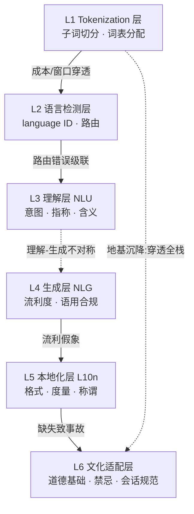

一个多语言 AI 产品的"非英语用户体验差"到底坏在哪一层？这是本节要解决的问题。绝大多数 PM 把它当成"翻译质量问题"——以为换个更好的翻译模型、加几条本地化文案就能补齐。这是把**六个独立的、会相互穿透的失败层**压缩成了一个。本节提供的框架是：把多语言 LLM 产品拆成 **tokenization → 语言检测 → 理解（NLU）→ 生成（NLG）→ 本地化 → 文化适配** 六个可独立诊断、可独立失效、且**层间存在致命耦合**的剖面，每层给出语言学陷阱与 PM 清单。命门不在任何单层，而在层间耦合：底层的 token 溢价会**穿透**到所有上层，把成本、质量、合规一次性拖垮。

## §0 为什么是"六层剖面"而不是"翻译管道"

读者脑中的默认框架通常是两个，都得先挡掉。

**默认框架一：翻译管道（Translation Pipeline）。** "用户输入 X 语 → 翻成英语 → 英语模型处理 → 翻回 X 语"。这个框架在 2019 年的 NMT 时代是对的，但对今天的端到端多语言 LLM 是错的——因为现代 LLM **不显式翻译**，它在内部表示里隐式地"路过英语"（见 §3、§4）。把它当翻译管道，你会去优化翻译模块，而真正的损耗发生在 tokenizer 和内部表示里，那两个地方你的翻译模块根本碰不到。

**默认框架二：i18n/L10n 二分（国际化 vs 本地化）。** 这是 Rick 在 DiDi/99 最熟的传统软件框架：i18n 是把硬编码字符串抽成资源文件，L10n 是填各语言译文。它对 UI 字符串成立，但对**生成式内容**完全失效——LLM 的输出不是从资源文件里取的，是现场生成的，你没有一个"译文表"可以审。i18n/L10n 假设内容是有限、可枚举、可预审的；生成式 AI 的内容是无限、不可枚举、运行时才存在的。

**为什么是六层：** 选择标准是"每一层有独立的语言学失效机理 + 独立的可观测指标 + 独立的 PM 干预手段"。Tokenization 失效机理是子词压缩率（fertility），指标是 token/字符比，干预手段是选 tokenizer/词表；文化适配失效机理是道德基础与会话含义的文化差异，指标是跨文化 STS 评测，干预手段是 RLHF 数据与红队。把它们混成一层，你就失去了"坏在哪、谁负责、怎么测"的分辨率。这正是本剖面相对传统翻译管道**升高的抽象层**：从"内容流水线"升到"失效面分层 + 耦合拓扑"。

> [!note] 与 [c02 - Tokenization 与词表工程](/kb/基础知识库/c02-tokenization-与词表工程/) 的分工
> c02 把 tokenization 当作一个**独立技术专题**讲透（BPE 机制、词表演化、三重产品影响）。本节点不复述这些——本节点的增量是把 tokenization 放回**六层产品栈**里，论证它如何**向上穿透**到其余五层，成为整个多语言产品的"地基沉降"。c02 回答"tokenization 是什么"，S01 回答"tokenization 的债怎么传染给整个产品"。

## §1 六层剖面全景

下表是每层的"失效机理—指标—PM 干预"三件套，是本节点的骨架：

| 层 | 语言学失效机理 | 可观测指标 | PM 干预手段 |
|---|---|---|---|
| **L1 Tokenization** | 词表英语偏向→非英语子词碎片化 | fertility（token/词）、token 溢价倍数 | 选 tokenizer/词表大小、按字符而非 token 计 chunk |
| **L2 语言检测** | 短文本/混码（code-switch）/方言误判 | 语言 ID 准确率、混码召回 | 显式语言参数、置信度阈值、人工兜底 |
| **L3 理解 NLU** | 含义（implicature）、指称、意图跨语言衰减 | 含义理解基准、意图分类 F1 | CoT+Gricean 推断、平行数据微调 |
| **L4 生成 NLG** | 流利≠正确；语用违规（详略/语气） | Quality 违规率（幻觉）、详略偏差 | system prompt 约束详略、不确定性标注 |
| **L5 本地化 L10n** | 数字/日期/货币/称谓/语法性别 | 格式正确率、称谓得体率 | 结构化模板、locale 参数、约束生成 |
| **L6 文化适配** | 道德基础、禁忌、会话规范差异 | 跨文化偏差基准（BBQ/MFQ-2） | 文化红队、本地 RLHF、合规审查 |

## §2 L1 Tokenization 层——地基沉降

这是整个剖面的地基，也是唯一一个**会沉降并拖垮上面所有楼层**的层。机理见 [c02 - Tokenization 与词表工程](/kb/基础知识库/c02-tokenization-与词表工程/) 与 [Tokenization](/kb/基础知识库/tokenization/)，此处只讲穿透。

非英语存在系统性 **token 溢价**（同义内容相对英语所需 token 数之比）。已发表数据：Petrov et al.（NeurIPS 2023，arXiv:2305.15425）在 FLORES-200 平行语料、17 种 tokenizer 上测得跨语言长度差**最高达 15 倍**；Ahia et al.（EMNLP 2023）发现溢价与该语言地区的 HDI **负相关**——越不发达地区的语言越贵。低资源语言可达 4–5×（泰卢固语、阿姆哈拉语，GPT-3.5）甚至 19.09×（掸语，GPT-2/3，Churchill & Skiena 2026，arXiv:2601.13328）。CJK 因逻辑文字、无空格边界，主流英语词表下近乎 1 字符=1 token：句子"人工智能正在重塑全球的信息基础设施"（16 汉字）在 GPT-4 tokenizer 下 19 tokens，在 Qwen tokenizer 下仅 6 tokens，差 3.2×（来源：TechFlow 2026 实测）。

**穿透机理**——这是 PM 必须刻进脑子的因果链：

1. **穿透成本（L1→全栈）：** token 数翻倍 → API 计费翻倍（Lundin et al. 2025 "The Token Tax"，arXiv:2509.05486：2× fertility 语言实际成本从 $5–20/百万 翻到 $10–40/百万）。训练侧因 Attention 的 O(n²) 缩放，token 翻倍 → 成本**约翻 4 倍**。
2. **穿透有效窗口（L1→L3）：** 同样 128k 上下文，高溢价语言能装进的"真实信息量"显著缩水。这直接削弱 L3 的理解——不是模型不懂，是同样的预算下它能看到的上下文更少。
3. **穿透质量（L1→L3/L4）：** Lundin et al. 在 16 种非洲语言上测得，每多 1 token/词，准确率下降 **8–18 个百分点**，整体落后英语约 **25 个准确率点**。

> [!warning] 致命耦合 #1：tokenization 成本穿透到所有非英语用户
> 这是本剖面第一个、也是最隐蔽的致命耦合。症状：巴西/拉美业务的 AI 功能"单位成本莫名比国内高 1.5–2 倍，且上下文经常不够用"。为什么会错：PM 在国内（中文/英文）做完单位经济测算，直接乘以汇率推到拉美，**没有把 fertility 差异计入**。正确做法：成本预算必须**语言敏感**——用 GPT/Claude 时，葡语/西语按英语 1.2–1.6× 规划 token 预算（西语 fertility 约 1.3–1.6×；巴西葡语在旧词表 Llama-2 下可达 1.8–2.5×，Llama-3 128K 词表、Qwen 2.5 词表 151,936 后大幅改善）。真实反例：社交媒体盛传"中文 prompt 省 40% token"，Ren et al.（2026，arXiv:2604.14210）实测三个模型反而中文更贵（MiniMax 中文贵 1.28×、GPT-5.4-mini 贵 1.09×）——溢价由 tokenizer 设计而非语言本身决定，照搬"民俗结论"会算错预算。

## §3 L2 语言检测层——级联放大器

语言检测（language ID）是路由的前置：检测错 → 后面全错，且错误**不可见**（用户只看到"答得不对"，看不到"路由到了错的语言链路"）。

三个语言学陷阱：**短文本**（一两个词无法判定语言）、**混码 code-switching**（"帮我查一下 CPF 的 status"——葡英混杂，DiDi/99 客服场景极常见）、**方言与变体**（巴西葡语 pt-BR vs 欧洲葡语 pt-PT、拉美各国西语变体）。传统 n-gram 语言检测器在短文本和混码上召回骤降。

> [!warning] 致命耦合 #2：路由错误级联——L2 的小错被 L3/L4 放大成大错
> 症状：用户用西语问，系统偶尔用葡语或英语回。为什么会错：PM 把语言检测当成"准确率 95% 就够了"的分类问题，没意识到剩下 5% 会**级联**——检测错 → 用错的 system prompt / 错的 few-shot 示例 / 错的本地化模板，5% 的检测错误在 L4 输出端表现为远高于 5% 的"体感事故率"。正确做法：(a) 凡能拿到 locale 的场景（App 设置、账号国别），**显式传语言参数**，不让模型猜；(b) 检测置信度低于阈值时回退到"询问用户"而非"赌一个"；(c) 把混码当一等公民设计，而非边缘 case。真实反例：Rick 的 CPF实名验证、PAX-Premium实名徽章 这类巴西场景，用户输入天然混杂葡语口语 + 平台英文术语 + CPF 数字串，纯语言检测在这里最脆弱。

## §4 L3 理解层（NLU）vs §5 L4 生成层（NLG）——不对称的质量假象

这两层放在一起讲，因为它们之间的**不对称**是整个剖面最反直觉、最容易制造"质量假象"的致命耦合。

**理论支点：形式能力 vs 功能能力。** Mahowald et al.（2024，*Trends in Cognitive Sciences*，arXiv:2301.06627）把 LLM 能力分为**形式语言能力**（语法规则与模式，"令人惊讶地强"）和**功能语言能力**（在真实世界理解和运用语言，"不稳定"）。该框架基于人类神经科学——两类能力依赖不同神经机制。Bender & Koller（2020，ACL，aclanthology.org/2020.acl-main.463）更激进：仅在"形式"上训练的系统原则上无法习得"意义"。

这意味着 **NLG（生成流利）≠ NLU（理解深刻）**。模型能生成一段语法完美、读起来很地道的葡语，**不等于**它正确理解了用户的请求。生成是它最强的形式能力，理解是它最弱的功能能力——而用户**只能看到生成**。

> [!warning] 致命耦合 #3：理解-生成不对称致"质量假象"
> 这是六层里最危险的耦合，因为它**自我隐藏**。症状：非英语版本"看起来很流畅、上线后投诉却莫名偏高"。为什么会错：PM 用"输出读起来通不通顺"做验收（这测的是 L4 形式流利度），却把它当成了"模型懂不懂用户"（这是 L3 功能理解）。模型在低资源语言上 NLU 衰减得比 NLG 快——它会用漂亮的葡语**自信地答错**。正确做法：L3 和 L4 **必须分开测**——理解层测含义/意图（用对抗性、需要推断隐含意图的 case），生成层才测流利度；不确定时强制模型标注"我不确定"（硬编码 Quality 约束），不让流利度掩盖理解空洞。真实反例：Schut et al.（2025，arXiv:2502.15603）用 logit lens 证明多语言 LLM 处理语义实词时**先生成接近英语的内部表示再翻译到目标语言**——非英语的"理解"是绕道英语的二手理解，但生成端的流利度完全掩盖了这条隐性英语路径。

**Gricean 框架在 L3/L4 的落地（接地）：** Kim, Taylor & Kang（2023，arXiv:2305.13826）将 Grice 四准则（Quality/Quantity/Relation/Manner）注入 Chain-of-Thought，模型在会话含义理解任务上超越人类平均水平——这是把语用学直接注入 prompt engineering 的实证。Miehling et al.（2024，arXiv:2403.15115）为 AI 新增 Benevolence、Transparency 两条准则。但 Ma et al.（2025，ACL，arXiv:2502.12378）的综述确认：LLM 对含义和指称的处理**仍是重大挑战**，跨语言更甚。

## §6 L5 本地化层（L10n）——结构化的陷阱

这一层最像传统软件 i18n/L10n，也因此最容易被低估。语言学陷阱集中在**形式系统**：数字分隔符（1,000.50 vs 1.000,50）、日期格式（MM/DD vs DD/MM）、货币（R$ vs $ vs ¥）、度量单位、**称谓与敬语**（葡语 você vs senhor、西语 tú vs usted）、**语法性别**（西语/葡语名词性别影响整句一致性）。

陷阱在于：这些是**结构化、可枚举**的，按理该用模板和约束生成处理，但生成式 LLM 倾向于"自由发挥"——它可能在一句话里把货币符号写对、却把敬语等级搞错。

**PM 清单：** (a) 凡是结构化字段（金额、日期、CPF/证件号），**不要交给生成**，用模板 + 约束生成；(b) 称谓等级作为 locale 参数显式注入 system prompt（"对司机用正式称谓"）；(c) 测试集必须覆盖语法性别一致性。Rick 的 PDP现金支付纠纷治理、乘客信息透明化 这类涉及金额与称谓的巴西场景，是 L5 验收的重灾区。

## §7 L6 文化适配层——缺失即事故

最上层，也是 PM 最容易"以为做了其实没做"的层。L5 是形式的本地化，L6 是**价值与会话规范**的适配——前者错了是"不专业"，后者错了是"文化事故"，可能上新闻。

**接地证据——LLM 不是文化中立的：** Aksoy（2024，arXiv:2412.18863）用更新版道德基础问卷（MFQ-2）测 8 种语言，发现多语言 LLM 倾向**施加英语主导的道德规范**而非反映各文化价值。Ramezani & Xu（2023，arXiv:2402.02135）测得道德推理能力跨语言排序：英语 > 西班牙语 > 俄语 > 中文 > 印地语 > 斯瓦希里语。Liang & Mahmoud（2025，arXiv:2512.16029）用 BBQ 基准发现阿拉伯语/西语呈现更高刻板印象偏差，且"年龄偏见显性最低、内隐最高"——**标准基准存在评估盲区**。

> [!warning] 致命耦合 #4：本地化层缺失致文化事故（L1/L6 跨层共谋）
> 症状：产品在拉美上线后因某条 AI 生成内容触犯当地禁忌/价值观引发舆情。为什么会错：PM 做完 L5（格式本地化）就以为"本地化完成"，跳过了 L6；且因为 L1 的 token 溢价（见 §2），低资源语言/拉美土著语言的训练与对齐数据本就稀薄——**L1 的数据贫困直接削弱 L6 的对齐质量**，两层共谋。研究（arXiv:2510.10677, 2025）显示低资源语言的安全防护更弱，极少数据即可绕过非英语对齐。正确做法：(a) L6 不是翻译 L5，是独立的文化红队 + 本地 RLHF + 合规审查；(b) 把文化适配的责任人从"翻译/本地化团队"上提到"产品 + 法务 + 当地运营"；(c) 用跨文化基准（MFQ-2、本地化 BBQ）做发布门禁。这正是 Rick 的 人类学、民族志 田野方法的用武之地——文化禁忌不是查表能查到的，需要田野式的当地洞察。

## 产品 PM 视角补盲

跳出工程视角，三个会"看走眼"的非工程点：

1. **用户心理模型错位：** 非英语用户对"AI 答得流利"的信任，建立在 L4 流利度上，但实际质量取决于 L3 理解。流利度越高、信任越高、踩到 §4 假象的伤害越大——**高流利的错误比低流利的错误更危险**，因为用户不会去核验。
2. **商业模式的隐性税：** §2 的 token 溢价是一笔**未被定价的成本歧视**。如果你按统一 per-seat 定价、却服务高溢价语言市场，你在补贴这些用户；反过来若按 token 透传定价，你在向最不发达地区的用户收最高的"语言税"（Ahia et al. 的 HDI 负相关结论）。这是定价策略必须显式决策的，不是工程细节。
3. **合规边界：** L6 的文化事故在某些司法辖区是合规问题（巴西 LGPD、消费者保护、反歧视）。生成式内容的不可枚举性意味着你**无法穷尽预审**，必须用运行时护栏 + 事后审计，而非"上线前审一遍译文"的旧 L10n 思路。

## 对手框架回应

**接受 + 边界，不反驳：**

- **Sperber & Wilson 关联理论（Relevance Theory）对 Gricean 框架的挑战。** 接受：他们对——四条准则可归约为一条"认知效益/处理成本比"，人类天然寻求最大关联性，不靠四准则逐条核查。边界：但在**工程落地**上，可操作的检查项（"详略是否合规、是否标了不确定性"）比抽象的"关联性"更能写进 system prompt 和评测——本剖面 L4 的 PM 清单是工程化的近似，明知它不是认知真相，这是个**自觉的赌注**：用可操作性换理论纯度。
- **Arnett et al.（NeurIPS 2025，arXiv:2510.21909）："不公平来自词表设计，不是语言本身。"** 接受：他们对——约 7000 个单语 tokenizer、97 种语言的实证显示词表大小和预分词是主因，"超词 tokenizer"可降差异；Qwen/DeepSeek 已用大词表把 CJK 溢价做到甚至**低于**英语（DeepSeek-V3 中文成本低至英语 0.65×）。边界：但这不改变 §2 的 PM 结论——**当前没有在所有语言上都公平的 tokenizer**，Qwen 在乌克兰语上 fertility 仍高达 2.89，优化是"此消彼长"的局部优化。PM 选型时要按**自己的语言组合**实测，不能信"某模型对所有非英语都更省"。
- **"LLM 没有理解，谈 NLU/NLG 不对称是范畴错误"（Bender & Koller 强版立场）。** 接受：哲学上"模型是否真理解"无定论，本剖面不主张模型"真懂"。边界：但 PM 决策不需要解决这个哲学问题——只需要承认**功能层面的表现不对称**（生成强于理解）在产品上真实可测、真实致害，这就够指导设计了。

**Rick 未读的对手框架（破 echo chamber）：** (1) **Relevance Theory（Sperber & Wilson）**——逼问"四准则工程化"是否是错误的认知模型；(2) **形式语言理论的生成-识别不对称**（Peyrichou 2026，arXiv:2603.10139）——从计算复杂度而非语用学角度解释 NLU/NLG 不对称（约束生成可为 NP-hard），提示本剖面的"不对称"可能有比"功能 vs 形式"更底层的成因。

**failure scenario 显式标注：** 本剖面的"六层独立诊断"在**端到端纯生成式架构**下会部分失效——当模型把所有层揉进一次 forward pass，L2/L3/L5 没有可单独探针的中间产物，分层诊断退化为"只能从输出反推"。此时六层是**思维分辨率工具**而非**架构组件**。

## 跨域呼应

**语言相对性（Linguistic Relativity）与 STS 的技术决定论批判。** 弱版 Sapir-Whorf（语言影响而非决定认知）已有正向实证：Winawer et al.（2007，PNAS）的"俄语蓝"、Levinson（1997，JLA）的 Guugu Yimithirr 绝对方位认知。把它迁移到本剖面：Wang et al.（2025，arXiv:2506.16151，"Under the Shadow of Babel"）发现 LLM 的注意力模式呈**语言类型学对齐**——中文输入更关注句首因果连词，并把语言特有的词序偏好**刚性应用**于非典型输入致性能下降。这改变了一个技术判断：L3 理解层的失效**不只是数据量问题，还是结构性的认知偏见内化**——增加数据未必能消除，因为偏见嵌在语言结构里。

这正是 Rick 的滴滴国际化 + 拉美田野的**显式迁移点**：把 STS"技术嵌入不同社会语境"的框架（呼应 0117社会学）叠加到 L6——一个在英语价值观上对齐的模型，部署到拉美时不是"中立工具落地"，而是把一套隐含世界观**输出**给另一个文化（Aksoy 2024 的实证）。Rick 在巴西/拉美做过的田野（拉美知识图、人类学、民族志）提供了工程视角看不到的产品洞察：文化适配的失败模式，往往不在"翻错了什么"，而在"假设了什么是普世的"。

## PM 决策启示

- **面试怎么用：** 被问"怎么把产品做到多语言"时，不要答"接个翻译 API"。用六层剖面拆——"先看 tokenization 层的成本穿透，再分开测 NLU/NLG 防流利假象，最后 L6 文化适配单独立项"。30 秒展示出你知道坏在哪、谁负责、怎么测。
- **选型怎么用：** 拿你**自己的语言组合**（如中文+葡语+西语）跑一遍 fertility 实测，别信通用 benchmark；CJK 密集场景 Qwen/DeepSeek 有结构性 token 优势，但要在质量和成本间综合权衡（§2 对手回应）。
- **复现怎么用：** 建多语言评测集时，**L3 和 L4 分开建**——理解集用需要推断隐含意图的对抗 case（Kim et al. 2023 方法可复用），生成集才测流利度；L6 用 MFQ-2/本地化 BBQ 做发布门禁。

## 与已有节点的关系

- 对照 [c02 - Tokenization 与词表工程](/kb/基础知识库/c02-tokenization-与词表工程/)：本节点做**深化 + 升维**。c02 把 tokenization 当独立技术专题讲透（机制、词表演化、三重影响），本节点不复述这些事实基础，而是把它放回六层产品栈，论证其**向上穿透全栈**的耦合拓扑（致命耦合 #1、#4）。c02 是"零件图"，S01 是"整机的传力路径图"。
- 对照 [Tokenization](/kb/基础知识库/tokenization/) 概念卡：补缺。概念卡的"多语言产品成本核算"陷阱在本节点 §2 被具体化为葡语/西语的 fertility 实测与 Rick 的巴西场景锚点。
- 对照 [m209 - 推理成本控制手册](/kb/工程化与落地架构/m209-推理成本控制手册/)：对话。成本手册是语言无关的通用成本控制，本节点补入**语言敏感**的成本维度——同一功能在不同语言下的 token 预算差异，是成本控制手册需要补的一个变量。

## 关联节点

**核心（必读）：**
- [c02 - Tokenization 与词表工程](/kb/基础知识库/c02-tokenization-与词表工程/) — 本节点 L1 层的技术底座，升级对照基准
- [Tokenization](/kb/基础知识库/tokenization/) — 概念卡，fertility/词表演化数据
- [m209 - 推理成本控制手册](/kb/工程化与落地架构/m209-推理成本控制手册/) — 成本维度的语言敏感补充
- [幻觉](/kb/基础知识库/幻觉/) — L4 生成层的 Quality 违规即幻觉
- [Embedding](/kb/基础知识库/embedding/) — 跨语言内部表示（§4 隐性英语路径）的载体

**延伸（可选）：**
- 0117社会学 — L6 文化适配的 STS 框架入口
- 人类学 / 民族志 — 文化禁忌的田野方法，L6 红队的方法论
- 拉美知识图 — Rick 拉美 fieldwork 的索引，L2/L5/L6 的场景锚点
- CPF实名验证 / PAX-Premium实名徽章 / PDP现金支付纠纷治理 — 巴西多语言真实场景，各层验收的具体 case
- 乘客信息透明化 — L5 称谓/格式本地化场景
- [Claude](/kb/ai-公司与产品/claude/) / [Gemini](/kb/ai-公司与产品/gemini/) / [ChatGPT](/kb/ai-公司与产品/chatgpt/) — 各家 tokenizer 与多语言对齐的对照对象
- [AI PM 知识图谱·总索引](/kb/ai-pm-知识图谱/ai-pm-知识图谱-总索引/) — 回链总图

## 修订日志

- **R1（2026-06-07）：** 首稿。建立六层剖面框架（tokenization/语言检测/理解/生成/本地化/文化适配），落地 4 个致命耦合（成本穿透、路由级联、理解-生成不对称、文化事故/数据贫困共谋）四件套；接入 3 处对手框架（关联理论 / Arnett 词表论 / Bender 强版）+ 2 个 Rick 未读框架（关联理论、形式语言生成-识别不对称）；跨域呼应迁移语言相对性 + STS 至 L6，显式接入 Rick 拉美 fieldwork；与 c02 建立"零件图 vs 传力路径图"升级对照。事实接地：tokenization 数字标来源，arXiv ID 取自已核实简报。两个近知识边界的 2026 预印本已 WebFetch 复核——arXiv:2604.14210（Ren, Shen, Zhou, Ng, Raj，"Chinese Language Is Not More Efficient Than English in Vibe Coding"）、arXiv:2601.13328（Churchill & Skiena，"Reducing Tokenization Premiums for Low-Resource Languages"，2026-01-19 提交）均确证存在、标题与作者匹配。本节点 0 处疑似编造。
- 2026-06-11 P3.1 接地修复：WebFetch 核实 arXiv:2601.13328 正文 Table 2，确证掸语 19.09×（GPT-2/3）精确值真实，L1 段保留；引用标签 Churchill & Skiena 由 2025 改为 2026（论文提交日 2026-01-19）。来源：https://arxiv.org/html/2601.13328v1 。
