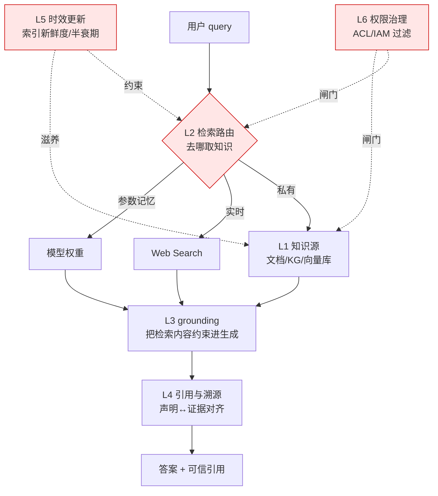

把"知识作为产品"拆成可独立替换的六层剖面——知识源、检索路由、grounding、引用与溯源、时效更新、权限治理——并回答一个 PM 在选型会上必须当场答出的问题：**当用户抱怨"答案过期了 / 引用是假的 / 看到了不该看的内容"时，故障究竟落在哪一层，以及哪两层之间的耦合点先断了。** 本节点的视角不是"怎么把 RAG 调好"（那是 [c09 - RAG 架构](/kb/基础知识库/c09-rag-架构/) 和 [m205 - RAG 生产环境：索引运维与评估体系](/kb/工程化与落地架构/m205-rag-生产环境-索引运维与评估体系/) 的工作），而是把整条知识管线当成一个有产品边界、有用户契约、有责任分层的**知识产品**来解剖。

## §0 为什么是"六层产品剖面"而不是"RAG 管线图"

业界讲知识系统的默认框架是"RAG 管线"：文档 → 切块 → 嵌入 → 索引 → 检索 → 重排 → 生成。这张图是对的，但它是**工程实现视图**——它假设了"用 RAG"这个答案，然后把注意力全放在管线内部的调参上。对一个 PM 来说，这张图遗漏了三件致命的事：(1) 它没有"要不要检索"这个决策层（参数记忆 / Web Search / KG / RAG 的去向选择本身就是产品决策，见本专题 03 架构剖面同级节点）；(2) 它把"引用"和"grounding"混为一谈，而生产事故恰恰发生在两者不一致时；(3) 它完全没有权限层——而企业 KM 的第一杀手不是检索精度，是越权泄露。

所以本节点换一个切法：**按"产品责任"分层，而不是按"数据流动"分层**。六层各自有独立的产品决策、独立的失败模式、独立的 PM 清单，且——这是判断主轴——**层与层之间存在致命耦合，单层做到 9 分、耦合点断裂，整个系统体感仍是 3 分。**

> [!note] 框架级辨析的赌注
> 我赌"产品责任分层"比"数据流分层"对 PM 更有用——因为责任分层能直接映射到团队 owner、SLA 和事故归因。但它的边界是：在纯算法优化阶段（比如调 reranker），工程视图反而更顺手。两张图是互补的，不是替代关系。

## §1 L1 知识源层：知识从哪里来，以什么形态存在

知识源层决定了"知识的物理形态"——非结构化文本、向量库、知识图谱、还是模型参数本身。这一层的核心产品决策不是"用哪个向量数据库"，而是 **non-parametric vs parametric 的根本分野**：知识压进权重（低延迟、零外部依赖、但冻结于训练截止、难审计、难删除），还是放在外部库（可更新、可审计、可删除、合规友好，但引入检索延迟与噪声）。来源：Wang et al., *Knowledge Mechanisms in LLMs: A Survey and Perspective*, EMNLP 2024 Findings（arXiv:2407.15017）。

产品结论很反直觉：**大多数企业生产部署倾向非参数记忆，主因不是性能，而是合规要求"可审计 + 可删除"。** GDPR 的"被遗忘权"无法在模型权重上执行——你删不掉一个已经压进 175B 参数里的事实，但你能从向量库里删掉一个 chunk。这一条决定了 L1 的形态选择往往是合规驱动而非技术驱动。

| L1 形态 | 适用 | 产品代价 | PM 清单 |
|---|---|---|---|
| 参数记忆 | 通用常识、无时效推理 | 不可审计、不可删除、知识冻结 | 是否有合规删除义务？有→禁用纯参数 |
| 向量库 | 语义相似匹配、非结构文本 | 检索噪声、需独立 ACL | chunk 粒度与权限粒度是否一致？ |
| 知识图谱 | 多跳推理、实体关系明确 | 构建成本高、动态数据难维护 | 知识是"写少读多"吗？频繁更新→慎用 KG |

## §2 L2 检索路由层：要不要检索、去哪检索

这是被"RAG 管线图"完全吞掉的一层，却是知识产品**最高杠杆的决策点**。路由层回答：这个 query 该用参数记忆直接答（快、可能过期），还是触发 Web Search（最新、但引用易错），还是查私有 KG/向量库（可控、但有覆盖盲区）？

传统 RAG 的死路是"每次都检索"——而 Self-RAG（Asai et al., 2023/2024）用反思 token（IsREL/IsSUP/IsUSE）让模型**按需触发检索**，FLARE（Jiang et al., 2023）在生成置信度下降时才主动检索，A-RAG（Du et al., arXiv:2602.03442, 2026）则暴露关键词/语义/chunk 读取三类工具让代理分层选择。这条演化线的产品含义是：**路由不是一个 if-else，而是一个可被模型参与的决策接口。**

> [!warning] 业界对手立场（接受 + 边界）
> RAGFlow 在 2025 年评述中点名"Agents 替代 RAG"是"market-driven stunt"——**接受**其判断：Agent 确实依赖 RAG 做领域知识、对话历史、工具元数据三类检索，路由层是 Agent 的底座而非对立面。**但坚持边界**：路由层若设计成纯"Agent 自主决定"，在小模型上反思 token 效果不稳定（Self-RAG 的已知短板），生产系统仍需要一层确定性 fallback。我赌的是"混合路由"（规则 + 模型）而非纯 agentic 路由。

## §3 L3 grounding 层：把检索到的东西真正约束进生成

grounding 层负责"让模型只说证据支持的话"。这一层和 L4 引用层最容易被混为一谈——但它们是两件事：**grounding 是"生成是否被证据约束"，引用是"展示了哪些证据"。** 一个系统可以 grounding 很差（自由发挥）却引用很多（贴一堆链接），这正是假溯源的温床（见 §7 致命耦合 B）。

grounding 的硬数据触目惊心：Liu et al.（EMNLP 2023, arXiv:2304.09848）测试 Bing Chat / Perplexity / NeevaAI / YouChat，发现**仅 51.5% 的生成句子被引用完全支撑，仅 74.5% 的引用确实支撑了对应声明**——斯坦福 HAI 称之为"虚假可信度的表象（facade of trustworthiness）"。grounding 层的产品决策因此是：grounding 强度（hard constraint 拒答 vs soft hint）与覆盖率（要求每句都有证据 vs 关键声明有证据）如何权衡。法律问答场景即便上了 RAG 仍有 10-60% 幻觉/缺漏率（来源：MDPI Mathematics, *Hallucination Mitigation for RAG: A Review*, 2025），说明 grounding 不是 RAG 的免费赠品，是要单独投资的产品能力。

## §4 L4 引用与溯源层：声明与证据如何对齐、如何展示

引用层是知识产品的**信任 UI**。同样的 grounding 质量，引用层的设计决定了用户能否验证、愿不愿验证。三大平台的设计分野很能说明问题：Perplexity 句子级 inline 引用、平均约 21.87 条引用/响应（来源：Whitehat SEO 2025 实测）；ChatGPT 引用置于响应末尾、平均约 7.92 条；Gemini 段落级引用、与 Google 知识图谱融合。

但**引用数量 ≠ 引用质量**：Tow Center / Columbia Journalism Review 2025-03 研究测试 8 个 AI 搜索引擎、200 条新闻查询，超过 60% 的查询返回不正确引用；Perplexity 失败率最低也有 37%，Grok-3 Search 高达 94%（来源：Nieman Lab 报道）。更深的产品权衡在 UX 层：*Seeing to Think?*（arXiv:2601.14611, 2026）对比 Collapsible / Hover Card / Footer / Aligned Sidebar 四种界面，发现核心矛盾是**"流畅性 vs 强制反思验证"**——Hover Card 体验流畅但鼓励盲信，Sidebar 提升批判性思维却打断工作流。引用层的设计本质是在替用户决定"信任的摩擦力"该多大。

| 引用 UX 模式 | 验证摩擦 | 风险 | 典型 |
|---|---|---|---|
| Inline 数字 + favicon | 低 | 鼓励扫一眼就信 | Perplexity |
| Footer 链接列表 | 中 | 声明↔证据对应模糊 | ChatGPT Search |
| Hover 原文片段 | 中低 | 流畅但弱反思 | Granola |
| Aligned Sidebar | 高 | 打断流，但促核验 | 研究界面 |

## §5 L5 时效更新层：知识如何不过期

时效层是 PM 最容易低估的一层——因为它在 demo 里永远正常，只在上线三个月后开始烂。核心反直觉发现来自 HoH 基准（Ouyang et al., arXiv:2503.04800, 2025）：**即使知识库里同时存在新旧信息，过时事实仍会干扰模型识别正确答案、甚至诱导有害输出。** 也就是说，"把新数据加进去"不等于"系统会用新数据"——时效约束必须同时注入**检索排序**和**生成提示**两处。

更隐蔽的是训练侧：*Understanding Data Temporality Impact on LLM Pre-training*（Fabre et al., arXiv:2605.22769, 2026）发现标准 shuffled 预训练会稀释时序信号，混排模型在 2024 年知识上准确率骤降至近随机——用户感知的"模型不知道近期事"，部分不是截止日期问题，而是数据混排导致的。时效层的产品决策框架是**知识更新成本梯队**：更新索引（小时级）< 持续微调（天-周级，且有灾难性遗忘风险）< 全量重训（周-月级）。前沿方法如 HALO（*Half Life-Based Outdated Fact Filtering in Temporal Knowledge Graphs*, arXiv:2505.07509, 2025）把物理半衰期引入时序知识图谱、按时间衰减淘汰过期事实——这提示 PKM/企业库可以给知识条目标注"预期有效期"而非只记创建时间。

> [!note] failure scenario
> 本节"双轨架构（静态索引 + 动态实时拉取）是工业现实"的结论，在**强实时领域（股价、航班、库存）会失效**——这些场景下索引几乎全是负债，必须 L2 路由层直接走实时检索，L1 向量库反而成了过期数据源。时效层与路由层的边界因领域而异。

## §6 L6 权限治理层：谁能看到什么

权限层是企业 KM 的**第一否决项**。最危险的认知是"权限是检索后过滤的事"——大多数 RAG 研究隐含假设"所有检索内容对任意用户可访问"，这在企业里直接等于**向量层成为权限提升向量（privilege escalation vector）**：低权限用户通过 query 触发对无权限文档的检索（来源：tianpan.co, 2026-05）。

| 过滤位置 | 安全性 | 代价 | 现状 |
|---|---|---|---|
| 应用层（生成后过滤） | 低（文档已进模型视野） | 易实现、浪费算力、有泄漏风险 | 生产主流 |
| 向量层（检索时过滤） | 高（文档从不进模型） | 需为每个 chunk 标注 ACL | 学术推荐 |
| IAM 直接集成 | 高（实时校验） | 延迟成本高 | 前沿 |

Glean 的工程实践给出参照：**查询时 ACL 过滤**（query-time access control list filtering），训练时优先用高可访问性文档兼顾隐私与信号质量（来源：ZenML LLMOps Database, 2023）。权限层的产品决策是"安全性 vs 改造成本"——理论上向量层过滤更安全，但现有生产系统大多停在应用层，尚无大规模对比实验公开（这是 §7 confirmation-bias 砍除点）。

## §7 判断主轴：三个层间致命耦合（90% 的人在这里翻车）

单层做好不够。知识产品的事故几乎都发生在**层与层的接缝**。以下三个致命耦合，每个带"症状 → 为什么会错 → 正确做法 → 真实反例"四件套。

**耦合 A：L2 检索路由 × L5 时效更新脱节 → 自信地给过期答案**
- **症状**：用户问"X 公司现任 CEO 是谁"，系统从向量库召回了一篇 2023 年的旧文，自信作答，没意识到该用实时检索。
- **为什么会错**：路由层只看"query 语义"决定去哪检索，不看"这个 query 是否对时效敏感"；时效层只管索引刷新，不向路由层暴露"这块知识的半衰期很短"信号。两层各自正常，接缝处没有"时效敏感度 → 路由策略"的传导。
- **正确做法**：在路由层引入时效敏感度判定（实体类、价格类、人事类 → 强制走实时或要求 L5 的新鲜度元数据），让 L5 的半衰期标注成为 L2 的路由输入。
- **真实反例**：HoH 基准（arXiv:2503.04800）证明，即便库里有正确新信息，模型仍会被过时事实干扰——这正是路由/排序没有把时效作为一等约束的后果。

**耦合 B：L3 grounding × L4 引用层不一致 → 假溯源**
- **症状**：答案贴了 5 条权威引用，看起来无懈可击，但其中某句关键结论实际上没有任何一条引用支撑——引用是"装饰"而非"证据"。
- **为什么会错**：grounding 弱（模型自由发挥）但引用层照样把检索到的 source 全列出来，用户误以为"有引用 = 被支撑"。引用层展示的是"检索到了什么"，不是"生成用了什么"。
- **正确做法**：引用层必须绑定到 grounding 的句子级归属（attribution），即"这句话由这条证据支撑"，而非"这次回答检索过这些源"。做不到句子级归属时，宁可降低引用密度也不制造虚假对应。
- **真实反例**：Liu et al.（EMNLP 2023）实测仅 51.5% 句子被引用支撑、74.5% 引用真正支撑声明——引用多≠溯源真，斯坦福 HAI 直接称其为"facade of trustworthiness"。学术界更出现了引用幻觉污染：Lancet 2026-05 研究审计 250 万篇 PubMed 论文，2026 年初每 277 篇含 1 篇幻觉引用，较 2023 年（1/2828）增长约 12 倍（来源：StatNews 2026-05-07）。

**耦合 C：L6 权限治理缺失 × L1/L2 任意层 → 越权泄露**
- **症状**：销售实习生问"我们给某大客户的最低折扣是多少"，系统从财务文档召回并答出——而该文档本应只有 VP 以上可见。
- **为什么会错**：权限被当成应用层"事后过滤"，但文档已进入模型上下文，模型可能在拒答前就把内容用进了推理，或在 fallback 措辞里泄露。权限层没有作为 L1/L2 的前置闸门。
- **正确做法**：权限过滤前移到检索层（向量层 ACL 或 IAM 集成），让无权限文档**从不进入模型视野**；chunk 的权限粒度必须与 L1 的存储粒度对齐（一个 chunk 跨越两个权限域 = 漏洞）。
- **真实反例**：tianpan.co（2026-05）明确把向量层描述为企业 RAG 的 privilege escalation vector；BadRAG/TrojanRAG 类投毒攻击进一步证明检索层是攻击面（来源：Mu et al., *Towards Secure RAG: A Comprehensive Review of Threats, Defenses and Benchmarks*, arXiv:2603.21654, 2026）。

> [!warning] confirmation-bias 砍除
> 本节点早期倾向把"向量层过滤"当成权限层的标准答案，并默认它已是业界共识。砍除：现实是**生产系统大多仍用应用层过滤**，向量层过滤改造成本高，且二者尚无大规模对比实验公开数据（tianpan.co 也承认这点）。把"向量层更安全"当成"应该立刻全面迁移"是 bias，正确表述是"安全性更高但需评估改造 ROI"。

## §8 产品 PM 视角补盲：用户心理、商业模式、合规

工程视图会让 PM 只盯检索精度，但知识产品的成败常在三个非工程点：

1. **用户心理模型——"引用即真相"的认知陷阱**：zero-click 时代，"AI 的回答 = 用户对品牌的直接体验"。用户看到引用就降低警惕，引用层设计若一味追求流畅（Hover Card），反而放大了 §7 耦合 B 的伤害。这是用户教育与 UI 摩擦力的产品取舍。
2. **商业模式张力——Perplexity 的"产品形态领先 + 单位经济亏损"**：实时检索每次查询都要爬取 + LLM 总结，搜索与 LLM 双重成本，毛利承压。知识产品的层数越多（尤其 L2 实时 + L5 高频更新），单位经济越脆弱。PM 必须把"每层的边际成本"纳入架构决策，而非只看体验。
3. **合规边界——知识更新 SLA 与删除义务**：EU AI Act（2024 生效，义务延伸至 2026-2027）要求风险分类与技术文档备案；GDPR 删除权直接否决了 L1 的纯参数形态。合规不是 L6 的附属，它是 L1 形态选择的前置约束。

## §9 跨域呼应：Polanyi 默会知识与"可显式化"的边界

> [!note] 跨域调度：Michael Polanyi《Personal Knowledge》(1958) 的默会知识（tacit knowledge）
> 知识系统六层有一个共同的隐含假设：**知识是可被显式化、切块、索引、检索的对象**。Polanyi 的反命题是"我们知道的比我们能说出来的多"（we know more than we can tell）——大量企业核心知识是默会的、镶嵌在实践与人际关系里的，无法被 L1 索引为 chunk。这改变了一个关键产品判断：**知识系统的 L1 覆盖率有一个原理性天花板，不是工程问题。** 当 PM 被要求"把公司所有知识 AI 化"时，正确回应不是"再加几个连接器"，而是辨识哪些知识是可编码的（文档、工单、KG）、哪些是默会的（资深员工的判断、跨部门的政治）——后者只能靠人在回路（human-in-the-loop）而非更大的向量库。这一框架也解释了为何"9 小时/周搜索内部信息"（McKinsey 2012）这类数字难以靠纯检索系统消灭：被搜索的部分是显性知识，真正卡人的往往是默会的"该问谁"。

## §10 PM 决策启示

- **面试怎么用**：被问"你怎么设计企业知识助手"，不要从"用什么向量库"答起。先画六层责任图，指出三个致命耦合点，说"我会先确认 L6 权限模型和 L1 的删除合规义务，再谈检索精度"——这一句立刻把你和只会调 RAG 的候选人区分开。
- **选型怎么用**：评估供应商（Glean / Copilot / 自建）时，按六层逐层问 SLA：L5 索引刷新频率、L6 是查询时还是应用层过滤、L4 是否句子级归属。别比 feature list，比"接缝处谁负责"。
- **复现怎么用**：搭最小知识系统时，第一个集成测试不是"检索准不准"，而是三个耦合点的对抗用例：过期实体 query（测 A）、无证据声明是否仍带引用（测 B）、越权文档 query（测 C）。

## §11 与已有节点的关系

- 对照 [c09 - RAG 架构](/kb/基础知识库/c09-rag-架构/)：c09 解构 RAG 作为非参数记忆管线的**工程实现**（分块、混合检索、reranker、HyDE）。本节点做的是**升高抽象层**——RAG 在本剖面里只是 L1+L2+L3 的一种实现选项，本节点补的是 c09 没有的 L2 路由决策层、L4 引用/grounding 分离、L6 权限层。不复述 c09 的 reranker 原理与混合检索机制。
- 对照 [m205 - RAG 生产环境：索引运维与评估体系](/kb/工程化与落地架构/m205-rag-生产环境-索引运维与评估体系/)：m205 讲索引运维四指标（命中率/空结果率/引用频率/Embedding Drift）与 RAGAS 评估。本节点的 L5 时效层是 m205 增量索引/TTL 的**产品化升级**——把"运维指标"提升为"知识半衰期产品决策"，把 m205 的"空结果率→扩库队列"运营飞轮接到 L1 内容策略上。不复述 RAGAS 四指标定义。
- 对照 [c13 - 幻觉的不可消除性](/kb/基础知识库/c13-幻觉的不可消除性/)：c13 论证幻觉是架构性特征、给出四级可靠性应对（外部护栏→可溯源→不确定性外显→人工审核）。本节点把这套应对**落到分层剖面**——c13 的"可溯源设计"对应 L4，"引用幻觉"正是 §7 耦合 B 的理论根。不复述 c13 的 Softmax/RLHF 校准论证。
- 与 [Perplexity](/kb/ai-公司与产品/perplexity/) 的关系：Perplexity 是本剖面的产品级实证样本（L2 实时路由 + L4 inline 引用 + L5 强新鲜度偏置），其引用错位争议是耦合 B 的"被聚光样板"。

## §12 关联节点

**核心（必读）**
- [c09 - RAG 架构](/kb/基础知识库/c09-rag-架构/)
- [m205 - RAG 生产环境：索引运维与评估体系](/kb/工程化与落地架构/m205-rag-生产环境-索引运维与评估体系/)
- [c13 - 幻觉的不可消除性](/kb/基础知识库/c13-幻觉的不可消除性/)
- [m203 - RAG 生产环境：Embedding 与文档解析](/kb/工程化与落地架构/m203-rag-生产环境-embedding-与文档解析/)
- [m204 - RAG 生产环境：Chunking 与范式演进](/kb/工程化与落地架构/m204-rag-生产环境-chunking-与范式演进/)
- [RAG](/kb/基础知识库/rag/)
- [Perplexity](/kb/ai-公司与产品/perplexity/)

**延伸（可选）**
- [Embedding](/kb/基础知识库/embedding/)
- [幻觉](/kb/基础知识库/幻觉/)
- [ChatGPT](/kb/ai-公司与产品/chatgpt/)
- [Gemini](/kb/ai-公司与产品/gemini/)
- [Agent](/kb/基础知识库/agent/)
- [p305 - 信任架构与可解释性设计](/kb/产品设计与交互范式/p305-信任架构与可解释性设计/)
- [p304 - 防御性 UX：对抗延迟与幻觉](/kb/产品设计与交互范式/p304-防御性-ux-对抗延迟与幻觉/)
- [p306 - 数据飞轮与反馈回路设计](/kb/产品设计与交互范式/p306-数据飞轮与反馈回路设计/)
- 0117社会学
- [AI PM 知识图谱·总索引](/kb/ai-pm-知识图谱/ai-pm-知识图谱-总索引/)

## §13 修订日志

- R0（2026-06-07）：首稿。建立六层产品责任剖面（知识源/检索路由/grounding/引用溯源/时效更新/权限治理），三个致命耦合四件套（A 路由×时效、B grounding×引用、C 权限缺失），Polanyi 默会知识跨域呼应，c09/m205/c13 升级对照。已 WebFetch 验证 arXiv ID：A-RAG（2602.03442）、*Seeing to Think?* UX 研究（2601.14611）、Fabre 时序预训练（2605.22769）、HALO（2505.07509）、RAG 安全综述（2603.21654）均确证存在且主题吻合，已去除待核实标记。注：Wang et al. EMNLP 2024 *Knowledge Mechanisms*（2407.15017）、HoH（2503.04800）、Liu et al. EMNLP 2023（2304.09848）、Tow Center 2025-03 已在接地简报阶段验证。
