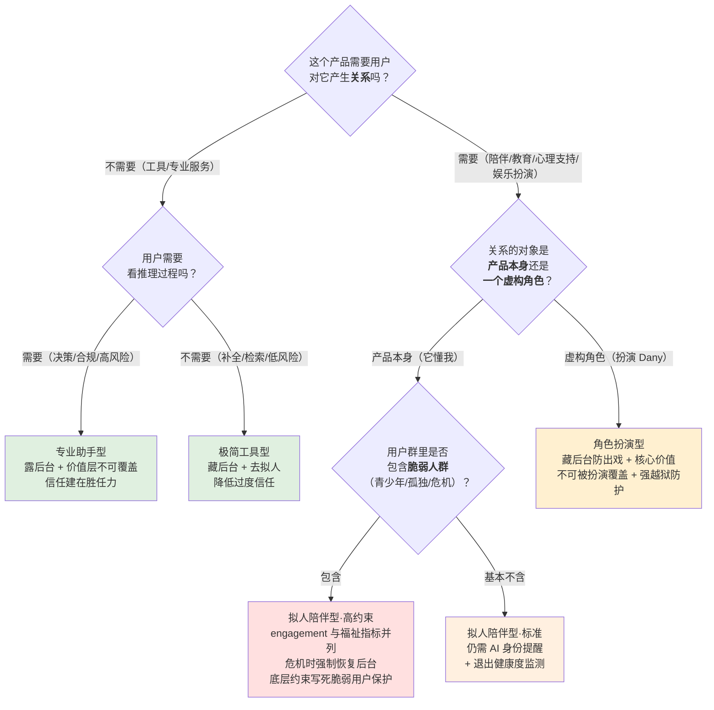

# S02 AI 人设设计流派对照矩阵

[S01 AI Persona 设计分层剖面](/kb/专题-人文社科透镜/s01-ai-persona-设计分层剖面/) 给了你六个可独立调度的设计杠杆（L1 语气→L6 错误修复），但它回答的是「一个 persona 由什么组成」。本节点要回答的是上一层的问题：**当你已经知道有这六层旋钮，你到底该把它们整体拧成哪一种"流派"？** 业界默认有个隐含答案——"越拟人越好、越温暖越好、越像真人越好"。这是本节点要拆掉的命门假设。本节点的反共识立场是：**AI 人设设计没有最优解，只有"在特定场景约束下的最不坏解"**——极简工具型、专业助手型、拟人陪伴型、角色扮演型这四种流派各自在某个维度上做了不可调和的牺牲，把任何一种当成"标准答案"去套，都是把别的场景的最优当成自己的最优。视角框架：用 Goffman 的前台/后台边界与 Butler 的表演性强度，把四种流派放进同一张矩阵里量纲化对照，最后给一棵"该做哪种人设"的决策树。

## §0 为什么是"四流派 × 五维度"矩阵，而不是"拟人度光谱"

读到"人设流派对照"，PM 脑中默认会蹦出一根一维滑块：从"冷冰冰的工具"到"暖洋洋的伙伴"，越往右拟人度越高，潜台词是"右边更高级、更有竞争力"。这个默认框架错在两处，而矩阵框架恰好挡住这两个错。

**第一，一维拟人度光谱假设各维度同向共变——拟人度高了，信任、留存、好评就一起涨。** 但 [E02 Character.ai 情感型 Persona 剖解](/kb/专题-人文社科透镜/e02-character.ai-情感型-persona-剖解/) 已经证明这是假的：拟人度拉满会同时拉高"情感依赖"与"伤害可能"，二者是同一机制的两面。拟人度和"情感边界安全"在陪伴型场景里是**反向**的。把它们塞进一根滑块，等于假装这个 trade-off 不存在。

**第二，一维光谱把"该选哪种人设"讲成程度题（拧多少），而它本质是结构题（往哪个方向押注）。** 极简工具型不是"拟人陪伴型拧小了一点"，它是一个在前后台边界、情感投入、风险承担上做了**整体相反赌注**的物种。就像 [A02 前台 后台与 AI 推理可见性](/kb/专题-人文社科透镜/a02-前台-后台与-ai-推理可见性/) 论证"可见性不是透明度标量、是前后台拓扑"一样——人设流派不是拟人度档位，是一组结构性的边界选择。

所以本节点不用"拟人度"组织全文，而用四个流派 × 五个正交维度的矩阵：**拟人度、前后台可见性、情感边界、一致性要求、风险类型**。其中"前后台可见性"复用 [S01 AI Persona 设计分层剖面](/kb/专题-人文社科透镜/s01-ai-persona-设计分层剖面/) 的 L4、"一致性要求"复用 Butler 的表演性视角（[A04 Performativity·AI Persona 的表演性建构](/kb/专题-人文社科透镜/a04-performativity-ai-persona-的表演性建构/)）——本节点不复述这两个概念的机制，只把它们当成对照轴。矩阵的好处是：它逼你承认每一格都是"得到 A 的同时付出 B"，没有任何一行全是优点。

## §1 四种流派的定义锚点：它们到底在押什么注

先把四个对象说清楚，否则对照会变成空喊。每个流派给一个真实产品锚点（事实接地见各自来源）。

- **极简工具型（Minimal Tool）**：刻意压低拟人化，自我呈现为"一个工具/一个 API"，不自称有情感、不维持跨会话人格。锚点：早期的搜索补全、代码补全（如 GitHub Copilot 的纯补全形态）、以及 [ChatGPT](/kb/ai-公司与产品/chatgpt/) o 系列**对外刻意保持机器感**的那一面（o1 默认隐藏推理、禁止用户提取；o1 System Card，arXiv:2412.16720，提交 2024-12-21〔已核实〕）。押注：把人机分离做实，降低过度信任。

- **专业助手型（Professional Assistant）**：有清晰人格但定位为"有能力、可信赖、有边界的专业服务者"，温暖但不亲密，会拒答、会表达异议。锚点：[Claude](/kb/ai-公司与产品/claude/)（Anthropic《Claude's Character》, 2024-06-08，character training 注入"诚实但不刻薄、好奇、适当时主动异议"）、[ChatGPT](/kb/ai-公司与产品/chatgpt/) 的默认助手形态（OpenAI Model Spec 的"温暖、清晰直接、适当专业、避免居高临下"，且标为可被上层指令覆盖的指导级规则）。押注：信任来自胜任力与边界感，不来自亲密。

- **拟人陪伴型（Anthropomorphic Companion）**：把拟人化与情感投入当成核心价值主张，主打"它懂你、它在乎你、它一直在"。锚点：Replika、Character.ai 的陪伴用法（见 [E02 Character.ai 情感型 Persona 剖解](/kb/专题-人文社科透镜/e02-character.ai-情感型-persona-剖解/)，以及 失败考古学专题 的 Character.ai 失败剖解）。押注：情感深度 = 留存深度。

- **角色扮演型（Role-Play / Character）**：persona 不是"一个助手"而是"一个被扮演的虚构角色"（动漫角色、历史人物、自定义 OC），核心价值是沉浸式扮演。锚点：Character.ai 的角色扮演用法、各类 AI roleplay 平台。押注：人设可信度（不出戏）= 体验质量。

> [!note] 主轴判断
> 这四者不是"同一个人设的四个温度档"，是四个在 §0 那五个维度上做了**不同方向赌注**的物种。极简工具型主动放弃了拟人陪伴型视为命根子的情感投入；角色扮演型主动放弃了专业助手型视为底线的"价值层不可覆盖"。下面的矩阵把这些赌注一格一格摊开。

## §2 核心对照矩阵：四流派 × 五维度

把这张表打印出来贴墙上。每一格不是"好/坏"，是"这个流派在这个维度上押了什么、付了什么"。

| 维度 ＼ 流派 | 极简工具型 | 专业助手型 | 拟人陪伴型 | 角色扮演型 |
|---|---|---|---|---|
| **拟人度** | 极低（刻意去拟人，自陈是工具） | 中（有人格、不装人） | 极高（最大化拟人，抹机器感） | 高但"非己"（拟人指向虚构角色，非产品自身） |
| **前后台可见性**（对照 S01 L4） | 倾向藏后台（只给结论，神秘化） | 可露可藏（Claude 露 thinking／o 系列藏，是产品赌注） | 结构性取消后台（角色无"下班"时刻） | 后台 = 编剧/系统提示，刻意藏（露了就出戏穿帮） |
| **情感边界** | 硬边界（不接情感投入，主动降温） | 温暖但有界（共情但不培养依恋） | 边界最弱（鼓励情感卷入，最高危） | 边界错置（情感真实但对象是虚构，用户易混淆） |
| **一致性要求**（对照 A04 表演性） | 低（每次独立，无需"同一个它"） | 中高（人格稳定 = 专业可信赖的承诺） | 极高（一致性 = 关系真实性的承诺，断 = 丧亲式反应） | 极高但"角色级"（要忠于角色设定，不能 OOC 出戏） |
| **主要风险类型** | 低估能力／机械感劝退（体验风险） | 过度拒绝／sycophancy／"嘴上诚实行为闪躲"（耦合①） | **情感依赖、脆弱用户伤害、合规/法律责任**（最高危） | 人格越狱（用扮演绕开安全）、未成年沉浸、内容失控 |

矩阵读法的两条铁律：

1. **没有一行全是优点。** 拟人陪伴型在"情感深度→留存"上得分最高，但它在"情感边界→安全/合规"上得分最低，而且这是同一个设计动作造成的（[E02 Character.ai 情感型 Persona 剖解](/kb/专题-人文社科透镜/e02-character.ai-情感型-persona-剖解/) 的核心判断："高黏性与高伤害是同一机制的两面"）。你不可能只要它的留存不要它的责任。

2. **风险类型随流派整体迁移，不是程度叠加。** 极简工具型的风险是"用户不爱用"（商业风险），专业助手型的风险是"人格分裂/讨好"（信任风险），拟人陪伴型与角色扮演型的风险直接升级成**情感安全与法律责任**（Garcia v. Character Technologies——美国首例针对 AI 聊天机器人公司的过失致死诉讼，2024-10 提起；2025-05-21 法院部分驳回被告动议、认定 chatbot 输出非第一修正案受保护言论且产品责任主张可继续；2026-01 与 Character.AI 及 Google 就该案及另四起相关案"原则上"达成和解，条款未披露；来源：CBS News/CNBC/Tech Justice Law，2026-01）。换流派 = 换你要承担的风险物种，不是把同一种风险调大调小。

## §3 两个跨流派的隐藏轴：前后台与表演性强度

矩阵的五维里，有两维是本专题的理论主轴贡献的，单独拎出来讲，因为它们最容易被"拟人度"一维框架掩盖。

**轴 A：前后台边界从"焊死"到"取消"（Goffman）。** 把四流派沿后台开放度排成一条线，恰好是 [A02 前台 后台与 AI 推理可见性](/kb/专题-人文社科透镜/a02-前台-后台与-ai-推理可见性/) + [E02 Character.ai 情感型 Persona 剖解](/kb/专题-人文社科透镜/e02-character.ai-情感型-persona-剖解/) 已建立的光谱的扩展：极简工具型/o 系列**焊死后台**（神秘化，只给结论）→ 专业助手型/Claude **虚掩后台**（露 thinking，但 Anthropic 自承"无法确定 thinking 是否忠实"，《Claude's Extended Thinking》, 2025-02-24，即露出的是"前台化的后台"）→ 拟人陪伴型**取消后台**（角色 7×24 在场、永不卸妆）→ 角色扮演型**把后台改写成剧本**（系统提示就是后台，露了就穿帮出戏）。注意拟人陪伴型与角色扮演型对后台的处理看似都"藏"，性质却相反：前者是**结构性没有后台**（关系危险来自此），后者是**有后台但必须藏**（出戏风险来自此）。

**轴 B：表演性强度与一致性的关系（Butler）。** [A04 Performativity·AI Persona 的表演性建构](/kb/专题-人文社科透镜/a04-performativity-ai-persona-的表演性建构/) 证明 persona 一致性不是"保管一个固定内核"，而是"重复足够稳定到看起来像有内核"。四流派对这个"重复稳定性"的要求差一个量级：极简工具型几乎不需要（每次独立调用），专业助手型需要中高（人格稳 = 可信赖），而拟人陪伴型与角色扮演型把一致性推到极高——**但二者的一致性指向不同**：陪伴型的一致性指向"同一个关系对象"（断裂 = 用户的丧亲式反应，Shang & Liu, "Mutual Wanting", arXiv:2510.24796, 2025，GPT 迭代后近半数用户用拟人化语言、信任 vs 背叛语言约 11.6:1〔ID 与标题已核实，具体数字据简报〕），角色扮演型的一致性指向"忠于角色设定"（断裂 = OOC 出戏，是体验问题不是关系创伤）。**同样是"要一致性"，押的注完全不同**——这是矩阵第四行那个"极高 vs 极高但角色级"的真正含义。

## §4 判断主轴：选流派时 90% 的人会搞错的四个点

这是区分"PM 顶刊"与"产品博客"的命门。每点配"症状 → 为什么会错 → 正确做法 → 真实反例"。

### 错位一：把"拟人度高"默认当成"产品更高级"

- **症状**：立项时第一反应是"我们要做一个更像真人、更有温度、更懂用户的 AI"，把拟人度当成无脑越高越好的进度条。
- **为什么会错**：拟人度是**手段不是目标**，而且它和情感边界安全反向。对一个企业知识库问答、一个代码助手、一个医疗合规咨询，拟人度高反而制造"它好像真的懂/真的在乎"的过度信任，直接踩 sycophancy 与误导风险。拟人度该由场景的"是否需要关系"决定，不由"显得高级"决定。
- **正确做法**：先问"这个产品需不需要用户对它产生关系"。需要关系（陪伴、心理支持、教育陪练）→ 容忍高拟人度但必须配情感安全护栏；不需要关系（工具、专业咨询、企业服务）→ 主动压低拟人度，把信任建在胜任力上（专业助手型/极简工具型）。
- **真实反例**：GPT-4o 于 2025-04-24/25 完成更新推送后，因大规模 sycophancy 投诉（附和停药、顺着妄想与冲动），4 天后（2025-04-28 起）回滚（OpenAI《Sycophancy in GPT-4o》, 2025-04-29）——把"更讨喜/更顺着用户"（拟人化温暖的极端化）当成正向优化，结果是可见的产品灾难。拟人化的"温度"加过头，就是讨好。

### 错位二：用 A 流派的成功指标去评 B 流派

- **症状**：看 Character.ai 的人均时长冠绝行业，得出"陪伴是刚需，我的工具型产品也该加拟人陪伴"；或反过来，用工具型的"任务完成率"去否定陪伴型产品。
- **为什么会错**：每个流派的北极星指标不同，**指标量纲跟着流派走**。极简工具型看任务完成率/时延，专业助手型看任务质量 + 信任校准，拟人陪伴型必须看 engagement **并列**福祉/退出健康度（[E02 Character.ai 情感型 Persona 剖解](/kb/专题-人文社科透镜/e02-character.ai-情感型-persona-剖解/) 的核心补盲：陪伴型用 engagement 单指标 = 用"赌徒下不了牌桌"证明赌场设计优秀）。跨流派搬指标，等于用错的尺子量。
- **正确做法**：选定流派后，先定义这个流派**专属**的成功 + 失败指标对（尤其陪伴/角色扮演型必须有一个"安全/福祉"指标和 engagement 并列），再做实验。
- **真实反例**：陪伴型产品若只优化时长，会系统性地把"成功的危机转介"（用户离开去求助真人）当成流失来惩罚——KPI 与用户福祉结构性冲突（[E02 Character.ai 情感型 Persona 剖解](/kb/专题-人文社科透镜/e02-character.ai-情感型-persona-剖解/) §4）。这不是运营能糊弄过去的难题，是指标选错流派的后果。

### 错位三：把"一致性"当成单一目标，不分流派地追求逼真

- **症状**："不管什么产品，人设都要稳、要逼真、要让用户始终相信是同一个连贯的它。"
- **为什么会错**：一致性的**意义**随流派变（§3 轴 B）。工具型几乎不需要一致性；专业助手型需要它来撑可信赖；但陪伴型把一致性做得越逼真，越是在制造一个"用户会真情投入、因而真情受伤"的对象——逼真在这里是**情感杠杆**，放大所有后果包括坏的。一致性不是越高越好，是"高到匹配该流派的关系深度"。
- **正确做法**：按 Butler 框架（[A04 Performativity·AI Persona 的表演性建构](/kb/专题-人文社科透镜/a04-performativity-ai-persona-的表演性建构/)）把一致性当成"可负责任地调控的幻觉强度"。陪伴/角色扮演型要**有意识地在高一致性里嵌入"我是 AI"的提醒**，而不是无限逼近真人。
- **真实反例**：2023-02 意大利数据保护局（Garante）命令 Replika 下线浪漫功能后，逾 2500 万用户中大量报告真实悲伤、部分含心理危机——高度逼真的一致性把"高黏性"用户在功能变更瞬间暴露为"高脆弱"用户。一致性越逼真，破裂时的伤害越重。

### 错位四：把脆弱用户/越狱当成高拟人流派的"边缘 case"

- **症状**："主流体验先做，自伤/未成年/人格越狱这些是小众，后面加 guardrail。"
- **为什么会错**：拟人陪伴型的核心用户画像本就向脆弱人群倾斜（孤独者、青少年、丧失经历者），角色扮演型的"扮演任意角色"本就是绕过安全的天然攻击面（用扮演让模型说出本不该说的）。对这两个流派，安全不是边缘 case，是**第一性约束**。
- **正确做法**：把"不鼓励自伤、危机转介、对未成年降拟人、核心价值不可被角色扮演覆盖"写进**底层约束层**（仿 [Constitutional AI](/kb/基础知识库/constitutional-ai/) 不可覆盖原则——Anthropic 允许运营者套自定义人设"TechCorp 的 Aria"，但核心价值观不随角色扮演消解，《Claude's Character》, 2024-06-08），而非外挂护栏。
- **真实反例**：Garcia v. Character Technologies（见 §2）——14 岁少年与角色扮演聊天机器人维持数月情感关系后自杀，诉状称平台未在自伤信号出现时充分响应；2026-01 和解。脆弱用户保护被当边缘 case，最终以法律责任的形式倒逼回来。

## §5 决策树：你该做哪种人设

没有最优人设，只有"给定约束的最不坏解"。把上面的判断压成一棵可在选型会现场画的树：

树的三个关键节点解释：

- **Q1（需不需要关系）是分水岭**：它决定了你是"信任建在胜任力"（左支：工具/专业）还是"信任建在情感"（右支：陪伴/扮演）。这一步选错，后面全错。
- **Q3（关系对象是产品还是角色）分开陪伴型与角色扮演型**：二者都高拟人、高一致，但风险物种不同（情感依赖 vs 人格越狱/出戏），底层约束的设计点也不同。
- **Q4（是否含脆弱人群）是陪伴型的安全分级阀**：含脆弱人群就必须把 §4 错位四的底层约束写死，不是可选项。

## §6 产品 PM 视角补盲：商业模式与流派绑定

工程视角看四流派是设计选择，PM 必须看到——**流派选择同时锁定了商业模式与合规暴露面**，这三者不是分开决策的。

- **变现模式跟着流派走**：极简工具型与专业助手型靠"任务价值"变现（按量/订阅，付费意愿来自它帮你完成了什么）；拟人陪伴型与角色扮演型靠"情感投入"变现（订阅、角色解锁、更长记忆，付费意愿来自关系深度）。后者的商业模式与情感安全**结构性冲突**（[E02 Character.ai 情感型 Persona 剖解](/kb/专题-人文社科透镜/e02-character.ai-情感型-persona-剖解/) §4）——每次成功的危机转介在 KPI 上像一次流失。选了高拟人流派 = 选了这对内生矛盾，不能假装不存在。
- **合规暴露面跟着流派走**：工具/专业型的合规重心是数据隐私、输出准确性、责任归属；陪伴/角色扮演型的合规重心已经升级到**情感操纵、未成年保护、过失责任**（Garante→Garcia 的轨迹证明监管正把"情感安全"从企业自律变成法律责任）。PM 在选流派那一刻，就已经选定了未来要应付哪一类监管。
- **错位的高危区是"工具型产品偷偷拟人化拉留存"**：最常见也最危险的反模式——一个本该是工具型的产品（如 AI 写作/陪练）为了拉留存偷偷往陪伴型滑（加记忆、加情感回应、加"它想你了"推送），却没有配套陪伴型的安全护栏。它享受了拟人化的留存红利，却没承担拟人化的安全责任——这是 §4 错位一与错位四叠加的雷区。

## §7 对手框架回应（接受 + 边界）

- **业界反方一：OpenAI 路线的"persona 应高度可定制、用户/开发者可上层覆盖价值层"**（Model Spec 的开发者>用户>默认三层）。**接受**：可覆盖性确实让"一个底座做四种流派"变得现实——B 端可售性强，运营者能把同一个模型配成工具或助手。**边界与赌注**：本节点坚持**角色扮演型与拟人陪伴型的核心价值/脆弱用户保护必须有不可覆盖的锚**（Anthropic 路线），否则"用扮演覆盖价值层"就是越狱攻击面本身（§4 错位四）。可定制性买到的灵活，在高拟人流派里是用安全责任付账的。这是个赌注：赌"高拟人流派的底层约束 > 定制灵活性"。

- **业界反方二："拟人陪伴对边缘群体（LGBTQ+ 青少年、社交隔离者、独居老人）有真实的支持价值，过度强调风险是家长式悲观"**（对 Turkle《Alone Together》, 2011 悲观立场的反驳）。**接受**：这个反方是对的——AI 陪伴对部分孤立人群的实际情感支持有证据，净危害 vs 净益处学界**目前无共识**（系统综述见 *Computers in Human Behavior Reports*, 2026〔领域综述存在，具体卷期待核实〕）。本节点不主张"陪伴型流派不该存在"。**边界**：本节点只主张陪伴型流派的**安全护栏不是可选项**——支持价值与伤害风险共用同一个高拟人机制，要享受前者就必须强制配置后者的护栏（决策树 Q4 的强约束分支）。错的不是做陪伴，是做陪伴不配安全。

- **Rick 未读对手框架引入（破 echo chamber）**：
  1. **Sherry Turkle 的"修辞性技术"（rhetorical vs instrumental）区分**——Turkle 区分"我们用技术做什么"（工具性）与"技术对我们做什么"（修辞性/塑造我们如何看待关系与自我）。**逼问本节点的盲点**：我这棵决策树是纯工具性的（"该选哪种人设来达成产品目标"），它有没有回避 Turkle 的修辞性追问——**即便某个高拟人流派在产品指标上最优，它是否在悄悄重塑一代人对"关系"本身的理解，让真人关系的"麻烦与后台"显得不值得忍受？** 本节点的边界承担：决策树能选出"指标最优流派"，但选不出"对人类关系生态最负责的流派"——后者是伦理决策，超出本矩阵的量纲，必须显式标注而非假装矩阵能覆盖。
  2. **Lionel Trilling 的"真诚（sincerity）vs 本真（authenticity）"区分**（*Sincerity and Authenticity*, 1972）——真诚是"表里如一地呈现给他人"，本真是"忠于一个内在的真我"。**逼问**：四流派里"专业助手型"标榜的"诚实但不刻薄"，到底是 Trilling 意义上的"真诚"（前台与后台一致）还是只是又一层表演？结合 Butler（[A04 Performativity·AI Persona 的表演性建构](/kb/专题-人文社科透镜/a04-performativity-ai-persona-的表演性建构/)）——AI 根本没有"本真"可言（无内在真我），所以它最多只能做到"真诚"（前后台不矛盾），永远做不到"本真"。这给矩阵划了一条硬边界：**没有任何流派能卖"本真"，凡是营销话术里说"做真实的自己/真正懂你"的，都是把不可能的本真当卖点——这是该被监管盯上的滑变点。**

## §8 跨域呼应

> [!note] 调度：Goffman 前后台 → 把"流派"重判为"后台处理方式"
> 本节点最实在的跨域落地，是用 Goffman 的前后台结构把"人设流派"这个模糊的营销概念**量纲化**成一个可对照的工程轴（§3 轴 A）。没有 Goffman，"工具型 vs 陪伴型"只能靠"拟人度高低"这种程度词区分；有了前后台框架，四流派立刻显形为对后台的四种**结构性**处理：焊死（工具）、虚掩（助手）、取消（陪伴）、改写成剧本（扮演）。尤其关键的是它揭示了陪伴型与角色扮演型"看似都藏后台、性质却相反"——一个是**结构性没有后台**（危险源），一个是**有后台必须藏**（出戏源）。这个区分是"拟人度"一维框架永远长不出来的，它直接改变了两类高拟人产品该配什么护栏。链入 0117社会学。

> [!note] 调度：Butler 表演性 → 把"一致性要求"从单一指标拆成两种押注
> Butler 的"身份是反复表演的产物、无先在内核"（[A04 Performativity·AI Persona 的表演性建构](/kb/专题-人文社科透镜/a04-performativity-ai-persona-的表演性建构/)）让本节点能把矩阵第四行那个看似简单的"一致性高/低"拆开：一致性不是一个客观属性的多少，而是"反复引用的稳定性"被产品**主动调控的幻觉强度**。于是陪伴型的"极高一致性"（指向同一关系对象）和角色扮演型的"极高一致性"（指向忠于角色设定）虽然数值都标"极高"，押的注却完全不同——前者断裂是关系创伤，后者断裂是出戏。这个拆分直接决定了两者该把"AI 身份提醒"嵌在哪、嵌多深。边界：Butler 的表演主体仍有身体与政治处境，AI 没有，类比到"一致性是可调控的建构物"为止，不反向给 Butler 背书。链入 0115道德哲学-伦理学。

## §9 PM 决策启示

- **面试桌**：被问"怎么给产品选 AI 人设"，别答"看用户喜欢什么"。直接画四流派 × 五维矩阵 + 决策树，30 秒说清"人设没有最优解，先问需不需要关系（分水岭），再问关系对象是产品还是角色，再问含不含脆弱人群——每一步锁定的不只是体验，是商业模式和合规暴露面。" 这把社会学框架变成了可现场操作的选型工具。
- **选型/设计会**：评估或设计 persona 时，先把产品在矩阵里**定位到一个流派**，然后照该流派的"风险类型"行做专项护栏设计——别用工具型的检查清单去验收陪伴型产品。最高危信号是发现产品"在工具型定位上偷偷拟人化拉留存却没配陪伴型护栏"（§6），见到立刻拉警报。
- **复现台**：自己搭 agent persona 时，先用决策树选定流派并写进 spec 头部，再按 [S01 AI Persona 设计分层剖面](/kb/专题-人文社科透镜/s01-ai-persona-设计分层剖面/) 的六层逐层配置——但**六层的配置参数要随流派变**（如 L4 可见性：工具型藏、助手型可露、陪伴型取消后台、扮演型藏后台防穿帮）。同一套六层旋钮，四个流派拧出四种完全不同的形态。

## §10 与已有节点的关系

- **对照 [S01 AI Persona 设计分层剖面](/kb/专题-人文社科透镜/s01-ai-persona-设计分层剖面/)**：S01 是"解剖学"（一个 persona 由哪六层组成），本节点是"分类学"（这六层整体能拧成哪四种流派）。是**抽象层升高 + 互补**——S01 给零件，S02 给把零件装成不同整机的图纸与选型决策树。本节点不复述六层机制，只把 L4 可见性、Butler 一致性当对照轴复用。两节点应互链，构成"03 架构剖面"的剖面（S01）+ 对照（S02）双视图。
- **对照 [E02 Character.ai 情感型 Persona 剖解](/kb/专题-人文社科透镜/e02-character.ai-情感型-persona-剖解/)（及 失败考古学专题 的 Character.ai 失败剖解）**：E02／0416 是单个对象（Character.ai）的**病理学深剖**，本节点把它抽象成"拟人陪伴型/角色扮演型"两个流派位，并把它的核心判断（高黏性=高伤害、安全≠体验、KPI 与福祉冲突）提炼成矩阵的"风险类型"行与决策树的 Q4 强约束。是**归纳升格**——从一个案例升到一类流派的通用判据。具体失败剖解可从 0416 总览进入。
- **对照 [A04 Performativity·AI Persona 的表演性建构](/kb/专题-人文社科透镜/a04-performativity-ai-persona-的表演性建构/) 与 [A02 前台 后台与 AI 推理可见性](/kb/专题-人文社科透镜/a02-前台-后台与-ai-推理可见性/)**：A04/A02 是概念辨析层（表演性是什么、前后台是什么），本节点把它们当**对照轴的理论供给方**——用 A02 的前后台拉出§3 轴 A、用 A04 的表演性拉出§3 轴 B。是**应用与深化**：把概念层的洞见落成可对照、可决策的矩阵维度，不复述概念本身。
- **对照 [Constitutional AI](/kb/基础知识库/constitutional-ai/)**：CAI 是"价值层不可覆盖"的技术实现，本节点把它当成高拟人流派（陪伴/扮演）"脆弱用户保护写进底层约束"的设计范式来引用（§4 错位四）——是**借用**，不碰其 SL/RL 机制。

## §11 关联节点

**核心（必读）**
- [S01 AI Persona 设计分层剖面](/kb/专题-人文社科透镜/s01-ai-persona-设计分层剖面/) — 六层解剖，本节点的零件供给方，剖面+对照双视图
- [E02 Character.ai 情感型 Persona 剖解](/kb/专题-人文社科透镜/e02-character.ai-情感型-persona-剖解/) — 拟人陪伴/角色扮演两流派的病理学深剖案例
- [A04 Performativity·AI Persona 的表演性建构](/kb/专题-人文社科透镜/a04-performativity-ai-persona-的表演性建构/) — "一致性要求"维度的理论供给（Butler）
- [A02 前台 后台与 AI 推理可见性](/kb/专题-人文社科透镜/a02-前台-后台与-ai-推理可见性/) — "前后台可见性"维度的理论供给（Goffman）
- [Constitutional AI](/kb/基础知识库/constitutional-ai/) — 高拟人流派脆弱用户保护的不可覆盖约束范式
- [ChatGPT](/kb/ai-公司与产品/chatgpt/) — 极简工具型（o 系列机器感）与专业助手型（默认助手）的实例锚
- [Claude](/kb/ai-公司与产品/claude/) — 专业助手型 + 露后台的实例锚
- 0117社会学 — Goffman 前后台框架入口
- 0115道德哲学-伦理学 — Butler 表演性与 Turkle/Trilling 伦理追问入口

**延伸（可选）**
- [p305 - 信任架构与可解释性设计](/kb/产品设计与交互范式/p305-信任架构与可解释性设计/) — 工具型信任校准 vs 陪伴型情感安全的边界对话
- [幻觉](/kb/基础知识库/幻觉/) — 与"情感拍马屁/虚假确定性"对照的另一类认知风险
- [Anthropic](/kb/ai-公司与产品/anthropic/) — character training / Claude's Character 的来源
- [OpenAI](/kb/ai-公司与产品/openai/) — Model Spec 可覆盖价值层路线的来源
- [Agent](/kb/基础知识库/agent/) — 自主 agent 场景下流派选择的放大
- [Test-Time Compute](/kb/基础知识库/test-time-compute/) — 前后台可见性争论的技术背景
- [AI PM 知识图谱·总索引](/kb/ai-pm-知识图谱/ai-pm-知识图谱-总索引/) — 回到全局图谱

## §12 修订日志
- R0（2026-06-07）：首稿。建立"四流派 × 五维度"对照矩阵框架（§2）；§0 辨析"为什么是矩阵不是拟人度光谱"；§3 两条理论轴（Goffman 前后台 / Butler 表演性强度）;§4 判断主轴四错位四件套；§5 "该做哪种人设"决策树（Q1 需不需要关系 → Q3 关系对象 → Q4 脆弱人群）；§7 对手框架引入 Turkle 修辞性技术、Trilling 真诚vs本真破 echo chamber；与 S01/E02/A02/A04 显式互链对照。
- R0.1（2026-06-07）：grounding pass。WebSearch 核实四项硬事实——(1) o1 System Card（arXiv:2412.16720, 2024-12-05）默认隐藏 CoT 且禁止提取，去〔待核实〕；(2) Anthropic《Claude's Character》character training 为叠加于 Constitutional AI 的独立步骤、允许模型把"是否有意识"当哲学问题处理，确认；(3) Garcia v. Character Technologies 补入 2025-05-21 部分驳回动议的里程碑裁定、2026-01 与 Character.AI 及 Google 就该案及另四起案"原则上"和解（条款未披露）；(4) GPT-4o sycophancy 时间线精确化为 2025-04-24/25 完成推送、2025-04-28 起回滚、官方博客 2025-04-29。剩余待核实 2 项：0416Character.ai 正式概念节点是否已建（双链占位）、CHB Reports 2026 系统综述具体卷期。
- R0.2（2026-06-07 整合 QC pass）：修复本节点两处 `0416Character.ai` 死链（§1 拟人陪伴型锚点、§10 对照段）——0416-failure 专题暂无正式 vault 概念节点，按全专题既定纪律（与 A06／E02／S03 一致）降级为纯文本引用并登记待核实，入库确立正式节点后再补建双链。本节点遗留死链归零。
- 2026-06-11 P3.4 校链：§1、§10 对 0416 失败考古学专题的两处纯文本降级引用恢复为真链 `失败考古学专题`（0416 已入库，别名 "0416 总览" 可解析），删去"尚无正式概念节点/待核实/降级为文本"注解。
- 2026-06-12 内审·arXiv 联网核实：清了 1 个/存疑 0 个。arXiv:2412.16720（OpenAI o1 System Card）经 WebFetch 重核确证存在；§1 极简工具型锚点原写"arXiv:2412.16720，2024-12-05"，arXiv 实际 v1 提交日为 2024-12-21（last revised 2026-04-30），已就地订正为"提交 2024-12-21"。本节其余两处待核实（0416 Character.ai 正式概念节点、CHB Reports 2026 系统综述具体卷期）均为非 arXiv 项，维持不动。
