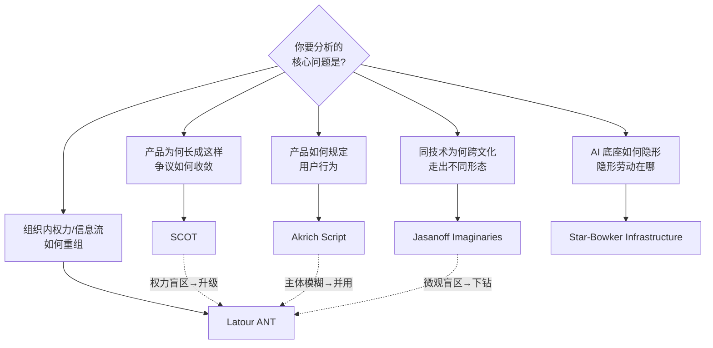

一个 PM 拿到一个待分析的 AI 产品问题——"为什么同样的 AI 客服在巴西被当成监工、在德国被当成助理"、"为什么我们的风控模型上线后线下运营组的话语权悄悄变了"、"为什么用户把模型的胡说八道当成了权威判断"——脑子里第一反应往往是抓一个最熟的框架硬套（通常是"用户采纳曲线"或者"PMF"）。这个节点要解决的问题不是"STS 有哪些工具"，而是**给定一个具体问题，该调用哪一把 STS 工具，以及在什么边界外它会失灵**。本节的视角是把五个核心 STS 框架（SCOT / Akrich Script / Latour ANT / Jasanoff Sociotechnical Imaginaries / Star-Bowker Infrastructure）摆成一张**决策矩阵**，让"该用哪个工具分析此问题"从直觉变成可检验的判断。

> [!warning] 判断主轴（本节点的命门）
> STS 工具不是同义词、不是"都行随便挑"。五个框架在**分析对象、分析时态、能动性分配、规范立场**四个维度上互相不可通约——选错工具，分析会系统性地看不见关键变量。这一节就是教你不选错。

---

## §0 为什么是"工具箱+决策表"而不是"STS 通论"

读者脑中默认的错误框架有两个，先挡掉。

**错误框架一："STS = 技术的社会影响研究"。** 这把 STS 矮化成"技术决定论的温和版"——技术先存在，然后研究它对社会的冲击。但 STS 的全部锋利恰恰在于**拒绝这个先后关系**：SCOT 说技术形态本身是社会协商的产物（Pinch & Bijker, 1984），ANT 说人和物对称地共同构成网络（Latour），Jasanoff 说"什么算可欲的技术未来"本身是被社会想象塑造的（Jasanoff & Kim, 2009）。把 STS 当"影响研究"，等于丢掉它最值钱的部分。

**错误框架二："五个框架是五种说法，挑顺手的。"** 这是更隐蔽的错误。它们**回答的是不同的问题**。用 ANT 去分析"为什么同一个 AI 在中美走出不同产品形态"，会得到一堆网络追踪却抓不住"国家想象"这个关键解释项；用 imaginaries 去分析"这个推荐算法如何在组织内重新分配了谁说了算"，会因为框架的国家/精英尺度而漏掉微观权力的转译过程。**工具与问题之间存在适配关系，错配的代价是系统性盲区。**

所以本节点的产物是一张决策表，不是一篇通论。下面先给核心矩阵，再逐工具拆"何时用 / 何时别用"，最后给 AI PM 的落地选择流程。

---

## §1 核心对照矩阵：五工具 × 五问题

这是本节点的中心交付物——把它打印出来贴在选型会的白板旁边。

| 工具 | 一句话内核 | 最擅长的问题 | 分析对象 | 能动性分配 | 失效边界 |
|---|---|---|---|---|---|
| **SCOT**（技术的社会建构） | 技术形态是相关社会群体协商定型的，本可以不是这样 | **意义协商**：为什么这个 AI 产品长成现在这样、争议如何闭合 | 人工物 + 相关社会群体 | 人类群体为主，物是被塑造对象 | 对**已稳定**的产品强、对进行中的强权力结构弱；忽视非人物质性与沉默群体 |
| **Akrich Script**（脚本/铭刻） | 设计者把对用户的预设"铭刻"进物里，物因此预先编排了用户行为 | **行为塑造**：这个 AI 产品在悄悄规定用户该怎么用、用户如何反抗（anti-program） | 单个技术物的内嵌脚本 ↔ 实际使用 | 设计者↔用户**往返**对话 | "谁在铭刻"在生成式 AI 里极度模糊（训练者？提示工程师？用户？）——经典脚本框架是否适用存疑 |
| **Latour ANT**（行动者网络） | 人与非人对称地组成网络，权力是转译与必经节点（OPP）的效果 | **权力重组**：AI agent 进入组织后，信息流/话语权/责任如何重新分配 | 异质网络（人+算法+文档+流程） | 人非人**对称**（generalized symmetry） | 描述强、规范弱——对 AI 偏见/平台权力**缺乏批判立场**；对称性原则被指相对主义 |
| **Jasanoff Imaginaries**（社会技术想象） | "可欲的技术未来"是集体持有、制度稳定、公开表演的愿景 | **跨文化差异**：同一 AI 技术为何在中/美/欧走出不同治理路径与产品形态 | 国家/机构层面的集体想象 | 集体+制度，弱个体能动性 | 国家中心、精英偏向——漏掉地方行动者与微观实践；"想象形成机制"解释力弱 |
| **Star-Bowker Infrastructure**（基础设施） | 基础设施在正常运转时隐形，故障时才显形；分类即权力 | **隐形渗透**：AI 作为底座如何后台化、其分类/标注劳动如何被隐形 | 大型信息系统、数据集、分类标准 | 系统性、嵌入性（八/九维度） | "透明/后台化"是否适用于会说话的 LLM 存疑（Dal Molin, 2024）；偏描述 |

**读法**：从你的问题类型（第二列）反查工具。如果问题落在两列之间，看第六列"失效边界"做排除——哪个工具的盲区正好是你问题的核心变量，就排除哪个。

---

## §2 SCOT —— 何时用、何时别用

**何时用**：当你要解释"这个 AI 产品**为什么是现在这个样子**、当初的争议是怎么平息的"。SCOT 的三个抓手直接可操作——**相关社会群体**（谁在定义这个产品该解决什么问题）、**解释弹性**（同一个功能对不同群体意味着完全不同的东西）、**闭合**（修辞闭合 vs 问题重定义）。Pinch & Bijker (1984) 的自行车气胎案例是范本：对一些群体气胎是"更舒适"，对另一些是"丑陋+抓地力差"——技术特性不是天生的，是协商出来的。

**AI 落地**：分析"AI 写作助手"为什么从"语法纠错"演化成"全文代笔"——是哪些相关群体（学生/教师/营销/出版）的解释弹性博弈，最后靠什么机制闭合的。

**何时别用**：当问题的核心是**宏观权力结构**或**非人物质性**时。Langdon Winner (1993, *Upon Opening the Black Box and Finding It Empty*) 的四点批评精准命中 SCOT 的盲区：忽视技术后果、遗漏沉默群体、回避权力结构、道德中立。对一个"AI 信贷模型如何系统性排除某类申请人"的问题，SCOT 会停在"相关群体协商"而看不见结构性排斥——这时要升级到 ANT 或下文的基础设施视角。

> [!quote] 业界反方立场 · 接受 + 边界
> **接受 Winner 的批评**：SCOT 确实容易把"社会决定论"替换"技术决定论"，对权力不敏感（Klein & Kleinman, 2002 的内部修正也承认这点，*Science, Technology, & Human Values*）。**但坚持边界**：在分析"产品形态如何被协商定型"这个具体问题上，SCOT 的解释弹性概念仍是最锋利的——它能让 PM 看见"竞品的功能差异不是技术优劣，是不同相关群体的胜出"。Winner 没有给出更好的形态分析工具，只是指出了下游盲区——所以正确做法是 SCOT 做形态分析、ANT/基础设施接力做权力分析，而不是用 Winner 否掉 SCOT。

---

## §3 Akrich Script —— 何时用、何时别用，及 AI 的"超强脚本"

**何时用**：当你要分析"这个产品在**预先编排用户怎么用它**、以及用户如何偏离"。Akrich (1992, *The De-scription of Technical Objects*, in Bijker & Law eds., MIT Press, pp. 205–224) 的核心：设计者把对未来世界的愿景"铭刻"（inscription）进物的物质结构里，产物就是 script；分析者通过"解-铭"（de-scription）从物的行为里读出这个脚本。配套词表（Akrich & Latour, 1992）给了可操作术语：**pre-inscription**（用户须预备的能力）、**subscription**（按脚本响应）、**anti-program**（对抗脚本的使用）、**delegation**（把人的活动转移给物）。

**AI 的独特升级——这是本专题的核心论点之一**：传统产品的脚本是**静态铭刻**（门把手暗示你"推还是拉"，铭刻一次就固化）。而 AI 产品的脚本是**动态生成的**——模型的每一次输出本身都在实时改写用户的下一步行为。ChatGPT 的回答语气、默认给出的选项、拒绝的边界，构成一个**每轮对话都在重新铭刻**的脚本。这让 Akrich 的框架比分析任何传统产品都更吃重，但也更难用——见失效边界。

**何时别用 / 边界**：生成式 AI 让"谁在铭刻"崩塌。传统脚本里铭刻主体清晰（工程师）；在 LLM 里，脚本由训练数据、RLHF 标注者、系统提示、提示工程师、乃至用户自己的提示**共同**写成。EASST 2026 的专题讨论（〔据 EASST Eurograd 2026-04-29 消息，争议中〕）正是在问：经典 script 框架是否还适用于这种多主体、动态生成的铭刻。所以用 Akrich 分析 AI 时，必须显式回答"我在分析哪一层的脚本"，否则会把不同主体的铭刻混为一谈。

> [!note] 跨域呼应（人类学 · Rick 的不公平优势）
> Akrich 的 inscription 与 Woolgar (1991) 的 "configuring the user" 高度相近，但 Akrich 更对称地处理用户能动性。这里可以接上 民族志 的方法论：de-scription 本质是一种对"物"的民族志——你要像观察一个陌生部落的器物那样，从 AI 产品的默认设置、拒答边界、推荐路径里读出它对用户的人类学预设。Rick 的滴滴国际化经验提供了一个真实的 anti-program 案例：巴西司机对实名/合规类产品功能（参见 CPF实名验证、PAX-Premium实名徽章）发展出的规避用法，正是设计者脚本与拉美 fieldwork 现实之间的张力——这种张力用 Akrich 框架能看得最清楚。

---

## §4 Latour ANT —— 何时用、何时别用，及把 AI agent 当行动者

**何时用**：当你要分析"AI agent 进入一个组织/流程后，**权力、信息流、责任如何重新分配**"。ANT 的关键抓手：**actant**（行动元——人和非人对称，AI agent 是完全合格的行动者）、**translation / 转译**（Callon 1984 圣布里厄湾扇贝研究的四阶段：问题化→利益化→征募→动员）、**OPP / 必经节点**（谁把自己设成了所有人绕不过的关口）、**black-boxing**（网络稳定后被当作单一黑箱）。

**AI 落地——这是 ANT 对 AI PM 最锋利的地方**：把 AI agent 作为**非人行动者**纳入网络分析。一个 RAG 客服 agent 上线，ANT 会问：它有没有变成新的 OPP（所有客诉都要先过它）？它把哪些原属人类客服的活动 delegated 走了？它的黑箱化让谁的话语权升了、谁降了？Morton Gutiérrez (2023/2024, *AI and Ethics*, "On Actor-Network Theory and Algorithms: ChatGPT and the New Power Relationships in the Age of AI", DOI: 10.1007/s43681-023-00314-4) 正是把 ChatGPT 当 ANT 行动元，分析它如何重构人机网络的权力关系。

**何时别用 / 边界**：当你需要**规范判断**（这个 AI 系统的偏见是对是错、该不该用）时，ANT 会让你失望。ANT 的描述性立场——不预设好坏、只追踪联结——被 Mills (2018, *British Journal of Sociology*) 等批评为"放弃了批判性社会学"，无法批判权力、剥削、不平等。

> [!quote] 业界反方立场 · 接受 + 边界（含 Rick 未读的对手框架）
> **接受 Collins & Yearley (1992, "Epistemological Chicken") 与 Langdon Winner 的批评**：把物和人赋予同等能动性，在本体论上可疑——AI agent 真的有"意向性"吗？这对"对称性原则"是真问题。**但坚持边界**：ANT 的对称性是**方法论工具而非本体论主张**——它不是说算法和人一样有灵魂，而是说**分析时先别预设谁更重要**，免得一上来就把 AI 当纯工具、看不见它的能动效果。对 PM 而言这恰恰是价值：它逼你认真对待"AI agent 正在重组你的组织"这件事，而不是当成一个被动的功能上线。Mills 的"缺批判性"批评成立，所以正确做法是 ANT 做权力**显形**，再借 生命政治/霸权 做权力**评判**——两步，不混用。

---

## §5 Jasanoff Imaginaries —— 跨文化 AI 分析的利器

**何时用**：当你要解释"**同一个 AI 技术为什么在不同国家走出完全不同的产品形态、治理路径、公众接受度**"。这是 imaginaries 的主场，也是其他四个工具都覆盖不了的尺度。Jasanoff & Kim (2009, *Minerva* 47(2), "Containing the Atom") 用美韩核能对比奠基：美国的主导想象是"驯服原子"（国家做负责任的监管者），韩国是"发展的原子"（核技术嵌进民族发展叙事）——同一技术，两套想象，两种治理。

**AI 落地**：Richter, Katzenbach & Zeng (2025, *Journal of Science Communication*) 的访谈研究显示，美国主导想象是"全球霸权的 AI 竞赛"、德国是"主权 AI / 人类控制下的工具"、中国是"可信赖的社会解决方案 / 追赶中的超级大国"。一个出海的 AI PM 用这张图能直接预判：同一个产品在三地需要的不是 UI 本地化，而是**对接当地的社会技术想象**——在德国强调可控与合规，在美国强调能力前沿，在中国强调社会场景落地。

**前沿延伸**：Barkett (Emilio Barkett, 2026, arXiv:2602.23679, "The Compulsory Imaginary: AGI and Corporate Authority", 提交 2026-02-27，已 WebFetch 核实) 把想象框架从民族国家延伸到**私营企业**，分析 Altman《The Intelligence Age》与 Amodei《Machines of Loving Grace》的修辞操作——这意味着 [Anthropic](/kb/ai-公司与产品/anthropic/)、OpenAI 正成为新型想象的主要生产者，填补甚至取代国家角色。

**何时别用 / 边界**：当问题在**微观/组织层面**或需要追踪**个体能动性**时。Rudek (2021, *Science and Public Policy* 49(2)) 的批评成立：imaginaries 国家中心、精英偏向，主要靠政府文件和精英访谈，**忽视普通人叙事与地方实践**；且多数研究只"登记既有想象"却不追问"想象如何形成"。所以分析"巴西某个城市的司机社群对 AI 调度的在地反应"，imaginaries 太粗，得换 ANT 或 Akrich 下钻。

> [!note] 跨域呼应（人类学 + 国际化 fieldwork · 显式迁移）
> imaginaries 与 Rick 的人类学底子（人类学、Descola 的 *Beyond Nature and Culture* 多元自然观、Viveiros de Castro 的视角主义）天然咬合：不同社会"对什么算好的技术未来"的想象差异，本质是宇宙观差异的现代延伸。这正是 E02 跨域呼应要落地的迁移——Rick 的拉美 fieldwork（参见 拉美知识图）让他不只是"读过 Jasanoff"，而是**手里有数据**：巴西、墨西哥对国家/平台/技术的信任结构与中美欧都不同，这是把 imaginaries 从书本框架变成可操作竞品分析的独家资产。

---

## §6 Star-Bowker Infrastructure —— 隐形渗透的显微镜

**何时用**：当你要分析"AI 作为**底座/基础设施**如何后台化、习以为常、隐形运转——以及它的隐形劳动和分类权力藏在哪里"。Star & Ruhleder (1996, *Information Systems Research* 7(1)) 给了八个维度（1999 年 Star 扩为九个，新增"以模块化增量固化"），核心命题是**故障时才显形**（visibility upon breakdown）——基础设施正常跑的时候你看不见它，崩了才意识到它一直在。配套方法是 **infrastructural inversion**（基础设施倒置，Bowker & Star, 1999, *Sorting Things Out*）：主动把背景的 AI 底座拉到前景来分析。

**AI 落地**：Denton et al. (2021, *Big Data & Society*, "On the Genealogy of Machine Learning Datasets") 把 ImageNet 当信息基础设施分析——数据集后台化、内嵌不可见的标注劳动与社会选择。配合 Crawford (2021, *Atlas of AI*) 的"行星尺度提取"批判、Gray & Suri (2019, *Ghost Work*) 的幽灵劳动——AI 基础设施的隐形性同时也是**劳动隐形性**的机制。这对 PM 的杀伤力在于：你的 AI 产品的"自动化"光鲜表面下，有一条结构性不可见的标注/审核/微调劳动链。

**何时别用 / 边界**：当分析对象是**会说话的 LLM**时要谨慎。Dal Molin (2024, *First Monday* 29(2)) 提出 LLM 的**语言表演性**使其不同于传统"透明/后台化"的基础设施——它太爱说话、太显形，反而为治理介入提供了切入点。这是个活跃争议（理论未解决），所以套 Star 框架分析 LLM 时要显式承认这个边界。

> [!quote] confirmation-bias 砍除
> 本专题早期容易把"AI = 基础设施"当成万能正面框架反复引用（基础设施视角确实优雅）。但要砍掉这个 bias：Dal Molin 的反例证明，LLM 的高可见性、表演性恰恰**违反**了 Star 框架的核心假设（隐形性）。补入边界——基础设施框架强在分析**数据集层、算力层、标注劳动层**（这些确实后台隐形），弱在分析**面向用户的对话层**（这层太显形）。分层用，别一刀切。

---

## §7 PM 决策启示：三类落地

**面试怎么用**：被问"你怎么分析一个 AI 产品的社会影响"，别答"看用户采纳曲线"——那是把 STS 矮化成市场分析。答："看是什么类型的问题——如果是产品形态争议用 SCOT，如果是组织权力重组用 ANT 把 AI agent 当行动者，如果是跨文化落地差异用 Jasanoff 的社会技术想象。" 一句话展示你有**工具箱**而不是单把锤子，立刻区别于背了几个名词的候选人。

**选型/竞品分析怎么用**：出海决策会上，用 imaginaries 矩阵预判同一产品在中美欧需要的不是本地化 UI 而是对接不同社会想象；用 ANT 评估"引入这个 AI agent 会不会让某个团队变成 OPP、谁的话语权会变"；用 Akrich 的 anti-program 概念预判用户会怎么规避你的设计脚本。

**复现/产品设计怎么用**：做 AI 产品的"脚本审计"——用 de-scription 方法逐条读出你的默认设置在向用户铭刻什么预设（你假设了用户是谁、会怎么用、不该怎么用），再用基础设施倒置审计你藏在自动化表面下的隐形劳动链是否合规、是否可持续。

---

## §8 与已有节点的关系

- 本节点是 **0411 Agent 专题的 [S02 流派架构对照表](/kb/专题-安全对齐与失败/s02-流派架构对照表/)** 的**跨域升级对照**：S02（Agent）对照的是技术架构流派，本节点（STS）对照的是分析这些技术的**社会科学工具**——同样是"对照矩阵"体裁，但抽象层从"技术如何组成"升到"用什么理论看技术进入社会后的效应"。两者都强调"别比 feature list，比维度可控性"。
- 对照 [c13 - 幻觉的不可消除性](/kb/基础知识库/c13-幻觉的不可消除性/)：c13 在技术内部闭环解释幻觉，本节点提供把幻觉**社会化**的工具——[幻觉](/kb/基础知识库/幻觉/) 不只是采样机制问题，用 ANT 看是"AI 行动者输出的不可变流动体被网络当成事实"，用基础设施视角看是"用户把后台化的 AI 当成隐形权威底座"。**不复述 c13 的技术根因**，只补社会维度的分析工具。
- 对照 0117社会学 / 人类学：本节点把社会学/人类学的一般理论，收窄成"专门分析技术-社会"的 STS 工具集，做的是**收窄+操作化**。
- 与本专题同级节点链接：依赖 [S01 AI 产品社会嵌入分析框架剖面](/kb/专题-人文社科透镜/s01-ai-产品社会嵌入分析框架剖面/)（提供六层分析全景），被 [S03 跨文化 AI 产品差异分析全景](/kb/专题-人文社科透镜/s03-跨文化-ai-产品差异分析全景/) 调用（提供工具选择前置），向上汇入 [_STS 系统化专题·总览](/kb/专题-人文社科透镜/_sts-系统化专题-总览/)。

---

## §9 关联节点

**核心（必读）**
- [S01 AI 产品社会嵌入分析框架剖面](/kb/专题-人文社科透镜/s01-ai-产品社会嵌入分析框架剖面/) —— 本对照矩阵的六层分析全景前置
- [S03 跨文化 AI 产品差异分析全景](/kb/专题-人文社科透镜/s03-跨文化-ai-产品差异分析全景/) —— 工具选好后的应用剖面
- [S02 流派架构对照表](/kb/专题-安全对齐与失败/s02-流派架构对照表/) —— 0411 Agent 专题的跨专题对照体裁标杆
- [c13 - 幻觉的不可消除性](/kb/基础知识库/c13-幻觉的不可消除性/) —— 被本节点社会化的技术节点
- 人类学 / 民族志 —— de-scription 与 imaginaries 的方法论根
- [AI PM 知识图谱·总索引](/kb/ai-pm-知识图谱/ai-pm-知识图谱-总索引/) —— 全库入口

**延伸（可选）**
- [A03 Actor-Network Theory·AI 作为非人行动者](/kb/专题-人文社科透镜/a03-actor-network-theory-ai-作为非人行动者/) / [Agent](/kb/基础知识库/agent/) —— ANT 把 AI agent 当行动者的概念锚点
- [Anthropic](/kb/ai-公司与产品/anthropic/) / [ChatGPT](/kb/ai-公司与产品/chatgpt/) —— imaginaries 企业延伸与 ANT 行动元案例
- 生命政治 / 霸权 —— ANT 显形后接力做权力评判的工具
- 0117社会学 / 0115道德哲学-伦理学 —— 上游理论入口
- CPF实名验证 / PAX-Premium实名徽章 / 拉美知识图 —— Akrich anti-program 与 imaginaries 的 Rick fieldwork 落点

---

## 修订日志

- **R1（2026-06-07）**：首稿。建立五工具×五问题核心矩阵 + Mermaid 决策流；每工具补"何时用/何时别用/失效边界"三段；Akrich"AI 超强动态脚本"论点、ANT"AI agent 作行动者"、imaginaries 跨文化矩阵为三个判断主轴；接入 Winner/Collins&Yearley/Mills/Rudek/Dal Molin 五处对手立场（接受+边界）；跨域呼应落地人类学+拉美 fieldwork；Barkett arXiv:2602.23679 经 WebFetch 核实（题/作者/日期/主题全对）；EASST 2026 讨论标〔争议中〕。
- 2026-06-12 内审·arXiv 联网核实：清了 0 个、存疑 0 个（本节点唯一 arXiv:2602.23679 此前已核实；本轮重新 WebFetch 复核仍为真实论文，标题/作者/提交日不变）。EASST 2026 为非 arXiv 会议来源，未处理。
