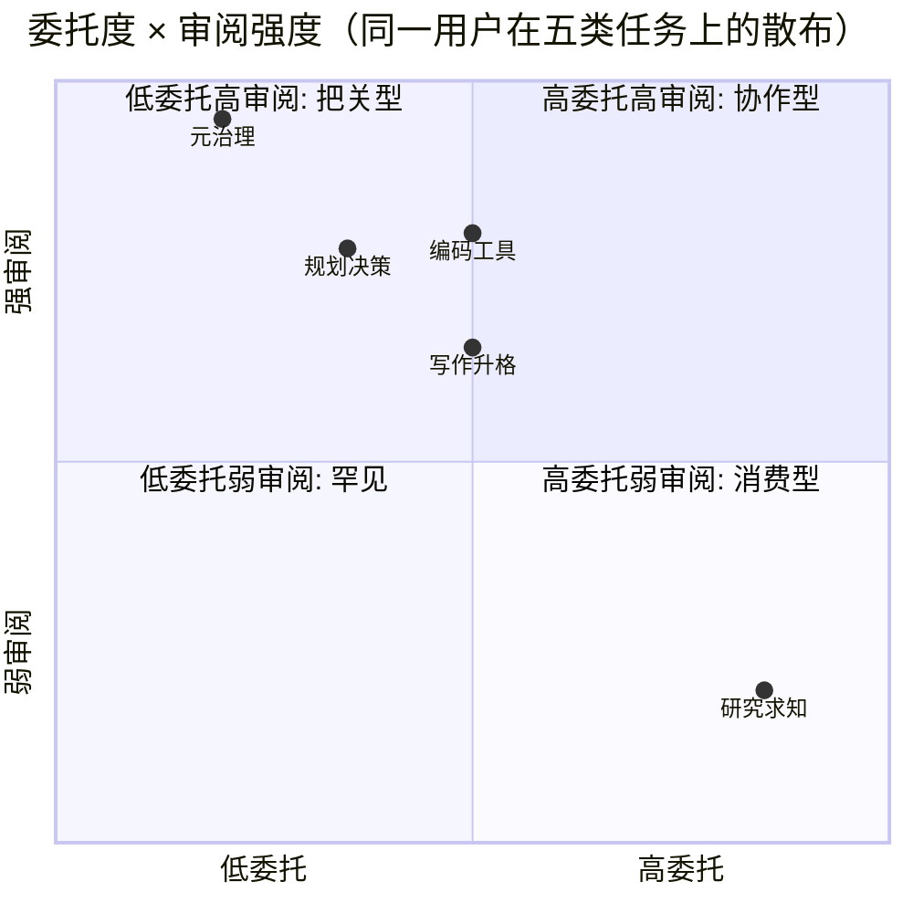

# S02 使用模式对照矩阵

> 本节点要解决的问题：当我们说"Rick 是 AI power user"时，我们到底在描述什么？是高频率？是高深度？还是高自定义？——都不准确。**真正的特征是：同一个人在不同任务类型上，运行的是彼此不可通约的协作模式**。本节用一张「任务类型 × 协作维度」的对照矩阵把这件事拆开，框架名叫**模式离散度（mode dispersion）**——衡量一个用户在任务间切换协作模式的幅度。判断主轴：**power user 的真正稀缺性不在任一单一模式的极致，而在模式离散度本身；产品若把用户建模成"一个稳定的协作风格"，就会系统性地服务错对象。**

---

## §0 为什么是「模式对照矩阵」而不是「用户画像」

读者脑中的默认框架，大概率是产品圈惯用的**用户画像（persona）**：把 Rick 标记成"重度用户 / 技术型 / 高 ARPU"，给他一个稳定的风格标签，然后据此推荐功能、设计默认值。这个框架在这里会**直接误导**。

persona 的隐含假设是"一个人 = 一种使用风格"。但本专题的研究对象恰恰**证伪**了这个假设：本工厂项目（0412-0423，即正在进行的这套多 agent 知识生产）就是反例——同一个 Rick，在"旅途中现场向 AI 提历史问题"时是一种模式（高委托、低审阅、即时消费），在"设计 trip-structure skill"时是另一种模式（低委托、高审阅、反复迭代），在"批量 ingestion 入库"时又是第三种模式（流水线委托、事后批量审阅、强机制约束）。如果用一张 persona 卡描述他，必然丢掉这个最重要的信息。

所以本节点不画 persona，而画**矩阵**。矩阵的行是任务类型，列是协作维度，格子里填的是"在这个任务上，这个维度取什么值"。读者要带走的不是"Rick 是谁"，而是"协作模式是任务的函数，不是人的属性"。这个框架转换有一个直接的方法论后果，对应民族志方法（民族志）的"单位选择"问题：**分析单位从"用户"下沉到"用户×任务"，power user 现象才第一次变得可测量。**

> [!note] "模式离散度"是本节点提出的判据
> 本节点提出的反共识判据是：**power user 的稀缺性不在任一单一模式的极致，而在"模式离散度"——同一用户在不同任务间切换协作模式的幅度本身**。它与概念层的 [A02 使用即数据·什么算 observation](/kb/专题-人文社科透镜/a02-使用即数据-什么算-observation/) 互补：A02 回答"一次使用怎样被看见才配称 observation"（分析单位的下沉），S02 在此基础上回答"把分析单位下沉到用户×任务后，怎么把'模式离散'拆成一张可填、可证伪、可指导产品决策的矩阵"。

---

## §1 两个轴：任务类型（行）与协作维度（列）

### 行：五类任务

按 Rick vault 中可观察的 AI 产出，归纳出五类任务（来源：vault 实际产物分布，详见 [Skill 系统的本质](/kb/ai-协作方法论/skill-系统的本质/) 与本工厂 meta-case）：

| 任务类型 | vault 中的可观察证据 |
|---|---|
| **编码 / 工具构建** | trip-discover / trip-evaluate / trip-macro / trip-structure / trip-qa 五 skill 家族的设计与迭代（2026-03-31~04-03 对话档案） |
| **研究 / 求知** | 旅途中现场向 AI 提历史问题，产出散落到 `01学习/0123美国近现代史/`（约 20 节点） |
| **规划 / 决策** | AI 协作架构从 12-agent 主动塌缩到 v1.4（2026-05-21）；trip 套件用于真实行程 |
| **写作 / 升格** | 现场对话升格为笔记，跨专题连接（如 林肯第二次就职演说的神学解读） |
| **元治理 / 系统设计** | memory allowlist 转型（2026-05-13）、vault CLAUDE.md 六原则、过拟合诊断（2026-03-23） |

### 列：四个协作维度

| 维度 | 含义 | 取值范围 |
|---|---|---|
| **委托度（delegation）** | 把多少决策权交给 AI；从"AI 只补全"到"AI 自主执行多步" | 低 → 高 |
| **审阅强度（review intensity）** | 对 AI 产出施加多少把关；从"几乎不看"到"逐 diff 核查" | 弱 → 强 |
| **工具链（toolchain）** | 用裸对话、还是 skill / agent / memory / 沙盒等工程化封装 | 裸 → 重工程 |
| **可逆性预期（reversibility）** | 出错代价；从"即时消费、错了无所谓"到"会污染主区、必须隔离" | 高 → 低 |

委托度与审阅强度这一对，直接继承自人-AI 协作研究中的核心构念。Lee & See（2004，*Human Factors*，"Trust in Automation: Designing for Appropriate Reliance"）把"信任应与系统实际可靠性匹配"称为**信任校准**；委托度可以读作"信任的行为外化"，审阅强度则是"对抗过度依赖（overreliance）的成本投入"。本节点的赌注是：power user 的标志，正是他在不同任务上**有意识地调成不同的校准点**，而非全局一个信任水平。

---

## §2 对照矩阵（核心交付物）

| 任务类型 | 委托度 | 审阅强度 | 工具链 | 可逆性预期 | 一句话刻画（可观察部分） |
|---|---|---|---|---|---|
| **编码 / 工具构建** | 中 | **强** | 重工程（skill-creator 元 skill 重写） | 低（skill 会被反复复用，错会扩散） | 发散-收敛-明确指令-机制核查四步；over-design 后被主动拉回收敛 |
| **研究 / 求知** | **高** | 弱 | 裸对话（现场即时） | **高**（一次性消费，可弃） | 现场触发、即时获取、事后挑选升格 |
| **规划 / 决策** | 中-低 | 强 | agent + 框架（A/B/C/D 判别） | 低（架构决策影响后续全部协作） | 主动发起 "12 agent 是否 over-engineering" 挑战 |
| **写作 / 升格** | 中 | 中-强 | 沙盒（`_ai_review/` 三步 ingestion） | 低（会进 vault 主区） | 产出先入沙盒，审阅后才 move |
| **元治理 / 系统设计** | 低 | **极强** | memory + 规约 + 反向修订 | **极低**（错误会固化进 AI 长期行为） | allowlist 转型；要求 AI 删除旧记忆条目；用 ML 术语做元层干预 |

这张散布图是整个专题的视觉锚点：**同一个人，五个点分散在象限的四个角落**。普通用户的五个点会挤成一团（因为他对 AI 有一个相对稳定的总体信任度）；power user 的点是离散的。**模式离散度 = 这五个点的统计离散度**。这就是可证伪的操作化定义——任何人只要按此矩阵自填，就能算出自己的离散度，并和 Rick 对照。

> [!note] 致命的可观察/不可观察分界
> 上表"委托度""审阅强度"的具体取值，部分是从 vault 产物**反推**的（如"研究类委托度高"是因为现场对话直接消费、很少看到反复核查痕迹），部分需要 Rick 内省确认。反推有系统性风险：**审阅行为往往不留痕**——Rick 在脑中否决了一个 AI 建议，vault 里看不到。所以下面每个格子的"内省层"都留了 `〔Rick 待填〕`，这正是自我民族志的诚实做法：可观察的如实标，需内省的不替他编。

---

## §3 模式切换的触发器：为什么同一个人会换模式

矩阵不是静态的；真正有产品价值的是**切换发生在哪个瞬间、被什么触发**。可观察的触发器有三类：

1. **可逆性骤降触发审阅强度跃升**。研究类任务（错了重问即可）委托度可以拉满；一旦产出要进入会被反复复用的载体（skill、memory、vault 主区），审阅强度立刻拉满。最强证据是元治理类：memory 错误会固化进 AI 长期行为，于是 Rick 不仅强审阅，还**反向删除**已生成的旧记忆条目（2026-05-13，可观察）。

2. **复用预期触发工程化**。一次性问答用裸对话；预期复用就封装成 skill。trip 套件就是"重复出现的旅行规划需求"被识别后工程化的产物（[旅行规划 Skill 套件系统设计](/kb/产品/旅行规划-skill-套件系统设计/)）。

3. **复杂度超阈触发委托度下调**。当 AI 架构本身变复杂（12 agent），Rick 反而**降低**对 AI 自主判断的委托——主动质疑 over-engineering，用 A/B/C/D 框架人工裁定哪些保留为 agent（[Claude routines 调研与 memory allowlist 设计](/kb/产品/claude-routines-调研与-memory-allowlist-设计/) 同期的架构演化）。这反直觉：能力越强，他越不放手。

这三条触发器合起来揭示一个被产品设计普遍忽略的事实：**用户的协作模式不是偏好，是风险定价的结果**。他不是"喜欢"高委托或低委托，而是在为每类任务的出错代价定价后，反推出的理性配置。

---

## §4 判断主轴：90% 的人在模式问题上会搞错的四个点

这是区分"PM 顶刊"与"功能罗列"的命门。每点带 症状 → 为什么会错 → 正确做法 → 真实反例。

### 错点一：把"高频"或"高深度"当作 power user 的定义

- **症状**：产品按使用频率/token 量分层，给"重度用户"统一推高级功能。
- **为什么会错**：频率和深度都是**单维标量**，会把"在所有任务上都高委托的轻信用户"和"模式离散的真 power user"归成同一层。前者其实是过度依赖（overreliance）的高危人群（Parasuraman & Manzey, 2010, *Human Factors*，指出 automation complacency 在专家身上同样出现，且训练无法消除）。
- **正确做法**：用模式离散度分层，而非频率。高频 + 低离散 = 高危轻信；中频 + 高离散 = 真 power user。
- **真实反例**：本工厂 meta-case 中，Rick 在研究类任务上委托度极高（看起来"轻信"），但同一周在元治理任务上审阅强度极强（反向删记忆）。任何单维标量都会把这两个行为之一判错。

### 错点二：以为审阅强度应该全局统一（"要么信 AI 要么不信"）

- **症状**：产品设计成"开启 AI 协助 / 关闭"的全局开关，或要求用户设定一个统一的"自动化级别"。
- **为什么会错**：把信任当成人格特质，而非任务函数。这正是 persona 框架的病根。
- **正确做法**：信任校准应**任务级**而非用户级。Lee & See（2004）的校准模型本就是"信任 vs 系统在该任务上的可靠性"——可靠性是随任务变的，校准点当然该随任务变。
- **真实反例**：Rick 对同一个 Claude，在写历史问答时几乎不核查，在写 memory 条目时逐条审还反向删除。同一个 AI、同一个用户、同一周，校准点差了一个数量级。

### 错点三：把工具链（skill/agent/memory）当成"越多越高级"

- **症状**：鼓励用户装满 skill、配置复杂 agent 编排，把"重工程"等同于"用得好"。
- **为什么会错**：忽略了工程化本身有 over-design 风险，而 power user 的标志恰恰包括**主动减负**。
- **正确做法**：把"主动塌缩复杂度"识别为高阶信号，而非退化。
- **真实反例**：Rick 把 12-agent v1.3 主动塌缩为 5 sub-agent + 6 skill 的 v1.4（2026-05-21），判据是"只有真正需要独立 context 隔离的才留为 agent"。最高阶的工具链操作是**删工具**，不是加工具。（呼应 [A02 抽象层级辨析·Harness Framework Agent Skill Orchestrator](/kb/专题-安全对齐与失败/a02-抽象层级辨析-harness-framework-agent-skill-orchestrator/) 对 agent/skill 边界的辨析。）

### 错点四：以为模式之间互不影响（矩阵格子彼此独立）

- **症状**：分别优化每类任务的体验，不管模式切换的摩擦。
- **为什么会错**：切换本身有认知成本。用户从"高委托研究模式"切到"强审阅治理模式"时，如果产品不给信号，他可能带着研究模式的松弛去审 memory，酿成固化错误。
- **正确做法**：产品应**显式标注当前所处的风险区**，在可逆性骤降的边界主动提示模式切换。
- **真实反例**：vault CLAUDE.md 的"三步 ingestion"（AI 产出先入 `_ai_review/` 沙盒）本质上就是 Rick 给自己造的**模式切换护栏**——它强制把"写作模式"和"入库决策模式"分开，防止松弛地把 AI 草稿直接放进主区。这是用户自己发明了产品本该提供的东西。

---

## §5 产品 PM 视角补盲

工程视角看到的是"信任校准曲线";PM 视角要补三个看走眼点：

- **用户心理模型**：用户不会用"委托度/审阅强度"这套语言描述自己，他只会说"这个我让 AI 随便弄""那个我得盯着"。产品要把矩阵翻译成**情境化的模式名**（"探索模式""把关模式"），而不是暴露二维滑块。
- **商业模式**：按 token/频率定价会**惩罚高离散度用户**——研究类高委托烧 token，治理类低委托但价值最高却几乎不烧 token。定价若只看消耗，最有价值的模式贡献最低收入。可考虑按"激活的协作模式数"或"工程化深度"定价。
- **合规 / 风险边界**：高委托模式在 DiDi 这类受监管业务里有合规含义——把决策权交给 AI 的任务若涉及安全/用户数据，可逆性预期必须重估。Rick 作为安全 PM，"可逆性"这一列在工作场景会比个人 vault 严苛得多（此处为推断，工作场景具体配置见 `〔Rick 待填〕`）。

---

## §6 对手框架回应（接受 + 边界）

**对手立场一：persona / 用户分群仍是产品工业的主流方法论，且行之有效。**
接受其对的部分：在**人群尺度**上，persona 对营销、定价、GTM 仍然好用——你确实需要知道"重度技术用户占比多少"来做资源分配。本节点的边界：persona 在**个体协作设计**尺度上失效；当目标是"为这一次交互配置正确的委托/审阅默认值"时，必须下沉到 用户×任务。两者不矛盾，是不同抽象层（persona 管人群，矩阵管交互）。

**对手立场二（Rick 未读框架，破 echo chamber）：Suchman 的「情境行动（situated action）」。**
Lucy Suchman 在 *Plans and Situated Actions：The Problem of Human-Machine Communication*（1987，Cambridge University Press）中反对"行为可由预设计划充分描述"，主张行动是在具体情境中即兴生成的。这对本节点是一记拷问：**我画的矩阵会不会就是 Suchman 批判的那种"plan"——一个事后强加的整齐结构，而真实的模式切换其实是混乱、即兴、不可矩阵化的？** 接受这个批判的力量：矩阵确实是**回顾性重构**，不是 Rick 行动时脑中的图。边界与赌注：即便如此，矩阵作为**分析工具和产品设计语言**仍有价值——它不声称描述了 Rick 的实时认知（那需要 think-aloud 数据，本专题暂缺），只声称"模式离散是可观察的稳定现象"。这正是为什么每个格子都分"可观察层 / 内省层"，把 Suchman 式的情境性留在 `〔Rick 待填〕` 里，而不是假装矩阵已穷尽真相。

> [!warning] failure scenario（本节结论何时失效）
> 1. **当用户其实没有差异化定价能力时**，模式离散度低不代表是轻信用户，可能只是新手——矩阵会误判。离散度需配合"是否能说出切换理由"才有判别力。
> 2. **当任务边界模糊时**（一段对话里研究/写作/决策交织），无法干净地归到一行，矩阵的离散度计算失真。
> 3. **审阅不留痕**导致系统性低估审阅强度（见 §2 callout），这会让从 vault 反推的矩阵偏向"比真实更轻信"。

---

## §7 跨域呼应：Polanyi 默会知识与"模式切换的不可言说性"

调度 [Polanyi 默会知识与提示工程的认识论张力](/kb/基础知识库/polanyi-默会知识与提示工程的认识论张力/)。Polanyi 的命题是"我们知道的比我们能说出的多"（we know more than we can tell）。把它对准本节点的核心难题：**Rick 在任务间切换协作模式的判断，很大程度是默会的**——他"感觉到"这个任务需要盯紧、那个可以放手，但未必能在切换的瞬间清晰陈述理由。

这改变了一个具体的产品判断：如果模式切换依赖默会知识，那么**让用户手动配置委托度/审阅强度滑块的产品设计注定失败**——因为用户无法把默会的风险定价显式化为参数。正确方向是让产品从**情境信号**（任务载体的可逆性、产出是否会被复用）**推断**模式，而非要求用户言说。这与 [Skill 系统的本质](/kb/ai-协作方法论/skill-系统的本质/) 的论点呼应：skill 之所以有效，正是因为它把一段默会的 procedural knowledge 封装成可触发的显式流程——本节点把同一逻辑推到协作模式层：**模式切换也该被封装，而非要求用户每次重新言说。**

（认识论入口链入 0114认识论；默会/言说之分的社会学含义见 0117社会学。）

---

## §8 PM 决策启示

- **面试怎么用**：被问"如何定义和服务 power user"时，不答"高频/重度"，而答"模式离散度"，并能画出这张矩阵、给出可证伪的分层方法（高频低离散=高危轻信，需要更多过度依赖防护;中频高离散=真 power user，需要模式切换支持）。一句话差异化：**"我服务的不是一类人，是一个人的多种模式。"**
- **选型怎么用**：评估 AI 协作产品时，问"它支持任务级的信任校准吗，还是只有全局开关"。只有全局开关的产品（错点二）服务不了高离散用户。
- **复现怎么用**：任何团队想识别自己的 power user，可直接复用本矩阵做 diary study（让用户按任务自填四维），算离散度——这是把本节点变成可执行研究工具的最短路径（具体日志与编码方法见本专题 [R01 建一个 AI 使用日志与编码方案](/kb/专题-人文社科透镜/r01-建一个-ai-使用日志与编码方案/) 与 [R02 从使用日志做模式识别](/kb/专题-人文社科透镜/r02-从使用日志做模式识别/)）。

---

## §9 与已有节点的关系（升级对照，不复述）

- **对 0414 Claude Code 体感专题（邻接专题，尚未在 vault 落成可链接的 synthesis 节点）的升级**：体感笔记记录的是"用 Claude Code 是什么感觉"——那是**单一工具、单一模式**下的一手体验。本节点把视野从"一个工具的体感"升一层到"跨任务的模式配置"，做的是**深化 + 框架化**：体感是矩阵中"编码/工具构建"这一行的一手填料，本节点给它一个可对照的坐标系。
  〔Rick 待填：0414 体感笔记中，你用 Claude Code 时的委托度和审阅强度，和上表"编码/工具构建"行的反推值一致吗？哪里不一致？〕

- **对 [0418 审阅瓶颈专题](/kb/专题-评测与度量/_审阅瓶颈系统化专题-总览/) / 审阅瓶颈笔记的升级**：审阅瓶颈论证的是"AI 产出多了，人的审阅成为瓶颈"。本节点做的是**对话 + 补缺**：审阅瓶颈把"审阅强度"当成一个全局变量来谈，本节点指出它是**任务级变量**——瓶颈只在"低可逆性 × 高委托"的格子里尖锐（治理、入库），在研究类格子里几乎不存在。Rick 的真实审阅行为是审阅瓶颈专题的一手数据；本矩阵给那份数据提供了分类容器。
  〔Rick 待填：你最难受的审阅瓶颈出现在矩阵哪一格？是产出量大（写作/升格），还是出错代价高（元治理）？这两种瓶颈是同一回事吗？〕

- **对 0422 民族志方法专题（邻接专题，尚未在 vault 落成可链接的 synthesis 节点）/ 民族志 的对照**：那里讲方法论的"分析单位"问题；本节点是它的**应用实例**——把分析单位从"用户"下沉到"用户×任务"，正是民族志式细颗粒观察的产物。

- **对 [Skill 系统的本质](/kb/ai-协作方法论/skill-系统的本质/) 的升级**：那里论证 skill = 默会 procedural knowledge 的封装；本节点**深化**为：skill 只是工具链这一列的填料，真正的上层结构是"哪类任务值得封装成 skill"——封装决策本身是模式切换的一部分（见 §3 触发器二）。

- **对 [Polanyi 默会知识与提示工程的认识论张力](/kb/基础知识库/polanyi-默会知识与提示工程的认识论张力/) 的对话**：见 §7，把"提示工程的默会性"推广到"模式切换的默会性"。

---

## §10 关联节点

**核心（必读）**
- [A02 使用即数据·什么算 observation](/kb/专题-人文社科透镜/a02-使用即数据-什么算-observation/)（本专题概念层母节点：分析单位下沉到用户×任务）
- [S01 深度 AI 用户行为模型剖面](/kb/专题-人文社科透镜/s01-深度-ai-用户行为模型剖面/)（本专题架构旗舰：六层委托栈）
- [Skill 系统的本质](/kb/ai-协作方法论/skill-系统的本质/)
- [Polanyi 默会知识与提示工程的认识论张力](/kb/基础知识库/polanyi-默会知识与提示工程的认识论张力/)
- [旅行规划 Skill 套件系统设计](/kb/产品/旅行规划-skill-套件系统设计/)
- [Claude routines 调研与 memory allowlist 设计](/kb/产品/claude-routines-调研与-memory-allowlist-设计/)

**延伸（可选）**
- [trip-structure skill](/kb/工具/trip-structure-skill/)
- [AI PM 知识图谱框架设计](/kb/产品/ai-pm-知识图谱框架设计/)
- [AI 记忆过拟合与泛化能力](/kb/基础知识库/ai-记忆过拟合与泛化能力/)
- [A02 抽象层级辨析·Harness Framework Agent Skill Orchestrator](/kb/专题-安全对齐与失败/a02-抽象层级辨析-harness-framework-agent-skill-orchestrator/)
- 林肯第二次就职演说的神学解读（研究类任务的升格产物实例）
- 0114认识论
- 0117社会学
- 民族志
- 人类学
- [AI PM 知识图谱·总索引](/kb/ai-pm-知识图谱/ai-pm-知识图谱-总索引/)

---

## §11 衍生数据待填模板（自我民族志诚实区）

> 以下为需 Rick 内省的格子。可观察层已在 §2 矩阵填好；内省层留白，不替填。引导问题如下，按格子作答即可把本矩阵从"反推版"升级为"一手版"。

| 任务类型 | 引导问题（内省层） | 你的回答 |
|---|---|---|
| 研究 / 求知 | 现场向 AI 提历史问题时，你真的几乎不核查吗？还是核查了但没留痕？什么会让你突然想核查一句？ | 〔Rick 待填〕 |
| 编码 / 工具构建 | 设计 skill 时，你的"机制核查"具体核什么？什么情况下你会推翻 AI 的整个设计？ | 〔Rick 待填〕 |
| 规划 / 决策 | 发起"12 agent 是否 over-engineering"挑战那一刻，是效率焦虑、架构美感、还是别的？ | 〔Rick 待填〕 |
| 写作 / 升格 | 三步 ingestion 在实操中制造阻力吗？哪条最容易被你自己跳过？ | 〔Rick 待填〕 |
| 元治理 / 系统设计 | 反向删除旧 memory 条目时，你怎么判断哪些该删？这个判断能说清吗，还是凭感觉？ | 〔Rick 待填〕 |

附加引导问题（关于切换本身）：
- 〔Rick 待填：你能感觉到自己"切模式"的瞬间吗？还是回头看才发现切了？〕
- 〔Rick 待填：有没有过"带着研究模式的松弛去做了治理任务"而出错的经历？〕

---

## 修订日志

- **R1（2026-06-07）**：首稿。建立"任务×协作维度"对照矩阵与"模式离散度"框架；判断主轴四点齐备；接入 Lee & See(2004)、Parasuraman & Manzey(2010) 信任校准/自动化偏差文献，引入 Suchman 情境行动作为未读对手框架；与 0414/0418/0422/[Skill 系统的本质](/kb/ai-协作方法论/skill-系统的本质/)/[Polanyi 默会知识与提示工程的认识论张力](/kb/基础知识库/polanyi-默会知识与提示工程的认识论张力/) 建立升级对照；可观察层据 vault 产物如实填写，内省层留 7 处 `〔Rick 待填〕` 结构化模板。
- **R1.1（2026-06-07）**：WebSearch 已核三处文献——Lee & See (2004) *Human Factors* 46(1):50-80（标题 "Trust in Automation: Designing for Appropriate Reliance" 确证）；Parasuraman & Manzey (2010) *Human Factors*, June 2010, "Complacency and Bias in Human Use of Automation: An Attentional Integration"（"专家身上同样出现、训练无法消除"确证）；Suchman 书名订正为复数 *Plans and Situated Actions*（1987, Cambridge University Press）。
- **R2 QC+归档 pass（2026-06-07，0423 QC Agent）**：清理全部"若存在"防御性双链。修正：①幻影节点 `A02 power user 不是频率而是模式离散度` → 真实母节点 [A02 使用即数据·什么算 observation](/kb/专题-人文社科透镜/a02-使用即数据-什么算-observation/)（"模式离散度"是本节点自身提出的判据，非 A02 内容，相应改写 §0 callout，消除语义错链）；②幻影节点 `S01 自我民族志系统的分层架构` → 真实旗舰 [S01 深度 AI 用户行为模型剖面](/kb/专题-人文社科透镜/s01-深度-ai-用户行为模型剖面/)；③`0421 自我民族志的方法工具箱`（不存在）→ 指向本专题真实节点 [R01 建一个 AI 使用日志与编码方案](/kb/专题-人文社科透镜/r01-建一个-ai-使用日志与编码方案/)/[R02 从使用日志做模式识别](/kb/专题-人文社科透镜/r02-从使用日志做模式识别/)；④`0418 审阅瓶颈专题` → 真实总览 [_审阅瓶颈系统化专题·总览](/kb/专题-评测与度量/_审阅瓶颈系统化专题-总览/)（带 alias）；⑤0414/0422 邻接专题无 vault synthesis 节点，降级为散文 forward reference，不造死链。
