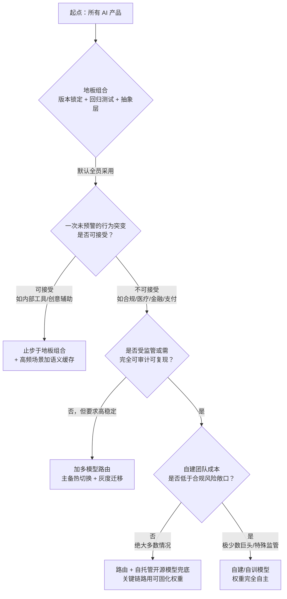

模型供应商可以在你不知情的情况下，单方面改变你产品的底层行为——这是传统软件没有的一类风险，也没有一个现成的"最佳实践"能一劳永逸地对冲它。本节点要解决的问题：面对模型时间性风险（弃用、静默更新、行为漂移），市面上至少有六种应对策略（版本锁定、快照固化、回归测试、多模型路由、自建模型、抽象层），它们各自对冲掉了什么、又引入了什么新成本，PM 如何在一张矩阵里把它们的取舍看清楚，并据此做出**适配自己业务时间常数**的组合决策。视角/框架：把六策略沿"成本 × 可控性 × 锁定 × 质量"四维拉成对照矩阵，再收敛成一棵决策树——这是一篇 `comparison` 节点，它的价值不在于罗列策略，而在于给出**选择策略的判断标准**。

## §0 为什么是"对冲矩阵"而不是"最佳实践清单"

读者打开这一节，脑中默认想要的是一份"照做就对"的最佳实践清单——"用快照 ID、加回归测试、上抽象层，齐活"。这个期待本身就是错的，必须先挡掉。

**最佳实践清单的隐含假设是"存在一个所有人都该采用的最优解"。** 但时间性风险的对冲根本不存在这样的解，因为每种策略都是一笔**对冲交易**：你付出一种成本，买回一种确定性。版本锁定买回行为稳定，付出的是被强制弃用时的"悬崖式迁移"；多模型路由买回供应商可替换性，付出的是 prompt 维护量乘以供应商数量；自建模型买回完全控制权，付出的是七位数的年度算力与团队成本。**没有免费的对冲**——这是金融衍生品市场两百年来的铁律，搬到 AI 供应链上同样成立。

所以正确的框架是**对冲矩阵 + 决策树**，而不是清单。矩阵让你看清每笔交易的对价；决策树让你根据**自己业务的两个关键参数**——容错度（一次行为突变能不能接受）与时间常数（产品迭代周期 vs 模型弃用周期的比值）——选出该买哪几笔。一个周更的营销文案生成器和一个受监管的金融合规审核系统，最优组合截然不同。把它们塞进同一份"最佳实践"，等于让所有人穿同一码鞋。

这也是本节点与上游 [A03 供应商依赖与控制权丧失](/kb/专题-人文社科透镜/a03-供应商依赖与控制权丧失/)、[A05 路径依赖与技术锁定](/kb/专题-人文社科透镜/a05-路径依赖与技术锁定/) 的分工：A03/A05 论证"风险为何不可消除、锁定为何自我强化"，本节点接力回答"既然消不掉，怎么对冲、对冲到什么程度"。它把抽象的风险论述，落成 PM 选型会上可以直接画在白板上的一张表和一棵树。

## §1 六策略的一句话定义与对冲对象

先把六个策略钉死，避免后面对照时概念滑动。每个策略本质上都在对冲 0432 专题识别出的某一类时间性风险（弃用 / 静默更新 / 行为漂移 / 控制权丧失）。

| 策略 | 一句话定义 | 主要对冲的风险 |
|---|---|---|
| **版本锁定（Version Pinning）** | 调用固定快照 ID（如 `gpt-4o-2024-11-20`）而非移动别名（`gpt-4o`） | 静默更新、行为漂移 |
| **快照固化（Snapshot/缓存固化）** | 把模型输出或整模型权重物化下来（缓存结果 / 开源模型自托管权重） | 弃用、不可复现 |
| **回归测试（Eval 回归）** | 维护一组黄金样本，每次模型/版本变动自动跑评测对比基线 | 行为漂移（检测而非阻止） |
| **多模型路由（Multi-model Routing）** | 同一业务对接 ≥2 家供应商，可热切换或按用例分流 | 控制权丧失、单点弃用 |
| **自建模型（Self-hosted/Fine-tuned）** | 自托管开源模型或自训模型，权重在自己手里 | 一揽子（但代价最高） |
| **抽象层（Abstraction Layer / Gateway）** | 用 LiteLLM、Portkey 等网关把应用逻辑与具体模型 API 解耦 | 降低其它策略的实施成本（元策略） |

⚠️ 关键区分：**抽象层不与其它五条并列，它是元策略**——它本身不对冲任何风险，而是降低"多模型路由""版本锁定切换"的工程成本。把它和版本锁定放在同一层比较，是后面 §4 要专门拆的一个常见错位。

## §2 四维对照矩阵（核心交付物）

这是本节点的命门表。四个维度的含义先界定清楚，避免"成本"被偷换：

- **成本**：实施 + 持续维护的工程/算力/资金投入（越低越好）。
- **可控性**：当模型行为发生非预期变化时，你能多快、多大程度地恢复到可预期状态（越高越好）。
- **锁定**：采用该策略后，你对单一供应商的依赖被加深还是被削弱（越低越好）。
- **质量**：在对冲生效的同时，对产品当下输出质量的影响（中性最佳——既不该为对冲牺牲质量，理想策略应质量中性）。

| 策略 | 成本 | 可控性 | 锁定（越低越好） | 质量影响 | 一句话取舍 |
|---|---|---|---|---|---|
| **版本锁定** | 极低（改一个字符串） | 中（挡住静默更新，但挡不住强制弃用） | 中（仍绑定该厂，且快照终会退役） | 中性偏正（行为可复现） | 性价比最高的第一道防线，但有保质期 |
| **快照固化·缓存** | 低 | 高（命中即不依赖实时模型，且降本，见 [m209 - 推理成本控制手册](/kb/工程化与落地架构/m209-推理成本控制手册/) §2.6.4 语义缓存） | 低（缓存层与模型解耦） | 取决于场景（个性化/创意场景反伤质量） | 高频重复场景的双赢，长尾场景无效 |
| **快照固化·权重自托管** | 高（GPU + 运维） | 极高（权重在手，永不被弃用） | 极低 | 中（开源模型多数仍落后旗舰闭源 1–2 档） | 用质量代差换永久可控 |
| **回归测试** | 中（需建并维护黄金集 + CI） | 中（只检测、不修复，但让你"先于用户发现"） | 低（与供应商无关，纯自有资产） | 中性（不改输出，只监控） | 所有策略的必备配套，不是替代项 |
| **多模型路由** | 中高（prompt × 供应商数，格式不兼容需重写） | 高（一家漂移/涨价/弃用即切换） | 极低（议价权回到自己手里） | 中性偏正（可择优路由） | 买退出权与议价权，付维护税 |
| **自建模型** | 极高（团队 + 算力 + 数据，七位数/年起） | 极高 | 最低（完全自主） | 高度依赖团队水平（多数团队做不过旗舰） | 战略级豪赌，绝大多数产品不该选 |
| **抽象层（元）** | 低中（接入一次） | —（放大他人可控性） | 降低（让切换变便宜） | 中性 | 不是对冲手段，是让对冲变便宜的基建 |

> [!note] 矩阵读法
> 不要找"全绿的那一行"——不存在。正确读法是：**先用 §3 决策树定位你的业务象限，再回到本表看那几行该如何组合**。版本锁定 + 回归测试 + 抽象层是几乎所有产品的"地板组合"（低成本、必备）；多模型路由/权重自托管/自建是按业务容错度逐级加码的"天花板组合"。

## §3 决策树：给"如何对冲模型时间性风险"一个可执行流程

矩阵回答"每笔交易的对价"，决策树回答"我该买哪几笔"。两个输入参数：**容错度**（一次未预警的行为突变，对你的用户/合规/营收是否可接受）与**时间常数比**（你的产品迭代周期 ÷ 供应商的模型弃用周期）。

**决策树的三条硬判断（带数字接地）：**

1. **地板组合对所有人非负**：版本锁定改一个字符串、回归测试是自有资产、抽象层接入一次——三者成本极低而可控性立竿见影，没有理由不做。Chen, Zaharia & Zou（2023, arXiv:2307.09009）实测 GPT-4 素数识别准确率三个月内从 84% 跌到 51%（-33pp），若没有回归测试，这种漂移你只会在用户投诉时才发现。

2. **容错度是第一分水岭**：金融合规场景的反直觉证据——Khatchadourian & Franco（2025, arXiv:2511.07585）发现 GPT-OSS-120B 在 480 次实验中 T=0 时仅 12.5% 输出一致性（95% CI: 3.5–36.0%），而 7–8B 小模型达 100% 一致性。这意味着对"可复现性"要求极高的合规场景，**小模型/可固化权重反而优于旗舰**——容错度低不等于"用最强模型"，而是"用最可控模型"。

3. **自建是天花板而非默认**：迁移成本的现实数据——深度集成（fine-tuning + embeddings + 复杂 prompt）的模型迁移需 80–120 小时；生产 prompt 平均 40% 是规格、60% 是针对旧模型行为的补丁（来源：VentureBeat / safjan.com 行业实测）。自建省掉的是"被供应商牵着走"，但换来的是把整条模型供应链的成本内化。除非合规风险敞口确实大于七位数/年的自建成本，否则不选。

## §4 判断主轴：90% 的人在这五个点上会搞错

这是把对照矩阵从"信息"升级成"判断"的一节。每点四件套：症状 → 为什么会错 → 正确做法 → 真实反例。

**错位一：把版本锁定当成"一劳永逸"。**
- 症状：钉死 `gpt-4-0613` 后就再也不管了，以为行为永久冻结。
- 为什么会错：版本锁定只挡静默更新，**挡不住强制弃用**——快照本身有退役日。`gpt-4-0613` 已计划 2026-10-23 停服；`text-davinci-003` 已于 2024-01-04 下线（来源：OpenAI 官方弃用文档）。
- 正确做法：版本锁定必须配一个"弃用监控 + 迁移预案"，把锁定当成"赎回日期已知的债券"而非"永续票据"。
- 真实反例：2026 年 1 月 OpenAI 以两周预警下线多个模型，引发开发者强烈反应（The Register, 2026-01-30 报道）——只锁版本、没建迁移预案的团队当场被动。

**错位二：把抽象层当成对冲手段本身。**
- 症状："我们上了 LiteLLM，所以模型风险解决了。"
- 为什么会错：抽象层只统一了**调用接口**，不统一**模型行为**。换一行代码就能从 GPT 切到 Claude，但 prompt 不会自动适配——OpenAI 偏好 Markdown 结构化分隔、Anthropic 偏好 XML 标签，agentic 层的行为高度模型特定。
- 正确做法：抽象层 + 多模型路由 + 每模型独立 prompt 集 + 回归测试，四件套才构成真正的可切换性。
- 真实反例：Sensible 公司迁移实录——官方推荐用 `gpt-3.5-turbo-instruct` 替换弃用模型后置信度评分显著回归，被迫拆成两次 API 调用，最终弃用官方推荐、改用 `gpt-3.5-turbo-0613`。接口层早就抽象好了，行为层照样翻车。

**错位三：把回归测试当成"可选项"或"等出问题再加"。**
- 症状：先上线，等用户报 bug 再补 eval。
- 为什么会错：行为漂移是**分布偏移**，不是离散 bug——它不会触发报错，只会让输出"悄悄变差"，等用户感知到时往往已积累大量劣质输出。
- 正确做法：黄金样本集（200–500 条生产查询 + 50–200 条人工验证样本）随产品一起上线，每周自动跑。详见 [m209 - 推理成本控制手册](/kb/工程化与落地架构/m209-推理成本控制手册/) 提到的内嵌评估基础设施思路。
- 真实反例：学术界的复现危机即此问题的极端版——Angermeir et al.（2025, arXiv:2510.25506）抽查 85 篇 LLM 论文，仅 5 篇可执行、零篇完整复现，首要技术原因正是用移动别名而非快照、且无固化基线。连论文都因此报废，生产系统更经不起。

**错位四：把多模型路由理解成"同时全量跑多家"。**
- 症状：以为路由就是每个请求都打两家、对比结果，成本翻倍还嫌贵。
- 为什么会错：路由的价值是**可切换性（option value）**，不是冗余计算。绝大多数时间只走主供应商，备用链路只需保持"随时可切"的就绪态（影子测试 + 灰度发布能力）。
- 正确做法：主备架构 + 定期影子测试（48–72 小时验证备用链路）+ 渐进式切换能力（5%→20%→50%→100%），平时只付主链路成本，危机时才付切换成本。
- 真实反例：采用多供应商策略的团队占比已从 23% 升至 40%（截至 2025 年，来源：行业报告）——增长的不是"全量双跑"的团队，而是"留好退路"的团队。

**错位五：把"自建模型"当成中型团队的可行选项。**
- 症状："闭源模型不可控，我们自己训一个。"
- 为什么会错：自建对冲的是控制权，但绝大多数团队自训/自托管的模型质量落后旗舰闭源 1–2 档，等于用**确定的质量损失**去换**不确定的未来风险**——这笔对冲在质量维度是亏的。
- 正确做法：中型团队的"自主"上限通常是"自托管开源模型作兜底/备用链路"，而非全栈自建。把自建留给质量代差能被业务容忍、或合规敞口确实超过算力成本的极少数场景。
- 真实反例：Jasper AI——核心能力是 GPT-4 之上的 prompt 工程，OpenAI 直接开放 ChatGPT 后差异化消失，2024 年收入从峰值约 $120M 跌至约 $55M（-54%，来源：Maginative 等报道）。它的教训反向证明：在模型层往上做才是出路，往模型层硬刚（自建）对多数团队是死路。

## §5 产品 PM 视角补盲

工程视角容易把这张矩阵读成纯技术选型，但对冲决策本质是**商业与合规决策**，三个看走眼的点：

- **对冲成本要进单位经济模型**：多模型路由的"prompt 维护量 × 供应商数"是一笔持续的人力成本，必须摊进每次对话的边际成本里——这正是 [m209 - 推理成本控制手册](/kb/工程化与落地架构/m209-推理成本控制手册/) 成本估算框架该补的一栏。一个被忽略的事实：模型时间性风险与成本是**耦合**的，LLMflation（推理成本约每年降 10 倍）意味着"不切换"本身也有机会成本——Divyam.ai 案例中一家中型 SaaS 因"模型惰性"年损耗约 $333,000。对冲不只是防损，也是逐利。
- **可控性是对用户的隐性承诺**：当你的产品输出突然变风格/变保守（GPT-4o 在 June 版本对敏感问题回答意愿显著下降，来源：Chen et al. 2023），用户体验的断裂感由你承担、不由供应商承担。版本锁定 + 回归测试本质是在**替供应商向用户兑现"行为稳定"的承诺**。
- **合规场景的对冲是"可审计性"而非"最强性能"**：受监管业务（金融、医疗）真正需要的是"能向监管复现当时的决策依据"，这要求快照固化 + 完整记录（模型 ID + 评估日期 + temperature + system prompt 版本）。此时一个稳定可复现的小模型，监管价值高于一个更强但会漂移的旗舰。

## §6 对手框架回应：接受 + 边界

**业界主流反方一：YAGNI 派（"过度工程化"）。** 不少资深工程师认为，对冲模型风险是 premature optimization——"先用 `gpt-4o` 别名跑起来，等真出问题再说，绝大多数产品活不到模型弃用那天"。
- **接受**：对早期验证 PMF 的产品，这是对的。在没有用户、没有营收时为对冲花工程预算，确实是把稀缺资源投错地方；地板组合里只有"版本锁定"几乎零成本，其余可以缓。
- **边界与赌注**：我赌的是——**一旦产品进入有营收、有用户依赖的阶段，对冲的边际收益会陡升**，而届时再补"地板组合"的成本远高于一开始就铺好。YAGNI 适用于"功能"，不完全适用于"风险敞口"：风险不是你需要时才出现，而是它出现时你才发现需要。分界线是 PMF——之前听 YAGNI，之后立刻铺地板组合。

**业界主流反方二：MCP/标准化乐观派。** 以 Anthropic 2024 年 11 月发布、被 OpenAI/Microsoft 接受的 MCP（Model Context Protocol，被称为"AI 的 USB-C"）为代表，一派观点认为开放标准会从根本上消解锁定，对冲策略迟早被标准化基建取代。
- **接受**：MCP 确实降低了**工具/上下文接入层**的切换成本，这是真实进步，抽象层这一行的成本会因它继续下降。
- **边界与赌注**：我赌标准化解决不了**行为层**的锁定。MCP 统一的是协议，不是模型行为——各厂商 agentic 层的行为依然高度模型特定，prompt 仍需逐家重写。USB-C 让你能插上任何设备，但不保证插上后两台设备表现一样。所以即便 MCP 普及，回归测试与多模型独立 prompt 集仍不可替代。

## §7 跨域呼应：把策略矩阵读成一份"风险对冲组合"

> [!note] 跨域调度：金融风险管理 / 实物期权（Real Options）理论
> 把六策略读成**金融衍生品组合**，是本节点判断力的来源。"实物期权（real options）"一词由 Stewart Myers 在 1977 年论文《Determinants of Corporate Borrowing》（*Journal of Financial Economics*, vol. 5, pp. 147–175）中首次提出，核心洞察是：在不确定性高的环境下，"保留未来选择的权利"本身具有可定价的价值（option value），即便这个权利当下不被行使。
>
> 这个框架直接改写了对"多模型路由"的判断：路由的成本不该用"它今天帮我省了多少/赚了多少"来算，而该用"它保留的退出权值多少钱"来算——这正是为什么 §4 错位四（把路由当全量双跑）是错的：那是把期权当成了现货在用。同理，版本锁定是一份"行为稳定性的短期保险"（有保费、有保质期），自建模型是"买断标的资产"（最贵但最自主）。
>
> 一旦用对冲组合的眼光看这张矩阵，PM 的语言就从"用哪个最佳实践"升级成了"我的风险敞口是多少、我愿意为哪些确定性付多少对价、我的对冲组合是否过度/不足"。这是 Rick 的滴滴双边市场经验可迁移的直接资产：平台对司机收入波动的对冲（最低收入保障、动态补贴）与产品方对模型行为波动的对冲，是同一套风险定价逻辑在不同供应链层的应用——详见 [A06 滴滴平台政策类比与 AI 的更极端性](/kb/专题-人文社科透镜/a06-滴滴平台政策类比与-ai-的更极端性/)。

## §8 PM 决策启示

- **面试怎么用**：被问"你们怎么应对模型更新风险"，不要答"用最新最强的模型"——那暴露了你没有风险框架。答"先分容错度与时间常数两个参数，地板组合（版本锁定+回归测试+抽象层）全员铺，再按业务象限决定是否加路由/自托管"，并能说清每笔对冲的对价。30 秒讲清这棵决策树，就赢了。
- **选型会怎么用**：把 §2 矩阵和 §3 决策树直接画上白板，逼团队回答两个问题——"我们的容错度是多少？""我们的产品迭代周期 vs 模型弃用周期是多少？"。绝大多数选型分歧，根源是这两个参数没对齐。
- **复现/落地怎么用**：上线 checklist 第一条永远是"快照 ID 钉死了吗、黄金样本集建了吗"。这是成本最低、ROI 最高的两件事，却最常被跳过。

## §9 与已有节点的关系

- 对照 [m209 - 推理成本控制手册](/kb/工程化与落地架构/m209-推理成本控制手册/)：m209 §2.6 系列从**成本**维度论述了语义缓存、模型路由、对话管理。本节点做的是**纠偏 + 升维**——把这些手段从"省钱工具"重新定位为"风险对冲工具"，补上 m209 未展开的"成本与时间性风险耦合"视角（同一个"路由"，m209 算的是单价、本节点算的是 option value）。不复述 m209 的计费公式与缓存命中率数字。
- 对照本专题 [A03 供应商依赖与控制权丧失](/kb/专题-人文社科透镜/a03-供应商依赖与控制权丧失/) 与 [A05 路径依赖与技术锁定](/kb/专题-人文社科透镜/a05-路径依赖与技术锁定/)：A03/A05 是**问题侧**（风险为何不可消、锁定为何自强化），本节点是**解侧**（既然消不掉怎么对冲）。三者构成"诊断 → 处方"的闭环。
- 与 [A04 无 Changelog 的认识论](/kb/专题-人文社科透镜/a04-无-changelog-的认识论/) 对话：A04 论证"无 changelog 让归因失效"，本节点的"回归测试"正是对这一认识论困境的**工程回应**——既然供应商不给 changelog，就用黄金样本集自己生成一份"行为变更日志"。

## §10 关联节点

**核心（必读）**
- [A03 供应商依赖与控制权丧失](/kb/专题-人文社科透镜/a03-供应商依赖与控制权丧失/) — 本节点的问题侧前提
- [A05 路径依赖与技术锁定](/kb/专题-人文社科透镜/a05-路径依赖与技术锁定/) — 解释为何"不对冲"会自我恶化
- [A04 无 Changelog 的认识论](/kb/专题-人文社科透镜/a04-无-changelog-的认识论/) — 回归测试策略的认识论动因
- [A02 模型更新致行为突变](/kb/专题-人文社科透镜/a02-模型更新致行为突变/) — 对冲对象（行为漂移）的实证基础
- [m209 - 推理成本控制手册](/kb/工程化与落地架构/m209-推理成本控制手册/) — 成本维度的升级对照源

**延伸（可选）**
- [A06 滴滴平台政策类比与 AI 的更极端性](/kb/专题-人文社科透镜/a06-滴滴平台政策类比与-ai-的更极端性/) — 跨域呼应的平台风险对照
- [G01 软件时间性代际谱系总图](/kb/专题-人文社科透镜/g01-软件时间性代际谱系总图/) — 把对冲策略放回时间维度
- [OpenAI](/kb/ai-公司与产品/openai/) / [Claude](/kb/ai-公司与产品/claude/) — 弃用政策与行为漂移的具体供应商
- [Agent](/kb/基础知识库/agent/) — agentic 层行为高度模型特定，路由策略的难点所在
- [幻觉](/kb/基础知识库/幻觉/) — 回归测试黄金集需覆盖的典型失效类别
- 0133新制度经济学 — 切换成本与制度锁定的经济学底座
- 0133信息经济学 — 供应商与产品方的信息不对称（无 changelog）

## §11 修订日志

- R1（2026-06-07）：首稿。建立六策略 × 四维对照矩阵 + 决策树（双参数：容错度 / 时间常数比）；判断主轴五错位；引入实物期权理论作跨域呼应，将策略矩阵重读为风险对冲组合；与 m209 建立"成本→对冲"升维对照。〔待核实项：LLMflation 年损耗 $333,000 案例为单一商业博客来源，需第三方佐证；行业报告类数字（多供应商团队占比 23%→40%、75% 企业观察到性能下降）非同行评审来源，正文已标来源类型。〕
