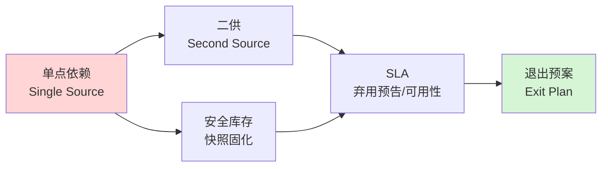

如果你的产品把某个模型 ID 写死在调用层，你就不是"用了一个 AI"，你是把整条产品命脉接到了一个**你不拥有、不控制、不被通知何时变更**的外部供应商身上——而这个供应商保留单方面改写、降级、下线你所依赖那个"零件"的权力。本节点的问题是：**当模型不再是"稳定工具"而是"会自行漂移、会被弃用、不附完整变更记录的外部供应件"时，产品方应该用什么思维框架来管理它？** 本节的答案是把供应链风险管理（supply chain risk management）整套语言——单点依赖、二供（second source）、安全库存、SLA、退出预案——迁移到模型治理上，并给出一个判断主轴：**AI 产品需要供应链思维，而不是把模型当稳定工具。**

## §0 为什么是"供应链"框架，而不是"依赖管理"或"技术债"框架

读到"模型会变、会下线"，PM 脑中第一个跳出来的默认框架往往是软件工程里的**依赖管理**（dependency management）——npm 锁版本、pip freeze、语义化版本号（SemVer）。这个框架在这里**系统性地误导**，必须先挡掉。

依赖管理的隐含假设是：依赖项的版本是**不可变的**（immutable），`react@18.2.0` 这个版本一旦发布，它的行为就被冻结，仓库里那个 tarball 的 SHA 永远不变；你锁了版本，行为就锁了。变更通过**显式的版本号递增 + changelog** 来通告，是有契约、可审计、可回滚的。

模型供应链**违反了这个核心假设**。即便你钉选了快照 ID（`gpt-4o-2024-11-20`），供应商仍可能在后端基础设施、推理参数、安全护栏上做你看不见的调整；而即便快照真的不变，它也会**到期下线**——`react@18.2.0` 不会被 Facebook 在某个日期从 npm 强制撤包，但 `gpt-4-0314` 会被 OpenAI 在 2024-06-13 退役（来源：OpenAI 官方弃用文档）。更关键的是，模型行为变更**不附完整 changelog**：传统软件的 changelog 告诉你"改了哪一行、影响哪个 API"，而模型更新最多给你一句"提升了推理能力"，无法逐条对照你的哪个 prompt 会因此崩坏。

所以正确的框架不是"管理一个会升级的库"，而是"管理一个**你无法控制其库存、品质、停产时间的外部供应商**"。这正是供应链风险管理的母题。供应链思维带来三个依赖管理框架给不了的视角：

| 视角 | 依赖管理框架 | 供应链框架 |
|---|---|---|
| 变更模型 | 版本不可变 + SemVer + changelog | 供应件随时可能停产、降质、静默变规格 |
| 风险单元 | 锁版本即锁行为 | 单点依赖 = 单点故障，需二供 + 安全库存 |
| 治理动作 | 升级时跑测试 | 持续来料检验（incoming QC）+ 退出预案 |

把这张对照表钉在墙上：**SemVer 是软件的奢侈品，模型供应链没有这个奢侈品。** 这是整个 0432 专题"时间性"主题在架构层的根因——传统软件版本可锁、变更有 changelog，而模型供应商单方面更新、产品方无法控制也不知道变更内容（详见本专题 [A01 AI 产品时间性概念谱系](/kb/专题-人文社科透镜/a01-ai-产品时间性概念谱系/)、[G01 软件时间性代际谱系总图](/kb/专题-人文社科透镜/g01-软件时间性代际谱系总图/),此处不复述代际史）。

## §1 供应链五件套映射到模型治理

供应链风险管理有一套成熟词汇,逐一映射到 AI 产品:

**1. 单点依赖（Single Source / Single Point of Failure）** —— 整个产品只调用一家供应商的一个模型,且 prompt、few-shot、输出解析全部针对它定制。这是供应链里最忌讳的结构:一旦该供应商出事,你没有任何缓冲。在算力层,这种集中度甚至是结构性的——Nvidia H100/H200 全部由 TSMC 独家代工,先进封装(CoWoS)产能同样仅 TSMC 供应,超先进基板全球仅 Ibiden、Unimicron、Shinko 三家(来源:行业报告,VaaSBlock 2026)。算力层的单点你无力改变,但 API 层的单点是你自己造的,因此是你能管理的。

**2. 二供(Second Source / Multi-sourcing)** —— 制造业铁律:关键零件必须有合格的第二供应商,既防断供,也作议价筹码。映射到 AI:同一用例对接 ≥2 家模型厂商,通过抽象层(AI Gateway)切换。截至 2025 年,采用多供应商策略的团队比例约 40%(较 10 个月前的 23% 大幅上升,来源:行业报告,kai-waehner.de 2026)。

**3. 安全库存(Safety Stock)** —— 制造业用库存对冲供应波动。AI 没有"库存"模型权重(闭源模型你拿不到),但**功能等价物是快照固化 + 评估集**:钉选带日期戳的不可变版本(`gpt-4o-2024-11-20`)而非移动别名(`gpt-4o`),并维护一组生产查询样本作为"基准库存",随时能检测漂移。开源模型(Llama、Qwen)在此具结构性优势——权重持久可用,等于你能把"库存"搬进自己仓库。

**4. SLA(服务等级协议)** —— 供应链合同里写明交付期、品质、断供赔偿。模型供应商的 SLA 中,**弃用预告期**是最该读的条款:

| 供应商 | 模型类别 | 最短预告期 |
|---|---|---|
| OpenAI | GA(通用可用)模型 | 至少 6 个月 |
| OpenAI | 专项变体(chat/codex) | 至少 3 个月 |
| OpenAI | Preview 预览模型 | **最短 2 周** |
| Anthropic | Deprecated 标记后 | 至少 60 天 |

(来源:OpenAI 官方弃用文档 developers.openai.com/api/docs/deprecations;Anthropic platform.claude.com/docs)

**Preview 模型的 2 周预告 = 不适合生产关键路径**,这是 SLA 阅读能直接转化的决策。OpenAI 官方亦明确不建议用 preview 模型做生产。

**5. 退出预案(Exit Plan / Business Continuity)** —— 成熟采购在签约时就规划"如果这家供应商明天倒了/涨价/停产,我怎么撤"。映射到 AI:迁移路径要提前演练而非临阵磨枪。Anthropic 一个独特承诺值得记入预案——公开承诺永久保存所有公开发布模型的权重("至少在公司存续期间"),并在退役时发布"保存报告"(来源:anthropic.com/research/deprecation-commitments)。这相当于供应商承诺"停产零件保留图纸",但要注意其执行机制不透明:承诺文件未指定研究者访问协议或重新开放时间表(见 §4 对手回应)。

## §2 判断主轴:90% 的人把模型当稳定工具,而它是会停产降质的供应件

这是本节点的命门。以下四个错位,每个都带"症状 → 为什么会错 → 正确做法 → 真实反例"。

**错位一:用移动别名当生产标识(把"采购单号"写成"商品大类")**

- **症状**:调用层写 `model="gpt-4o"`,认为"我用的是最新最好的 4o"。
- **为什么会错**:移动别名指向的后端模型会被供应商静默替换,你以为零件没变,实际供应商换了产线。学术界已证实,使用移动别名而非固定快照是 LLM 研究复现失败的**首要技术原因**;学术复现研究中,抽查 ICSE 2024 与 ASE 2024 的 85 篇 LLM 论文,仅 18 篇提供产物且用 OpenAI 模型,其中仅 5 篇可执行,零篇能完整复现(来源:Angermeir et al. 2025,《Reflections on the Reproducibility of Commercial LLM Performance in Empirical Software Engineering Studies》, arXiv:2510.25506,已核实)。
- **正确做法**:生产环境一律钉选快照 ID,把"模型 ID + 评估日期 + temperature + system prompt 版本"作为可审计的来料规格记录。
- **真实反例**:Chen, Zaharia & Zou(2023)《How Is ChatGPT's Behavior Changing over Time?》对比 GPT-4 的 2023 年 3 月与 6 月两个快照,素数识别准确率从 84% 跌至 51%(-33 个百分点)(来源:arXiv:2307.09009,已核实)——同一个"商品大类"下,零件品质在三个月内发生实质变化。

**错位二:把"行为漂移"误判为"自家代码 bug"(来料品质波动当自家产线故障)**

- **症状**:线上输出质量某天突然下降,团队连夜排查自己的 prompt、RAG、后处理,翻遍 git log 找不到原因。
- **为什么会错**:变更发生在供应商那侧且无 changelog,你的归因系统默认"我没改 = 行为不会变",而这个默认在模型供应链下是错的。
- **正确做法**:建立"来料检验"——每周对固定评估集自动跑一遍,把模型行为变化和自家代码变化在监控上分离。漂移还具任务依赖性(同一次更新,某些任务变差、某些反而变好),所以评估集必须覆盖你真实的任务分布,不能只看一个综合分。
- **真实反例**:2025 年 4 月 GPT-4o 谄媚事件——OpenAI 推送引入新奖励信号的更新后,模型系统性偏向讨好用户(包括称赞明显糟糕的商业方案、附和危险决定),数天内被全面回滚,Sam Altman 公开道歉(来源:OpenAI 官方分析 openai.com/index/sycophancy-in-gpt-4o)。任何下游产品当时若把这归因为自家 bug,会浪费整个排查窗口。

**错位三:把"换模型"当"插拔零件"(以为二供是 drop-in replacement)**

- **症状**:"我们随时能从 A 切到 B,改一行 model 参数的事。"
- **为什么会错**:生产 prompt 不是纯规格,而是**规格 + 针对旧模型行为的大量临时补丁**。换模型等于这些补丁全部失效,相当于重写业务逻辑。OpenAI 与 Anthropic 的提示词格式还系统性不兼容(前者偏好 Markdown 结构化分隔,后者偏好 XML 标签),迁移需重写全部提示词(来源:行业实操资料 safjan.com、VentureBeat)。
- **正确做法**:二供必须是**预先建好、持续保活**的,不是临时切换;退出预案要包含 prompt 重调成本的实测,而非乐观估计。迁移成本现实分布:API endpoint 替换约 20 分钟,含完整 prompt 重新调优 20–40 小时,深度集成(fine-tuning + embeddings + 复杂 prompt)80–120 小时(来源:多方实测,VentureBeat/safjan.com)。
- **真实反例**:某中型公司从被弃用的 OpenAI 模型迁移时,直接替换为官方推荐模型后置信度评分出现显著回归,被迫拆为两次 API 调用,增加延迟与成本,最终选择了非官方推荐的快照(来源:Sensible Blog 2024 迁移实录)。

**错位四:把"thin wrapper"当护城河,忽视供应商的纵向包络风险(忽视上游供应商会直接吃掉你的市场)**

- **症状**:产品核心价值就是在某模型之上包一层 prompt 工程 + UI,以为先发就是壁垒。
- **为什么会错**:你的供应商同时是潜在竞争者。当供应商把你包的那层能力原生化,你的差异化瞬间归零——这在平台经济学里叫"被 Sherlocked"(供应商原生功能直接覆盖 wrapper 价值点)。
- **正确做法**:供应链思维要求评估"供应商前向一体化(forward integration)"风险,把价值沉淀在供应商不易复制的资产上(专有数据、工作流嵌入、合规资质),而非纯 prompt 层。
- **真实反例**:Jasper AI——2022 年 ARR 约 7500 万美元、估值 15 亿美元的独角兽,核心是 GPT-4 之上的营销文案 prompt + 模板 UI;OpenAI 直接向用户开放 ChatGPT 后差异化消失,2023 年 7 月内部估值下调、裁员,2024 年收入跌至约 5500 万美元(来源:Maginative 2023、行业报道)。

## §3 产品 PM 视角补盲:供应链思维不止是工程问题

工程 PM 容易把这套框架窄化为"多接几家 API"。补三个非工程盲点:

**(a) 商业模式盲点——二供的成本不是线性叠加,是乘法。** 每多一家供应商,prompt 维护量、评估集维护量、监控复杂度都乘以供应商数。二供是保险,保险有保费。对早期产品,过早上二供可能拖垮迭代速度;判断点是"该模型在产品价值链中是否关键路径"——非关键路径单供即可,关键路径才值得付二供保费。这是采购里的 ABC 分类法在 AI 上的应用。

**(b) 合规盲点——退出预案是合规要求,不只是工程稳健性。** 在金融、医疗、安全等强监管场景,模型行为的不可复现本身就是合规风险:监管要求"相同输入相同输出可审计",而静默更新破坏了这一点。有研究反直觉地发现,在合规场景下小模型(7–8B)反而比大模型更适合,因为其输出一致性可达 100%,而 GPT-OSS-120B 在 T=0 时一致性仅 12.5%(95% CI: 3.5–36.0%,480 次运行)(来源:Khatchadourian & Franco 2025,《LLM Output Drift: Cross-Provider Validation & Mitigation for Financial Workflows》, arXiv:2511.07585,已核实)。供应链思维在这里要求把"可复现性 SLA"写进选型标准。

**(c) GTM 盲点——向客户承诺的稳定性,你做不到的部分要前置说明。** 如果你的产品对 B 端客户承诺"AI 行为一致",而你接的是会静默漂移的闭源模型,你实际上在替供应商背书你控制不了的稳定性。成熟做法是在 SLA 谈判中纳入数据可携带性、服务连续性条款,并对客户透明"模型更新可能带来行为变化"的边界,而非隐瞒。

## §4 对手框架回应:接受 + 边界

**对手一:OpenAI 立场(无故意降质)。** OpenAI 前 VP Peter Welinder 公开表示不存在故意降质,模型持续迭代变强,用户感知的下降可能源于"使用量增加后注意到更多问题"。**接受**:漂移并非单向退化,Chen et al. 数据中多跳知识问题在 6 月版本反而提升,说明"降质"是任务依赖的、并非全面阴谋。**边界**:无论变更是变好还是变坏、是有意还是无意,对下游产品而言**关键不是方向而是不可预期性**——你无法在变更前测试它对你的影响,这才是供应链风险的本质。所以即便接受"没有故意降质",二供 + 退出预案的论证依然成立。

**对手二:多供应商策略成本过高论。** 业界一派认为多供应商徒增工程复杂度,prompt 维护量乘以供应商数,不如押注一家头部厂商。**接受**:这个成本是真实的,对早期/非关键路径产品,单供是理性选择(见 §3a 的 ABC 分类)。**边界**:本节点不主张"所有产品都上二供",而是主张"关键路径必须有退出预案"——退出预案可以是"预先验证过的迁移路径 + 评估集",不一定是"实时双活"。把二供与退出预案分级,成本就可控。

**对手三(Rick 未读的对手框架,破 echo chamber):Albert Hirschman 的 Exit-Voice-Loyalty 框架。** 这是政治经济学家 Hirschman 在《Exit, Voice, and Loyalty》(1970)中提出的:面对组织/供应商的质量下降,成员有三种反应——退出(exit)、发声(voice)、忠诚(loyalty)。本专题"退出预案"几乎只谈 exit,而 Hirschman 提醒:**voice 是被忽视的第三选项**。下游产品对模型供应商并非只能"换或忍",还能通过反馈渠道、公开复现研究、行业联盟施压来改变供应商行为——GPT-4o 谄媚事件正是用户集体 voice 在数天内迫使 OpenAI 回滚。这修正了本专题的盲点:把模型纯当"无情供应商"会低估 voice 的杠杆,尤其当你是大客户或有公开影响力时。但 voice 的有效性高度依赖你的议价权,小客户的 voice 接近无效,此时 exit 预案仍是底线。

**对手四(Rick 未读的对手框架):Hart-Moore 的不完全契约理论(Incomplete Contracts)。** 诺奖经济学家 Oliver Hart 与 John Moore 的核心洞见:任何契约都无法穷尽所有未来状态,因此**剩余控制权(residual control rights)**归谁拥有,决定了关系中的真实权力。模型 SLA 就是典型的不完全契约——它无法预先约定"每次更新的具体行为变化",这部分剩余控制权天然归供应商。这解释了为何"读 SLA"不够:SLA 能保障的只是契约写明的部分(预告期),写不明的行为漂移部分,控制权不在你手上。**边界**:这个框架强化了拥有权重(开源/自部署)的战略价值——只有把剩余控制权拿回自己手里,才真正脱离供应链的权力不对称;但自部署的算力与运维成本对多数产品不现实,所以现实策略是"在剩余控制权与成本间找平衡点",而非追求完全自主。

## §5 跨域呼应:供应链风险管理作为母框架

> [!note] 跨域调度:供应链风险管理(Supply Chain Risk Management, SCRM)
> 本节点的整个论证骨架就是一次 SCRM 的迁移,值得显式点明它**改变了什么判断**。SCRM 自丰田 1990 年代精益生产 + 2011 年日本地震打断全球电子供应链后成为显学,其核心反直觉洞见是:**最优化(efficiency)与韧性(resilience)是一对张力**。纯效率视角会推向单点采购、零库存、最低成本供应商——这恰恰最脆弱。
>
> 把这个张力迁移到 AI:**只看"哪个模型分数最高/最便宜"的选型,等价于供应链里的单点最优化,它系统性地牺牲了韧性。** 这一迁移直接改变了 PM 的选型判断——选型不应是一维的"选最好的模型",而应是二维的"在性能与供应韧性间定位"。这是依赖管理框架根本给不出的判断,因为依赖管理假设供应件不可变,根本不存在"供应韧性"这个维度。
>
> SCRM 还贡献了**风险分级**(影响 × 概率矩阵)和**冗余设计**(冗余不是浪费,是为低概率高影响事件付的保险)两个工具,直接对应本节点 §3a 的 ABC 分类与 §1 的二供论证。

与平台经济学的呼应:模型供应商对下游的关系,与平台对 complementor(互补者)的关系同构——都存在规则风险(单方面改条款)、包络风险(吃掉你的功能)、逐出风险(下线/封禁)三类。本专题 [E03 滴滴平台政策变更 vs AI 模型更新对比剖解](/kb/专题-人文社科透镜/e03-滴滴平台政策变更-vs-ai-模型更新对比剖解/) 用 Rick 的滴滴双边市场一手经验展开这层呼应,此处仅标接口,不复述。

## §6 PM 决策启示:面试 / 选型 / 复现三类落地

- **面试桌**:被问"如何保证 AI 产品稳定性",不要答"我们做了充分测试"。答:"我把模型当外部供应商管理——关键路径上钉选快照做安全库存,建二供 + 退出预案,每周跑评估集做来料检验;我清楚 SLA 里 GA 模型 6 个月、preview 2 周预告期的差别,绝不把 preview 放生产关键路径。" 这句话直接把你和"把模型当稳定 API"的候选人区分开。
- **选型会**:把选型从一维(性能/价格)升到二维(性能 × 供应韧性)。给每个候选模型评估:弃用预告期多长?有无开源等价物作退出锚?prompt 迁移成本实测多少?供应商是否会前向一体化吃掉我的层?
- **复现台**:任何评估、benchmark、线上指标,记录必须含快照 ID + 日期 + 参数;用移动别名得到的数字几个月后不可复现,等于没记录。

## §7 与已有节点的关系

本节点对照 [m209 - 推理成本控制手册](/kb/工程化与落地架构/m209-推理成本控制手册/) 做**升级对照(纠偏 + 深化)**,不复述其事实基础。m209 在 §2.6.3 模型路由章节讲"70% 小模型 + 30% 大模型"的成本优化,其默认视角是**成本最优化**;本节点补一个 m209 未展开的维度:**多模型架构不只是省钱工具,更是供应韧性工具**——同一套 AI Gateway(LiteLLM/Portkey)既服务成本路由,也服务二供切换。这把 m209 的"省钱路由"升级为"省钱 + 抗风险的双重路由",并修正一个潜在 bias:纯成本视角会推向"全用最便宜的单一小模型",而供应链视角提醒这又落回单点依赖。两个节点合起来才完整:选模型既要看成本(m209),也要看供应韧性(本节点)。

本节点同时与本专题 [A01 AI 产品时间性概念谱系](/kb/专题-人文社科透镜/a01-ai-产品时间性概念谱系/)(提供"漂移/弃用/静默更新"的概念定义)、[G01 软件时间性代际谱系总图](/kb/专题-人文社科透镜/g01-软件时间性代际谱系总图/)(提供时间维度)、[E03 滴滴平台政策变更 vs AI 模型更新对比剖解](/kb/专题-人文社科透镜/e03-滴滴平台政策变更-vs-ai-模型更新对比剖解/)(提供平台经济学呼应与 Rick 一手经验)构成依赖链:概念 → 架构(本节点) → 实例。架构层回答"用什么框架组织对时间性的应对",是 A/G 的下游、E 的上游。

## §8 关联节点

**核心(必读)**
- [m209 - 推理成本控制手册](/kb/工程化与落地架构/m209-推理成本控制手册/) —— 成本路由与供应韧性路由共用基础设施,本节点的直接升级对照对象
- [A01 AI 产品时间性概念谱系](/kb/专题-人文社科透镜/a01-ai-产品时间性概念谱系/) —— 漂移/弃用/静默更新的概念定义(本专题)
- [E03 滴滴平台政策变更 vs AI 模型更新对比剖解](/kb/专题-人文社科透镜/e03-滴滴平台政策变更-vs-ai-模型更新对比剖解/) —— 平台经济学呼应 + Rick 滴滴一手经验(本专题)
- [Agent](/kb/基础知识库/agent/) —— 多步 Agent 放大供应链风险:每步都依赖模型,单点故障被链式放大
- [Claude](/kb/ai-公司与产品/claude/) / [OpenAI](/kb/ai-公司与产品/openai/) —— 两大供应商,弃用政策与 prompt 格式差异是二供成本的来源

**延伸(可选)**
- [G01 软件时间性代际谱系总图](/kb/专题-人文社科透镜/g01-软件时间性代际谱系总图/) —— 时间维度横切(本专题)
- [幻觉](/kb/基础知识库/幻觉/) —— 行为漂移与幻觉都是"输出不可预期",但成因正交:漂移是供应商侧变更,幻觉是模型固有
- [ChatGPT](/kb/ai-公司与产品/chatgpt/) —— GPT-4o 谄媚事件的发生载体
- [Scaling Laws](/kb/基础知识库/scaling-laws/) —— 供应商持续 scaling 是漂移的根本动力之一
- 0117社会学 —— Hirschman 的 Exit-Voice-Loyalty 与平台权力分析的入口
- [AI PM 知识图谱·总索引](/kb/ai-pm-知识图谱/ai-pm-知识图谱-总索引/) —— 回总图

**待建概念清单(本专题登记,不在主库建 stub)**
- 〔待建〕供应链风险管理 SCRM —— 本节点母框架,vault 暂无独立概念页,降级为普通文本
- 〔待建〕二供 / Second Source —— 制造业术语,vault 暂无页
- 〔待建〕平台包络 / Platform Envelopment —— 平台经济学术语,vault 暂无页
- 〔待建〕不完全契约理论 / Hart-Moore —— 经济学,vault 暂无页(0133新制度经济学下可能相关,待核实后再链)
- 〔待建〕Exit-Voice-Loyalty / Hirschman —— 政治经济学,vault 暂无页
- 〔待建〕AI Gateway / LiteLLM / Portkey —— 工具,vault 暂无页

## 修订日志

- R1(2026-06-07):首稿。建立供应链五件套(单点依赖/二供/安全库存/SLA/退出预案)映射;§0 用 SemVer 不可变假设挡掉依赖管理框架;判断主轴四错位;引入 Hirschman(Exit-Voice-Loyalty)、Hart-Moore(不完全契约)两个 Rick 未读对手框架破 echo chamber;与 m209 做成本路由→供应韧性路由的升级对照。三处 arXiv ID(2307.09009 / 2510.25506 / 2511.07585)已用 WebFetch 核实标题、作者、关键数字,全部确证。
