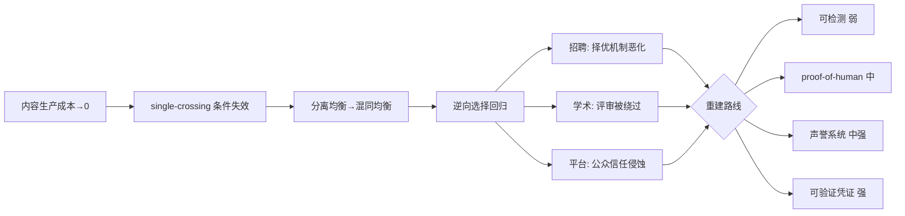

# S03 AI 时代信号生态全景

当生成式 AI 把"写一篇好文章 / 改一份精致简历 / 凑一篇结构完整的论文"的边际成本压到趋近于零，**整套靠"内容质量"做信号的社会基础设施同时失灵**——简历筛选、学术同行评审、内容平台都在同一时刻撞墙。本节点要解决的问题是：信号生态崩了之后**会重建成什么样**？我用的框架是一句反共识判断——**对抗 AI 伪造的出路是"可验证（verifiable）"，不是"可检测（detectable）"**。这一节是 [S01](/kb/专题-人文社科透镜/s01-信号系统分层剖面/)（信号的微观机制）和 [S02](/kb/专题-人文社科透镜/s02-信号类型对照矩阵/)（信号成本类型学）的系统综合层：把单点机制拼成一张"谁在崩、往哪重建、谁会被甩下"的生态地图。

> [!warning] 一句话赌注
> 我赌的是：未来 5 年信号生态的赢家不是"检测得最准的人"，而是"把信任锚定在密码学签名 + 不可逆时间记录上的人"。如果某种低成本、鲁棒、不可伪造的内容水印在 2 年内普及（见 §5 失效条件），这个赌注就输了。

---

## §0 为什么是"可验证 vs 可检测"，而不是"真内容 vs 假内容"

读者脑子里的默认框架通常是**二元真假论**：内容要么是人写的（真），要么是 AI 写的（假），我们的任务是建一个足够好的探测器把假的筛出去。这个框架从根上就错了，必须先拆掉。

三个理由：

1. **"AI 写的"不等于"假的"。** 一份用 Claude 辅助打磨、但承载了作者真实判断与真实经历的简历，和一份纯 prompt 流水线刷出来的空壳，"检测器"无法区分——它们在文本特征上可以完全一样。真正的信息不对称从来不在"谁敲的键盘"，而在"背后有没有真能力 / 真投入"。检测器测错了维度。
2. **检测是事后对抗，可验证是事前结构。** 检测试图从成品反推来源，是熵增方向上的逆流；可验证则在信号生成那一刻就绑定一个无法伪造的锚点（密码学签名、第三方时间戳、链上记录），是顺流。逆流必败（见 §3），顺流可建。
3. **这是机制设计（mechanism design）问题，不是分类问题。** 链接 [机制设计专题](/kb/专题-商业组织与采纳/_机制设计系统化专题-总览/) 的核心洞察：当个体会策略性响应规则，你不能假设"规则一颁布、行为就照旧"。检测器一公布特征，作弊者立刻规避——这是 Goodhart 陷阱（见 [c14 - 模型评估体系与 Goodhart 陷阱](/kb/基础知识库/c14-模型评估体系与-goodhart-陷阱/)）在信号领域的翻版。正确的提问不是"怎么把假的认出来"，而是"怎么设计一个让伪造在结构上无利可图 / 不可能的均衡"。

所以本节点的坐标轴不是"真/假"，而是**"可检测 → 可验证"这条逃生路线**：四种应对（检测军备竞赛 / proof-of-human / 声誉系统 / 可验证凭证）按"对抗 AI 伪造的鲁棒性"从弱到强排列。

---

## §1 生态全景：三大场景同步坍缩，机制同构

把"依赖内容质量做信号"的三大社会系统并排，会发现它们在 2024–2026 年撞的是**同一堵墙**：

| 场景 | 旧信号（被坍缩） | 坍缩机制 | 已量化的后果 |
|---|---|---|---|
| **招聘筛选** | 定制求职信、精致简历 | LLM 把定制成本从 30–60 分钟压到 10 秒，分离条件失效 | 顶部五分位录用率 **−19%**，底部 **+14%**（Galdin & Silbert, *Making Talk Cheap*, 2025, arXiv:2511.08785，已核实）；求职信信息含量 **−51%**（Cui, Dias & Ye, *Signaling in the Age of AI*, 2025, arXiv:2509.25054，已核实） |
| **学术评审** | 结构完整的论文、引文规范 | 论文工厂工业化：收割数据集 → AI 生成引言/讨论 → 批量投稿 | 2,100+ 篇因 AI 内容被撤稿〔待核实〕；NeurIPS 2025 有 53 篇被接收论文（约占全部接收量 1%）含 100 条 AI 幻觉引用，每篇 3–5 名专家审阅无一察觉（Ansari, *Compound Deception in Elite Peer Review*, 2026, arXiv:2602.05930，已核实） |
| **内容平台** | "写得好 = 可信 / 值得分发" | 生成成本趋零 + 算法按质量分发 | 仅 41% 美国人相信网上读到的是准确的人类内容；78% 难辨人机（2025 Edelman Trust Barometer）〔待核实〕 |

**同构性**正是本节点的核心判断：三者都是 Spence 分离均衡（见 [S01](/kb/专题-人文社科透镜/s01-信号系统分层剖面/)）的崩塌——高能力者的信号成本曾经低于低能力者（single-crossing condition），AI 把所有人的内容生产成本同时压到地板，**单交叉条件被抹平，分离均衡退化为混同均衡**，逆向选择重新接管市场（柠檬市场，见 [S02](/kb/专题-人文社科透镜/s02-信号类型对照矩阵/)）。

这与 [审阅瓶颈专题](/kb/专题-评测与度量/_审阅瓶颈系统化专题-总览/)（信号 vs 验证）的主轴直接咬合：旧世界里"信号"和"验证"是合一的——一篇好文章既是能力的信号，本身也被默认为能力的验证。AI 撕开了这道缝：**信号可以零成本伪造，验证却仍然昂贵**。本节点全部内容，是在这道缝里重建秩序。

---

## §2 重建的四条路线：按抗伪造鲁棒性排序

这是本节点的解剖学主体。四种应对不是平行选项，而是一条**从"必败"到"可建"的强度梯度**：

| 路线 | 核心机制 | 抗 AI 伪造鲁棒性 | 致命弱点 | 代表实践 |
|---|---|---|---|---|
| **① 检测军备竞赛** | 从成品反推来源（AI 文本探测器、"折磨短语"黑名单） | ★☆☆☆☆ | 事后对抗、Goodhart 必败、误伤非母语者 | OpenAI 探测器（已下线） |
| **② proof-of-human** | 证明"这是活人现场产出"（实时面试追问、行为生物特征） | ★★★☆☆ | 远程代考难根除、监控有伦理偏见 | 10 分钟现场追问、KYC + 行为监测 |
| **③ 声誉系统** | 跨时间累积的连续公开记录（commit 史、发表史、产品迭代史） | ★★★★☆ | 早期记录可被刷、可被"表面繁荣"污染 | GitHub 贡献史、a16z "Proof of Talent" |
| **④ 可验证凭证** | 密码学签名 + 不可篡改记录（链上证书、VerifiedEmployee） | ★★★★★ | 覆盖面有限、非正式经历难纳入 | Microsoft + LinkedIn VerifiedEmployee〔待核实〕 |

强度梯度背后的统一原理：**鲁棒性 = 伪造所需破坏的"锚点"的不可逆程度。** 检测没有锚点（纯统计博弈）；proof-of-human 锚在"当下这一刻的活人"；声誉锚在"无法回溯重写的时间"；可验证凭证锚在"密码学私钥 + 第三方记账"。越往下，伪造要破坏的东西越接近物理/数学上的不可能。

---

## §3 路线①拆解：检测军备竞赛为什么必败

这是全节点最锋利的判断，必须给足证据。

**症状：** 机构第一反应总是"买个 AI 检测器装上"。学校、期刊、招聘平台都走过这条路。

**为什么必败（三层论证）：**

1. **统计层面，检测器本身不可靠。** OpenAI 自家探测器只能正确识别 **26%** 的 AI 生成文本（true positive），人类文本误判率 **9%**，2023 年 7 月 20 日因"准确率过低"直接下线（来源：OpenAI 官方公告 + TechCrunch 2023-07-25 报道；非母语歧视见 Christianson, *Patterns*, 2024, PMC11573885〔后者待核实〕）。高假阳 + 高假阴，且对非母语英语者系统性歧视。
2. **博弈层面，这是 Goodhart 必败的闭环。** 检测器一旦公开它识别的特征（如"折磨短语"黑名单已收录 7,500+ 词条），作弊者立刻 prompt 规避或二次编辑绕过。**当度量变成靶子，它就不再是好度量**（[c14 - 模型评估体系与 Goodhart 陷阱](/kb/基础知识库/c14-模型评估体系与-goodhart-陷阱/)）。这是机制设计的铁律：面对策略性主体，事后检测永远慢攻击者一步。
3. **理论层面，水印也救不了。** 研究共识（Zhang 等 *Watermarks in the Sand*, 2023, arXiv:2311.04378，已核实（2026-06-12，见 E02 grounding）；原引 arXiv:2308.00862 为误植，已更正）：**没有任何水印能同时满足鲁棒性、不可伪造性、公开可检测性三条件**。C2PA、SynthID 这类溯源技术元数据可被去除、转截图可降级——它们提升的是"诚实者自证"的便利，而不是"对抗恶意伪造"的能力。

**正确做法：** 放弃"把假的认出来"，转向"让真的可被验证"——即路线②③④。

> [!note] 业界对手立场：接受 + 边界
> **C2PA / Adobe 阵营**主张：内容溯源标准（2025 年 Adobe、YouTube、Google Pixel 开始采用）能恢复信任。**接受**——对"诚实创作者主动声明来源"这个子问题，C2PA 确实是正解，它把"我没用 AI"从口说无凭变成可携带的签名。**边界**——C2PA 解决的是"自愿披露"，不是"对抗伪造"：恶意方根本不会附元数据，而元数据可被剥离。所以它属于路线④的弱形态（自证型可验证），无法独力撑起对抗性场景。我赌部署速度追不上 AI 普及速度，这道时间差才是真问题。

---

## §4 路线②③④拆解：可验证为什么是出路

### 路线② proof-of-human：把信号压进无法预制的时间窗

核心是**剥夺"事先准备 AI 输出"的可能**。HackerEarth 2026 报告把"10 分钟现场追问（候选人解释自己的解答）"评为最有效的防作弊手段，"大多数依赖 ChatGPT 的候选人两个问题内即暴露"〔待核实，行业报告非同行评审〕。机制本质：AI 能生成成品，但**无法代替人在实时质疑下解释设计决策背后的权衡推理**——这需要真实的上下文理解，而上下文是无法批量预制的。

边界与失效：远程代考（Discord/Telegram 雇佣代理）仍难根除；自动化监控对深色肤色、残障人士存在误报（HackerEarth 2026 明确指出）。EU AI Act 把招聘用 AI 列为高风险系统，2026 年 8 月 2 日起合规义务生效〔待核实日期〕——proof-of-human 的技术手段正撞上监管天花板。

### 路线③ 声誉系统：时间的不可逆性是内生成本信号

这是 Spence 框架最优雅的延伸。AI 可以在一次会话里生成一整个 GitHub 仓库或 Figma 文件，但**无法回溯性地制造**：跨越数年的 commit 历史（含早期拙劣版本、迭代轨迹）、在公开论坛留下的实时问答记录、产品上线后的真实用户反馈与公开 changelog。**时间的不可逆使历史记录成为内生成本信号——伪造它需要时间机器。**

a16z crypto 的 Ben Wu（"Proof of Talent", 2026）提出"depth and continuity（深度与连续性）"是高质量建设者的核心标志〔待核实〕。但这里要砍一刀 **confirmation bias**：本专题早期倾向把"公开记录"无脑当成正面解药，但 GitHub 刷 star、付费 PR、孤立贡献堆量这类游戏化早在 AI 之前就存在——AI 只是放大了噪声。补入反例：连续性本身也能被低成本"养号"模拟，声誉系统的区分力依赖**评估者的鉴别力**而非记录的存在。Wang（*Hope, Signals, and Silicon*, 2025, arXiv:2511.00068，已核实）的反方观点：学术市场里"过程可见性（process visibility）"比成品更重要——AI 触发"努力洗白（effort laundering）"的道德风险，把可信推荐推向"过程可见、不可自动化"的创造性贡献；但传统交付物（论文、写作样本）也开始被 AI 污染，纯靠"记录多"不够。

### 路线④ 可验证凭证：密码学锚点，伪造成本逼近数学不可能

终点站。每张凭证由颁发机构数字签名 + 写入不可篡改记录，验证无需联系原机构、秒级完成。**伪造成本 = 控制颁发机构私钥 OR 攻破链上记录**——技术与法律成本极高。实践：Microsoft + LinkedIn 测试 VerifiedEmployee，财富 500 强员工通过 Entra 钱包接收加密签名的工作经历凭证（Velocity Network Foundation 案例）〔待核实〕；Xu et al.（*Privacy-Preserving AI-Enabled Decentralized Learning and Employment Records System*, 2026, arXiv:2601.02720，已核实）提出 TEE（可信执行环境）+ 去中心化基础设施的隐私保护就业记录系统，技能凭证在 enclave 内生成与匹配，私钥不出 enclave。

边界（failure scenario）：覆盖面局限于高端科技/金融；中小企业与非正式经历（自学、开源、副业）难纳入链上；区块链证书的互操作性尚不成熟。**最危险的二阶效应**：可验证凭证若只覆盖"体制内可签名经历"，会把没有大厂背书的人系统性甩下——这是新的凭证通胀（见 [S02](/kb/专题-人文社科透镜/s02-信号类型对照矩阵/) 的 Caplan 80% 论），把"AI 让信号民主化"的乐观叙事反转成"验证基础设施成为新门槛"。

---

## 判断主轴：90% 的人在 AI 信号生态里会踩的四个坑

> [!danger] 致命错位四件套（症状 → 为什么错 → 正确做法 → 真实反例）

**坑 1：把"检测"当成解药。**
- **症状**：机构第一反应是采购 AI 检测器，PM 把"接入检测 API"写进方案。
- **为什么错**：检测是 Goodhart 必败的事后对抗（§3），且误伤诚实者（非母语者 9% 误判）。
- **正确做法**：把预算从"检测假的"转向"让真的可验证"——设计 proof-of-human 环节或接入可验证凭证。
- **真实反例**：OpenAI 自家检测器 26% 准确率、上线 7 个月即下线。连造模型的人都测不准自己的模型。

**坑 2：以为"信号坍缩 = 低能力者受益"。**
- **症状**：直觉认为 AI"拉平了竞争场",让弱者也能写出好材料,是公平的。
- **为什么错**：Galdin & Silbert（2025）的反直觉发现——受害最深的是**顶部五分位**（录用率 −19%），因为他们原本靠"低成本发出高质量信号"的优势被抹平了。
- **正确做法**：理解信号坍缩是**择优机制的恶化**而非民主化，重建必须恢复"高能力者的成本优势"。
- **真实反例**：求职信信息含量 −51%（Cui et al. 2025）——回复率上升了，但回复与能力的相关性崩了，市场更不唯才是举。

**坑 3：把"AI 写的"等同于"作弊/假"。**
- **症状**：一刀切禁用 AI，或把"检出 AI 痕迹"当作淘汰理由。
- **为什么错**：测错了维度（§0）。AI 辅助 + 真能力 ≠ 纯刷。误伤大量诚实的 AI 增强型创作者。
- **正确做法**：评估锚定在"能否在实时追问下解释/捍卫产出"，而非"是否用了 AI"。
- **真实反例**：NeurIPS 2025 的 53 篇问题论文，问题不在"用了 AI",而在"100 条幻觉引用无人核查"——失效的是**验证环节**,不是"用没用 AI"。

**坑 4：迷信"上链/可验证凭证"就万事大吉。**
- **症状**：PM 把"区块链证书"当银弹，以为接入即解决信任。
- **为什么错**：覆盖面局限 + 制造新门槛（§4 二阶效应）。把没有体制背书的人甩下。
- **正确做法**：可验证凭证要配套"非正式经历的可验证化"路径,否则只是把旧凭证通胀换了层皮。
- **真实反例**：HBS & Burning Glass 2024——85% 企业声称技能型招聘,但真正惠及无学历者的录用不到 1/700（0.14%）〔待核实〕。政策宣示多,落地少。可验证凭证若重蹈覆辙,就是 0.14% 的新版本。

---

## 产品 PM 视角补盲

跳出"工程/经济学"视角,补三个会被看走眼的点：

1. **用户心理：信任的"默认值"正在反转。** 过去用户默认"网上内容是人写的"(信任前置),现在默认"可能是 AI"(怀疑前置)。78% 的人难辨人机后,**任何依赖 UGC 质量做信号的产品(点评、问答、社区、内容电商)都面临"信任默认值崩塌"**——这不是功能问题,是产品赖以成立的隐含契约被撕了。PM 要问:我的产品的"信任锚点"是什么?如果它是"内容质量",那它正在归零。
2. **商业模式:验证会成为新的付费墙。** 当"免费内容不可信"成为共识,"经过验证的内容/身份"会变成可收费的稀缺品。LinkedIn 的 VerifiedEmployee、各类付费认证蓝标,本质是把"可验证性"商品化。这对内容平台是机会(卖验证)也是威胁(免费层贬值)。
3. **合规边界:proof-of-human 的监控正撞上反歧视法。** EU AI Act 把招聘 AI 列为高风险;行为生物监控(击键、眼动)对特定人群误报。PM 若用监控做 proof-of-human,要预判合规与公关风险——"防作弊"和"歧视残障/少数族裔"只隔一条线。

---

## 对手框架回应：引入两个 Rick 未读的对手框架

> [!quote] 对手框架①:Goodhart's Law（Charles Goodhart, 1975)— 破"检测能赢"的幻觉
> "When a measure becomes a target, it ceases to be a good measure." 我在 §3 已用它支撑"检测必败",这里**接受它的边界**:Goodhart 不仅打击检测,也打击声誉系统——一旦"GitHub commit 数"成为招聘靶子,它也会被刷。所以路线③不是免疫体,而是"被 Goodhart 攻击的速度更慢"(因为时间不可逆,养号成本更高)。Goodhart 逼我承认:**没有任何信号永久免疫,只有"伪造成本相对收益的比值"在不同路线上不同**。这把本节点的"强度梯度"从"绝对安全"降级为"相对鲁棒"——更诚实。

> [!quote] 对手框架②:Baudrillard 的拟像(simulacra)— 破"可验证能恢复真实"的乐观
> 鲍德里亚会说:你们争论"真内容 vs AI 内容"已经过时,因为在拟像阶段,**"真实"本身已不可寻——签名验证的只是"这个签名是真的",不是"签名背后的能力是真的"**。VerifiedEmployee 验证"此人确在某公司任职",但任职 ≠ 有能力。**接受**:可验证凭证只能把信任问题**外包**给颁发机构,无法消灭信息不对称,只是搬家。**边界**:即便如此,把信任锚定到"可追责的颁发机构"(有法律责任、有声誉损失)仍优于锚定到"匿名的内容质量"——拟像无法消除,但可以选择把它绑在更难逃责的实体上。鲍德里亚让我放弃"恢复真实"的妄念,改为更务实的"让伪造可追责"。

---

## 跨域呼应:机制设计与"可信承诺"

> [!note] 调度:机制设计(Mechanism Design)→ 改变"怎么对抗伪造"的根本判断
> 链接 [机制设计专题](/kb/专题-商业组织与采纳/_机制设计系统化专题-总览/)(信息不对称的机制设计)。机制设计的核心洞见是:**面对会策略性响应的主体,你不能设计"规则",要设计"激励相容(incentive compatible)的均衡"**——让说真话/不伪造成为参与者的最优选择。这彻底改变了本节点的判断:检测路线(①)试图"事后抓违规者",这是规则思维,必败;可验证路线(④)试图"让伪造在结构上无利可图"(伪造需破解密码学),这是机制思维,可建。
>
> 更精确地说,可验证凭证之所以有效,是因为它把信任建立在**可信承诺(credible commitment)**上:颁发机构用自己的私钥+法律责任+声誉做抵押,这个抵押是"高成本、不可轻易撤回"的——正是 Spence 意义上的成本信号,只不过成本从"个体的教育投入"转移到了"机构的信誉抵押"。机制设计让我看清:AI 时代信号重建的本质,是**把成本信号的承载者从'个体内容'迁移到'机构承诺'与'不可逆时间'**。这是 [S01](/kb/专题-人文社科透镜/s01-信号系统分层剖面/) 成本信号理论在 AI 冲击下的必然进化。

---

## PM 决策启示:面试 / 选型 / 复现三类落地

- **面试怎么用**:被问"AI 让简历/内容造假怎么破"时,**不要答"做个检测器"**(暴露外行)。答:"检测是 Goodhart 必败的事后对抗,出路是可验证——把信任锚到密码学签名或不可逆时间记录。"再给三大场景同构 + 四路线梯度,30 秒展示系统判断力。
- **选型怎么用**:任何"依赖 UGC 质量做信号"的产品(点评/问答/招聘/内容)做反作弊选型时,**先问"我在买检测还是买验证"**。检测方案(★1)只值得做最低成本兜底;预算应压向 proof-of-human(★3)与可验证凭证(★5)。
- **复现怎么用**:见 [R03](/kb/专题-人文社科透镜/r03-构建个人-ai-proof-求职信号组合/)(本专题复现指南),用机制设计的"激励相容"checklist 审自己的信号系统——列出所有参与者,问"伪造对每一方是否无利可图",找出 single-crossing 条件被 AI 抹平的环节。

---

## 这是 Rick 自己的信号:本知识库即 AI-proof 案例

本节点必须落到作者自身。Rick 正在求职,而**这套知识库 + 作品集本身,就是一个 AI-proof 信号的活案例**:

- 它是**路线③(声誉/连续公开记录)**的实物——0411 Agent 专题 22 节点、5 轮批判性同行评议、SABCD 自评、可追溯的修订日志(见 Rick 写作 SABCD 评级体系);0425 本专题的多节点互链网络。AI 能在一次会话里生成一篇,但**无法回溯性地伪造跨周的迭代轨迹、批评 issue 单、改稿档案**——时间不可逆。
- 它是**路线②(proof-of-human)**的弹药库——面试现场被追问"你这套信号理论怎么落到产品",Rick 能即时解释每个判断背后的权衡,这是"两个问题内暴露"的反面:**真投入者经得起实时追问**。
- 它呼应 [p306 - 数据飞轮与反馈回路设计](/kb/产品设计与交互范式/p306-数据飞轮与反馈回路设计/) 的飞轮逻辑,但要做**显式升级对照而非复述**:p306 讲的是"产品如何用数据反馈正向滚动";本节点把同一结构升一个抽象层——**信号生态本身就是一个反馈回路**:信号坍缩 → 验证成本上升 → 验证基础设施投资 → 新信号锚点 → 新一轮坍缩压力。p306 是"产品内的飞轮",S03 是"社会信任的飞轮",且本节点新增 p306 未涉及的**对抗性维度**(策略性伪造者会攻击飞轮),这正是从"内部优化"到"对抗性机制设计"的升级。

Rick 的不公平优势:大多数 AI PM 候选人在 AI 时代"信号坍缩"中随波逐流(用 AI 刷简历,然后和所有人一样被混同),而 Rick 用"AI 不能伪造的连续判断记录"主动发出分离信号——**当所有人的内容都廉价,持续公开的判断质量反而升值**。

---

## 与已有节点的关系(升级对照,不复述)

- **对 [审阅瓶颈专题](/kb/专题-评测与度量/_审阅瓶颈系统化专题-总览/)(信号 vs 验证)做深化**:0418 提出"信号≠验证"的辨析,本节点把它**生态化**——证明 AI 正是从这道缝(信号可伪造、验证仍昂贵)处撕裂整个社会信号基础设施,并给出重建路线。不复述 0418 的基础辨析。
- **对 [机制设计专题](/kb/专题-商业组织与采纳/_机制设计系统化专题-总览/)(信息不对称机制设计)做应用**:0421 提供机制设计工具箱,本节点把"激励相容/可信承诺"**落地到"对抗 AI 伪造"这一具体战场**,得出"可验证 > 可检测"的工程结论。
- **对 [自我民族志专题](/kb/专题-人文社科透镜/_自我民族志系统化专题-总览/)(作品集信号)做反向背书**:0423 主张作品集是强信号,本节点从 AI 时代的角度**解释了为什么**——作品集的连续性是"时间不可逆"的内生成本信号(路线③),且把它升级为 Rick 自身的 AI-proof 案例。
- **对 [失败考古学专题](/kb/专题-安全对齐与失败/_失败考古学系统化专题-总览/)(失败)做对话**:0416 讲产品失败模式,本节点补一个新失败模式——**信号系统的对抗性失败**(检测军备竞赛必败、可验证凭证制造新门槛)。
- **对 [c14 - 模型评估体系与 Goodhart 陷阱](/kb/基础知识库/c14-模型评估体系与-goodhart-陷阱/) 做迁移**:把 Goodhart 陷阱从"模型评估"迁移到"信号检测",证明检测军备竞赛是 Goodhart 在信号领域的同构翻版。
- **对 [p306 - 数据飞轮与反馈回路设计](/kb/产品设计与交互范式/p306-数据飞轮与反馈回路设计/) 做显式抽象升级**:见上节,从"产品内飞轮"升到"社会信任飞轮"并加"对抗性"维度。
- **与 [幻觉](/kb/基础知识库/幻觉/) 联动**:学术评审坍缩的具体机制(NeurIPS 100 条幻觉引用)正是 [幻觉](/kb/基础知识库/幻觉/) 在高信任场景的危害放大。
- **与 [ChatGPT](/kb/ai-公司与产品/chatgpt/) / [Agent](/kb/基础知识库/agent/) 联动**:内容生产成本趋零的直接动因。

## 关联节点

**核心(必读)**
- [S01](/kb/专题-人文社科透镜/s01-信号系统分层剖面/)— 信号的微观机制(分离均衡、single-crossing),本节点的理论地基
- [S02](/kb/专题-人文社科透镜/s02-信号类型对照矩阵/)— 信号成本类型学,四路线的成本梯度来源
- [审阅瓶颈专题](/kb/专题-评测与度量/_审阅瓶颈系统化专题-总览/)— 信号 vs 验证,本节点的主轴出处
- [机制设计专题](/kb/专题-商业组织与采纳/_机制设计系统化专题-总览/)— 信息不对称机制设计,可验证路线的理论支撑
- [自我民族志专题](/kb/专题-人文社科透镜/_自我民族志系统化专题-总览/)— 作品集信号,路线③的实物背书
- [c14 - 模型评估体系与 Goodhart 陷阱](/kb/基础知识库/c14-模型评估体系与-goodhart-陷阱/)— 检测必败的理论根
- [p306 - 数据飞轮与反馈回路设计](/kb/产品设计与交互范式/p306-数据飞轮与反馈回路设计/)— 社会信任飞轮的对照原型
- Rick 写作 SABCD 评级体系— Rick 自身 AI-proof 信号的评估工具

**延伸(可选)**
- [失败考古学专题](/kb/专题-安全对齐与失败/_失败考古学系统化专题-总览/)— 失败模式,补"信号系统对抗性失败"
- [幻觉](/kb/基础知识库/幻觉/)— 学术评审坍缩的具体危害机制
- [ChatGPT](/kb/ai-公司与产品/chatgpt/)/ [Agent](/kb/基础知识库/agent/)— 内容成本坍缩的动因
- [AI概念滥用反思](/kb/基础知识库/ai概念滥用反思/)— AI 生成内容须经批判性同行评议(本知识库的方法论自指)
- [AI PM 知识图谱·总索引](/kb/ai-pm-知识图谱/ai-pm-知识图谱-总索引/)— 全库入口

---

## 修订日志

- **R1(2026-06-07,起草)**:建立"可验证 vs 可检测"主轴;三场景同构表 + 四路线强度梯度;判断主轴四件套×4;引入 Goodhart + Baudrillard 两个对手框架;机制设计跨域呼应;落到 Rick 自身 AI-proof 案例;p306 显式抽象升级对照。
- **R1-grounding(2026-06-07)**:WebFetch 核实 5 项硬事实并去除〔待核实〕——Galdin & Silbert(arXiv:2511.08785,−19%/+14%)、Cui/Dias/Ye(arXiv:2509.25054,−51%,作者名确认为 Jingyi Cui/Gabriel Dias/Justin Ye)、Ansari NeurIPS(arXiv:2602.05930,53 篇/100 引用/3–5 审稿人)、OpenAI 探测器(26% 准确率+2023-07-20 下线,WebSearch+TechCrunch)、Wang(arXiv:2511.00068,effort laundering)、Xu et al.(arXiv:2601.02720,TEE+区块链)。仍标〔待核实〕:Edelman 41%/78%、VerifiedEmployee、HackerEarth 数据、EU AI Act 生效日、HBS 0.14%、Christianson PMC、2,100+ 撤稿数、水印三条件不可兼得(arXiv:2308.00862)、a16z Proof of Talent——均为行业报告或本次未直接 fetch 的来源,已在文中显式降级。
- **2026-06-11 P3.4 校链**:正文§0/§1、跨域呼应、§与已有节点、关联节点中对 0418/0421/0423/0416 的纯文本提及全部恢复为真 `可读名` 链(四相邻专题确认已入库)。
- **2026-06-12 内审修复**:(1) 修断链——正文残留的 `0418 总览/0421 总览/0423 总览/0416 总览` 数字式链(共 11 处)实为死链,统一改为相邻专题真实 basename(`[_审阅瓶颈系统化专题·总览](/kb/专题-评测与度量/_审阅瓶颈系统化专题-总览/)` 等,别名保留);(2) 对齐标签矛盾——§3 水印不可能性原引 arXiv:2308.00862〔待核实〕实为误植(E02 grounding 已确证正确出处为 Zhang 等《Watermarks in the Sand》, 2023, arXiv:2311.04378),已更正为该已核实 ID。R1-grounding 历史日志中"仍标待核实…arXiv:2308.00862"为历史留痕,保留不动。
