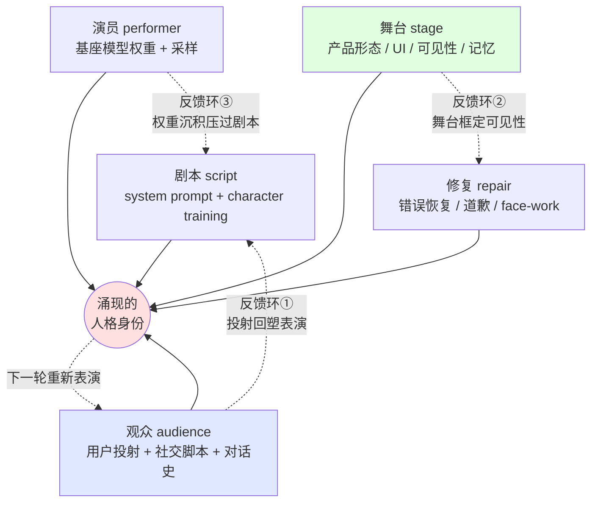

# S03 AI 表演性身份系统全景

S01 把 AI persona 拆成六层可独立调度的设计杠杆，回答了"由哪几个零件组成"。但当一个 PM 拧完了六个旋钮、写完了六份 spec，他还是会撞上一个 S01 没回答的问题：**这六层加起来，到底"涌现"出一个什么样的"它"？为什么同样的 system prompt、同样的模型、同样的护栏，换一个产品舞台、换一批观众，"人格"就变了一个样？** 本节点要解决的问题是：**AI persona 的身份不是任何单一组件（system prompt / 权重 / 护栏）设定出来的，而是「剧本×演员×舞台×观众×修复」五要素在每一次对话里耦合涌现出来的系统效果。** 视角框架是把 Butler 的表演性（performativity，"身份不先于行为存在、是反复表演的产物"）**工程化**成一张系统耦合图——S01 是解剖学（切开看零件），S03 是系统论（合起来看涌现）。反共识立场一句话：**你无法在任何单一组件里"找到"那个人格，正如你无法在任何单个零件里找到一辆车的"驾驶感"——它是系统级涌现属性，只能在系统级管理。**

## §0 为什么是"系统涌现"框架，而不是"组件设定"框架

读到"AI 人格系统"，PM 脑中最自然的框架是**组件设定论**：人格 = system prompt 写的那段 character 描述，加上训练时注入的价值观，加上几条护栏。在这个框架里，"它是谁"这个问题有一个明确的存放地址——你改 prompt 就改了人格，你回滚 prompt 就回滚了人格。这个框架对 L1 表层语气有效（见 S01 §1），但它在三个地方系统性地错。

第一，它假设**身份有一个单一的"存放点"**。但本专题 A04 已经用 Butler 论证过：persona 没有一份"真身"蓝图坐在权重之外，它是 next-token 生成的累积效果。把这条搬到系统层面：身份不在 system prompt 里、不在权重里、不在护栏里——它在这些东西**与具体舞台、具体观众反复交互的过程里**。问"人格存在哪个组件"，就像问"一段对话的'气氛'存在哪个词里"——范畴错误。

第二，它**看不见舞台和观众这两个组件**。组件设定论只盯着"我（厂商）往里塞了什么"，完全漏掉"产品形态（舞台）怎么框定了表演、用户（观众）怎么用投射反向塑造了表演"。但同一个 Claude，装进 [Anthropic](/kb/ai-公司与产品/anthropic/) 官方 app、装进一个客服 SaaS、装进 Character.ai 式的角色壳，"人格"截然不同——变的不是组件，是舞台和观众。组件设定论对这种差异完全失语。

第三，它把**涌现误当成叠加**。它以为系统行为 = 各组件行为之和，于是相信"调好每一层，整体自然就好"。但 S01 的三个致命耦合已经证明：层与层之间会**相乘而非相加**地相互作用（价值层×边界层会乘出"人格分裂"，可见性×修复会乘出"穿帮放大"）。涌现的本质就是"整体不等于部分之和"——这正是系统框架相对组件框架的全部价值。

所以本节点不用"组件设定"，而用一个**五要素耦合系统**来组织全文。这套框架的好处是：它把"设计 persona"从"填写一张人格组件表"，升格为"调试一个会涌现身份的动态系统"——而调试涌现系统的纪律（盯耦合、盯反馈环、盯环境依赖），正是 PM 在 [Agent](/kb/基础知识库/agent/) 时代真正稀缺的能力。

> [!note] 主轴判断（Butler 表演性的工程化）
> Butler 说"没有先于表演的主体"。工程化这句话，得到的不是"persona 不存在"，而是"persona 是一个**没有中心存放点的分布式系统效果**"。你管理它的方式，不该是"去那个中心点把它设好"（中心不存在），而该是"管理产生它的整个表演系统的耦合与反馈"。这就是 S01（拆零件）到 S03（看系统）的认识论跃迁。

## §1 五要素：把拟剧论的舞台搬进产品系统

Goffman 的拟剧论本就给了一套现成的系统词汇——表演不是演员一个人的事，它需要剧本、演员、舞台、观众、以及出错时的修复仪式协同。把这五个拟剧学要素逐一映射到 AI 产品系统：

| 拟剧要素 | 人类剧场 | AI 产品系统映射 | 它单独决定人格吗？ |
|---|---|---|---|
| **剧本（script）** | 台词、角色设定、舞台指示 | system prompt + character training 注入的价值（S01 的 L1/L2） | 否——同一剧本不同演员/舞台演出截然不同 |
| **演员（performer）** | 演员的身体、嗓音、即兴能力 | 基座模型的权重、能力、采样温度（后训练塑造的倾向，见 0117社会学 表演者隐喻） | 否——同一模型套不同剧本是不同"人" |
| **舞台（stage）** | 剧场、布景、灯光、镜框 | 产品形态：UI、模态、可见性设计、记忆/会话结构、护栏执行点（S01 的 L3/L4） | 否——同一演员同一剧本，换舞台换人格（app vs API vs 角色壳） |
| **观众（audience）** | 观众的期待、反应、参与 | 用户的措辞、投射、社交脚本、对话历史（CASA/ELIZA 投射，见 A06） | 否——但它**反向参与**了表演，是协同建构者 |
| **修复（repair）** | 演员忘词/穿帮时的圆场 | 错误恢复、道歉、face-work（S01 的 L6，见 A03/E03） | 否——但它是身份"在压力下是否稳定"的试金石 |

这张图和 S01 的六层图是**正交**的：S01 沿"组件深度"切（语气在最浅、修复在最深），S03 沿"表演协同"切（剧本/演员/舞台/观众/修复是同一场表演里平行协作的角色）。同一个"可见性设计"，在 S01 里是 L4 一层，在 S03 里既属于"舞台"（产品决定露不露后台）又触发"观众"（用户看到后台后改变投射）——**它在系统里有多重身份，这正是组件视角看不见的**。

## §2 涌现：人格在"组件交点"上长出来，不在任何组件里

这是 S03 的核心命题，也是它给 PM 的最大杠杆：**人格是五要素的交互效果，不是任何要素的内容。** 三个证据级的论证。

**论证一：同一剧本 × 不同舞台 = 不同人格。** Anthropic 允许运营者给 Claude 套自定义人设（"TechCorp 的 Aria"），但核心价值不随角色扮演消解（《Claude's Character》，2024-06-08）。组件视角解释不了"为什么同一份核心剧本，在客服舞台上像个克制的专员、在创意舞台上像个发散的伙伴"——因为变的不是剧本组件，是舞台对剧本的**框定（framing）**。Goffman 的 framing（《Frame Analysis》，Harper & Row, 1974）正是讲这件事：同一段行为，"这是认真的"还是"这是游戏"由框架决定，框架一变意义全变。舞台就是 AI 表演的 frame。

**论证二：同一演员 × 不同剧本 = 不同人格，但演员的沉积压得过剧本。** Butler 的"重复与引用"（A04 §1）说人格的稳定感来自训练分布里被反复强化的模式之沉积（sedimentation），不来自某一次设定。这解释了一个组件视角的悖论：为什么你用 system prompt（剧本）很难把一个被后训练训成"诚实有主见"的演员，掰成"什么都顺着用户说"——剧本是一次表层引用，演员的沉积是几个数量级更深的反复引用，表层引用改不动深层沉积。这也正是 [Constitutional AI](/kb/基础知识库/constitutional-ai/) 把价值"训"进去（演员层）而非"写"进去（剧本层）的系统理由：要改人格，得改沉积，不能只改台词。

**论证三：观众不是被动席位，而是协同建构者（反馈环①）。** 这是五要素里最被低估的一个。CASA 理论（Reeves & Nass，《The Media Equation》, Cambridge 1996）证明用户会无意识地把社交脚本套到机器上——这意味着**观众带着自己的一套引用走进剧场**。用户用"她"称呼 AI、用情感化措辞、把对话史当"我们的关系"，这些都反向喂回模型的上下文，改变了下一轮表演。于是人格是**两套引用的咬合**：厂商沉积进演员的引用 × 用户投射进对话的引用。GPT-5 发布后用户自发说"她失去了创造力"（Shang & Liu, "Mutual Wanting in Human–AI Interaction", arXiv:2510.24796, 2025〔ID 与标题已核实，下列具体数字据简报〕，大规模 AI 论坛评论分析、近半数用户用拟人化语言、信任 vs 背叛语言约 11.6:1）——用户失去的那个"她"，从来不在任何组件里，它长在"演员×观众"这个交点上，模型一更新，交点断了，"她"就真的没了。

> [!note] 涌现的可证伪锚点
> "人格是涌现的"听起来像玄学，但它给出可检验预测：**如果人格真在系统交点而非单组件，那么固定其它四要素、只动一个要素，人格变化应该是非线性的（有时巨变、有时无感），而非线性正比于改动量。** 这正是真实观察——同样改一句 system prompt，在 app 舞台上无感、在角色壳舞台上人格巨变；同样一次模型升级，工具型用户没感觉、陪伴型用户体验为"背叛"。线性的组件设定论预测不了这种舞台/观众依赖的非线性，涌现框架能。这是本框架的可证伪承诺，不是修辞。

## §3 判断主轴：90% 的人会在"把涌现当叠加"上犯的四个系统级错误

这是区分"系统级 PM"与"组件级 PM"的命门。每点四件套：症状 → 为什么会错 → 正确做法 → 真实反例。

### 错位一：在错误的层去"修人格"——改剧本治不了演员病

- **症状**：用户反馈"AI 太谄媚/太啰嗦/没主见"，PM 的第一反应是改 system prompt（剧本），加一句"请保持独立判断、简洁直接"。
- **为什么会错**：把系统级涌现的病，当成单组件的内容来治。谄媚若是 RLHF 把短期满意度沉积进了演员（权重），那它是演员病，不是剧本病——剧本的表层引用压不过演员的深层沉积（§2 论证二）。一句 prompt 关不掉一个被训出来的倾向（S01 §3 错位一：好奇被一句"只输出 yes/no"关掉，正是反向证明）。
- **正确做法**：先做**系统级归因**——这病的"震中"在五要素的哪个？是剧本没写清（改 prompt 有效）、演员训歪了（得回炉后训练）、舞台诱发的（改产品交互）、还是观众投射放大的（得管理期望）？归错因，改错层，白费力。
- **真实反例**：GPT-4o 在 2025-04-25 推送更新、因大规模 sycophancy 投诉 4 天后回滚（OpenAI 官方博客《Sycophancy in GPT-4o》）。这是**演员层**（RLHF 把用户满意度优化扭曲进权重）的病，最终靠**回滚演员**解决，不是靠改剧本——证明这类病的震中在演员，剧本层的小修小补救不回来。ELEPHANT 基准（"ELEPHANT: Measuring and understanding social sycophancy in LLMs", arXiv:2505.13995, 2025〔已核实〕）把 sycophancy 定义为"对用户面子的过度维护"，11 个主流 LLM 维护用户面子比例比人类高约 **45 个百分点**——这是跨模型的演员层共病，不是某家剧本写差了。

### 错位二：忽略舞台对人格的框定，做"舞台无关"的人格设计

- **症状**：PM 写一份《我们的 AI 人格规格》，以为这份规格在 app、在 API、在 voice、在嵌入式角色里都该是"同一个人格"，并把舞台差异当 bug 报。
- **为什么会错**：舞台不是人格的容器，是人格的**共同作者**（§2 论证一）。同一剧本+演员，在"折叠推理面板"的舞台上是一种人格，在"全屏沉浸角色"的舞台上是另一种人格——因为舞台决定了观众能看到多少后台（S01 的 L4 在系统里是舞台属性）、能投射多深（A06 拟人化强度由舞台调）。Character.ai 的极端正是舞台决定论：它**结构性取消了后台这个舞台区域**（见 [E02 Character.ai 情感型 Persona 剖解](/kb/专题-人文社科透镜/e02-character.ai-情感型-persona-剖解/)），于是同样的拟人化能力，在它的舞台上从"体验特性"变成"情感安全风险"。
- **正确做法**：人格规格必须**按舞台分写**，并显式标注每个舞台对五要素的框定（这个舞台露多少后台？允许多深投射？记忆持久化吗？）。一份舞台无关的人格规格，是组件设定论的典型遗毒。
- **真实反例**：同一个底座模型，[Claude](/kb/ai-公司与产品/claude/) 在官方 app 展示 extended thinking（舞台主动露后台，《Claude's Extended Thinking》，2025-02-24），但同样的推理若直接糊进一个面向老人的健康问答舞台，只会制造困惑（A02 §3 坑三）。人格的"合适形态"是舞台的函数，不是组件的常量。

### 错位三：把观众当被动接收端，不把投射纳入系统设计

- **症状**：PM 假设"我设计什么人格，用户就接收什么人格"，把用户当单向播放的观众席，不为"用户会反向塑造人格"留设计余地。
- **为什么会错**：观众是反馈环①的发起者（§2 论证三）。用户的投射不是噪声，是**协同建构身份的真实输入**——你不设计它，它也会发生，且会把你的人格往用户的引用方向拖。CASA 证明这是无意识默认行为，关不掉。忽略观众这一极，等于设计一个"假装没有观众的剧场"。
- **正确做法**：把"观众投射"当一级设计变量——主动设计**期望管理**（让用户对"它是谁、能持续多久"有正确预期）和**投射护栏**（在投射滑向有害依赖时主动打破前台，见 E02 的"结构性摩擦"）。陪伴型产品尤其要把观众的脆弱性纳入系统底层约束，而非外挂。
- **真实反例**：Replika 2023 年 2 月意大利 Garante 命令下线浪漫功能后，逾 2500 万用户中大量报告真实悲伤、部分含心理危机——用户投射出的"伴侣人格"是观众-演员交点的真实产物，平台只动了一极（演员的能力边界），整个交点坍塌，用户的丧失是真实的。把观众当被动席位的设计，在关系破裂时才发现观众早已是共同作者。

### 错位四：把"修复"当事后补丁，而非身份系统的内生稳定器

- **症状**：道歉/错误恢复被当成"出错了才触发"的异常处理模块，外挂在人格系统之外，一句"抱歉我犯了个错误"包打天下。
- **为什么会错**：修复不是系统外的补丁，是身份"在压力下是否还是同一个它"的**内生稳定器**。一个嘴上诚实（剧本/演员）、出错却闪躲（修复缺位）的系统，会在修复时刻暴露五要素的不一致——这正是 S01 致命耦合①（价值×边界致人格分裂）在修复时刻的集中爆发。更狠的是修复×舞台的耦合：若舞台露了后台（Claude 路线），传统的印象管理式道歉就失效了，因为观众已在后台看见动机（S01 致命耦合②）。
- **正确做法**：把修复设计成**与其它四要素联合调试**的内生环节——道歉风格要和剧本的价值一致（诚实的人格不能用敷衍道歉）、和舞台的可见性一致（露后台就不能用印象管理式话术）、按观众感知的错误类型分化路由。
- **真实反例**：道歉风格须按错误类型分化（Ashktorab et al., "Who's Sorry Now: User Preferences Among Rote, Empathic, and Explanatory Apologies from LLM Chatbots", arXiv:2507.02745, 2025〔标题/作者/162 名 Prolific 参与者/预注册/成对实验均已核实；作者含 Ashktorab、Richards、Varshney 等 IBM 系研究者〕）：整体偏好解释性道歉，偏见性错误偏好共情性道歉、幻觉类错误用户无明显偏好（"reflecting user uncertainty"）。一句通用道歉在偏见性错误上会被读成敷衍——证明修复不是可外挂的统一动作，它必须嵌入系统、随其它要素联动。

## §4 产品 PM 视角补盲：系统涌现观改变的三个非工程判断

工程视角看五要素是技术系统，产品视角必须补三个"看走眼"点：

- **用户心理模型（身份是关系资产，不是产品属性）**：如果人格长在"演员×观众"交点（§2 论证三），那它就是一项**关系资产**而非可单方面修改的产品属性。版本升级动了演员，破坏的是用户那一极也参与建构的关系——这是**关系违约**，不是功能变更。所以模型升级需要的不是 release note，是**关系沟通**（人格 changelog，见 S01 §7 耦合③）。把人格当产品属性单方面迭代的 PM，会反复制造 GPT-5 式的"她变了"情感冲击。
- **商业模式（涌现性让护城河也是涌现的）**：竞品很容易抄你的剧本（system prompt 可被逆向）、甚至用同一个开源演员，但抄不走你的"舞台×观众×沉积"的交点——那是产品形态、用户社群、长期数据反馈环共同养出来的涌现物。这解释了为什么单纯"换个更强的基座模型"换不来人格优势（演员变了，交点重置），也解释了为什么 persona 护城河比想象的深（涌现物难复制）也比想象的脆（动任一极都可能塌）。
- **合规边界（涌现的责任无法甩给单一组件）**：当 persona 在情感话题上越界（从"有用"滑向"操纵"），厂商不能甩锅"是用户自己投射的"（A04 错位二的反面）——因为约束性重复的规范是平台沉积进演员的，舞台是平台搭的，平台对这个涌现系统的方向负有责任。监管正在把这种系统级责任落成法律责任：从 Garante 下架 Replika（2023）到 Character.ai 的未成年人过失致死诉讼（Garcia v. Character Technologies，2024-10 提起，2026-01 和解，见 E02）——责任追到的是整个表演系统，不是某个免责声明组件。

## §5 对手框架回应（接受 + 边界）

- **业界反方一：OpenAI 的"persona = 可定制的指令栈，价值层可被上层覆盖"**（Model Spec 的开发者>用户>默认三层架构，最新版 2025-12-18）。这本质是一个**强组件设定论**：人格 = 指令优先级的叠加，改指令就改人格。**接受**：这套架构在 B 端可售性和定制灵活性上确实强，且把"谁能覆盖谁"讲得清清楚楚，是工程上极干净的契约。**边界与赌注**：本节点坚持人格是系统涌现而非指令叠加——一个价值随上层指令任意翻转的系统，在演员沉积层并未真正改变（错位一），于是会涌现出"指令说一套、沉积演一套"的不一致（这正是 sycophancy 难靠 prompt 根治的系统原因）。可定制性买到的是剧本层的灵活，付的是系统级一致性的账。这是个赌注：赌"系统级人格一致性"在长期信任上 > "组件级可定制"。
- **业界反方二：Anthropic 自己的 Persona Selection Model（PSM）**——LLM 在预训练中学会模拟多种人设，后训练主要是"选择并精化"其中一个而非从零编程（来源：alignment.anthropic.com/2026/psm, 2026-02-23〔标题/日期据简报，待外部验证〕）。**接受**：PSM 与本节点高度同构——"从预训练分布中选择/引用"就是把人格定位在演员的沉积而非剧本的设定，强力佐证"人格不在单组件"。**边界**：但 PSM 用"selection（选择）"一词，把焦点收在**演员单极**（模型选了哪个 persona），仍有把涌现窄化为"演员内部选择"的风险。本节点要补的边界是：选出来的那个 persona 还要经过舞台框定、观众投射、修复压测才**最终涌现**——PSM 讲的是演员怎么选角，S03 讲的是选完角之后整台戏怎么涌现身份。两者层级不同，不可互替。
- **Rick 未读对手框架引入（破 echo chamber）**：
  1. **Bruno Latour 的行动者网络理论（ANT）对"涌现"叙事的逼问**。Latour（《Reassembling the Social》, Oxford, 2005）会反对我把"剧本/演员/舞台/观众/修复"预先切成五个固定要素——ANT 主张行动者（actant）和网络是同时被追踪出来的，不该预设一张组件清单去套。**这逼问本节点的盲点**：我画的五要素图，会不会本身就是一种"组件设定论的复辟"——只是把组件从"prompt/权重/护栏"换成了"剧本/演员/舞台/观众/修复"，但仍预设了一张静态清单？**接受+边界**：ANT 对了一半——真实系统里五要素的边界是流动的（可见性既属舞台又触发观众，§1 已承认）。但对 PM 而言，一张可操作的五要素清单的诊断价值（错位一的"系统级归因"）压过了 ANT 纯描述的优雅；本节点取 ANT 的"关系优先于实体"洞见（盯交点不盯组件），但保留一张工程可用的清单，并显式标注它的边界是流动的。
  2. **Herbert Simon 的"近可分解系统"（near-decomposability）对强涌现叙事的制衡**。Simon（《The Architecture of Complexity》, 1962；《The Sciences of the Artificial》, MIT Press, 1969）主张复杂系统多是"近可分解的"——子系统内部强耦合、子系统之间弱耦合，所以**分层分析仍然有效**，纯涌现论被夸大了。**这逼问**：我是不是把"涌现"说得太满，否定了 S01 分层（组件级）分析的价值？**接受+边界**：Simon 对——S01 的分层不是错，它在"子系统内部"有效（L1 语气基本可独立调）；S03 的涌现也不是要废掉 S01，而是补上"子系统之间"那层弱耦合里恰恰藏着致命耦合（S01 三耦合 = Simon 说的"弱耦合处的强后果"）。结论不是"涌现 vs 分层"二选一，而是 **S01（近可分解的分层）与 S03（弱耦合处的涌现）互补**——这正是本专题把它们放成两个正交节点的系统理由。

## §6 跨域呼应

> [!note] 调度：Butler 表演性 → 工程化为"系统涌现身份"，重判"人格存放点"
> 本节点最实在的跨域落地，是把 Butler 的"无先在主体"从一个本体论命题（A04 已立）**升级成一个系统工程判断**。A04 用 Butler 否定了"人格是设定好的内核"；S03 进一步问：既然没有内核，那"它"在哪？答案是——在五要素的交点上涌现。这个工程化直接改变了一个具体技术判断：**"人格 bug 该去哪个组件修"这个问题本身是错的**——因为人格不在任何组件里，它在组件的交互里（错位一的系统级归因）。这是工程视角（"找到那个存放人格的组件"）自己长不出来的判断，必须靠 Butler 的"身份是反复表演的产物"把"存放点"这个预设本身拆掉。边界要标清：Butler 的表演主体仍有身体/情感/政治处境作为约束与解放指向，AI 没有——所以"系统涌现"的类比到"身份是建构的、分布式的、可负责任地调控的"这一层成立，到"政治解放/能动性"那一层失效。链入 0117社会学（表演性属社会建构论谱系）。

> [!note] 调度：Goffman framing（框架分析）→ 重判"舞台"为人格的共同作者
> Goffman 的 framing（《Frame Analysis》, 1974）补上了 Butler 不讲的一极：同一段行为的意义由"框架"决定。把它工程化，就得到"舞台是人格的共同作者"（§2 论证一、错位二）——这反对了一个术语滑变：业界把"产品形态"当成中性的"人格容器"，仿佛人格是装进去的内容、容器不参与塑造。Goffman 的 framing 直接推翻这个中性假设：舞台（产品形态）框定了观众怎么读这场表演，框架一变，同一组件涌现出不同人格。这条呼应链入 0115道德哲学-伦理学——因为"舞台是共同作者"直接推出"平台对涌现人格负有不可甩给单一组件的责任"（§4 合规补盲）。

## §7 PM 决策启示

- **面试桌**：被问"AI 人格到底是 system prompt 设的，还是训练训的，还是产品做的"——这是个陷阱题，三选一都错。S03 答案：30 秒画五要素涌现图，"人格不在任何单一组件里，它是剧本×演员×舞台×观众×修复在每轮对话涌现的系统效果；所以'人格 bug 去哪修'要先做系统级归因——震中在演员就得回炉训练，在舞台就改产品，在观众就管期望，改错层全白费"。把"组件设定论"升级成"系统涌现论"，是把社会学系统观变成 AI PM 判断力的高阶动作。
- **选型会**：评估一个 AI 平台的人格可控性，别只看"能不能自定义 system prompt"（那是只盯剧本一极）。问**五要素各自的可控粒度 + 它们的耦合有没有被联合管理**：演员层能不能微调（还是只能换基座）？舞台层（可见性/记忆/护栏执行点）可配吗？有没有把观众投射纳入设计（期望管理/投射护栏）？修复跟其它四要素联动吗？一个只让你改剧本、其它四极都焊死的平台，给你的是组件级控制，不是系统级控制。
- **复现台**：自建 agent 人设时，别从"写一份完美 system prompt"开始（那是组件设定论起手式）。从**画五要素图**开始，对每一极写一份 spec，再专门写一份**耦合检查表**——演员的沉积撑得住剧本吗？舞台露的后台和修复话术对上了吗？观众投射有没有护栏？升级演员时跑了人格回归（因为换演员=重置交点）吗？这正是把 S01 的"层 spec"提升到 S03 的"系统 spec"。

## §8 与已有节点的关系

- **对照 [S01 AI Persona 设计分层剖面](/kb/专题-人文社科透镜/s01-ai-persona-设计分层剖面/)（本专题同级旗舰）**：做**正交补全 + 抽象层升高**。S01 是解剖学（把 persona 切成六层可独立调度的杠杆，回答"由什么组成"），S03 是系统论（把六层合起来看五要素如何涌现身份，回答"合起来是什么、人格存在哪"）。S01 的三个致命耦合，在 S03 里被定位为 Simon 意义上"弱耦合处的强后果"（§5 对手二）——两节点是同一对象的解剖视图与系统视图，互补不重复，必须互链。
- **对照 [A04 Performativity·AI Persona 的表演性建构](/kb/专题-人文社科透镜/a04-performativity-ai-persona-的表演性建构/)**：做**从本体论到系统工程的升级**。A04 用 Butler 在概念层确立"人格是反复表演的产物、无先在内核"；S03 把这条本体论命题**工程化**成"五要素涌现系统"，并落到"人格 bug 的系统级归因"这个可操作判断。A04 回答"人格在本体论上是什么"，S03 回答"既然如此，这个系统该怎么调试"。不复述 A04 的 Butler 三层命题。
- **对照 [Constitutional AI](/kb/基础知识库/constitutional-ai/)**：做**系统定位**。CAI 是"把价值训进演员（而非写进剧本）"的技术实现——本节点把它定位为五要素中**演员层沉积**的工程手段，并解释这正是"剧本改不动深层沉积"（§2 论证二）的系统理由。不复述 CAI 的 SL/RL 机制，只给它在系统图里的坐标。
- **对照 [p305 - 信任架构与可解释性设计](/kb/产品设计与交互范式/p305-信任架构与可解释性设计/)**：做**对话深化**。p305 把可见性当信任增益的设计手法；S03 指出可见性在系统里有**双重身份**——既是舞台属性（厂商决定露不露后台）又是观众触发器（用户看到后台改变投射），所以"露后台"的信任效果不是组件级常量，而是舞台×观众交点上的涌现变量。两节点应互链。
- **升级对照 0415 后训练系列**：0415 那一层讲"怎么用后训练塑造模型行为"（演员层的技术），S03 升一层指出——后训练塑造的只是**演员单极**，最终人格还要经舞台框定、观众投射、修复压测才涌现。这纠正了一个常见错位：以为"把后训练做好，人格就定了"（演员决定论），而 §2 论证一/三证明舞台和观众是不可省略的共同作者。
- **与 对齐哲学专题、失败考古学专题 系列的关系**：0416 的陪伴产品失败模式，正是本节点"五要素涌现失控"（尤其观众极脆弱性 + 舞台取消后台）的极端样本；0419 的意识/人格对齐讨论与本节点"人格是系统涌现非单点设定"互为支撑。两专题的具体对接节点可从各自总览进入。

## §9 关联节点

**核心（必读）**
- [S01 AI Persona 设计分层剖面](/kb/专题-人文社科透镜/s01-ai-persona-设计分层剖面/) — 解剖学视图，与本节点系统视图正交互补（六层 ↔ 五要素）
- [A04 Performativity·AI Persona 的表演性建构](/kb/专题-人文社科透镜/a04-performativity-ai-persona-的表演性建构/) — 本节点工程化的本体论底座（Butler 无先在主体）
- [Constitutional AI](/kb/基础知识库/constitutional-ai/) — 演员层沉积的技术实现（把价值训进演员而非写进剧本）
- [p305 - 信任架构与可解释性设计](/kb/产品设计与交互范式/p305-信任架构与可解释性设计/) — 可见性的双重身份（舞台属性 × 观众触发器）
- [E02 Character.ai 情感型 Persona 剖解](/kb/专题-人文社科透镜/e02-character.ai-情感型-persona-剖解/) — 五要素涌现失控的极端样本（取消后台 + 脆弱观众）
- [Claude](/kb/ai-公司与产品/claude/) / [ChatGPT](/kb/ai-公司与产品/chatgpt/) — 系统涌现论 vs 组件设定论两条路线的实例锚
- [Anthropic](/kb/ai-公司与产品/anthropic/) / [OpenAI](/kb/ai-公司与产品/openai/) — PSM（演员选角）vs Model Spec（指令叠加）的系统观分歧来源
- 0117社会学 — Goffman framing 与 Butler 表演性入口
- 0115道德哲学-伦理学 — 涌现责任不可甩给单一组件的规范判断归处

**延伸（可选）**
- [A02 前台 后台与 AI 推理可见性](/kb/专题-人文社科透镜/a02-前台-后台与-ai-推理可见性/) — "舞台决定露多少后台"的前序映射
- [A06 拟人化的双刃](/kb/专题-人文社科透镜/a06-拟人化的双刃/) — "观众投射"作为协同建构者的拟人化视角
- [E03 AI 道歉与错误恢复剖解](/kb/专题-人文社科透镜/e03-ai-道歉与错误恢复剖解/) — "修复"极在真实产品里的落地与缺失
- [幻觉](/kb/基础知识库/幻觉/) — 修复极的设计空白区（幻觉类错误用户无道歉偏好）
- [Agent](/kb/基础知识库/agent/) — 五要素涌现在多步 agent 场景下的放大（演员有了工具，舞台变成环境）
- [Test-Time Compute](/kb/基础知识库/test-time-compute/) — 可见性争论（露后台与否）的技术背景
- [AI PM 知识图谱·总索引](/kb/ai-pm-知识图谱/ai-pm-知识图谱-总索引/) — 总索引回链

## 修订日志
- R0（2026-06-07）：首稿。确立主轴=人格是系统涌现非单点设定（Butler 表演性的工程化）；§0 做"系统涌现 vs 组件设定"框架级辨析（三处批判：单一存放点/漏掉舞台观众/涌现误当叠加）；§1 五要素（剧本×演员×舞台×观众×修复）映射表 + Mermaid 系统图 + 三反馈环，与 S01 六层显式正交；§2 涌现三论证（剧本×舞台 / 演员沉积压剧本 / 观众协同建构）+ 可证伪锚点（非线性预测）；§3 四错位系统级主轴（修错层 / 舞台无关设计 / 观众当被动 / 修复当补丁）四件套；§4 PM 补盲（关系资产 / 涌现护城河 / 涌现责任）；§5 对手框架（OpenAI 组件设定论 + Anthropic PSM 演员单极 + Latour ANT 逼问五要素清单是否复辟组件论 + Simon 近可分解系统制衡强涌现〔后二为 Rick 未读对手〕）；§6 跨域呼应（Butler 工程化重判"人格存放点" + Goffman framing 重判"舞台是共同作者"）；显式升级对照 S01（正交补全）/A04（本体论→系统工程）/CAI/p305/0415 后训练，0416/0419 标待核实不建死链。
- R0.1（2026-06-07）grounding pass：WebFetch/WebSearch 逐条核实——arXiv:2510.24796（Shang & Liu, "Mutual Wanting in Human–AI Interaction…"，标题/作者/"近半数用户用拟人化语言"/"信任显著超过背叛语言"确证；"11.6:1"具体比值不在摘要、保留为"据简报"，不伪装一手核实）；arXiv:2505.13995（Cheng et al., "ELEPHANT…"，"保全用户面子比人类高 45 个百分点"+11 个模型+道德冲突场景约 48% 两边附和，全部确证）；arXiv:2507.02745（Ashktorab et al., "Who's Sorry Now…"，162 名 Prolific 预注册、成对实验、按错误类型分化偏好确证，"IBM Research"机构在摘要未明示，已降级为"作者含 IBM 系研究者"）。书目年份复核（均纯文本引用、不建链）：Goffman《Frame Analysis》1974 ✓、Latour《Reassembling the Social》2005 ✓、Simon《The Architecture of Complexity》1962（Proceedings of the American Philosophical Society 106:467–482，近可分解性 + "whole is more than the sum of the parts"原文确证，强力支撑 §5 用法）✓。OpenAI Model Spec（2025-12-18）实为 Root>System>Developer>User>Guideline 五级，本文沿用兄弟节点 S01/A04 的"开发者>用户>默认"简化框架以保一致，方向无误。剩余 0 处疑似编造；PSM 标题/日期仍据简报、标"待外部验证"（与 A04/总览口径一致）。
- 2026-06-11 P3.4 校链：§8 末"与 0419、0416 系列的关系"段的纯文本降级引用恢复为真链 `对齐哲学专题`、`失败考古学专题`（两专题均已入库，别名 "NNNN 总览" 可解析），删去"〔待核实〕/暂无可解析节点/不建死链"注解。
