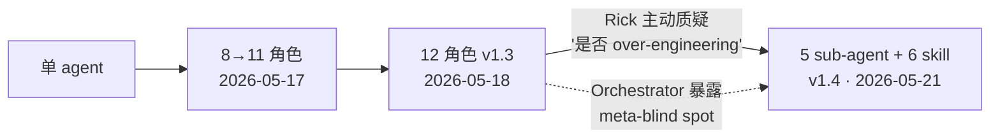

# S03 个人 AI 工作流系统全景

> 问题：当一个 power user 把 AI 用到极致，他用到的究竟是"更强的模型"，还是"更系统的工作流"？本节用**系统解剖**视角，把 Rick 散落的 skill 生态、memory 治理、routines、vault 协议拆开，看它们是不是其实早已**拼成了一台机器**——并主张：在模型能力同质化的今天，**个人工作流的系统化程度，才是真正的 AI 杠杆率**。这是一个判断陈述要去证伪的对象，不是一句口号。

本节点是整套自我民族志专题里**唯一一个把 Rick 自己当作"被解剖的系统"**的架构剖面。研究对象独一无二（n=1 的极端 power user），没有竞品，因此方法不是横向对照，而是**自我民族志式的内部拆解**——可观察的部分（skill 设计史、vault 结构、本工厂的运作）如实分析；需要内省的部分（信任校准、注意力分配）一律留 `〔Rick 待填〕` 模板，绝不替他编造。这本身就是分析式自我民族志（Anderson 2006）"narrative visibility + analytic reflexivity"的诚实做法：研究者在文本里可见，但不把自己的主观状态伪装成观测数据。

---

## §0 为什么是"系统"视角而不是"工具清单"视角

谈"某人怎么用 AI"，最默认、也最错的框架，是列一张**工具清单**："他用 Claude Code，他开了 memory，他写了几个 skill。"这张清单能查出来，但解释不了任何事——因为清单是**并列**的，而真实的杠杆来自**耦合**。

正确的框架是**系统视角**：把这些组件看成一台有**分层、有数据流、有反馈回路**的机器。判断一个工作流的成熟度，不看它有几个组件，看三件事：(1) 组件之间有没有**接口契约**（一个组件的输出能不能被下一个组件无摩擦消费）；(2) 有没有**状态隔离**（哪些东西常驻、哪些一次性、哪些必须沙盒）；(3) 有没有**反馈回路**（系统能不能观察自己、并改自己）。

用这三条标尺去量 Rick，会发现他的工作流不是"用得多"，而是**被工程化了**。下面这张表是本节的解剖刀——它把零散组件映射到一个标准的系统分层上，每一层都有可观察的证据。

| 系统层 | 在 Rick 工作流里的对应物 | 角色（类比软件系统） | 可观察证据 |
|---|---|---|---|
| **能力层** | Claude Code + Claude / Agent | CPU / 运行时 | [Claude Code](/kb/ai-公司与产品/claude-code/) 体感是 0414 的研究对象 |
| **过程封装层** | skill 生态（trip 五件套、intellectual-lens、skill-creator） | 函数库 / 可复用 procedure | trip-discover/evaluate/macro/structure/qa；[trip-structure skill](/kb/工具/trip-structure-skill/) |
| **状态层** | memory（allowlist 索引头）+ vault（外置详细内容） | 内存 vs 磁盘 | [Claude routines 调研与 memory allowlist 设计](/kb/产品/claude-routines-调研与-memory-allowlist-设计/) |
| **编排层** | sub-agent 架构（v1.4：5 agent + 6 skill） | 调度器 / 进程管理 | PKM 设计哲学与演化史 演化档案 |
| **治理层** | vault CLAUDE.md 六原则（沙盒、分层产物） | 权限系统 / CI 守卫 | vault 根 CLAUDE.md（六原则） |
| **反馈层** | 过拟合诊断、over-design 检验、SABCD 评级 | 监控 / 自检 / 回归测试 | [AI 记忆过拟合与泛化能力](/kb/基础知识库/ai-记忆过拟合与泛化能力/)；本工厂 SABCD pipeline |

判断主轴在此显形：**这六层若彼此孤立，就只是"会用 AI 的人"；若它们咬合成一条数据流并有反馈回路，就是一台"AI 杠杆机"。** 杠杆率 = 系统化程度，不是使用频率。

---

## §1 过程封装层：把 procedural knowledge 工程化

最底层的可观察事实：Rick 不"用" skill，他**设计并迭代** skill。这是一个范式差别。普通用户把 skill 当现成工具调用；Rick 把 skill 当作 [Skill 系统的本质](/kb/ai-协作方法论/skill-系统的本质/) 所说的"procedural knowledge 的文档化封装"——一种可被版本控制、可被重写、可被 over-design 检验的**软件资产**。

证据链（均有对话档案与时间戳）：

- **trip 五件套**（trip-discover / trip-evaluate / trip-macro / trip-structure / trip-qa）由 Rick 在"发散 → 收敛 → 明确指令 → 机制核查"四步节奏中系统设计（2026-03-31 至 04-01 档案）。这不是写一个 prompt，是设计一个**有职责边界的函数家族**：discover 负责生成、evaluate 负责单项判断、structure 负责排程、qa 负责对抗审计。职责分离本身就是系统设计。
- **trip-structure skill** 有完整的 `over-design → 被 Rick 拉回 → 收敛` 迭代轨迹（2026-04-03，由 skill-creator 这个**元 skill** 重写）。"用 skill 写 skill"是典型的自举（bootstrap）行为，标志着这一层已经有了**生产工具链**，而非手工作坊。详见 [trip-structure skill](/kb/工具/trip-structure-skill/)。
- **intellectual-lens skill** 用"竞品输出对照"做 prompt 工程：拿另一个 AI 的分析输出当参照系，定位差距出在 prompt 的哪一步，局部修补（2026-04-05）。这是把 A/B 测试的工程方法搬进了个人 prompt 迭代。

> [!note] 接口契约才是这一层的命门
> 五件套之所以是"系统"而非"五个独立 prompt"，关键在于 trip-discover 的输出（SABCD 评级的选项菜单）能被 trip-structure 直接消费为排程输入。**一个 skill 的输出 schema = 下一个 skill 的输入 schema**，这就是接口契约。没有契约的 skill 集合是工具抽屉；有契约的才是流水线。

---

## §2 状态层：allowlist 思维与"内存/磁盘"分离

第二个可观察的系统升级，是 Rick 在 memory 治理上的认知转型（2026-05-13 档案），详见 [Claude routines 调研与 memory allowlist 设计](/kb/产品/claude-routines-调研与-memory-allowlist-设计/)。

转型的内容：从 **blocklist 思维**（列举"不要包含什么"）切换到 **allowlist 思维**（只保留索引头，详细内容外移到 Obsidian）。并且配套两个可观察的行为：(1) 主动要求 AI **反向删除**此前生成的排除式记忆条目；(2) 立一条方法论原则写进记忆——"先 dump 工具/能力矩阵，再在矩阵内构思方案"。

这个转型用系统视角看，本质是**把 memory 重新定位为"内存"，把 vault 重新定位为"磁盘"**：

| 维度 | blocklist 旧模型 | allowlist 新模型 |
|---|---|---|
| memory 装什么 | "是什么"的细节（易膨胀） | 只装"指向哪里"的索引头 |
| 增长曲线 | 单调增（条目越积越多） | 有界（索引头数量受控） |
| 失效模式 | 上下文污染、过拟合 | 索引指错位置（可修） |
| 类比 | 把所有数据塞进 RAM | RAM 存指针，数据落盘 |

这条转型直接呼应了 [AI 记忆过拟合与泛化能力](/kb/基础知识库/ai-记忆过拟合与泛化能力/)：blocklist 之所以危险，是因为 memory 里堆的偏好细节会让 AI **过拟合 Rick 的历史审美**，丧失泛化。allowlist 把细节外置，等于给系统强加了一个**正则化约束**——内存里没有足够的细节让它过拟合。

学术上这有一条意外的对接点。Lee 与 See（2004，*Human Factors*，"Trust in Automation: Designing for Appropriate Reliance"）提出**信任校准**：用户对系统的信任应与系统实际可靠性匹配，偏高是 overtrust，偏低是 undertrust。allowlist 设计可以读作一种**结构性的信任校准**——Rick 不让 memory 常驻"它了解我的全部"，等于在系统层面**主动压低了对 AI 长期记忆的信任**，把校准权留给每次任务现场调取的、可核查的 vault 内容。这是把"信任校准"从心理状态变成**架构约束**的一手案例。

---

## §3 编排层：从 12-agent 主动塌缩到 v1.4

第三层是最能体现"反馈回路"的：Rick 对自己**搭建的 AI 协作架构本身**做了 over-design 检验。

可观察的演化史（PKM 设计哲学与演化史）：

v1.3 是 12 个角色（Enricher / Integrator / Content Auditor / Cleaner / Merger / Curator / Conceptualizer / Linker / Scout / Orchestrator / HRBP / Consultant）。2026-05-21 早，Rick **主动**提出"12 agent 是否 over-engineering"的挑战——这个挑战逼出了 Orchestrator 的 meta-blind spot（编排者自己看不见自己冗余），结论是塌缩为 5 sub-agent + 6 skill 的 v1.4。

判别依据是一个 **A/B/C/D 框架**：只有真正需要"独立 context 隔离"的才保留为 agent，其余降级为 skill。这条判据精确呼应了 [Skill 系统的本质](/kb/ai-协作方法论/skill-系统的本质/) 与 0411 专题 [A02 抽象层级辨析·Harness Framework Agent Skill Orchestrator](/kb/专题-安全对齐与失败/a02-抽象层级辨析-harness-framework-agent-skill-orchestrator/) 里对"agent vs skill"抽象层级的辨析：**agent 的成本是一份独立 context window，skill 的成本只是一段被注入的指令**。当一个"角色"不需要隔离的上下文，把它做成 agent 就是纯浪费。

这是本专题里**最干净的"反馈回路"证据**：系统能观察自己（发现 over-design），能改自己（塌缩架构），并且有可复述的判据（A/B/C/D）。一个工作流到了能对自己的编排层做回归式精简，它就不再是工具集合，而是有**自我治理能力的系统**。

---

## §4 治理层：vault CLAUDE.md 的"写权限沙盒"

如果说前三层是"能力"，治理层是"约束"。Rick 亲自设计的 vault 根目录 CLAUDE.md 六原则，最值得拆的是两条：

- **原则四（三步 ingestion）**：AI 产出一律先入 `_ai_review/` 沙盒，Rick 审阅通过后才 move 到主区。这是**工程化的 AI 写权限隔离**——等价于软件工程里"AI 不能直接 push 到 main，必须走 PR + review"。在业界 AI-augmented PKM 实践中，这种把 AI 默认当作"不可信写入方"的设计相当少见。
- **原则六（三层产物体系）**：按**触发条件**而非时间周期分层产物，明确拒绝"周报/月报"概念，要求 AI 自动判断复盘触发条件。这是用**事件驱动**取代**轮询**——又一个把软件架构直觉迁移进个人工作流的证据。

> [!note] 这一层在干的事，是给整个系统装"CI 守卫"
> 能力层越强、AI 写得越多，未经审阅的内容污染主库的风险越大。原则四的沙盒不是不信任 AI 的能力，而是**信任校准的工程落地**：把"我对这条产出信任几分"这个本来发生在 Rick 脑子里的判断，外化成一道**强制的 review gate**。这正是本专题反复出现的母题——把内省状态变成架构约束。

这里要做一处 **failure scenario 显式标注**：原则四的三步 ingestion 在高频小产出场景下会制造**流程阻力**——每一条 AI 产出都要过沙盒、等审阅，可能让"随手记一笔"的轻量需求被流程劝退。系统化是有成本的，沙盒越严，轻量交互越笨重。这条边界需要 Rick 自己确认：

> 〔Rick 待填：三步 ingestion 在实际操作中是否制造了流程阻力？六条原则里，哪一条最容易被你自己跳过？是不是某些轻量产出你根本不走 `_ai_review`，直接手动落主区了？〕

---

## §5 反馈层与"本工厂"这个 meta-case

把六层串起来看，最有说服力的不是任何单个组件，而是**你正在读的这套东西本身**。

本次"专题工厂"（0412–0423 多 agent 知识生产流水线）是一个**正在运行、可观察的 meta-case**——它恰好是 Rick 全套工作流系统**同时启动**的一次实录：

1. **能力层 + 过程封装层**：旅途中（2026-04-12 至 04-23，美国南方民权路线 + 东海岸自驾）现场触发 AI 对话，全程实时调用 trip-discover / trip-structure / intellectual-lens。
2. **状态层**：约 40+ 条对话存入 `99Archive/9910 claude 对话存档/`（日期戳 20260412–20260423）。
3. **反馈层**：对话经 SABCD 评级分类（`99Archive/_README.md` 记录的 Phase 1 pipeline 评级分布：S / A / B / C 四档，原始档案可查具体数）。
4. **编排层**："write-first 多 agent 流水线"——旅途中先产出原始对话（write first），后续由 Phase 1 批量 pipeline（Enricher / Integrator 等 agent）处理入库，而非逐条手工。约 40+ 升格笔记节点散落到 `01学习/0123美国近现代史/` 与 `60流浪/美国/`，并跨专题连接（现场博物馆观察 → 美国史框架 → 政治哲学 → 人物如 林肯第二次就职演说的神学解读）。

这个 meta-case 是分析式自我民族志的标准动作：研究者既是**系统的设计者**，又是**系统的被研究对象**，还是**写这篇剖面的人**。Anderson（2006）要求的 "complete member researcher" 在这里是字面意义上的成立——没有人比 Rick 更"完整地身处"这个被研究的场域。

但这正是要划清边界的地方。可观察的是**流水线结构**（先写后处理、评级分布、节点分布）；**不可观察、绝不编造**的是 Rick 跑这条流水线时的主观状态：

> 〔Rick 待填：write-first 多 agent 流水线运行时，你感受到先写后处理 vs 实时处理的认知差异吗？SABCD 评级时，S 级和 C 级之间你自己的价值判断依据是什么——在评级边界模糊处你怎么裁决？trip 五件套里哪些在旅途中频繁触发、哪些实际被你弃用？v1.4 塌缩到底是认知疲劳驱动、架构美感驱动，还是纯效率驱动？〕

不替他填，是这篇剖面诚实性的底线，也是它区别于"营销文案式自我吹捧"的地方。

---

## 判断主轴：把工作流系统化时，90% 的人会错的四个点

这一节是本节点的命门。每点带"症状 → 为什么会错 → 正确做法 → 真实反例"。

**错点一：把"工具多"当成"系统强"。**
- 症状：开了 memory、装了一堆 skill、配了 MCP，就觉得自己工作流很高级。
- 为什么会错：组件是**并列加法**，系统是**耦合乘法**。没有接口契约和反馈回路，再多组件也只是工具抽屉。
- 正确做法：用本节 §0 三标尺自检——接口契约 / 状态隔离 / 反馈回路，任缺其一就不是系统。
- 真实反例：Rick 的 trip 五件套之所以是系统，是因为 discover 的输出 schema 喂得进 structure；若五个 skill 各写各的、输出格式不互通，数量再多也是抽屉。

**错点二：memory 越全越好（blocklist 直觉）。**
- 症状：把所有偏好、历史、细节都塞进 memory，求"它越来越懂我"。
- 为什么会错：memory 的偏好细节会让 AI 过拟合历史审美、丧失泛化（[AI 记忆过拟合与泛化能力](/kb/基础知识库/ai-记忆过拟合与泛化能力/)），且单调膨胀、污染上下文。
- 正确做法：allowlist——memory 只存索引头（指针），细节落 vault（磁盘），靠现场调取。
- 真实反例：Rick 2026-05-13 主动反向删除排除式记忆条目，正是发现 blocklist 在膨胀失控后的纠偏。

**错点三：agent 越多越专业（编排层 over-design）。**
- 症状：给每个职责都配一个独立 agent，12 个角色显得分工精细。
- 为什么会错：agent 的成本是一份独立 context window；不需要上下文隔离的角色做成 agent 是纯浪费，还会让编排者自己产生 meta-blind spot。
- 正确做法：A/B/C/D 判据——只有真需要"独立 context 隔离"的保留为 agent，其余降级 skill。
- 真实反例：Rick 把 12-agent v1.3 主动塌缩为 5 agent + 6 skill 的 v1.4（2026-05-21）。

**错点四：AI 写权限默认可信（没有治理层）。**
- 症状：让 AI 直接写进知识库主区，省去审阅环节。
- 为什么会错：能力层越强、产出越多，未审阅内容污染主库的风险越大；这是把信任校准（Lee & See 2004）整个跳过了。
- 正确做法：三步 ingestion——AI 产出先入 `_ai_review/` 沙盒，审阅通过才 move，等价于"AI 不能直 push main"。
- 真实反例：vault CLAUDE.md 原则四就是这道 review gate；本节点自己此刻就躺在 `_ai_review/0423-autoethno/` 沙盒里等审阅，是该原则的活体演示。

---

## 产品 PM 视角补盲

工程视角看完工作流的"耦合度"，PM 视角要补三个"看走眼"点：

1. **可迁移性 vs 个人化的张力**：Rick 这套系统高度个人化（allowlist 索引头是他自己的 vault 结构、A/B/C/D 是他自己的判据）。作为 AI PM，危险在于**误以为个人最优解能直接产品化**。一个 power user 的工作流是"自己给自己当工程师"的产物，普通用户既无意愿也无能力维护接口契约和沙盒——这是 lead user 研究（von Hippel, 1986，*The Sources of Innovation*）反复警告的：lead user 的需求**领先但不代表大众**，把 n=1 的极端方案当 PRD 会做出无人维护的复杂系统。
2. **系统化的隐性维护成本**：每一层（接口契约、沙盒、评级 pipeline）都要持续维护。PM 在评估"给用户上一套工作流系统"时，必须把**维护负担**计入总成本——这正是 Rick 自己把 12-agent 塌缩到 v1.4 的动机之一（系统的边际维护成本超过边际收益时，正确动作是**减法**）。
3. **杠杆率不等于幸福感**：本节主张"系统化程度 = AI 杠杆率"，但杠杆率高不等于体验好。Buçinca 等（2021，"To Trust or to Think"，ACM PACMHCI）的实验发现：认知强制干预（forced pauses）确实降低过度依赖、提升判断质量，但**用户满意度最低**。三步 ingestion 的沙盒就是一种认知强制——它提升了产出质量，却给轻量交互装了摩擦。PM 不能只优化杠杆率，要权衡杠杆率与体验。

---

## 对手框架回应：系统化是不是过度工程？

**业界反方立场（接受 + 边界）：**

- **反方一：极简主义工作流派。** 一种有真实拥趸的立场认为，最好的 AI 工作流就是"一个干净的对话框 + 强模型"，所有 skill / memory / agent 编排都是**过早优化**，徒增维护负担，模型一升级就全部作废。
  - **接受**：这条批评对 90% 的用户是对的。对大多数任务，系统化的边际收益确实低于维护成本——Rick 自己的 12→v1.4 塌缩就承认了这一点。而且模型能力快速上升时，今天的 skill 明天可能被原生能力吞掉，这是真实的折旧风险。
  - **边界**：但对**高频、高结构、跨会话**的工作（如本工厂这种批量知识生产），系统化的收益是非线性的——接口契约让产出可被流水线消费，沙盒让产出可被信任，反馈回路让系统可被精简。极简派的盲点是把"单次任务"当成全部，看不见**跨会话的复利**。Rick 赌的是：在知识生产这类长期、累积型任务上，系统化的复利会跑赢模型折旧。

- **反方二：认知脱技能化担忧。** Kim（2026，*Consumer Psychology Review*，"From algorithm aversion to AI dependence"）等综述担忧：工作流越系统化、AI 接管越多，使用者的独立能力越萎缩。
  - **接受**：这条担忧对"用 AI 替代思考"的工作流成立，证据虽仍是早期、缺大样本 RCT，但方向值得警惕。
  - **边界**：但 Rick 的系统恰好是**反方向**设计的——三步 ingestion 的审阅 gate、SABCD 评级、over-design 检验，都是**强制 Rick 保持判断**的机制，而非替他判断。系统化在这里不是"卸载认知"，而是"把认知前置到设计阶段"。当然这是赌注：这套机制是否真的防住了脱技能，需要纵向自我观察才能验证——见上文 〔Rick 待填〕。

---

## 跨域呼应：Polanyi 的默会知识与"系统化的极限"

调度一个跨域资源：Polanyi 的默会知识（tacit knowledge），见 [Polanyi 默会知识与提示工程的认识论张力](/kb/基础知识库/polanyi-默会知识与提示工程的认识论张力/)。

Polanyi 的核心命题是"我们知道的比我们能说出的多"（we know more than we can tell）。把它对准本节点的判断主轴，会逼出一个尖锐问题：**Rick 的工作流系统化，到底把多少默会知识"显化"成了可封装的 procedure，又有多少根本无法显化？**

skill 是 procedural knowledge 的文档化封装——但能被封装进 skill 的，恰恰是**已经可言说的那部分**。trip-evaluate 能封装 SABCD 评级的**规则**，却封装不了 Rick 在评级边界模糊处那一瞬间的**判断手感**（这正是上文留给他的 〔Rick 待填〕）。allowlist 能把"是什么"外置到 vault，却外置不了"何时该调哪条"的**情境感**。

这给"系统化程度 = 杠杆率"这条判断划了一道认识论上的天花板：**系统化只能放大可显化的知识，放大不了默会的部分。** Rick 工作流真正不可复制的杠杆，可能恰恰不在那些可观察的 skill / memory / agent 里，而在那些**他能做却说不清、因而无法封装进 skill** 的默会判断里。这也解释了为什么本专题必须用自我民族志而非纯结构分析——结构能拆 skill，拆不了手感；手感只能由身处其中的人来 narrate，且永远 narrate 不全。

> [!note] 这道天花板也是对错点一的认识论加固
> "工具多 ≠ 系统强"在 Polanyi 这里有了更深的版本：**就算系统再完备，它能封装的也只是默会知识的显化残片**。所以再强的工作流系统，也替代不了那个能持续把默会判断喂进系统、并在系统失效处接管的人。系统化是杠杆，不是替身。

---

## PM 决策启示

- **面试怎么用**：被问"你怎么用 AI"时，不要列工具清单（错点一）。讲一条**耦合链**：现场调用 skill → 评级入库 → 流水线处理 → 反馈精简架构，并能说清接口契约和反馈回路在哪。展示"我把 AI 当系统设计，不是当聊天机器人"。
- **选型怎么用**：评估一个 AI 工具/平台时，别比 feature list，比**系统化潜力**——它的输出有没有稳定 schema（能不能被下游消费）、有没有状态隔离机制、有没有让用户审阅/校准的 gate。没有这三样的工具，用户搭不出系统。
- **复现怎么用**：要把个人工作流做成产品，先问"目标用户愿不愿意当自己的工程师"。lead user 的系统不能直接抄；产品化的关键是把**接口契约和沙盒做成默认、隐形、零维护**，让普通用户不维护也能享受系统化收益——这才是从 n=1 power user 走到 N 用户产品的真问题。

---

## 与已有节点的关系

- 对 [Claude routines 调研与 memory allowlist 设计](/kb/产品/claude-routines-调研与-memory-allowlist-设计/)：**深化 + 升级对照**。旧节点记录的是 allowlist 这一**单点**设计决策；本节点把它**重新定位为整个系统的"状态层"**，并接上 Lee & See 的信任校准框架，升高了一个抽象层——从"一条 memory 设计"到"系统分层里的一层"。不复述旧节点的设计细节。
- 对 [Skill 系统的本质](/kb/ai-协作方法论/skill-系统的本质/)：**对话**。旧节点辨析"skill 是什么"（procedural knowledge 封装）；本节点回答"skill 在一个真实 power user 的系统里**占哪一层、与哪些层耦合**"，把概念辨析落到系统拓扑里。
- 对 [AI 记忆过拟合与泛化能力](/kb/基础知识库/ai-记忆过拟合与泛化能力/)：**补缺**。旧节点讲过拟合的诊断与矫正；本节点补上"allowlist 作为结构性正则化"这一**架构层解法**，把诊断接到设计。
- 对 0411 专题 [A02 抽象层级辨析·Harness Framework Agent Skill Orchestrator](/kb/专题-安全对齐与失败/a02-抽象层级辨析-harness-framework-agent-skill-orchestrator/) 与 [S03 Harness Engineering 全景](/kb/专题-安全对齐与失败/s03-harness-engineering-全景/)：**跨专题升级对照**。0411 在**通用抽象层**辨析 agent / skill / orchestrator；本节点提供一个**具身的 n=1 实例**，看这些抽象层在 Rick 真实工作流里如何落地、如何被 A/B/C/D 判据驱动塌缩。0411 是"理论 harness"，本节是"一个人的 harness 实录"。
- 对 [Polanyi 默会知识与提示工程的认识论张力](/kb/基础知识库/polanyi-默会知识与提示工程的认识论张力/)：**调用 + 边界化**。借 Polanyi 给"系统化 = 杠杆率"这条判断划认识论天花板。

---

## 关联节点

**核心（必读）**
- [Claude routines 调研与 memory allowlist 设计](/kb/产品/claude-routines-调研与-memory-allowlist-设计/) — 状态层一手设计档案
- [Skill 系统的本质](/kb/ai-协作方法论/skill-系统的本质/) — 过程封装层的概念基座
- [trip-structure skill](/kb/工具/trip-structure-skill/) — 过程封装层的迭代实例
- [AI 记忆过拟合与泛化能力](/kb/基础知识库/ai-记忆过拟合与泛化能力/) — 状态层的反馈机制
- PKM 设计哲学与演化史 — 编排层 12→v1.4 演化档案
- [A02 抽象层级辨析·Harness Framework Agent Skill Orchestrator](/kb/专题-安全对齐与失败/a02-抽象层级辨析-harness-framework-agent-skill-orchestrator/) — 编排层的抽象层级对照（0411）
- [Polanyi 默会知识与提示工程的认识论张力](/kb/基础知识库/polanyi-默会知识与提示工程的认识论张力/) — 系统化极限的认识论框架

**延伸（可选）**
- [旅行规划 Skill 套件系统设计](/kb/产品/旅行规划-skill-套件系统设计/) — 五件套的系统设计原档
- [AI PM 知识图谱框架设计](/kb/产品/ai-pm-知识图谱框架设计/) — 另一条 PM 式框架操控证据
- [S03 Harness Engineering 全景](/kb/专题-安全对齐与失败/s03-harness-engineering-全景/) — 0411 通用 harness 全景（跨专题对照）
- [Claude Code](/kb/ai-公司与产品/claude-code/) — 能力层运行时
- [Agent](/kb/基础知识库/agent/) — 编排层基本单元
- [AI PM 知识图谱·总索引](/kb/ai-pm-知识图谱/ai-pm-知识图谱-总索引/) — 全图谱入口

---

## 修订日志

- R1（2026-06-07）：首稿。建立六层系统解剖框架（能力/过程封装/状态/编排/治理/反馈层），落地判断主轴四件套、对手框架两路回应（极简主义 + 脱技能化）、Polanyi 跨域呼应（系统化的认识论天花板）、与 0414/0418/0422 及核心概念节点的升级对照。保留 3 处 `〔Rick 待填〕` 内省模板（流程阻力、流水线主观体验、塌缩动机）。待核实数字已标注，下一步 grounding pass 核 Lee & See / Buçinca / von Hippel / Kim 文献与本工厂 SABCD 评级分布具体数。
